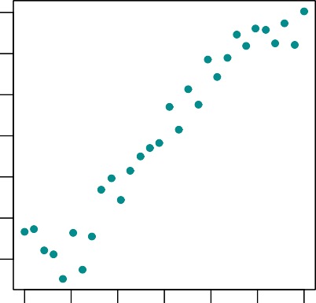
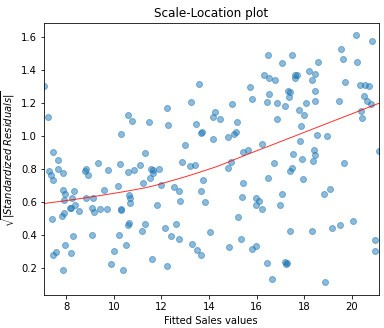
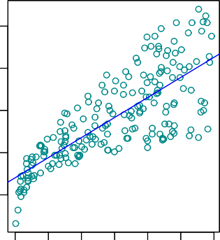
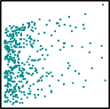
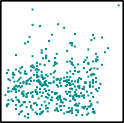
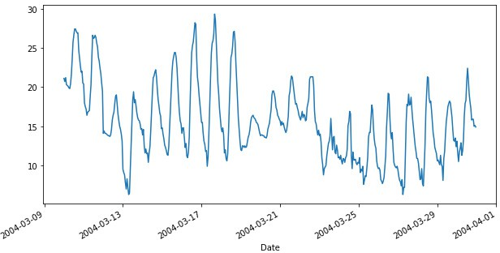
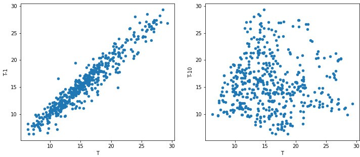
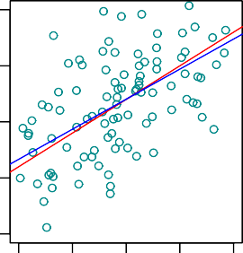

> Mirko Birbaumer Klaus Frick
>
> Peter Büchel Simon van Hemert
>
> **Predictive Modeling**
>
> Lecture Notes

{width="6.442159886264217in" height="5.9in"}

> Hochschule Luzern - Technik und Architektur
>
> **Contents**

1.  [Probability Models for Measurement Data](#_bookmark0) 1

    1.  [Continuous Random Variables and Probability
        Distributions](#continuous-random-variables-and-probability-distributions)
        . . . . . 1

        1.  [Probability Density](#_bookmark3) . . . . . . . . . . . . .
            . . . . . . . . . . . . 5

        2.  [Summary Statistics of Continuous
            Distributions](#summary-statistics-of-continuous-distributions)
            . . . . . . . . 7

    2.  [Important Continuous
        Distributions](#important-continuous-distributions) . . . . . .
        . . . . . . . . . . . . . 9

        1.  [Uniform Distribution](#uniform-distribution) . . . . . . .
            . . . . . . . . . . . . . . . . . 9

        2.  [Exponential Distribution](#exponential-distribution) . . .
            . . . . . . . . . . . . . . . . . . . 11

        3.  [Normal Distribution (Gaussian
            distribution)](#normal-distribution-gaussian-distribution) .
            . . . . . . . . . 15

    3.  [Functions of a Random
        Variable](#functions-of-a-random-variable) . . . . . . . . . . .
        . . . . . . . . . . . 17

        1.  [Linear Transformations of Random
            Variables](#linear-transformations-of-random-variables) . .
            . . . . . . . . 18

        2.  [Non-Linear Transformations of Random
            Variables](#non-linear-transformations-of-random-variables)
            . . . . . . . 23

    4.  [Functions of Several Random
        Variables](#functions-of-several-random-variables) . . . . . . .
        . . . . . . . . . . 25

        1.  [Independence and i.i.d.
            Assumption](#independence-and-i.i.d.-assumption) . . . . . .
            . . . . . . . . . 26

        2.  [Summary Statistics of *S~n~* and
            ***X**~n~*](#summary-statistics-of-sn-and-xn) . . . . . . .
            . . . . . . . . . . 27

        3.  [Distributions of *S~n~* and
            ***X**~n~*](#distributions-of-sn-and-xn) . . . . . . . . . .
            . . . . . . . . . . 29

2.  [Statistics for Measurement Data](#_bookmark37) 35

    1.  [Assess the Normal Distribution
        Assumption](#assess-the-normal-distribution-assumption) . . . .
        . . . . . . . . . . 35

        1.  [Q-Q Plot](#q-q-plot) . . . . . . . . . . . . . . . . . . .
            . . . . . . . . . . . . 36

        2.  [Normal Plot](#normal-plot) . . . . . . . . . . . . . . . .
            . . . . . . . . . . . . . 39

    2.  [Parameter Estimation for Continuous Probability
        Distributions](#parameter-estimation-for-continuous-probability-distributions)
        . . . 41

        1.  [Method of
            Moments](#parameter-estimation-for-continuous-probability-distributions)
            . . . . . . . . . . . . . . . . . . . . . . . . 41

        2.  [Method of Maximum
            Likelihood](#method-of-maximum-likelihood) . . . . . . . . .
            . . . . . . . . 44

    3.  [Statistical Tests and Confidence Intervals Normally Distributed
        Data](#statistical-tests-and-confidence-interval-for-normally-distributed-data)
        47

        1.  [*z*-Test (*σ~X~* known)](#_bookmark53) . . . . . . . . . .
            . . . . . . . . . . . . . . . 48

        2.  [*t*-Test (*σ~X~* unknown)](#_bookmark58) . . . . . . . . .
            . . . . . . . . . . . . . . . 52

        3.  [***P***-Value](#p-value) . . . . . . . . . . . . . . . . .
            . . . . . . . . . . . . . . 58

        4.  [Confidence Intervals for *µ*](#confidence-intervals-for-µ)
            . . . . . . . . . . . . . . . . . . . . . 61

    4.  [Statistical Significance and Relevance in Statistical
        Tests](#statistical-significance-and-relevance-in-statistical-tests)
        . . . . . . . . 63

3.  [Joint Distributions](#_bookmark72) 65

    1.  [Joint, Marginal and Conditional
        Distributions](#joint-marginal-and-conditional-distributions) .
        . . . . . . . . . . . . . 65

        1.  [Discrete Random Variables](#discrete-random-variables) . .
            . . . . . . . . . . . . . . . . . . 65

        2.  [Continuous Random Variables](#continuous-random-variables)
            . . . . . . . . . . . . . . . . . . 68

    2.  [Expected Value of Several Random
        Variables](#expected-value-of-several-random-variables) . . . .
        . . . . . . . . . . 72

    3.  [Covariance and Correlation](#_bookmark80) . . . . . . . . . . .
        . . . . . . . . . . . . . 73

    4.  [Bivariate Normal Distribution](#bivariate-normal-distribution)
        . . . . . . . . . . . . . . . . . . . . . . . 80

    5.  [Principal Component Analysis](#principal-component-analysis1) .
        . . . . . . . . . . . . . . . . . . . . . 81

<!-- -->

I.  [Regression Analysis](#_bookmark98) 92

<!-- -->

4.  [Introduction to Regression Analysis](#_bookmark99) 93

    1.  [What is Regression?](#what-is-regression) . . . . . . . . . . .
        . . . . . . . . . . . . . . . . . . 93

    2.  [Why Estimate ***f*** ?](#why-estimate-f) . . . . . . . . . . .
        . . . . . . . . . . . . . . . . . . . 96

        1.  [Prediction](#prediction) . . . . . . . . . . . . . . . . .
            . . . . . . . . . . . . . 96

        2.  [Inference with Respect to
            ***f***](#inference-with-respect-to-f) . . . . . . . . . . .
            . . . . . . . . . 98

    3.  [How do we Estimate ***f*** ?](#how-do-we-estimate-f) . . . . .
        . . . . . . . . . . . . . . . . . . . . . 99

5.  [Simple Linear Regression](#_bookmark113) 103

    1.  [Model for Simple Linear
        Regression](#model-for-simple-linear-regression) 103

        1.  [Introduction](#introduction) 103

        2.  [Simple Linear Regression
            Model](#simple-linear-regression-model) 104

    2.  [Estimating the Coefficients](#estimating-the-coefficients) 105

    3.  [Hypothesis Tests and Confidence
        Intervals](#hypothesis-tests-and-confidence-intervals) 111

        1.  [Assessing the Accuracy of the Coefficient
            Estimates](#hypothesis-tests-and-confidence-intervals) 111

        2.  [Hypothesis Test](#hypothesis-test) 116

        3.  [Confidence Intervals for Regression
            Coefficients](#confidence-intervals-for-regression-coefficients)
            119

    4.  [Confidence and Prediction Intervals for the
        Response](#confidence-and-prediction-intervals-for-the-response)
        120

        1.  [Confidence Interval for the Response
            Variable](#confidence-interval-for-the-response-variable)
            120

        2.  [Prediction Intervals](#prediction-intervals) 124

6.  [Testing Model Assumptions: Residual Analysis](#_bookmark153) 129

    1.  [Assumptions Concerning the Error Term
        ***ε***](#assumptions-concerning-the-error-term-ε) 129

        1.  [Non-Linear
            Relationship](#relationship-between-response-variable-and-predictor-is-non-linear)
            134

        2.  [Assessing the Validity of the Model
            Assumptions](#assessing-the-validity-of-the-model-assumptions)
            135

    2.  [Diagnostics Instruments](#diagnostics-instruments) 136

        1.  [The Residual Standard Error and the *R*^2^
            Statistic](#the-residual-standard-error-and-the-r2-statistic)
            136

        2.  [Diagnostics Tool for Testing Model Assumption
            E\[*ε*\]](#diagnostics-tool-for-testing-model-assumption-eε-0)
            140

        3.  [Diagnostics Tool for Testing Model Assumption
            Var\[*ε*](#diagnostics-tool-for-testing-the-model-assumption-varεi)*~i~*[\]
            constant](#diagnostics-tool-for-testing-the-model-assumption-varεi)
            149

        4.  [Diagnostics Tool for Normal Distribution Assumption of
            Errors](#diagnostics-tool-for-the-normal-distribution-assumption-of-the-errors-εi)
            153

        5.  [Diagnostics Tool for Independence Assumption of Errors
            *ε*](#diagnostics-tool-for-independence-assumption-of-errors-εi)*~i~*
            . 158

        6.  [Outliers and High Leverage
            Points](#outliers-and-high-leverage-points) 161

        7.  [Summary](#summary-1) 165

    3.  [Treatment of Deficiency in Model
        Assumptions](#treatment-of-deficiency-in-model-assumptions) 169

        1.  [Therapeutical Treatment in the Case of
            E\[*ε*](#_bookmark218)*~i~*[\] /= 0](#_bookmark218) 169

        2.  [Therapeutical Treatment for
            Var\[*ε*](#_bookmark219)*~i~*[\] /= Constant](#_bookmark219)
            170

        3.  [Therapeutical treatment for Non-Normally Distributed
            *ε*](#therapeutical-treatment-for-non-normally-distributed-εi)*~i~*
            171

        4.  [Therapeutic Treatment for Outliers and High Leverage
            Points](#therapeutic-treatment-in-the-case-of-outliers-and-high-leverage-points)
            171

7.  [Multiple Linear Regression](#_bookmark224) 174

    1.  [Introduction](#introduction-1) 174

    2.  [Estimating the Regression
        Coefficients](#estimating-the-regression-coefficients) 180

    3.  [Some Important Questions](#some-important-questions) 183

        1.  [Is There a Relationship Between the Response and
            Predictors?](#is-there-a-relationship-between-the-response-and-predictors)
            184

        2.  [Deciding on Important
            Variables](#deciding-on-important-variables) 187

        3.  [How well does the Model fit the
            Data?](#how-well-does-the-model-fit-the-data) 187

        4.  [Predictions](#predictions) 190

    4.  [Variety of Regression
        Modeling](#variety-of-regression-modeling) 192

        1.  [Omitting Predictor
            Variables](#variety-of-regression-modeling) 192

        2.  [Qualitative Predictors](#qualitative-predictors) 196

        3.  [Extensions of the Linear
            Model](#extensions-of-the-linear-model) 205

        4.  [Model Assumptions in Multiple Linear
            Regression](#potential-problems-with-respect-to-model-assumptions-in-multiple-linear-regression)
            217

    5.  [The Marketing Plan](#the-marketing-plan) 228

8.  [Linear Model Selection](#_bookmark305) 234

    1.  [Introduction](#introduction-2) 234

    2.  [Subset Selection](#subset-selection) 235

        1.  [Stepwise Selection](#subset-selection) 235

        2.  [Backward Stepwise Selection](#backward-stepwise-selection)
            240

        3.  [Further Variable Selection
            Methods](#further-variable-selection-methods) 244

        4.  [Choosing the Optimal Model](#choosing-the-optimal-model)
            245

<!-- -->

II. [Classification](#_bookmark336) 256

<!-- -->

9.  [Introduction to Classification Problems](#_bookmark337) 257

10. [Logistic Regression](#_bookmark346) 263

    1.  [The Logistic Model](#the-logistic-model) 264

    2.  [Estimation of Regression
        Coefficients](#estimation-of-regression-coefficients) 270

    3.  [Predictions and Model
        Evaluation](#predictions-and-model-evaluation) 273

    4.  [Cross Validation](#cross-validation) 283

    5.  [Multiple Logistic Regression](#multiple-logistic-regression)
        285

<!-- -->

III. [Time Series Analysis](#_bookmark389) 290

<!-- -->

11. [Introduction to Time Series](#_bookmark390) 291

    1.  [Examples](#examples) 292

    2.  [Time Series with Python](#time-series-with-python) 296

        1.  [The DatetimeIndex class](#the-datetimeindex-class) 297

    3.  [Basic Transformation, Visualization, and Decomposition of Time
        Series](#basic-transformation-visualization-and-decomposition-of-time-series)
        303

        1.  [Data transformations](#data-transformations) 303

        2.  [Visualizations](#visualizations) 307

        3.  [Decomposition of time
            series](#decomposition-of-time-series) 311

12. [Mathematical Models for Time Series](#_bookmark461) 320

    1.  [Mathematical Concept of Time
        Series](#mathematical-concept-of-time-series) 320

    2.  [Measures of Dependence](#measures-of-dependence) 327

    3.  [Stationarity](#stationarity) 330

        1.  [Testing Stationarity](#testing-stationarity) 332

    4.  [Estimation of Correlation](#estimation-of-correlation) 335

        1.  [Estimation of the Mean Sequence](#_bookmark488) 335

        2.  [Estimation of the
            Autocovariance](#estimation-of-the-autocovariance) 336

13. [Forecasting Time Series](#_bookmark496) 341

    1.  [Autoregressive Models](#autoregressive-models) 342

        1.  [Definition and the Characteristic
            Polynomial](#autoregressive-models) 342

        2.  [Autocorrelation of AR(p)
            processes](#autocorrelation-of-arp-processes) 345

        3.  [Model fitting](#model-fitting) 351

        4.  [Forecasting AR(p) processes](#forecasting-arp-processes)
            354

14. [ARIMA](#_bookmark532) 360

    1.  [Repetition of Autoregressive
        Models](#repetition-of-autoregressive-models) 360

15. [Spectral Analysis](#_bookmark535) 362

    1.  [Introduction](#introduction-3) 362

    2.  [Supplementary Note on DFT](#introduction-3) 362

<!-- -->

A.  [Supplementary Material](#_bookmark538) 366

    1.  [Boltzmann Distribution](#boltzmann-distribution) 366

B.  [R-Code](#_bookmark540) 367

> **List of Tables**
>
> [2.1. Measurements of the concrete compression strength](#_bookmark41)
> . . . . . . . . . . 37

1.  [Example **weather stations**](#_bookmark75) . . . . . . . . . . . .
    . . . . . . . . . . 65

<!-- -->

1.  [**Advertising** Data Set : Regression Coefficients](#_bookmark229)
    176

2.  [**Advertising** Data Set : Least Squares Estimates for
    Coefficients](#_bookmark237) 181

3.  [**Advertising** Data Set : Correlation Matrix](#_bookmark238) 182

4.  [**Credit** Data Set : Regression Coefficients](#_bookmark265) 200

5.  [**Credit** Data Set : Regression Coefficients](#_bookmark273) 204

6.  [**Balance** Data Set : Regression Coefficients](#_bookmark294) 225

<!-- -->

1.  [Three cases extracted from the dataset **Default**](#_bookmark362)
    270

> **List of Figures**

[N](#_bookmark47)

[---](#_bookmark81)

1.  [Example of a cumulative distribution function.](#_bookmark2) . . .
    . . . . . . . . . . 5

2.  [Probability density of a random variable](#_bookmark5) . . . . . .
    . . . . . . . . . . . 8

3.  [Illustration of the quantile](#_bookmark6) . . . . . . . . . . . .
    . . . . . . . . . . . . . 9

4.  [Density function of the uniform distribution](#_bookmark9) . . . .
    . . . . . . . . . . 10

5.  [Density distribution function of the exponential
    distribution](#_bookmark16) . . . . . 13

6.  [Density distribution function of the normal
    distribution](#_bookmark21) . . . . . . . . 16

7.  [Density of the normal distribution](#_bookmark24) . . . . . . . . .
    . . . . . . . . . . . 17

<!-- -->

1.  [Q-Q-Plot on concrete compression strength](#_bookmark44) . . . . .
    . . . . . . . . . . 39

2.  [Q-Q plot for the concrete compression strength data
    set](#_bookmark46) . . . . . . . . 40

3.  [Normal Plot of (0, 1) and Cauchy distribution](#_bookmark47) . . .
    . . . . . . . . . 41

4.  [Normal Plots](#_bookmark50) . . . . . . . . . . . . . . . . . . . .
    . . . . . . . . . . . . . 42

5.  [Density function of the test statistic *Z*](#_bookmark54) . . . . .
    . . . . . . . . . . . . . 49

6.  [Density function of
    *t*](#_bookmark59)*~n~*[-distribution](#_bookmark59) . . . . . . . .
    . . . . . . . . . . . . 53

7.  [Interplay of statistical significance and relevance.](#_bookmark71)
    . . . . . . . . . . . . 64

<!-- -->

1.  [Integration domain for joint probability density](#_bookmark77) . .
    . . . . . . . . . . 70

2.  [Illustration of a two-dimensional density](#_bookmark78) . . . . .
    . . . . . . . . . . . 71

3.  [Bivariate density *f* (*x*, *y*) = (2*x* + 2*y*
    4*xy*)](#_bookmark81) . . . . . . . . . . . . . . . 74

4.  [Relation between independence and uncorrelatedness](#_bookmark82) .
    . . . . . . . . 77

5.  [Contour lines of a two-dimensional density](#_bookmark83) . . . . .
    . . . . . . . . . . 78

6.  [Example **USArrests**](#_bookmark88) . . . . . . . . . . . . . . .
    . . . . . . . . . . . . . 82

7.  [Example **USArrests**](#_bookmark90) . . . . . . . . . . . . . . .
    . . . . . . . . . . . . . 83

8.  [Example **USArrests**](#_bookmark94) . . . . . . . . . . . . . . .
    . . . . . . . . . . . . . 86

9.  [Example **USArrests**](#_bookmark95) . . . . . . . . . . . . . . .
    . . . . . . . . . . . . . 88

<!-- -->

1.  [**Advertising** Data Set: Scatter Plots](#_bookmark104) . . . . . .
    . . . . . . . . . . . . 94

2.  [**Income** Data set](#_bookmark105) . . . . . . . . . . . . . . . .
    . . . . . . . . . . . . . . . 96

3.  [Income as a function of Years of Education](#_bookmark111) 101

4.  [**Income** Data set](#_bookmark112) 102

<!-- -->

1.  [**Advertising** Data Set : Regression Lines](#_bookmark120) 106

2.  [**Advertising** Data Set : Least Squares Fit](#_bookmark121) 107

3.  [**Advertising** Data Set: Least squares fit](#_bookmark126) 110

4.  [Population Regression Line](#_bookmark130) 112

5.  [Ten least squares lines for : *Y* = 2 + 3*X* + *ε*](#_bookmark132)
    113

6.  [Confidence Band](#_bookmark147) 124

7.  [Prediction Band](#_bookmark152) 127

<!-- -->

1.  [Simulation of *y*](#_bookmark156)*~i~* [= 2 +
    3*x*](#_bookmark156)*~i~* [+ *ε*](#_bookmark156)*~i~* 130

2.  [Simulation of Error Term](#_bookmark157) 131

3.  [Simulation of Non-Constant Variance](#_bookmark158) 132

4.  [Simulation of Distribution of Error Terms](#_bookmark159) 132

5.  [Scatter Plots with Normally-Distributed Error Terms](#_bookmark160)
    134

6.  [Violation of Model Assumption E *ε*](#_bookmark163)*~i~* [=
    0](#_bookmark163) 135

[{ }](#_bookmark163)

7.  [Scatterplot and Tukey-Anscombe Plot for the **Advertising** Data
    Set](#_bookmark174) 141

8.  [Smoothing Curves with Rectangular Kernel](#_bookmark177) 144

9.  [Tukey-Anscombe Plot for the Example **Income**](#_bookmark181) 146

10. [Band of Smoothing Curves](#_bookmark183) 147

11. [Tukey-Anscombe for a non-linear regression function](#_bookmark185)
    149

12. [Tukey-Anscombe plot](#_bookmark187) 150

13. [Scale Location Plot](#_bookmark191) 152

14. [Scale Location Plot](#_bookmark193) 153

15. [Scale Location Plot](#_bookmark197) 154

16. [**Advertising** Data Set : Histogram of the residuals
    *r*](#_bookmark198)*~i~* 155

17. [Q-Q plot for the **Advertising** data](#_bookmark202) 157

18. [Q-Q plot for the **Advertising** data set](#_bookmark203) 158

19. [Q-Q plot for the **Income** data set](#_bookmark205) 159

20. [Residual Plots for Simulated Data](#_bookmark206) 160

21. [Least Square Regression Lines and Tukey-Anscombe
    Plots](#_bookmark208) 161

22. [Leverage Points](#_bookmark209) 163

23. [Cook's Distance and Leverage Statistic Plots](#_bookmark210) 165

24. [Residual plots for the **Advertising** data set](#_bookmark214) 168

25. [Residual plots for the **Income** data set](#_bookmark216) 169

26. [Scale Location Plot for **Advertising** Data Set](#_bookmark220)
    170

27. [Scale Location Plot for the **Advertising** Data
    Set](#_bookmark221) 171

<!-- -->

1.  Regression lines are added to Figure
    [4](#_bookmark227)[.1](#_bookmark104) [for the **Advertising** data
    set.](#_bookmark227) 175

2.  [Data points in 3D coordinate system for the **Income** data
    set](#_bookmark231) 177

3.  [**Income** Data Set: Multiple Regression](#_bookmark234) 179

4.  [**Advertising** Data Set : Linear Regression Fit](#_bookmark246)
    189

5.  [**Credit** Data Set : Pairwise Scatter Plot](#_bookmark262) 198

6.  [**Credit** Data Set : Least Squares Lines](#_bookmark277) 211

7.  [**Auto** Data Set : Scatter Plots and Tukey-Anscombe
    Plot](#_bookmark280) 213

8.  [**horsepower** Data Set : Polynomials](#_bookmark283) 215

9.  [**Advertising** Data Set : Tukey-Anscombe Plot](#_bookmark288) 219

10. [**Advertising** Data Set : Scale-Location Plot](#_bookmark290) 220

11. [**Advertising** Data Set : Scatter Plots and Leverage
    Statistics](#_bookmark292) 223

12. [**Credit** Data Set : Scatter Plots](#_bookmark293) 224

<!-- -->

1.  [**Credit** Data Set : Adjusted R^2^](#_bookmark324) 247

2.  [**Credit** Data Set : AIC Statistic](#_bookmark330) 250

<!-- -->

1.  [Schematic diagram of training a classification
    method.](#_bookmark341) 260

2.  [Scatter plot of **income** versus **balance** from the **default**
    data set.](#_bookmark343) 261

3.  [Boxplots for the sample data set **Default**](#_bookmark345) 262

<!-- -->

1.  [A linear regression model fitted on the **Default**
    dataset](#_bookmark353) 266

2.  [The logistic function](#_bookmark355) 267

3.  [Logistic regression function on the **Default**
    data](#_bookmark359) 269

4.  [Histograms of estimated class probabilities](#_bookmark375) 278

5.  [Histograms of predicted class probabilities for downsampled data
    set](#_bookmark382) 283

<!-- -->

1.  [Airline passenger bookings (in thousands) per month](#_bookmark394)
    292

2.  [CO2 emissions in Switzerland](#_bookmark395) 293

3.  [Annual temperature anomalities in Europe with respect to the
    average](#_bookmark397) 294

4.  [City air quality measurements](#_bookmark401) 295

5.  [Daily closings of Tesla, Inc](#_bookmark403) 296

6.  [Log-Returns of the Tesla, Inc](#_bookmark407) 297

> [11 7. Quarterly beer production in Australia from March 1956 to June
> 1994.](#_bookmark417) 301

8.  [Quarterly beer and electricity production in
    Australia](#_bookmark420) 302

9.  [Box-Cox-transformations for different values *λ*](#_bookmark427)
    305

10. [**AirPassengers** data shifted back- and forwards](#_bookmark429)
    306

11. [Hourly air temperature in an Italian city](#_bookmark434) 308

12. [Hourly air temperatur of 20 consecutive days](#_bookmark436) 309

13. [Grouped boxplot of air temperature data](#_bookmark439) 310

14. [Lagged scatterplot of the air temperature data](#_bookmark442) 311

15. [Estimated *Trend* for the **Airpassenger** data set](#_bookmark447)
    313

16. [Estimated *seasonal effect* for the **Airpassenger** data
    set](#_bookmark450) 314

17. [Estimated remainder term for the **AirPassengers**
    data](#_bookmark453) 315

18. [Estimated remainder term for the logarithm of the AirPassengers
    data.](#_bookmark455) 316 [11.19.Decomposition time series according
    to additive time series model](#_bookmark457) 317

> [11.20.STL decomposition of the log of the **AirPassengers**
> data](#_bookmark459) 318

1.  [A time series as observation of a random walk
    process](#_bookmark465) 322

2.  [A time series observation of a random walk with
    drift](#_bookmark467) 323

3.  [A realization of the white noise process](#_bookmark470) 324

4.  [A realization of a moving average process with window length
    3](#_bookmark473) 325

5.  [A realization of a autoregressive process](#_bookmark476) 326

6.  [The remainder sequence of the Australian electricity
    data](#_bookmark485) 334

7.  [The remainder sequence of the temperature
    measurements](#_bookmark486) 335

8.  [Sample autocovariance function of a MA(3) process](#_bookmark491)
    338

9.  [Sample autocorrelation function of a MA(3)) process](#_bookmark494)
    339

<!-- -->

1.  [Time series generated by the AR(3) model](#_bookmark503) 344

2.  [The theoretical autocorrelation of an AR(3) process](#_bookmark507)
    346

3.  [The theoretical partial autocorrelation function of an AR(3)
    process.](#_bookmark512) . 348

4.  [The yearly averaged number of sunspot since 1749](#_bookmark515)
    349

5.  [Square-root Transformation of the **Sunspot** Data](#_bookmark517)
    350

6.  [Autocorrelation and partial autocorrelation of **Sunspot**
    data](#_bookmark519) 351

7.  [The annually averaged sunspot number data and the fitted
    model](#_bookmark524) 353

8.  [Residual analysis for the fitted model](#_bookmark525) 354

9.  [A simulated AR(1) process with 150 observations with a
    prediction](#_bookmark529) . 357 [13.10.Sunspot numbers from 1950 to
    2014 with training set and prediction](#_bookmark531) 358

<!-- -->

1.  [Q-Q-Plot on concrete compression strength](#_bookmark551) 370

2.  [**Advertising** Data Set: Scatter Plots](#_bookmark563) 374

3.  [**Advertising** Data Set: Least squares fit](#_bookmark566) 375

4.  [Population Regression Line](#_bookmark569) 376

5.  [Confidence Band](#_bookmark577) 379

6.  [Prediction Band](#_bookmark578) 380

7.  [Scatterplot and Tukey-Anscombe Plot for the **Advertising** Data
    Set](#_bookmark581) 384

8.  [Smoothing Curves with Rectangular Kernel](#_bookmark584) 385

9.  [Tukey-Anscombe Plot for the Example **Income**](#_bookmark589) 386

10. [Band of Smoothing Curves](#_bookmark592) 387

11. [Scale Location Plot](#_bookmark595) 388

12. [Scale Location Plot](#_bookmark598) 389

13. [**Advertising** Data Set : Histogram of the residuals
    *r*](#_bookmark600)*~i~* 390

14. [Q-Q plot for the **Advertising** data](#_bookmark601) 390

15. [Q-Q plot for the **Advertising** data set](#_bookmark602) 391

16. [Residual plots for the **Advertising** data set](#_bookmark604) 392

17. [Residual plots for the **Income** data set](#_bookmark605) 393

18. [**Credit** Data Set : Adjusted R^2^](#_bookmark636) 409

19. [**Credit** Data Set : *C*](#_bookmark638)*~p~*
    [Statistic](#_bookmark638) 411

20. [Scatter plot of **income** versus **balance** from the **default**
    data set.](#_bookmark643) 417

21. [Boxplots for the sample data set **Default**](#_bookmark645) 418

22. [A linear regression model fitted on the **Default**
    dataset](#_bookmark647) 419

23. [The logistic function](#_bookmark650) 420

24. [Logistic regression function on the **Default**
    data](#_bookmark651) 421

25. [Quarterly beer and electricity production in
    Australia](#_bookmark669) 429

26. [Air passengers data of PanAm and beer production in
    Australia](#_bookmark672) 430

27. [Box-Cox-transformations for different values of *λ*](#_bookmark675)
    432

28. [Hourly air temperature in an Italian city](#_bookmark677) 434

29. [Hourly air temperatur of 20 consecutive days](#_bookmark679) 435

30. [Grouped boxplot of air temperature data](#_bookmark681) 436

31. [Lagged scatterplot of the air temperature data](#_bookmark684) 437

32. [Estimated remainder term for the AirPassengers data](#_bookmark687)
    440

33. [Estimated remainder term for the logarithm of the AirPassengers
    data](#_bookmark689) 441

34. [STL decomposition of the log of the Air Passengers
    data](#_bookmark692) 443

35. [Cycle-subseries of the STL decomposition of the log Air Passengers
    data](#_bookmark693) 444

36. [A time series as observation of a random walk
    process](#_bookmark694) 445

37. [A time series observation of a random walk with drift
    (black)](#_bookmark696) 446

38. [A realization of the white noise process](#_bookmark699) 447

39. [A realization of a moving average process with window length
    3](#_bookmark702) 448

40. [A realization of a autoregressive process](#_bookmark703) 449

41. [The remainder of the Australian electricity data after
    transformations](#_bookmark704) 450

42. [The remainder of the temperature measurements after STL
    decomposition](#_bookmark707) 451

43. [Sample autocovariance function of a MA(5) process](#_bookmark710)
    452

44. [Sample autocorrelation function of a MA(5) process](#_bookmark714)
    453

45. [Time series generated by the AR(3) model](#_bookmark716) 454

46. [The theoretical autocorrelation of an AR(3) process](#_bookmark718)
    455

47. [The estimated partial autocorrelation function of an AR(3)
    process](#_bookmark720) . 456

48. [The monthly sunspot numbers since 1749 and yearly averaged
    values](#_bookmark721) 457

49. [Squareroot transformed yearly time series](#_bookmark722) 457

50. [Autocorrelation and partial autocorrelation of transformed sunspot
    data](#_bookmark723) 458

51. [The annually averaged sunspot number data and the fitted
    model](#_bookmark724) 458

52. [Residual analysis for the fitted model](#_bookmark725) 459

53. [A simulated AR(1) process with 150 observations, including a
    prediction](#_bookmark726) 460

54. [Sunsport numbers from 1950 to 2014, showing training set and
    prediction](#_bookmark727) 460

> []{#_bookmark0 .anchor}**Chapter 1.**
>
> **Probability Models for Measurement Data**
>
> Everybody believes in the exponential law of errors \[i.e., the Normal
> distribution\]: the experimenters, because they think it can be proved
> by mathematics; and the mathematicians, because they believe it has
> been established by observation.

*(E. T. Whittaker and G.*

*Robinson)*

# Continuous Random Variables and Probability Distributions

> Recall a *random variable* is map from the sample space Ω to the range
> *W~X~*
>
> *X* : Ω → *W~X~*
>
> The *value range W~X~* of a random variable *X* is the set of all
> values which *X* can take on. Because the outcome of the experiment
> with sample space Ω is random, the number produced by the function is
> random as well. Thus, a random variable is essentially a random
> number.

#### Example 1.1.1

> A coin is thrown three times, and the sequence of heads and tails is
> observed; thus,
>
> Ω = {*hhh*, *hht*, *htt*, *hth*, *ttt*, *tth*, *thh*, *tht*}
>
> Examples of random variables defined on Ω are

1.  the total number of heads, that is *W~X~* = {0, 1, 2, 3}

2.  the total number of tails, that is *W~X~* = {0, 1, 2, 3}

3.  the number of heads minus the number of tails, that is *W~X~* =
    {---3, ---1, 1, 3}

> Each of these is a real-valued function defined on Ω; that is, each is
> a rule that assigns a real number to every element *ω* ∈ Ω; ◭
>
> In the previous example, the ranges are discrete. We therefore call
> the random vari- able *X* in this case *discrete*.
>
> In many applications, we are dealing with measurement data that can
> theoretically take on any value in a certain range, contrary to count
> data. The accuracy of the measured values is specified by the
> experimental measurement accuracy.
>
> A random variable *X* is called *continuous* if its value range *W~X~*
> is continuous. Exam- ples of continuous value ranges are:
>
> *W~X~* = R , R^+^ or \[0, 1\]

#### Convention for the bracket notation:

> Round brackets mean that the value is outside the interval while
> square brackets mean that the value is inside the interval. The
> interval (*a*, *b*\] therefore contains all points *x* with *x* \> *a*
> and *x* ≤ *b*.
>
> The *probability distribution* of a discrete random variable can be
> defined by listing the
>
> *probability mass functions P*(*X* = *x*) for all possible values *x*
> in the value range.

#### Example 1.1.2

> Let us come back to the example where a coin is thrown three times.
> Let *X* be the random variable that counts the total number of heads.
> Then we can represent the probability distribution as a table:

*x*

> *P*(*X* = *x*)
>
> 0
>
> 1
>
> 1/8 3/8
>
> 2 3
>
> 3/8 1/8
>
> For instance, *X* = 0 relates to the case when no head appeared in the
> three tosses. Ω contains 8 elements among which one element does not
> include head. Hence, the probability mass function becomes *P*(*X* =
> 0) = 1/8. If we sum up all probabilities, we obtain 1.

◭

> For a continuous random variable *X*, however, the following applies:
>
> *P*(*X* = *x*) = 0
>
> for all *x W~X~*. This implies that we cannot define the probability
> distribution of *X*

∈

> by means of probability mass functions.

#### Example 1.1.3

> This relation can be intuitively illustrated with an example. Assuming
> we have a random variable *X*~0~, which takes on every value from the
> discrete set
>
> *W*~0~ = {0, 1, 2, . . . , 8, 9}
>
> with the same probability. The probability that the random variable
> *X*~0~ takes on a specific value *x* (e. g. *x* = 3) from the range
> *W*~0~ is therefore
>
> 1
>
> *P*(*X*~0~ = *x*) = 10
>
> since *W*~0~ consists of ten elements. We now enlarge the discrete set
> by defining every number to a decimal place:
>
> *W*~1~ = {0.0, 0.1, 0.2, . . . , 9.8, 9.9}
>
> The random variable *X*~1~ takes on every value from *W*~1~ with the
> same probability, hence
>
> 1
>
> *P*(*X*~1~ = *x*) = 100
>
> since *W*~1~ consists of one hundred elements. As an example, we
> therefore have

*P*(*X*~1~

> = 3.0) = 1
>
> 100
>
> If you add a decimal place, you obtain a set consisting of one
> thousand elements and the probability of drawing a certain element
> randomly (e. g. the number 3.00), will now be 1/~1000~. If we continue
> this procedure, we end up with the following rule: If each of the
> numbers between 0 and less than 10 with *i* decimal points is drawn
> with the same probability, the probability of drawing one particular
> number from this set becomes
>
> 1
>
> 10*i*+1
>
> The discrete set becomes continuous when we allow infinitely many
> decimal places, that is we obtain
>
> *W*~∞~ = \[0, 10)
>
> We conclude that the probability of drawing a certain element with an
> infinite number of decimal places from this set is
>
> 1
>
> *P*(*X*~∞~ = *x*) = " ∞" = 0

◭

#### Example 1.1.4

> We measure the body lengths of many persons. The probability of
> measuring a body length of *exactly* 182.254 680 895 434 . . . cm is
> equal to 0:
>
> *P*(*X* = 182.254 680 895 434 . . .) = 0
>
> where *X* measures the body length. But which probability can be
> determined in asso- ciation with body lengths? Now, we could for
> instance determine the probability that a measured value lies within a
> certain range, e.g. between 174 and 175 cm:
>
> *P*(174 \< *X* ≤ 175)
>
> This probability is then no longer 0. However, we cannot simply add up
> the probabil- ity mass functions, as this would yield 0. We therefore
> need a new concept and this is the so-called *probability density*. ◭
>
> If you have a data set with experimental measurements, you will
> observe that the relative frequency of measuring points within
> specific intervals is higher than in oth- ers. The *probability
> distribution of a continuous random variable X* can be described by
> defining the probabilities for all intervals (*a*, *b*\] with *a* \<
> *b*:
>
> *P*(*X* ∈ (*a*, *b*\]) = *P*(*a* \< *X* ≤ *b*)
>
> For this, it is sufficient to define the *cumulative distribution
> function*
>
> *F*(*x*) = *P*(*X* ≤ *x*)
>
> because of the relation
>
> *P*(*a* \< *X* ≤ *b*) = *F*(*b*) --- *F*(*a*)
>
> This cumulative distribution function has some important properties
> (see Figure [1.1](#_bookmark2)):

1.  Since *F*(*x*) = *P*(*X* ≤ *x*) is a probability, the following
    applies

> 0 ≤ *F*(*x*) ≤ 1

2.  The probability *P*(*X* ∞), that a measured value is less than ∞ is
    obviously

≤ --- ---

> 0\. And therefore also
>
> *F*(---∞) = 0

3.  The probability *P*(*X* ∞) that a measured value is smaller than ∞
    is obviously 1:

≤

> *F*(∞) = 1

0

*F* (*x*)

1

> *x*
>
> **Figure 1.1.:** []{#_bookmark2 .anchor}Example of a cumulative
> distribution function.

4.  The function of *F*(*x*) is monotonically increasing. For *a* \<
    *b*, we have

> *F*(*a*) ≤ *F*(*b*)
>
> The derivative *F*^′^(*x*) of *F*(*x*) thus is always greater or equal
> 0.
>
> In summary, the probability distribution of a continuous random
> variable *X* can be defined by the cumulative distribution function.
> Because
>
> *P*(*X* = *a*) = *P*(*X* = *b*) = 0
>
> it does not matter whether we write \< or ≤ . However, the distinction
> between \<
>
> and []{#_bookmark3 .anchor}≤ is important in the case of discrete
> random variables.

## Probability Density

> For *continuous* random variables, we can obtain an expression
> analogous to the prob- ability mass function *P*(*X* = *x*) by
> considering the derivative of the cumulative dis- tribution function.
> To achieve this, we aim at defining the probability
>
> *P*(*a* \< *X* ≤ *b*)
>
> as a sum of probabilities. We subdivide the interval (*a*, *b*\] into
> *n* sub-intervals with sub-points
>
> *a* = *x*~0~, *x*~1~, *x*~2~, . . . , *b* = *x~n~*

The individual sub-intervals have the same length ∆*x*:

> ∆*x* = [*b* --- *a*]{.underline}
>
> *n*
>
> We can then write the probability *P*(*a* \< *X* ≤ *b*) as follows
>
> *P*(*a* \< *X* ≤ *b*) = *P*(*x*~0~ \< *X* ≤ *x*~1~) + *P*(*x*~1~ \<
> *X* ≤ *x*~2~) + . . . + *P*(*x~n~*~---1~ \< *X* ≤ *x~n~*)
>
> = *P*(*x*~0~ \< *X* ≤ *x*~0~ + ∆*x*) + . . . + *P*(*x~n~*~---1~ \< *X*
> ≤ *x~n~*~---1~ + ∆*x*)
>
> *n*---1
>
> = ∑ *P*(*x~i~* \< *X x~i~* + ∆*x*).

≤

> *i*=0
>
> For the summands in the final sum, we use the cumulative distribution
> function *F*:
>
> *P*(*a* \< *X* ≤ *b*) =
>
> *n*---1
>
> ∑ *P*(*x~i~* \< *X x~i~* + ∆*x*) =

≤

> *i*=0
>
> *n*---1
>
> ∑(*F*(*x~i~* + ∆*x*) *F*(*x~i~*))

---

> *i*=0
>
> We now multiply the summands by ∆*x*:

*n*---1

> *n*---1 [*F*(*x~i~* + ∆*x*) --- *F*(*x~i~*)]{.underline}
>
> *P*(*a* \< *X* ≤ *b*) =

---

> ∑(*F*(*x~i~* + ∆*x*) *F*(*x~i~*)) =
>
> *i*=0
>
> ∑
>
> *i*=0
>
> ∆*x* ∆*x*
>
> For small ∆*x*, it follows from the definition of the derivative :
>
> *F*′(*x* ) ≈ [*F*(*x~i~* + ∆*x*) --- *F*(*x~i~*)]{.underline}

*i*

> If we insert this into our sum, we will obtain

*P*(*a* \< *X* ≤ *b*) ≈

> ∆*x*

*n*---1

′

> ∑ *F* (*x~i~*)∆*x*
>
> *i*=0
>
> This sum for instance is a Riemann sum, which for ∆*x* 0 approximates
> an integral. Therefore, we have

→

> *b*

∫

*P*(*a* \< *X* ≤ *b*) =

> *a*
>
> *F*^′^(*x*) d*x*
>
> We call this function *F*^′^(*x*) the *probability density function*.
>
> **Probability Density Function**
>
> The **probability density** *f* is defined as the derivative of the
> cumulative distribu- tion function:
>
> *f* (*x*) = *F*^′^(*x*)
>
> You can recover the cumulative distribution function from the density
> by integrating the density function

*F*(*x*) = ∫

*x*

---∞

> *f* (*y*) d*y*
>
> since *F* represents an antiderivative of *f* and *F*(---∞) = 0.

**Properties of Probability Density Function**

The following properties hold for a probability density *f* (*x*) (see
Figure [1.2](#_bookmark5)):

1.  We have

> *f* (*x*) ≥ 0
>
> for all *x*, as *F*(*x*) is monotonically increasing and therefore its
> derivative must be larger or equal to 0.

2.  The following relation applies

*b*

> *P*(*a* \< *X* ≤ *b*) = *F*(*b*) --- *F*(*a*) = *f* (*x*) d*x*

This corresponds to the area between *a* and *b* under *f* (*x*).

∫

*a*

3\. The relation

∫

∞

*f* (*x*) d*x* = 1

---∞

always holds. This is the probability that *any* value will be measured.

## Summary Statistics of Continuous Distributions

> The *expected value* E\[*X*\] and the *standard deviation σ~X~* of a
> continuous random vari- able *X* have the same meaning as in the
> discrete case : The expected value refers to the average location or
> to the center of gravity of the measurement distribution and
>
> the standard deviation to the extent the measurements scatter around
> the mean. We remember that the expected value of a discrete random
> variable is defined as
>
> E\[*X*\] = ∑ *x~i~ P*(*X* = *x~i~*)

*i*

> The formulae for the *expected value* and the *variance* of a
> continuous random variable are obtained by replacing the discrete mass
> probability *P*(*X* = *x*) by *f* (*x*)d*x* and the sum by an
> integral:

*f* (*x*)

area = *P*(*a* \< *X* ≤ *b*)

> 0
>
> *a*
>
> *b*
>
> *x*
>
> **Figure 1.2.:** []{#_bookmark5 .anchor}Illustration of the
> probability density of a random variable and the probability of mea-
> suring a value in the interval (*a*, *b*\] (green area).

*P*(*X* ≤ *q*(*α*)) = *α*

∞

∫

2

= E\[(*X* --- E\[*X*\]) \] = (*x* --- E\[*X*\])^2^ *f* (*x*) d*x* =
E\[*X*^2^\] --- E\[*X*\]^2^

---∞

The **quantiles** *q*(*α*) of a random variable *X* with 0 \< *α* \< 1,
or their distribution are defined as follows:

*X*

2

Var\[*X*\] = *σ*

∫

---∞

*X*

E\[*X*\] = *µ* = *x f* (*x*) d*x*

**Expected Value and Variance**

**Expected value** and **variance** are defined as shown below:

∞

> That means:
>
> *F*(*q*(*α*)) = *α* ⇔ *q*(*α*) = *F*^---1^(*α*).
>
> This can also be interpreted in such a way that *q*(*α*) is the point,
> such that the area from ∞ to *q*(*α*) under the density *f* is equal
> to *α* (see Figure [1.3](#_bookmark6)). Recall the 50 %- quantile is
> called **median**.

---

> 0 0

*F* (*x*)

> 1
>
> *α*
>
> *q~α~*
>
> *x*

*f* (*x*)

> area *α*
>
> *q~α~*
>
> *x*
>
> **Figure 1.3.:** []{#_bookmark6 .anchor}(*Left*): Illustration of the
> quantile *q~α~* by means of the cumulative distribution function
>
> *F*(*x*) and (*right*): the density *f* (*x*) for *α* = 0.75.

#### Example 1.1.5

> In turn, let us consider again the distribution of body lengths.
> Assuming for *α* = 0.75, the corresponding quantile is given by
> *q*(*α*) = 182.5, then we know that 75 % of the persons measured are
> shorter or equal to 182.5 cm. ◭

# Important Continuous Distributions

> As examples of discrete probability distributions, we know the
> binomial distribution and the Poisson distribution. In this chapter,
> we will discuss some of the most impor- tant continuous distributions.
>
> We have seen in Section
> [1.1](#continuous-random-variables-and-probability-distributions) that
> we can characterize the probability distribution of a continuous
> random variable with the cumulative distribution function *F* or the
> den- sity *f* .

## Uniform Distribution

> The uniform distribution represents a probabilistic formalization of
> complete "igno- rance".

**Uniform Probability Distribution**

A random variable *X* with range *W~X~* = \[*a*, *b*\] is uniformly
distributed on (\[*a*, *b*\]) if

> *f* (*x*) =
>
> 



1

> *b* --- *a*
>
> 0 otherwise
>
> if *a* ≤ *x* ≤ *b*
>
> []{#_bookmark11 .anchor}The density function is therefore constant on
> the interval \[*a*, *b*\] (see the left-hand panel of Figure
> [1.4](#_bookmark9)). In other words, the probability is the same on
> the entire range *W~X~* = \[*a*, *b*\], hence the name *uniform*.

*f* (*x*)

[1]{.underline}

> *b*---*a*
>
> *a*
>
> *b*
>
> *x*

*F* (*x*)

> 1
>
> *a*
>
> *b*
>
> *x*
>
> **Figure 1.4.:** []{#_bookmark9 .anchor}(*Left*): Density distribution
> function and (*right*): cumulative function of the uniform dis-
> tribution.
>
> The corresponding cumulative distribution function (see figure
> [1.4](#_bookmark9) right) is given by



> 0 if *x* \< *a*



*F*(*x*) =

> [*x* --- *a*]{.underline}
>
>  *b* --- *a*



1 if *x* \> *b*

> if *a* ≤ *x* ≤ *b*
>
> For *X* \~ Uniform(\[*a*, *b*\]) the summary statistics are given by
>
> E\[*X*\] = ∫

∞

---∞

> *x f* (*x*) d*x* =
>
> *b*
>
> *[x]{.underline}*

∫

a.  *b* --- *a*

> d*x* =
>
> *b*2 *a*2

=

---

> 2(*b* --- *a*)
>
> [*a* + *b*]{.underline}

2

> Var\[*X*\] = ∫

∞

> (*x* --- E\[*X*\])^2^ *f* (*x*) d*x* =
>
> *b*
>
> *x* ---

∫

> [*a* + *b*]{.underline} 2 [1]{.underline}
>
> d*x* =
>
> (*b* --- *a*)^2^

*σ~X~* =

---∞

b.  *a*

---

> √[]{#_bookmark10 .anchor}12
>
> *a* 2 *b* --- *a* 12

#### Example 1.2.1

> With Python the value of the probability density function Uniform(\[1,
> 10\]) at the position *x* = 5 can be calculated as follows: [(to
> R)](#_bookmark541)
>
> \[1\]:
>
> **from scipy.stats import** uniform
>
> pdf_5 = uniform.pdf(x=5, loc=1, scale=9) print(pdf_5)
>
> 0.1111111111111111
>
> In the case of *X* \~ Uniform(\[1, 10\]), the probability *P*(1 ≤ *X*
> ≤ 5) corresponds exactly to the probability *P*(*X* ≤ 5). We calculate
> this with Python as follows: [(to R)](#_bookmark542)
>
> \[2\]:
>
> p_0_5 = uniform.cdf(x=5, loc=1, scale=9) print(p_0_5)
>
> 0.4444444444444444
>
> The probability *P*(1.2 ≤ *X* ≤ 4.8) is calculated as follows [(to
> R)](#_bookmark543)

3.  : p_12_48 = uniform.cdf(x=4.8, loc=1, scale=9) -
    uniform.[]{#_bookmark13 .anchor}cdf(x=1.2, lo[]{#_bookmark12
    .anchor}c=1, scale=9) print(p_12_48)

> 0.4

4.  :

> rand = uniform.rvs(loc=1, scale=9, size=5) print(rand)
>
> The generation of uniformly distributed random variables is of great
> significance. Uniformly distributed random variables can be generated
> with Python as shown below: [(to R)](#_bookmark544)
>
> \[8.4032 6.32[]{#_bookmark14 .anchor}59 1.1848 4.2129 9.7512\]

◭

## Exponential Distribution

> The exponential distribution is the simplest model for *waiting times
> for failure*, there- fore for the *lifespan*.

#### Example 1.2.2

> Lifespan of electronic devices if ageing phenomena need not be
> considered. ◭

#### Example 1.2.3

> How long do we have to wait until the next decay of an alpha emitter
> occurs? In this case, we consider the time of an isotope to decay as
> its lifespan. ◭
>
> The Poisson distribution relates to the distribution of the number of
> observed random events in a predetermined time interval. We determine
> the probability for a lifespan with the exponential distribution.

#### Notation

> We often write the natural exponential function e*^x^* in the form:
>
> exp(*x*) := e*^x^*
>
> **Exponential Distribution**
>
> A random variable *X* with range *W~X~* = R^+^ = \[0, ∞) is
> *exponentially distributed*

with parameter *λ* ∈ R^+^ if

*f* (*x*) =

(

*λ* · exp(---*λx*), if *x* ≥ 0

0

otherwise

We write

*X* \~ Exp(*λ*)

> The corresponding cumulative distribution function is given by
>
> ( 1 --- e^---*λx*^ if *x* ≥ 0

0 if *x* \< 0

*F*(*x*) =

> The density and cumulative distribution functions for different values
> of *λ* are dis- played in Figure [1.5](#_bookmark16).
>
> For *X* \~ Exp(*λ*) the summary statistics are shown below:

E\[*X*\] = ∫

∞

∫

*λ*

---∞

> ∞
>
> *x f* (*x*) d*x* =
>
> 0

*x* · *λ* · e^---*λx*^ d*x* = [1]{.underline}

> Var\[*X*\] = ∫

∞

---∞

> (*x* --- E\[*X*\])^2^ *f* (*x*) d*x* =
>
> ∞
>
> *x* ---

∫

0

> [1]{.underline} ^2^
>
> *λ*
>
> *λ* e^---*λx*^ d*x* =

*λ*2

[1]{.underline}

· ·

> *σ* = 1
>
> *X λ*

*f* (*x*)

> 1.0
>
> 0.8
>
> 0.6
>
> 0.4
>
> 0.2
>
> 0
>
> 1
>
> 2
>
> 3
>
> 4
>
> *x*

*F* (*x*)

> 1.0
>
> 0.8
>
> 0.6
>
> 0.4
>
> 0.2
>
> 0
>
> 1
>
> 2
>
> 3
>
> 4
>
> *x*
>
> **Figure 1.5.:** []{#_bookmark16 .anchor}(*Left*): Density
> distribution function of the exponential distribution for *λ* = 1
> (green), *λ* = 2 (blue dashed) and *λ* = 1/2 (violet dotted).
> (*Right*): Cumulative distribution function for the exponential
> distribution.

#### Example 1.2.4

> How long does it take a particular radioactive isotope to decay so
> that the probability is 1/~2~?
>
> We denote the decay time by *T*. This can also be referred to as the
> *lifetime*. The exponential distribution is suitable as a model for
> this random duration, therefore
>
> *T* \~ Exp(*λ*)
>
> The parameter *λ* depends on the particular isotope and must be
> estimated in general on the basis of experiments. At what time is the
> probability that the isotope will have decayed by then, respectively
> "survives" until this moment, equal to 1/~2~? The median yields the
> answer
>
> 1 1
>
> *F*(*t*~1/2~) = 1 --- exp(---*λt*~1/2~) = 2 ⇒ exp(---*λt*~1/2~) = 2
>
> We solve this equation for *t*~1/2~ by taking the logarithm of both
> sides of the equation:
>
> ---*λt* = ln 1 ⇒ *t* = ln (2) = 0.693

1/2

2

1/2

*λ*

*λ*

> However, there are many active isotopes in a radioactive sample. If
> the probability that a single isotope decays by the time ^0.693^ is
> 1/~2~, then the relative frequency of the

*λ*

> *surviving* isotopes in the sample at the time point ^0.693^ is
> likewise 1/~2~. The relative

*λ*

frequency of the *decayed* active isotopes is accordingly likewise
1/~2~. Therefore

> ln(2)

*t*1/2 = *λ*

> is called the *half-life*. After this time, on average, half of all
> active isotopes have de- []{#_bookmark17 .anchor}cayed. ◭
>
> \[1\]:

####  Example 1.2.5

> Assuming *X* Exp(3), the probability *P*(0 *X* 4) can be calculated in
> Python as follows: [(to R)](#_bookmark545)
>
> **from scipy.stats import** expon
>
> p_0_4 = expon.cdf(x=4, scale=1/3) print(p_0_4)

\~ ≤ ≤

> 0.99999385578[]{#_bookmark18 .anchor}76467

◭

> The exponential distribution and the Poisson-distribution are related
> to each other:
>
> **Connection between Poisson Distribution and Exponential
> Distribution**
>
> If the *time* elapsed between two failures of a system follows an
> Exp(*λ*) distribu- tion, then the *number* of failures in a time
> interval of duration *t* is distributed according to Poisson(*λt*).

#### Example 1.2.6

> Assuming, at time point *t*~0~ = 0 a radioactive decay occurs in a
> radioactive sample. What is the probability that another decay occurs
> after the time *t*?
>
> The probability that a decay could occur again after the time *t*, is
>
> *P*(*T* \> *t*) = *P*(no decay in \[0, *t*\])
>
> The number of decays in the time interval \[0, *t*\] follows a Poisson
> distribution with parameter *λt*. Consequently
>
> *P*(*T* \> *t*) = *P*(no decay in \[0, *t*\]) =
>
> (*λt*)^0^e^---*λt*^ 0!
>
> = e---*λt*
>
> Therefore, the lifetime *T* of an atom follows an exponential
> distribution with parame- ter *λ*. The cumulative distribution
> function is given by
>
> *F*(*t*) = *P*(*T* ≤ *t*) = 1 --- *P*(*T* \> *t*) = 1 --- e^---*λt*^
> for *t* ≥ 0

◭

## Normal Distribution (Gaussian distribution)

> The *normal distribution* (sometimes also known as *Gaussian
> distribution*) is the most frequent distribution for measurement
> values. It occurs in many applications and is the most important
> probability distribution in statistics. It is both of great
> theoretical and practical importance.

**Normal Distribution**

A random variable *X* with range *W~X~* = R is *normally distributed*
with parameters

> *µ* ∈ R and *σ*^2^ ∈ R^+^ if

*f* (*x*) = √ exp ---

[1]{.underline}

*σ* 2*π*

(*x* --- *µ*)

2

2*σ*2

We denote the distribution for the random variable *X* as follows

> *X* \~ N (*µ*, *σ*^2^)
>
> The corresponding cumulative distribution function
>
> *x*

*F*(*x*) = ∫

---∞

> *f* (*y*) d*y*
>
> cannot be explicitly expressed by means of standard functions like
> *x*^2^, exp(*x*), log(*x*) etc. These integrals are calculated
> numerically (by computer software).
>
> For *X* \~ N (*µ*, *σ*^2^) the summary statistics are given by
>
> E\[*X*\] = ∫

∞

∫

---∞

∞

> [1]{.underline}
>
> *x f* (*x*) d*x* = *σ*√2*π*

---∞

> *x* exp
>
> (*x µ*)^2^
>
> --- 2*σ*2

---

---

> d*x* = *µ*
>
> Var\[*X*\] = ∫

∞

> (*x* --- E\[*X*\])^2^ *f* (*x*) d*x* = √

∞

[1]{.underline} ∫

> (*x* --- *µ*)^2^ exp
>
> (*x* --- *µ*)^2^
>
> d*x* = *σ*^2^

---∞

> *σ~X~* = *σ*
>
> *σ* 2*π*

---∞

2*σ*2

> The parameters *µ* and *σ*^2^ thus have a natural interpretation as
> expected value and variance of the distribution. Three normal
> distributions with different values of *µ* and *σ* are displayed in
> Figure [1.6](#_bookmark21).
>
> The density of the normal distribution is symmetrical about the
> expected value *µ*. The larger the *σ*, the flatter and wider the
> density. For a small *σ* there is a "narrow and []{#_bookmark20
> .anchor}high" peak. A change in *µ* simply shifts the density to the
> left or right.

[]{#_bookmark23 .anchor}---6 ---4 ---2

*f* (*x*)

0.4

0.2

> ---6 ---4
>
> ---2
>
> 0
>
> 2
>
> 4
>
> *x*
>
> 6

*F* (*x*)

> 1.0
>
> 0.8
>
> 0.6
>
> 0.4
>
> 0.2
>
> *x*
>
> 0 2 4 6
>
> **Figure 1.6.:** []{#_bookmark21 .anchor}Densities (*left*) and
> cumulative distribution functions (*right*) of the normal
> distributions for *µ* = 0, *σ* = 1 (green), *µ* = 0, *σ* = 2 (blue),
> *µ* = 0, *σ* = 0.75 (violet) and *µ* = 3, *σ* = 1 (red).

#### Example 1.2.7

> The intelligence quotient (IQ) is usually measured by means of
> intelligence tests. The results of an IQ test follow approximately a
> normal distribution with a mean value of 100 and standard deviation of
> 15. In general, a person is regarded as highly gifted if his/her IQ
> constitutes two or more standard deviations to the right of the mean
> value. We aim at determining the probability that someone is highly
> gifted, that is having
>
> an IQ higher than 130. This is the probability *P*(*X* \> 130), where
>
> *X* \~ N (100, 15^2^)
>
> In Python we compute this probability by rewriting *P*(*X* \> 130) as
>
> 1 --- *P*(*X* ≤ 130)
>
> \[1\]:
>
> **from scipy.stats import** norm
>
> p_130 = 1-norm.cdf(x=130, loc=100, scale=15) print(p_130)
>
> Thus, [(to R)](#_bookmark546)
>
> 0.022[]{#_bookmark22 .anchor}75013194817921
>
> Therefore around 2 % of the population is highly gifted.
>
> We could also ask which percentage of the population's IQ lies within
> a standard deviation of the mean value. Therefore we are interested in
> the probability
>
> *P*(85 ≤ *X* ≤ 115)
>
> [(to R)](#_bookmark547)
>
> \[2\]: p_85_115 = norm.cdf(x=115, loc=100, scale=15) - norm.cdf(x=85,
> loc=100, scale=15) print(p_85_115)
>
> 0.6826894921370859
>
> I.e. approximately 2/~3~ of the population have an IQ between 85 and
> 115. ◭
>
> The last result from the example above applies to all normal
> distributions (*µ*, *σ*^2^). The probability that an observation
> deviates one standard deviation from the ex- pected value, at the
> most, is approximately 2/~3~:

N

> *P*(*µ* --- *σ* ≤ *X* ≤ *µ* + *σ*) ≈ [2]{.underline}

3

> We can also compute the probability that an observation deviates at
> most two stan- dard deviations from the expected value:
>
> *P*(*µ* --- 2*σ* ≤ *X* ≤ *µ* + 2*σ*) ≈ 0.95
>
> As these probabilities are calculated by means of integrals, we can
> interpret them as areas. The area under the normal distribution over
> the interval \[*µ σ*, *µ* + *σ*\] is approximately 2/~3~. The area
> under the normal distribution over the interval \[*µ* 2*σ*, *µ* +
> 2*σ*\] is approximately 0.95, see Figure [1.7](#_bookmark24).

---

---

*f* (*x*)

> *µ* --- 2*σ µ* --- *σ µ µ* + *σ µ* + 2*σ* *x*
>
> **Figure 1.7.:** []{#_bookmark24 .anchor}Density of the normal
> distribution. Approximately 68 % of the area under the density
> function lies over the interval \[*µ* --- *σ*, *µ* + *σ*\],
> approximately 95 % of the area over the interval \[*µ* --- 2*σ*, *µ* +
> 2*σ*\].

# Functions of a Random Variable

> If *g* : R R is a function from R to R and *X* is a random variable,
> then the composi- tion

→

> *Y* = *g*(*X*)
>
> is a new random variable. This composite function means that the
> realization *y* = *g*(*x*) of *Y* is associated with every realization
> *x* of *X*. Such transformations occur frequently. We begin with the
> most important special case:

## Linear Transformations of Random Variables

> We will first consider the case of a **linear transformation**
>
> *y* = *g*(*x*) = *a* + *bx* (*a*, *b* ∈ R)

#### Example 1.3.1

> In a series of measurements, we have recorded temperatures in degrees
> Celsius and now want to convert them to degrees Fahrenheit. The
> temperature *T~c~* in degrees Celsius can be converted into
> temperature *T~F~* (degrees Fahrenheit) according to the following
> conversion formula:
>
> *T* = [9]{.underline} · *T* + 32

*F* 5 *C*

◭

**Properties of Linear Transformations of a Random Variable**

For

> *Y* = *a* + *bX*

the following relations apply

(i) E\[*Y*\] = E\[*a* + *bX*\] = *a* + *b* E\[*X*\]

(ii) Var\[*Y*\] = Var\[*a* + *bX*\] = *b*^2^ Var\[*X*\], *σ~Y~* =
     \|*b*\|*σ~X~*

(iii) *α* --- Quantile of *Y* = *q~Y~*(*α*) = *a* + *bq~X~*(*α*)

> \(iv\) *f* (*y*) = *f*
>
> *Y*
>
> [1]{.underline}
>
> *b*
>
> *X*
>
> [*y*---*a*]{.underline}
>
> *b*
>
> We can easily verify the correctness of the first relation. For the
> special case
>
> *Y* = *a* + *X*
>
> the observations *X* are all shifted by *a* and consequently the
> expected value also shifts by *a*. For the case
>
> *Y* = *bX*
>
> all observations *X* are multiplied with *b*. Hence, the expected
> value of *X* is multiplied by *b*.
>
> For completeness' sake, we derive the following four relations. The
> first equation follows from

E\[*Y*\] = E\[*a* + *bX*\]

∞

∫

= (*a* + *bx*) *f~X~*(*x*) d*x*

---∞

∞ ∞

∫

∫

> = *a f~X~*(*x*) d*x* + *b*

---∞ ---∞

> *x f~X~*(*x*) d*x*
>
> = *a* · 1 + *b* · E\[*X*\]
>
> = *a* + *b* E\[*X*\]
>
> The second relation follows from the definition of the variance and
> from the first equation:
>
> Var\[*Y*\] = Var\[*a* + *bX*\]

---

> = E (*a* + *bX* E\[*a* + *bX*\])^2^
>
> = E (*a* + *bX* --- (*a* + *b* E\[*X*\]))^2^ = E *b*^2^(*X* ---
> E\[*X*\])^2^

= *b*^2^ E (*X* --- E(*X*))^2^ = *b*^2^ Var\[*X*\]

> The root square of the above expression yields the standard deviation
> *σ~Y~* = *b* · *σ~X~*. The third relation follows from

*F~Y~* (*q~Y~*(*α*)) = *P*(*Y* ≤ *q~Y~*(*α*))

> = *P*(*a* + *bX* ≤ *q~Y~*(*α*))
>
> = *P* *X* ≤ [*q~Y~*(*α*) --- *a*]{.underline}

*b*

> From

= *F~X~*

> [*q~Y~*(*α*) --- *a*]{.underline}

*b*

*F~Y~* (*q~Y~*

(*α*)) = *α* = *F~X~*

> [*q~Y~*(*α*) --- *a*]{.underline}

*b*

> follows [*^q^Y* (*α*)---*a*]{.underline} = *q~X~*(*α*) and hence the
> third relation. The fourth relation follows from

*b*

*f* (*y*) = d *F*

> (*y*)

*Y* d*y Y*

= [d]{.underline} *F*

d*y*

> [*y* --- *a*]{.underline}

*b*

= [1]{.underline} *f*

*X*

*b X*

> [*y* --- *a*]{.underline}

*b*

> where we have applied the following relation

*F~Y~*(*y*) = *P*(*Y* ≤ *y*)

> = *P*(*a* + *bX* ≤ *y*)
>
> = *P* *X* ≤ [*y* --- *a*]{.underline}

*b*

> = *FX* [*y* --- *a*]{.underline}

*b*

#### Example 1.3.2

> We have measured a temperature in degrees Celsius and know the
> standard devia- tion of the measurement error on this scale: *σ~C~* =
> 1/~3~ degrees Celsius. For a report that is going to be published for
> a Northern American public, we want to indicate the temperature in
> degrees Fahrenheit and not in degrees Celsius. What is the stan- dard
> deviation *σ~F~* of the measurement error if we publish the
> temperature in degrees Fahrenheit?
>
> As we have already seen, we can convert the temperature *T~c~* in
> degrees Celsius into the temperature *T~F~* in degrees Fahrenheit by
> means of the following formula
>
> *T* = [9]{.underline} · *T* + 32

*F*

5

*C*

> Hence the standard deviation in degrees Fahrenheit is given by
>
> *σ* = [9]{.underline} *σ* = [9]{.underline} · [1]{.underline} =
> [3]{.underline}
>
> *^F^* 5 *^C^* 5 3 5

◭

#### Example 1.3.3 Fahrenheit for the advanced reader

> If the measurements of *T~C~* follow a normal distribution with the
> mean value *µ~C~* and standard deviation *σ~C~* , therefore *T~C~* \~
> N (*µ~C~*, *σ*^2^ ), then

*C*

> *T~F~* = *a* + *bT~C~* \~ N (*a* + *bµ~C~*, *b*^2^*σ*^2^ )

*C*

> with *a* = 32 and *b* = 9/~5~.
>
> Then according to rule (iv) for linear transformations, the following
> density function follows

1

> *f~T~F* (*T~F~*) = √2*πσ*
>
> exp ---
>
> 

*C*

*b* 

[*TF* ---*a*]{.underline} --- *µC*

> *C*

2*σ*^2^

*b*

2 

> 



!

*F* --- *C*

= 1

√

2*πσ~C~*

> exp

*b*

> (*T* (*a* + *bµ* ))^2^
>
> --- 2*σ*^2^ *b*2 .

*C*

> The distribution of a random variable that results from a linear
> transformation of a normally distributed random variable thus is in
> turn a normal distribution. This prop- erty that one remains within
> the same distribution class after a linear transformation is specific
> to the normal distribution and does not hold in general. ◭

#### Standardization of a Random Variable

> We can always apply a linear transformation to *X* so that the
> expected value of the transformed variable becomes 0 and the
> variance 1. By applying the following linear transformation
>
> *g*(*x*) = [*x* --- E\[*X*\]]{.underline} = ---
> [E\[*X*\]]{.underline} + [1]{.underline} *x* = *a* + *bx*

with

> *σ~X~ σ~X~ σ~X~*
>
> E\[*X*\] 1

*a* = --- *σ*

*X*

> and *b* =
>
> *σ~X~*
>
> to *X*, we obtain the transformed random variable
>
> *Z* = *g*(*X*) = [*X* --- E\[*X*\]]{.underline}
>
> *σ~X~*
>
> By means of the rules for linear transformations, the following
> properties of *Z* follow E\[*Z*\] = *a* + *b* E\[*X*\] = 0, Var\[*Z*\]
> = *b*^2^ Var\[*X*\] = 1

**Standardization of a Normally Distributed Random Variable**

random variable that is normally distributed as well. Its expected value
now is

zero and its variance one. We thus obtain the standard normal
distribution:

For a random variable *X* \~ N (*µ*, *σ*^2^), standardizing *X* results
in a transformed

*Z* =

*[X]{.underline}*

[---]{.underline}

*[µ]{.underline}*

*σ*

\~ N (0, 1)

> Standardization allows to compute probabilities for an arbitrary
> normal distribution by means of the standard normal distribution.

#### Example 1.3.4

> If *X* \~ N (*µ*, *σ*^2^) with *µ* = 2 and *σ*^2^ = 4, then
>
> *P*(*X* ≤ 5) = *P* [*X* --- *µ*]{.underline} ≤ [5 --- *µ*]{.underline}
> = *P* *Z* ≤ [5 --- 2]{.underline} = *P*(*Z* ≤ 1.5) = Φ(1.5) = 0.93
>
> *σ σ* 2

◭

#### Example 1.3.5

> If *X* \~ N (*µ*, *σ*^2^) with *µ* = 2 and *σ*^2^ = 4, then
>
> *P*(*X* \> 5) = 1 --- *P*(*X* ≤ 5) = 1 --- Φ(1.5) = 1 --- 0.93 = 0.07

◭

#### Example 1.3.6

> For *X* \~ N (*µ*, *σ*^2^) with *µ* = 2 and *σ*^2^ = 4. What is the 90
> % quantile *γ* of *X*?
>
> *P*(*X* ≤ *γ*) = 0.9
>
> ⇒ *P* *Z* ≤ [*γ* --- *µ*]{.underline} = 0.9

*σ*

> ⇒ Φ [*γ* --- *µ*]{.underline} = 0.9

*σ*

> Any statistics software yields
>
> Solving for *γ* yields:
>
> [*γ* --- *µ*]{.underline} = Φ^---1^(0.9) = 1.28
>
> *σ*
>
> *γ* = *µ* + 1.28*σ* = 2 + 1.28 · 2 = 4.56

◭

#### Example 1.3.7

> For *X* \~ N (*µ*, *σ*^2^) with *µ* = 2 and *σ*^2^ = 4, what is
> *P*(\|*X*\| ≤ 2)?
>
> *P*(\|*X*\| ≤ 2) = *P*(---2 ≤ *X* ≤ 2) = *P*(*X* ≤ 2) --- *P*(*X* ≤
> ---2)
>
> = *P* *Z* ≤ [2 --- 2]{.underline} --- *P* *Z* ≤ [---2 ---
> 2]{.underline} = *P*(*Z* ≤ 0) --- *P*(*Z* ≤ ---2)

2

2

> = Φ(0) --- Φ(---2) = Φ(0) --- (1 --- Φ(2)) = 0.5 --- (1 --- 0.97)
>
> = 0.5 --- 0.03 = 0.47

◭

#### Remarks:

i.  We could also have calculated these probabilities without any
    standardization, by using the following arguments in Python :
    norm.pdf( \..., loc=2, scale=2) and norm.cdf( \..., loc=2, scale=2)

> The question naturally arises of *why* random variables should be
> standardized. Prior to the computer era, the values of Φ were listed
> in tables. Then one had to standardize normally distributed random
> variables, since it was impossible to create corresponding tables for
> all parameters *µ* and *σ*^2^.

ii. However, we will still require the standardization scheme for
    transforming ran- dom variables in the context of *t*-distributions.
    ◆

## Non-Linear Transformations of Random Variables

> For simplicity, we will initially focus on the case of a **quadratic
> transformation**
>
> *y* = *g*(*x*) = *x*^2^

#### Example 1.3.8

> Let *X* be a uniformly distributed random variable, that is *X*
> Uniform(\[*a*, *b*\]). We define the random variable *Y* by applying a
> quadratic transformation to *X* :

\~

> *Y* = *X*^2^
>
> What is the expected value E\[*Y*\]? We could now be tempted to first
> determine the density of *Y*, *f~Y~*(*Y*), and then to calculate, on
> the basis of *f~Y~*(*y*), the expected value
>
> *E*\[*Y*\]. However, it turns out[^1^](#_bookmark28) that the
> calculation of the expected value of *Y* would be much easier:
>
> E\[*Y*\] = ∫

∞

---∞

> *y f~Y~*(*y*) d*y* = ∫

---∞

∞

> *x*^2^ *f~X~*(*x*) d*x* =
>
> *b*
>
> *x*^2^ [1]{.underline} d*x* =

∫

> *a b* --- *a*

*a*^2^ + *ab* + *b*^2^

> 3
>
> ◭

#### Example 1.3.9 Boltzmann Distribution - for the advanced reader

> We denote by *V* the absolute value of the velocity of a gas molecule.
> In accordance with the kinetic theory of gases, the absolute value of
> the velocity of a gas molecule is random and follows the probability
> distribution defined by the following probability
>
> density

*[m]{.underline}* 3/2 2

*f~V~*(*v*) = 4*π*

*v*

2*π*k~B~

*T*

> *mv*^2^

*T*

> where k~B~ denotes the Boltzmann constant, *T* is the temperature in
> Kelvin, and *m* denotes the mass of the gas molecule. On the basis of
> this probability density, we could now determine the expected value of
> the absolute velocity of a gas molecule, that is E\[*V*\]. In
> addition, we are also interested in the average kinetic energy *Y* =

exp

--- 2k~B~

,

> ^[1]{.underline}^ *mV*^2^, that is in E\[*Y*\].

2

> We now could attempt to determine the density of *Y*, that is
> *f~Y~*(*Y*), and then on the basis of *f~Y~*(*y*), calculate the
> expected value of the kinetic energy E\[*Y*\]. But the calcula- tion
> of the expected value of the kinetic energy proceeds, analogous to the
> previous
>
> example, in a much more directed way:
>
> E\[*Y*\] =
>
> ∞
>
> *mv*^2^ *f~V~*(*v*) d*v* = 2*πm*

∫

[1]{.underline}

> 2
>
> 0
>
> *[m]{.underline}* 3/2 ∞
>
> 2*π*k~B~*T*

∫

0

*v*^4^ exp

> *mv*^2^
>
> --- 2k~B~*T*
>
> d*v* =
>
> [3]{.underline}
>
> 2 k~B~*T* .
>
> Calculations are in Appendix [A.1](#boltzmann-distribution). ◭
>
> **General Transformations of a Random Variable**
>
> Let us consider the **general transformation** of a random variable
> *X*
>
> *Y* = *g*(*X*)
>
> The cumulative distribution function and the density of *Y* are
> determined by the density distribution function of *X*. The following
> formula can always be used for
>
> ^1^[]{#_bookmark28 .anchor}This can be proven in a not particularly
> complex calculation, see the annex chapter

the calculation of the expected value

∞

> E\[*Y*\] = E\[*g*(*X*)\] = *g*(*x*) *f~X~* (*x*) d*x*

---∞

∫

# Functions of Several Random Variables

> In the last section we discussed how the function of *one* random
> variable is distributed. But in a majority of applications, one is
> dealing not with one, but with *several* random variables. One usually
> measures the *same* variable several times. For example, one ei- ther
> has several individuals or one repeats measurements. In this section,
> we discuss how a function of several random variables is distributed.
>
> We consider the measurements *x*~1~, *x*~2~, . . . , *x~n~* as
> realizations of the random variables
>
> *X*~1~, . . . , *X~n~*
>
> It is often more convenient to consider *X~i~* as the *i*th repetition
> of our random experi- ment instead of interpreting the *n*
> measurements as realizations of one single random variable *X*.

#### Example 1.4.1

> We record 20 measurements of the water pollution in a lake. Therefore,
> we have the following measurements
>
> *x*~1~, *x*~2~, . . . , *x*~20~
>
> which represent the realizations of the random variables
>
> *X*~1~, *X*~2~, . . . , *X*~20~.
>
> We assume that these 20 random variables all originate from the same
> probability distribution since these water samples were all taken from
> the same lake and the measurements were carried out using identical
> methods. We are interested in the average of these measurements and
> the distribution of this resulting random variable.
>
> To achieve this goal, we need a theory for functions of several random
> variables. ◭
>
> Functions of the measured values *x*~1~, *x*~2~, . . . , *x~n~* are of
> the form:
>
> *y* = *g*(*x*~1~, . . . , *x~n~*)
>
> This function has *n* independent input variables and a real number as
> output vari- able. If *x*~1~, *x*~2~, . . . , *x~n~* are realizations
> of the random variables *X*~1~, . . . , *X~n~*, then *y* is a
> realization of the random variable
>
> *Y* = *g*(*X*~1~, . . . , *X~n~*)
>
> We are now particularly interested in the *sample total*

*n*

> *g*(*X*~1~, . . . , *X~n~*) = *S~n~* = *X*~1~ + + *X~n~* = ∑ *X~i~*

· · ·

*i*=1

> and in the *sample mean*

1

> 1 *^n^* 1
>
> *g*(*X*~1~, . . . , *X~n~*) = *X~n~* = *n* (*X*~1~ + *X*~2~ + · · · +
> *X~n~*) = *n* ∑ *X~i~* = *n S~n~*
>
> The *population mean* of the data, *x~n~*, is therefore a realization
> of the random variable *X~n~*, the sample mean. Why are we interested
> in the distribution of the random vari- able *X~n~*? The reason is,
> that knowing this distribution will enable us to work out the
> statistics for the population means of the data.

*i*=1

## Independence and i.i.d. Assumption

> We often make the assumption that the random variables *X*~1~, . . . ,
> *X~n~ are mutually in- dependent*. This assumption is appropriate when
> there are no common factors influ- encing the outcome of the different
> measurements and no "carry over" phenomena of one measurement to the
> next.
>
> If the random variables *X*~1~, . . . , *X~n~* are *independent* and
> all follow the *same* distribution, we use the following notation
>
> *X*~1~, . . . , *X~n~* i.i.d.

The abbreviation i.i.d. stands for:

> **i**ndependent, **i**dentically **d**istributed
>
> We will usually work on the basis of the i.i.d. assumption, since we
> often deal with *n* repetitions of the same experiment. We leave it
> open as to which distribution the *X~i~*'s follow. It is often a
> normal distribution, but it does not need to be so. The inde- pendence
> assumption plays a fundamental role in the derivation of the rules for
> the expected values and variances of sums. The relation
>
> E\[*X*~1~ + *X*~2~\] = E\[*X*~1~\] + E\[*X*~2~\]

is always true, however

> Var\[*X*~1~ + *X*~2~\] = Var\[*X*~1~\] + Var\[*X*~2~\]
>
> only holds if *X*~1~ and *X*~2~ are independent.

## Summary Statistics of *S~n~* and *X~n~*

#### Example 1.4.2 Relative frequency of fair tosses of a coin

> If you toss a fair coin only a few times, the ratio of tosses
> resulting in heads to the number of tosses resulting in tails is
> seldom exactly 1/~2~. It is, however, a reasonable assumption that
> this ratio for very many tosses with a fair coin would yield approxi-
> mately 1/~2~.
>
> The South African mathematician, John Kerich, tested this assumption
> while he was a prisoner of war during the Second World War. He tossed
> a coin 10 000 times and observed heads 5067 times. The sequential
> tosses of the coin are modelled as inde- pendent random variables
> *X~i~*. The random variable assumes either the value 0 or 1, according
> to whether the *i*-th toss results in heads or tails. The relative
> frequency of heads in *n* trials is then

*X~n~* =

> 1 *n*
>
> {width="9.666557305336833e-2in"
> height="6.666666666666667e-3in"} ∑ *Xi*
>
> *n i*=1
>
> In John Kerich's random experiment for *x*~10000~ the value 0.5067 was
> obtained
>
> *x*~10000~ = 0.5067
>
> If he had tossed the coin only *n* = 10 times, a value of *x*~10~ =
> 0.7 or a value of *x*~10~ = 0.3 would not be very surprising, even if
> the coin was fair. However, the fairness of the coin would be strongly
> questioned if among 10 000 tosses only 3000 resulted in heads.
>
> ◭
>
> In this section, we assume that
>
> *X*~1~, . . . , *X~n~* i.\~^i.d.^ cumulative distribution function *F*
>
> On account of the second "i" in i.i.d., each *X~i~* has the same
> distribution and the same summary statistics:
>
> E\[*X~i~*\] = *µ* and Var\[*X~i~*\] = *σ*^2^

*X*

> The summary statistics of *S~n~* and *X~n~* then follow from the
> general rules for expected values and variances of sums of random
> variables:
>
> **Summary Statistics of the Sample Total** *S~n~*
>
> *n*
>
> E\[*S~n~*\] = E \[*X*~1~ + *X*~2~ + . . . + *X~n~*\] = ∑ E\[*X~i~*\] =
> *nµ*
>
> *i*=1

*n*

> Var\[*S~n~*\] = ∑ Var\[*X~i~*\] = *n* Var\[*X~i~*\]

*i*=1

> *σ*(*S~n~*) = √*nσ~X~*

*n*

The standard deviation of *X~n~* is called the *standard error* of the
sample mean.

Var\[*X~n~*\] = ∑ Var\[*X~i~*\] = *nσX*

1

1

= *σ*2

*[X]{.underline}*

*n*2 *i*=1

*n*2

*n*

*σ*(*X* ) =

*[σ]{.underline}*

*[X]{.underline}*

*n*

√*n*

*n*

∑ E\[*X~i~*\] = *n* E\[*X~i~*\] = *µ*

*n i*=1

[1]{.underline}

*n*

[1]{.underline}

=

*n*

*[n]{.underline}*

[1]{.underline} [2]{.underline}

*[X]{.underline}* [+ *X*]{.underline} [+ . . . + *X*]{.underline}

E\[*X~n~*\] = E

**Summary Statistics of the Sample Mean *X****~n~*

> The standard deviation of the sample total, *S~n~*, thus grows as *n*
> grows, but more slowly than the number of observations *n*. I. e. on a
> relative scale, we have a smaller scattering for larger *n*.
>
> The expected value of the sample mean, *X~n~*, is therefore equal to
> the expected value of an individual random variable *X~i~*, however,
> the *scattering decreases as n increases*.

**Law of Large Numbers**

For *n* → ∞ , the scattering approaches zero. The *law of large numbers*
states: for

*X*~1~, . . . , *X~n~* i.i.d., we have

*X~n~* ---→ *µ* for *n* → ∞

**Standard Error**

The standard deviation of the sample mean (*standard*

portional to 1/*n* but decreases only by the factor 1/ *n*

√

*[e]{.underline}rror*) is, however, *not* pro-

*σXn* = √*n σ~X~*

> To halve the *standard error*, one needs *four times* as many
> observations. This is

1

also known as the √***n***-*law*.

#### Example 1.4.3

> In the case of a fair coin, we have
>
> *X~i~* \~ Bernoulli(*π* = 0.5)
>
> with
>
> E\[*X* \] = *π* = [1]{.underline} , Var\[*X* \] = *π*(1 --- *π*) =
> [1]{.underline} , *σ* = *σ* = q*π*(1 --- *π*) = [1]{.underline}

*i*

2

*i*

4

*Xi*

*X*

2

> In the case of John Kerich's experiment, one obtains for the summary
> statistic *S~n~* with
>
> *n* = 10 000
>
> [1]{.underline}
>
> E\[*S* \] = *n* E\[*X* \] = 10 000 · = 5000
>
> 10000 *i* 2
>
> 1
>
> Var\[*S*~10000~\] = *n* Var\[*X~i~*\] = 10 000 · 4 = 2500

*σ*(*S~n~*) = 50

> The summary statistics of the relative frequency
>
> E\[*X*~10000~\] = E\[*X~i~*\] = 0.5
>
> Var\[*X* \] = [1]{.underline} Var\[*X* \] = [1]{.underline} ·
> [1]{.underline} = 0.000025

10000

> *n*
>
> *[σ~X~]{.underline}*
>
> *i*
>
> 0.5
>
> 10 000 4
>
> *σ*(*X~n~*) = √*n* = 100 = 0.005
>
> The relative frequency of heads, observed by John Kerich, was 0.5067
> and is therefore somewhat beyond one standard error given by 0.005.
>
> If John Kerich repeated his experiment several times, always with *n*
> = 10 000 tosses, he could have expected for the standard deviation of
> the sample mean 0.005 on aver- age. ◭

## Distributions of *S~n~* and *X~n~*

> In general, it is difficult to specify the distributions of *S~n~* and
> *X~n~*. There are the fol- lowing special cases, assuming *X*~1~, . .
> . , *X~n~* i.i.d.:

1.  For *X~i~* ∈ {0, 1}, we have

> *S~n~* \~ Bin(*n*, *π*) with *π* = *P*(*X~i~* = 1)

2.  For *X~i~* \~ Pois(*λ*), we have

3.  For *X~i~* \~ N (*µ*, *σ*^2^), we have

*µ*,

> *X*

*n*

> *S~n~* \~ Pois(*nλ*)
>
> 2

*S~n~* \~ N (*nµ*, *nσ*

) and *X~n~* \~ N

> *σ*2 !
>
> Even if the individual *X~i~*'s do not follow a normal distribution,
> the distribution for- mulae defined under 3 astonishingly continue to
> apply approximately. This follows from the famous *Central Limit
> Theorem*[^2^](#_bookmark34).

**Central Limit Theorem**

If *X*~1~, . . . , *X~n~* i.i.d., for any distribution with expected
value *µ* and variance *σ*^2^, the following relations hold:

*S* ≈ N (*nµ*, *nσ* )

*n*

> 2

*X*

*X* ≈ N (*µ*, *σ* /*n*)

*n*

> 2

*X*

where the approximation generally improves as *n* increases. Moreover,
the ap-

> proximation also becomes more precise the more the distribution of the
> *X~i~* fol-

2

lows a normal distribution N (*µ*, *σ* ).

*X*

> Even if we do not know the dist[rib]{.underline}ution of the *X~i~*,
> we now have an idea of the ap- proximate distribution of *S~n~* and
> *X~n~*. The central limit theorem is one of the reasons for the
> importance of the normal distribution.
>
> As we know, the binomial distribution becomes "bell-shaped" for large
> *n*. The same applies to the Poisson distribution for increasing *λ*.
> One can therefore use the normal distribution to approximate the
> binomial distribution for large *n* (because the bino- mial
> distribution is an i.i.d. sum of Bernoulli distributions). This
> approach is referred to the *normal approximation* of the binomial
> distribution.
>
> If
>
> then we have

*X* \~ Bin(*n*, *π*)

E\[*X*\] = *nπ* and Var\[*X*\] = *nπ*(1 --- *π*)

> For large *n*, due to the central limit theorem, we can therefore
> describe the distribution of *X* approximately as a normal
> distribution with expected value E\[*X*\] = *nπ* and variance *σ*^2^ =
> *nπ*(1 --- *π*). I.e. we have
>
> *X* \~ Bin(*n*, *π*) ≈ N (*nπ*, *nπ*(1 --- *π*))
>
> and thus

≤ ≈ √

!

> *P*(*X x*) Φ *x* --- *nπ* []{#_bookmark33 .anchor}*nπ*(1 --- *π*)
>
> ^2^[]{#_bookmark34 .anchor}You will find a proof of this extremely
> important theorem in Chapter **??** of the Annex.

#### Example 1.4.4

> What is the probability that among 10 000 tosses of a fair coin, heads
> would appear in maximum 5100 cases?
>
> The number of tosses of a coin in which heads appear follows a Bin(10
> 000, 0.5) distri- bution. We approximate this distribution as a normal
> distribution, i.e.,
>
> *X* \~ N (*µ*, *σ*^2^)
>
> with
>
> *µ* = 10 000 · 0.5 = 5000 and *σ*^2^ = 10000 · 0.5 · (1 --- 0.5) =
> 2500
>
> And we obtain
>
> *X* \~ Bin(10 000, 0.5) ≈ N (5000, 2500)
>
> We are interested in the probability
>
> *P*(*X* ≤ 5100) = Φ
>
> [5100]{.underline} 5000
>
> √2500

---

> = Φ(2) ≈ 0.98
>
> In Python the calculation proceeds as follows [(to R)](#_bookmark548)
>
> \[1\]:
>
> **import math**
>
> **from scipy.stats import** norm
>
> p_norm_5100 = norm.cdf(x=5100, loc=5000, scale = math.sqrt(2500))
> print(p_norm_5100)
>
> 0.9772498680518208
>
> If we compare this previous approximate result with []{#_bookmark35
> .anchor}the "true" result, then we need to consider the distribution
>
> \[2\]:
>
> with [(to R)](#_bookmark549)
>
> **from scipy.stats import** binom
>
> p_binon_5100 = binom.cdf(k=5100, n=10000, p=.5) print(p_binon_5100)
>
> *X* \~ Bin(10 000, 0.5)
>
> *P*(*X* ≤ 5100) ≈ 0.98
>
> 0.977[]{#_bookmark36 .anchor}7871004771368
>
> We conclude that the agreement between true and approximated values is
> very good.
>
> ◭

#### Example 1.4.5

> We draw *n* = 10 random numbers *X~i~*. These ten random variables are
> independent and for every *i*, we have
>
> *X~i~* \~ Uniform(\[0, 1\])
>
> What is the probability that the sum of the random numbers
>
> is greater than six?
>
> I. e., we want to calculate
>
> 10
>
> *S*10 = ∑ *Xi*
>
> *i*=1
>
> *P*(*S*~10~ \> 6)
>
> From Section [1.2.1](#uniform-distribution) we know how to calculate
> the expected value and variance for every *X~i~*:

[1 + 0]{.underline}

> (1 --- 0)^2^ [1]{.underline}

E\[*X~i~*\] =

> 2 = 0.5 and Var\[*X~i~*\] =
>
> =
>
> 12 12
>
> It follows from the central limit theorem that:
>
> *S~n~* ≈ N (*n* E\[*X* \], *n* Var\[*X* \]) = N 5, [10]{.underline} =
> N (5, 0.83)

*i*

*i*

12

> Hence we come up with the following solution:

*P*(*S~n~*

> \> 6) = 1 --- *P*(*S~n~*
>
> ≤ 6) = 1 --- *P*
>
> *[S]{.underline}* [5]{.underline}
>
> √0.83

[*n* ---]{.underline}

> [6]{.underline} 5
>
> ≤ √0.83

---

> = 1 --- *P*(*Z* ≤ 1.1)
>
> = 1 --- Φ(1.1) = 1 --- 0.86 = 0.14

◭

> For an exact formulation of the central limit theorem, one considers
> the standardized
>
> random variable
>
> √*n*(*X*
>
> --- *µ*)
>
> *Zn* = *[n]{.underline}*
>
> *σ~X~*
>
> which is approximately N (0, 1) distributed, that is for all *x*,
>
> lim *P*(*Z x*) = Φ(*x*)

*~n~* ≤

*n*→∞

> holds. The central limit theorem also applies for discrete random
> variables *X~i~*.

# Summary Distributions

+----------------------------------------------------------------------------------------------------+
| > **Discrete Distributions**                                                                       |
+====================+===================+===================+:=================:+:=================:+
| > **Distribution** | > **Cum.          | > **Probability   | > E\[*X*\]        | > Var\[*X*\]      |
|                    | > Distribution    | > Mass Function** |                   |                   |
|                    | > Function**      |                   |                   |                   |
+--------------------+-------------------+-------------------+-------------------+-------------------+
| > Binomial         | > *x*             | > *P*(*X* = *x*)  | > *nπ*            | > *nπ*(1 --- *π*) |
| > Distribution     | >                 | > =               |                   |                   |
| > Bin(*n*, *π*)    | > *F*(*x*) = ∑    | > (*^n^*)*π^i^*(1 |                   |                   |
|                    | > (*^n^*)*π^i^*(1 | > ---             |                   |                   |
|                    | > ---             | > *p*)^*n*---*i*^ |                   |                   |
|                    | > *π*)^*n*---*i*^ | >                 |                   |                   |
|                    | >                 | > *i*             |                   |                   |
|                    | > *i*             |                   |                   |                   |
|                    | >                 |                   |                   |                   |
|                    | > *i*=0           |                   |                   |                   |
+--------------------+-------------------+-------------------+-------------------+-------------------+
| > Poisson          | > *x*             | > *P*(*X* = *x*)  | > *λ*             | > *λ*             |
| > Distribution     | >                 | > = e^---*λ*^     |                   |                   |
| > Pois(*λ*)        | > *F*(*x*) = ∑    | > *^λ^x*          |                   |                   |
|                    | > e^---*λ*^       |                   |                   |                   |
|                    | > *^λ^x*          | *x*!              |                   |                   |
|                    |                   |                   |                   |                   |
|                    | *x*!              |                   |                   |                   |
|                    |                   |                   |                   |                   |
|                    | > *i*=0           |                   |                   |                   |
+--------------------+-------------------+-------------------+-------------------+-------------------+

+--------------------------------------------------------------------------------------------------------------------+
| > **Continuous Distributions**                                                                                     |
+====================+=============================+===================+:=======================:+:=================:+
| > **Distribution** | > **Cum. Distribution       | > **Probability   | > E\[*X*\]              | > Var\[*X*\]      |
|                    | > Function**                | > Density         |                         |                   |
|                    | >                           | > Function**      |                         |                   |
|                    | >                          |                   |                         |                   |
+--------------------+-----------------------------+-------------------+-------------------------+-------------------+
| > Uniform          | \< *a*                      | > ( *b* 1 *a* if  | > [*a*+*b*]{.underline} | > (*b*---*a*)2    |
| > Distribution     |                             | > *a* ≤ *x* ≤ *b* | >                       | >                 |
| > Unif(*a*, *b*)   | > 0 if *x*                | >                 | > 2                     | > 12              |
|                    | >                           | > *f* (*x*) =     |                         |                   |
|                    | > *F*(*x*) =                | > ^---^           |                         |                   |
|                    | > ^[*x*---*a*]{.underline}^ | >                 |                         |                   |
|                    | > if *a* ≤ *x* ≤ *b*        | > 0 otherwise     |                         |                   |
|                    | >                           |                   |                         |                   |
|                    | > *b*---*a*                 |                   |                         |                   |
|                    | >                           |                   |                         |                   |
|                    | > 1 if *x* \> *b*         |                   |                         |                   |
+--------------------+-----------------------------+-------------------+-------------------------+-------------------+
| > Exponential      | > (1 --- e^---*λx*^ if *x*  | > (*λ* ·          | > [1]{.underline}       | > [1]{.underline} |
| > Distribution     | > ≥ 0                       | > e^---*λx*^ if   | >                       | >                 |
| > Exp(*λ*)         | >                           | > *x* ≥ 0         | > *λ*                   | > *λ*2            |
|                    | > *F*(*x*) =                | >                 |                         |                   |
|                    | >                           | > *f* (*x*) =     |                         |                   |
|                    | > 0 otherwise               | >                 |                         |                   |
|                    |                             | > 0 otherwise     |                         |                   |
+--------------------+-----------------------------+-------------------+-------------------------+-------------------+
| > Normal           | > ∫*x*                      | > (*x*---*µ*)2    | > *µ*                   | > *σ*2            |
| > Distribution N   | >                           | >                 |                         |                   |
| > (*µ*, *σ*^2^)    | > *F*(*x*) = *f* (*x*) d*y* | > *f* (*x*) = ^1^ |                         |                   |
|                    | >                           | > ^---^           |                         |                   |
|                    | > ---∞                      | >                 |                         |                   |
|                    |                             | > √ e 2*σ*2       |                         |                   |
|                    |                             | >                 |                         |                   |
|                    |                             | > *σ* 2*π*        |                         |                   |
+--------------------+-----------------------------+-------------------+-------------------------+-------------------+

> **Chapter 1. Probability Models for Measurement Data**

# Conceptual Objectives

> You should be able. . .
>
> to explain the concept of a probability density function and of a
> cumulative distribution function.
>
> to define the uniform distribution, the exponential distribution and
> the normal distribution.
>
> to standardize the normal distribution.
>
> to calculate the expected value, variance and quantile for linear
> transformed random variables
>
> to calculate the expected value and the variance for sums of
> independent ran- dom variables.
>
> to explain the law of large numbers, the √*n* law, and the central
> limit theorem
>
> to apply the central limit theorem to sums of random variables.
>
> to explain the difference between the standard deviation of a single
> observation
>
> *X~i~* and the standard error of a measurement series.
>
> to calculate the standard error of a measurement series.

# Computational Objectives

> You should be able. . .
>
> to compute the probability density values of the uniform, exponential
> and normal distribution by means of uniform.pdf(), expon.pdf() and
> norm.pdf() with the corresponding parameter values.
>
> to compute the cumulative distribution function values of the uniform,
> expo- nential and normal distribution by means of uniform.cdf(),
> expon.cdf() and norm.cdf() with the corresponding parameter values.
>
> to generate random variables that are distributed according to the
> uni- form, exponential and normal distribution by means of
> uniform.rvs(), expon.rvs() and norm.rvs() with the corresponding
> parameter values.
>
> to calculate probabilities for uniform, exponential and normal
> distributions
>
> []{#_bookmark37 .anchor}**Chapter 2.**
>
> **Statistics for Measurement Data**
>
> We must be careful not to confuse data with the abstractions we use to
> analyze them.

*(William James)*

# Assess the Normal Distribution Assumption

> In Chapter [1](#_bookmark0), we assumed that we know the probability
> distribution of a random variable, for example (3, 2). On the basis of
> such a probability distribution, we have calculated different summary
> statistics and probabilities.

N

> In practice however we first have to decide on the basis of (only few)
> data for a dis- tribution family, as for instance the normal
> distribution, in order to model a random event and calculate
> probabilities for such an event. Let us assume that we have a data set
> *x*~1~, . . . , *x~n~* with *n* observations. Selecting a distribution
> family can be based on expertise ("which has proven to be effective so
> far") or on the basis of scientific (physical) arguments.
>
> Whether a distribution family fits a concrete data set can be verified
> qualitatively by using graphical methods. For example, we could look
> at how well the (normalized) histogram of the data fits the density of
> our model distribution, e.g., a specific normal distribution. However,
> as we will discuss in the following, deviations can be detected much
> better by comparing the quantiles of two distributions.
>
> A Q-Q plot represents a graphical method to verify how well a
> distribution family fits a data set. There are also quantitative
> methods on the basis of test statistics to quantify how well a
> (presumed) distribution family fits a data set. For example, we refer
> to the chi-square test or to the Kolmogorov-Smirnov test.

## Q-Q Plot

> The idea underlying a *Q-Q plot* (quantile-quantile plot) consists in
> plotting the empir- ical quantiles against the theoretical quantiles
> of the presumed model distribution.
>
> calculate the corresponding theoretical quantiles of the model
> distribution
>
> *q*(*αk* ) = *F*^---1^(*αk* )
>
> where *n* denotes the number of data points.

(ii) Determine the empirical *α~k~*-quantiles, which correspond to the
     ordered ob- servations

> *x*(1) \< *x*(2) \< · · · \< *x*(*n*)
>
> Recall *x*(*αk* ·*n*+0.5) = *x*(*k*)

(iii) Plot the empirical quantiles *x*(*k*) on the *y*-axis against the
      theoretical quan- tiles *q*(*α~k~*) on the *x*-axis.

If the observations have been generated according to the model
distribution, these points should lie approximately on the bisector *y*
= *x*.

*n*

= *n* --- 0.5

*n*

*n*

1

*α* = 0.5 , . . . , *α*

namely for

with *k* = 1, . . . , *n*

*n*

= [*k* --- 0.5]{.underline}

*k*

*α*

**Q-Q Plot**

> \(i\) For

#### Remarks:

i.  Recall that we denote by *x*(1) the smallest observation in the data
    set, by *x*(*n*) the largest.

ii. Why do we calculate the theoretical quantiles for the values *αk* =
    ^[*k*---0.5]{.underline}^? Recall that we had defined the empirical
    *α*-quantile as the observation *x*(*α*·*n*+0.5), where we round off
    the value *α* · *n* + 0.5 (*α* and *n* are known). If we now
    consider the observation *x*(*k*) as the *k*th largest observation,
    then *k* corresponds to the rounded value of (*α* · *n* + 0.5).
    Therefore, *x*(*k*) is the *α~k~* quantile with *α~k~* =
    ^[*k*---0.5]{.underline}^.

*n*

*n*

> ◆

#### Example 2.1.1 Concrete Compression Strength

> Measurements of the concrete compression strength were carried out on
> *n* = 20 dif- ferent samples. We want to check how well the data can
> be described with a normal distribution.
>
> The values are listed in Table [2.1](#_bookmark41) according to their
> size. *α~k~* = ^[*k*---0.5]{.underline}^ is calculated for each
> measurement. The first value thus corresponds to the empirical 2.5 %
> quantile, the *k* = 11th measurement corresponds approximately to the
> median and the *k* = 16th measurement corresponds to the 75 %
> quantile.

*n*

+-----------------+------------+--------------------+-------------------------+-----------------+
| []{#_bookmark41 | > *x*(*k*) | > *α~k~* = (*k*    | 2                       | Φ^---1^(*α~k~*) |
| .anchor}*k*     |            | > --- 0.5)/*n*     |                         |                 |
|                 |            |                    | > *q~α~k* for N (32.7,  |                 |
|                 |            |                    | > 4.15 )                |                 |
+================:+:==========:+:==================:+:=======================:+=================+
| 1               | > 24.4     | > 0.0250           | > 24.5                  | > -1.96         |
+-----------------+------------+--------------------+-------------------------+-----------------+
| 2               | > 27.6     | > 0.075            | > 26.7                  | > -1.44         |
+-----------------+------------+--------------------+-------------------------+-----------------+
| 3               | > 27.8     | > 0.125            | > 27.9                  | > -1.15         |
+-----------------+------------+--------------------+-------------------------+-----------------+
| 4               | > 27.9     | > 0.175            | > 28.8                  | > -0.935        |
+-----------------+------------+--------------------+-------------------------+-----------------+
| 5               | > 28.5     | > 0.225            | > 29.5                  | > -0.755        |
+-----------------+------------+--------------------+-------------------------+-----------------+
| 6               | > 30.1     | > 0.275            | > 30.2                  | > -0.600        |
+-----------------+------------+--------------------+-------------------------+-----------------+
| 7               | > 30.3     | > 0.325            | > 30.8                  | > -0.453        |
+-----------------+------------+--------------------+-------------------------+-----------------+
| 8               | > 31.7     | > 0.375            | > 31.3                  | > -0.319        |
+-----------------+------------+--------------------+-------------------------+-----------------+
| 9               | > 32.2     | > 0.425            | > 31.9                  | > -0.189        |
+-----------------+------------+--------------------+-------------------------+-----------------+
| 10              | > 32.8     | > 0.475            | > 32.4                  | -0.0627         |
+-----------------+------------+--------------------+-------------------------+-----------------+
| 11              | > 33.3     | > 0.525            | > 32.9                  | 0.0627          |
+-----------------+------------+--------------------+-------------------------+-----------------+
| 12              | > 33.5     | > 0.575            | > 33.4                  | > 0.189         |
+-----------------+------------+--------------------+-------------------------+-----------------+
| 13              | > 34.1     | > 0.625            | > 34.0                  | > 0.319         |
+-----------------+------------+--------------------+-------------------------+-----------------+
| 14              | > 34.6     | > 0.675            | > 34.5                  | > 0.454         |
+-----------------+------------+--------------------+-------------------------+-----------------+
| 15              | > 35.8     | > 0.725            | > 35.1                  | > 0.598         |
+-----------------+------------+--------------------+-------------------------+-----------------+
| 16              | > 35.9     | > 0.775            | > 36.0                  | > 0.755         |
+-----------------+------------+--------------------+-------------------------+-----------------+
| 17              | > 36.8     | > 0.825            | > 36.5                  | > 0.935         |
+-----------------+------------+--------------------+-------------------------+-----------------+
| 18              | > 37.1     | > 0.875            | > 37.4                  | > 1.15          |
+-----------------+------------+--------------------+-------------------------+-----------------+
| 19              | > 39.2     | > 0.925            | > 38.6                  | > 1.44          |
+-----------------+------------+--------------------+-------------------------+-----------------+
| 20              | > 39.7     | > 0.975            | > 40.8                  | > 1.96          |
+-----------------+------------+--------------------+-------------------------+-----------------+

> **Table 2.1.:** 20 measurements of the concrete compression strength.
>
> We assume that these measurements are normally distributed. We
> estimate[^1^](#_bookmark42) the pa- rameter *µ* of the normal
> distribution by means of the empirical mean value and the parameter
> *σ* by means of the empirical standard deviation and find
>
> *µ* = 32.7 and *σ* = 4.15

\^ \^

> We next calculate the corresponding *α~k~*-quantile for every *α~k~* ,
> that is, Φ^---1^(*α~k~*) for the normal distribution
>
> \[1\]:

N (32.7, 4.15^2^)

> If our data set actually follows a normal distribution, then we would
> expect that the empirical quantiles of our data set and the quantiles
> of the normal distribution are approximately equal and thus should lie
> on the bisector *y* = *x*.
>
> In Python , we generate a Q-Q plot as follows. [(to R)](#_bookmark550)
>
> **import matplotlib.pyplot as plt**
>
> **import numpy as np**
>
> **from pandas import** Series
>
> **from scipy.stats import** norm
>
> *\# Concrete compression strength, data order by size*
>
> x = Series(\[24.4, 27.6, 27.8, 27.9, 28.5,
>
> *\# Quentiles*
>
> alphak = (np.arange(1, x.size + 1) - 0.5) / x.size quantile_theor =
> norm.ppf(q=alphak, loc=x.mean(), scale=x.std()) quantile_empir =
> np.sort(x)
>
> *\# Plot figure*
>
> plt.figure(figsize=(6, 6)) plt.plot(quantile_theor, quantile_empir,
> \"o\") plt.xlabel(\"Theoretical Quantile\") plt.ylabel(\"Empirical
> Quantile\")
>
> plt.show()

+------------+------------+-------------+-------------+---------------+
| 30.1,      | 30.3,      | > 31.7,     | 32.2,       | > 32.8,       |
+:==========:+:==========:+:===========:+:===========:+:=============:+
| 33.3,      | 33.5,      | > 34.1,     | 34.6,       | > 35.8,       |
+------------+------------+-------------+-------------+---------------+
| 35.9,      | 36.8,      | > 37.1,     | 39.2,       | > 39.7\])     |
+------------+------------+-------------+-------------+---------------+

> ^1^[]{#_bookmark42 .anchor}In Session
> [2.2](#parameter-estimation-for-continuous-probability-distributions),
> we will justify this plausible procedure for the p[]{#_bookmark43
> .anchor}arameter estimation in much greater detail.
>
> {width="3.700631014873141in" height="3.565in"}
>
> **Figure 2.1.:** []{#_bookmark44 .anchor}Q-Q-Plot on concrete
> compression strength
>
> The plot is displayed in figure [B.1](#_bookmark551).
>
> The concept of a Q-Q plot is illustrated in Figure
> [2.2](#_bookmark46). We consider quantiles of the presumed model and
> the empirical quantiles of our data set. If they are similar to each
> other, then we conclude that our data set follows the presumed model
> distribution.

◭

## Normal Plot

> Often, one is not simply interested in a specific distribution, but
> rather in an entire class of distributions. For example, we would like
> to verify whether a data set follows a normal distribution with
> arbitrary *µ* and *σ* . The *normal plot* represents a special case of
> a Q-Q plot: we call a Q-Q plot a *normal plot* if the empirical
> quantiles are plotted against the quantiles of the standard normal
> distribution, N (0, 1).
>
> Let the observed measurements be realizations of *X* \~ N (*µ~X~*,
> *σ*^2^ ) and *X* be a trans-

*X*

> formed variable
>
> *X* = *µ~X~* + *σ~X~* · *Y*
>
> Empirical 25% Quantile
>
> Empirical 50% Quantile
>
> Empirical 75% Quantile

≈ 50%

> ≈ 25 %

≈ 75%

[b bbb b bb bb bbb bb bb bb bb]{.underline} *x*(*k*)

> [b bbb b bb bb bbb bb bb bb bb]{.underline}
>
> *x*(6)
>
> *x*(*k*)
>
> [b bbb b bb bb bbb bb bb bb bb]{.underline}
>
> *x*(11)
>
> *x*(*k*)
>
> *x*(16)
>
> Theoretical 25% Quantile
>
> Theoretical 50% Quantile
>
> Theoretical 75% Quantile

25%

50%

75%

*q*(25%)

*q*(50%)

*q*(75%)

Q-Q Plot

> *x*(16)
>
> *x*(11)
>
> *x*(6)

*q*(25%) *q*(50%) *q*(75%)

> **Figure 2.2.:** []{#_bookmark46 .anchor}Empirical and theoretical
> quantiles are displayed in a Q-Q plot on the basis of the data set for
> the concrete compression strength.
>
> with *Y* \~ N (0, 1). Then the following relation applies for the
> quantiles of *X*:

*q~X~*(*α*) = *µ~X~* + *σ* *~X~* · *q~Y~*(*α*) ,

\`*y*˛(*x*¸) x \`˛*a*¸x \` *b*˛·¸*x* x

> where *q~Y~*(*α*) = Φ^---1^(*α*) is the *α*-quantile of the standard
> normal distribution (see rule
>
> \(iii\) for linear transformations of random variables in Chapter
> [1.3](#functions-of-a-random-variable)). If we generate
>
> a normal plot in this case, the points in the normal plot will lie
> approximately on a straight line having axis intercept *µ* and slope
> *σ* . Figure [2.3](#_bookmark47) displays two normal plots: the one in
> the left-hand panel originates from a normal distribution. The dots
> lie more or less on a straight line. The normal plot displayed in the
> right-hand panel was generated on the basis of an extremely
> long-tailed distribution. In this case, the dots do not lie on a
> straight line at all. At the right extremity of the distribution, the
> points lie well above the straight line, and at the left extremity,
> they lie well below the straight line.
>
> In practice, dots never perfectly lie on a straight line in a normal
> plot. Figure [2.4](#_bookmark50) helps to improve your intuition of
> what is an acceptable deviation from the straight line. These normal
> plots were generated on the basis of nine data sets (50 observa-
>
> **Normal Q−Q Plot Normal Q−Q Plot**
>
> Sample Quantiles
>
> −2 −1
>
> 0 1
>
> Sample Quantiles
>
> −40 −20 0
>
> 20 40 60
>
> −2 −1 0 1 2 −2 −1 0 1 2
>
> Theoretical Quantiles Theoretical Quantiles
>
> **Figure 2.3.:** []{#_bookmark47 .anchor}*Left*: Normal plot for 50
> realizations of (0, 1). The dots lie on a straight line. *Right*:
> Normal plot for 50 realizations of a distribution which is very
> long-tailed. The dots do not lie on a straight line.

N

> tions each) which are all simulated from a standard normal
> distribution. Deviations to this extent can therefore be expected if
> the data really originate from a normal distribution.

# Parameter Estimation for Continuous Probability Distributions

## Method of Moments

> We have seen in the last chapter how we can verify whether a
> distribution family fits a data set. We now would like to estimate the
> parameters of a distribution. To this goal, we will discuss the method
> of moments.

- We consider our data measurements *x*~1~, *x*~2~, . . . , *x~n~* as
  realizations of random vari- ables *X*~1~, *X*~2~ . . . , *X~n~*
  originating from the same known distribution.

- We calculate the expected value E\[*X*\] and solve the equation for
  the unknown parameter that we intend to estimate.

- We replace the expected value with its counterpart, the empirical mean
  value and thus obtain an estimate of the unknown parameter. A method
  of moments estimate of the standard deviation is the empirical
  standard deviation.

> {width="1.2703696412948382in"
> height="0.9531244531933508in"}
> {width="1.2703696412948382in"
> height="0.9531244531933508in"}
> {width="1.2703696412948382in"
> height="0.9531244531933508in"}
>
> −2 −1 0 1 2
>
> Sample Quantiles
>
> −2 −1 0 1 2
>
> Sample Quantiles
>
> −2 −1 0 1 2
>
> Sample Quantiles
>
> −2 −1 0 1 2
>
> −2 −1 0 1 2
>
> −2 −1 0 1 2
>
> Theoretical Quantiles
>
> Theoretical Quantiles
>
> Theoretical Quantiles
>
> 0 1 2
>
> {width="1.2703696412948382in"
> height="0.9531244531933508in"}
> {width="1.2703696412948382in"
> height="0.9531244531933508in"}
> {width="1.2703696412948382in"
> height="0.9531244531933508in"}
>
> −2 −1 0 1 2
>
> Sample Quantiles
>
> −2 −1 0 1 2
>
> Sample Quantiles
>
> −2
>
> 0 1 2 3
>
> Sample Quantiles
>
> −2
>
> −2 −1 0 1 2
>
> −2 −1 0 1 2
>
> Theoretical Quantiles
>
> Theoretical Quantiles
>
> Theoretical Quantiles
>
> {width="1.2703696412948382in"
> height="0.9531244531933508in"}
> {width="1.2703696412948382in"
> height="0.9531244531933508in"}
> {width="1.2703696412948382in"
> height="0.9531244531933508in"}
>
> −2 −1 0 1 2
>
> Sample Quantiles
>
> −2 −1 0 1 2
>
> Sample Quantiles
>
> −2 −1 0 1 2
>
> Sample Quantiles
>
> −2 −1 0 1
>
> −2 −1 0 1 2
>
> −2 −1 0 1 2
>
> Theoretical Quantiles
>
> Theoretical Quantiles
>
> Theoretical Quantiles
>
> **Figure 2.4.:** []{#_bookmark50 .anchor}Normal plots on the basis of
> nine data sets (50 observations each), which are all simu- lated from
> a standard normal distribution. These plots illustrate to which extent
> points may deviate from a straight line if the data originate from a
> normal distribution. If the deviation from a straight line is
> considerably more pronounced, then we conclude that the data is not
> normally distributed.

#### Example 2.2.1 Concrete Compression Strength

> For the measurement of the concrete compression strength, we had the
> presumption that the data are normally distributed. We were also able
> to confirm this with a Q-Q plot. Hence, the random variable *X* for
> the concrete compression strength follows a normal distribution: *X*
> \~ N (*µ*, *σ*^2^) with parameters *µ* and *σ*.
>
> We now want to estimate *µ* by means of the method of moments. For a
> normally
>
> distributed *X*, we have E\[*X*\] = *µ*. Thus, we simply need to
> replace the expected value with the empirical value:
>
> *µ* = E\[*X*\] ⇒ *µ*\^ = *x~n~* =
>
> [*x*~1~ + *x*~2~ + · · · + *x~n~*]{.underline} =

*n*

> [653.3]{.underline} = 32.7
>
> 20
>
> To estimate the standard deviation *σ* by means of the method of
> moments, we need the following relation:

*σ*^2^ = E\[*X*^2^\] --- E\[*X*\]^2^

= E\[*X*^2^\] --- *µ*^2^

> If we estimate E\[*X*\] by *x~n~* and E\[*X*^2^\] by ^[1]{.underline}^
> ∑*^n^ x*^2^, the following equation system re-
>
> sults
>
> *n i*=1 *i*

*µ*\^ + \^*σ*

2

2

*n*

> = 1 ∑ *x n i*=1

*µ*\^ = *x~n~*

2

*i*

> Its solution is provided by

*µ* = *x~n~*

\^

> *n*
>
> ∑
>
> *x*^2^ --- *n*
>
> *n* 2
>
> 1 *xi*

∑

*n*

> *n*
>
> ∑ (*x~i~* --- *x~n~*)^2^

\^*σ* =

*i*

2

> [*i*=1 *i*=1]{.underline} =

*n*

[*i*=1]{.underline}

*n*

> This results in the following estimate of the standard deviation for
> our data set

\^*σ* =

> [1]{.underline} ∑
>
> *n i*=1

s

,,

*n*

(*x~i~* --- *µ*\^)

> u 1 20 2

20 ---

=

> ∑ (*x~i~* 32.7)

*i*=1

2

= 4.04

◭

> The method of moments estimate however is not *unbiased*, since the
> factor ^[1]{.underline}^ should

*n*

> be replaced by *n* 1 .

---1

#### Example 2.2.2 Exponential distribution

> We measure the lifetime of an electronic device that is used in the
> motor control of a car. A test run yields the following measurements
> (in hours):
>
> *x*~1~ = 11.96, *x*~2~ = 5.03, *x*~3~ = 67.40, *x*~4~ = 16.07, *x*~5~
> = 31.50, *x*~6~ = 7.73, *x*~7~ = 11.10, *x*~8~ = 22.38
>
> The lifetime typically follows an exponential distribution with
> parameter *λ*. The moment estimate of *λ* is:
>
> 1 1 1
>
> E\[*X*\] = *λ* ⇒ \^*λ* =
>
> = = 0.0462
>
> *x* 21.6

◭

## Method of Maximum Likelihood

> We have *n* observations
>
> *X*~1~ = *x*~1~, *X*~2~ = *x*~2~, . . . , *X~n~* = *x~n~*
>
> We assume that these observations are i.i.d.. In the case of a
> discrete probability distri- bution, the probability that these *n*
> observations (events) actually have occurred can be expressed as
> follows
>
> *P* (*X*~1~ = *x*~1~) (*X*~2~ = *x*~2~) (*X~n~* = *x~n~*) = *P*(*X*~1~
> = *x*~1~) *P*(*X*~2~ = *x*~2~) *P*(*X~n~* = *x~n~*)

∩ ∩ · · · ∩ · · · ·

> *n*
>
> = ∏ *P*(*X~i~* = *x~i~*)
>
> *i*=1
>
> The probability that the *n* independent random variables *x*~1~,
> *x*~2~, . . . , *x~n~* are observed, depends on the parameter *θ*,
> which we wish to estimate. The corresponding *likelihood function
> L*(*θ*) is therefore given by

*L*(*θ*) = *P*(*X*~1~ = *x*~1~ \| *θ*) · *P*(*X*~2~ = *x*~2~ \| *θ*) · ·
· *P*(*X~n~* = *x~n~* \| *θ*)

*n*

\|

> = ∏ *P*(*X~i~* = *x~i~ θ*)
>
> *i*=1
>
> where *P*(*X~i~* = *x~i~ θ*) denotes the probability mass function
> that the value *x~i~* has been observed, given the parameter value
> *θ*. The underlying concept of the maximum likelihood method is to
> estimate the parameter *θ* in such a way that the likelihood is
> maximized, that is, that it makes the observed data the "most likely"
> or "most probable". We are thus seeking for the maximum of the
> likelihood function *L*(*θ*).

\|

> In the following, we will consider continuous probability
> distributions along with their probability density function *f* (*x*;
> *θ*). Assuming the density function *f* (*x*; *θ*) that depends on *θ*
> and assuming our observations are independent, the probability that
> the first observation *x*~1~ falls into the interval \[*x*~1~,
> *x*~1~ + d*x*~1~\], is *f* (*x*~1~; *θ*) d*x*~1~, the proba- bility
> that the second observation *x*~2~ falls into the interval \[*x*~2~,
> *x*~2~ + d*x*~2~\], is *f* (*x*~2~; *θ*) d*x*~2~, etc.. Hence, the
> probability that each observation *x~i~* falls into its corresponding
> inter- val \[*x~i~*, *x~i~* + d*x~i~*\], is given by
>
> *n*
>
> ∏ *f* (*x~i~*; *θ*) d*x~i~*
>
> *i*=1
>
> If the assumed probability density function *f* (*x~i~*; *θ*) and the
> parameter value of *θ* are correct, we expect a high probability for
> the actually observed data to occur. If the parameter value *θ* is far
> away from the true parameter value, the above function would yield a
> small value. As the (infinitesimal) intervals d*x~i~* do not depend on
> the parameter value *θ* , we simply omit them in the *likelihood
> function*

*n*

*L*(*θ*) = ∏ *f* (*x~i~*; *θ*)

*i*=1

> where *f* (*x~i~*; *θ*) denotes a continuous probability function. To
> estimate the parameter value of *θ*, we simply maximize *L*(*θ*).

#### Example 2.2.3 Normal Distribution; *σ*^2^ known

> Let *X* be normally distributed with unknown *µ* and known *σ*^2^. The
> likelihood func- tion for the observed measurements *x*~1~, *x*~2~, .
> . . , *x~n~* is given by
>
> *n* 1 ---(*xi*---*µ*)2

*L*(*µ*) = ∏ ~~[√]{.underline}~~ e 2*σ*2

*i*=1 *σ* 2*π*

> It is easier to maximize the *log likelihood* function:
>
> *n* 2 1 *^n^* ~2~

log(*L*(*µ*)) = --- 2 log(2*πσ* ) --- 2*σ*2 ∑ (*x~i~* --- *µ*)

*i*=1

> The derivative with respect to the unknown parameter *µ* yields:
>
> d log(*L*(*µ*)) 1 *^n^*

d*µ* = *σ*2 ∑(*x~i~* --- *µ*)

*i*=1

> If we set this derivative equal to 0 and solve for the unknown *µ*, we
> obtain the *maxi- mum likelihood estimate*

*i*=1 *xi*

∑

*n*

*µ*\^ = *n* = *x~n~*

> Hence, the maximum likelihood estimate of *µ* is given by the
> empirical mean value. Thus, the maximum likelihood estimate is
> identical to the method of moments esti- mate. ◭

#### Example 2.2.4 Normal Distribution; *σ*^2^ unknown

> Let *X* be normally distributed with unknown *µ* and variance *σ*^2^.
> The likelihood func- tion for the observations *x*~1~, *x*~2~, . . . ,
> *x~n~* is given by:

---

*n*

*L*(*µ*, *σ*^2^) = ∏

> [1]{.underline}
>
> √ e
>
> (*xi*---*µ*)2 2*σ*2
>
> The log likelihood function is

2

> *i*=1 *σ* 2*π*
>
> *n* 2 1 *^n^* ~2~

log(*L*(*µ*, *σ* )) = --- 2 log(2*πσ* ) --- 2*σ*2 ∑ (*x~i~* --- *µ*)

*i*=1

> We now aim at estimating *µ* and *σ*^2^ that maximize the log
> likelihood function. We therefore calculate the partial derivatives of
> the log likelihood function with respect to both unknown parameters
> and set the resulting expressions equal to 0:
>
> *∂* log(*L*(*µ*, *σ*^2^)) 1 *^n^* ~!~
>
> *∂µ* = *σ*2 ∑ (*x~i~* --- *µ*) = 0

*i*=1

> *∂* log(*L*(*µ*, *σ*^2^))
>
> *n* 1 *^n^* ~2~ ~!~

*∂*(*σ*2) = --- *σ*2 + 2*σ*4 ∑ (*x~i~* --- *µ*) = 0

*i*=1

> The solutions of this equation system represent our maximum likelihood
> estimates

2

*µ*\^ = *x*, \^*σ*

2

> = 1 ∑
>
> *n i*=1

*n*

(*x~i~* --- *x*)

> The maximum likelihood estimate of *σ*^2^ is identical to the method
> of moments esti- mate. The maximum likelihood estimate of *σ*^2^ thus
> is *biased*, as well. ◭

#### Example 2.2.5 Exponential Distribution

> Let *X* be an exponentially distributed random variable with parameter
> *λ*. The likeli- hood function for a given data set *x*~1~, *x*~2~, .
> . . , *x~n~* is given by

*n*

*L*(*λ*) = ∏ *λ*e^---*λx*^*i*

*i*=1

> The log likelihood function is
>
> *n*
>
> log(*L*(*λ*)) = *n* log(*λ*) *λ* ∑ *x~i~*

---

> *i*=1
>
> If we calculate the derivative of the log likelihood function with
> respect to *λ* and set it equal to 0, then we obtain

d log(*L*(*λ*) *n ^n^* ~!~

d*λ* = *λ* --- ∑ *x~i~* = 0

*i*=1

> The maximum likelihood estimate *λ* thus corresponds to the solution
> of the previous equation

\^

\^*λ* = ∑*n x* = *x*

*i*=1

*i*

*n*

1

◭

# Statistical Tests and Confidence Interval for Normally Distributed Data

> Let the observations *x*~1~, . . . , *x~n~* be realizations of

*X*~1~, . . . , *X~n~* i.i.d. \~ N (*µ*, *σ*^2^ ).

*X*

> Think for example of 10 measurements of a toxic substance
> concentration. The sum- mary statistics of the random variable *X~i~*
> are

E\[*X~i~*\] = *µ* and Var\[*X~i~*\] = *σ*^2^

*X*

> Typically, these (and other) summary statistics are unknown and one
> wants to draw conclusions from the data with regard to them. The
> (point) estimates of the expected value and variance are:

1

\^

> *µ* = *n*
>
> 2

\^

> *X*
>
> *n*
>
> ∑ *Xi*
>
> *i*=1
>
> 1 *n*
>
> ∑ 2

*σ* =

*n* --- 1

> *i*=1

(*X~i~* --- *X~n~*)

> Note that the estimates here are specified as functions of random
> variables *X*~1~, . . . , *X~n~*: in particular, *µ* and *σX* are
> themselves random variables. Properties of the distribution of *µ*\^
> were discussed in Section
> [1.4](#functions-of-several-random-variables).

2

\^ \^

> Whenever we record a new measurement series for the same experiment,
> we will

2

> obtain different values (realizations) of *µ* and *σX* . It is
> therefore of great interest to specify an interval for the estimate
> *µ* that contains the true value of *µ* with a certain probability. We
> thus aim to define a *confidence interval* for a parameter estimate.

\^ \^

\^

> Furthermore, we may wonder whether a realization of *µ* is compatible
> with an as- sumed value *µ*~0~. The corresponding question is answered
> by a *statistical test*.

1.  []{#_bookmark53 .anchor}*z***-Test (***σ~X~* **known)**

> We assume that the observed data points *x*~1~, . . . , *x~n~* are
> realizations of

*X*~1~, . . . , *X~n~* i.i.d. \~ N (*µ*, *σ*^2^ ).

*X*

> Moreover, we assume that *σ*^2^ is known. The *z*-test for the
> parameter *µ* can be carried

*X*

> out as follows

1.  **Model:** *X~i~* is a continuous measurement variable;

*X*~1~, . . . , *X~n~* i.i.d. \~ N (*µ*, *σ*^2^ ), *σ~X~* known

*X*

#### Null hypothesis:

*H*~0~ : *µ* = *µ*~0~

#### Alternative:

3.  **Test statistic:**

> *H~A~* : *µ* /= *µ*~0~ (or "\<" or "\>")
>
> [(*X~n~* --- *µ*~0~)]{.underline} [(*X~n~* --- *µ*~0~)]{.underline}
> [observed --- expected]{.underline}

*X*

*Z* =

*σXn*

> = *σ* /√*n* =
>
> standard error

#### Null distribution (assuming *H*~0~ is true):

*Z* \~ N (0, 1)

#### Significance level:

*α*

#### Rejection region for the test statistic:

*K* = (---∞, *z α* \] ∪ \[*z*1--- *α* , ∞) with *H~A~* : *µ* /= *µ*~0~,

2

2

> where
>
> *K* = (---∞, *z~α~*\] with *H~A~* : *µ* \< *µ*~0~,
>
> *K* = \[*z*~1---*α*~, ∞) with *H~A~* : *µ* \> *µ*~0~ ,
>
> *zα*/2 = Φ---1(*α*/2)

#### Test decision:

> Check whether the observed value of the test statistic falls into the
> rejection region
>
> *x*

*ϕ*(*x*)

> area *^α^*
>
> 2
>
> area *^[α]{.underline}^*
>
> 2

*z α z*1--- *α*

2

2

> **Figure 2.5.:** []{#_bookmark54 .anchor}Density function of the test
> statistic *Z* with rejection region for the two-sided *z*-test at
> significance level *α*. Note *zα*/2 = ---*z*1---*α*/2, where *zα*/2 =
> Φ^---1^(*α*/2).
>
> The *z*-test is based on *several* observations. Hence, the
> realization of the test statistic *z*
>
> []{#_bookmark55 .anchor}summarizes all observations by representing
> their arithmetic mean value.

#### Example 2.3.1

> We measure the fusion heat with a particular method and find for the
> empirical mean value of the *n* = 13 measurements 80.02 cal/g. Let us
> assume that we know from previous studies that the standard deviation
> of our measuring instrument is *σ~X~* =
>
> 0.01. Is it plausible that the fusion heat is exactly 80.00 cal/g? We
> perform a *z*-test for
>
> this purpose:

1.  **Model:** *X~i~* is a continuous measurement variable;

*X*~1~, . . . , *X~n~* i.i.d. \~ N (*µ*, *σ*^2^ ), *σ~X~* = 0.01 known,
*n* = 13

*X*

#### Null hypothesis:

*H*~0~ : *µ* = *µ*~0~ = 80.00

#### Alternative:

3.  **Test statistic:**

> *H~A~* : *µ* /= *µ*~0~

√[*n*(]{.underline} [--- *µ*]{.underline} [)]{.underline}

*Z* = *[Xn]{.underline}* [0]{.underline}

*σ~X~*

#### Null distribution (assuming *H*~0~ is true):

*Z* \~ N (0, 1)

#### Significance level:

*α* = 0.05

#### Rejection region for the test statistic:

*K* = (---∞, *z α* \] ∪ \[*z*1--- *α* , ∞) with *H~A~* : *µ* /= *µ*~0~,

2

2

> Given *α* = 0.05, Python yields the following 2.5 % quantile of the
> standard normal distribution. [(to R)](#_bookmark552)
>
> \[1\]:
>
> **from scipy.stats import** norm
>
> q_25 = norm.ppf(0.025) print(q_25)
>
> -1.9599639845400545

*z α*

2

> = []{#_bookmark56 .anchor}Φ^---1^ *[α]{.underline}* = Φ^---1^(0.025) =
> ---1.96
>
> The following rejection region for the test statistic results

2

*K* = (---∞, ---1.96\] ∪ \[1.96, ∞)

#### Test decision:

> On the basis of the *n* = 13 measurements we find for the empirical
> mean

*x~n~* = 80.02

> Hence the value for the test statistic is

*z* = √13(80.02 --- 80.00) = 7.211

0.01

> Since the observed value of the test statistic falls into the
> rejection region, we reject the null hypothesis at the 5 %
> significance level.

#### Remarks:

i.  Standardizing the test statistic is in principle unnecessary because
    of the techni- cal aids provided by computer software. ◆

    1.  **Model:** *X~i~* is a continuous measured variable;

*X*~1~, . . . , *X~n~* i.i.d. \~ N (*µ*, *σ*^2^ ), *σ~X~* = 0.01 known,
*n* = 13

*X*

#### Null hypothesis:

*H*~0~ : *µ* = *µ*~0~ = 80.00

#### Alternative:

3.  **Test statistic:**

> *H~A~* : *µ* /= *µ*~0~
>
> The mean value of the measurements

*T* : *X~n~*

#### Null distribution (assuming *H*~0~ is true):

*σ* !

#### 

*T* \~ N

> 2
>
> *µ*~0~, *^X^*
>
> *n*
>
> = N 80,

0.01^2^

> 13

#### Significance level:

*α* = 0.05

#### Rejection region for the test statistic:

*K* = (---∞, *c~u~*\] ∪ \[*c~o~*, ∞) with *H~A~* : *µ* /= *µ*~0~,

> Python yields the quantiles of interest for given *α* = 0.05: [(to
> R)](#_bookmark553)
>
> \[2\]:
>
> **import numpy as np**
>
> rej_reg_5 = norm.interval(alpha=0.95, loc=80, scale=0.01/np.sqrt(13))
> print(rej_reg_5)
>
> (79.9945640379659, 80.0054359620341)
>
> In this way, we obtain the rejection region for the test statistic:

*K* = (---∞, 79.99\] ∪ \[80.01, ∞)

#### Test decision:

> On the basis of the *n* = 13 measurements, we calculate
>
> *x~n~* = 80.02
>
> The observed value falls into the rejection region of the test
> statist[]{#_bookmark57 .anchor}ic. Hence, the null hypothesis at the 5
> % significance level is rejected.

◭

> The terms *type I error*, *type II error* and *power* are defined as
> follows:
>
> **Type I and II Error and Power**
>
> type I error = erroneous rejection of *H*~0~, although *H*~0~ is true
> type II error(*µ*) = erroneous retention of *H*~0~ in case (*µ* ∈
> *H~A~*) is true
>
> Power(*µ*) = 1 --- *P*(type II error(*µ*)) = *P*(rejection of *H*~0~
> in case *µ* ∈ *H~A~* is true)
>
> The probability of a type I error is exactly equal to *α*. For *µ* ∈
> *H~A~*, one can interpret power(*µ*) as the probability that one
> correctly detects *H~A~* if *µ H~A~* is true. It then applies for a
> test statistic *T* and a corresponding rejection region *K* that:

∈

> *P~µ~*~0~ (*T* ∈ *K*) = *α*
>
> *P~µ~*(*T* []{#_bookmark58 .anchor}∈ *K*) = power(*µ*)

1.  *t***-Test (***σ~X~* **unknown)**

> We assume that our measurements are realizations of

*X*~1~, . . . , *X~n~* i.i.d. \~ N (*µ*, *σ*^2^ ).

*X*

> In practice, assuming that *σ~X~* is known is unrealistic. Thus, the
> test statistic *Z* cannot be determined since it is based on *σ~X~*.
>
> Instead, we can use the estimate

\^*σX*

2

> = 1
>
> *n* --- 1
>
> *n*
>
> ∑
>
> *i*=1

(*X~i~* --- *X~n~*)^2^

> But this estimate leads to additional uncertainty thereby changing the
> distribution of the test statistic.

*t***-distribution**

The test statistic for the *t*-test is given by

*T* = [*X~n~* --- *µ*~0~]{.underline} = [observed -
expected]{.underline}

\^

*σ* /√*n*

*X*

> estimated standard error

Its distribution under the null hypothesis *H*~0~ : *µ* = *µ*~0~ is the
so-called *t*-

**distribution** with *n* --- 1 degrees of freedom, denoted by
*t~n~*~---1~.

> The *t~n~*-distribution[^2^](#_bookmark61) is symmetric with respect
> to 0 and has heavier tails as compared to the standard normal
> distribution (0, 1). This means that it is more prone to pro- ducing
> values that fall far from its mean (see Figure [2.6](#_bookmark59)).
> For

N

*T* \~ *t~n~*

> the summary statistics are given by

E\[*T*\] = 0

Var\[*T*\] = *n*

> *n* --- 2
>
> For large *n*, *t~n~* becomes similar to N (0, 1). In particular, for
> *n* → ∞ the *t~n~*-distribution approaches the standard normal
> distribution N (0, 1).

*x*

*f* (*x*)

> **Figure 2.6.:** []{#_bookmark59 .anchor}Densities of the
> *t*-distribution with 1 (green), 2 (blue) and 5 (violet) degrees of
> freedom.
>
> []{#_bookmark60 .anchor}The black curve is the density of the standard
> normal distribution.

#### Example 2.3.2

> The following data set consists of normally distributed data points
> *x*~1~, . . . , *x*~20~
>
> We assume that our measurements *x*~1~, *x*~2~, . . . , *x*~20~ are
> realizations of

*X~i~* \~ N (5, *σ~X~*)

> ^2^[]{#_bookmark61 .anchor}An exact derivation of the *t*-distribution
> will be provided in Chapter **??** of the Annex.

+--------+------------+----------------------------------------+-------+
| 5.9    | > 3.4 6.6  | > 6.3 4.2 2.0 6.0 4.8 4.2              | > 2.1 |
+=======:+============+========================================+:=====:+
| 8.7    | > 4.4 5.1  | > 2.7 8.5 5.8 4.9 5.3 5.5              | > 7.9 |
+--------+------------+----------------------------------------+-------+

> []{#_bookmark62 .anchor}where *σ~X~* is unknown. Therefore, we must
> estimate *σ~X~* on the basis of the data. The null hypothesis is
> *µ*~0~ = 5. What is the probability that the mean value of a data set
> with distribution

*X~i~* \~ N (5, *σ~X~*)

\^

> is smaller than the mean value of our data set, where *σ~X~* denotes
> the estimate of the standard deviation? In other words, we would like
> to determine the probability

\^

*P*(*X*20 ≤ *x*20)

> where
>
> *X*~20~ \~ N (5, \^*σ~X~*/
>
> 20\)

√

> *x*~20~ denotes the empirical mean and *σ~X~* is the estimated
> empirical standard deviation of the data set.

\^

> To calculate the probability

{width="0.13166666666666665in"
height="6.666666666666667e-3in"} *P*(*X*20 ≤ *x*20)

> we standardize the sample mean *X*~20~ by subtracting the assu√med
> mean value *µ*~0~ = 5
>
> from it and then divide by the estimated standard error \^*σ~X~*/ *n*.
> Thus,

*P* [*X~n~* --- 5]{.underline} ≤ [*x*~20~
---]{.underline}√[5]{.underline} = *P T* ≤ [5.2 ---]{.underline}√
[5]{.underline}

√

\^*σ~X~*/ *n*

> \^*σ~X~*/ *n*
>
> 1.9/ 20
>
> = *P*(*T* ≤ 0.51)
>
> = 0.69
>
> \[1\]:
>
> **from scipy.stats import** t
>
> **import numpy as np**
>
> **from pandas import** Series
>
> *\# Normally distributed data points: (n=20)*
>
> *\# Mean and standard deviation from sample*
>
> mean_x = x.mean() std_x = x.std()
>
> where we have used the fact that *T* follows a
> *t*~20---1~-distribution. [(to R)](#_bookmark554)

+------------------------+------+------+--------+------+--------------+
| x = Series(\[5.9,      | 3.4, | 6.6, | > 6.3, | 4.2, | > 2.0, 6.0,  |
+=======================:+:====:+:====:+:======:+:====:+==============+
| 4.8,                   | 4.2, | 2.1, | > 8.7, | 4.4, | > 5.1, 2.7,  |
+------------------------+------+------+--------+------+--------------+
| 8.5,                   | 5.8, | 4.9, | > 5.3, | 5.5, | > 7.9\])     |
+------------------------+------+------+--------+------+--------------+

> *\# t test statistic*
>
> t_x = (mean_x - 5 ) / (std_x / np.sqrt(x.size))
>
> *\# P(T =\< t), probability that T ist smaller or equal t*
>
> p_T_t = t.cdf(x=t_x, df=x.size-1)
>
> print(p_T_t)
>
> 0.6921780567888249
>
> ◭
>
> We obtain the rejection region for the *t*-test by cutting off an area
> under the *t~n~*~---1~- distribution which corresponds to the
> probability *α*. We cut off the area according to the direction of the
> alternative hypothesis, either on one side or one half from each side.
> To do so, we require the quantiles *t~n~*~,*α*~, which can be
> calculated by means of a statistical software package.
>
> In summary, the *t*-test is performed according to the following six
> steps:

1.  **Model:** *X~i~* is a continuous measurement variable;

*X*~1~, . . . , *X~n~* i.i.d. N (*µ*, *σX* ), *σ~X~* is estimated by
*σ~X~*

2

\^

#### Null hypothesis:

*H*~0~ : *µ* = *µ*~0~

#### Alternative:

3.  **Test statistic:**

> *H~A~* : *µ* /= *µ*~0~ (or "\<" or "\>")
>
> *T* = √*n*(*X~n~* --- *µ*~0~) = observed - expected
>
> \^*σ~X~* estimated standard error

#### Null distribution assuming *H*~0~ is true:

*T* \~ *t~n~*~---1~

#### Significance level:

*α*

#### Rejection region for the test statistic:

*K* = (---∞, *tn*---1; *α* \] ∪ \[*tn*---1;1--- *α* , ∞) with *H~A~* :
*µ* /= *µ*~0~,

2

2

> *K* = (---∞, *t~n~*~---1;*α*~\] for *H~A~* : *µ* \< *µ*~0~,
>
> *K* = \[*t~n~*~---1;1---*α*~, ∞) for *H~A~* : *µ* \> *µ*~0~.

#### Test decision:

> Check whether the observed value of the test statistic falls into the
> rejection region.
>
> Since the absolute values of the quantiles of the *t*-distribution are
> larger than the quan- tiles of the normal distribution for the same
> *α*, we obtain a somewhat smaller rejection region as compared to the
> *z*-test. For large *n*, the difference however is minimal (as
> []{#_bookmark63 .anchor}*t~n~*~---1~ ≈ N (0, 1) for large *n*).

#### Example 2.3.3

> We take another look at example [2.3.1](#_bookmark55). However, we
> will now estimate the standard deviation *σ~X~* on the basis of the
> data. We thus perform a *t*-test at the 5 % significance level:

1.  **Model:** *X~i~* is a continuous measurement variable;

> *X*~1~, . . . , *X~n~* i.i.d. N (*µ*, *σ*^2^ ), *σ~X~* is estimated,

*X*

#### Null hypothesis:

> *σ*\^*~X~* = 0.024

*H*~0~ : *µ* = *µ*~0~ = 80.00

#### Alternative:

> *H~A~* : *µ* /= *µ*~0~

#### Test statistic:

\^*σ~X~*

*T* = [*n* 0]{.underline}

> √*n*(*X*
>
> --- *µ* )

#### Null distribution assuming *H*~0~ is true:

*T* \~ *t~n~*~---1~

#### Significance level:

*α* = 0.05

#### Rejection region for the test statistic:

*K* = (---∞, *tn*---1; *α* \] ∪ \[*tn*---1;1--- *α* , ∞) with *H~A~* :
*µ* /= *µ*~0~,

> 2 2
>
> We determine the value

*tn*---1;1--- *α* = *t*12;0.975 = 2.179

2

> by means of Python , where *α* = 0.05 and *n* = 13 [(to
> R)](#_bookmark555)
>
> \[1\]:
>
> **from scipy.stats import** t
>
> *\# 5% quantile on t distribution with n = 13*
>
> q_5 = t.ppf(q=0.975, df=12) print(\"5% quantile\", q_5)
>
> 5% quantile 2.1788128296634177
>
> The rejection region of the test statistic thus is given by

*K* = (---∞, ---2.179\] ∪ \[2.179, ∞)

#### Test decision:

> On the basis of *n* = 13 measurements, we find

*x* = 80.02 and *σ*\^*~X~* = 0.024

> Hence, the realized value of the test statistic is

*t* = √*n*(*x~n~* --- *µ*~0~) = √13(80.02 --- 80.00) = 3.00

\^*σ~X~*

> 0.024
>
> The observed value of the test statistic falls into the rejection
> region. Therefore, the null hypothesis is rejected at the 5 % level.

◭

> We can perform the *t*-test directly in Python by using the
> scipy.stats function
>
> ttest_1samp() [(to R)](#_bookmark556)
>
> \[2\]:
>
> **import numpy as np import scipy.stats as st**
>
> **from pandas import** Series
>
> *\# Fusion heat data: n-=13*
>
> x = Series(\[79.98, 80.04, 80.02, 80.04, 80.03,
>
> 80.03, 80.04, 79.97, 80.05, 80.03,
>
> 80.02, 80.00, 80.02\])
>
> *\# t-test directly*
>
> ttest = st.ttest_1samp(a=x, popmean=80)
>
> print(\"t value\", ttest.statistic, \"**\\n**p value\", ttest.pvalue)
>
> int_5 = t.interval(alpha=0.95, df=12, loc=x.mean(),
>
> scale=x.std()/np.sqrt(13)) print(\"95**% i**nterval confidence
> interval\", int_5)
>
> t value 3.12464283673[]{#_bookmark65 .anchor}25474
>
> p value 0.008778778818391179
>
> 95% interval confidence interval (80.00628685027753,
> 80.03525161126093)

#### Remarks:

i.  The observed value of the test statistic is 3.12. Assuming the null
    hypothesis is true, then the test statistic follows a
    *t*-distribution with df = 12 degrees of freedom.

ii. The observed mean value of the data is 80.02. A 95 % confidence
    interval for the true mean is \[80.006, 80.035\]. ◆

## *P*-Value

> A *p*-value takes on values between 0 and 1 and measures to which
> extent a *null hy- pothesis* is in agreement with given *data* (0: no
> agreement at all; 1: strong agreement).
>
> To be more precise: we define a *p-value* as the probability that the
> test statistic will take on a value that is at least as *extreme* as
> the observed value of the statistic when the null hypothesis *H*~0~ is
> true. The qualifying term *extreme* refers to the alternative
> hypothesis : If *H~A~* : *µ* \> *µ*~0~, then large sample means *x~n~*
> can be considered as extreme. If *H~A~* : *µ* \< *µ*~0~, then small
> sample means *x~n~* are considered as extreme. In the case *H~A~* :
> *µ* /= *µ*~0~, either small or large sample means refer to extreme
> test statistic values.
>
> Thus, a *p*-value conveys much information about the weight of
> evidence against *H*~0~, and so a decision maker can draw a conclusion
> at *any* specified level of significance. The smaller the *p*-value,
> the stronger is the evidence against the null hypothesis. If the
> p-value is smaller than a predefined limit, such as 5 %, 1 % or 0.1 %,
> then we have evidence to reject the null hypothesis.
>
> ***p*-value**
>
> The *p*-value is the probability that the test statistic will take on
> a value that is at least as extreme (with respect to the alternative
> hypothesis) as the observed value of the statistic when the null
> hypothesis *H*~0~ is true.

#### Example 2.3.4

> We take another look at example [2.3.1](#_bookmark55). We estimate the
> standard deviation *σ~X~* on the basis of the data. We thus perform a
> *t*-test.
>
> If *X~i~* is a continuous measurement variable and if we assume

*X*~1~, . . . , *X~n~* i.i.d. N (*µ*, *σ*^2^ )

*X*

> then the estimate of *σ~X~* is *σ*\^*~X~* = 0.024.

The null hypothesis in our example can be formulated as

*H*~0~ : *µ* = *µ*~0~ = 80.00

Let us first consider the one-sided alternative hypothesis

*H~A~* : *µ* \> *µ*~0~

> The test statistic is given by
>
> *T* = √*n*(*X~n~* --- *µ*~0~)
>
> \^*σ~X~*

and under the null distribution assuming *H*~0~ is true, we have

*T* \~ *t~n~*~---1~

> For the one-sided alternative hypothesis *H~A~* : *µ* \> *µ*~0~, the
> *p*-value can be calculated as follows - the observed value of the
> test statistic is *t* = √*n*(*xn* ---*µ*0) = 3.00:
>
> \^*σX*

*p*-value = *P*(*T* \> *t*) = *P*(*T* \> 3.00) = 0.00553

> In Python we compute the one-sided *p*-value as follows [(to
> R)](#_bookmark557)
>
> \[1\]:
>
> **from scipy.stats import** t
>
> df=12
>
> *\# P-value one sided test:*
>
> p_one = 1-t.cdf(3.1246,df)
>
> print(\"p-value one-sided: \", p_one)
>
> We thus have evidence against the null hypothesis at the 5 %
> le[]{#_bookmark68 .anchor}vel. Let us now consider the two-sided
> alternative hypothesis

*H~A~* : *µ* /= *µ*~0~

> For the two-sided alternative hypothesis *H* : *µ* = *µ* ,
> th[e]{.underline} *p*-value can be calculated as follows (the observed
> value of the test statistic is *t* = √*n*\|*xn* ---*µ*0\| ):

*A* / 0

> \^*σX*
>
> *p*-value = *P*(\|*T*\| \> \|*t*\|)
>
> = *P*(*T* \< ---\|*t*\|) + *P*(*T* \> \|*t*\|)
>
> = 2 · *P*(*T* \> \|*t*\|)
>
> In Python we compute the two-sided *p*-value as follows: (to R)
>
> \[2\]:
>
> *\# P-value two sided test:*
>
> p_two = 2\*(1-t.cdf(3.1246,df))
>
> print(\"p-value two-sided: \", p_two)
>
> p-value two-sided: 0.008779477358798138
>
> For a two-sided alternative hypothesis the *p*-value is given by 0.008
> 779 and thus, it is statistically significant at the 5 % significance
> level.

◭

> Hence, we proceed analogously as in the statistical test setting :
> either we *retain* or *reject* the null hypothesis. In addition, we
> get a measure how strong the evidence is against the null hypothesis.

p.  **value and Statistical Test**

> By means of the *p*-value we can directly conclude on the test
> decision : If the *p*-value is smaller than the significance level,
> then we reject the null hypothe- sis *H*~0~, otherwise we retain it.
> In comparison with the "pure" test decision, the *p*-value contains
> more information since it indicates to which extent a null hy-
> pothesis may be rejected. For a given significance level *α* (e.g. *α*
> = 0.05) we conclude on the basis of the *p*-value:

1.  Reject *H*~0~ if *p*-value ≤ *α*

2.  Retain *H*~0~ if *p*-value \> *α*

> Many statistical software packages yield the test decision only
> "indirectly" by indi- cating the *p*-value.
>
> In addition to this decision rule, the *p*-value quantifies *how
> significant* an alternative is, that is how strong the evidence is for
> the rejection of *H*~0~. Often symbols or other formulae are indicated
> instead of the *p*-value.
>
> *p*-value ≈ 0.05 : weakly significant, "."
>
> *p*-value ≈ 0.01 : significant, " ∗ "
>
> *p*-value ≈ 0.001 : strongly significant, " ∗ ∗"
>
> *p*-value ≤ 10^---4^ : very strongly significant, " ∗ ∗ ∗ "

#### Remarks:

i.  **Attention**: The *p*-value is not the probability that the null
    hypothesis is true. We are not in the position to make any statement
    with respect to the probability that the null hypothesis is correct
    since our parameter values are fixed and not random. When we
    determine the *p*-value then we assume that *H*~0~ is correct and we
    "simply" determine to which extent the observed test statistic is
    extreme.

ii. Strictly speaking, the *p*-value is *not* a probability. For, if we
    conceive probability as the relative frequency an event is realized,
    it does not make sense to use this terminology in the context of a
    *p*-value. The *p*-value does not make any statement with regard to
    how often the observed test statistic or a more extreme one may
    occur, it tells us simply to which extent such an event is
    compatible with the null hypothesis.

iii. Strictly speaking, the *p*-value is just a transformed random
     variable. We thus may define the *p*-value as follows:

> *The p-value is the smallest level of significance that would lead to
> rejection of the null hypothesis H*~0~ *with the given data.*
>
> This definition avoids the interpretation of the *p*-value as a
> probability. Nev- ertheless, in the context of *p*-values we will
> refer to a probability in the rest of these lecture notes. ◆

## Confidence Intervals for *µ*

> The confidence interval for measurement data consists of the values
> *µ*, for which the corresponding statistical test does not reject the
> null hypothesis. Assuming these parameter values for the random model,
> the data are relatively probable or plausible.
>
> In turn, we assume that our measurements are realizations of

*X*~1~, . . . , *X~n~* i.i.d. \~ N (*µ*, *σ*^2^ ).

*X*

> For a two-sided *t*-test, the rejection region is

*K* = (---∞, ---*tn*---1;1--- *α* \] ∪ \[*tn*---1;1--- *α* , ∞)

2

2

> The *t*-test does not reject *H*~0~ if the value of the test statistic
> does not fall into the rejection region of the test statistic. If
> *H*~0~ is not rejected, the following relations must apply:
>
> ---*tn*---1;1--- *α*

2

> ≤ √*n*(*x~n~* --- *µ*~0~)
>
> \^*σ~X~*
>
> and *t*

*n*---1;1--- *α*

2

> ≥ √*n*(*x~n~* --- *µ*~0~)
>
> \^*σ~X~*
>
> In order to determine a two-sided confidence interval of *µ*, we have
> to determine all values of *µ*~0~ that satisfy the equations given
> above. Hence, we simply solve the two equations for *µ*~0~ and obtain
>
> \^*σX* · *tn*---1;1--- *α*
> {width="9.166666666666666e-2in"
> height="6.666666666666667e-3in"} \^*σX* · *tn*---1;1--- *α*

*µ*~0~ ≤ *x~n~* +

√

2

and *µ*~0~ ≥ *x~n~* ---

√

2

*n*

*n*

**Two-sided and One-sided Confidence Interval**

> The *two-sided confidence interval* (the corresponding statistical
> test has the two- sided alternative *H~A~* : *µ* /= *µ*~0~) at the
> level 1 --- *α* is given by
>
> \[*x* --- *t*
>
> *σ*
>
> *n*
>
> *n*---1,1---*α*/2 √*n*

\^

> *X*
>
> , *x* + *t*
>
> *σ*
>
> *n*
>
> *n*---1,1---*α*/2 √*n*

\^

> *X*
>
> \]
>
> Analogously, *one-sided confidence intervals* can be derived. They
> include all para-
>
> meter values for which a one-sided test would not reject the null
> hypothesis. The one-sided confidence intervals at the level 1 --- *α*
> are given by
>
> If *H* : *µ* \< *µ* : (---∞; *x* + *t*
>
> *A*
>
> 0
>
> *n*
>
> *n*---1,1---*α*
>
> · √*n* \]
>
> \^
>
> *σ*
>
> *X*
>
> If *H* : *µ* \> *µ* : \[*x* --- *t*
>
> *A*
>
> 0 *n n*---1,1---*α*
>
> · √*n* ; ∞)
>
> \^
>
> *σ*
>
> *X*

#### Example 2.3.5 Measuring the fusion heat

> We have recorded 13 measurements, thus we have

*n* --- 1 = 13 --- 1 = 12

> degrees of freedom. The 97.5 % quantile of the *t*~12~-distribution is
> given by
>
> *t*12,0.975 = 2.18
>
> The empirical mean of the fusion heat measurements is
>
> *x*~13~ = 80.02
>
> and the empirical standard deviation is
>
> *σ~X~* = 0.024

\^

> The two-sided confidence interval for the true mean value of the
> fusion heat measure- ments thus is given by

*I* = 80.02 ± 2.18 · 0.024/√13 = \[80.01, 80.03\]

> In particular, 80.00 does not fall into the interval *I*. The value
> *µ* = 80.00 is conse- quently not compatible with the data. We already
> have come to the same conclusion by means of the *t*-test we have
> performed in Python. ◭

#  Statistical Significance and Relevance in Statistical Tests

> The term *statistical significance* is often misused in order to
> simultaneously underline the corresponding *relevance*. But the two
> terms do not necessarily need to be associ- ated. If sufficient
> observations are accumulated, it is possible to reject any null hy-
> pothesis, as in practice a null hypothesis never is perfectly true.
>
> Does this mean that the concepts introduced in the previous chapters
> are all useless in practice? The answer is of course *no*, but they
> must be correctly applied.
>
> For this purpose, we must combine the best features of the two areas:
> the correspond- ing expertise and the statistical output. On the basis
> of expertise, we first should define what a relevant effect or
> difference is - statistics will not provide any help for that. Having
> done this, we can bring statistics into play.
>
> If we consider the production of screws as an example: We assume that
> deviations up to 0.5 mm of of the target length 100 mm are not
> worrisome, and are consequently irrelevant. Hence, we have an
> "irrelevant region", ranging from 99.5 mm to 100.5 mm. We call the
> region outside of this interval the *relevance region*.
>
> The idea is to check to which extent the confidence interval for *µ*
> overlaps with the relevance region. Assuming we have determined in a
> random sample the confidence interval for the true *µ* to be \[100.03,
> 100.31\], which completely falls into the irrelevant region.
> Therefore, we would conclude that the deviation is statistically
> significant, but *not* relevant. A number of possible situations are
> displayed and interpreted in Figure [2.7](#_bookmark71).

# Conceptional Learning Objectives

> You should be able. . .
>
> to explain the concept of a QQ-Plot and of a Normal-Plot.
>
> to decide whether a data set is distributed according to a normal
> distribution.
>
> to explain the concept of maximum likelihood parameter estimation and
> the method of moments.
>
> Signifikant, nicht relevant
>
> 1
>
> Signifikant, relevant
>
> 2
>
> Signifikant, ev. relevant
>
> 3
>
> Nicht signifikant, nicht relevant
>
> 4
>
> Nicht signifikant, ev. relevant
>
> 5

*µ*~0~ − *δ*

> *µ*

*µ*0 *µ*~0~ + *δ*

**Figure 2.7.:** []{#_bookmark71 .anchor}Interplay of statistical
significance and relevance.

> The confidence intervals for *µ* are represented by dashes. The
> "irrelevant region" spans from *µ*~0~ --- *δ* to *µ*~0~ + *δ* (green).
> *δ* was specified on the basis of expert knowledge.
>
> to apply maximum likelihood parameter estimation to an arbitrary
> distribution family.
>
> to carry out a *z*- and *t*-test for a measurement series on paper or
> by means of a computer software package (one-sided and two-sided).
>
> to explain the concept of a *p*-value and to compute it.
>
> to explain the concept of a confidence interval and to compute it.
>
> to consider the *p*-value or confidence interval for your test
> decision.

# Computational Objectives

> You should be able. . .
>
> to generate a QQ-Plot and Normal-Plot for a measurement series by
> means of
>
> norm.ppf() and pyplot.plot().
>
> to carry out a *t*-test by means of scipy.stats.t.interval() and
>
> scipy.stats.t.ttest_1samp()
>
> to print the different attributes of scipy.stats.t.ttest_1samp(), in
> par- ticular .statistic and .pvalue.
>
> []{#_bookmark72 .anchor}**Chapter 3.**
>
> **Joint Distributions**
>
> Descriptive statistics often is dealing with several quantities that
> are measured at the same time, e.g. the water level of a river at two
> positions *A* and *B* or the traffic volume at two different positions
> of the same street. Often, we cannot assume independence between such
> quantities. If the water level at position *A* is high, then the water
> posi- tion at position *B* is likely going to be high as well (and
> vice versa). In order to model such situations, we will use so-called
> joint distributions.

# Joint, Marginal and Conditional Distributions

## Discrete Random Variables

> We will illustrate the terms *marginal distributions* and *conditional
> distributions* with an example.

#### Example 3.1.1 Weather stations

> Two weather stations measure the cloudiness *X* and *Y*, respectively,
> on a scale from 1 to 4. The probabilities of observing all
> combinations are depicted in Table [3.1](#_bookmark75).

+----------+-----------+-----------+-----------+-----------+-----------+
| > X\\ Y  | > 1       | > 2       | > 3       | > 4       | > ∑       |
+:========:+:=========:+:=========:+:=========:+:=========:+:=========:+
| > 1      | > 0.080   | > 0.015   | > 0.003   | > 0.002   | > 0.100   |
+----------+-----------+-----------+-----------+-----------+-----------+
| > 2      | > 0.050   | > 0.350   | > 0.050   | > 0.050   | > 0.500   |
+----------+-----------+-----------+-----------+-----------+-----------+
| > 3      | > 0.030   | > 0.060   | > 0.180   | > 0.030   | > 0.300   |
+----------+-----------+-----------+-----------+-----------+-----------+
| > 4      | > 0.001   | > 0.002   | > 0.007   | > 0.090   | > 0.100   |
+----------+-----------+-----------+-----------+-----------+-----------+
| > ∑      | > 0.161   | > 0.427   | > 0.240   | > 0.172   | > 1       |
+----------+-----------+-----------+-----------+-----------+-----------+

> **Table 3.1.:** []{#_bookmark75 .anchor}Measured Distribution of
> cloudiness at two **weather stations** (*X*, *Y*).
>
> Based on this table, we can read out and compute a number of
> probabilities.

1.  The value 0.030 in the third row and fourth column corresponds to
    the proba- bility, that weather station *X* measures a cloudiness of
    3 and weather station *Y* measures a cloudiness of 4.

*P*(*X* = 3, *Y* = 4) = 0.030

> or

*P*(*X* = 3 ∩ *Y* = 4) = 0.030

> In the following, we will use the first notation.

2.  We can compute as well the probability that weather station *X*
    measures a cloudiness of 3. The corresponding value

> *P*(*X* = 3) = 0.300
>
> can be found in the third row on the right border of the table. This
> value results from the following calculation (law of total
> probability):

*P*(*X* = 3) = *P*(*X* = 3, *Y* = 1) + *P*(*X* = 3, *Y* = 2)

\+ *P*(*X* = 3, *Y* = 3) + *P*(*X* = 3, *Y* = 4)

> = 0.030 + 0.060 + 0.180 + 0.030
>
> = 0.300
>
> In summary, the values in the third row sum up to 0.300. Thus,
>
> *P*(*Y* = 2) = 0.427
>
> is the probability that weather station *Y* measures a cloudiness of
> 2.
>
> These probabilities on the right border of table [3.1](#_bookmark75)
> are called *marginal distribu- tion of X* and accordingly, the
> probabilities in the lower row are the *marginal distribution of Y*.

3.  We can compute as well conditional probabilities. For example,

> *P*(*Y* = 2\|*X* = 4)
>
> corresponds to the probability that weather station *Y* measures a
> cloudiness of 2, given weather station *X* measured a value of 4.
> These probabilities result from the following calculation
>
> *P*(*Y* = 2\|*X* = 4) =
>
> *P*(*Y* = 2, *X* = 4) =
>
> *P*(*X* = 4)
>
> 0.002 = 0.02
>
> 0.1

4.  We can as well compute the probability that both weather stations
    measure the same grade of cloudiness:

4

> *P*(*X* = *Y*) = ∑ *P*(*X* = *j*, *Y* = *j*)

*j*=1

> = *P*(*X* = 1, *Y* = 1) + *P*(*X* = 2, *Y* = 2)
>
> \+ *P*(*X* = 3, *Y* = 3) + *P*(*X* = 4, *Y* = 4)
>
> = 0.080 + 0.350 + 0.180 + 0.090
>
> = 0.700

5.  We now have a look at the *independence* between random variables.
    If they are independent, then the following relation must hold

*P*(*X* = *i*, *Y* = *j*) = *P*(*X* = *i*) · *P*(*Y* = *j*)

> for all *i* and *j*.
>
> On the other hand, it follows from the marginal distributions of *X*
> and *Y P*(*X* = 1) · *P*(*Y* = 2) = 0.100 · 0.427 = 0.043
>
> and this is not equal to

*P*(*X* = 1, *Y* = 2) = 0.15

Hence, the random variables *X* und *Y* are not independent.

◭

#### Joint Probability Distributions

> The *joint distribution* of two discrete random variables *X* and *Y*
> having their values in W*~X~* and in W*~Y~*, respectively, is defined
> by the *joint probability distribution* of *X* and *Y*, i.e, by the
> following probabilities

*P*(*X* = *x*, *Y* = *y*), *x* ∈ W*~X~*, *y* ∈ W*~Y~*

> where W*~X~* and W*~Y~* denote the ranges for the two random variables
> *X* und *Y*, respec- tively. In the preceding example, we had

W*~X~* = {1, 2, 3, 4} und W*~Y~* = {1, 2, 3, 4}

> These ranges are identical in this example; in general, this is not
> the case.
>
> In this "joint" context, the "single" distributions *P*(*X* = *x*) of
> *X* and *P*(*Y* = *y*) of *Y*
>
> are called *marginal distributions* of the joint random variable (*X*,
> *Y*).
>
> Marginal distributions can be calculated based on their joint
> distribution:
>
> *P*(*X* = *x*) = ∑

*y*∈W*Y*

> *P*(*X* = *x*, *Y* = *y*), *x* ∈ W*~X~*
>
> and accordingly for *Y*. This simply is another application of the law
> of total probabil- ity. In the preceding example, we were summing up
> all values along one row.
>
> If however we intend to compute the joint distribution of (*X*, *Y*)
> starting from the marginal distributions of *X* and *Y*, this is
> *only* possible for independent *X* and *Y*. In this case, the
> following relation holds

*P*(*X* = *x*, *Y* = *y*) = *P*(*X* = *x*) · *P*(*Y* = *y*), *x* ∈
W*~X~*, *y* ∈ W*~Y~*

> In this case, the joint distribution is completely defined by the
> marginal distributions. We simply need to multiply the marginal
> distributions to obtain the corresponding joint distribution.
>
> Furthermore, we define the *conditional probability* of *X* given *Y*
> = *y* as
>
> *P*(*X* = *x*\|*Y* = *y*) =
>
> *P*(*X* = *x*, *Y* = *y*) *P*(*Y* = *y*)
>
> The marginal distributions then can be expressed as follows
>
> *P*(*X* = *x*) = ∑

*y*∈W*Y*

> *P*(*X* = *x*\|*Y* = *y*)*P*(*Y* = *y*), *x* ∈ W*~X~*
>
> This relation can be applied whenever we want to compute the
> distribution of *X*, but when only its conditional distribution given
> *Y* and the distribution of *Y* are known.
>
> The *conditional expected value* of *Y* given *X* = *x* is defined as
>
> E\[*Y*\|*X* = *x*\] = ∑

*y*∈W*Y*

> *y* · *P*(*Y* = *y*\|*X* = *x*)

## Continuous Random Variables

> For two or more continuous random variables, we need to extend the
> concept of density to higher dimensions.

#### Joint density function

> The joint density function *f~X~*~,*Y*~( , ) of two continuous random
> variables *X* and *Y* is given by (using "engineering notation")

· ·

*P*(*x* ≤ *X* ≤ *x* + *dx*, *y* ≤ *Y* ≤ *y* + *dy*) = *f~X~*~,*Y*~(*x*,
*y*) d*x* d*y*

> A joint density function can be interpreted in analogous way as in the
> case of a single continuous distribution. We will omit the discussion
> how a joint density function may be defined as derivative of an
> appropriate cumulative distribution function since this is not very
> instructive in higher dimensions.

The probability that the random variable (*X*, *Y*) lies in a
two-dimensional region

the density over the set on which the density is defined:

*A*, i.e., *A* ⊂ R ^2^, can be computed as in the one-dimensional case:
we integrate

*P*((*X*, *Y*) ∈ *A*) = ∫∫ *f~X~*~,*Y*~(*x*, *y*) d*x* d*y*

*A*

> Geometrically, the volume included by the surface *A* and the joint
> density function *f~X~*~,*Y*~(*x*, *y*) now corresponds to the
> probability, that the joint random variable (*X*, *Y*) falls into the
> region *A*. In general, the (bivariate) joint density function needs
> to satisfy

*f~X~*~,*Y*~(*x*, *y*) d*x* d*y* = 1

∫∫

> R 2
>
> Furthermore, *X* and *Y* are *independent* if and only if

*f~X~*~,*Y*~(*x*, *y*) = *f~X~*(*x*) · *f~Y~*(*y*), *x*, *y* ∈ R

> In this case, the concept of an one-dimensional density is sufficient:
> the joint density can be computed by simple *multiplication* of the
> one-dimensional densities.

#### Example 3.1.2 Life expectancy of two machines

> We consider two machines with exponentially distributed life
> expectancy *X* \~ Exp(*λ*~1~) and *Y* Exp(*λ*~2~), where *X* and *Y*
> are independent random variables. What is the probability, that
> machine 1 runs longer than machine 2?

\~

> The density functions for the life expectancy of the two machines are
> given by

*f~X~*(*x*) = *λ*~1~e^---*λ*^1*x* and *f~Y~*(*y*) = *λ*~2~e^---*λ*^1*y*

> Due to the independence of the two random variables, the joint density
> can be calcu- lated as follows

*fX*,*Y* (*x*, *y*) = *λ*1e---*λ*1 *xλ*2e---*λ*2*y*

> for *x*, *y* 0 (otherwise the density is 0). The set which is relevant
> for the raised question is given by

≥

*A* = {(*x*, *y*)\|0 ≤ *y* ≤ *x*}

> It contains all points below the bisecting line, see Figure
> [3.1](#_bookmark77).
>
> *y*
>
> *A*
>
> *x*
>
> **Figure 3.1.:** []{#_bookmark77 .anchor}Integration domain for the
> example **Life expectancy of two machines**.
>
> Thus, we have
>
> *P*(*Y* \< *X*) =
>
> ∫∞ ∫*x*
>
> *λ*~1~e^---*λ*^1 *xλ*~2~e^---*λ*^2*y* d*y* d*x*
>
> 0 0



> ∞

∫

= *λ*1e---*λ*1*x* (1 --- e---*λ*2 *x* ) d*x*

> 0
>
> ∞ ∞

∫

∫

> = *λ*1e---*λ*1*x* d*x* ---

0 0

> *λ*1e---(*λ*1+*λ*2)*x* d*x*
>
> = 1 [*λ*~1~]{.underline}

---

*λ*~1~ + *λ*~2~

> = [*λ*~2~]{.underline}

*λ*~1~ + *λ*~2~

> The first integral in the third last equation is equal to 1, since we
> integrated the density of the *X* \~ Exp(*λ*~1~)-distribution over the
> entire definition domain. ◭
>
> 0

*f~X~* (*x*)

*f~Y~* (*y*)

*.*6

*.*4

*.*2

4

−1

0

3

> *f*
>
> *~X,Y~* (*x, y*)
>
> 0
>
> *fY* \|*X*=1(*y*)
>
> 2
>
> 1
>
> 0*.*4
>
> *x*
>
> 2
>
> 1
>
> *y*
>
> 0*.*2
>
> 3
>
> 0
>
> 0
>
> *f~X,Y~* (*x, y*)
>
> 0

0

> 4 −1
>
> **Figure 3.2.:** []{#_bookmark78 .anchor}Illustration of a
> two-dimensional density with its marginal densities *f~X~*(*x*) and
> *f~Y~*(*y*) and its conditional density given *X* = 1.

#### Marginal Density and Conditional Density

> Analogous to the discrete case, we define the *marginal distribution*
> as the distribution of a single component of the joint random
> variable. We thus treat the random vari- ables *X* and *Y* as if we
> were simply considering one componentent *X* or *Y*.
>
> Using the joint density, we can calculate the *marginal densities* of
> *X* and of *Y* by inte- grating over the other variable
>
> *f~X~*(*x*) = ∫

∞

---∞

> *f~X~*~,*Y*~(*x*, *y*) d*y*, *f~Y~*(*y*) = ∫

---∞

∞

> *f~X~*~,*Y*~(*x*, *y*) d*x*
>
> This exactly corresponds to the discrete case where we simply summed
> over all val- ues of the other variable by means of the law of total
> probability instead of integrating. An illustration is depicted in
> Figure [3.2](#_bookmark78).
>
> We express the *conditional probability* of *Y* given *X* = *x* by
> using the conditional density which is defined as

*fY*\|*X*=*x*

(*y*) = *f~Y~*

(*y X* = *x*) = [*f~X~*~,*Y*~(*x*, *y*)]{.underline}

> *f~X~*(*x*)

\|

> This represents a cross-section, respectively a longitudinal section
> of the joint density, see Figure [3.2](#_bookmark78). We keep *x*
> constant and vary only *y*. The denominator will make sure that the
> density integrates up to 1. In the case of a discrete random variable,
> we simply fixed the corresponding row or column in the table such that
> the sum turned out to be 1.
>
> In particular, from the definition of a conditional density it follows
> that *X* and *Y* are independent if and only if the relations

*fY*\|*X*=*x* (*y*) = *f~Y~*(*y*) resp. *fX*\|*Y*=*y*(*x*) = *f~X~*(*x*)

> apply for all *x* and *y*. This means that in the case of
> independence, knowing *X* does not have any influence on the
> distribution of *Y* (and vice versa). Furthermore, the joint density
> for any random variables *X* and *Y* can in general be expressed as
> follows

*fX*,*Y* (*x*, *y*) = *fY*\|*X*=*x* (*y*) *fX* (*x*) =
*fX*\|*Y*=*y*(*x*) *fY* (*y*)

> This is particularly useful if a model is defined "stepwise".
>
> The *conditional expected value* of a continuous random variable *Y*
> given *X* = *x* is de-
>
> fined as
>
> E\[*Y*\|*X* = *x*\] = ∫

---∞

∞

> *y* · *fY*\|*X*=*x* (*y*) d*y*
>
> The calculation proceeds analogously to the usual expected value, we
> simply use the corresponding conditional density.
>
> From the preceding definitions follows that all probability
> theoretical aspects of two continuous random variables *X* and *Y* are
> completely determined by their joint den- sity *f~X~*~,*Y*~(·, ·).

# Expected Value of Several Random Variables

> The expected value of a transformed random variable *Z* = *g*(*X*,
> *Y*) with *g* : R ^2^ R

→

> can be computed as follows

E\[*g*(*x*, *y*)\] = ∫ ∫ *g*(*x*, *y*) *f~X~*~,*Y*~(*x*, *y*) d*x* d*y*

∞

∞

---∞ ---∞

> In the case of a discrete random variable, the corresponding formula
> is
>
> E\[*g*(*X*, *Y*)\] = ∑ ∑ *g*(*x*, *y*)*P*(*X* = *x*, *Y* = *y*)

*x*∈W*X x*∈W*X*

> In particular, for a linear combination of random variables we have
> the following relation

E\[*a* + *bX* + *cY*\] = *a* + *b* · E\[*X*\] + *c* · E\[*Y*\], *a*,
*b*, *c* ∈ *R*

> This always holds independently of whether the random variables are
> independent or not. If we consider more than two random variables, the
> calculation of the expected value proceeds analogously, i.e.,
>
> where *a*~0~, *a*~1~, . . . , *a~n~* []{#_bookmark80 .anchor}∈ R .
>
> *n*
>
> E *a*~0~ + ∑ *a~i~X~i~*

\"

\#

> *i*=1

*n*

> = *a*~0~ + ∑ *a~i~* E\[*X~i~*\]
>
> *i*=1

# Covariance and Correlation

> Since the joint distribution of dependent random variables is in
> general complicated, we describe the dependency between random
> variables by means of simplifying *sum- mary statistics*. To this aim,
> we will introduce the concepts of *covariance* and *correlation*
> beetween two random variables *X* and *Y*.
>
> **Covariance**
>
> The covariance of two random variables *X* and *Y* is defined as

Cov\[*X*, *Y*\] = E\[(*X* --- *µ~X~*)(*Y* --- *µ~Y~*)\]

> The covariance is the average value of the product of the deviation of
> *X* from its mean and the deviation of *Y* from its mean. If the
> random variables are positively associated - that is, when *X* is
> larger than its mean, *Y* tends to be larger than its mean as well -
> the covariance will be *positive*. If the association is negative -
> that is, when *X* is larger than its mean, *Y* tends to be smaller
> than its mean - the covariance is *negative*.

#### Example 3.3.1

> We now consider a bivariate probability distribution

*f* (*x*, *y*) = (2*x* + 2*y* --- 4*xy*), 0 ≤ *x* ≤ 1, 0 ≤ *y* ≤ 1

> 2.0
>
> 1.5
>
> 1.5

1.0

1.0

0.5

> 0.0
>
> 0.0
>
> 0.2
>
> 0.4
>
> 0.6
>
> 0.8
>
> 1.0
>
> 0.8
>
> 0.6
>
> 0.4
>
> 0.2
>
> 1.00.0
>
> 0.5

**Figure 3.3.:** []{#_bookmark81 .anchor}Bivariate density *f* (*x*,
*y*) = (2*x* + 2*y* --- 4*xy*) defined on 0 ≤ *x* ≤ 1, 0 ≤ *y* ≤ 1.

where the marginal densities of *X* and *Y* are uniformly distributed
random variables

> on the interval \[0, 1\]. Thus, we have E\[*X*\] = E\[*Y*\] =
> ^[1]{.underline}^ and Var\[*X*\] = Var\[*Y*\] = [^1^]{.underline} .
>
> 2 12
>
> The joint density distribution of (*X*, *Y*) is depicted in Figure
> [3.3](#_bookmark81).
>
> The *marginal densities* of *X* and *Y* are uniformly distributed
> random variables on the interval \[0, 1\]:
>
> 1

∫

*f~X~*(*x*) =

> 0
>
> 1
>
> *f* (*x*, *y*) d*y* =

∫

> 0

= 1

(2*x* + 2*y* --- 4*xy*) d*y*

> and
>
> 1

∫

*f~Y~*(*y*) =

> 0
>
> 1
>
> *f* (*x*, *y*) d*x* =

∫

> 0

= 1

(2*x* + 2*y* --- 4*xy*) d*x*

> Thus, we obtain for the expected values

E\[*X*\] = E\[*Y*\] = 1

> 2
>
> and for the variances
>
> Var\[*X*\] = Var\[*Y*\] = 1

12

> The covariance thus is given by
>
> 1

∫

> Cov\[*X*, *Y*\] =
>
> 0

= ∫

1

> 1
>
> (*x* --- *µ~X~*)(*y* --- *µ~Y~*) *f* (*x*, *y*) d*x* d*y*

∫

> 0
>
> ∫ (*x* --- [1]{.underline} )(*y* --- [1]{.underline} )(2*x* + 2*y* ---
> 4*xy*) d*x* d*y*

1

> 2 2
>
> 0 0
>
> = [1]{.underline} 36

---

> The covariance is negative, indicating a negative relationship between
> *X* and *Y*. In fact, from Figure [3.3](#_bookmark81), we see that if
> *X* is smaller than its mean ^[1]{.underline}^, then *Y* tends to be
> larger than its mean ^[1]{.underline}^. ◭

2

2

**Correlation**

The *correlation* of *X* and *Y*, denoted by *ρ* is

Cor\[*X*, *Y*\] = *ρ~XY~* =

Cov\[*X*, *Y*\]

*σ σ*

*X Y*

> The correlation is simply a standardized version of the covariance.
> Contrary to the covariance, the correlation thus is a dimensionless
> quantity.

#### Example 3.3.2

> For the bivariate probability distribution
>
> *f* (*x*, *y*) = (2*x* + 2*y* --- 4*xy*), 0 ≤ *x* ≤ 1, 0 ≤ *y* ≤ 1 we
> previously found for the expected value

E\[*X*\] = E\[*Y*\] = 1

> 2
>
> for the variance
>
> and for the covariance
>
> Var\[*X*\] = Var\[*Y*\] = 1

12

> The *correlation* thus is given by
>
> 1
>
> Cov\[*X*, *Y*\] = --- 36

√ [---1]{.underline}/36

> [1]{.underline} [1]{.underline} [1]{.underline}

*ρ* = 1/12√1/12 = --- 36 · 1/12 = --- 3

◭

> *ρ* has the following property

---1 ≤ Cor\[*X*, *Y*\] ≤ 1

The correlation is a measure for the strength and direction of the
*linear dependency*

> between *X* and *Y*. We have
>
> Cor\[*X*, *Y*\] = +1 if and only if *Y* = *a* + *bX* for *a* ∈ R and
> *b* \> 0 Cor\[*X*, *Y*\] = ---1 if and only if *Y* = *a* + *bX* for
> *a* ∈ R and *b* \< 0
>
> If Cor\[*X*, *Y*\] = 1, then we have a perfectly linear relationship
> between *X* und
>
> *Y*.

If Cor\[*X*, *Y*\] = 0, we say, that *X* und *Y* are uncorrelated. In
this case, there is

no linear relationship between *X* and *Y* (however, there may be a
non-linear

relationship).

Furthermore, we have

X and Y independent ⇒

Cor\[*X*, *Y*\] = 0

(and thus Cov\[*X*, *Y*\] = 0)

> uncorrelated
>
> independent
>
> **Figure 3.4.:** []{#_bookmark82 .anchor}Relation between independence
> and uncorrelatedness illustrated as a Venn diagram.
>
> The converse however is not true in general, i.e., from
> uncorrelatedness does *not*
>
> follow independence, see Figure [3.4](#_bookmark82).
>
> An exceptional case, where the converse holds as well, will be
> discussed in Chapter [3.4](#bivariate-normal-distribution).
>
> Figure [3.5](#_bookmark83) displays the contour plot (contour lines)
> of a two-dimensional density for different values of *ρ*. We observe
> that if the absolute value of *ρ* gets large, the density continuously
> gets concentrated "around a line". That means, points are very likely
> located next to this line.
>
> In particular, we can use the covariance to calculate the variance of
> sums of random variables.
>
> The following relation follows immediately from the definition of the
> covariance Var\[*X*\] = Cov\[*X*, *X*\]
>
> as well the following formula

Cov\[*X*, *Y*\] = E\[*XY* --- *Xµ~Y~* --- *Yµ~X~* + *µ~X~µ~Y~*\]

> = E\[*XY*\] --- E\[*X*\]*µ~Y~* --- E\[*Y*\]*µ~X~* + *µ~X~µ~Y~*
>
> = E\[*XY*\] --- E\[*X*\] E\[*Y*\]
>
> which may be relevant for the practical calculation of the covariance.
> In particu- lar, the following relation holds for independent and in
> general for uncorrelated

ρ~XY~ = −0.5

> 0
>
> 1
>
> 2
>
> 3
>
> 0
>
> 1
>
> 2
>
> 3
>
> 0
>
> 1
>
> 2
>
> 3

ρ~XY~ = 0

> ρ~XY~ = 0.5
>
> −2 −1 0 1 2
>
> −3
>
> −2
>
> −1
>
> −3
>
> −2
>
> −1
>
> −3
>
> −2
>
> −1
>
> −2 −1 0 1 2
>
> −2 −1 0 1 2

ρ~XY~ = 0.7

> 0
>
> 1
>
> 2
>
> 3
>
> 0
>
> 1
>
> 2
>
> 3
>
> 0
>
> 1
>
> 2
>
> 3

ρ~XY~ = 0.9

> ρ~XY~ = 0.95
>
> −2 −1 0 1 2
>
> −3
>
> −2
>
> −1
>
> −3
>
> −2
>
> −1
>
> −3
>
> −2
>
> −1
>
> −2 −1 0 1 2
>
> −2 −1 0 1 2
>
> **Figure 3.5.:** []{#_bookmark83 .anchor}Contour Lines of a
> two-dimensional density for different values of *ρ*. The densities
> dis- played in the Figure are bivariate normal distributions, see
> Chapter [3.4](#bivariate-normal-distribution).

random variables

E\[*XY*\] = E\[*X*\] E\[*Y*\],

(*X*, *Y independent*)

This relation follows immediately from the above formula.

#### Example 3.3.3

> We consider again the bivariate probability distribution

*f* (*x*, *y*) = (2*x* + 2*y* --- 4*xy*), 0 ≤ *x* ≤ 1, 0 ≤ *y* ≤ 1

> where the marginal densities of *X* and *Y* are uniformly distributed
> random variables
>
> on the interval \[0, 1\]. Thus, we have E\[*X*\] = E\[*Y*\] =
> ^[1]{.underline}^ and Var\[*X*\] = Var\[*Y*\] = [^1^]{.underline} .
>
> We obtain
>
> 2 12
>
> E\[*XY*\] = ∫ ∫ *xy f* (*x*, *y*) d*x* d*y*

∫

∫

> From this, it follows
>
> 1 1
>
> = *xy*(2*x* + 2*y* --- 4*xy*) d*x* d*y*
>
> 0 0
>
> = 2
>
> 9
>
> Cov\[*X*, *Y*\] = E\[*XY*\] E\[*X*\] E\[*Y*\]

---

> = [2]{.underline} --- [1]{.underline} [1]{.underline}
>
> 9 2 2
>
> [1]{.underline}

= --- 36

> We have obtained the identical result previously by computing the
> covariance di- rectly:

Cov\[*X*, *Y*\] = ∫ ∫ (*x* --- *µ~X~*)(*y* --- *µ~Y~*) *f* (*x*,
*y*)*dxdy*

◭

> Further, the covariance is *bilinear*, i.e., we have
>
> \" *n m* \# *n m*

∑ *ai Xi* , ∑ *bjXj*

= ∑ ∑ *a~i~b~j~* Cov\[*X~i~*, *Y~j~*\] *a~i~*, *b~j~* ∈ R

Cov

*i*=1

> *j*=1
>
> *i*=1 *j*=1
>
> and *symmetrical*, i.e.

Cov\[*X*, *Y*\] = Cov\[*Y*, *X*\]

> Further calculation rules involving the covariance are
>
> Cov\[*a* + *bX*, *c* + *dY*\] = *bd* Cov\[*X*, *Y*\]
>
> and
>
> Cor\[*a* + *bX*, *c* + *dY*\] = sign(*b*) sign(*d*) Cor\[*X*, *Y*\]

(*X*~1~, . . . , *X~n~ independent*)

Var\[*X*~1~ + . . . + *X~n~*\] = Var\[*X*~1~\] + . . . + Var\[*X~n~*\]

> in particular in the case of two random variables
>
> Var\[*X* + *Y*\] = Cov \[*X* + *Y*, *X* + *Y*\] = Var\[*X*\] +
> Var\[*Y*\] + 2 Cov\[*X*, *Y*\]

If all *X~i~* are independent (or more generally uncorrelated), the
variance of the sum of random variables is equal to the sum of the
variances of each random variable

*i*\<*j*

*i*=1

*i*=1

= ∑ Var\[*X~i~*\] + 2 ∑Cov\[*X~i~*, *X~j~*\]

∑ *Xi* , ∑ *Xi*

= Cov

Var

*n*

*n*

\#

*i*=1

*n*

*n*

\"

\#

> *n*
>
> ∑ *Xi*

*i*=1

\"

We find for the sum of variances

# Bivariate Normal Distribution

> The most important two-dimensional distribution is the bivariate
> normal distribution. It is completely defined by

- the expected values and variances of the marginal distributions :
  *µ~X~* , *σ*^2^ and *µ~Y~*

*X*

> , *σ*^2^

*Y*

- the covariance between *X* and *Y* : Cov\[*X*, *Y*\] = *ρ~XY~σ~X~σ~Y~*

> The joint density is given by the function

*fX*,*Y*

(*x*, *y*) =

> 1
>
> 2*π*√det(Σ)
>
> exp --- 1 (*x* --- *µ*

, *y* --- *µ~Y~*

)Σ---1 *x* --- *µ~X~*

> *y* --- *µ~Y~*
>
> where the matrix Σ contains all the information about the variances
> and covariances. This is the so-called *covariance matrix* defined as

2

*X*

Σ = Cov\[*X*, *X*\] Cov\[*X*, *Y*\] = *σ*^2^ *ρ~XY~σ~X~σ~Y~*

*X*

> Cov\[*Y*, *X*\] Cov\[*Y*, *Y*\]

*Y*

> *ρ~XY~σ~X~σ~Y~ σ*^2^
>
> Figure [3.5](#_bookmark83) displays the contour lines for the case
> *µ~X~* = *µ~Y~* = 0, *σ~X~* = *σ~Y~* = 1 and different values of
> Cov\[*X*, *Y*\]. By means of *µ~X~* = 0 and *µ~Y~* = 0 we would be
> able to "move around" the distribution.

/ /

> It can be shown that the marginal distributions are again normal
> distributions

*X* \~ N (*µ~X~*, *σ*^2^ ) and *Y* \~ N (*µ~Y~*, *σ*^2^ )

*X*

*Y*

> If Cov\[*X*, *Y*\] = 0, then Σ is a diagonal matrix. We can easily
> verify that the condition for the independence of the random variables

*f~X~*~,*Y*~(*x*, *y*) = *f~X~*(*x*) · *f~Y~*(*y*), *x*, *y* ∈ R

> is fulfilled in this case. That means: in the case of a
> two-dimensional normal distribution, the converse of the following
> statement

X and Y independent ⇒ Cor\[*X*, *Y*\] = 0

> now holds : From uncorrelatedness Cor\[*X*, *Y*\] = 0 follows in this
> casse the inde- pendence of *X* und *Y*. In general however, this is
> not true, see Figure [3.4](#_bookmark82)!

# Principal Component Analysis[^1^](#_bookmark87)

> *Principal component analysis* (PCA) is a popular approach for
> deriving a low- dimensional set of features from a large set of
> variables. In particular, PCA is a tech- nique for reducing the
> dimension of a *n p* data matrix *X* where *n* corresponds to the
> number of observations and *p* to the number of variables.

×

> The *first principal component* direction of the data is that along
> which the observations
>
> *vary the most*. We illustrate the use of PCA on the **USArrests**
> data set.

#### Example 3.5.1 USArrests

> For each of the 50 states in the United States, the data set contains
> th[]{#_bookmark86 .anchor}e number of arrests per 100'000 residents
> for each of three crimes : **Assault**, **Murder** and **Rape**.
>
> For instance, consider Figure [3.6](#_bookmark88), which shows the
> number of arrests for **Assault** in tens versus the number of arrests
> for **Murder** for each of the 50 states in the United States. The
> green solid line represents the *first principal component direction*
> of the data.
>
> ^1^[]{#_bookmark87 .anchor}This chapter follows Chapter 6.3 of the
> text book *An Introduction to Statistical Learning: with Applica-
> tions in R* by G. James et al., Springer Texts in Statistics 2013.
>
> 5
>
> 10
>
> 15

**Assault versus Murder Rate, US, 1973**

> Arrests for Assault (times 10)
>
> 20
>
> 25
>
> 30
>
> −10 0 10 20

Arrests for Murder

> **Figure 3.6.:** []{#_bookmark88 .anchor}Number of arrests for
> **Assault** in tens versus the number of arrests for **Murder** per
> 100'000 residents for each of the 50 states in the United States. The
> green solid line in- dicates the first principal component direction,
> and the blue dashed line indicates the second principal component
> direction.
>
> We can see by eye that this is the direction along which there is the
> greatest variabil- ity in the data. That is, if we *projected* the 50
> observations onto this line (see Figure [3.7](#_bookmark90)), then the
> resulting projected observations would have the largest possible vari-
> ance; projecting the observations onto any other line direction would
> yield projected observations with lower variance.
>
> The first principal component direction is displayed graphically in
> Figure [3.6](#_bookmark88), but how can it be summarized
> mathematically? If we consider the first principal component direction
> as a coordinate axis, then any point (**Murder**, **Assault**) has the
> following first principal component coordinate when projected onto
> this line
>
> []{#_bookmark89 .anchor}*Z*~1~ = ---0.0419126 · **Murder** ---
> **Murder** --- 0.9991213 · **Assault** --- **Assault** (3.1) where
> **Murder** indicates the mean of all **Murder** values in this data
> set, and **Assault**
>
> indicates the mean of all arrests for assault. Thus, the point
> (**Murder**, **Assault**) cor-
>
> responds to the origin on the first prinicipal component axis.
>
> Here *φ*~11~ = 0.0419126 and *φ*~21~ = 0.9991213 are the *prinicipal
> component loadings*

--- ---

> which define the direction to the above. How can these values be
> found? The idea
>
> 20
>
> 30
>
> 40
>
> 0
>
> 5
>
> 10
>
> 5 10 15 −150 0 100
>
> Arrests for Assault (times ten)
>
> 0
>
> 10
>
> 2nd Principal Component
>
> −10
>
> −5
>
> Arrests for Murder 1st Principal Component
>
> **Figure 3.7.:** []{#_bookmark90 .anchor}*Left*: The first principal
> component direction is shown in green. It is the dimension along which
> the data vary the most, and it also defines the line that is closest
> to all *n* observa- tions. The distances from each observation to the
> principal component are represented using the blue dashed line
> segments. The black circle represents (**Murder**, **Assault**).
> *Right*: The left-hand panel has been rotated (counter-clockwise) so
> that the first principal component direction coincides with the
> x-axis.
>
> is that out of every possible linear combination of **Murder** and
> **Assault** such that
>
> 2 2

*φ*

\+ *φ*

> 11 21
>
> = 1, this particular linear combination yields the highest variance:
> i.e. this
>
> is the linear combination for which

Var *φ*~11~ · (**Murder** --- **Murder**) + *φ*~21~ · (**Assault** ---
**Assault**)

> is *maximized*. It is necessary to consider only linear combinations
> of the form *φ*^2^ +

11

> 2 = 1, since otherwise we could increase *φ*~11~ and *φ*~21~
> arbitrarily in order to blow up

*φ*

21

> \[1\]:
>
> the variance.
>
> We determine the first principal component loadings in Python as
> follows: [(to R)](#_bookmark558)
>
> **import pandas as pd**
>
> **from sklearn.decomposition import** PCA
>
> *\# Read Data*
>
> arrests = pd.read_csv(\'./data/USArrests.csv\') states =
> arrests.iloc\[:,0\]
>
> features = \[\'Murder\', \'Assault\'\]
>
> *\# keep only arrests on Murder and Assault*
>
> arrests = arrests.loc\[:, features\]
>
> *\# Create PCA instance and fit the data*
>
> pca = PCA() pca.fit(arrests)
>
> *\# Print the first principal componentn loadings:*
>
> print(\"First PCL\'s: **\\t**\", features, \"**\\n\\t\\t**\",
> pca.components\_\[0\])
>
> First []{#_bookmark91 .anchor}PCL\'s: \[\'Murder\', \'Assault\'\]
>
> \[0.0419126 0.99912128\]
>
> \[2\]:
>
> By default, the sklearn.decomposition.PCA() function centers the
> variables to have mean zero. This corresponds to how we defined the
> first principal component.
>
> Since *n* = 50, **Murder** and **Arrest** are vectors of length 50,
> and so is *Z*~1~ in equation
>
> [3.1](#_bookmark89). For instance,
>
> *z~i~*~1~ = ---0.0419126 · **Murder***~i~* --- **Murder** ---
> 0.9991213 · **Assault***~i~* --- **Assault**
>
> The values of *z~i~*~1~, . . . , *z~n~*~1~ are known as the *principal
> component scores*, and can be seen in right-hand panel of Figure
> [3.7](#_bookmark90). We can compute them in Python in the following
> way: [(to R)](#_bookmark559)
>
> *\# Find Pri*[]{#_bookmark92 .anchor}*nciple component scores:*
> principalComponents = pca.fit_transform(arrests) *\# Turn into
> DataFrame*
>
> principalDf = pd.DataFrame(data = principalComponents,
>
> []{#_bookmark93 .anchor}
>
> columns = \[\'PC1\', \'PC2\'\], index = states)
>
> *\# print results:*
>
> print(\"Number of Principle component scores:**\\n**\",
> len(principalComponents\[:,0\]))
>
> print(principalDf.head())
>
> Number of Principle component scores: 50
>
> PC1 PC2
>
> Unnamed: 0

+------------------------+------------------------+--------------------+
| > Alabama              | 65.409503              | > 2.672866         |
+========================+=======================:+:==================:+
| > Alaska               | 92.251658              | > -1.655962        |
+------------------------+------------------------+--------------------+
| > Arizona              | 123.144783             | > -4.853583        |
+------------------------+------------------------+--------------------+
| > Arkansas             | 19.265509              | > 0.204712         |
+------------------------+------------------------+--------------------+
| > California           | 105.198322             | > -3.199947        |
+------------------------+------------------------+--------------------+

> The first column contains the values *z~i~*~1~, the second column the
> values *z~i~*~2~.
>
> We can think of the values of the principal component *Z*~1~ as
> single-number sum- maries of the joint **Murder** and **Assault**
> arrests for each state. In this example, if
>
> *z~i~*~1~ = ---0.0419126 · **Murder***~i~* --- **Murder** ---
> 0.9991213 · **Assault***~i~* --- **Assault** \> 0
>
> then this indicates a state with below-average arrests for murder and
> below-average arrests for assault. A negative score suggests the
> opposite. How well can a single number represent both **Murder** and
> **Assault**? In this case, Figure [3.6](#_bookmark88) indicates that
> **Murder** and **Assault** have approximately a linear relationship,
> and so we might expect that a single-number summary will work well.
> Figure [3.8](#_bookmark94) displays *z~i~*~1~ ver- sus both **Murder**
> and **Assault**. The plots show a strong relationship between the
> first principal component and the two features. In other words, the
> first principal component appears to capture most of the information
> contained in the **Murder** and **Assault** variables.
>
> So far we have concentrated on the first principal component. In
> general, one can construct up to *p* distinct principal components.
> The second principal component *Z*~2~ is a linear combination of
> predictor variables and is uncorrelated with *Z*~1~, and has largest
> variance subject to this constraint. The second principal component
> direction is illustrated as a dashed blue line in Figure
> [3.6](#_bookmark88). It turns out that the zero correla- tion
> condition of *Z*~1~ with *Z*~2~ is equivalent to the condition that
> the direction must be *perpendicular*, or *orthogonal* to the first
> principal component direction. The second principal component is given
> by the formula
>
> *Z*~2~ = 0.9991213 · **Murder** --- **Murder** --- 0.0419126 ·
> **Assault** --- **Assault**
>
> We compute the second principal component loadings in Python as
> follows: [(to R)](#_bookmark560)
>
> 50

−150 −100 −50 0 50 100

> Arrests for Murder
>
> −20
>
> 10
>
> 40

1st Principal Component

> Assault
>
> 200

−600 −400 −200 0 200 400 600

1st Principal Component

> **Figure 3.8.:** []{#_bookmark94 .anchor}Plots of the first principal
> component scores *z~i~*~1~ versus **Murder** and **Assault**. The
> rela- tionships are strong.
>
> \[3\]:
>
> print(\"Second PCL\'s: **\\t**\", features, \"**\\n\\t\\t**\",
> pca.components\_\[1\])
>
> Second PCL\'s: \[\'Murder\', \'Assault\'\]
>
> \[ 0.99912128 -0.0419126 \]
>
> Again, any point (**Murder***~i~*, **Assault***~i~*) projected onto
> the second principal compo- nent direction yields the second principal
> component coordinate *z~i~*~2~.
>
> The point (**Murder**, **Assault**) corresponds again to the origin of
> the second principal component axis and hence to the origin of the new
> coordinate system defined by the two principal components.
>
> Since we now have considered only two variables in dataset
> **USArrests**, that first two principal components contain all the
> information that is in **Murder** and **Assault**. However, by
> construction, the first component will contain the most information.
> Consider, for example, the much larger variability of *z~i~*~1~
> (x-axis) versus *z~i~*2 (the y-axis) in the right-hand panel of Figure
> [3.7](#_bookmark90). The fact that the second principal component
> scores are much closer to zero indicates that this component captures
> far less infor- mation. As another illustration, Figure
> [3.9](#_bookmark95) displays *z~i~*~2~ versus **Murder** and
> **Assault**. There is little relationship between the second principal
> component and these two variables, again suggesting that in this case,
> one only needs the first principal compo- nent in order to accurately
> represent the arrests for **Murder** and **Assault**.

◭

> With two-dimensional data, such as in our **USArrests** example, we
> can construct at most two principal components. However, if we had
> other variables, such as **Rape**, then additional components could be
> constructed. They would successively max- imize variance, subject to
> the constraint of being uncorrelated with the preceding components.

#### PCA and Covariance Matrix

> How is the procedure to find the principal components related to the
> discussion con- cerning the covariance matrix in Chapter
> [3.3](#_bookmark80)?
>
> The covariance matrix of two random variables *X* and *Y* is defined
> as

Σ = Cov\[*X*, *X*\] Cov\[*X*, *Y*\] = *σ*^2^ Cov\[*X*, *Y*\]

*X*

> Cov\[*Y*, *X*\] Cov\[*Y*, *Y*\]

*Y*

> Cov\[*X*, *Y*\] *σ*^2^
>
> Since we required the two principal components *Z*~1~ and *Z*~2~ to be
> uncorrelated, this implies for their covariance matrix Σ to have
> vanishing off-diagonal elements. In other words, we are confronted
> with the task of diagonalizing the covariance matrix.
>
> 50

−40 −20 0 20 40

> Murder
>
> 5
>
> 15

2nd Principal Component

> Assault
>
> 200

−600 −400 −200 0 200 400 600

2nd Principal Component

> **Figure 3.9.:** []{#_bookmark95 .anchor}Plots of the second principal
> component scores *z~i~*~2~ versus **Murder** and **Assault**. The
> relationships are weak.
>
> To do so, we carry out a basis transformation, such that in the new
> coordinate sys- tem, the covariance matrix appears as a diagonal
> matrix. This can be achieved by an appropriate rotation matrix Φ so
> that

*Z*~1~ = (*X* --- *µX* , *Y* --- *µY* ) · *φ*~11~ *φ*~12~ = *φ*~11~(*X*
--- *µ~X~*) + *φ*~21~(*Y* --- *µ~Y~*)

*Z*~2~

> and

*σ*

!

> *φ*21 *φ*22
>
> *φ*~12~(*X* --- *µ~X~*) + *φ*~22~(*Y* --- *µ~Y~*)

Cov\[*Z*~1~, *Z*~1~\] Cov\[*Z*~1~, *Z*~2~\] = *Z*1

0

2

2

> Cov\[*Z*~2~, *Z*~1~\] Cov\[*Z*~2~, *Z*~2~\]
>
> 0 *σZ*2
>
> In the example **USArrests**, for the random variables *X* and *Y* we
> considered **Murder**
>
> and **Assault**, respectively. The rotation matrix Φ needs to satisfy
> the condition *φ*^2^ +

11

> ^2^ = 1 and *φ*^2^ ^2^ = 1.

*φ*

12

\+ *φ*

21

22

> It is straightforward to generalize the case of *p* = 2 to an
> arbitrary *p*.

#### Proportion of Variance Explained by Principal Components

> We can now ask a natural question: how much of the information in a
> given data set is lost by projecting the observations onto the first
> few principal components? That is, how much of the variance in the
> data is *not* contained in the first few principal components? More
> generally, we are interested in knowing the *proportion of variance
> explained* (PVE) by each principal component. The *total variance*
> present in a data set (assuming that the variables have been centered
> to have mean zero) is defined as

*p p* 1 *n*

∑ Var\[*X~j~*\] = ∑
{width="9.666557305336833e-2in"
height="6.666666666666667e-3in"} 2

∑ *x*

*ij*

> *n*

*j*=1

*j*=1

> *i*=1
>
> and the variance of the *m*th principal component is

[1]{.underline} 2

∑ *z*

*n*

*im* =

*n*

*i*=1

> [1]{.underline} ∑
>
> *n i*=1

*n*

> *p* 2
>
> ∑ *φjmxij j*=1

!

> Therefore, the proportion of variance explained (PVE) by the *m*th
> principal compo- nent is given by

∑

> *n i*=1

∑

> *p j*=1
>
> *φjm*
>
> 2

*xij*

> *p j*=1

∑

> *n* 2
>
> *i*=1 *ij*

∑

*x*

> The PVE of each principal component is a positive quantity. In order
> to compute the cumulative PVE of the first *M* principal components,
> we can simply sum over the first *M* PVEs. In total, there are min(*n*
> 1, *p*) principal components, and their PVEs []{#_bookmark96
> .anchor}sum to one.

---

#### Example 3.5.2 USArrests

> \[1\]:
>
> **import pandas as pd**
>
> **from sklearn.decomposition import** PCA
>
> *\# Read Data*
>
> arrests = pd.read_csv(\'./data/USArrests.csv\') states =
> arrests.iloc\[:,0\]
>
> features = \[\'Murder\', \'Assault\'\]
>
> *\# keep only arrests on Murder and Assault*
>
> arrests = arrests.loc\[:, features\]
>
> *\# Create PCA instance and fit the data*
>
> pca = PCA() pca.fit(arrests)
>
> pve = pca.explained_variance_ratio\_
>
> print(\"Proportion of Variane Explained =**\\n**\", pve.round(4))
>
> In the **USArrests** data, the first principal component explains 99.9
> percent of the variance in the data, and the next principal component
> explains 0.1 percent of the variance, as can directly be figured out
> in Python [(to R)](#_bookmark561)
>
> Proportion of Variane Explained = \[0.999 0.001\]
>
> Most of the information of the data about the arrests f[]{#_bookmark97
> .anchor}or **Murder** and **Assault** is contained in the first
> principal component. ◭

# Conceptual Objectives

> You should be able. . .
>
> to explain the concept of multivariate probability distributions, as
> well for dis- crete as for continuous random variables.
>
> to compute on the basis of the joint probabilty distribution the
> conditional and marginal probability distributions, including the
> summary statistics.
>
> to explain why the correlation is a measure for the linear dependency
> for two random variables.
>
> to compute the variance and expected value of a linear combination of
> (depen- dent) random variables.
>
> to explain the concept of principal component analysis, in particular
> the mean- ing of the first principal component direction and how the
> second principal component is related to the first one.
>
> to explain how the covariance matrix is affected by changing from the
> original coordinates to the principal component coordinates.

# Computational Objectives

> You should be able. . .
>
> to make a PCA analysis in Python by means of the functions
>
> sklearn.decomposition.PCA() and PCA().fit().
>
> to access the different attributes and methods of PCA(), in particular
>
> .fit().components\_ and .fit().explained_variance_ratio\_.
>
> []{#_bookmark98 .anchor}**Part I. Regression Analysis**
>
> []{#_bookmark99 .anchor}**Chapter 4.**
>
> **Introduction to Regression Analysis[1](#_bookmark102)**

# What is Regression?

> []{#_bookmark101 .anchor}In order to motivate our study of Linear
> Regression, we begin with a simple example.

#### Example 4.1.1

> \[1\]:
>
> Suppose that we are statistical consultants hired by a client to
> provide advice and a marketing strategy on how to improve sales of a
> particular product. This client povides us with the **Advertising**
> data set that consists of the **sales** of that product in 200
> different markets, along with advertising budgets for the product in
> each of those markets for three different media : **TV**, **radio**
> and **newspaper**. The data are displayed in Figure
> [4.1](#_bookmark104).
>
> [(to R)](#_bookmark562)
>
> **import pandas as pd**
>
> **import matplotlib.pyplot as plt**
>
> *\# Load data*
>
> df = pd.read_csv(\'./data/Advertising.csv\') labels = df.columns\[1:\]
>
> *\# Create figure and plot data:*
>
> fig = plt.figure(figsize=(12, 4))
>
> **for** i **in** range(3):
>
> ax = fig.add_subplot(1, 3, i+1) ax.scatter(df\[labels\[i\]\],
> df\[\'sales\'\],
>
> marker=\'o\', color=\'darkcyan\', s=10) ax.set_xlabel(labels\[i\])
> ax.set_ylabel(\'Sales\')
>
> plt.tight_layout() plt.show()
>
> ^1^[]{#_bookmark102 .anchor}This []{#_bookmark103 .anchor}chapter
> follows Chapters 2.1 and 2.2 of the text book *An Introduction to
> Statistical Learning: with Applications in R* by G. James et al.,
> Springer Texts in Statistics 2013.
>
> {width="6.241652449693788in"
> height="2.0416666666666665in"}
>
> **Figure 4.1.:** []{#_bookmark104 .anchor}The plot displays **sales**,
> in thousands of units, as a function of **TV**, **radio** and
>
> **newspaper** for 200 different markets.
>
> It is not possible for our client to directly increase sales of the
> product. On the other hand, they can control the advertising
> expenditure in each of the three media. There- fore, if we determine
> that there is an association between advertising budgets and sales,
> then we can instruct our client to adjust advertising budget, thereby
> indirectly increasing sales. In other words, our goal is to develop an
> accurate *model* that can be used to *predict* sales on the basis of
> the three media budgets.
>
> Let us have a look at left-hand panel of Figure [4.1](#_bookmark104) :
> we clearly see a relationship between the advertising budget and the
> sales of that product. The more money is invested for the advertising
> budget, the higher are the sales. We now can raise the question: which
> kind of relationship can we observe in this case? One possibility may
> be that the points are scattered around a line. We will have a closer
> look at this question in the next chapter.
>
> In the right-hand panel of Figure [4.1](#_bookmark104) we can hardly
> observe any relationship between the advertising budget and the sales.
> Most of the points are rather randomly dis- tributed in the
> scatterplot. ◭
>
> From a mathematical perspective, we are looking for a function *f* ,
> that predicts the **sales** *Y* based on the three advertising budgets
> *X*~1~ (**TV**), *X*~2~ (**radio**) and *X*~3~ (**newspaper**),
> respectively:

*Y* ≈ *f* (*X*~1~, *X*~2~, *X*~3~)

> In this relation, there is no equal sign since the plots do not
> represent graphs of a function. Therefore, the function *f* represents
> the relation between *X*~1~, *X*~2~, *X*~3~ and *Y* only
> *approximately*.

#### Terminology and Notation: Predictor, Response

> In this setting, the advertising budgets are *input variables* while
> **sales** is an *output variable*. The input variables are typically
> denoted using the symbol *X* with a sub- script to distinguish them,
> such as *X*~1~, *X*~2~ and *X*~3~. The inputs go by different names,
>
> such as *predictors*, *independent variables*, *features* or sometimes
> just *variables*. The out- put variable - in this example - is often
> called the *response* or *dependent variable*, and is typically
> denoted using the symbol *Y*. Throughout these lecture notes, we will
> use all of these terms interchangeably.
>
> More generally, suppose that we observe a quantitative response *Y*
> and *p* different predictors, *X*~1~, *X*~2~, . . . , *X~p~*. We
> assume that there is some relationship between *Y* and *X*~1~, *X*~2~,
> . . . , *X~p~*, which can be written in the very general form
>
> *Y* = *f* (*X*~1~, *X*~2~, . . . , *X~p~*) + *ε*
>
> Here *f* is some fixed but *unknown* function of *X*~1~, *X*~2~, . . .
> , *X~p~* and *ε* is a *random error term*, which is independent of
> *X*~1~, *X*~2~, . . . , *X~p~* and has mean zero. In this formulation,
> *f* represents the *systematic* information that *X* provides about
> *Y*. To understand the meaning of the error term *ε* , we will have a
> look at another example:

#### Example 4.1.2

> Consider the left-hand panel of Figure [4.2](#_bookmark105) that
> displays the **income** of 30 individuals versus **years of
> education**. The plot suggests that one might be able to predict
> **income** using **years of education**.
>
> However, the function *f* that connects the input variable to the
> output variable is in general unknown. In this situation one must
> estimate *f* based on the observed points. Since **Income** is a
> simulated data set, *f* is known and is shown by the blue curve in the
> right-hand panel of Figure [4.2](#_bookmark105). The vertical (red)
> lines represent the error terms *ε*. We note that some of the 30
> observations lie above the blue curve and some lie below it. Overall,
> the errors have approximately mean zero. ◭
>
> In essence, regression refers to an approach for *estimating f* . In
> this chapter, we outline some of the key theoretical concepts that
> arise in estimating *f* , as well as tools for evaluating the
> estimates obtained.

#### Terminology and Notation:

> resents the estimation of the (unknown) variable *Y* or known)
> function *f* .

In general, we denote an estimated quantity with a hat \^ . As
consequence, *Y*\^ rep-

> *f* is the estimation of the (un-

\^

> 80
>
> 80
>
> {width="2.093728127734033in"
> height="2.005207786526684in"}
> {width="2.093728127734033in"
> height="2.005207786526684in"}
>
> 10 12 14 16 18 20 22 10 12 14 16 18 20 22
>
> Income
>
> 20
>
> 40
>
> 60
>
> Income
>
> 20
>
> 40
>
> 60

Years of Education Years of Education

> **Figure 4.2.:** []{#_bookmark105 .anchor}The **Income** data set.
> *Left*: The green dots are the observed values of **income** (in tens
> of thousands of Swiss francs) and **years of education** for 30
> individuals. *Right*: The blue curve represents the true underlying
> relationship between **income** and **years of education**, which is
> generally unknown (but is known in this case because the data were
> simulated). The red lines represent the error associated with each
> observation. Note that some errors are positive (if an observation
> lies above the blue curve) and some are negative (if an observation
> lies below the curve). Overall, these errors have approxi- mately mean
> zero.

# Why Estimate *f* ?

> There are two main reasons that we may wish to estimate *f* :
> *prediction* and *inference*. In the first case, we are interested to
> predict data points based for some new values of the input variables.
> In the other case, we are interested to understand how the response
> variable is affected by a change of the input variables.

## Prediction

> In many situations, a set of predictors *X*~1~, *X*~2~, . . . , *X~p~*
> are readily available, but the response *Y* cannot be easily obtained.
> In this setting, since the error term averages to zero, we can predict
> *Y* using

*Y*\^ = *f*\^(*X*~1~, *X*~2~, . . . , *X~p~*)

> where *f*\^ represents our estimate for *f* , and *Y*\^ represents the
> resulting prediction for
>
> *Y*. In this setting, *f* is often treated as a *black box*, in the
> sense that one is not typically concerned with the exact form of *f* ,
> provided that it yields accurate predictions for *Y*.

\^

\^

#### Example 4.2.1

> Suppose that *X*~1~, *X*~2~, . . . , *X~p~* are characteristics of a
> patient's blood sample that can be easily measured in a lab, and *Y*
> is a variable encoding the patient's risk for a se- vere adverse
> reaction to a particular drug. It is natural to seek to predict *Y*
> using *X*~1~, *X*~2~, . . . , *X~p~*, since we can then avoid giving
> the drug in question to patients who are at high risk of an adverse
> reaction - that is, patients for whom the estimate of *Y* is high.

◭

> the *reducible error* and the *irreducible error*. In general, *f*\^
> will not be a perfect estimate

for *f* , and this inaccuracy will introduce some error. This error is
*reducible* because we

The accuracy of *Y*\^ as a prediction for *Y* depends on two quantities,
which we will call

> can potentially improve the accuracy of *f*\^ by using the most
> appropriate regression
>
> technique to estimate *f* . However, even if it were possible to form
> a perfect estimate for *f* , so that our estimated response took the
> form
>
> *Y* = *f* (*X*~1~, *X*~2~, . . . , *X~p~*)

\^

> our prediction would still have some error in it. This is because *Y*
> is also a function of *ε*, which by definition cannot be predicted
> using *X*~1~, *X*~2~, . . . , *X~p~*. Therefore, variability
> associated with *ε* also affects the accuracy of our predictions. This
> is known as the *irreducible* error, because no matter how well we
> estimate *f* , we cannot reduce the error introduced by *ε*.
>
> Why is the irreducible error larger than zero? The quantity *ε* may
> contain unmeasured variables that are useful in predicting *Y* : since
> we don't measure them, *f* cannot use them for its prediction. The
> quantity *ε* may also contain unmeasurable variation. For example, the
> risk of an adverse reaction might vary for a given patient on a given
> day, depending on manufacturing variation in the drug itself or the
> patient's general feeling of well-being on that day.
>
> Consider a given estimate prediction
>
> *f*\^ and a set of predictors *X*~1~, *X*~2~, . . . , *X~p~*, which
> yields the

*Y*\^ = *f*\^(*X*~1~, *X*~2~, . . . , *X~p~*)

> Assume for a moment that both *f* and *X* are fixed. Then, it is easy
> to show that E\[(*Y* --- *Y*)^2^\] = E\[( *f* (*X*) + *ε* --- *f*
> (*X*))^2^\]

\^ \^

\^

> = E\[( *f* (*X*) --- *f* (*X*))^2^ + 2*ε*( *f* (*X*) --- *f* (*X*)) +
> *ε*^2^\]

\^ \^

= ( *f* (*X*) --- *f*\^(*X*))^2^ + Var\[*ε*\]

\` Red˛u¸cible x Irr\`ed˛u¸cixble

> where E\[(*Y Y*)^2^\] represents the average, or *expected value*, of
> the squared difference between the predicted and actual value of *Y*,
> and Var\[*ε*\] represents the *variance* asso- ciated with the error
> term *ε*.

--- \^

> The focus of these lecture notes is on techniques for estimating *f*
> with the aim of minimizing the reducible error. It is important to
> keep in mind that the irreducible error will always provide an upper
> bound on the accuracy of our prediction for *Y*. This bound is almost
> always unknown in practice.

## Inference with Respect to *f*

> In the previous section, we were interested in how precisely *f* would
> predict new observations. In this section, we are interested in
> understanding the way that *Y* is affected as *X*~1~, *X*~2~, . . . ,
> *X~p~* change. In this situation we wish to estimate *f* , but our
> goal is not necessarily to make predictions for *Y*. We instead want
> to understand the relationship between *X* and *Y*, or more
> specifically, to understand how *Y* changes as a function of *X*~1~,
> *X*~2~, . . . , *X~p~*.
>
> Now *f*\^ cannot be treated as a black box, because we need to know
> its exact form. In

this setting, one may be interested in answering the following
questions:

- *Which predictors are associated with the response?*

> It is often the case that only a small fraction of the available
> predictors are sub- stantially associated with *Y*. Identifying the
> few *important* predictors among a large set of possible variables can
> be extremely useful, depending on the appli- cation.
>
> In the example **Advertising** (see Figure [4.1 on page
> 94](#_bookmark104)), the expenditure for **TV** has an impact on
> **sales**, whereas the expenditure for **newspaper** alone does not
> seem to have any influence. If we had to decide in which single medium
> we would invest, then it would be **TV**, rather than **neswpaper**.

- *What is the relationship between the response and each predictor?*

> Some predictors may have a positive relationship with *Y*, in the
> sense that in- creasing the predictor is associated with increasing
> values of *Y*. Other predictors
>
> may have the opposite relationship. Depending on the complexity of *f*
> , the re- lationship between the response and a given predictor may
> also depend on the values of the other predictors.

- *Can the relationship between Y and each predictor be adequately
  summarized using a linear equation, or is the relationship more
  complicated?*

> Historically, most methods for estimating *f* have taken a linear
> form. In some situations, such an assumption is reasonable or even
> desirable. But often the true relationship is more complicated, in
> which case a linear model may not provide an accurate representation
> of the relationship between the input and output variables.
>
> Consider the **Advertising** data illustrated in Figure on page
> [94](#_bookmark104). One may be inter- ested in answering questions
> such as

- Which media contribute to sales?

- Which media generate the biggest boost in sales?

- How much increase in sales is associated with a given increase in TV
  advertis- ing?

# How do we Estimate *f* ?

> There are several methods how *f* may be estimated. Broadly speaking,
> most statis- tical methods for this task can be characterized as
> either *parametric* or *non-parametric*. In the following, we will
> focus on parametric methods.
>
> Parametric methods involve a two-step model-based approach:

1.  First, we make an assumption about the functional form, or shape, of
    *f* . For example, one very simple assumption is that *f* is linear
    in *X*~1~, *X*~2~, . . . , *X~p~*:

> []{#_bookmark110 .anchor}*f* (*X*~1~, *X*~2~, . . . , *X~p~*) =
> *β*~0~ + *β*~1~*X*~1~ + *β*~2~*X*~2~ + . . . + *β~p~X~p~* (4.1)
>
> This is a *linear model*, which will be discussed extensively in
> Chapter [5](#_bookmark113). Once we have assumed that *f* is linear,
> the problem of estimating *f* is greately simpli- fied. Instead of
> having to estimate an entirely arbitrary *p*-dimensional function *f*
> (*X*~1~, *X*~2~, . . . , *X~p~*), one only needs to estimate the *p* +
> 1 coefficients *β*~0~, *β*~1~, . . . *β~p~*.

2.  After a model has been selected, we need a procedure that uses the
    training data to *fit* the model [4.1](#_bookmark110). In the case
    of the linear model, we need to estimate the parameters *β*~0~,
    *β*~1~, . . . *β~p~*. That is, we want to find values of theses
    parameters such that

*Y* ≈ *β*~0~ + *β*~1~*X*~1~ + *β*~2~*X*~2~ + . . . + *β~p~X~p~*

> The most common approach to fitting the model [4.1](#_bookmark110) is
> referred to as *(ordinary) least squares*, which we discuss in Chapter
> [5](#_bookmark113). However, least squares is one of many possible
> ways to fit the linear model.
>
> The model-based approach just described is referred to as
> *parametric*; it reduces the problem of estimating *f* down to one of
> estimating a set of parameters. Assuming a parametric form for *f*
> simplifies the problem of estimating *f* because it is generally much
> easier to estimate a set of parameters such as *β*~0~, *β*~1~, . . . ,
> *β~p~* in the linear model [4.1](#_bookmark110), than it is to fit an
> entirely arbitrary function *f* .

#### Example 4.3.1

> For the **Advertising** data the linear model [4.1](#_bookmark110) is
> given by:

**sales** ≈ *β*~0~ + *β*~1~ · **TV** + *β*~2~ · **radio** + *β*~3~ ·
**newspaper**

◭

#### Example 4.3.2

> For the **Income** data, the linear model [4.1](#_bookmark110) then is

**income** ≈ *β*~0~ + *β*~1~ · **education**

◭

#### Example 4.3.3

> Let us have again a look at the **Income** data set which is displayed
> in Figure [4.3](#_bookmark111).
>
> We are now facing the question which *model* best fits the data, or
> more precisely, which is the shape of *f* . If we have a look at the
> plot of the data, then a linear model may be considered:

*f* (*X*) = *β*~0~ + *β*~1~*X*

> The straight line, described by the above equation, is displayed in
> the left-hand panel of Figure [4.4](#_bookmark112). However, we may as
> well consider a cubic model (3. grade polynomial):

*f* (*X*) = *β*~0~ + *β*~1~*X* + *β*~2~*X*^2^ + *β*~3~*X*^3^

> Income
>
> 40
>
> 50
>
> 60
>
> 70
>
> 80
>
> 10 12 14 16 18 20 22
>
> 20
>
> 30

Years of Education

> **Figure 4.3.:** []{#_bookmark111 .anchor}Income as a function of
> Years of Education.
>
> The plot of *f* is displayed in the right-hand panel of Figure
> [4.4](#_bookmark112).
>
> There are many more models we could think of. But based on which
> criteria are we going to choose the "right" one? This question will
> hardly ever be answered in an absolute manner. The function *f* is in
> general unknown, and therefore it is up to us to choose the "best"
> model. Statistics provides us with a number of methods to rely our
> decision on.
>
> Which model is now the better one in the case of the **Income** data?
> Comparing the left-hand panel with the right-hand panel of Figure
> [4.4](#_bookmark112), we can see that the linear fit is not quite
> right: the true *f* has some curvature that ist not captured in the
> linear fit. But the linear model has a number of advantages: the
> parameters *β*~0~ and *β*~1~ allow for a simple geometric
> interpretation, in particular, *β*~0~ corresponds to the intercept
> with the *y*-axis and *β*~1~ corresponds to the slope of the straight
> line. *β*~0~ thus corresponds to the income of a person with 0 years
> of education and *β*~1~ corresponds to the additional
>
> 80
>
> 80
>
> {width="2.093728127734033in"
> height="2.005207786526684in"}
> {width="2.093728127734033in"
> height="2.005207786526684in"}
>
> 10 12 14 16 18 20 22 10 12 14 16 18 20 22
>
> Income
>
> 20
>
> 40
>
> 60
>
> Income
>
> 20
>
> 40
>
> 60

Education in years Education in years

> **Figure 4.4.:** []{#_bookmark112 .anchor}Two estimates for the
> underlying function *f* for the **Income** data. *Left*: A linear
> model fit by least squares. *Right* : A cubic linear fit by least
> squares.
>
> income you achieve by having an additional year of education. ◭

#### Remarks:

i.  In general, fitting a more flexible model requires estimating a
    greater number of parameters. These more complex models can lead to
    a phenomenon known as *overfitting* the data, which essentially
    means they follow the errors, or *noise*, too closely.

ii. In many cases, a linear model leads to reasonable results. The
    following chapter will discuss *Linear Regression*. ◆

> []{#_bookmark113 .anchor}**Chapter 5.**
>
> **Simple Linear Regression[1](#_bookmark116)**

# Model for Simple Linear Regression

## Introduction

> Recall the **Advertising** data from Chapter [4](#_bookmark99). Figure
> [4.1](#_bookmark104) displays **sales** (in thou- sands of units) for
> a particular product as a function of advertising budgets (in thou-
> sands of Swiss francs) for **TV**, **radio** and **newspaper** media.
> Suppose that in our role as statistical consultants we are asked to
> suggest, on the basis of this data, a market- ing plan for next year
> that will result in high product sales. What information would be
> useful in order to provide such a recommendation? Here are a few
> questions that we might seek to address:

1.  *Is there a relationship between advertising budget and sales?*

> Our first goal should be to determine whether the data provide
> evidence of an association between advertising expenditure and sales.
> If the evidence is weak, then one might argue that no money should be
> spent on advertising.

2.  *How strong is the relationship between advertising budget and
    sales?*

> Assuming that there is a relationship between advertising and sales,
> we would like to know the strength of this relationship. In other
> words, given a certain advertising budget, can we predict sales with a
> high level of accuracy? This would be a strong relationship. Or is a
> prediction of sales based on advertising expenditure only slightly
> better than a random guess? This would be a weak relationship.

3.  *Which media contribute to sales?*

> Do all three media - TV, radio, and newspaper - contribute to sales,
> or do just one or two of the media contribute? To answer this
> question, we must find a
>
> ^1^[]{#_bookmark116 .anchor}This chapter follows Chapter 3.1 of the
> text book *An Introduction to Statistical Learning: with Applica-
> tions in R* by G. James et al., Springer Texts in Statistics 2013.
>
> way to separate out the individual effects of each medium when we have
> spent money on all three media.

4.  *How accurately can we estimate the effect of each medium on sales?*

> For every Swiss franc spent on advertising in a particular medium, by
> what amount will sales increase? How accurately can we predict this
> amount of in- crease?

5.  *How accurately can we predict future sales?*

> For any given level of television, radio, or newspaper advertising,
> what is our prediction for sales, and what is the accuracy of this
> prediction?

6.  *Is the relationship linear?*

> If there is approximately a straight-line relationship between
> advertising expen- diture in the various media and sales, then linear
> regression is an appropriate tool. If not, then it may still be
> possible to transform the predictor or the re- sponse so that linear
> regression can be used.

7.  *Is there synergy among the advertising media?*

> Perhaps spending CHF 50 000 on television advertising and CHF 50 000
> on radio advertising results in more sales than allocating CHF 100 000
> to either television or radio individually. In marketing, this is
> known as a *synergy* effect, while in statistics it is called an
> *interaction* effect.
>
> It turns out that linear regression can be used to answer each of
> these questions. We will first discuss all of these questions in a
> general context, and then return to them in this specific context.

## Simple Linear Regression Model

> *Simple linear regression* lives up to its name: it is a very
> straightforward approach for predicting a quantitative response *Y* on
> the basis of a single predictor variable
>
> *X*. It assumes that there is approximately a linear relationship
> between *X* and *Y*.
>
> Mathematically, we can write this linear relationship as
>
> []{#_bookmark118 .anchor}*Y* ≈ *β*~0~ + *β*~1~*X* (5.1)
>
> You might read " " as "is approximately modeled as". We will sometimes
> describe equation [5.1](#_bookmark118) by saying that we are
> *regressing Y on X* (or *Y onto X*).

≈

#### Example 5.1.1

> In the example with the **Advertising** data set, *X* may represent
> **TV** advertising and
>
> *Y* may represent **sales**. Then, we can regress **sales** onto
> **TV** by fitting the model

**sales** ≈ *β*~0~ + *β*~1~ · **TV**

◭

> In equation [5.1](#_bookmark118), *β*~0~ and *β*~1~ are two unknown
> constants that represent the *intercept* and *slope* terms in the
> linear model. Together, *β*~0~ and *β*~1~ are known as the model
> *coefficients* or *parameters*. Once we have used our data to produce
> estimates *β*~0~ and *β*~1~ for the model coefficients, we can predict
> future sales on the basis of a particular value of TV advertising by
> computing

\^

\^

*y* = *β*~0~ + *β*~1~*x*

\^ \^ \^

> where *y* indicates a prediction of *Y* on the basis of *X* = *x*.
> Here we use a *hat* symbol, , to denote the estimated value for an
> unknown parameter or coefficient, or to denote the predicted value of
> the response.

\^ \^

# Estimating the Coefficients

> In practice, *β*~0~ and *β*~1~ are unknown. So before we can use
> equation [5.1](#_bookmark118) to make pre- dictions, we must use data
> to estimate the coefficients. Let
>
> (*x*~1~, *y*~1~), (*x*~2~, *y*~2~), . . . , (*x~n~*, *y~n~*)
>
> represent *n* observation pairs, each of which consists of a
> measurement of *X* and a measurement of *Y*.

#### Example 5.2.1

> In the **Advertising** example, this data set consists of the TV
> advertising budget and product sales in *n* = 200 different markets,
> thus of *n* = 200 observation pairs. The *x*-coordinate refers to the
> TV advertising budget and the corresponding *y*-coordinate refers to
> the product sales (see the left-hand panel of Figure [4.1 on page
> 94](#_bookmark104)). ◭
>
> Our goal is to obtain coefficient estimates *β*~0~ and *β*~1~ such
> that the linear model *y* =

\^ \^ \^

> *β*\^0 + *β*\^1 *x* fits the available data as well as possible. That
> is,

*y~i~* ≈ *β*\^0 + *β*\^1 *x~i~*

> Sales
>
> 5
>
> 10
>
> 15
>
> 20
>
> for all *i* = 1, . . . , *n*. On the left side of the previous
> approximate equation is the measured value, on the right side is the
> corresponding *y*-value on the regression line.

\^ \^

> In other words, we want to find an intercept *β*~0~ and a slope *β*~1~
> such that the resulting line is as close as possible to the *n* = 200
> data points. However, how do we measure *closeness*?

#### Example 5.2.2

> 25
>
> 0 50 100 150 200 250 300

TV

> **Figure 5.1.:** []{#_bookmark120 .anchor}For the **Advertising**
> data, different regression lines that may fit the data points are
> displayed. Which is the "best" one?
>
> Figure [5.1](#_bookmark120) displays three straight lines that may fit
> the data points. Based on which criterion are we going to choose the
> "best" line?

◭

> Sales
>
> 5
>
> 10
>
> 15
>
> 20
>
> By far the most common approach to find the best fitting line involves
> minimizing the *least squares* criterion, and we take that approach in
> this chapter.
>
> Let

\^ \^ \^

*yi* = *β*0 + *β*1 *xi*

> be the prediction for *Y* based on the *i*th value of *X*. Then

*r~i~* = *y~i~* --- *y~i~*

\^

> represents the *i*th *residual* - this is the difference between the
> *i*th observed response value and the *i*th response value that is
> predicted by our linear model.

#### Example 5.2.3

> Figure [5.2](#_bookmark121) displays the residuals as red line
> segments. The residuals above the (blue) line have positive sign, the
> residuals below the regression line have negative sign.
>
> 25
>
> 0 50 100 150 200 250 300

TV

> **Figure 5.2.:** []{#_bookmark121 .anchor}For the **Advertising**
> data, the least squares fit for the regression of **sales** onto
> **TV** is shown (blue line). The fit is found by minimizing the sum of
> squared residuals that are represented by the red line segments.

◭

> []{#_bookmark124 .anchor}The *sum* of all residuals does not represent
> a good measure for the distance of the data points to the regression
> line, because positively and negatively signed resdiduals may sum up
> to zero. However, if we consider the sum of the *squared* residuals,
> we obtain a much more reliable measure for the distance of data points
> to the regression line. We define the *residual sum of squares* (RSS)
> as

RSS = *r*^2^ + *r*^2^ + . . . + *r*^2^

> 1 2 *n*
>
> or equivalently as

RSS = (*y*~1~ --- *β*~0~ --- *β*~1~*x*~1~)^2^ + (*y*~2~ --- *β*~0~ ---
*β*~1~*x*~2~)^2^ + . . . + (*y~n~* --- *β*~0~ --- *β*~1~*x~n~*)^2^

\^ \^ \^ \^ \^ \^

> The least squares approach chooses *β*~0~ and *β*~1~ to minimize the
> RSS. Using some cal- culus, one can show that the minimizers are :

\^ \^

are the sample means.

∑ *yi*

*n i*=1

1

*y* =

and

∑ *xi*

*n i*=1

*n*

*n*

1

*x* =

*β*\^0 = *y* --- *β*\^1 *x*

where

∑(*x~i~* --- *x*)^2^

*i*=1

[]{#_bookmark122 .anchor}(5.2)

∑(*x~i~* --- *x*)(*y~i~* --- *y*)

[*i*=1]{.underline} *n*

1

\^

*β* =

*n*

> In other words, equation [5.2](#_bookmark122) defines the *least
> squares coefficient estimates* for simple []{#_bookmark123
> .anchor}linear regression.

#### Example 5.2.4

> \[1\]:

We are interested in the values of *β* and *β* for the **Advertising**
data. By means of

\^

0

\^

1

the Python-function OLS(), we can easily determine those values: [(to
R)](#_bookmark564)

> **import pandas as pd**
>
> **import statsmodels.api as sm**
>
> *\# Load data*
>
> df = pd.read_csv(\'./data/Advertising.csv\') x = df\[\'TV\'\]
>
> y = df\[\'sales\'\]
>
> *\# Linear Regression using statsmodels.api*
>
> x_sm = sm.add_constant(x) model = sm.OLS(y, x_sm).fit()
>
> *\# Now we can print a summary,*
>
> print(model.summary())
>
> OLS Regression Results

+------------------------------------------------------------------------------------------------------------------------------+
| > ==============================================================================                                             |
+==================+=================+================:+=================+=================+================:+================:+
| > Dep. Variable:                   | sales           | > R-squared:                      | 0.612                             |
+------------------------------------+-----------------+-----------------------------------+-----------------------------------+
| > Model:                           | OLS             | > Adj. R-squared:                 | 0.610                             |
+------------------------------------+-----------------+-----------------------------------+-----------------------------------+
| > Method:                          | Least Squares   | > F-statistic:                    | 312.1                             |
+------------------------------------+-----------------+-----------------------------------+-----------------------------------+
| > Date:                            | Fri, 26 Feb     | > Prob (F-statistic):             | > 1.47e-42                        |
|                                    | 2021            |                                   |                                   |
+------------------------------------+-----------------+-----------------------------------+-----------------------------------+
| > Time:                            | 10:30:27        | > Log-Likelihood:                 | > -519.05                         |
+------------------------------------+-----------------+-----------------------------------+-----------------------------------+
| > No. Observations:                | 200             | > AIC:                            | 1042\.                            |
+------------------------------------+-----------------+-----------------------------------+-----------------------------------+
| > Df Residuals:                    | 198             | > BIC:                            | 1049\.                            |
+------------------------------------+-----------------+-----------------------------------+-----------------------------------+
| > Df Model: Covariance Type:       | 1               |                                   |                                   |
|                                    |                 |                                   |                                   |
|                                    | nonrobust       |                                   |                                   |
+------------------------------------+-----------------+-----------------------------------+-----------------------------------+
| > ==============================================================================                                             |
+------------------+-----------------+-----------------+-----------------+-----------------+-----------------+-----------------+
|                  | coef            | > std err       | t               | > P\>\|t\|      | \[0.025         | 0.975\]         |
+------------------+-----------------+-----------------+-----------------+-----------------+-----------------+-----------------+
| > const          | 7.0326          | > 0.458         | 15.360          | > 0.000         | 6.130           | 7.935           |
+------------------+-----------------+-----------------+-----------------+-----------------+-----------------+-----------------+
| > TV             | 0.0475          | > 0.003         | 17.668          | > 0.000         | 0.042           | 0.053           |
+------------------+-----------------+-----------------+-----------------+-----------------+-----------------+-----------------+
| > ==============================================================================                                             |
+------------------+-----------------------------------+-----------------------------------+-----------------------------------+
| > Omnibus:       | 0.531                             | > Durbin-Watson:                  | 1.935                             |
+------------------+-----------------------------------+-----------------------------------+-----------------------------------+
| > Prob(Omnibus): | 0.767                             | > Jarque-Bera (JB):               | 0.669                             |
+------------------+-----------------------------------+-----------------------------------+-----------------------------------+
| > Skew:          | -0.089                            | > Prob(JB):                       | 0.716                             |
+------------------+-----------------------------------+-----------------------------------+-----------------------------------+
| > Kurtosis:      | 2.779                             | > Cond. No.                       | 338\.                             |
+------------------+-----------------------------------+-----------------------------------+-----------------------------------+
| > ==============================================================================                                             |
+------------------------------------------------------------------------------------------------------------------------------+

> \[2\]:
>
> The coefficients are listed under (coef). Here const corresponds to
> *β*~0~, thus to the intercept with the *y*-axis, and the TV
> corresponds to the slope of the regression line, thus to *β*~1~.
>
> Our regression model then is given by

\^

\^

*Y* ≈ 7.03 + 0.0475*X*

> According to this approximation, an additional CHF 1000 spent on TV
> advertising is associated with selling approximately 47.5 additional
> units of the product.
>
> Figure [5.3](#_bookmark126) displays the Python-code for plotting the
> regression line for the
>
> **Advertising** data, including the plot. [(to R)](#_bookmark565)
>
> **import matplotlib.pyplot as plt**
>
> *\# Predicted y*
>
> y_pred = model.predict(x_sm)
>
> *\# Create figure and plot*
>
> fig = plt.figure(figsize=(6, 6)) ax = fig.add_subplot(1, 1, 1)
>
> plt.plot(df\[\'TV\'\], y, marker=\'o\', linest[]{#_bookmark125
> .anchor}yle=\'None\', color=\'darkcyan\', markersize=\'3\',
> label=\"Data\")
>
> plt.plot(df\[\'TV\'\], y_pred, \'b-\', label=\"Predction\")
>
> *\# Set labels and Legend* ax.set_xlabel(\'TV\')
> ax.set_ylabel(\'Sales\') plt.legend() plt.show()

{width="3.700631014873141in" height="3.565in"}

> **Figure 5.3.:** []{#_bookmark126 .anchor}For the **Advertising**
> data, the least squares fit for the regression of **sales** onto
> **TV** is shown.
>
> ◭

#### Remarks:

i.  The Python-function statsmodels.api.OLS() uses Ordinary Least
    Squares to fit the *linear model*.

ii. Be aware of the (default) order of the function parameters x and y
    in sm.OLS(y, x).

iii. If x is a one-dimensional vector, it needs to be preprocessed using

> sm.add_constant(x). ◆

# Hypothesis Tests and Confidence Intervals

## Assessing the Accuracy of the Coefficient Estimates

> Recall that we assume that the *true* relationship between *X* and *Y*
> takes the form

*Y* = *f* (*X*) + *ε*

> for some unknown function *f* , where *ε* is a mean-zero random error
> term. If *f* is to be approximated by a linear function, then we can
> write this relationship as

*Y* = *β*~0~ + *β*~1~*X* + *ε*

> Here *β*~0~ is the intercept term - that is, the expected value of *Y*
> when *X* = 0, and *β*~1~ is the slope - the average increase in *Y*
> associated with a one-unit increase in *X*. The error term is a
> catch-all for what we miss with this simple model:

- the true relationship is probably not linear,

- there may be other variables that cause variation in *Y*,

- there may be measurement error.

> The central limit theorem tells us that the sum of all those random
> variables is approx- imately distributed according to a normal
> distribution. Furthermore, we typically []{#_bookmark129
> .anchor}assume that the error term is independent of *X*.

#### Example 5.3.1

> In this example we assume that we know the *true* relationship between
> *X* and *Y*, which is

*f* (*X*) = 2 + 3*X*

> However, in practice we will never observe this perfect relationship,
> but

*Y* = *f* (*X*) + *ε* = 2 + 3*X* + *ε*

> We call *f* (*X*) = 2 + 3*X* the *population regression line*, which
> is the best linear approxi- mation to the true relationship between
> *X* and *Y*. If we now observe realizations of *X* and *Y*, we can
> determine the *least squares line*

*Y* = *β*~0~ + *β*~1~*X* + *ε*

> by estimating *β*~0~ and *β*~1~ according to equation
> [5.2](#_bookmark122).
>
> Let us simulate the observed data *X* and *Y* from the model

*Y* = 2 + 3*X* + *ε*

> where *ε* is normally distributed with mean 0, thus *ε* (0, *σ*^2^).
> We create 100 random values of *X*, and generate 100 corresponding
> values of *Y* from the model *Y* = 2 + 3*X* + *ε* [(to
> R)](#_bookmark567)

\~ N

> \[1\]:
>
> **import numpy as np**
>
> n = 100 *\# number of datapoints \# crate data around y=ax+b*
>
> a, b = 3, 2
>
> x = np.sort(np.random.uniform(low=-2, high=2, size=(n))) y = b +
> a\*x + np.random.normal(loc=0.0, scale=4, size=n)
>
> x_true = np.linspace(-2, 2, n) y_true = b + a\*x_true
>
> Figure [5.4](#_bookmark130) displays 3 simulations, each containing
> new simulated data according to the above procedure. [(to
> R)](#_bookmark567)

{width="6.096673228346456in"
height="1.6716666666666666in"}

> **Figure 5.4.:** []{#_bookmark130 .anchor}Each panel
> correspo[]{#_bookmark131 .anchor}nds to a simulated data set. The red
> line represents the true relation- ship *f* (*X*) = 2 + 3*X*, which is
> known as the population regression line. The blue line is the least
> squares line: it is the least squares estimate for *f* (*X*) =
> *β*~0~ + *β*~1~*x* based on the observed (simulated) data.
>
> The red line represents the plot of the function *f* (*X*) = 2 + 3*X*,
> which remains identi- cal in all three simulations. The blue line is
> the least squares line that was constructed by means of the least
> squares estimates for the simulated data. Each least squares line is
> different, but on average, the least squares lines are quite close to
> the population
>
> regression line.
>
> In Figure [5.5](#_bookmark132) we have generated ten different data
> sets from the model given by *Y* = 2 + 3*X* + *ε* and plotted the
> corresponding ten least squares lines. Notice that different data sets
> generated from the same true model result in slightly different least
> squares
>
> lines, but the unobserved population regression line does not change.

◭

> At first glance, the difference between the population regression line
> and the least squares line may seem subtle and confusing. We only have
> one data set, and so what does it mean that two different lines
> describe the relationship between the predictor and the response?
> Fundamentally, the true relationship between *X* and *Y* can never
>
> {width="3.666667760279965in" height="2.42in"}
>
> **Figure 5.5.:** []{#_bookmark132 .anchor}Ten least squares lines are
> shown in blue, each computed on the basis of a separate ran- dom set
> of observations generated from the model *Y* = 2 + 3*X* + *ε*. The red
> line repre- sents the true relationship *f* (*X*) = 2 + 3*X*.
>
> be revealed based on real data of limited size. The concept of these
> two lines is a natural extension of the standard statistical approach
> of using information from a sample to estimate characteristics of a
> large population.
>
> In practice, we have data based on which we determine the least
> squares line. This will not be the true linear relationship between
> predictor and response - still assuming that the true relationship
> actually is linear - which will always remain unknown to us. With
> respect to our example: the red line represents the true but unknown
> linear relationship. Based on our data we will find one of the blue
> lines. Fortunately, based on the sample we are able to figure out what
> the true line may look like.

#### Example 5.3.2

> Suppose that we are interested in knowing the population mean *µ* of
> the height of all 20 years old men. Unfortunately, *µ* is unknown and
> it is impossible to measure the height of all 20 years old men, but we
> do have access to *n* observations from *Y*, which we can write as
> *y*~1~, . . . , *y~n~*, and which we can use to estimate *µ*. Let us
> assume we have a group of *n* = 1000 men of age 20 whose height *y* we
> have measured: *y~i~* for
>
> *i* = 1, . . . , 1000. We now easily can compute the average height of
> this group *yn*. A
>
> reasonable estimate for *µ* then is
>
> thus
>
> *µ*\^ = *yn*
>
> *µ* ≈ *µ*\^ = *yn*
>
> If we had chosen a different group, then the sample mean *yn* would be
> a different one. The sample mean and the population mean are
> different, but in gerenal the sample mean will provide a good estimate
> of the population mean : *µ* ≈ *yn*. ◭
>
> In the same way, the unknown coefficients *β*~0~ and *β*~1~ in linear
> regression define the population regression line. We seek to estimate
> these unknown coefficients using *β*~0~ and *β*~1~. These coefficient
> estimates define the least squares lines. If we estimate *β*~0~ and
> *β*~1~ on the basis of a particular data set, then our estimates won't
> be exactly *β*~0~ and

\^

\^

*β*~1~. On the basis of one particular set of observations, *β*\^0 and
*β*\^1 may overestimate *β*~0~

> and *β*~1~, on the basis of another set of observations, *β*\^0 and
> *β*\^1 may underestimate

\^ \^

> *β*~0~ and *β*~1~. But if we could average the estimates *β*~0~ and
> *β*~1~ over a huge number of data sets, then the average of these
> estimates would be exactly *β*~0~ and *β*~1~. If this is the case, we
> call these estimators *unbiased*, since they do not *systematically*
> over- or underestimate the true parameter.
>
> A natural question is as follows : how accurate is the estimation? We
> continue the analogy with the estimation of the population mean *µ* of
> a random variable *Y*. In particular, let us consider again the height
> of 20 years old men. How accurate is the sample mean *µ* on the basis
> of a group of 20 years old men as an estimate of *µ*? We have
> established that the average of *µ*'s over many data sets will be very
> close to *µ*, but that a single estimate *µ* may be a substantial
> underestimate or overestimate of *µ*. How far off will that single
> estimate of *µ* be? In general, we answer this question by

\^

\^

\^

\^

> *σ*2

computing the *standard error* of *µ*\^, written as se(*µ*\^). We have
the well-known formula

2

Var\[*µ*\^\] = se(*µ*\^) = *n*

> where *σ* is the standard deviation of each of the realizations *y~i~*
> of *Y* - this formula holds provided that the *n* observations are
> uncorrelated. Roughly speaking, the standard error tells us the
> average amount that this estimate *µ* differs from the actual value of
> *µ*. The formula above also tells us how this deviation shrinks with
> *n* - the more observations we have, the smaller the standard errror
> of *µ*

\^

\^

> In a similar vein, we can wonder how close *β*~0~ and *β*~1~ are to
> the true values *β*~0~ and

*i*=1

where *σ*^2^ = Var\[*ε*\]

(*x* --- *x*)

2



and se(*β*\^1 )^2^ =

> *σ*2
>
> *n*

∑ *i*

2

*i*=1

(*x* --- *x*)



> *n*

∑ *i*

\+

 *n*

*x*2



 1

2

2

0

\^

se(*β* ) = *σ*

> 1

formulas:

*β* . To compute the standard errors associated with *β* and *β* , we
use the following

\^

\^

0

\^

1

#### Remarks:

i.  For these formulas to be strictly valid, we need to assume that the
    errors *ε~i~* for each observation are uncorrelated with common
    variance *σ*^2^. This is clearly not true in Figure
    [5.2](#_bookmark121), but the formula still turns out to be a good
    approximation.

ii. []{#_bookmark134 .anchor}If the error terms *ε~i~* are normally
    distributed, then *β*~0~ and *β*~1~ follow a normal distribution as
    well. By indicating their expectation and variance as specified
    above, the distributions of *β*~0~ and *β*~1~ are fully determined.

\^ \^

\^ \^

iii. Notice in the formula that se(*β*~0~) is smaller when the *x~i~*
     are more spread out; intuitively we have more *leverage* to
     estimate a slope when this is the case.

\^

iv. In general, *σ*^2^ (variance of the error term) is not known, but
    can be estimated from the data. This estimate is known as the
    *residual standard error* (RSE), and is given by the formula

> r RSS s *r*^2^ + *r*^2^ + . . . + *r*^2^

RSE =

> *n* --- 2 ≡
>
> 1 2 *n*
>
> *n* --- 2
>
> where RSS denotes the sum of the squared residuals *r~i~*. The factor
> 1/(*n* 2) was chosen so that the estimation of *σ* turns out to be
> unbiased.

---

v.  Strictly speaking, when *σ*^2^ is estimated from the data we should
    write se(*β*~1~) to indicate that an estimate has been made, but for
    simplicity of notation we will drop this extra "hat".

\^ \^

◆

> These results also show how a good experimental design can help to
> improve the quality of the estimates *β*~0~ and *β*~1~. In particular,
> we can obtain a more precisely deter- mined regression line:

\^ \^

1.  by increasing the number of observations *n*

2.  by making sure that the predictors *x~i~* scatter with large
    amplitude

3.  by using a suitable predictor in order to keep *σ*^2^ small

4.  by having an average predictor value *x* close to zero in order to
    improve the estimate *β*~0~.

\^

> Some further useful properties of the least squares estimates are that
> the regression line passes through the center of gravity (*x*, *y*)
> and that the residuals sum up to zero :
>
> []{#_bookmark133 .anchor}∑*~i~ r~i~* = 0.
>
> \[1\]:

####  Example 5.3.3

> For the **Advertising** data we can determine the standard errors of
> the estimated coefficients with the help of Python: [(to
> R)](#_bookmark568)
>
> **import pandas as pd**
>
> **import statsmodels.api as sm**
>
> *\# Load data*
>
> df = pd.read_csv(\'./data/Advertising.csv\') x = df\[\'TV\'\]
>
> y = df\[\'sales\'\]
>
> *\# Linear Regression using statsmodels.api*
>
> x_sm = sm.add_constant(x) model = sm.OLS(y, x_sm).fit()
>
> *\# Now we can print a summary,*
>
> print(model.summary())

OLS Regression Results

+------------------------------------------------------------------------------------------------------------------------------+
| > ==============================================================================                                             |
+==================+=================+================:+=================+=================+================:+================:+
| > Dep. Variable:                   | sales           | > R-squared:                      | 0.612                             |
+------------------------------------+-----------------+-----------------------------------+-----------------------------------+
| > Model:                           | OLS             | > Adj. R-squared:                 | 0.610                             |
+------------------------------------+-----------------+-----------------------------------+-----------------------------------+
| > Method:                          | Least Squares   | > F-statistic:                    | 312.1                             |
+------------------------------------+-----------------+-----------------------------------+-----------------------------------+
| > Date:                            | Fri, 26 Feb     | > Prob (F-statistic):             | > 1.47e-42                        |
|                                    | 2021            |                                   |                                   |
+------------------------------------+-----------------+-----------------------------------+-----------------------------------+
| > Time:                            | 11:12:03        | > Log-Likelihood:                 | > -519.05                         |
+------------------------------------+-----------------+-----------------------------------+-----------------------------------+
| > No. Observations:                | 200             | > AIC:                            | 1042\.                            |
+------------------------------------+-----------------+-----------------------------------+-----------------------------------+
| > Df Residuals:                    | 198             | > BIC:                            | 1049\.                            |
+------------------------------------+-----------------+-----------------------------------+-----------------------------------+
| > Df Model: Covariance Type:       | 1               |                                   |                                   |
|                                    |                 |                                   |                                   |
|                                    | nonrobust       |                                   |                                   |
+------------------------------------+-----------------+-----------------------------------+-----------------------------------+
| > ==============================================================================                                             |
+------------------+-----------------+-----------------+-----------------+-----------------+-----------------+-----------------+
|                  | coef            | > std err       | t               | > P\>\|t\|      | \[0.025         | 0.975\]         |
+------------------+-----------------+-----------------+-----------------+-----------------+-----------------+-----------------+
| > const          | 7.0326          | > 0.458         | 15.360          | > 0.000         | 6.130           | 7.935           |
+------------------+-----------------+-----------------+-----------------+-----------------+-----------------+-----------------+
| > TV             | 0.0475          | > 0.003         | 17.668          | > 0.000         | 0.042           | 0.053           |
+------------------+-----------------+-----------------+-----------------+-----------------+-----------------+-----------------+
| > ==============================================================================                                             |
+------------------+-----------------------------------+-----------------------------------+-----------------------------------+
| > Omnibus:       | 0.531                             | > Durbin-Watson:                  | 1.935                             |
+------------------+-----------------------------------+-----------------------------------+-----------------------------------+
| > Prob(Omnibus): | 0.767                             | > Jarque-Bera (JB):               | 0.669                             |
+------------------+-----------------------------------+-----------------------------------+-----------------------------------+
| > Skew:          | -0.089                            | > Prob(JB):                       | 0.716                             |
+------------------+-----------------------------------+-----------------------------------+-----------------------------------+
| > Kurtosis:      | 2.779                             | > Cond. No.                       | 338\.                             |
+------------------+-----------------------------------+-----------------------------------+-----------------------------------+

> ==============================================================================
>
> In the table under coef, the listed values are *β*~0~ and *β*~1~. In
> the column Std. Error we find the values 0.457843 and 0.002691 for the
> two standard errors se(*β*~0~) and se(*β*~1~). They correspond to the
> average deviations of the estimated values of *β*~0~ and *β*~1~ which
> are 7.0326 and 0.04754. In the right top part, we find some constants
> describ- ing the fit, for example R-squared which is the portion of
> variance explained by the fit. ◭

\^ \^

\^

\^ \^

\^

## Hypothesis Test

> Standard errors can be used to perform *hypothesis tests* on the
> coefficients. The most common hypothesis test involves testing the
> *null hypothesis*

*H*~0~ : There is *no* relationship between *X* and *Y*

> versus the *alternative hypothesis*

*H~A~* : There is *some* relationship between *X* and *Y*

Mathematically, this corresponds to testing

*H*~0~ : *β*~1~ = 0

> versus
>
> *H~A~* : *β*~1~ /= 0
>
> since if *β*~1~ = 0 then the model *Y* = *β*~0~ + *β*~1~*X* + *ε*
> reduces to

*Y* = *β*~0~ + *ε*

> and *X* is *not* associated with *Y*.
>
> To test the null hypothesis, we need to determine whether *β*~1~, our
> estimate for *β*~1~, is sufficiently far from zero that we can be
> confident that *β*~1~ is non-zero.

\^

> But *how* far is far enough? This of course depends on the accuracy of
> *β*~1~ - that is, it depends on se(*β*~1~). If se(*β*~1~) is small,
> then even relatively small values of *β*~1~ may provide strong
> evidence that *β*~1~ = 0, and hence that there is a relationship
> between *X* and *Y*.

\^

\^ \^ \^

/

> In contrast, if se(*β*~1~) is large, then *β*~1~ must be large in
> absolute value in order for us to reject the null hypothesis. In
> practice, we compute a *t-statistic* given by

\^ \^

*T* = *β*~1~ --- 0

\^

se(*β*\^1)

> which measures the number of standard deviations that *β*~1~ is away
> from 0. If there really is no relationship between *X* and *Y*, then
> we expect that *T* will have a *t*- distribution with *n* 2 degrees of
> freedom. The *t*-distribution has a bell shape and for values of *n*
> greater than approximately 30 it is quite similar to the normal
> distribu- tion. Consequently, it is a simple matter to compute the
> probability of observing any value of *T* equal to *t* or larger,
> assuming *β*~1~ = 0. We call this probability the *p-value*. Roughly
> speaking, we interpret the p-value as follows: a small p-value
> indicates that it is unlikely to observe such a substantial
> association between the predictor and the response due to chance, in
> the absence of any real association between the predictor and the
> response. Hence, if we see a small p-value, then we can infer that
> there is an association between the predictor and the response. We
> *reject the null hypothesis* - that is, we declare a relationship to
> exist between *X* and *Y* - if the p-value is small enough. Typical
> p-value cutoffs for rejecting the null hypothesis are 5 % or 1 %.
> These cutoffs []{#_bookmark136 .anchor}are called *significance
> levels*.

\^

---

\| \|

#### Example 5.3.4

> For the **Advertising** data, we want to compute the p-value of *β*~1~
> of the least squares model for the regression of number of units sold
> on TV advertising budget.
>
> The least squares estimate for *β*~1~ is 0.047537 and the standard
> error of *β*~1~ is 0.002 691. These values are provided by the
> Python-output already provided in [5.3.3](#_bookmark133): [(to
> R)](#_bookmark570)

[\^](#_bookmark133)

> \[2\]:
>
> print(model.summary())
>
> OLS Regression Results

+------------------------------------------------------------------------------------------------------------------------------+
| > ==============================================================================                                             |
+==================+=================+================:+=================+=================+================:+================:+
| > Dep. Variable:                   | sales           | > R-squared:                      | 0.612                             |
+------------------------------------+-----------------+-----------------------------------+-----------------------------------+
| > Model:                           | OLS             | > Adj. R-squared:                 | 0.610                             |
+------------------------------------+-----------------+-----------------------------------+-----------------------------------+
| > Method:                          | Least Squares   | > F-statistic:                    | 312.1                             |
+------------------------------------+-----------------+-----------------------------------+-----------------------------------+
| > Date:                            | Fri, 26 Feb     | > Prob (F-statistic):             | > 1.47e-42                        |
|                                    | 2021            |                                   |                                   |
+------------------------------------+-----------------+-----------------------------------+-----------------------------------+
| > Time:                            | 11:12:03        | > Log-Likelihood:                 | > -519.05                         |
+------------------------------------+-----------------+-----------------------------------+-----------------------------------+
| > No. Observations:                | 200             | > AIC:                            | 1042\.                            |
+------------------------------------+-----------------+-----------------------------------+-----------------------------------+
| > Df Residuals:                    | 198             | > BIC:                            | 1049\.                            |
+------------------------------------+-----------------+-----------------------------------+-----------------------------------+
| > Df Model: Covariance Type:       | 1               |                                   |                                   |
|                                    |                 |                                   |                                   |
|                                    | nonrobust       |                                   |                                   |
+------------------------------------+-----------------+-----------------------------------+-----------------------------------+
| > ==============================================================================                                             |
+------------------+-----------------+-----------------+-----------------+-----------------+-----------------+-----------------+
|                  | coef            | > std err       | t               | > P\>\|t\|      | \[0.025         | 0.975\]         |
+------------------+-----------------+-----------------+-----------------+-----------------+-----------------+-----------------+
| > const          | 7.0326          | > 0.458         | 15.360          | > 0.000         | 6.130           | 7.935           |
+------------------+-----------------+-----------------+-----------------+-----------------+-----------------+-----------------+
| > TV             | 0.0475          | > 0.003         | 17.668          | > 0.000         | 0.042           | 0.053           |
+------------------+-----------------+-----------------+-----------------+-----------------+-----------------+-----------------+
| > ==============================================================================                                             |
+------------------+-----------------------------------+-----------------------------------+-----------------------------------+
| > Omnibus:       | 0.531                             | > Durbin-Watson:                  | 1.935                             |
+------------------+-----------------------------------+-----------------------------------+-----------------------------------+
| > Prob(Omnibus): | 0.767                             | > Jarque-Bera (JB):               | 0.669                             |
+------------------+-----------------------------------+-----------------------------------+-----------------------------------+
| > Skew:          | -0.089                            | > Prob(JB):                       | 0.716                             |
+------------------+-----------------------------------+-----------------------------------+-----------------------------------+
| > Kurtosis:      | 2.779                             | > Cond. No.                       | 338\.                             |
+------------------+-----------------------------------+-----------------------------------+-----------------------------------+
| > ==============================================================================                                             |
+------------------------------------------------------------------------------------------------------------------------------+

> Hence, we find for the realization of the statistic *T*

*t* = *β*\^1 --- 0 = 0.047537 --- 0 = 17.66518

se(*β*\^1 )

> 0.002691
>
> \[3\]:
>
> This value can as well be found in the R-output under t value.
>
> Furthermore, we find in the Python-output , that the number of degrees
> of freedom is 198, which is listed under Df Residuals. Since the
> number of degrees of freedom is given by *n* 2, it follows that in
> total there are *n* = 200 data points . This number corresponds to the
> number of markets in the data set **Advertising**.

---

> Since the coefficient for *β*~1~ is very large relative to its
> standard error, so the t-statistic is also large. The probability of
> seeing such a value if *H*~0~ is true is virtually zero. Hence we can
> conclude that *β*~1~ /= 0.

\^

> We now will compute the p-value, that is, the probability of observing
> a value of the t-statistic larger than *t* = 17.66518. Assuming *β*~1~
> = 0, *T* will follow a t-distribution with *n* 2 = 198 degrees of
> freedom. Then the (two-sided) p-value can be determined with the help
> of Python as follows [(to R)](#_bookmark570)
>
> **from scipy.stats import** t
>
> p_two_sided = 2 \* (1 - t.cdf(17.6651[]{#_bookmark137 .anchor}8, 198))
> print(p_two_sided)

---

\| \|

> 0.0
>
> Since the alternative hypothesis is two-sided, we need to mulitply the
> one-sided p- value by two in order to obtain the two-sided p-value.
>
> The corresponding p-value : 0.000 is listed under P(\>\|t\|). Since it
> is zero, hence smaller than a siginificance level of 0.05 , we
> *reject* the null hypothesis *β*~1~ = 0 in favor of the alternative
> hypothesis *β*~1~ = 0. We therefore find that there clearly is a
> relationship between **TV** and **sales**. ◭

/

## Confidence Intervals for Regression Coefficients

> Standard errors can also be used to compute *confidence intervals* for
> the regression coefficients. A 95 % confidence interval is defined as
> a range of values such that with 95 % probability, the range will
> contain the true unknown value of the parameter. The range is defined
> in terms of lower and upper limits computed from the sample of data.
> For linear regression, the 95 % confidence interval for *β*~1~
> approximately takes the form

\^ \^

*β*~1~ ± 2 · se(*β*~1~)

> That is, there is approximately a 95 % chance that the interval

h*β*~1~ --- 2 · se(*β*~1~), *β*~1~ + 2 · se(*β*~1~)i

\^ \^ \^ \^

> will contain the true value of *β*~1~. Similarly, a confidence
> interval for *β*~0~ approximately takes the form

#### Example 5.3.5

> *β*\^0 ± 2 · se(*β*\^0 )
>
> \[4\]:
>
> *\# Confidence interval found using conf_int method*
>
> model.conf_int(alpha=0.05)
>
> In the case of the **Advertising** data, the 95 % confidence interval
> can be found with the help of the conf_int-function: [(to
> R)](#_bookmark571)

  -----------------------------------------------------------------------
                                               0                        1
  ---------------------------------------------- ------------------------
                                    const 6.1297                   7.9355

                                       TV 0.0422                   0.0528
  -----------------------------------------------------------------------

The 95 %-confidence interval for *β*~0~ thus is

\[6.130, []{#_bookmark140 .anchor}7.935\]

> and the 95 %-confidence interval for *β*~1~

\[0.042, 0.053\]

> Therefore, we can conclude that in the absence of any advertising,
> sales will, on aver- age, fall somewhere between 6130 and 7935 units.
> Furthermore, for each CHF 1000 increase in television advertising,
> there will be an average increase in sales of between 42 and 53 units.
> ◭

#### Remarks:

i.  The exact formula for the 95 % confidence interval for the
    regression coefficient

> *β~i~* is

h*βi* --- *t*0.975;*n*---2 · se(*βi* ), *βi* + *t*0.975;*n*---2 ·
se(*βi* )i

\^ \^ \^ \^

> where *t*~0.975;*n*---2~ is the 97.5 % quantile of a t-distribution
> with *n* 2 degrees of freedom.

---

ii. With Python we determine the 97.5 % quantile of a t-distribution as
    follows [(to R)](#_bookmark572)

> \[5\]:
>
> *\# the 97.5% quantile of a t-distribution:*
>
> q_975 = t.ppf(0.975, 18)
>
> print(q_975)
>
> 2.100[]{#_bookmark141 .anchor}9
>
> which is approximately 2.

◆

# Confidence and Prediction Intervals for the Response

## Confidence Interval for the Response Variable

> In Section [5.3.3](#confidence-intervals-for-regression-coefficients)
> we have introduced confidence intervals for the regression
> coefficients *β*~0~ and *β*~1~. In an analogous way, we can determine
> a confidence interval to quantify the uncertainty surrounding the
> *average* of the response variable.

#### Example 5.4.1

> For example, CHF 100'000 is spent on **TV** advertising in each city.
> We may now ask, within which interval lies the true average of
> **sales** with a probability of 95 % ? In other words, if we collect a
> large number of data sets like the **Advertising** data set, and we
> construct a confidence interval for the average **sales** on the basis
> of each data set, given CHF 100'000 in **TV**, then 95 % of these
> confidence intervals will contain
>
> the true value of average **sales**. ◭
>
> We are thus interested in the expected value of the predicted response
> variable *Y*, given a value of the predictor *X*, that is

\^

E\[*Y*\|*X*\]

\^

> If we fix the value of the predictor *X* = *x*~0~, then the value of
> the predicted response
>
> *y*~0~ is given by (assuming a linear relationship)

\^

> *y*0 = *β*0 + *β*1 *x*0

\^ \^ \^

> Whenever we repeat the experiment, the value *y*~0~ will change, since
> the correspond- ing regression coefficients *β*~0~ and *β*~1~ will
> change as well. The expected value of *y* for a given value *x*~0~ of
> the predictor *X* then is

\^

\^ \^ \^

E\[*y*\|*x*~0~\] = E\[*β*~0~ + *β*~1~*x*~0~\] = *β*~0~ + *β*~1~*x*~0~

\^ \^ \^

> which can be considered as the expected value of the predicted
> response *y*~0~ for a given *x*~0~, that is *y*~0~ = *f* (*x*~0~). In
> other words, since the regression coefficients are random variables,
> the regression line is a random variable as well, and might have
> turned out to be different with another sample. We now want to dermine
> a confidence interval for the population regression line.

\^

> How can we now construct a 95 % confidence interval for the expected
> value of *y*~0~, that is for *y*~0~ = *f* (*x*~0~)? This is the
> interval which contains *y*~0~ = *f* (*x*~0~) with a probabil- ity of
> 95 %.

\^

> To determine this confidence interval we proceed in an analogous way
> as in the case

2 2 [1]{.underline}

*n* ∑

of the confidence interval for *β*~0~ in Section
[5.3.3](#confidence-intervals-for-regression-coefficients). The standard
error of *y*\^~0~ is given by:

se(*y*\^~0~)

= \^*σ*

\+ *n*

> *i*=1
>
> (*x*~0~ --- *x*)^2^

(*x*

*i*

> where *σ* denotes the standard deviation of the error term *ε* as
> estimated by the RSE.

\^

--- *x*)2

> The formula for the 95 % confidence interval for *y*~0~ is given
> approximately by

*y*\^~0~ ± 2 · se(*y*\^~0~)

> That means that E\[*y*\^\|*x*~0~\] is contained with a probability of
> 95 % in the interval

\[*y*~0~ --- 2 · se(*y*~0~), *y*~0~ + 2 · se(*y*~0~)\]

\^ \^ \^ \^

> The formula itself is of relatively little importance for the
> practitioner, because that []{#_bookmark144 .anchor}functionality is
> pre-existing in Python .

#### Example 5.4.2

> \[1\]:
>
> **import numpy as np import pandas as pd**
>
> **import statsmodels.api as sm**
>
> *\# Load data*
>
> df = pd.read_csv(\'./data/Advertising.csv\') x = df\[\'TV\'\]
>
> y = df\[\'sales\'\]
>
> *\# Fit Linear Model*
>
> x = sm.add_constant(x) model = sm.OLS(y,x).fit()
>
> *\# Prediction at points 3, 100 and 270*
>
> x0 = \[3, 100, 275\]
>
> x0 = sm.add_constant(x0)
>
> predictionsx0 = model.get_prediction(x0)
>
> predictionsx0 = predictionsx0.summary_frame(alpha=0.05) predictionsx0
> = np.round(predictionsx0, 4) print(predictionsx0)
>
> For the **Advertising** data set we determine the 95 % confidence
> intervals for the following values of **TV** : 3, 100 and 275. [(to
> R)](#_bookmark573)
>
> mean mean_se mean_ci_lower mean_ci_upper []{#_bookmark145
> .anchor}obs_ci_lower obs_ci_upper
>
> 0 7.1752 0.4509 6.2860 8.0644 0.6879 13.6626
>
> 1 11.7863 0.2629 11.2678 12.3047 5.3393 18.2333
>
> 2 20.1052 0.4143 19.2882 20.9221 13.6273 26.5830
>
> In the Python-output , the values

*y*\^~0~ = *β*\^0 + *β*\^1 *x*~0~

> can be found under mean ; they correspond to the *y*-values on the
> regression line, thus to the predicted response given a predictor
> value.
>
> Under mean ci lower the lower limits, under mean ci upper the upper
> limits of the corresponding confidence intervals can be found.
>
> For the value *x*~0~ = 100 the 95 % confidence interval is given by
>
> \[11.268, 12.305\]
>
> The expected value of *y* given the predictor value *x*~0~ = 100 is
> contained in this interval with a probability of 95 %.

\^

> We can visualize confidence intervals for the expected response
> variable given an intervall of predictor values. In Figure
> [5.6](#_bookmark147) the regression line is plotted in blue. The green
> curves correspond to the lower and upper limits of the confidence
> intervals given a *x*~0~. The red lines represent the 95 % confidence
> intervals for the values *x*~0~ = 3, 100 and 275. These intervals
> contain with a probability of 95 % the corresponding expected values
> of *y*~0~. [(to R)](#_bookmark574)

\^

2.  : **import matplotlib.pyplot** []{#_bookmark146 .anchor}**as plt
    import numpy as np**

> x = np.linspace(0, 300) x_sm = sm.add_constant(x)
>
> *\# Predictions*
>
> predictionsx = model.get_prediction(x_sm)
>
> *\# at 95% confidence:*
>
> predictionsx = predictionsx.summary_frame(alpha=0.05)
>
> *\# Create figure and plot*
>
> fig = plt.figure(figsize=(8, 6)) ax = fig.add_subplot(1, 1, 1)
>
> *\# prediction*
>
> plt.plot(x, predictionsx.loc\[:,\'mean\'\], \'b-\')
>
> *\# upper and lower boundaries at 95%*
>
> plt.plot(x, predictionsx.loc\[:,\'mean_ci_lower\'\], \'c-\')
> plt.plot(x, predictionsx.loc\[:,\'mean_ci_upper\'\], \'c-\') *\# lines
> of the three points in x0:*
>
> **for** i **in** range(len(x0)): plt.plot(\[x0\[i, 1\], x0\[i, 1\]\],
>
> \[0, predictionsx0.loc\[:,\'mean_ci_lower\'\]\[i\]\], \'k:\' )
>
> plt.plot(\[x0\[i, 1\], x0\[i, 1\]\],
>
> \[predictionsx0.loc\[:,\'mean_ci_lower\'\]\[i\],
> predictionsx0.loc\[:,\'mean_ci_upper\'\]\[i\]\], \'r-\' )
>
> *\# Set labels and Legend* ax.set_xlabel(\'TV\')
> ax.set_ylabel(\'Sales\')
>
> plt.show()

◭

> {width="4.270004374453193in" height="3.22in"}
>
> **Figure 5.6.:** []{#_bookmark147 .anchor}Confidence intervals for the
> expected values of *y*~0~. The region enclosed by the green curves is
> called *confidence band*.

\^

#### Remarks:

> i\. Analogous to Section
> [5.3.3](#confidence-intervals-for-regression-coefficients) the precise
> 95 % confidence interval for the expected value of *y*\^~0~ is

\[*y*0 --- *t*0.975;*n*---2 · se(*y*0), *y*0 + *t*0.975;*n*---2 ·
se(*y*0)\]

\^ \^ \^ \^

> where *t*~0.975;*n*~ ~2~ denotes the 0.975-quantile of a
> t-distribution with *n* 2 degrees of freedom. ◆

~---~ ---

## Prediction Intervals

> An important task in statistics consists of predicting *future*
> observations *Y* for a given value of *X*. We are now not interested
> in the variability of the fitted value *Y*, but in the variability of
> the future observation itself. We will characterize this variability
> in terms of a *prediction interval*.

\^

#### Example 5.4.3

> We now want to quantify the uncertainty surrounding **sales** for a
> *particular* city. Given that CHF 100'000 is spent on **TV**
> advertising, which interval contains with a probability of 95 % the
> true value of **sales** for this particular city? We interpret this to
> mean that 95 % of intervals of this form will contain the true value
> of *Y* for this city.
>
> The prediction interval will be certainly wider than the confidence
> interval reflecting the increased uncertainty about **sales** for a
> given city in comparison to the average **sales** over many locations.
> ◭
>
> To predict future observations on the basis of observed data is an
> essential task in many fields, such as engineering.
>
> We may be tempted to use the confidence interval of the previous
> section to indicate the interval that contains a future observation
> for a given *x*~0~. However, this interval only contains the expected
> value of *y*~0~ = *β*~0~ + *β*~1~*x*~0~ with a given probability. We
> now have to account as well for the scatter of the data points around
> the regression line which is expressed by the error term *ε* in our
> regression model. This random scatter around the regression line
> increases the uncertainty in predicting a future observation.
> Therefore, we are led to a new interval, which we call *prediction
> interval*. It is obvious, that the prediction interval is wider than
> the confidence interval for the expected

\^ \^ \^

> 2 2 [1]{.underline} (*x*0 --- *x*)2

*n* ∑

(*x*

*i*

value of *y*\^~0~ = *β*\^0 + *β*\^1 *x*~0~. The standard error of *y*~0~
is given by

se(*y*~0~)

= \^*σ*

1 + + *n*

*i*=1

--- *x*)2

> where *σ* denotes the standard deviation of the error term *ε*.
>
> To determine the prediction interval we may use again the
> Python-function []{#_bookmark149 .anchor}predict() :

\^

#### Example 5.4.4

> In the case of the **Advertising** data we determine the 95 %
> prediction intervals for the *x*-values 3, 100 and 225 from the same
> results as provided in [5.4.2](#_bookmark144): [(to R)](#_bookmark575)

3.  :

> print(predictionsx0)
>
> mean mean_se mean_ci_lower mean_ci_upper obs_ci_lower obs_ci_upper
>
> 0 7.1752 0.4509 6.2860 8.0644 0.6879 13.6626
>
> 1 11.7863 0.2629 11.2678 12.3047 5.3393 18.2333
>
> 2 20.1052 0.4143 19.2882 20.9221 13.6273 26.5830
>
> Under mean the predicted *y*-values on the regression line

*y*\^~0~ = *β*\^0 + *β*\^1 *x*~0~

> can be found.
>
> obs ci lower displays the lower limits and obs ci upper the upper
> limi[]{#_bookmark150 .anchor}ts of the prediction intervals for the
> given *x*-values.
>
> For the predictor value *x*~0~ = 100 the 95 % prediction interval is
> given by
>
> \[5.339, 18.233\]
>
> A future observation *y*~0~ for given *x*~0~ = 100 will fall with a
> probability of 95 % into this interval. As we can observe, the
> prediction interval thus is clearly larger than the confidence
> interval for the expected value of *y*~0~ = *β*~0~ + *β*~1~*x*~0~.

\^ \^ \^

> It is again very instructive to visualize the point-wise prediction
> intervals. Figure [5.7](#_bookmark152) displays the regression line in
> blue. The green curves represent the upper and lower limits of the
> prediction intervals for future observations. The red lines correspond
> to
>
> 95 % prediction intervals for *x*~0~ = 3, 100, 275. These intervals
> contain with a probabil- ity of 95 % the true values of the
> corresponding future observations *y*~0~.
>
> [(to R)](#_bookmark576)

4.  : x = []{#_bookmark151 .anchor}np.linspace(0, 300) x_sm =
    sm.add_constant(x)

> *\# Predictions*
>
> predictionsx = model.get_prediction(x_sm)
>
> *\# at 95% confidence:*
>
> predictionsx = predictionsx.summary_frame(alpha=0.05)
>
> *\# Create figure and plot*
>
> fig = plt.figure(figsize=(8, 6)) ax = fig.add_subplot(1, 1, 1)
>
> *\# prediction*
>
> plt.plot(x, predictionsx.loc\[:,\'mean\'\], \'b-\')
>
> *\# upper and lower boundaries at 95%*
>
> plt.plot(x, predictionsx.loc\[:,\'obs_ci_lower\'\], \'c-\')
> plt.plot(x, predictionsx.loc\[:,\'obs_ci_upper\'\], \'c-\') *\# lines
> of the three points in x0:*
>
> **for** i **in** range(len(x0)): plt.plot(\[x0\[i, 1\], x0\[i, 1\]\],
>
> \[0, predictionsx0.loc\[:,\'obs_ci_lower\'\]\[i\]\], \'k:\' )
>
> plt.plot(\[x0\[i, 1\], x0\[i, 1\]\],
>
> \[predictionsx0.loc\[:,\'obs_ci_lower\'\]\[i\],
> predictionsx0.loc\[:,\'obs_ci_upper\'\]\[i\]\], \'r-\' )
>
> *\# Set labels and Legend* ax.set_xlabel(\'TV\')
> ax.set_ylabel(\'Sales\')
>
> plt.show()

◭

> {width="4.270004374453193in" height="3.22in"}
>
> **Figure 5.7.:** []{#_bookmark152 .anchor}Pointwise prediction
> intervals for future observations are displayed as green curves along
> with the blue regression line. The region enclosed by the green curves
> is called *prediction band*.

# Conceptual Objectives

> You should be able. . .
>
> to explain the concept of a simple linear regression model and the
> geometric interpretation of its coefficients.
>
> to derive the least squares coefficient estimates for simple linear
> regression.
>
> to explain the (geometric) meaning of the standard errors associated
> with the regression coefficients.
>
> to explain how to estimate the variance of the error term by means of
> the resid- ual standard error.
>
> to carry out a hypothesis test for the regression coefficients.
>
> to determine the confidence interval for the regression coefficients.
>
> to explain the difference between a confidence and a prediction
> interval for the response.

# Computational Objectives

> You should be able. . .
>
> to determine the least squares coefficient estimates by means of
>
> statsmodels.api.OLS().fit()
>
> to determine the standard errors of the estimated coefficients by
> means of
>
> sm.OLS().fit().summary()
>
> to read off the test decision of the hypothesis test for the
> regression coefficients from the Python-output of .summary()
>
> to determine the confidence- and prediction intervals for the
> regression coeffi- cients by means of the function
> sm.OLS().fit().get_prediction()
>
> []{#_bookmark153 .anchor}**Chapter 6.**
>
> **Testing Model Assumptions: Residual Analysis[1](#_bookmark155)**

# Assumptions Concerning the Error Term *ε*

> In this section, we will focus on the error term *ε*. The distribution
> of the regression coefficients depends on the distribution of the
> error term *ε*. The distribution of the error term *ε* hence
> determines to which level our model predictions are correct. In this
> section, we assume that

*Y* = *f* (*X*) + *ε*

> where the function *f* (*X*) is assumed to be known. In practice, this
> is never the case. To focus on the assumptions concerning the error
> term *ε*, we will consider rather simple functions *f* (*x*).

#### What is the meaning of *ε*?

> If we measure *Y* at position *x~i~*, then the following equation

*y~i~* = *f* (*x~i~*) + *ε~i~*

> holds, where *ε~i~* represents the error of the function *f* at
> position *x~i~*, or to be more concise: it represents the deviation of
> the measured value *y~i~* from the predicted value of *f* (*x~i~*). If
> we repeat the measurement several times at the same position *x~i~*,
> we will observe for every measurement a different value of *y~i~* due
> to the error term *ε~i~*.

#### Example 6.1.1

> Figure [6.1](#_bookmark156) displays the (true) function *f* (*X*) =
> 2 + 3*X* which is plotted as a green line. At positions *x*~1~ = 1,
> *x*~2~ = 0.5 and *x*~3~ = 1 the corresponding values *y~i~* were
> simulated.

---

> ^1^[]{#_bookmark155 .anchor}This chapter follows Chapter 3.3.3 of the
> text book *An Introduction to Statistical Learning: with Appli-
> cations in R* by G. James et al., Springer Texts in Statistics 2013.
>
> 5
>
> 10
>
> −2 −1 0 1 2
>
> y
>
> −10
>
> −5
>
> 0
>
> x
>
> **Figure 6.1.:** []{#_bookmark156 .anchor}Simulation of *y~i~* = 2 +
> 3*x~i~* + *ε~i~* at positions *x*~1~ = 1, *x*~2~ = 0.5 and *x*~3~ = 1
> for *i* =

---

> 1, 2, . . . , 20.
>
> ◭
>
> Now, we may wonder which assumptions concerning the error term *ε* our
> regression model should be based on.

#### Expected value 0

> It is reasonable to assume that the errors should cancel on average.
> Figure [6.1](#_bookmark156) displays data points that scatter around a
> regression line; on average, the (vertical) distances between the
> regression line and points lying below the line seem to be equal to
> the distances between the regression line and the points lying above
> the line. The nega- tive and positive values of *ε~i~* hence sum up to
> zero. Mathematically, this assumption can be expressed as the expected
> value of the errors having zero mean:
>
> E\[*ε~i~*\] = 0 for all *i*
>
> The underlying idea is that the errors do not exhibit any preference
> for lying above or below the regression line. They are supposed to be
> "neutral".
>
> Figure [6.2](#_bookmark157) displays a case where the expected values
> of *ε~i~* are different from zero. At positions *x*~1~ = 1 and *x*~2~
> = 0.5 the expected value tends to be larger than 0, as the majority of
> data points lie above the regression line. The errors hence tend to be
> rather positive. Contrary to position *x*~3~ = 1 where the expected
> value is smaller than 0 and the errors tend to be rather negative.

---

> 5
>
> 10
>
> −2 −1 0 1 2
>
> y
>
> −10
>
> −5
>
> 0
>
> x

**Figure 6.2.:** []{#_bookmark157 .anchor}At positions *x*~1~ = ---1,
*x*~2~ = 0.5 and *x*~3~ = 1, the expected values of *εi* are different
from 0.

#### Constant Variance of Error Terms

> Another reasonable assumption of the linear regression model is that
> the error terms
>
> *ε~i~* all have the same constant variance:

Var\[*ε~i~*\] = *σ*^2^ for all *i*

> In Figure [6.1](#_bookmark156) we observe that all points scatter with
> the same magnitude around the regression line. The underlying idea is
> that the errors represent "external" influences which are independent
> of the position where the measurements are carried out.
>
> Figure [6.3](#_bookmark158) displays simulated points that scatter in
> an uneven way around the regres- sion line. At position *x*~1~ = ---1
> points scatter around the line with a large magnitude whereas at
> position *x*~2~ = 0.5 the scattering magnitude is much smaller.

#### Errors Follow a Normal Distribution

> All errors *ε~i~* should follow the same probability distribution. On
> the one hand, we know from experience that measurement errors are best
> fit by a normal distribution, on the other hand it follows from the
> Central Limit Theorem that the sum of randomly distributed random
> influences such as unobserved variables and measurement errors follows
> a normal distribution. We therefore assume that

*ε~i~* \~ N (0, *σ*^2^) for all *i*

> −10
>
> −5
>
> 5
>
> 10
>
> −2 −1 0 1 2
>
> y
>
> −10
>
> −5
>
> 0
>
> x
>
> **Figure 6.3.:** []{#_bookmark158 .anchor}The variance of *ε~i~* is
> different at positions *x*~1~ = 1, *x*~2~ = 0.5 and *x*~3~ = 1 and
> thus non- constant.

---

> Figure [6.4](#_bookmark159) displays different distributions for the
> error terms *ε~i~*: at position *x*~1~ = ---1 a normal distribution
> with *σ* = 2 was simulated and at positions *x*~2~ = 0.5 and *x*~3~ =
> 1 a uniform distribution on the interval \[---2, 2\] was simulated.
>
> y
>
> 0
>
> 5
>
> 10
>
> −2 −1 0 1 2
>
> x
>
> **Figure 6.4.:** []{#_bookmark159 .anchor}Different distributions for
> the error terms *ε~i~* at positions *x*~1~ = 1, *x*~2~ = 0.5 and
> *x*~3~ = 1 were simulated.

---

#### Independence of the Error Terms *ε~i~*

> Another important and reasonable assumption of the linear regression
> model is that the error terms, *ε*~1~, *ε*~2~, . . . , *ε~n~* are
> independent. What does this mean? For instance, if the errors are
> independent, then the fact that *ε~i~* is positive provides little or
> no information about the sign of *ε~i~*~+1~. In other words, a
> measurement at position *x~i~* does not influence the measurement at
> any other position *x~j~*.

#### Summary

> **Model Assumptions for the Error Terms *ε****~i~*
>
> The error terms *ε~i~* are independent and normally distributed random
> variables with a constant variance:

*ε~i~* i.i.d. N (0, *σ*^2^)

> More precisely:

1.  For the expected value of all *ε~i~* we have

> E\[*ε~i~*\] = 0

2.  The error terms *ε~i~* all have the same constant variance

> Var\[*ε~i~*\] = *σ*^2^

3.  The error terms *ε~i~* are normally distributed

4.  The error terms *ε~i~* are independent

> Figure [6.5](#_bookmark160) displays possible errors along two
> different function curves, if the model assumptions concerning the
> error terms are all satisfied. In the left-hand panel, points scatter
> around the regression line we have seen in the previous example; in
> the right- hand panel, points scatter around a parabolic curve.
>
> These model assumptions need to be satsified in order to obtain
> *correct* model pre- dictions such as the estimation of regression
> coefficients, confidence intervals and prediction intervals as
> discussed in chapter [5](#_bookmark113).
>
> y
>
> 0
>
> 5
>
> 10
>
> y
>
> 0
>
> 5
>
> 10

<table>
<colgroup>
<col style="width: 7%" />
<col style="width: 10%" />
<col style="width: 9%" />
<col style="width: 9%" />
<col style="width: 12%" />
<col style="width: 12%" />
<col style="width: 6%" />
<col style="width: 6%" />
<col style="width: 7%" />
<col style="width: 6%" />
<col style="width: 6%" />
<col style="width: 4%" />
</colgroup>
<thead>
<tr>
<th><blockquote>

−2

</blockquote></th>
<th><blockquote>

−1

</blockquote></th>
<th style="text-align: center;">0</th>
<th style="text-align: center;"><blockquote>

1

</blockquote></th>
<th><blockquote>

2

</blockquote></th>
<th><blockquote>

−4

</blockquote></th>
<th><blockquote>

−3

</blockquote></th>
<th><blockquote>

−2

</blockquote></th>
<th style="text-align: center;">−1</th>
<th style="text-align: center;">0</th>
<th style="text-align: center;">1</th>
<th><blockquote>

2

</blockquote></th>
</tr>
</thead>
<tbody>
<tr>
<td></td>
<td></td>
<td style="text-align: center;">x</td>
<td></td>
<td></td>
<td></td>
<td></td>
<td></td>
<td style="text-align: center;">x</td>
<td></td>
<td></td>
<td></td>
</tr>
</tbody>
</table>

> **Figure 6.5.:** []{#_bookmark160 .anchor}Data points scatter
> according to a normal distribution around a regression line (on the
>
> −10
>
> −5
>
> −10
>
> −5
>
> *left*-hand panel) and around a parabolic curve (on the *right*-hand
> panel).

## Relationship between Response Variable and Predictor is Non-Linear

> If we assume a *linear* regression function *f* which in reality
> however is not linear, then []{#_bookmark162 .anchor}the relation
> E\[*ε~i~*\] = 0 does *not* hold.

#### Example 6.1.2

> We can illustrate this situation with a simulation that is displayed
> in Figure [6.6](#_bookmark163). The true regression function *f* is
> here a parabolic curve (shown in green). The blue points represent the
> simulated measurements which scatter according to a normal distribu-
> tion around the parabolic curve. The red line represents a regression
> line that was constructed on the basis of the simulated (blue) points
> by assuming a linear regres- sion function *f* .
>
> Let us now assume that we do not know anything about the true
> underlying regres- sion function *f* ; we just observe the blue points
> which represent our measurements. The vertical displacements between
> our measurements and the regression line cor- respond to the residuals
> that are used as well for the estimation of the error terms *ε~i~*.
>
> We now focus on the measurements *y~i~* corrsponding to a given
> measurement *x~i~*. In Figure [6.6](#_bookmark163), all measurements
> *y~i~* for *x* = 2 are displayed along the grey line which is
> perpendicular to the *x*-axis. The average of the displacements
> between the measure- ments and the regression line is the estimated
> expected value of the error terms *ε~i~* at *x* = ---2. The average of
> the error terms at this position is obviously different from 0.

---

> y
>
> 0
>
> 5
>
> 10
>
> −4 −3 −2 −1 0 1 2
>
> −10
>
> −5
>
> x
>
> **Figure 6.6.:** []{#_bookmark163 .anchor}The model assumption
> E\[*ε~i~*\] = 0 is violated in the case of a non-linear regression
> function
>
> *f* shown in green.
>
> Only at the two intersection points of the regression line with the
> parabolic curve the average of the error terms *ε~i~* will be
> approximately zero.

◭

## Assessing the Validity of the Model Assumptions

> In this section we will verify every assumption underlying the linear
> regression model. In the previous section we motivated why the model
> assumptions may be considered as "reasonable". We now turn our
> attention to the question to which ex- tent the assumptions are
> fulfilled for a concrete regression model that was constructed based
> on a data set. If however one or several model assumptions are
> violated, we should see this as a chance or starting point to adapt
> and/or extend our regression model to find a better and more adapted
> model (*explorative data analysis*).
>
> In order to test whether the model assumptions with respect to the
> error terms *ε~i~* are fulfilled, the error terms should in principle
> be known. Since *f* (*X*) is in general unknown, we are not able to
> determine the errors directly and hence we are not in
>
> the position to state directly what the errors are and how they are
> distributed. We do not know the error terms, but we can determine
> without any problem the *residuals*

*r~i~* = *y~i~* --- *y~i~*

\^

> On the basis of the residuals we can estimate the error terms *ε~i~*,
> or more precisely, the standard deviation of the error terms *ε~i~*.
>
> The methods to test the assumptions of the linear regression model are
> called *residual analysis*. In the previous example we simulated the
> errors on the basis of a known regression function; in this case the
> deviations from the assumptions of the linear regression model were
> obvious. In practice however, deviations from these model assumptions
> are not that obvious. Residual analysis then represents a powerful
> tool to reveal the distribution of the error terms in more complex
> situations and to detect any deviation from the assumptions of the
> linear regression model.

# Diagnostics Instruments

## The Residual Standard Error and the *R*^2^ Statistic

> Once we have established that there is a linear relationship between a
> predictor and a response variable (by rejecting the null hypothesis
> *H*~0~ : *β*~1~ = 0), it is natural to quantify *the extent to which
> the model fits the data* next.
>
> The quality of a linear regression fit is typically assessed using two
> related quantities: the *residual standard error* (RSE) and the *R*^2^
> statistic.

#### The Residual Standard Error

> Let *y~i~* denote the measured value of the response variable *Y*
> corresponding to the measured value *x~i~* of the predictor variable
> *X* and let *y~i~* be the predicted value on the regression line. We
> recall, the residual *r~i~* is defined as

\^

*r~i~* = *y~i~* --- *y*\^*~i~*

> We already have discussed the
>
> s *r*^2^ + . . . + *r*^2^

RSE =

> 1 *n*
>
> *n* --- 2
>
> in Section [5.3.1](#hypothesis-tests-and-confidence-intervals). The
> RSE is an estimate of the standard deviation of *ε*. Roughly speak-
> ing, it is the average amount that the response will deviate from the
> true regression []{#_bookmark167 .anchor}line.

#### Example 6.2.1

> In the case of the **Advertising** data, the Residual standard error
> can be found using
>
> OLSResults.mse_resid, which returns **RSE**^2^.

RSE = 3.26

> In other words, actual **sales** in each among the 200 markets deviate
> from the true regression line by approximately 3260 units, on average.
> Another way to think about this is that even if the model were correct
> and the true values of the unknown coef- ficients *β*~0~ and *β*~1~
> were known exactly, any prediction of **sales** on the basis of **TV**
> advertising would still be off by about 3260 units on average. Of
> course, whether or not 3260 units is an acceptable prediction error
> depends on the problem context. In the advertising data set, the mean
> value of **sales** over all markets is approximately 14 000 units, and
> so the percentage error is
>
> 3260
>
> 14000 ≈ 0.23 = 23 %

◭

> The RSE is considered a measure of the *lack of fit* of the regression
> model to the data. If the predictions *y~i~* obtained using the model
> are very close to the true outcome values *y~i~* - that is *y~i~ y~i~*
> for *i* = 1, . . . , *n* - then the RSE will be small, and we can
> conclude that the model fits the data very well.

\^

\^ ≈

> On the other hand, if the prediction *y~i~* is very far from *y~i~*
> for one or more observations, then the RSE may be quite large,
> indicating that the model doesn't fit the data well.

\^

> ***R***^2^ **Statistic**
>
> The RSE provides an absolute measure of lack of fit of the linear
> regression model

*Y* = *β*~0~ + *β*~1~*X* + *ε*

> to the data. But since it is measured in the units of *Y*, it is not
> always clear what constitutes a good RSE. The *R*^2^ statistic
> provides an alternative measure of fit. It takes the form of a
> *proportion* - the proportion of variance explained - and so it always
> takes on a value between 0 and 1, and is independent of the scale of
> *Y*.
>
> To calculate *R*^2^, we use the formula

*R*2 = 1 --- ∑*i*=1(*y~i~* --- *y*\^*i* ) = 1 --- RSS

*n*

∑

*n i*=1

(*y~i~* --- *y*)2

TSS

2

> where TSS = ∑*^n^* (*y~i~* --- *y*)^2^ is the *total sum of squares*
> and RSS = ∑*i*=1(*y~i~* --- *y*\^*i* ) is the

*i*=1

*n*

2

> *residual sum of squares*. TSS measures the total variance in the
> response *Y*, and can be
>
> thought of as the amount of variability *inherent* in the response
> before the regression is performed. In contrast, RSS measures the
> amount of variability that is left *unexplained* after performing the
> regression.
>
> If the model fits perfectly the data, then we have *y~i~* = *y~i~* for
> *i* = 1, . . . , *n*. In this case, the RSS becomes 0, and hence
> *R*^2^ = 1. As a consequence, a *R*^2^-value of approximately 1 means
> that a large part of the variance in the data is *explained* by the
> model. Contrary,

\^

> an *R*^2^ value near 0 indicates that *little* of the variance in the
> data is explained by the model. This might occur because the linear
> model is wrong, or the inherent error *σ*^2^ is high, or both.

#### Example 6.2.2

> For the **Advertising** data set, the Python-output for the linear
> regression model discussed in [5.3.3 on page 115](#_bookmark133)
> displays under R-squared that
>
> *R*^2^ = 0.61
>
> We therefore conclude that under two-thirds of the variability in
> **sales** is explained by a linear regression on **TV**. ◭
>
> \[1\]:

####  Example 6.2.3

> We find the *R*^2^-value for the example [6.1.2](#_bookmark162). [(to
> R)](#_bookmark579)
>
> **impo**[]{#_bookmark169 .anchor}**rt numpy as np**
>
> **import statsmodels.api as sm**
>
> *\# Set random seed*
>
> np.random.seed(0)
>
> *\# Create Random data allong y = x\^2 + 4*
>
> x = np.arange(-4, 2.4, .4)
>
> y = -(x \* x) + 4 + np.random.normal(0, 2, len(x))
>
> *\# Fit Linear Model*
>
> x_sm = sm.add_constant(x) model = sm.OLS(y,x_sm).fit()
>
> *\# Print Model Summary*
>
> print(model.summary())
>
> OLS Regression Results

+------------------------------------------------------------------------------------------------------------------------------+
| > ==============================================================================                                             |
+==================+=================+================:+=================+=================+================:+================:+
| > Dep. Variable:                   | y               | > R-squared:                      | 0.516                             |
+------------------------------------+-----------------+-----------------------------------+-----------------------------------+
| > Model:                           | OLS             | > Adj. R-squared:                 | 0.481                             |
+------------------------------------+-----------------+-----------------------------------+-----------------------------------+
| > Method:                          | Least Squares   | > F-statistic:                    | 14.91                             |
+------------------------------------+-----------------+-----------------------------------+-----------------------------------+
| > Date:                            | Mon, 01 Mar     | > Prob (F-statistic):             | > 0.00173                         |
|                                    | 2021            |                                   |                                   |
+------------------------------------+-----------------+-----------------------------------+-----------------------------------+
| > Time:                            | 07:51:50        | > Log-Likelihood:                 | > -40.363                         |
+------------------------------------+-----------------+-----------------------------------+-----------------------------------+
| > No. Observations:                | 16              | > AIC:                            | 84.73                             |
+------------------------------------+-----------------+-----------------------------------+-----------------------------------+
| > Df Residuals:                    | 14              | > BIC:                            | 86.27                             |
+------------------------------------+-----------------+-----------------------------------+-----------------------------------+
| > Df Model:                        | 1               |                                   |                                   |
| >                                  |                 |                                   |                                   |
| > Covariance Type:                 | nonrobust       |                                   |                                   |
+------------------------------------+-----------------+-----------------------------------+-----------------------------------+
| > ==============================================================================                                             |
+------------------+-----------------+-----------------+-----------------+-----------------+-----------------+-----------------+
|                  | coef            | > std err       | t               | > P\>\|t\|      | \[0.025         | 0.975\]         |
+------------------+-----------------+-----------------+-----------------+-----------------+-----------------+-----------------+
| > const          | 2.6174          | > 0.917         | 2.855           | > 0.013         | 0.651           | 4.584           |
+------------------+-----------------+-----------------+-----------------+-----------------+-----------------+-----------------+
| > x1             | 1.6876          | > 0.437         | 3.861           | > 0.002         | 0.750           | 2.625           |
+------------------+-----------------+-----------------+-----------------+-----------------+-----------------+-----------------+
| > ==============================================================================                                             |
+------------------+-----------------------------------+-----------------------------------+-----------------------------------+
| > Omnibus:       | 3.331                             | > Durbin-Watson:                  | 0.690                             |
+------------------+-----------------------------------+-----------------------------------+-----------------------------------+
| > Prob(Omnibus): | 0.189                             | > Jarque-Bera (JB):               | 1.592                             |
+------------------+-----------------------------------+-----------------------------------+-----------------------------------+
| > Skew:          | -0.447                            | > Prob(JB):                       | 0.451                             |
+------------------+-----------------------------------+-----------------------------------+-----------------------------------+
| > Kurtosis:      | 1.740                             | > Cond. No.                       | 2.53                              |
+------------------+-----------------------------------+-----------------------------------+-----------------------------------+
| > ==============================================================================                                             |
+------------------------------------------------------------------------------------------------------------------------------+

> The *R*^2^ value is 0.516.

◭

> The *R*^2^ statistic has an interpretational advantage over the RSE,
> since unlike the RSE, it always lies between 0 and 1. However, it can
> still be challenging to determine what is a *good R*^2^ value, and in
> general, this will depend on the application. For instance, in certain
> problems in physics, we may know that the data truly comes from a
> linear model with a small residual error. In this case, we would
> expect to see an *R*^2^ value that is extremely close to 1, and a
> substantially smaller *R*^2^ value might indicate a serious problem
> with the experiment in which the data were generated. On the other
> hand, in typical applications in biology, psychology, marketing, and
> other domains, the linear model

*Y* = *β*~0~ + *β*~1~*X* + *ε*

> is at best an extremely rough approximation to the data, and residual
> errors due to other unmeasured factors are often very large. In this
> setting, we would expect only a very small proportion of the variance
> in the response to be explained by the predictor, and an *R*^2^ value
> well below 0.1 might be more realistic.
>
> The *R*^2^ statistic is a measure of the linear relationship between
> *X* and *Y*. Recall that
>
> *correlation*[^2^](#_bookmark170) (see section [3.3](#_bookmark80))
> defined as
>
> *n*

--- {width="9.166666666666666e-2in"
height="6.666666666666667e-3in"} ---

> ∑ (*x~i~ x*)(*y~i~ y*)
>
> [*i*=1]{.underline}

s

s (*y* --- *y*)2

> Cor\[*X*, *Y*\] = *n*
>
> ∑ (*x~i~ x*)^2^

---

> *i*=1
>
> *n*
>
> ∑ *~i~*
>
> *i*=1
>
> ^2^[]{#_bookmark170 .anchor}We note that in fact, the right-hand side
> is the sample correlation; thus, it would be more correct to
>
> \^
>
> write Cor\[*X*, *Y*\]; however, we omit the "hat" for ease of
> notation.
>
> is also a measure of the linear relationship between *X* and *Y*. This
> suggests that we might be able to use *r* = Cor(*X*, *Y*) instead of
> *R*^2^ in order to assess the fit of the linear model. In fact, it can
> be shown that in the simple linear regression setting, *r*^2^ =
> *R*^2^. In other words, the squared correlation and the *R*^2^
> statistic are identical. However, in the
>
> next chapter we will discuss the multiple linear regression problem,
> in which we use several predictors simultaneously to predict the
> response. The concept of correlation between the predictors and the
> response does not extend automatically to this setting, since
> correlation quantifies the association between a single pair of
> variables rather than between a large number of variables. We will see
> that *R*^2^ fills this role.

## Diagnostics Tool for Testing Model Assumption E\[*ε*\] = 0

#### Tukey-Anscombe-Plots

> The linear model assumes that there is a straight-line relationship
> between the predic- tor and the response. If the true relationship is
> far from linear, then virtually all of the conclusion that we draw
> from the fit are suspect. In addition, the prediction accuracy of the
> model can be significantly reduced.
>
> *Residual plots* are a useful graphical tool for identifying
> non-linearity of the regression function *f* . Given a simple linear
> regression model, we can plot the residuals *r~i~* = *y~i~ y~i~*
> versus the fitted or predicted values *y~i~*. We thus plot the points
> (*y~i~*, *r~i~*) for []{#_bookmark172 .anchor}*i* = 1, . . . , *n*.
> The resulting plot is named *Tukey-Anscombe-Plot* after its inventors.

--- \^ \^ \^

#### Example 6.2.4

> \[1\]:
>
> **import pandas as pd**
>
> **import statsmodels.**[]{#_bookmark173 .anchor}**api as sm import
> matplotlib.pyplot as plt import seaborn as sns**
>
> *\# Load data*
>
> df = pd.read_csv(\'./data/Advertising.csv\') x = df\[\'TV\'\]
>
> y = df\[\'sales\'\]
>
> *\"\"\" Find Predictions and Residuals \"\"\" \# Fit Linear Model*
>
> x_sm = sm.add_constant(x) model = sm.OLS(y, x_sm).fit()
>
> *\# Find the predicted values for the original design.*
>
> yfit = model.fittedvalues
>
> On the left-hand panel of Figure [6.7](#_bookmark174) the scatter plot
> for the **Advertising** data set is displayed. The right-hand panel of
> Figure [6.7](#_bookmark174) displays the corresponding Tukey- Anscombe
> plot. [(to R)](#_bookmark580)
>
> *\# Predict values based on the fit.*
>
> ypred = model.predict(x_sm) *\# Residuals of the model* res =
> model.resid
>
> *\"\"\" Plots \"\"\"*
>
> *\# Create figure and subplots*
>
> fig = plt.figure(figsize=(12, 5)) ax1 = fig.add_subplot(121)
>
> *\# Plot data and regression*
>
> sns.regplot(x=x, y=y,
>
> scatter=**True**, ci=**False**, lowess=**False**, scatter_kws={\'s\':
> 40, \'alpha\': 0.5},
>
> line_kws={\'color\': \'red\', \'lw\': 1, \'alpha\': 0.8})
>
> *\# Set Labels* ax1.set_xlabel(\'TV\') ax1.set_ylabel(\'Sales\')
>
> *\# Plot Residuals*
>
> ax2 = fig.add_subplot(122)
>
> df = pd.concat(\[yfit, res\], axis=1) sns.residplot(x=yfit, y=res,
> data=df,
>
> lowess=**False**, scatter_kws={\'alpha\': 0.5})
> ax2.set_xlabel(\'Fitted Sales\') ax2.set_ylabel(\'Residuals\')
>
> *\# Show plots*
>
> plt.show()

{width="6.155843175853018in" height="2.6975in"}

> **Figure 6.7.:** []{#_bookmark174 .anchor}*Left* : Scatterplot for the
> **Advertising** data set. *Right*: Plots of residuals versus predicted
> (or fitted) values of **sales** for the **Advertising** data set.
>
> We observe that the regression line on the left-hand panel corresponds
> to the horizon- tal axis on the right-hand panel of Figure
> [6.7](#_bookmark174). We now can easily read off the values
>
> of the residuals for every predicted value *y~i~*.

\^

◭

> The linear model fits the data well if the points in the
> Tukey-Anscombe plot scatter evenly around the *r* = 0 line. "Evenly
> distributed" means, that within a small area of the *r* = 0 line there
> are approximately as many points above the line as there are points
> below the line. These points should ideally have the same distance
> from the *r* = 0 line . In other words, in such an area for the
> average of the residuals

*r* ≈ 0

> should hold. Since we are estimating the error terms by means of the
> residuals, this relation finally is equivalent to the model assumption
> E\[*ε~i~*\] = 0.
>
> How can we decide on the basis of the Tukey-Anscombe plot whether the
> model assumption E\[*ε~i~*\] = 0 is fulfilled? To visualize the
> relation between the residuals *r~i~* and []{#_bookmark175 .anchor}the
> predicted response values *y~i~*, we will take advantage of the
> *smoothing approach*.

\^

#### Example 6.2.5

> In the following, we will roughly illustrate the principle of the
> smoothing approach. A simple yet intuitive smoother is the *running
> mean*. It involves taking a fixed window width on the *y*-axis, and
> compute the mean of the *r*-values of all the observations that fall
> into this window. This value then is the estimate for the function
> value at the window center. The left-hand panel of Figure
> [6.8](#_bookmark177) displays two thin stripes : the average of all
> residuals falling into such a stripe is calculated and is plotted as a
> red point at the center of the corresponding stripe. If the stripes
> are sliding along the

\^

> \[2\]:
>
> *y*

\^

> -axis, connecting the red points for every window position then
> results in the red
>
> curve displayed in the right-hand panel of Figure
> [6.8](#_bookmark177). [(to R)](#_bookmark582)
>
> *\# This example builds on onto Example 2.4*
>
> **import numpy as np**
>
> *\"\"\" Plots \"\"\"*
>
> *\# Create Figure and subplots*
>
> fig = plt.figure(figsize=(12, 5)) ax1 = fig.add_subplot(121)
>
> *\# Visualize Moving average:*
>
> *\# Plot Residuals*
>
> sns.residplot(x=yfit, y=res, data=df,
>
> lowess=**False**, scatter_kws={\'alpha\': 0.5[]{#_bookmark176
> .anchor}})
>
> *\# Plot vertical lines and average to visualize moving average*
>
> bandwidth = 0.5
>
> **for** x_avg **in** \[9.5, 17.5\]:
>
> *\# Find indices where ypred is within range*
>
> index_res = (np.where(ypred \> (x_avg - bandwidth)) **and**
>
> np.where(ypred \< (x_avg + bandwidth)))
>
> *\# Find mean of Residuals*
>
> res_mean = res\[index_res\[0\]\].mean()
>
> *\# Plot lines*
>
> plt.plot((x_avg-bandwidth, x_avg - bandwidth ), \[-10, 10\],
> color=\'darkgrey\') plt.plot((x_avg+bandwidth, x_avg + bandwidth ),
> \[-10, 10\], color=\'darkgrey\')
>
> *\# Plot average*
>
> plt.plot(x_avg, res_mean, color=\'red\', marker=\'o\', markersize=8)
>
> *\# Set labels* ax1.set_xlabel(\'Fitted Sales\')
> ax1.set_ylabel(\'Residuals\')
>
> *\# Find moving average over full domain \# create x vector*
>
> x_avg = np.linspace(ypred.min() + bandwidth,
>
> ypred.max() - bandwidth, 100)
>
> res_mean = \[\]
>
> **for** x\_ **in** x_avg:
>
> *\# Find indices where ypred is within range*
>
> index_res = (np.where(ypred \> (x\_ - bandwidth)) **and**
>
> np.where(ypred \< (x\_ + bandwidth))) *\# Find mean of Residuals*
> res_mean.append(res\[index_res\[0\]\].mean())
>
> *\# Second subplot:*
>
> ax2 = fig.add_subplot(122)
>
> *\# Plot Residuals*
>
> sns.residplot(x=yfit, y=res, data=df,
>
> lowess=**False**, scatter_kws={\'alpha\': 0.5})
>
> *\# Plot moving average:*
>
> plt.plot(x_avg, res_mean, \'r-\', linewidth=5)
>
> *\# Set labels* ax2.set_xlabel(\'Fitted Sales\')
> ax2.set_ylabel(\'Residuals\')
>
> *\# Show plot*
>
> plt.show()
>
> We obtain a function that is not smooth at all, but this is not a
> surprise. By con- struction, due to the rectangular kernel, data
> points drop out of the running mean computation abruptly, and hence
> the curve consists of abrubt jumps.
>
> The smoothing curve hardly deviates from the *r* = 0 line. We
> therefore conclude that the underlying regression function is linear.

◭

> {width="6.201561679790026in"
> height="2.6324989063867017in"}
>
> **Figure 6.8.:** []{#_bookmark177 .anchor}Smoothing curve based on the
> running mean estimation method. bandwidth steers the window width.

#### Remarks:

i.  In this example, it is obvious that the scattering magnitude is
    increasing when moving to the right. This violates our assumption
    that the variance of the error terms be constant. We will come back
    to this point later.

ii. The Python-output for the previous example included the explicit
    code for the generation of the Tukey-Anscombe plot along with the
    smoothing curve. Since this plot is essential, there is a specific
    function for that purpose: [(to R)](#_bookmark583)

> \[3\]:
>
> **import seaborn as sns**
>
> *\# Reformat Data*
>
> dataframe = pd.concat(\[x, y\], axis=1)
>
> *\# Plot using seaborn*
>
> sns.residplot(x=yfit, y=dataframe.columns\[-1\],
>
> data=dataframe, lowess=**True**, scatter_kws={\'alpha\': 0.5},
> line_kws={\'color\': \'red\', \'lw\': 1, \'alpha\': 0.8})

[]{#_bookmark178 .anchor}◆

> Mathematically, the running mean estimate is defined as follows

*f*\^*λ*(*x*) =

> *n i*=1
>
> ∑*n*

∑

> *w~i~y~i~ w~i~*
>
> with weights *w~i~* =
>
> 1 if \|*x* --- *x~i~*\| ≤ *λ*/2
>
> 0 else

(

> *i*=1
>
> where the parameter *λ* denotes the window width and controls the
> amount of smooth- ing. The running mean is the simplest method of
> *smoothing*. The resulting curve how- ever is not smooth at all. The
> method can be improved by using a *Gaussian kernel*, that
>
> is the weights are given by
>
> *w~i~* = exp

(*x* --- *x~i~*)^2^

> *λ*

---

> There is a wealth of improvements on kernel smoothing. We will not
> further embark in that topic. In the following, we will use the *LOESS
> smoother* which is based on *lo*cal []{#_bookmark179
> .anchor}parametric regr*ess*ion.

#### Example 6.2.6

> We generate for the **Income** data the Tukey-Anscombe plot along with
> the LOESS smoothing curve (see Figure [6.9](#_bookmark181)).
>
> [(to R)](#_bookmark585)

1.  : **impo**[]{#_bookmark180 .anchor}**rt pandas as pd import seaborn
    as sns**

> **import statsmodels.api as sm**
>
> **from matplotlib import** pyplot **as** plt
>
> **from TMA_def import** plot_residuals, plot_reg
>
> *\# Read data*
>
> df = pd.read_csv(\'./data/Income.csv\') x = df\[\'education\'\]
>
> y = df\[\'income\'\]
>
> *\# Fit Linear Model*
>
> x_sm = sm.add_constant(x) model = sm.OLS(y, x_sm).fit()
>
> *\# Find the predicted values for the original design.*
>
> yfit = model.fittedvalues
>
> *\# Find the Residuals*
>
> res = model.resid
>
> *\# Create Figure and subplots*
>
> fig = plt.figure(figsize=(12, 5)) ax1 = fig.add_subplot(121)
>
> *\# Plot data using definition from TMA_def*
>
> plot_reg(ax1, x, y, model, x_lab=\"Years of Education\",
> y_lab=\"Income\", title=\"Linear Regression\")
>
> *\# Second Subplot*
>
> ax2 = fig.add_subplot(122)
>
> *\# Plot Residuals using definition from TMA_def*
>
> plot_residuals(ax2, yfit, res, n_samp=0, x_lab=\"Fitted Income\")
>
> *\# Show plots*
>
> plt.show()
>
> []{#_bookmark182
> .anchor}{width="6.155827865266842in"
> height="2.8358333333333334in"}
>
> **Figure 6.9.:** []{#_bookmark181 .anchor}Tukey-Anscombe Plot for the
> Example **Income**.

2.  :

> The red smoothing curve is not passing any more near to the dashed *r*
> = 0 line. We are now confronted with the question whether the observed
> deviation of the smoothing curve from the *r* = 0 line is plausible
> when assuming an underlying linear model. In other words, did the
> observed deviation simply occur due to a random variation or is there
> a systematic deviation from a linear model?
>
> If we repeat the measurements, then we would observe a different
> distribution of the data points and the smoothing curve would follow a
> different path. If the new smoothing curve then passes next to the *r*
> = 0 line, we would not have any reason to question the linearity
> assumption.
>
> But how can we decide whether a smoothing curve systematically
> deviates from the *r* = 0 line, or when is this just due to a random
> variation? Generally, this is an expert call based on the magnitude of
> the deviation and the number of data points which are involved. An
> elegant way out of these (sometimes difficult) considerations is given
> by a *resampling approach*.
>
> The principle idea of our resampling approach consists of simulating
> data points on the basis of the existing data set. For the simulated
> data points we fit a smoothing curve and add it to the Tukey-Anscombe
> plot. [(to R)](#_bookmark586)
>
> **import random**
>
> random.seed(0)
>
> n_samp = 100 *\# Number of resamples*
>
> *\# Create Figure and subplots* fig = plt.figure(figsize=(6,5)) ax1 =
> fig.add_subplot(111)
>
> *\# For every random resampling*
>
> **for** i **in** range(n_samp):
>
> *\# 1. resample indices from Residuals* samp_res_id =
> random.sample(list(res), len(res)) *\# 2. Average of Residuals,
> smoothed using LOWESS* sns.regplot(x=yfit, y=samp_res_id,
>
> scatter=**False**, ci=**False**, lowess=**True**, line_kws={\'color\':
> \'lightgrey\', \'lw\': 1, \'alpha\': 0.8})
>
> *\# 3. Repeat again for n_samples*
>
> *\# Plot original smoothing curve*
>
> sns.residplot(x=yfit, y=res, data=df,
>
> lowess=**True**, scatter_kws={\'alpha\': 0.5},
>
> line_kws={\'color\': \'red\', \'lw\': 1, \'alpha\': 0.8})
>
> plt.xlabel(\"Fitted Income\") plt.ylabel(\"Residuals\")
>
> *\# Show plots*
>
> plt.show()

{width="3.7063473315835522in" height="2.9575in"}

> **Figure 6.10.:** []{#_bookmark183 .anchor}A band consisting of 100
> (grey) smoothing curves is shown; these curves were fitted based on
> resampled data points.
>
> **Step 1** We keep the predicted values *y~i~* as they are. Then, we
> assign to each *y~i~* a "new" residual *ri*∗ which we obtained from
> sampling with replacement among the existing set of *r~i~*.

\^ \^

> **Step 2** On the basis of the new data pairs (*y*\^*~i~*, *ri* ), a
> smoothing curve is fitted, and

∗

it is added to the Tukey-Anscombe plot as a grey line (the resampled
data points are

not shown).

> **Step 3** The entire process is repeated for a number of times, e.g.
> one-hundred times.
>
> These simulated smoothing curves illustrate the magnitude which a
> random devia- tion from the *r* = 0 line can take on. It may help us
> to assess the smoothing curve constructed on the basis of the original
> residuals.
>
> If the underlying regression function *f* is linear, then the (grey)
> band resulting from the simulated smoothing curves should follow the
> *r* = 0 line and contain the original (red) smoothing curve fitted on
> the basis of the original data set.
>
> The red smoothing curve displayed in Figure [6.10](#_bookmark183) lies
> within the (grey) band of sim- ulated smoothing curves. We therefore
> conclude that the wiggly shape of the (red) smoothing curve is not
> critical. We thus may assume a linear underlying regression function
> *f* .

◭

#### Example 6.2.7

> Figure [6.11](#_bookmark185) displays the Tukey-Anscombe plot for the
> example [6.1.2](#_bookmark162). In addition, 100 smoothing curves
> simulated on the basis of resampled data are shown in grey. The (red)
> smoothing curve now lies outside of the band of simulated curves. In
> this case, we cannot assume a linear regression function : there is an
> obvious *systematic* deviation from linearity.

◭

> Based on the inspection of the Tukey-Anscombe plots we decide whether
> there is a linear relationship between the predictor variable *X* and
> the response variable *Y*. In addition, we dispose of the *R*^2^
> statistic which measures the degree of linear associa- tion between
> predictor and response variable. If we consider both tools *together*,
> we will have a considerably better overview of the data structure with
> respect to its linear associations.
>
> If the Tukey-Anscombe plot indicates that there are non-linear
> associations in the data,
>
> then a simple app√ro [ac]{.underline}h is to use non-linear
> transformations of the predictor, such as
>
> *X*[]{#_bookmark184 .anchor}˜ = log(*X*), *X*˜ = *X* or *X*˜ = *X*^2^
> in the regression model. These transformations will

˜

> eventually lead to a linear relationship between the transformed
> predictor variable *X*
>
> and the response variable *Y*.
>
> y
>
> −5
>
> 0
>
> 5
>
> 10
>
> Residuen
>
> −5
>
> 0
>
> 5

<table>
<colgroup>
<col style="width: 5%" />
<col style="width: 6%" />
<col style="width: 6%" />
<col style="width: 6%" />
<col style="width: 6%" />
<col style="width: 6%" />
<col style="width: 11%" />
<col style="width: 12%" />
<col style="width: 6%" />
<col style="width: 5%" />
<col style="width: 8%" />
<col style="width: 5%" />
<col style="width: 6%" />
<col style="width: 4%" />
</colgroup>
<thead>
<tr>
<th><blockquote>

−4

</blockquote></th>
<th><blockquote>

−3

</blockquote></th>
<th><blockquote>

−2

</blockquote></th>
<th style="text-align: right;">−1</th>
<th style="text-align: center;"><blockquote>

0

</blockquote></th>
<th style="text-align: center;"><blockquote>

1

</blockquote></th>
<th><blockquote>

2

</blockquote></th>
<th><blockquote>

−6

</blockquote></th>
<th><blockquote>

−4

</blockquote></th>
<th><blockquote>

−2

</blockquote></th>
<th style="text-align: center;"><blockquote>

0

</blockquote></th>
<th><blockquote>

2

</blockquote></th>
<th style="text-align: center;">4</th>
<th><blockquote>

6

</blockquote></th>
</tr>
</thead>
<tbody>
<tr>
<td></td>
<td></td>
<td></td>
<td style="text-align: right;">x</td>
<td></td>
<td></td>
<td></td>
<td></td>
<td></td>
<td></td>
<td><blockquote>

Fitted

</blockquote></td>
<td></td>
<td></td>
<td></td>
</tr>
</tbody>
</table>

> **Figure 6.11.:** []{#_bookmark185 .anchor}There is an obvious
> non-linear relationship between the predictor variable *X* and the
>
> −10
>
> response variable *Y*. A variable transformation with *X*˜ = *X*^2^
> would establish a linear
>
> relationship between the transformed predictor *X*˜ and the response
> *Y*.

#### Example 6.2.8

> Figure [6.12](#_bookmark187) displays the Tukey-Anscombe plot with
> resampling for the example [6.1.2](#_bookmark162), where a variable
> transformation of the predictor variable was carried out. In particu-
>
> lar, the linear regression model was fitted for the predictor variable
> *X*˜ = *X*^2^. We now
>
> observe a linear relationship between the predictor *X*˜ and the
> response *Y* since the
>
> (red) smoothing curve follows a path within the (grey) band of
> simulated smoothing curves.

◭

## Diagnostics Tool for Testing the Model Assumption Var\[*ε~i~*\] =

> **Constant**
>
> Another important assumption of the linear regression model is that
> the error terms have a constant variance, Var\[*ε~i~*\] = *σ*^2^. The
> standard error, confidence intervals, and hypothesis tests associated
> with the linear model rely upon this assumption.
>
> Unfortunately, it is often the case that the variances of the error
> terms *ε~i~* are non- constant. In example [6.2.4 on page
> 140](#_bookmark172) we have seen, that for the **Advertising** data
>
> −10 −5 0
>
> Residuals
>
> −6
>
> −4
>
> −2
>
> Fitted
>
> **Figure 6.12.:** []{#_bookmark187 .anchor}Tukey-Anscombe plot : there
> is a linear relationship between the transformed predictor variable
> *X*˜ = *X*^2^ and the response variable *Y*.
>
> the variances of the error terms *ε~i~* are non-constant: the error
> terms *ε~i~* increase with the values of the response. One can
> identify non-constant variances in the errors, or
> *heteroscedasticity*, from the presence of a *funnel shape* in the
> Tukey-Anscombe plot, see the right-hand panel of Figure [6.7 on page
> 141](#_bookmark174).
>
> How should we measure the scattering magnitude of the error terms
> *ε~i~* in order to verify whether the variances are constant? To
> measure to which extent the error terms scatter, we use the square
> root of the absolute value of the standardized residuals, that is

q

\|*r~i~*\|

˜

> where the standardized residuals *r~i~* are defined as follows

˜

[]{#_bookmark188 .anchor} *[r~i~]{.underline}*

˜*r~i~* = r

> [1]{.underline} [(*xi* ---*x*)]{.underline}2
>
> (6.1)

\^*σ* 1 --- *n* + ∑*n* (*xi* ---*x*)2

> 0
>
> 2
>
> 4

*i*

> with *σ* denoting the estimated standard deviation of the error terms
> *ε~i~* .

\^

> If the error terms *ε~i~* are distributed according to a normal
> distribution, then for the distribution of the standardized residuals,
> we have

*r~i~* \~ N (0, 1)

˜

> If we plot the square root of the absolute values of the standardized
> residuals versus the predicted values *y*\^*~i~*, we obtain the
> so-called *scale location plot*. In order to assess to
>
> which extent there is heteroscedasticity in the data, we simply fit a
> smoothing curve []{#_bookmark189 .anchor}to the points in the scale
> location plot.

#### Example 6.2.9

> Figure [6.13](#_bookmark191) displays the *scale location plot* for
> the **Advertising** data. [(to R)](#_bookmark587)

1.  : **import pandas as pd import numpy as np**

> **import seaborn as sns import statsmodels.api as sm**
>
> **from matplotlib import** pyplot **as** plt
>
> *\# Load data*
>
> df = pd.read_csv(\'./data/Advertising.csv\') x = df\[\'TV\'\]
>
> y = df\[\'sales\'\]
>
> *\# Fit Linear Model*
>
> x_sm = sm.add_constant(x) model = sm.OLS(y, x_sm).fit()
>
> *\# Find the predicted values for the original design.*
>
> yfit = model.fittedvalues *\# Residuals of the model* res =
> model.resid
>
> *\# Influence of the Residuals*
>
> res_inf = model.get_influence()
>
> *\# Studentized residuals using variance from OLS* res_standard =
> res_inf.resid_studentized_internal *\# Absolute square root
> Residuals:*
>
> res_stand_sqrt = np.sqrt(np.abs(res_standard))
>
> *\# Create Figure and subplots* fig = plt.figure(figsize=(6, 5)) ax1 =
> fig.add_subplot(111)
>
> *\# plot Square rooted Residuals* plt.scatter(yfit, res_stand_sqrt,
> alpha=0.5) *\# plot Regression using Seaborn* sns.regplot(x=yfit,
> y=res_stand_sqrt,
>
> scatter=**False**, ci=**False**, lowess=**True**, line_kws={\'color\':
> \'red\', \'lw\': 1, \'alpha\': 0.8})
>
> ax1.set_title(\'Scale-Location plot\') ax1.set_xlabel(\'Fitted Sales
> values\') ax1.set_ylabel(\'\$\\sqrt{\\\|Standardized\\
> Residuals\\\|}\$\')
>
> *\# Show plot*
>
> plt.show()
>
> We observe that the magnitude of the residuals tend to increase with
> the fitte[]{#_bookmark190 .anchor}d values, indicating a non-constant
> variance of the error terms *ε~i~*. To test whether this deviation
>
> {width="3.6400076552930885in"
> height="3.109166666666667in"}
>
> **Figure 6.13.:** []{#_bookmark191 .anchor}Scale location plot for the
> example data set **Advertising**.
>
> \[2\]:
>
> is due to a random variation or whether it is of systematic nature, we
> will run again simulations by resampling the data.
>
> To see whether a deviating smoothing curve in a scale location plot
> may be related to a random effect, we run again simulations by
> sampling the data with replacement and by fitting smoothing curves on
> the basis of the resampled data. Figure [6.14](#_bookmark193) displays
> a band of 100 simulated smoothing curves that were fitted on the basis
> of the resampled data. Since the (red) curve does not follow a path
> contained within this (grey) band of curves, we conclude that there is
> a systematic increase of the variances. [(to R)](#_bookmark588)
>
> **from TMA_def import** plot_scale_loc n_samp = 100 *\# Number of
> resamples*
>
> *\# Create Figure*
>
> fig = plt.figure(figsize=(6, 5)) ax1 = fig.add_subplot(111)
>
> *\# Plot Standardized Residuals using definition from TMA_def*
>
> plot_scale_loc(ax1, yfit, res_stand_sqrt, n_samp=100, x_lab=\"Fitted
> Sales values\")
>
> *\# Show plot*
>
> plt.show()

[]{#_bookmark192 .anchor}◭

> []{#_bookmark196
> .anchor}{width="3.6400076552930885in"
> height="3.109166666666667in"}
>
> **Figure 6.14.:** []{#_bookmark193 .anchor}Scale location plot with
> smoothing curve (in red) and simulated smoothing curves fitted on the
> basis of resampled data (in grey).

#### Example 6.2.10

> Figure [6.15](#_bookmark197) displays the scale location plot for the
> **Income** data set.
>
> There is no indication for the red smoothing curve to deviate
> systematically from its horizontal line although it is not following a
> straight line. We conclude that the variances of the error terms
> *ε~i~* are constant and the assumption of the linear regression model
> with respect to a constant variance seems to be met. ◭

## Diagnostics Tool for the Normal Distribution Assumption of the Errors *ε~i~*

> The third model assumption concerns the distribution of the error
> terms *ε~i~* : the error terms *ε~i~* are assumed to follow a normal
> distribution. Since we are not able to deter- mine the error terms
> *ε~i~* directly, we have to estimate them by means of the residuals
> *r~i~*. In the following, we consider two graphical tools to test the
> third model assumption: []{#_bookmark195 .anchor}either we plot a
> histogram or a Q-Q plot.

#### Example 6.2.11

> The residuals of the **Advertising** data set are plotted as a
> histogram in Figure [6.16](#_bookmark198). A normal density function
> with mean and variance estimated on the basis of the data is shown in
> green. [(to R)](#_bookmark590)
>
> 1.0
>
> 1.5

7

1

5

> 20 30 40 50 60 70 80
>
> Standardized residuals
>
> 0.0
>
> 0.5
>
> Fitted values
>
> **Figure 6.15.:** []{#_bookmark197 .anchor}Scale location plot for the
> example **Income**. The (grey) band contains 100 smoothing curves that
> were fitted to the resampled data.

1.  : **import pandas as pd import numpy as np**

> **import statsmodels.api as sm**
>
> **from matplotlib import** pyplot **as** plt
>
> **from scipy.stats import** norm
>
> *\# Load data*
>
> df = pd.read_csv(\'./data/Advertising.csv\') x = df\[\'TV\'\]
>
> y = df\[\'sales\'\]
>
> *\# Fit Linear Model*
>
> x_sm = sm.add_constant(x) model = sm.OLS(y, x_sm).fit()
>
> *\# Find the predicted values for the original design.*
>
> yfit = model.fittedvalues *\# Residuals of the model* res =
> model.resid
>
> *\# Create Figure and subplots* fig = plt.figure(figsize=(6, 5)) ax1 =
> fig.add_subplot(111)
>
> *\# Plot histogram*
>
> res_bins = np.arange(-10, 12, 2) plt.hist(res, bins=res_bins,
>
> facecolor=\"lightgrey\", edgecolor=\"k\" ) plt.xlabel(\'Residuals\')
> plt.ylabel(\'Frequency\')
>
> plt.xlim(-10, 10)
>
> plt.ylim(bottom=0)
>
> *\# Plot estimated Normal density function \# new x axis*
>
> ax2 = ax1.twinx()
>
> *\# Estimate mean and standard deviation*
>
> mu = np.mean(res) sigma = np.std(res)
>
> x_pdf = np.arange(-10, 10.1, 0.1)
>
> *\# Plot Normal density function*
>
> ax2.plot(x_pdf, norm.pdf(x_pdf, mu, sigma), \'-\', color=\"darkcyan\",
> alpha=1)
>
> *\# Show plot*
>
> plt.show()

{width="3.6975in" height="2.8275in"}

> **Figure 6.16.:** []{#_bookmark198 .anchor}Histogram of the residuals
> *r~i~* for the **Advertising** data set. The green curve is the normal
> density function for which the distribution parameters were estimated
> on the basis of the data.
>
> ◭
>
> It is in general difficult to judge on the basis of a histogram
> whether the data is nor- mally distributed. In addition, histograms
> are sensitive with respect to the chosen interval width.
>
> A *Q-Q plot* or *normal plot* is another graphical tool to verify
> whether the data is nor- mally distributed. In our context, we plot
> the quantiles of the empirical residuals versus the theoretical
> quantiles of a normal distribution. Instead of the residuals we
> []{#_bookmark199 .anchor}however use the standardized residuals
> ˜*r~i~* (see equation [6.2.3](#_bookmark188)) in our Q-Q plot.

#### Example 6.2.12

> Figure [6.17](#_bookmark202) displays the Q-Q plot for the
> **Advertising** data. [(to R)](#_bookmark591)

2.  : **import seaborn as sns**

> **from statsmodels.graphics.gofplots import** ProbPlot
>
> *\# Influence of the Residuals*
>
> res_inf = model.get_influence()
>
> *\# Studentized residuals using variance from OLS*
>
> res_standard = res_inf.resid_studentized_internal
>
> *\# QQ plot instance*
>
> QQ = ProbPlot(res_standard)
>
> *\# Split the QQ instance in the seperate data*
>
> qqx = pd.Series(sorted(QQ.theoretical_quantiles), name=\"x\") qqy =
> pd.Series(QQ.sorted_data, name=\"y\")
>
> *\# Create Figure and subplots* fig = plt.figure(figsize=(6, 5)) ax1 =
> fig.add_subplot(111)
>
> sns.regplot(x=qqx, y=qqy, scatter=**True**, lowess=**False**,
> ci=**Fal**[]{#_bookmark200 .anchor}**se**, scatter_kws={\'s\': 40,
> \'alpha\': 0.5},
>
> line_kws={\'color\': \'red\', \'lw\': 1, \'alpha\': 0.8})
> ax1.plot(qqx, qqx, \'\--k\', alpha=0.5)
>
> *\# Set labels*
>
> plt.title(\'Normal Q-Q\') plt.xlabel(\'Theoretical Quantiles\')
> plt.ylabel(\'Standardized Residuals\')
>
> plt.show()

3.  :

> If the data actually originates from a normal distribution, then the
> data points will scatter just slightly around the straight line in the
> Q-Q plot.
>
> If we observe a deviation from the straight line in the Q-Q plot, then
> the question comes up whether such a deviation is systematic or due to
> a random variation. In order to answer this question, we run again
> simulations. In particular, we draw 100 random samples of length *n*
> (number of residuals) from a normal distribution that shares mean and
> standard deviation with the standardized residuals. Figure
> [6.18](#_bookmark203) dis- plays a band of simulated (grey) curves in
> the case of normally distributed residuals
>
> : these curves may be observed due to random variations. Since the
> points for the **Advertising** data set lie within this band, we
> consider the residuals to originate from a normal distribution [(to
> R)](#_bookmark593)
>
> *\# Split the QQ instance in th*[]{#_bookmark201 .anchor}*e seperate
> data*
>
> qqx = pd.Series(sorted(QQ.theoretical_quantiles), name=\"x\") qqy =
> pd.Series(QQ.sorted_data, name=\"y\")
>
> {width="3.719996719160105in"
> height="3.0999989063867015in"}
>
> **Figure 6.17.:** []{#_bookmark202 .anchor}Q-Q plot for the
> **Advertising** data.
>
> *\# Estimate the mean and standard deviation*
>
> mu = np.mean(qqy) sigma = np.std(qqy)
>
> *\# Create Figure*
>
> fig = plt.figure(figsize=(6, 5)) ax1 = fig.add_subplot(111)
>
> n_samp = 100 *\# Number of resamples \# For ever random resampling*
>
> **for** lp **in** range(n_samp):
>
> *\# Resample indices*
>
> samp_res_id = np.random.normal(mu, sigma, len(qqx))
>
> *\# Plot*
>
> sns.regplot(x=qqx, y=sorted(samp_res_id), scatter=**False**,
> ci=**False**, lowess=**True**,
>
> line_kws={\'color\': \'lightgrey\', \'lw\': 1, \'alpha\': 0.4})
>
> *\# Add plots for original data and the line x = y*
>
> sns.regplot(x=qqx, y=qqy, scatter=**True**, lowess=**False**,
> ci=**False**, scatter_kws={\'s\': 40, \'alpha\': 0.5},
>
> line_kws={\'color\': \'red\', \'lw\': 1, \'alpha\': 0.8})
> ax1.plot(qqx, qqx, \'\--k\', alpha=0.5)
>
> *\# Set limits and labels* plt.title(\'Normal Q-Q\')
> plt.xlabel(\'Theoretical Quantiles\') plt.ylabel(\'Standardized
> Residuals\')
>
> plt.show()

{width="3.719996719160105in" height="3.1in"}

**Figure 6.18.:** []{#_bookmark203 .anchor}The (grey) band contains 100
smoothing curves that were fitted to the resampled data.

,

◭

#### Example 6.2.13

> Figure [6.19](#_bookmark205) displays the Q-Q plot for the **Income**
> data.
>
> For the **Income** data we observe in the Q-Q plot a pronounced
> deviation of the points from the straight line. However, the points
> are still contained in the grey band of simulated curves. We therefore
> interpret these deviations from the straight line as random
> variations.

◭

## Diagnostics Tool for Independence Assumption of Errors *ε~i~*

> An important assumption of the linear regression model is that the
> error terms, *ε*~1~, . . . , *ε~n~*, are independent. What does this
> mean? For instance, if the errors are in- dependent, then the fact
> that *ε~i~* is positive provides little or no information about the
> sign of *ε~i~*~+1~. The standard errors that are computed for the
> estimated regression coef- ficients or the fitted values are based on
> the assumption of independent error terms.
>
> 1
>
> 2
>
> −2 −1 0 1 2
>
> Standardized Residuals
>
> −2
>
> −1
>
> 0
>
> Theoretical Quantiles
>
> **Figure 6.19.:** []{#_bookmark205 .anchor}Q-Q plot for the **Income**
> data set.
>
> If in fact there is correlation among the error terms, then the
> estimated standard er- rors will tend to underestimate the true
> standard errors. As a result, confidence and prediction intervals will
> be narrower than they should be. For example, a 95 % confi- dence
> interval may in reality have a much lower probability than 0.95 of
> containing the true value of the parameter. In addition, p-values
> associated with the model will be lower than they should be; this
> could cause us to erroneously conclude that a pa- rameter is
> statistically significant. In short, if the error terms are
> correlated, we may have an unwarranted sense of confidence in our
> model.
>
> Why might correlations among the error terms occur? Such correlations
> frequently occur in the context of *time series* data, which consists
> of observations for which mea- surements are obtained at discrete
> points in time. In many cases, observations that are obtained at
> adjacent time points have positively correlated errors. In order to
> deter- mine if this is the case for a given data set, we can plot the
> residuals from our model as a function of time or as a scatter plot of
> the residuals *r~t~*~+1~ versus the residuals *r~t~*, see Figure
> [6.20](#_bookmark206). If the errors are uncorrelated, then there
> should be no discernible pat- tern. On the other hand, if the error
> terms are positively correlated, then we may see *tracking* in the
> residuals - that is, adjacent residuals may have similar values.
> Figure
>
> [6.20](#_bookmark206) provides an illustration. In the left-hand
> panel, we see the residuals from a linear regression fit to data in
> which adjacent errors had a correlation of 0.9. Now there is a clear
> pattern in the residuals - adjacent residuals tend to take on similar
> values. The center panel illustrates residuals from a linear
> regression fit to data generated with uncorrelated errors. There is no
> evidence of a time-related trend in the residuals. In the right-hand
> panel, we see residuals from a linear regression fit to data in which
> adjacent errors had a correlation of 0.9. We observe that adjacent
> residuals tend to take on similar values, but with opposite sign.

---

> **Correlation 0.9**
>
> 1
>
> 2
>
> 2
>
> 0
>
> 1
>
> 2
>
> **Correlation 0**
>
> **Correlation −0.9**
>
> 0 50 150
>
> Residuals
>
> −2
>
> −1
>
> 0
>
> Residuals
>
> −3
>
> −2 −1 0 1
>
> Residuals
>
> −2 −1
>
> 0 50 150
>
> 0 50 150

Observation

Observation

Observation

> **Correlation 0.9 Correlation 0 Correlation −0.9**
>
> Residual r(t+1)
>
> −2
>
> −1
>
> 0
>
> 1
>
> 2
>
> Residual r(t+1)
>
> −3
>
> −2 −1 0
>
> 1
>
> 2
>
> Residual r(t+1)
>
> −2
>
> −1
>
> 0
>
> 1
>
> 2

{width="1.0879625984251968in"
height="1.609374453193351in"}{width="1.0879625984251968in"
height="1.609374453193351in"}{width="1.0879625984251968in"
height="1.609374453193351in"}

> −2 0 1 2 −2 0 1 2 −2 0 1 2

Residual r(t)

> Residual r(t)

Residual r(t)

> **Figure 6.20.:** []{#_bookmark206 .anchor}Plots of residuals from
> simulated time series data sets generated with differing levels of
> correlation *ρ* between error terms for adjacent time points. *Left*:
> adjacent residuals are positively correlated; *Center*: adjacent
> residuals are uncorrelated; *Right*: adjacent residuals are negatively
> correlated.
>
> Correlation among the error terms can also occur outside of time
> series data. For instance, consider a study in which individuals'
> heights are predicted from their weights. The assumption of
> uncorrelated errors could be violated if some of the individuals in
> the study are members of the same family, or eat the same diet, or
> have been exposed to the same environmental factors. In general, the
> assumption of uncorrelated errors is extremely important for linear
> regression as well as for other statistical methods, and good
> experimental design is crucial in order to mitigate the risk of such
> correlations.
>
> y
>
> −10
>
> −5
>
> 0
>
> −4
>
> −2
>
> 0
>
> 2

## Outliers and High Leverage Points

#### Outlier

> An *outlier* is a point for which *y~i~* is far from the value *y~i~*
> predicted by the model. Out- liers can arise for a variety of reasons,
> such as incorrect recording of an observation during data collection.

\^

> Residuals vs Fitted
>
> 5
>
> 10
>
> Residuals
>
> 4
>
> 6
>
> 8
>
> 10

5

5

82

79

−2 −1 0 1 2 −4 −2 0 2 4 6 8

> x Fitted values
>
> **Figure 6.21.:** []{#_bookmark208 .anchor}*Left*: The least squares
> regression line is shown in red, and the regression line after re-
> moving the outlier is shown in blue. *Right*: The Tukey-Anscombe plot
> clearly identifies the outlier.
>
> The red point (observation 5) in the left-hand panel of Figure
> [6.21](#_bookmark208) illustrates a typical outlier. The red solid
> line is the least squares regression fit, while the blue line is the
> least squares fit after removal of the outlier. In this case, removing
> the outlier has little effect on the least squares line: it leads to
> almost no change in the slope, and a miniscule reduction in the
> intercept. It is typical for an outlier that does not have an unusaual
> predictor value to have little effect on the least squares fit.
> However, even if an outlier does not have much effect on the least
> squares fit, it can cause other problems. For instance, in this
> example, the RSE is 1.40 when the outlier is included in the
> regression, but it is only 1.06 when the outlier is removed. Since the
> RSE is used
>
> to compute all confidence intervals and p-values, such a dramatic
> increase caused by a single data point can have implications for the
> interpretation of the fit. Similarly, inclusion of the outlier causes
> the *R*^2^ to decline from 0.92 to 0.87.
>
> Residual plots can be used to identify outliers. In this example, the
> outlier is clearly visible in the residual plot illustrated in the
> right-hand panel of Figure [6.21](#_bookmark208). But in practice, it
> can be difficult to decide how large a residual needs to be before we
> con- sider the point to be an outlier.
>
> If we believe that an outlier has occured due to an error in data
> collection or recording, then one solution is to simply remove the
> observation. If this is the case, this should be mentioned in reports.
> However, care should be taken, since an outlier may instead indicate a
> deficiency with the model, such as a missing predictor or variables
> that should be transformed. It is important to realize that an outlier
> is always defined with respect to an existing model. In a different
> model the outlier does not have to be necessarily an outlier.

#### High Leverage Points

> We just saw that outliers are observations for which the response
> *y~i~* is unusual given the predictor *x~i~*. In contrast,
> observations with *high leverage* have an unusual value for *x~i~*.
> For example, observation 41 in the left-hand panel of Figure
> [6.22](#_bookmark209) has high leverage, in that the predictor value
> for this observation is large relative to the other observations.
> Contrary to observation 41, observation 5 has an unusual large
> *y*~5~-value relative to *y*~5~. Observation 5 however is an outlier
> and does *not* have a high leverage since the predictor value is near
> to the other predictor values.

\^

> The red line is the least squares fit to the data, while the blue line
> is the fit produced when observation 41 is removed. Comparing the
> left-hand panels of Figures [6.21](#_bookmark208) and
> [6.22](#_bookmark209), we observe that removing the high leverage
> observation has a much more substantial impact on the least squares
> line than removing the outlier. In fact, high leverage observations
> tend to have a sizeable impact on the estimated regression line. It is
> cause for concern if the least squares line is heavily affected by
> just a couple of observations, because any problems with these points
> may invalidate the entire fit. For this reason, it is important to
> identify high leverage observations.
>
> In order to quantify an observation's leverage, we compute the
> *leverage statistic*. A large value of this statistic indicates an
> observation with high leverage. For a simple linear regression the
> value of the leverage statistic *h~i~* associated with the *i*th
> observa- tion is given by
>
> *h* = [1]{.underline} +
>
> *i n* ∑*n*

(*x~i~* --- *x*)^2^

> (*x* ′ --- *x*)2

*i*′ =1

*i*

> Residuals vs Fitted

5

82

41

5

82

41

> y
>
> −5
>
> 0
>
> 5
>
> 10
>
> Residuals
>
> 0
>
> 5
>
> 10

−2 −1 0 1 2 −2 0 2 4 6

> x Fitted values
>
> **Figure 6.22.:** []{#_bookmark209 .anchor}*Left*: Observation 41 is a
> high leverage point, while 5 is not. The red line is the fit with all
> the data, and the blue line is the fit with observation 41 removed. A
> leverage point has a high influence on the regression line, contrary
> to an outlier. *Right*: As can be seen from the Tukey-Anscombe plot,
> observation 41 has a high leverage and a high residual. Observation 5
> only has a high residual value.
>
> It is clear from this equation that *h~i~* increases with the distance
> of *x~i~* from *x*. We interpret a high leverage point as a point
> having a large distance from the center of gravity *x* and thereby
> having a high "momentum to turn the regression line around".
>
> The leverage statistic *h~i~* is always between 1/*n* and 1, and the
> average leverage for all the observations is always equal to 2/*n* in
> the case of simple linear regression. So if a given observation has a
> leverage statistic that greatly exceeds 2/*n*, then we may suspect
> that the corresponding point has *high leverage*. An outlier that is
> as well a high leverage observation represents a particularly
> dangerous combination.
>
> By means of the leverage statistic *h~i~* we can define another
> statistic to measure the influence of an observation: *Cook's
> distance*. Cook's distance measures to which extent

[1]{.underline}

*d~i~* = 2 ·

\^*σ*

> *y*\^ --- {width="8.833333333333333e-2in"
> height="6.666666666666667e-3in"}*y*\^ *T*

*y*\^(---*i*) --- {width="8.833333333333333e-2in"
height="6.666666666666667e-3in"}*y*\^

> (6.2)
>
> where {width="8.833333333333333e-2in"
> height="6.666666666666667e-3in"}*y*(---*i*) denotes the vector of
> predicted values if the *i*th observation is removed. Cook's distance
> can efficiently be calculated by means of the leverage statistic
> *h~i~* and the standardized residual ˜*r~i~*:
>
> −10
>
> −5

(---*i*)

\^

the predicted value *y*\^*~i~* changes if the *i*th observation is
removed:

2

*h~i~*

*d~i~* = ˜*ri* 2(1 --- *h* ) (6.3)

*i*

> The larger the value of Cook's distance *d~i~* is, the higher is the
> influence of the cor- responding observation on the estimation of the
> predicted value *y~i~*. In practice, we consider a value of Cook's
> distance larger than 1 as *dangerously influential*.

\^

> The left-hand panel of Figure [6.23](#_bookmark210) displays the
> values of Cook's distance *d~i~* for all observations. The Cook's
> distance can be easily found using the OLSInfluence.cooks_distance
> attribute, where OLSInfluence can be obtained using
> OLSResult.get_influence().
>
> On the basis of Cook's distance alone, we cannot understand why an
> observation has an influence that may be considered as dangerous.
> Because Cook's distance is a function of the standardized residual
> *r~i~* and of the leverage statistic *h~i~* , we can plot Cook's
> distance as contour lines in a scatter plot with the standardized
> residuals *r~i~* plotted versus the leverage statistic *h~i~*, see the
> right-hand panel of Figure [6.23](#_bookmark210). After calculation
> the Cook's distance as mentioned before, the contour lines can be
> plotted using matplotlib.pyplot.contour(). To assess to which extent
> observations are influential, contour lines for values of Cook's
> distance of 0.5 and 1 are added to the scatter plot.

˜

˜

> Figure [6.23](#_bookmark210) shows that observation 41 is a high
> leverage point and has a relatively small standardized residual value.
> This combination of large absolute values for the leverage statistic
> and the standardized residual leads to a Cook's distance of approx-
> imately 0.8, not far away from 1. This is below the value we would
> consider as dan- gerous, but it means we have to be careful about this
> observation. Observation 5 has a large residual value, but its
> leverage statistic is rather small. Its Cook's distance can be
> considered as relatively high, but clearly not as dangerous.
>
> Cook's distance Residuals vs Leverage
>
> 0.8
>
> 6
>
> 8
>
> 1

41

5

82

5

82

Cook's distance

41

> Cook's distance
>
> 0.4
>
> 0.6
>
> Standardized residuals
>
> 4
>
> 0.5
>
> 0
>
> 2
>
> 0.5
>
> 0.2
>
> −2
>
> 1
>
> 0.0
>
> 0 20 40 60 80 100 0.00 0.05 0.10 0.15 0.20

Obs. number Leverage

> **Figure 6.23.:** []{#_bookmark210 .anchor}*Left*: Cook's distance
> *d~i~* is plotted for every observation *i*. *Right*: Scatter plot
> with stan- dardized residuals *ri* versus leverage statistic *hi*.
> Values of 0.5 and 1 for Cook's distance are plotted as contour lines.

˜

## Summary

> []{#_bookmark212 .anchor}We have seen 4 possibilities how to analyze
> residuals graphically.
>
> \[1\]:

####  Example 6.2.14

> With Python, the first, third and fourth figures can easily be plotted
> using the seaborn.residplot() and seaborn.regplot() to create the
> plots, and the in- formation provided by the different attributes of
> OLSResults.get_influence(). Unfortunately, Seaborn does not have an
> explicit function to plot the qq-plot. Therefore, we will use the
> function ProbPlot() provided by statsmodels.graphics.gofplots.
>
> [(to R)](#_bookmark594)
>
> **impo**[]{#_bookmark213 .anchor}**rt numpy as np import pandas as pd
> import seaborn as sns**
>
> **import statsmodels.api as sm**
>
> **from matplotlib import** pyplot **as** plt
>
> **from statsmodels.graphics.gofplots import** ProbPlot
>
> **from TMA_def import** \*
>
> *\# Read data*
>
> df = pd.read_csv(\'./data/Advertising.csv\') x = df\[\'TV\'\]
>
> y = df\[\'sales\'\]
>
> *\# Reformat Data*
>
> dataframe = pd.concat(\[x, y\], axis=1)
>
> *\"\"\" Find Predictions, Residuals and Influence on the Residuals
> \"\"\" \# Fit Linear Model*
>
> x_sm = sm.add_constant(x) model = sm.OLS(y, x_sm).fit()
>
> *\# Find the predicted values for the original design.*
>
> yfit = model.fittedvalues
>
> *\# Find the Residuals*
>
> res = model.resid
>
> *\# Influence of the Residuals*
>
> res_inf = model.get_influence()
>
> *\# Studentized residuals using variance from OLS* res_standard =
> res_inf.resid_studentized_internal *\# Absolute square root
> Residuals:*
>
> res_stand_sqrt = np.sqrt(np.abs(res_standard))
>
> *\# Cook\'s Distance and leverage:*
>
> res_inf_cooks = res_inf.cooks_distance res_inf_leverage =
> res_inf.hat_matrix_diag
>
> *\"\"\" Plots \"\"\"*
>
> *\# Create Figure and subplots*
>
> fig = plt.figure(figsize = (14,12))
>
> *\# First subplot Residuals vs Fitted values* ax1 = fig.add_subplot(2,
> 2, 1) plot_residuals(ax1, yfit, res)
>
> *\# Second subplot Q-Q Plot*
>
> ax2 = fig.add_subplot(2, 2, 2) plot_QQ(ax2, res_standard)
>
> *\# Third subplot: Scale location*
>
> ax3 = fig.add_subplot(2, 2, 3)
>
> plot_scale_loc(ax3, yfit, res_stand_sqrt, x_lab=\'Fitted Sales
> values\')
>
> *\# Fourth subplot: Cook\'s distance*
>
> ax4 = fig.add_subplot(2, 2, 4)
>
> sns.regplot(x=res_inf_leverage, y=res_standard, scatter=**True**,
> ci=**False**, lowess=**True**, scatter_kws={\'s\': 40, \'alpha\':
> 0.5},
>
> line_kws={\'color\': \'red\', \'lw\': 1, \'alpha\': 0.8})
>
> x_min, x_max = min(res_inf_leverage) - 0.001, max(res_inf_leverage) +
> 0.002 y_min, y_max = min(res_standard) - 0.5, max(res_standard) + 0.5
>
> *\# Plot centre line*
>
> plt.plot((x_min, x_max), (0, 0), \'g\--\', alpha=0.8)
>
> *\# Plot contour lines for Cook\'s Distance levels*
>
> n = 100
>
> n_pred = 1 *\# Number of predictors* cooks_distance = np.zeros((n, n))
> x_cooks = np.linspace(x_min, x_max, n) y_cooks = np.linspace(y_min,
> y_max, n)
>
> **for** xi **in** range(n):
>
> **for** yi **in** range(n): cooks_distance\[yi\]\[xi\] = \\
>
> y_cooks\[yi\]\*\*2 \* x_cooks\[xi\] / (1 - x_cooks\[xi\]) /
> (n_pred + 1) CS = ax4.contour(x_cooks, y_cooks, cooks_distance,
> levels=4, alpha=0.6)
>
> ax4.clabel(CS, inline=0, fontsize=10) ax4.set_xlim(x_min, x_max)
> ax4.set_ylim(y_min, y_max)
>
> ax4.set_title(\'Residuals vs Leverage and Cook**\\\'**s distance\')
> ax4.set_xlabel(\'Leverage\')
>
> ax4.set_ylabel(\'Standardized Residuals\')
>
> *\# Show plot*
>
> *\# plt.tight_layout()*
>
> plt.show()

◭

> {width="6.153325678040245in"
> height="5.265833333333333in"}
>
> **Figure 6.24.:** []{#_bookmark214 .anchor}Residual plots for the
> **Advertising** data set.

#### Example 6.2.15

> For the **Income** data set the residual plots are displayed in Figure
> [6.25](#_bookmark216).

◭

> {width="6.153325678040245in"
> height="5.265833333333333in"}

**Figure 6.25.:** []{#_bookmark216 .anchor}Residual plots for the
**Income** data set.

# Treatment of Deficiency in Model Assumptions

1.  []{#_bookmark218 .anchor}**Therapeutical Treatment in the Case of**
    E\[*ε~i~*\] /= 0

If the Tukey-Anscombe plot indicates a non-linear structure in the data
(the under-

lying regression function *f* is non-linear), the√n [a]{.underline}
non-linear transformation of the

> predictor variable such as *X*˜ = log(*X*), *X*˜ = *X* or *X*˜ =
> *X*^2^ may help to establish

˜

> a linear relationship between the transformed variable *X* and the
> response variable
>
> *Y*. In example [6.2.8](#_bookmark184) we already have seen, that such
> a transformation may solve the problem of non-linearity.
>
> If no transformation of *X* solves the problem of non-linearity, then
> an additional pre- dictor in the regression model such as *X*^2^ may
> help. We will discuss these extensions of the simple linear model in
> chapter about multiple linear regression.
>
> sales
>
> 5
>
> 10
>
> 15
>
> 0.0
>
> 0.5

2.  []{#_bookmark219 .anchor}**Therapeutical Treatment for**
    Var\[*ε~i~*\] /= **Constant**

> Often the assumption that the error terms *ε~i~* have constant
> variance is violated. A dependence of the scattering magnitude of the
> variances from the (predicted) values of the response can be detected
> with the help of a *scale location plot*, see Figure
> [6.26](#_bookmark220).
>
> 20
>
> 25
>
> Standardized residuals
>
> 1.0
>
> 1.5
>
> 17936

26

> 0 50 100 200 300 8 10 12 14 16 18 20
>
> TV Fitted values
>
> **Figure 6.26.:** []{#_bookmark220 .anchor}Scale location plot for the
> **Advertising** data set with response variable **sales**. The
> scattering magnitude of the residuals increases with the predicted
> values *y~i~*.

\^

> If the standard deviation of the residuals is proportional to the
> predicted values, then a log-transformation of the response variable
> may lead to a constant variance, see Figure [6.27](#_bookmark221). If
> the effect of the log-transformation is too strong, then a square root
> transformation of the response variable may work better.
>
> Further recommendations when and how variable transformations may be
> applied were named *first aid transformations* by J.W. Tukey; they
> rely upon the experience from statistical data analysis and aim in
> first place at transforming the response variable. But the
> transformations may as well be applied to a predictor variable.

- log-transformation for concentration data and absolute values, that is
  for con- tinuous random variables that take on only positive values

- square root transformation in the case of count data (discrete random
  variables)

√

- the so-called arcsine-transformation *Y*˜ = arcsin( *Y*) or the logit-

[*Y*+0.005]{.underline} 1.01---*Y*

for percentage data

transformation *Y*˜ = log

> 0.8
>
> 1.0
>
> 1.2
>
> 1.4
>
> 1.5
>
> 2.0
>
> 2.5

131

156

179

> 0 50 100 200 300 0.9 1.0 1.1 1.2 1.3
>
> log10(sales)
>
> 0.2
>
> 0.4
>
> 0.6
>
> Standardized residuals
>
> 0.0
>
> 0.5
>
> 1.0
>
> TV Fitted values
>
> **Figure 6.27.:** []{#_bookmark221 .anchor}Scale location plot for the
> **Advertising** data with log-transformed response variable
>
> **sales**.

## Therapeutical treatment for Non-Normally Distributed *ε~i~*

> If the Q-Q plot of the residuals exhibits a symmetrical but
> long-tailed distribution, then variable transformations are not
> helping a lot. We may be tempted to leave out the most extreme
> observations until the long-tailed distribution characteristics disap-
> pear. Confidence intervals and p-values that are estimated on the
> basis of the remain- ing data points then should be dealt with a lot
> of caution. Least squares estimation methods are sub-optimal in the
> case of a long-tailed distribution of the errors. *Robust estimation
> methods* are dealing with that problem by weighing extreme
> observations less; such parameter estimation methods are much more
> reliable.

## Therapeutic Treatment in the Case of Outliers and High Leverage Points

> Outliers can be as clearly identified in the Tukey-Anscombe plot as in
> the Q-Q plot. First, we would like to recall that an observation is
> considered an outlier with respect to a given model that is not
> fitting this observation. Variable transformations may change the
> model so that the new model suddenly fits the observation that previ-
> ously was considered an outlier. Such a variable transformation
> represents a highly interesting adaptation of the model and in some
> cases an interesting discovery.
>
> If we identify an outlier, then we should check whether it has occured
> due to an error in data collection or recording. If we believe that an
> outlier has occured due to an error in data collection, then one
> solution is to simply remove the observation. If there is however no
> reason to doubt any observation in the data collection, then we first
> will attempt to transform predictor or response variables in order to
> make "disappear" the outlier. If such model adapations do not help to
> explain the outlier, then we may consider the situation that this
> outlier occured due to an unusual random variation. In the case of
> long-tailed distributions, outliers may occur with higher probability.
> If such outliers affect parameter estimations too much, then the
> observation may be removed. This however needs to be mentioned in the
> reports.

# Conceptual Objectives

> You should be able. . .
>
> to explain the assumptions concerning the error term *ε* in a linear
> regression model.
>
> to explain how the quality of a linear regression fit can be assessed
> by means of the RSE and the *R*^2^ statistics.
>
> to explain which model assumptions the Tukey-Anscombe plot is testing.
>
> to explain how a resampling approach may help to decide whether
> deviations of a smoothing curve in a Tukey-Anscombe plot may be due to
> a violation of the model assumptions.
>
> to explain the concept of a scale location plot and how it assesses
> the constant variance assumption.
>
> to decide on the basis of resampled curves whether deviations of a
> smoothing curve in a scale-location plot may be due to a violation of
> the model assump- tions.
>
> to assess the normal distribution assumption of the errors by means of
> a QQ- plot.
>
> to distinguish between outliers and high leverage points and to
> explain how to handle them.
>
> to define Cook's distance and know when a data point should be
> considered as dangerously influential.
>
> to carry out appropriate variable transformations in case of a
> violation of a model assumption.

# Computational Objectives

> You should be able. . .
>
> to determine the value of the *R*^2^ statistics and of the RSE on the
> basis of the Python-output of OLSResult.summary() and
> OLSResult.mse_resid re- spectively.
>
> to generate a Tukey-Anscombe plot by means of seaborn.residplot()
>
> to generate a scale location plot by means of seaborn.regplot()
>
> to generate a QQ-plot by means of the
> statmodels.graphics.gofplots.ProbPlot()
>
> to generate a scatter plot with the contour lines of Cook's distance
> by means of matplotlib.pyplot.contour() using Cook's distances found
> with OLSInfluence.cooks_distance.
>
> []{#_bookmark224 .anchor}**Chapter 7.**
>
> **Multiple Linear Regression[1](#_bookmark226)**

# Introduction

> Simple linear regression is a useful approach for predicting a
> response on the basis of a single predictor variable. However, in
> practice we often have more than one predictor.

#### Example 7.1.1

> In the **Advertising** data, we have examined the relationship between
> **sales** and **TV** advertising. We also have data for the amount of
> money spent on the **radio** and on **newspaper** advertising, and we
> may want to know whether either of these two media is associated with
> sales. How can we extend our analysis of the **Advertising** data in
> order to accomodate these two additional predictors?
>
> One option is to run three separate simple linear regressions, each of
> which uses a different advertising medium as a predictor. Figure
> [7.1](#_bookmark227) displays the three separate simple regressions:
> the regression lines are plotted in blue.
>
> Regression coefficients and more results of the regression model are
> shown in Table
>
> [7.1](#_bookmark229). These results were obtained through calculations
> analogous to the ones carried out in example [5.3.4 on page
> 117](#_bookmark136) using the least squares estimation method.
>
> For instance, we can fit a simple linear regression model to predict
> **sales** on the basis of the amount spent on **radio**
> advertisements. We find that a CHF 1000 increase in spending on radio
> advertising is associated with an increase in sales by around 203
> units (see center Table [7.1](#_bookmark229)). On the other hand, a
> CHF 1000 increase in newspaper advertising budget is associated with
> an increase in sales by approximately 55 units (see bottom Table
> [7.1](#_bookmark229)).
>
> However, the approach of fitting a separate simple linear regression
> model for each predictor is not entirely satisfactory. First of all,
> it is unclear how to make a single
>
> ^1^[]{#_bookmark226 .anchor}This chapter follows Chapter 3.2 of the
> text book *An Introduction to Statistical Learning: with Applica-
> tions in R* by G. James et al., Springer Texts in Statistics 2013.
>
> {width="1.6388396762904638in"
> height="1.7864577865266842in"}
> {width="1.6388396762904638in"
> height="1.7864577865266842in"}
> {width="1.6388396762904638in"
> height="1.7864577865266842in"}
>
> 0 50 100 150 200 250 300
>
> Sales
>
> 5
>
> 10
>
> 15
>
> 20
>
> Sales
>
> 5
>
> 10
>
> 15
>
> 20
>
> Sales
>
> 5
>
> 10
>
> 15
>
> 20
>
> 0 10 20 30 40 50
>
> 0 20 40 60 80 100
>
> 25
>
> 25
>
> 25
>
> TV Radio Newspaper
>
> **Figure 7.1.:** []{#_bookmark227 .anchor}Regression lines are added
> to Figure [4.1](#_bookmark104) for the **Advertising** data set.
>
> prediction of **sales** given levels of the three advertising media
> budgets, since each of the budgets is associated with a separate
> regression equation. Second, each of the three regression equations
> ignores the other two media in forming estimates for the regression
> coefficients. We will see shortly that if the media budgets are
> correlated with each other in the 200 markets that constitute our data
> set, then this can lead to very misleading estimates of the individual
> media effects on sales.

◭

> Instead of fitting a separate simple linear regression model for each
> predictor, a better approach is to extend the simple linear regression
> model

*Y* = *β*~0~ + *β*~1~*X* + *ε*

> so that it can directly accomodate multiple predictors. We can do this
> by giving *each*
>
> predictor a separate slope coefficient in a single model.
>
> In general, suppose that we have *p* distinct predictors. Then the
> *multiple linear regres- sion model* takes the form
>
> *Y* = *β*~0~ + *β*~1~*X*~1~ + *β*~2~*X*~2~ + . . . + *β~p~X~p~* + *ε*
>
> where *X~j~* represents the *j*th predictor and *β~j~* quantifies the
> association between that variable and the response *Y*.
>
> We interpret *β~j~* as the *average* effect on *Y* of a one unit
> increase in *X~j~*, *holding all other* []{#_bookmark228
> .anchor}*predictors fixed*.

Simple linear regression of **sales** on **TV**

+----------------+--------------+------------+-------------+-----------+
|                | Coefficient  | Std.error  | t-statistic | > p-value |
+================+=============:+===========:+============:+:=========:+
| > Intercept    | 7.033        | 0.458      | 15.36       | \< 0.0001 |
+----------------+--------------+------------+-------------+-----------+
| > TV           | 0.048        | 0.003      | 17.67       | \< 0.0001 |
+----------------+--------------+------------+-------------+-----------+

Simple regression of **sales** on **radio**

+----------------+--------------+------------+-------------+-----------+
|                | Coefficient  | Std.error  | t-statistic | > p-value |
+================+=============:+===========:+============:+:=========:+
| > Intercept    | 9.312        | 0.563      | 16.54       | \< 0.0001 |
+----------------+--------------+------------+-------------+-----------+
| > Radio        | 0.203        | 0.020      | 9.92        | \< 0.0001 |
+----------------+--------------+------------+-------------+-----------+

Simple regression of **sales** on **newspaper**

+----------------+--------------+------------+-------------+------------+
|                | Coefficient  | Std.error  | t-statistic | > p-values |
+:==============:+=============:+===========:+============:+:==========:+
| > Intercept    | 12.351       | 0.621      | 19.88       | \< 0.0001  |
+----------------+--------------+------------+-------------+------------+
| > Newspaper    | 0.055        | 0.017      | 3.30        | \< 0.0001  |
+----------------+--------------+------------+-------------+------------+

> **Table 7.1.:** []{#_bookmark229 .anchor}More simple linear regression
> models for the **Advertising** data. Coefficients of the simple linear
> regression model for number of units sold on (*top*): **TV**
> advertising budget and (*center*): **radio** advertising budget and
> (*bottom*): **newspaper** advertising budget.

#### Example 7.1.2

> In the **Advertising** example, the linear regression model becomes:

**sales** = *β*~0~ + *β*~1~ · **TV** + *β*~2~ · **radio** + *β*~3~ ·
**newspaper** + *ε*

> hence
>
> **sales** ≈ *β*~0~ + *β*~1~ · **TV** + *β*~2~ · **radio** + *β*~3~ ·
> **newspaper**

◭

> Since the multiple linear regression model represents a generalization
> of the simple regression model, the estimation methods and
> interpretations are significantly more complicated as compared to the
> simple regression model.
>
> In Chapters [5](#_bookmark113) and [6](#_bookmark153) we have
> discussed graphical methods to plot a simple regression model. In the
> case of multiple regression, we are not able to plot such a model for
> an arbitrary number of predictors. For example, the data points of the
> example [7.1.2](#_bookmark228) cannot be plotted since all three
> predictors already require the three coordinate axes. []{#_bookmark230
> .anchor}Let us illustrate the case with two predictors in the
> following example.

#### Example 7.1.3

> Until now, we have considered only one predictor in the **Income**
> data set: years of **education**. However the income depends obviously
> as well on the years of **experience**.
>
> Thus, we have the following multiple regression model

**income** = *β*~0~ + *β*~1~ · **education** + *β*~2~ · **experience** +
*ε*

> Since we only have two predictors, the data points can be visualized
> in a 3D plot (see Figure [7.2](#_bookmark231)).
>
> 0
>
> Income
>
> 0
>
> 40
>
> 10 12 14 16 18 20 22
>
> 100
>
> 20
>
> 50
>
> 150
>
> 200
>
> 60
>
> 80
>
> 100
>
> Years of Education
>
> []{#_bookmark232 .anchor}Years of Experience
>
> **Figure 7.2.:** []{#_bookmark231 .anchor}Data points in 3D coordinate
> system for the **Income** data set.
>
> [(to R)](#_bookmark596)

1.  []{#_bookmark233 .anchor}: **import pandas as pd**

> **import matplotlib.pyplot as plt**
>
> *\# Load data*
>
> df = pd.read_csv(
> \'../../../Themen/Einfache_Lineare_Regression/Daten/Income2.csv\')
>
> x = df\[\'education\'\]
>
> y = df\[\'experience\'\]
>
> z = df\[\'income\'\]
>
> *\# Create Figure and plot*
>
> fig = plt.figure(figsize=(8, 8)) ax = plt.axes(projection=\"3d\")
>
> *\# Barplot creating vertical lines*
>
> dx, dy = 0.05, 0.05 *\# dx = dy, dimensions of bar* dz = z *\# dz =
> heigth of bar* ax.bar3d(x, y, \[0\], *\# Position of base*
>
> dx, dy, dz, *\# bar Dimensions* color=\'grey\', alpha=0.5,
> linestyle=\'-\')
>
> *\# 3D scatterplot*
>
> ax.scatter(x, y, z, alpha=1, linewidth=2)
>
> *\# Set titles*
>
> ax.set_xlabel(\'Years of Education\') ax.set_ylabel(\'Years of
> Experience\') ax.set_zlabel(\'Income\')
>
> *\# Show plot*
>
> plt.show()
>
> Contrary to the simple linear regression model, in a three-dimensional
> setting, with two predictors and one response, the least squares
> regression line becomes a *plane* which fits best the data points (see
> Figure [7.3](#_bookmark234)).
>
> The plane is chosen to minimize the sum of the squared vertical
> distances between each observation and the plane. These vertical
> distances correspond to the residu- als. Figure [7.3](#_bookmark234)
> displays blue segments for points that lie above the plane, and red
> segments for points that lie below the plane.
>
> The parameters are estimated using the same least squares approach
> that we saw in the context of simple linear regression. With the
> .params attribute of a fitted model we can determine the regression
> coefficients *β*~0~, *β*~1~ and *β*~2~ for the **Income** data set:
>
> [(to R)](#_bookmark597)
>
> *β*\^0 = ---50.086;
>
> *β*\^1 = 5.896;
>
> *β*\^2 = 0.173
>
> 0
>
> Income
>
> 0
>
> 60
>
> Years of Experience
>
> 10 12 14 16 18 20 22

100

> 50
>
> 150
>
> 20
>
> 40
>
> 200
>
> 80
>
> 100
>
> Years of Education
>
> **Figure 7.3.:** []{#_bookmark234 .anchor}In a three-dimensional
> setting with two predictors, **experience** and **education**, and one
> response **income**, the least squares regression line becomes a
> plane. The plane is chosen to minimize the sum of squared vertical
> distances between each observation and the plane (shown in red and
> blue).

2.  :

> **import statsmodels.api as sm**
>
> *\# Fit Linear Model*
>
> x_sm = df\[\[\'education\', \'experience\'\]\] x_sm =
> sm.add_constant(x_sm)
>
> model = sm.OLS(z, x_sm).fit()
>
> *\# Print Model Parameters*
>
> print(model.params)

+-----------------------------------+----------------------------------+
| > const                           | -50.085639                       |
+===================================+=================================:+
| > education                       | 5.895556                         |
+-----------------------------------+----------------------------------+
| > experience                      | 0.172855                         |
+-----------------------------------+----------------------------------+

> We thus have the following multiple regression model for the
> **Income** data set

**income** ≈ ---50.086 + 5.896 · **education** + 0.173 · **experience**

◭

> In the following section, we will generalize the regression model with
> *p* = 2 predic- tors to an arbitrary number of predictors.

# Estimating the Regression Coefficients

> As was the case in the simple linear regression setting, the
> regression coefficients *β*~0~, *β*~1~, . . . , *β~p~* are in general
> unknown, and must be estimated. Given estimates *β*~0~, *β*~1~, . . .
> , *β~p~*, we can make predictions using the formula

\^ \^ \^

> *y* = *β*~0~ + *β*~1~*x*~1~ + *β*~2~*x*~2~ + . . . + . . . +
> *β~p~x~p~*

\^ \^ \^ \^ \^

> The parameters are estimated using the same least squares approach
> that we saw in the context of simple linear regression.
>
> We choose *β*~0~, *β*~1~ . . . , *β~p~* to minimize the sum of squared
> residuals
>
> *n*
>
> RSS = ∑ *r*^2^

*i*

> *i*=1
>
> *n*

= ∑

> *i*=1 *n*

(*y~i~* --- *y*\^*~i~*)

= ∑(*y~i~* --- *β*\^0 --- *β*\^1 *x~i~*~1~ --- *β*\^2 *x~i~*~2~ --- . .
. --- *β*\^*p x~ip~*)^2^

2

*i*=1

> where *x~ij~* is the *i*-th observation for the *j*th predictor.
>
> The values *β*~0~, *β*~1~, . . . , *β~p~* that minimize the RSS are
> the multiple least squares regres- sion coefficient estimates. Unlike
> the simple linear regression estimates given in Sec- tion
> [5.3.1](#hypothesis-tests-and-confidence-intervals), the multiple
> regression coefficient estimates have somewhat complicated forms that
> are most easily represented using matrix algebra. For this reason we
> do not provide them here. Any statistical software package can be used
> to compute these coefficient estimates; in the following example we
> will show how this can be done in []{#_bookmark236 .anchor}Python .

\^ \^ \^

> \[1\]:

####  Example 7.2.1

> In Python we estimate the coefficients for the linear regression model
> of the example
>
> [7.1.2](#_bookmark228) for the **Advertising** data set, as follows
> (to R)
>
> **import pandas as pd**
>
> **import statsmodels.api as sm**
>
> *\# Load data*
>
> df = pd.read_csv(
> \'../../../Themen/Einfache_Lineare_Regression/Daten/Advertising.csv\')
>
> x = df\[\[\'TV\', \'radio\', \'newspaper\'\]\] y = df\[\'sales\'\]
>
> *\# Fit Model:*
>
> x_sm = sm.add_constant(x) model = sm.OLS(y, x_sm).fit()
>
> *\# Print Model parameters*
>
> print(model.params)

+-----------------------------------+-----------------------------------+
| > const                           | 2.938889                          |
+===================================+==================================:+
| > TV                              | 0.045765                          |
+-----------------------------------+-----------------------------------+
| > radio                           | 0.188530                          |
+-----------------------------------+-----------------------------------+
| > newspaper                       | -0.001037                         |
+-----------------------------------+-----------------------------------+

> ◭
>
> We interpret these results as follows: for a given amount of **TV**
> and **newspaper** adver- tising, spending an additional CHF 1000 on
> **radio** advertising leads to an increase in **sales** by
> approximately 189 units.
>
> Table [7.2](#_bookmark237) displays the multiple regression
> coefficient estimates when **TV**, **radio**, and **newspaper** are
> used to predict **sales**. We find these values by using the Python
> method .summary() of the fitted model.

+----------------+--------------+------------+-------------+-----------+
|                | Coefficient  | Std.error  | t-statistic | p-value   |
+================+=============:+===========:+============:+==========:+
| > Intercept    | 2.939        | 0.3119     | 9.42        | \< 0.0001 |
+----------------+--------------+------------+-------------+-----------+
| > TV           | 0.046        | 0.0014     | 32.81       | \< 0.0001 |
+----------------+--------------+------------+-------------+-----------+
| > Radio        | 0.189        | 0.0086     | 21.89       | \< 0.0001 |
+----------------+--------------+------------+-------------+-----------+
| > Newspaper    | ---0.001     | 0.0059     | -0.18       | 0.8599    |
+----------------+--------------+------------+-------------+-----------+

> **Table 7.2.:** []{#_bookmark237 .anchor}For the **Advertising** data,
> least squares coefficient estimates of the multiple linear re-
> gression of number of units sold on **radio**, **TV**, and
> **newspaper** advertising budgets.
>
> Comparing these coefficient estimates to those displayed in Table
> [7.1](#_bookmark229), we notice that the multiple regression
> coefficient estimates for **TV** and **radio** are pretty similar to
> the simple linear regression coefficient estimates.
>
> However, while the **newspaper** regression coefficient estimate
> *β*~1~ in Table [7.1](#_bookmark229) was significantly non-zero, the
> coefficient estimate for **newspaper** in the multiple regres- sion
> model is close to zero, and the corresponding p-value is no longer
> significant, with a value around 0.86. This illustrates that the
> simple and multiple regression coefficients can be quite different.

\^

> This difference stems from the fact that in the simple regression
> case, the slope term represents the average effect of a CHF 1000
> increase in **newspaper** advertising, ig- noring other predictors
> such as **TV** and **radio**. In contrast, in the multiple regres-
> sion setting, the coefficient for **newspaper** represents the average
> effect of increasing **newspaper** spending by CHF 1000 while holding
> **TV** and **radio** fixed.
>
> Does it make sense for the multiple regression to suggest no
> relationship between **sales** and **newspaper** while the simple
> linear regression implies the opposite? In fact it does. Consider the
> correlation matrix for the three predictor variables and response
> variable, displayed in Table [7.3](#_bookmark238).

+-----------------+----------+-------------+-----------------+-----------+
|                 | **TV**   | > **Radio** | **Newspaper**   | **Sales** |
+=================+=========:+:===========:+================:+:=========:+
| > **TV**        | 1.0000   | > 0.0548    | 0.0567          | > 0.7822  |
+-----------------+----------+-------------+-----------------+-----------+
| > **Radio**     |          | > 1.0000    | 0.3541          | > 0.5762  |
+-----------------+----------+-------------+-----------------+-----------+
| > **Newspaper** |          |             | 1.0000          | > 0.2283  |
+-----------------+----------+-------------+-----------------+-----------+
| > **Sales**     |          |             |                 | > 1.0000  |
+-----------------+----------+-------------+-----------------+-----------+

> **Table 7.3.:** []{#_bookmark238 .anchor}Correlation matrix for
> **TV**, **radio**, **newspaper**, and **sales** for the
> **Advertising** data.
>
> [(to R)](#_bookmark599)
>
> \[2\]:
>
> *\# Save the Sales data in a fitting dataframe:*
>
> df = df\[\[\'TV\', \'radio\', \'newspaper\', \'sales\'\]\]
>
> *\# Print the correlation coefficients*
>
> print(df.corr())

+-------------+------------------+-------------+--------------+------------+
|             | []{#_bookmark239 | radio       | > newspaper  | sales      |
|             | .anchor}TV       |             |              |            |
+=============+=================:+============:+:============:+===========:+
| > TV        | 1.000000         | 0.054809    | > 0.056648   | 0.782224   |
+-------------+------------------+-------------+--------------+------------+
| > radio     | 0.054809         | 1.000000    | > 0.354104   | 0.576223   |
+-------------+------------------+-------------+--------------+------------+
| > newspaper | 0.056648         | 0.354104    | > 1.000000   | 0.228299   |
+-------------+------------------+-------------+--------------+------------+
| > sales     | 0.782224         | 0.576223    | > 0.228299   | 1.000000   |
+-------------+------------------+-------------+--------------+------------+

> Notice that the correlation between **radio** and **newspaper** is
> 0.35. This reveals a tendency to spend more on **newspaper**
> advertising in markets where more is spent on **radio** advertising.
> Now suppose that the multiple regression is correct and **newspaper**
> advertising has no direct impact on **sales**, but radio advertising
> does
>
> increase **sales**. Then in markets where we spend more on **radio**
> our **sales** will tend to be higher, and as our correlation matrix
> shows, we also tend to spend more on **newspaper** advertising in
> those same markets. Hence, in a simple linear regres- sion which only
> examines **sales** versus **newspaper**, we will observe that higher
> values of **newspaper** tend to be associated with higer values of
> **sales**, even though **newspaper** advertising does not actually
> affect **sales**. So **newspaper** sales are a surrogate for **radio**
> advertising; **newspaper** gets "credit" for the effect of **radio**
> on **sales**.
>
> This slightly counterintuitive result is very common in many real life
> situations. Con- sider an absurd example to illustrate the point.

#### Example 7.2.2

> Running a regression of shark attacks versus ice cream sales for data
> collected at a given beach community over a period of time would show
> a positive relationship, similar to that seen between **sales** and
> **newspaper**. Of course no one (yet) has suggested that ice creams
> should be banned at beaches to reduce shark attacks. In reality,
> higher temperatures cause more people to visit the beach, which in
> turn results in more ice cream sales and more shark attacks. A
> multiple regression of attacks versus ice cream sales *and*
> temperature reveals that, as intuition implies, the former predictor
> is no longer significant after adjusting for temperature.

◭

# Some Important Questions

> When we perform multiple regression, we usually are interested in
> answering a few important questions:

1.  *Is at least one of the predictors X*~1~, *X*~2~, . . . , *X~p~
    useful in predicting the response?*

2.  *Do all the predictors help to explain Y, or is only a subset of the
    predictors useful?*

3.  *How well does the model fit the data?*

4.  *Given a set of predictor values, what response value should we
    predict, and how accurate is our prediction?*

> We now address each of these questions in turn.

## Is There a Relationship Between the Response and Predictors?

> Recall that in Section [5.3.2 on page 116](#hypothesis-test), that is
> in the simple linear regression setting, in order to determine whether
> there is a relationship between the response variable *Y* and the
> predictor *X* we can simply check whether *β*~1~ = 0. If *β*~1~ = 0,
> then there is no relationship, otherwise we would conclude, that there
> is a relationship between predictor and response variable. In the
> multiple regression setting with *p* predictors, we need to ask
> whether *all* of the regression coefficients are zero - with the
> exception of *β*~0~ - i.e. whether

*β*~1~ = *β*~2~ = . . . = *β~p~* = 0

> As in the simple linear regression setting, we use a hypothesis test
> to answer this question. We test the null hypothesis,
>
> *H*~0~ : *β*~1~ = *β*~2~ = . . . = *β~p~* = 0
>
> versus the alternative
>
> *H~A~* : at least one *β~i~* is non-zero
>
> This hypothesis test is performed by computing the *F-statistic*
>
> *F* = [(TSS --- RSS)/*p*]{.underline} RSS/(*n* --- *p* --- 1)
>
> where, as with simple linear regression,

TSS =

*i*=1

> *n*
>
> ∑(*y~i~* --- *y*)^2^
>
> and RSS =
>
> *n*
>
> (*y~i~* --- *y*\^*~i~*)

∑

2

*i*=1

> If the linear model assumptions are correct, one can show that
>
> and that, provided *H*~0~ is true
>
> E RSS
>
> *n* --- *p* --- 1

= *σ*^2^

E [TSS - RSS]{.underline} = *σ*2

*p*

> Hence, when there is no relationship between the response and the
> predictors, one
>
> would expect the *F*-statistic to take on a value close to 1. On the
> other hand, if *H~A~* is true, then

E [TSS-RSS]{.underline} \> *σ*2

*p*

> []{#_bookmark242 .anchor}and we expect *F* to be greater than 1.
>
> \[1\]:

####  Example 7.3.1

> The *F*-statistic for the multiple linear regression model in the
> **Advertising** exam- ple is obtained by regressing **sales** onto
> **radio**, **TV**, and **newspaper** and is in this example 570. In
> the Python-output we find the value of the *F*-statistic under
> F-statistic.
>
> [(to R)](#_bookmark603)
>
> **import pandas as pd**
>
> **import statsmodels.api as sm**
>
> *\# Load data*
>
> df = pd.read_csv(
> \'../../../Themen/Einfache_Lineare_Regression/Daten/Advertising.csv\')
>
> x = df\[\[\'TV\', \'radio\', \'newspaper\'\]\] y = df\[\'sales\'\]
>
> *\# Fit Model:*
>
> x_sm = sm.add_constant(x) model = sm.OLS(y, x_sm).fit()
>
> *\# Print summary including F-Statistic*
>
> print(model.summary())

[]{#_bookmark243 .anchor}OLS Regression Results

+------------------------------------------------------------------------------------------------------------------------------+
| > ==============================================================================                                             |
+==================+=================+================:+=================+=================+================:+================:+
| > Dep. Variable:                   | sales           | > R-squared:                      | 0.897                             |
+------------------------------------+-----------------+-----------------------------------+-----------------------------------+
| > Model:                           | OLS             | > Adj. R-squared:                 | 0.896                             |
+------------------------------------+-----------------+-----------------------------------+-----------------------------------+
| > Method:                          | Least Squares   | > F-statistic:                    | 570.3                             |
+------------------------------------+-----------------+-----------------------------------+-----------------------------------+
| > Date:                            | Wed, 06 Jan     | > Prob (F-statistic):             | > 1.58e-96                        |
|                                    | 2021            |                                   |                                   |
+------------------------------------+-----------------+-----------------------------------+-----------------------------------+
| > Time:                            | 16:30:12        | > Log-Likelihood:                 | > -386.18                         |
+------------------------------------+-----------------+-----------------------------------+-----------------------------------+
| > No. Observations:                | 200             | > AIC:                            | 780.4                             |
+------------------------------------+-----------------+-----------------------------------+-----------------------------------+
| > Df Residuals:                    | 196             | > BIC:                            | 793.6                             |
+------------------------------------+-----------------+-----------------------------------+-----------------------------------+
| > Df Model:                        | 3               |                                   |                                   |
| >                                  |                 |                                   |                                   |
| > Covariance Type:                 | nonrobust       |                                   |                                   |
+------------------------------------+-----------------+-----------------------------------+-----------------------------------+
| > ==============================================================================                                             |
+------------------+-----------------+-----------------+-----------------+-----------------+-----------------+-----------------+
|                  | coef            | > std err       | t               | > P\>\|t\|      | \[0.025         | 0.975\]         |
+------------------+-----------------+-----------------+-----------------+-----------------+-----------------+-----------------+
| > const          | 2.9389          | > 0.312         | 9.422           | > 0.000         | 2.324           | 3.554           |
+------------------+-----------------+-----------------+-----------------+-----------------+-----------------+-----------------+
| > TV             | 0.0458          | > 0.001         | 32.809          | > 0.000         | 0.043           | 0.049           |
+------------------+-----------------+-----------------+-----------------+-----------------+-----------------+-----------------+
| > radio          | 0.1885          | > 0.009         | 21.893          | > 0.000         | 0.172           | 0.206           |
+------------------+-----------------+-----------------+-----------------+-----------------+-----------------+-----------------+
| > newspaper      | -0.0010         | > 0.006         | -0.177          | > 0.860         | -0.013          | 0.011           |
+------------------+-----------------+-----------------+-----------------+-----------------+-----------------+-----------------+
| > ==============================================================================                                             |
+------------------+-----------------------------------+-----------------------------------+-----------------------------------+
| > Omnibus:       | 60.414                            | > Durbin-Watson:                  | 2.084                             |
+------------------+-----------------------------------+-----------------------------------+-----------------------------------+
| > Prob(Omnibus): | 0.000                             | > Jarque-Bera (JB):               | > 151.241                         |
+------------------+-----------------------------------+-----------------------------------+-----------------------------------+
| > Skew:          | -1.327                            | > Prob(JB):                       | > 1.44e-33                        |
+------------------+-----------------------------------+-----------------------------------+-----------------------------------+
| > Kurtosis:      | 6.332                             | > Cond. No.                       | 454\.                             |
+------------------+-----------------------------------+-----------------------------------+-----------------------------------+
| > ==============================================================================                                             |
+------------------------------------------------------------------------------------------------------------------------------+

> Notes:
>
> \[1\] Standard Errors assume that the covariance matrix of the errors
> is correctly{width="8.166666666666667e-2in"
> height="3.333333333333333e-2in"}
>
> [֒]{dir="rtl"}→specified.
>
> Since this is far larger than 1, it provides compelling evidence
> against the null hy- pothesis *H*~0~. In other words, the large
> *F*-statistic suggests that at least one of the advertising media must
> be related to **sales**. ◭
>
> However, what if the *F*-statistics had been closer to 1? How large
> does the *F*-statistic need to be before we can reject *H*~0~ and
> conclude that there is a relationship? It turns out that the answer
> depends on the values of *n* and *p*. When *n* is large, an
> *F*-statistic that is just a little larger than 1 might still provide
> evidence against *H*~0~. In contrast, a larger *F*-statistic is needed
> to reject *H*~0~ if *n* is small. When *H*~0~ is true and the errors
> *ε~i~* have a normal distribution, the *F*-statistic follows an
> *F*-distribution with *p* and *n p* 1 degrees of freedom. For any
> given value of *n* and *p*, Python can be used to compute the p-value
> associated with the *F*-statistic using this distribution; that is the
> probability of observing a more extreme value of the *F*-statistic
> than the one observed. Based on this p-value, we can determine whether
> or not to reject *H*~0~. The procedure is the same as in linear
> regression where we however used the *t*-statistic.

--- ---

#### Example 7.3.2

> For the **Advertising** data, the p-value associated with the
> *F*-statistic in the Python- output of example [7.3.1](#_bookmark242)
> (displayed under *P* \> *t* ) is essentially zero, so we have
> extremely strong evidence that at least one of the media is associated
> with increased **sales**. ◭

\| \|

> Given these individual p-values for each variable, why do we need to
> look at the overall *F*-statistic? After all, it seems likely that if
> any one of the p-values for the indi- vidual variables is very small,
> then *at least one of the predictors is related to the response*.
> However, this logic is flawed, especially when the number of
> predictors *p* is large.
>
> For instance, consider an example in which *p* = 100 and
>
> *H*~0~ : *β*~1~ = *β*~2~ = . . . = *β*~100~ = 0
>
> is true, so no variable is truly associated with the response. In this
> situation, about 5 % of the p-values associated with each variable (of
> the type shown in Table [7.2](#_bookmark237)) will be below 0.05 by
> chance. In other words, we expect to see approximately five *small*
> p-values even in the absence of any true association between the
> predictors and the response. In fact, we are almost guaranteed that we
> will observe at least one p-value below 0.05 by chance. Hence, if we
> use the individual t-statistics and associated p- values in order to
> decide whether or not there is any association between the variables
> and the response, there is a very high chance that we will incorrectly
> conclude that there is a relationship.
>
> However, the *F*-statistic does not suffer from this problem because
> it adjusts for the number of predictors. Hence, if *H*~0~ is true,
> there is only a 5 % chance that the *F*- statistics will result in a
> p-value below 0.05, regardless of the number of predictors or the
> number of observations.
>
> The approach of using an *F*-statistic to test for any association
> between the predictors and the response works when *p* is relatively
> small, and certainly small compared to
>
> *n*. However, sometimes we have a very large number of variables. If
> *p* \> *n* then there are more coefficients *β~j~* to estimate than
> observations from which to estimate them. In this case we cannot even
> fit the multiple linear regression model using least squares, so the
> *F*-statistic cannot be used, and neither can most of the other
> concepts that we have seen so far in this chapter. When *p* is large,
> some of the approaches discussed in the next section, such as *forward
> selection*, can be used.

## Deciding on Important Variables

> As discussed in the previous section, the first step in a multiple
> regression analysis is to compute the *F*-statistic and to examine the
> associated p-value. If we conclude on the basis of that p-value that
> at least one of the predictors is related to the response, then it is
> natural to wonder *which* are the guilty ones. We could look at the
> individual p-values as in Table [7.2 on page 181](#_bookmark237), but
> as discussed, if *p* is large we are likely to make some false
> discoveries.
>
> It is possible that all of the predictors are associated with the
> response, but it is more often the case that the response is only
> related to a subset of the predictors. The task of determining which
> predictors are associated with the response, in order to fit a single
> model involving only those predictors, is referred to as *variable
> selection*. The variable selection problem is studied in Chapter [8 on
> page 234](#_bookmark305).

## How well does the Model fit the Data?

> Two of the most common numerical measures of model fit are the RSE and
> R^2^, the fraction of variance explained (see Section [6.2.1 on page
> 136](#the-residual-standard-error-and-the-r2-statistic)). These
> quantities are computed and interpreted in the same fashion as for
> simple linear regression.
>
> Recall that in simple regression, R^2^ is the square of the
> correlation of the response and the predictor variable. In multiple
> linear regression, it turns our that it equals Cor\[*Y*, *Y*\]^2^, the
> square of the correlation between the response and the predicted re-
> sponse. In fact one property of the fitted linear model is that it
> maximizes this corre- lation among all possible linear models.

\^

> An R^2^ value close to 1 indicates that the model explains a large
> portion of the variance in the response variable.

#### Example 7.3.3

> The Python-output we have seen in example [7.3.1](#_bookmark242) for
> the **Advertising** data dis- played an R^2^ value of 0.89720. On the
> other hand, the model that uses only **TV** and **radio** to predict
> **sales** has an R^2^ value of 0.89719. In other words, there is a
> *small*
>
> increase in R^2^ if we include **newspaper** advertising in the model
> that already con- tains **TV** and **radio** advertising, even though
> we saw earlier that the p-value for **newspaper** advertising in Table
> [7.2](#_bookmark237) is not significant. It turns out that R^2^ will
> always increase when more variables are added to the model, even if
> those variables are only weakly associated with the response. This is
> due to the fact that adding another variable to the least squares
> equations must allow us to fit the training data (though not
> necessarily the testing data) more accurately. Thus, the *R*^2^
> statistic which is also computed on the training data, must increase.
>
> The fact that adding **newspaper** to the model containing only **TV**
> and **radio** adver- tising leads to just a tiny increase in R^2^
> provides additional evidence that **newspaper** can be dropped from
> the model. Essentially, **newspaper** provides no real improve- ment
> in the model fit to the training samples, and its inclusion will
> likely lead to poor results on independent test samples due to
> overfitting.
>
> In contrast, the model containing only **TV** as a predictor had an
> R^2^ of 0.61. Adding **radio** to the model leads to a substantial
> improvement in R^2^ to 0.89719. This implies that a model that uses
> **TV** and **radio** expenditures to predict **sales** is
> substantially better than one that uses only **TV** advertising. We
> could further quantify this improve- ment by looking at the p-value
> for the **radio** coefficient in a model that contains only **TV** and
> **radio** as predictors.
>
> The model that contains only **TV** and **radio** as predictors has an
> RSE of 1.681, and the model that also contains **newspaper** as a
> predictor has an RSE of 1.686 (see example [7.3.1](#_bookmark242)) .
> In contrast the model that contains only **TV** has an RSE of 3.26
> (see exam- ple [6.2.1](#_bookmark167)). This corroborates our previous
> conclusion that a model that uses **TV** and **radio** expenditures to
> predict **sales** is much more accurate (on the training data) than
> one that only uses **TV** spending. Furthermore, given that **TV** and
> **radio** expen- ditures are used as predictors, there is no point in
> also using **newspaper** spending as a predictor in the model. The
> observant reader may wonder how RSE can increase when **newspaper** is
> added to the model given that RSS must decrease. In general, RSE is
> defined as
>
> which simplifies to
>
> RSE = [1]{.underline} RSS
>
> *n* --- *p* --- 1

s

r

> RSE = [1]{.underline} RSS
>
> *n* --- 2
>
> for a simple linear regression. Thus, models with more variables can
> have higher RSE if the decrease in RSS is small relative to the
> increase in *p*. ◭
>
> In addition to looking at the RSE and R^2^ statistics just discussed,
> it can be useful to plot the data. Graphical summaries can reveal
> problems with a model that are not visible from numerical statistics.

#### Example 7.3.4

> Figure [7.4](#_bookmark246) displays a three-dimensional plot of
> **TV** and **radio** versus **sales** where the plane is plotted with
> dashed lines. We see that some observations lie above and some
> observations lie below the least squares regression plane. In
> particular, the linear model seems to overestimate **sales** for
> instances in which most of the adver- tising money was spent
> exclusively on either **TV** or **radio**. It underestimates **sales**
> for instances where the budget was split between the two media.
>
> This pronounced non-linear pattern cannot be modeled accurately using
> linear re- gression. It suggests a *synergy* or *interaction* effect
> between the advertising media, whereby combining the media together
> results in a bigger boost to **sales** than using any single medium.

50

> sales
>
> 20 25
>
> 30
>
> Radio

40

> 15

30

> 10

20

> 5

10

> 0
>
> 0
>
> 0 50 100 150 200 250 300

TV

> **Figure 7.4.:** []{#_bookmark246 .anchor}For the **Advertising**
> data, a linear regression fit to **sales** using **TV** and **radio**
> as predictors. From the pattern of the residuals, we can see that
> there is a pronounced non-linear relationship in the data. The
> positive residuals (those shown in blue above the surface), tend to
> lie along the 45-degree line, where **TV** and **radio** budgets are
> split evenly. The negative residuals (shown in red), tend to lie away
> from this line, where budgets are more lopsided.

◭

## Predictions

> Once we have fit the multiple regression model, it is straightforward
> to apply it to predict the response *Y* on the basis of a set of
> values for the predictors *X*~1~, *X*~2~, . . . , *X~p~*. However,
> there are three sorts of uncertainty associated with this prediction.

1.  The coefficient estimates *β*~1~, . . . , *β~p~* are estimates for
    *β*~1~, . . . , *β~p~*. That is, the *least squares plane*

\^ \^

> *Y* = *β*~0~ + *β*~1~*X*~1~ + . . . + *β~p~X~p~*

\^ \^ \^ \^

> is only a least squares estimate for the *true population regression
> plane f* (*X*~1~, . . . , *X~p~*) = *β*~0~ + *β*~1~*X*~1~ + . . . +
> *β~p~X~p~*
>
> The inaccuracy in the coefficient estimates is related to the
> *reducible error* from
>
> chapter [5](#_bookmark113). We can compute a *confidence interval* in
> order to determine how close
>
> *Y* will be to *f* (*X*~1~, . . . , *X~p~*).

\^

2.  Of course, in practice assuming a linear model for *f* (*X*~1~, . .
    . , *X~p~*) is almost al- ways an approximation of reality, so there
    is an additional source of potentially reducible error which we call
    *model bias*.

> So when we use a linear model, we are in fact estimating the best
> linear approx- imation to the true surface. However, here we will
> ignore this discrepancy, and operate as if the linear model were
> correct.

3.  Even if we knew *f* (*X*~1~, . . . , *X~p~*) - that is, even if we
    knew the true values for *β*~1~, . . . , *β~p~* - the response value
    cannot be predicted perfectly because of the ran- dom error *ε*. In
    Chapter [5](#_bookmark113), we referred to this as the *irreducible
    error*.

> How much will *Y* vary from *Y*? We use *prediction intervals* to
> answer this ques- tion. Prediction intervals are always wider than
> confidence intervals, because they incorporate both the error in the
> estimate for *f* (*X*~1~, . . . , *X~p~*) (the reducible error) and
> the uncertainty as to how much an individual point will differ from
> []{#_bookmark248 .anchor}the population regression plane (the
> irreducible error).

\^

#### Example 7.3.5

> We use a *confidence interval* to quantify the uncertainty surrounding
> the *average* **sales** over a large number of cities. We restrict
> ourselves to the regression of **sales** on **TV** and **radio** since
> **newspaper** can be neglected as followed from the previous
> discussion.
>
> For example, given that CHF 100 000 is spent on **TV** advertising and
> CHF 20 000 is spent on **radio** advertising in each city, the 95 %
> confidence interval is

\[10^′^985, 11^′^528\]

> [(to R)](#_bookmark606)
>
> \[1\]:
>
> **import pandas as pd**
>
> **import statsmodels.api as sm**
>
> *\# Load data*
>
> df = pd.read_csv(
> \'../../../Themen/Einfache_Lineare_Regression/Daten/Advertising.csv\')
>
> x = df\[\[\'TV\', \'radio\'\]\] y = df\[\'sales\'\]
>
> *\# Fit Model:*
>
> x_sm = sm.add_constant(x) model = sm.OLS(y, x_sm).fit()
>
> *\# Get prediction and confidence interval at x = \[100, 20\]*
>
> x0 = \[\[100, 20\]\]
>
> x0 = sm.add_constant(x0, has_constant=\'add\')
>
> predictionsx0 = model.get_prediction(x0)
>
> predictionsx0 = predictionsx0.summary_frame(alpha=0.05)
>
> *\# Print the results. mean_ci\_ corresponds to the confidence
> interval \# whereas obs_ci corresponds to the prediction interval*
> predictionsx0
>
> mean []{#_bookmark249 .anchor}mean_se mean_ci_lower mean_ci_upper
> obs_ci_lower{width="8.333223972003499e-2in"
> height="3.333333333333333e-2in"}
>
> [֒]{dir="rtl"}→ obs_ci_upper
>
> 11.26 0.1375 10.99 11.53 7.930 14.58
>
> We interpret this to mean that 95 % of intervals of this form will
> contain the true value of *f* (*X*~1~, *X*~2~) . In other words, if we
> collect a large number of data sets like the **Advertising** data set,
> and we construct a confidence interval for the average **sales** on
> the basis of each data set - given CHF 100 000 in **TV** and CHF 20
> 000 in **radio** advertising - then 95 % of these confidence intervals
> will contain the true value of average **sales**.
>
> On the other hand, a *prediction interval* can be used to quantify the
> uncertainty sur- rounding **sales** for a *particular* city. Given
> that CHF 100 000 is spent on **TV** and CHF 20 000 is spent on
> **radio** advertising in that city the 95 % *prediction interval* is

\[7^′^930, 14^′^583\]

> We interpret this to mean that 95 % of intervals of this form will
> contain the true value of *Y* for this city.
>
> Note that both intervals are centered at 11 256, but that the
> prediction interval is substantially wider than the confidence
> interval, reflecting the increased uncertainty
>
> about **sales** for a given city in comparison to the average
> **sales** over many loca- tions.

◭

# Variety of Regression Modeling

## Omitting Predictor Variables

> In section [7.3.3](#how-well-does-the-model-fit-the-data) we came to
> the conclusion that not all of the predictor variables may be relevant
> for predicting the value of the response variable. We now may ask
> whether leaving out one of the predictors significantly lowers the
> degree to which the model fits the data. To answer this question we
> need to compare two regression models M~1~

and M~2~ with each other. An *analysis of variance* allows us to test
the null hypothesis

> that a small model M~1~ is sufficient to explain the data against the
> alternative hypoth- esis that a more complex model ~2~ is required.
> This test is called *ANOVA-test* and is based on an F-test providing
> us with a p-value.

M

> In chapter
> [7.3.1](#is-there-a-relationship-between-the-response-and-predictors)
> we were testing *H*~0~ that *all* the coefficients *β~j~* are zero. We
> were in- vestigating this question with the help of the *F*-statistic.
> Sometimes we want to test that a particular subset of *q* of the
> coefficients are zero. This corresponds to a null hypothesis

*H*0 : *βp*---*q*+1 = *βp*---*q*+2 = . . . = *βp* = 0

> where for conveniance we have put the variables chosen for omission at
> the end of the list. In this case we fit a (small) model M~1~ that
> uses all the predictor variables *except* those last *q*. Suppose that
> the residual sum of squares for that model is RSS~0~. Then the
> appropriate *F*-statistic is
>
> *F* = [(RSS~0~ --- RSS)/*q*]{.underline} RSS/(*n* --- *p* --- 1)
>
> If the null hypothesis is true, then the value of the F-statistic is
> approximately 1, and it follows an *F*-distribution with *q* and *n p*
> 1 degrees of freedom : *F ~q~*~,*n*---*p*---1~. If however the
> alternative hypothesis is true, then the F-statistic is much larger
> than []{#_bookmark252 .anchor}1.

--- --- \~ F

#### Example 7.4.1

> For the **Advertising** data we had the following multiple linear
> regression model
>
> []{#_bookmark253 .anchor}**sales** = *β*~0~ + *β*~1~ · **TV** + *β*~2~
> · **radio** + *β*~3~ · **newspaper** + *ε* (7.1)
>
> For instance, as we discussed earlier, the p-values associated with
> this model are displayed in Table [7.2](#_bookmark237) and indicate
> that **TV** and **radio** are related to **sales**, but that there is
> no evidence that **newspaper** is associated with **sales**, in the
> presence of these two.
>
> We now compare the "large" model M~2~ defined by equation
> [7.1](#_bookmark253) with the "small" model M~1~ (without
> **newspaper**)

**sales** = *β*~0~ + *β*~1~ · **TV** + *β*~2~ · **radio** + *ε*

> We use the anova_lm() method function, which performs an *analysis of
> variance* (ANOVA, using an F-test) in order to test the null
> hypothesis that the small model M~1~ is sufficient to explain the data
> against the alternative hypothesis that the (more
>
> complex) model M~2~ is required. In order to use the anova_lm() method
> function, M~1~ and M~2~ must be *nested* models: the predictors in
> M~1~ must be a subset of the predictors in ~2~. This corresponds to
> the null hypothesis *β*~3~ = 0, that is, that there

M

> is no relationship between **newspaper** and **sales**.
>
> The Python-output provides us with the information that the residual
> sum of squares (RSS) in the "small" model is given by
>
> RSS~0~ = 556.91
>
> whereas the residual sum of squares for the "large" model M~2~ is
>
> RSS = 556.83
>
> [(to R)](#_bookmark607)
>
> \[1\]:
>
> **impo**[]{#_bookmark254 .anchor}**rt pandas as pd**
>
> **import statsmodels.api as sm**
>
> *\# Load data*
>
> df = pd.read_csv(
> \'../../../Themen/Einfache_Lineare_Regression/Daten/Advertising.csv\')
>
> x1 = df\[\[\'TV\', \'radio\'\]\]
>
> x2 = df\[\[\'TV\', \'radio\', \'newspaper\'\]\] y = df\[\'sales\'\]
>
> *\# Fit model*
>
> x1_sm = sm.add_constant(x1) x2_sm = sm.add_constant(x2) model1 =
> sm.OLS(y, x1_sm).fit()
>
> model2 = sm.OLS(y, x2_sm).fit()
>
> *\# Table and print results*
>
> table = sm.stats.anova_lm(model1, model2) print(table)

df_resid ssr df_diff ss_diff F Pr(\>F)

0 197.0 556.913980 0.0 NaN NaN NaN

1 196.0 556.825263 1.0 0.088717 0.031228 0.859915

> The difference between RSS and RSS~0~ can be found in the
> Python-output under ss_diff and is 0.088717. The value of *q* is
> displayed under Df and is given here by 1. For the "large" model, we
> have

*n* --- *p* --- 1 = 200 --- 3 --- 1 = 196

> degrees of freedom (df_resid ), contrary to the "small" model that has

*n* --- *p* --- 1 = 200 --- 2 --- 1 = 197

> degrees of freedom. Thus, the value of the F-statistic is (F)
>
> *F* = [(RSS~0~ --- RSS)/*q*]{.underline} RSS/(*n* --- *p* --- 1)

[(556.91]{.underline} [556.83)/1]{.underline}

[---]{.underline}

> =

556.83/(200 --- 3 --- 1)

> = 0.088717 556.83/196
>
> = 0.0312
>
> The one-sided p-value in upwards direction for the *F*-statistic
> assuming the null hy- pothesis is true, that is *β*~3~ = 0, is
> displayed in the Python-output under Pr(\>F) : 0.8599.
>
> Since this p-value is significantly larger than the significance level
> *α* = 0.05, there is no evidence to reject the null hypothesis. We
> conclude that the predictor **newspaper** is redundant, and we
> therefore can omit it.

◭

#### Example 7.4.2

> Notice that in Table [7.2](#_bookmark237) for the **Advertising**
> data, for each individual predictor a t- statistic and a p-value were
> reported. These provide information about whether each individual
> predictor is related to the response, after adjusting for the other
> predictors.
>
> It turns out that each of these are exactly equivalent to the F-test
> that omits that single variable from the model, leaving all the others
> in - i.e. *q* = 1 in
>
> *F* = [(RSS~0~ --- RSS)/*q*]{.underline} RSS/(*n* --- *p* --- 1)
>
> That is, in the "small" model that single variable is omitted, whereas
> in the "large" model all variables are kept.
>
> So the F-test reports the *partial effect* of adding that variable to
> the model. For in- stance, as we discussed earlier, these p-values
> indicate that **TV** and **radio** are related to **sales**, but that
> there is no evidence that **newspaper** is associated with **sales**,
> in the presence of these two.

[]{#_bookmark255 .anchor}◭

2.  :

####  Example 7.4.3

> If we compare the "large" model M~2~ with the "small" model ( **TV**
> is omitted) M~1~
>
> **sales** = *β*~0~ + *β*~1~ · **radio** + *β*~2~ · **newspaper** + *ε*
>
> then we come to a very different conclusion: [(to R)](#_bookmark608)
>
> *\# This Programm follows Example 4.1 \# Load data*
>
> x3 = df\[\[\'radio\', \'newspaper\'\]\]
>
> *\# Fit model*
>
> x3_sm = sm.add_constant(x3) model3 = sm.OLS(y, x3_sm).fit()
>
> *\# Table and print results*
>
> table = sm.stats.anova_lm(model3, model2) print(table)

df[]{#_bookmark256 .anchor}\_resid ssr df_diff ss_diff F Pr(\>F)

0 197.0 3614.835279 0.0 NaN NaN NaN

1 196.0 556.825263 1.0 3058.010016 1076.405837 1.509960e-81

> In this case the p-value is approximately zero, hence we have to
> reject the null hy- pothesis *β*~1~ = 0. There is a significant
> difference in how well the two models M~1~ and ~2~ fit the data.
> Omitting **TV** leads to a model that shows a significant
> deterioration

M

> with respect to the quality of the model.

3.  :

> In order to get an \"overview\" about how the quality of a model
> changes when one predictor variable is omitted, we can use the
> anova_lm() method on the one model only. However, this only works,
> when the model is defined using a formula instead of columns of data.
>
> [(to R)](#_bookmark609)
>
> **import statsmodels.formula.api as smf**
>
> *\# Load data*
>
> TV = df\[\[\'TV\'\]\]
>
> radio = df\[\[\'radio\'\]\] newspaper = df\[\[\'newspaper\'\]\] sales
> = df\[\'sales\'\]
>
> *\# Fit model using formula:*
>
> model_f = smf.ols(formula=\'sales \~ TV + radio + newspaper\',
> data=df).fit()
>
> *\# Table and print results*
>
> table_f = sm.stats.anova_lm(model_f, typ=2) print(table_f)

+-------------+------------------+-------+---------------+----------------+
|             | []{#_bookmark257 | df    | F             | PR(\>F)        |
|             | .anchor}sum_sq   |       |               |                |
+=============+=================:+======:+==============:+===============:+
| > TV        | 3058.010016      | 1.0   | 1076.405837   | 1.509960e-81   |
+-------------+------------------+-------+---------------+----------------+
| > radio     | 1361.736549      | 1.0   | 479.325170    | 1.505339e-54   |
+-------------+------------------+-------+---------------+----------------+
| > newspaper | 0.088717         | 1.0   | 0.031228      | 8.599151e-01   |
+-------------+------------------+-------+---------------+----------------+
| > Residual  | 556.825263       | 196.0 | NaN           | NaN            |
+-------------+------------------+-------+---------------+----------------+

> We will discuss the statistic AIC in chapter [8](#_bookmark305). ◭
>
> In chapter [8](#_bookmark305) we will discuss different criteria and
> statistics to decide *which* predictor variables are important.

## Qualitative Predictors

> In our discussion so far, we have assumed that all variables in our
> linear regression model are *quantitative*. But in practice, this is
> not necessarily the case; often some []{#_bookmark259
> .anchor}predictors are *qualitative*.

#### Example 7.4.4

> For example, the **Credit** data set displayed in Figure
> [7.5](#_bookmark262) records **balance** (average credit card debt for
> a number of individuals) as well as several quantitative predictors:
> **age**, **cards** (number of credit cards), **education** (years of
> education), **income** (in thousand of dollars), **limit** (credit
> limit), and **rating** (credit rating).
>
> \[1\]:
>
> Each panel of Figure [7.5](#_bookmark262) is a scatterplot for a pair
> of variables whose identities are given by the corresponding row and
> column labels. For example, the scatterplot di- rectly to the right of
> the word "Balance" depicts **balance** versus **age**, while the plot
> directly to the right of "Age" corresponds to **age** versus
> **cards**.
>
> [(to R)](#_bookmark610)
>
> **import pandas as pd import seaborn as sns**
>
> **import matplotlib.pyplot as plt**
>
> *\# Load data*
>
> df = pd.read_csv(
> \'../../../Themen/Einfache_Lineare_Regression/Daten/Credit.csv\')
>
> *\# Drop Qualitative terms / take only quantitave terms*
>
> df = df\[\[\'Balance\', \'Age\', \'Cards\', \'Education\',
>
> \'Income\', \'Limit\', \'Rating\'\]\]
>
> *\# Plot using sns.pairplot* sns.pairplot(df) plt.show()
>
> In ad[]{#_bookmark260 .anchor}dition to these quantitative variables,
> we also have four qualitative variables : **gender**, **student**
> (student status), **status** (marital status) and **ethnicity** (Cau-
> casian, African American or Asian).

◭

#### Predictors with Only Two Levels

> Suppose that we wish to investigate differences in credit card balance
> between males and females, ignoring the other variables for the
> moment. If a qualitative predictor (also known as *factor*) only has
> two *levels*, or possible values, then incorporating it into a
> regression model is very simple.
>
> We simply create an indicator or *dummy variable* that takes on two
> possible numerical []{#_bookmark261 .anchor}values.

#### Example 7.4.5

> For example, based on the **gender** variable, we can create a new
> variable that takes the form

(

*x* = 1 if *i*th person is female

*^i^* 0 if *i*th person is male

20 60 100

> 60
>
> 100
>
> 0 1000
>
> 5 10 15 20
>
> 2000 10000
>
> {width="0.6441218285214348in"
> height="0.6979166666666666in"}
> {width="0.6459580052493439in"
> height="0.6458333333333334in"}
> {width="0.6442475940507436in"
> height="0.6979166666666666in"}
> {width="0.6459580052493439in"
> height="0.6458333333333334in"}
> {width="0.6441218285214348in"
> height="0.6979166666666666in"}
> {width="0.6997692475940508in"
> height="0.6458333333333334in"}
>
> Balance

{width="0.6941240157480315in"
height="0.6406244531933508in"}{width="0.6407436570428696in"
height="0.6406244531933508in"}{width="0.6407436570428696in"
height="0.6406244531933508in"}{width="0.6407436570428696in"
height="0.6406244531933508in"}{width="0.6406189851268591in"
height="0.6406244531933508in"}{width="0.6406189851268591in"
height="0.6406244531933508in"}{width="0.6457075678040245in"
height="0.6458333333333334in"}{width="0.6457075678040245in"
height="0.6458333333333334in"}{width="0.6458333333333334in"
height="0.6458333333333334in"}{width="0.6458333333333334in"
height="0.6458333333333334in"}{width="0.6457075678040245in"
height="0.6458333333333334in"}{width="0.6996336395450569in"
height="0.6458333333333334in"}{width="0.6996380139982502in"
height="0.6458333333333334in"}{width="0.6457075678040245in"
height="0.6458333333333334in"}{width="0.6458333333333334in"
height="0.6458333333333334in"}{width="0.6458333333333334in"
height="0.6458333333333334in"}{width="0.6457075678040245in"
height="0.6458333333333334in"}{width="0.6457075678040245in"
height="0.6458333333333334in"}{width="0.6457075678040245in"
height="0.6458333333333334in"}{width="0.6457075678040245in"
height="0.6458333333333334in"}{width="0.645832239720035in"
height="0.6458333333333334in"}{width="0.645832239720035in"
height="0.6458333333333334in"}{width="0.6457075678040245in"
height="0.6458333333333334in"}{width="0.6996336395450569in"
height="0.6458333333333334in"}{width="0.6997736220472441in"
height="0.6458333333333334in"}{width="0.6458333333333334in"
height="0.6458333333333334in"}{width="0.6459580052493439in"
height="0.6458333333333334in"}{width="0.6459580052493439in"
height="0.6458333333333334in"}{width="0.6459580052493439in"
height="0.6458333333333334in"}{width="0.6458333333333334in"
height="0.6458333333333334in"}{width="0.6441185476815398in"
height="0.6979166666666666in"}{width="0.6406244531933508in"
height="0.6406244531933508in"}{width="0.6442432195975503in"
height="0.6979166666666666in"}{width="0.6407491251093613in"
height="0.6406244531933508in"}{width="0.6442432195975503in"
height="0.6979166666666666in"}{width="0.6406244531933508in"
height="0.6406244531933508in"}

> Age
>
> Cards
>
> Education
>
> Income
>
> Limit
>
> Rating
>
> 0 1000
>
> 2000
>
> 10000
>
> 200 600
>
> 2 4 6 8
>
> 50 150
>
> 200 600
>
> **Figure 7.5.:** []{#_bookmark262 .anchor}The **Credit** data set
> contains information about **balance**, **age**, **cards**,
> **income**, **limit**, and **rating** for a number of potential
> customers.
>
> and use this variable as a predictor in the regression equation. This
> results in the model

*i*

*β*

0

\+ *ε*

*i*

if *i*th person is male

[]{#_bookmark263 .anchor}*y* = *β*

*i*

0

> \+ *β x* + *ε*
>
> = (*β*~0~ + *β*~1~ + *ε~i~* if *i*th person is female
>
> (7.2)
>
> Now, *β*~0~ can be interpreted as the average credit card balance
> among males, *β*~0~ + *β*~1~ as the average credit card balance among
> females, and *β*~1~ as the average difference in credit card balance
> between females and males.
>
> 5
>
> 10
>
> 15
>
> 20
>
> 20
>
> 50
>
> 150
>
> 2 4 6 8

1

*i*

> [(to R)](#_bookmark611)
>
> \[1\]:
>
> **import pandas as pd import numpy as np**
>
> **import statsmodels.api as sm**
>
> *\# Load data*
>
> df = pd.read_csv(
> \'../../../Themen/Multiple_Lineare_Regression/Daten/Credit.csv\')
>
> balance = df\[\'Balance\'\]
>
> *\# Initiate dummy variable with zeros:*
>
> gender = np.zeros(len(balance))
>
> *\# Make 1 for Female:*
>
> indices_Fem = df\[df\[\'Gender\'\]==\'Female\'\].index.values
> gender\[indices_Fem\] = 1
>
> *\# Fit model*
>
> gender_sm = sm.add_constant(gender) model = sm.OLS(balance,
> gender_sm).fit()
>
> *\# Print summary:*
>
> print(model.summary())

[]{#_bookmark264 .anchor}OLS Regression Results

+-----------------------------------------------------------------------------------------------------------------------------+
| > ==============================================================================                                            |
+=================+=================+================:+=================+=================+================:+================:+
| > Dep. Variable:                  | Balance         | > R-squared:                      | 0.000                             |
+-----------------------------------+-----------------+-----------------------------------+-----------------------------------+
| > Model:                          | OLS             | > Adj. R-squared:                 | > -0.002                          |
+-----------------------------------+-----------------+-----------------------------------+-----------------------------------+
| > Method:                         | Least Squares   | > F-statistic:                    | > 0.1836                          |
+-----------------------------------+-----------------+-----------------------------------+-----------------------------------+
| > Date:                           | Wed, 13 Jan     | > Prob (F-statistic):             | 0.669                             |
|                                   | 2021            |                                   |                                   |
+-----------------------------------+-----------------+-----------------------------------+-----------------------------------+
| > Time:                           | 11:31:11        | > Log-Likelihood:                 | > -3019.3                         |
+-----------------------------------+-----------------+-----------------------------------+-----------------------------------+
| > No. Observations:               | 400             | > AIC:                            | 6043\.                            |
+-----------------------------------+-----------------+-----------------------------------+-----------------------------------+
| > Df Residuals:                   | 398             | > BIC:                            | 6051\.                            |
+-----------------------------------+-----------------+-----------------------------------+-----------------------------------+
| > Df Model:                       | 1               |                                   |                                   |
| >                                 |                 |                                   |                                   |
| > Covariance Type:                | nonrobust       |                                   |                                   |
+-----------------------------------+-----------------+-----------------------------------+-----------------------------------+
| > ==============================================================================                                            |
+-----------------+-----------------+-----------------+-----------------+-----------------+-----------------+-----------------+
|                 | coef            | > std err       | t               | > P\>\|t\|      | \[0.025         | 0.975\]         |
+-----------------+-----------------+-----------------+-----------------+-----------------+-----------------+-----------------+
| > const         | 509.8031        | > 33.128        | 15.389          | > 0.000         | 444.675         | 574.931         |
+-----------------+-----------------+-----------------+-----------------+-----------------+-----------------+-----------------+
| > x1            | 19.7331         | > 46.051        | 0.429           | > 0.669         | -70.801         | 110.267         |
+-----------------+-----------------+-----------------+-----------------+-----------------+-----------------+-----------------+
| > ==============================================================================                                            |
+-----------------------------------+-----------------+-----------------------------------+-----------------------------------+
| > Omnibus:                        | 28.438          | > Durbin-Watson:                  | 1.940                             |
+-----------------------------------+-----------------+-----------------------------------+-----------------------------------+
| > Prob(Omnibus):                  | 0.000           | > Jarque-Bera (JB):               | > 27.346                          |
+-----------------------------------+-----------------+-----------------------------------+-----------------------------------+
| > Skew:                           | 0.583           | > Prob(JB):                       | > 1.15e-06                        |
+-----------------------------------+-----------------+-----------------------------------+-----------------------------------+
| > Kurtosis:                       | 2.471           | > Cond. No.                       | 2.66                              |
+-----------------------------------+-----------------+-----------------------------------+-----------------------------------+
| > ==============================================================================                                            |
+-----------------------------------------------------------------------------------------------------------------------------+

> Notes:
>
> \[1\] Standard Errors assume that the covariance matrix of the errors
> is correctly{width="8.166666666666667e-2in"
> height="3.333333333333333e-2in"}
>
> [֒]{dir="rtl"}→specified.
>
> The .summary() method of a fitted model shows the encoding of the
> *dummy variable*
>
> associated with **gender**.
>
> Table [7.4](#_bookmark265) displays the coefficient estimates and
> other information associated with our model. The average credit card
> debt for males is estimated to be \$509.80,

+---------------------+-------------+-----------+-------------+----------+
|                     | Coefficient | Std.error | t-statistic | p-value  |
+=====================+============:+==========:+============:+=========:+
| > Intercept         | 509.80      | 33.13     | 15.389      | \<       |
|                     |             |           |             | 0.0001   |
+---------------------+-------------+-----------+-------------+----------+
| > gender\[female\]  | 19.73       | 46.05     | 0.4285      | 0.6685   |
+---------------------+-------------+-----------+-------------+----------+

> **Table 7.4.:** []{#_bookmark265 .anchor}Least squares coefficient
> estimates associated with the regression of **balance** onto
> **gender** in the **Credit** data set. The linear model is given in
> equation [7.2](#_bookmark263). That is, **gender** is encoded as a
> dummy variable.
>
> whereas females are estimated to carry \$ 19.73 in additional debt for
> a total of
>
> \$ 509.80 + \$ 19.73 = \$ 529.53.
>
> However, we notice that the p-value for the dummy variable *β*~1~ is
> 0.6690, hence it is very high. This indicates that there is no
> statistical evidence of a difference in average credit card balance
> between the genders. ◭
>
> The decision to code females as 1 and males as 0 is arbitrary, and has
> no effect on the []{#_bookmark266 .anchor}regression fit, but does
> alter the interpretation of the coefficients.
>
> \[2\]:

####  Example 7.4.6

> If we had coded males as 1 and females as 0, then the estimates for
> *β*~0~ and *β*~1~ would have been 529.53 and 19.73 respectively,
> leading once again to a prediction of credit card debt of \$ 529.73 \$
> 19.73 = \$ 509.80 for males and a prediction of \$ 529.53 for females.
> This is the same result we obtained with the "default" coding scheme.

---

---

> If we wish to change the coding scheme for the dummy variable, we can
> change it in
>
> Python by changing the coding scheme. [(to R)](#_bookmark612)
>
> *\# This Programm follows Example 4.5*
>
> *\# Initiate dummy variable with zeros:*
>
> gender = np.zeros(len(balance))
>
> *\# Make 1 for Male:*
>
> indices_Mal = df\[df\[\'Gender\'\] == \'Male\'\].index.values
> gender\[indices_Mal\] = 1
>
> *\# Fit model*
>
> gender_sm = sm.add_constant(gender) model = sm.OLS(balance,
> gender_sm).fit()
>
> *\# Print summary:*
>
> print(model.summary())

[]{#_bookmark267 .anchor}OLS Regression Results

==============================================================================

+---------------+------------------+-----------------------+----------+
| > Dep.        | Balance          | > R-squared:          | 0.000    |
| > Variable:   |                  |                       |          |
+===============+=================:+=======================+=========:+
| > Model:      | OLS              | > Adj. R-squared:     | -0.002   |
+---------------+------------------+-----------------------+----------+
| > Method:     | Least Squares    | > F-statistic:        | 0.1836   |
+---------------+------------------+-----------------------+----------+
| > Date:       | Tue, 26 Jan 2021 | > Prob (F-statistic): | 0.669    |
+---------------+------------------+-----------------------+----------+

+--------------------------------+------------------+-------------------------------+-------------------------------+
| > Time:                        | 09:29:49         | > Log-Likelihood:             | > -3019.3                     |
+===============+================+=================:+===============+===============+==============:+==============:+
| > No. Observations:            | 400              | > AIC:                        | 6043\.                        |
+--------------------------------+------------------+-------------------------------+-------------------------------+
| > Df Residuals:                | 398              | > BIC:                        | 6051\.                        |
+--------------------------------+------------------+-------------------------------+-------------------------------+
| > Df Model:                    | 1                |                               |                               |
| >                              |                  |                               |                               |
| > Covariance Type:             | nonrobust        |                               |                               |
+---------------+----------------+------------------+---------------+---------------+---------------+---------------+
| > =========   | ============== | > ============== | > =========   | > ======================      | ==========    |
|               |                | >                | >             | > P\>\|t\| \[0.025            |               |
|               | > coef         | > std err        | > t           |                               | 0.975\]       |
+---------------+----------------+------------------+---------------+---------------+---------------+---------------+
| > const       | 529.5362       | > 31.988         | 16.554        | 0.000         | 466.649       | 592.423       |
+---------------+----------------+------------------+---------------+---------------+---------------+---------------+
| > x1          | -19.7331       | > 46.051         | -0.429        | 0.669         | -110.267      | 70.801        |
+---------------+----------------+------------------+---------------+---------------+---------------+---------------+
| > =======================      | ==============   | > =========================================                   |
| >                              |                  | >                                                             |
| > Omnibus:                     | 28.438           | > Durbin-Watson: 1.940                                        |
+--------------------------------+------------------+-------------------------------+-------------------------------+
| > Prob(Omnibus):               | 0.000            | > Jarque-Bera (JB):           | 27.346                        |
+--------------------------------+------------------+-------------------------------+-------------------------------+
| > Skew:                        | 0.583            | > Prob(JB):                   | > 1.15e-06                    |
+--------------------------------+------------------+-------------------------------+-------------------------------+
| > Kurtosis:                    | 2.471            | > Cond. No.                   | 2.58                          |
+--------------------------------+------------------+-------------------------------+-------------------------------+

> ==============================================================================
>
> Notes:
>
> \[1\] Standard Errors assume that the covariance matrix of the errors
> is correctly{width="8.166666666666667e-2in"
> height="3.3332239720034997e-2in"}
>
> [֒]{dir="rtl"}→specified.

[]{#_bookmark268 .anchor}◭

#### Example 7.4.7

> Alternatively, instead of a 0/1 coding scheme, we could create a dummy
> variable

*x* = 1 if *i*th person is female

(

*i*

---1 if *i*th person is male

> and use this variable in the regression equation. This results in the
> model

*i*

*β*

--- *β*

\+ *ε*

if *i*th person is female

*y* = *β*

*i*

> \+ *β x* + *ε*

0

1

*i*

> = (*β*~0~ + *β*~1~ + *ε~i~* if *i*th person is male

0

1

*i*

> \[3\]:
>
> Now *β*~0~ can be interpreted as the overall credit card balance
> (ignoring the gender effect), and *β*~1~ is the amount that females
> are above the average and males are below the average.
>
> [(to R)](#_bookmark613)
>
> *\# Fo*[]{#_bookmark269 .anchor}*llowing Example 4.6*
>
> *\# Initiate dummy variable with ones:*
>
> gender = np.ones(len(balance))
>
> *\# Make -1 for Male:*
>
> indices_Mal = df\[df\[\'Gender\'\] == \'Male\'\].index.values
> gender\[indices_Mal\] = -1
>
> *\# Fit model*
>
> gender_sm = sm.add_constant(gender) model = sm.OLS(balance,
> gender_sm).fit()
>
> *\# Print summary:*
>
> print(model.summary())

OLS Regression Results

+-----------------------------------------------------------------------------------------------------------------------------+
| > ==============================================================================                                            |
+=================+=================+================:+=================+=================+================:+================:+
| > Dep. Variable:                  | Balance         | > R-squared:                      | 0.000                             |
+-----------------------------------+-----------------+-----------------------------------+-----------------------------------+
| > Model:                          | OLS             | > Adj. R-squared:                 | > -0.002                          |
+-----------------------------------+-----------------+-----------------------------------+-----------------------------------+
| > Method:                         | Least Squares   | > F-statistic:                    | > 0.1836                          |
+-----------------------------------+-----------------+-----------------------------------+-----------------------------------+
| > Date:                           | Wed, 13 Jan     | > Prob (F-statistic):             | 0.669                             |
|                                   | 2021            |                                   |                                   |
+-----------------------------------+-----------------+-----------------------------------+-----------------------------------+
| > Time:                           | 11:31:11        | > Log-Likelihood:                 | > -3019.3                         |
+-----------------------------------+-----------------+-----------------------------------+-----------------------------------+
| > No. Observations:               | 400             | > AIC:                            | 6043\.                            |
+-----------------------------------+-----------------+-----------------------------------+-----------------------------------+
| > Df Residuals:                   | 398             | > BIC:                            | 6051\.                            |
+-----------------------------------+-----------------+-----------------------------------+-----------------------------------+
| > Df Model:                       | 1               |                                   |                                   |
| >                                 |                 |                                   |                                   |
| > Covariance Type:                | nonrobust       |                                   |                                   |
+-----------------------------------+-----------------+-----------------------------------+-----------------------------------+
| > ==============================================================================                                            |
+-----------------+-----------------+-----------------+-----------------+-----------------+-----------------+-----------------+
|                 | coef            | > std err       | t               | > P\>\|t\|      | \[0.025         | 0.975\]         |
+-----------------+-----------------+-----------------+-----------------+-----------------+-----------------+-----------------+
| > const         | 519.6697        | > 23.026        | 22.569          | > 0.000         | 474.403         | 564.937         |
+-----------------+-----------------+-----------------+-----------------+-----------------+-----------------+-----------------+
| > x1            | 9.8666          | > 23.026        | 0.429           | > 0.669         | -35.400         | 55.134          |
+-----------------+-----------------+-----------------+-----------------+-----------------+-----------------+-----------------+
| > ==============================================================================                                            |
+-----------------------------------+-----------------+-----------------------------------+-----------------------------------+
| > Omnibus:                        | 28.438          | > Durbin-Watson:                  | 1.940                             |
+-----------------------------------+-----------------+-----------------------------------+-----------------------------------+
| > Prob(Omnibus):                  | 0.000           | > Jarque-Bera (JB):               | > 27.346                          |
+-----------------------------------+-----------------+-----------------------------------+-----------------------------------+
| > Skew:                           | 0.583           | > Prob(JB):                       | > 1.15e-06                        |
+-----------------------------------+-----------------+-----------------------------------+-----------------------------------+
| > Kurtosis:                       | 2.471           | > Cond. No.                       | 1.04                              |
+-----------------------------------+-----------------+-----------------------------------+-----------------------------------+
| > ==============================================================================                                            |
+-----------------------------------------------------------------------------------------------------------------------------+

> Notes:
>
> \[1\] Standard Errors assume that the covariance matrix of the errors
> is correctly{width="8.166666666666667e-2in"
> height="3.333333333333333e-2in"}
>
> [֒]{dir="rtl"}→specified.
>
> In this example, the estimate for *β*~0~ would be \$ 519.67 , halfway
> between the male and female averages of \$ 509.80 and \$ 529.53. The
> estimate for *β*~1~ would be \$ 9.87, which is half of \$ 19.73, the
> average difference between females and males.

◭

> It is important to note that the final predictions for the credit
> balances of males and females will be identical *regardless* of the
> coding scheme used. The only difference is in the way that
> coefficients are interpreted.

#### Qualitative Predictors with More than Two Levels

> When a qualitative predictor has more than two levels, a single dummy
> variable can- not represent all possible values. In this situation, we
> can create additional dummy []{#_bookmark270 .anchor}variables.

#### Example 7.4.8

> For example, for the **ethnicity** variable which has *three* levels
> we create *two* dummy variables. The first could be

(

*xi*1

> = 1 if *i*th person is Asian
>
> 0 if *i*th person is not Asian
>
> and the second could be

*xi*2

> = 1 if *i*th person is Caucasian
>
> 0 if *i*th person is not Caucasian

(

> Then both of these variables can be used in the regression equation,
> in order to obtain the model
>
> []{#_bookmark271 .anchor}*yi* = *β*0 + *β*1 *xi*1 + *β*2 *xi*2 + *εi*
> =
>
> *β*~0~ + *β*~1~ + *ε~i~* if *i*th person is Asian
>
> *β*~0~ + *β*~2~ + *ε~i~* if *i*th person is Caucasian



> *β*~0~ + *ε~i~* if *i*th person is Afro-American
>
> (7.3)
>
> Now *β*~0~ can be interpreted as the average credit card balance for
> African Americans, *β*~1~ can be interpreted as the difference in the
> average balance between the Asian and African American categories, and
> *β*~2~ can be interpreted as the difference in the aver- age balance
> between the Caucasian and African American categories.

#### Remarks:

i.  There will always be one fewer dummy variable than the number of
    levels.

ii. The level with no dummy variable - African American in the example -
    is known as the *baseline*.

iii. The equation

*yi* = *β*0 + *β*1 + *β*2 + *εi*

does not make sense, since this person would be Asian *and* Caucasian. ◆

4.  :

> From Table [7.5](#_bookmark273), we see that the estimated **balance**
> for the baseline, African Ameri- can, is \$ 531.00.
>
> [(to R)](#_bookmark614)
>
> *\# Fo*[]{#_bookmark272 .anchor}*llowing Example 4.7*
>
> *\# Initiate dummy variable with zeros:*
>
> ethnicity = np.zeros((len(balance),2))
>
> *\# Find indices*
>
> indices_Asi = df\[df\[\'Ethnicity\'\] == \'Asian\'\].index.values
> indices_Cau = df\[df\[\'Ethnicity\'\] == \'Caucasian\'\].index.values
> *\# Set values*
>
> ethnicity\[indices_Asi, 0\] = 1
>
> ethnicity\[indices_Cau, 1\] = 1
>
> *\# Fit model*
>
> ethnicity_sm = sm.add_constant(ethnicity) model = sm.OLS(balance,
> ethnicity_sm).fit()
>
> *\# Print summary:*
>
> print(model.summary())

OLS Regression Results

+-----------------------------------------------------------------------------------------------------------------------------+
| > ==============================================================================                                            |
+=================+=================+================:+=================+=================+=================+================:+
| > Dep. Variable:                  | Balance         | > R-squared:                                        | 0.000           |
+-----------------------------------+-----------------+-----------------------------------------------------+-----------------+
| > Model:                          | OLS             | > Adj. R-squared:                                   | -0.005          |
+-----------------------------------+-----------------+-----------------------------------------------------+-----------------+
| > Method:                         | Least Squares   | > F-statistic:                                      | 0.04344         |
+-----------------------------------+-----------------+-----------------------------------------------------+-----------------+
| > Date:                           | Wed, 13 Jan     | > Prob (F-statistic):                               | 0.957           |
|                                   | 2021            |                                                     |                 |
+-----------------------------------+-----------------+-----------------------------------------------------+-----------------+
| > Time:                           | 11:31:11        | > Log-Likelihood:                                   | -3019.3         |
+-----------------------------------+-----------------+-----------------------------------------------------+-----------------+
| > No. Observations:               | 400             | > AIC:                                              | 6045\.          |
+-----------------------------------+-----------------+-----------------------------------------------------+-----------------+
| > Df Residuals:                   | 397             | > BIC:                                              | 6057\.          |
+-----------------------------------+-----------------+-----------------------------------------------------+-----------------+
| > Df Model:                       | 2               |                                                     |                 |
| >                                 |                 |                                                     |                 |
| > Covariance Type:                | nonrobust       |                                                     |                 |
+-----------------------------------+-----------------+-----------------------------------------------------+-----------------+
| > ==============================================================================                                            |
+-----------------+-----------------+-----------------+-----------------+-----------------+-----------------+-----------------+
|                 | coef            | > std err       | t               | P\>\|t\|        | \[0.025         | 0.975\]         |
+-----------------+-----------------+-----------------+-----------------+-----------------+-----------------+-----------------+
| > const         | 531.0000        | > 46.319        | 11.464          | 0.000           | 439.939         | 622.061         |
+-----------------+-----------------+-----------------+-----------------+-----------------+-----------------+-----------------+
| > x1            | -18.6863        | > 65.021        | -0.287          | 0.774           | -146.515        | 109.142         |
+-----------------+-----------------+-----------------+-----------------+-----------------+-----------------+-----------------+
| > x2            | -12.5025        | > 56.681        | -0.221          | 0.826           | -123.935        | 98.930          |
+-----------------+-----------------+-----------------+-----------------+-----------------+-----------------+-----------------+
| > ==============================================================================                                            |
+-----------------------------------+-----------------+-----------------------------------+-----------------------------------+
| > Omnibus:                        | 28.829          | > Durbin-Watson:                  | 1.946                             |
+-----------------------------------+-----------------+-----------------------------------+-----------------------------------+
| > Prob(Omnibus):                  | 0.000           | > Jarque-Bera (JB):               | 27.395                            |
+-----------------------------------+-----------------+-----------------------------------+-----------------------------------+
| > Skew:                           | 0.581           | > Prob(JB):                       | > 1.13e-06                        |
+-----------------------------------+-----------------+-----------------------------------+-----------------------------------+
| > Kurtosis:                       | 2.460           | > Cond. No.                       | 4.39                              |
+-----------------------------------+-----------------+-----------------------------------+-----------------------------------+
| > ==============================================================================                                            |
+-----------------------------------------------------------------------------------------------------------------------------+

> Notes:

1.  Standard Errors assume that the covariance matrix of the errors is
    correctly{width="8.166666666666667e-2in"
    height="3.3332239720034997e-2in"}

> [֒]{dir="rtl"}→specified.

+--------------------------+-------------+------------+-------------+----------+
|                          | Koeffizient | Std.fehler | t-Statistik | P-Wert   |
+==========================+============:+===========:+============:+=========:+
| > Intercept              | 531.00      | 46.32      | 11.464      | \<       |
|                          |             |            |             | 0.0001   |
+--------------------------+-------------+------------+-------------+----------+
| > ethnicity\[Asian\]     | > ---18.69  | > 65.02    | > ---0.287  | > 0.7740 |
| >                        | >           | >          | >           | >        |
| > ethnicity\[Caucasian\] | > ---12.50  | > 56.68    | > ---0.221  | > 0.8255 |
+--------------------------+-------------+------------+-------------+----------+

> **Table 7.5.:** []{#_bookmark273 .anchor}Least squares coefficient
> estimates associated with the regression of **balance** onto
> **ethnicity** in the **Credit** data set. The linear model is given in
> equation [7.3](#_bookmark271). That is, **ethnicity** is encoded via
> two dummy variables.
>
> It is estimated that the Asian category will have \$ 18.69 less debt
> than the African American category, and that the Caucasian category
> will have \$ 12.50 less debt than the African American category.
> However, the p-values associated with the coefficient estimates for
> the two dummy variables are very large, suggesting no statistical evi-
> dence of a real difference in credit card balance between the
> ethnicities. Once again, the level selected as the baseline category
> is arbitrary, and the final predictions for each group will be the
> same regardless of this choice. However, the coefficients and their
> p-values do depend on the choice of dummy variable coding. Rather than
> rely on the individual coefficients, we can use an F-test to test
>
> *H*~0~ : *β*~1~ = *β*~2~ = 0
>
> The p-value does not depend on the coding. This F-test has a p-value
> of 0.96, indi- cating that we cannot reject the null hypothesis that
> there is *no* relationship between **balance** and **ethnicity**.
>
> ◭
>
> Using this dummy variable approach presents no difficulties when
> incorporating both quantitative and qualitative predictors. For
> example, to regress **balance** on both a quantitative variable such
> as **income** and a qualitative variable such as **student**, we must
> simply create a dummy variable for **student** and then fit a mul-
> tiple regression model using **income** and the dummy variable as
> predictors for credit card balance.

#### Remarks:

> i\. There are many different ways of coding qualitative variables
> besides the dummy variable approach taken here. All of these
> approaches lead to equiv- alent model fits, but the coefficients are
> different and have different interpreta- tions, and are designed to
> measure particular *contrasts*. This topic is beyond the
>
> scope of these lecture notes, and so we will not pursue it further. ◆

## Extensions of the Linear Model

> The standard linear regression model
>
> *Y* = *β*~0~ + *β*~1~*X*~1~ + *β*~2~*X*~2~ + . . . + *β~p~X~p~* + *ε*
>
> provides interpretable results and works quite well on many real-world
> problems. However, it makes several highly restrictive assumptions
> that are often violated in practice. Two of the most important
> assumptions state that the relationship between the predictors and
> response are *additive* and *linear*.

1.  *Additivity*

> The *additive* assumption means that the effect of changes in a
> predictor *X~j~* on the response *Y* is independent of the values of
> the other predictors.

2.  *Linearity*

> The *linear* assumption states that the change in the response *Y* due
> to a one-unit change in *X~j~* is constant, regardless of the value of
> *X~j~*.
>
> In the following, we examine some common classical approaches for
> extending the linear model.

#### Removing the Additive Assumption

> **Example 7.4.9**
>
> In our previous analysis of the **Advertising** data, we concluded
> that both **TV** and **radio** seem to be associated with **sales**.
> The linear models that formed the basis for this conclusion assumed
> that the effect on **sales** of increasing one advertising medium is
> independent of the amount spent on the other media. For example, the
> linear model

**sales** = *β*~0~ + *β*~1~ · **TV** + *β*~2~ · **radio** + *ε*

> states that the average effect on **sales** of a one-unit increase in
> **TV** is always *β*~1~, re- gardless of the amount spent on
> **radio**.
>
> However, this simple model may be incorrect. Suppose that spending
> money on **radio** advertising actually increases the effectiveness of
> **TV** advertising, so that the slope term for **TV** should increase
> as **radio** increases.
>
> In this situation, given a fixed budget of CHF 100 000, spending half
> on **radio** and half on **TV** may increase **sales** more than
> allocating the entire amount to either **TV** or to **radio**. In
> marketing, this is known as a *synergy* effect, and in statistics it
> is referred to as an *interaction* effect. Figure [7.4 on page
> 189](#_bookmark246) suggests that such an effect may be present in the
> **Advertising** data. Notice that when levels of either **TV** or
> **radio** are low, then the true **sales** are lower than predicted by
> the linear model. But when advertising is split between the two media,
> then the model tends to underestimate **sales**.
>
> ◭
>
> Consider the standard linear regression model with two variables,
>
> *Y* = *β*~0~ + *β*~1~*X*~1~ + *β*~2~*X*~2~ + *ε*
>
> According to this model, if we increase *X*~1~ by one unit, then *Y*
> will increase by an average of *β*~1~ units. Notice that the presence
> of *X*~2~ does not alter this statement - that is, regardless of the
> value of *X*~2~, a one-unit increase in *X*~1~ will lead to a
> *β*~1~-unit increase in *Y*. One way of extending this model to allow
> for *interaction effects* is to include a third predictor, called an
> *interaction term*, which is constructed by computing the product of
> *X*~1~ and *X*~2~. This results in the model
>
> *Y* = *β*~0~ + *β*~1~*X*~1~ + *β*~2~*X*~2~ + *β*~3~*X*~1~*X*~2~ + *ε*
>
> How does inclusion of this interaction term relax the additive
> assumption? Notice that the previous equation can be rewritten as
>
> *Y* = *β*~0~ + (*β*~1~ + *β*~3~*X*~2~)*X*~1~ + *β*~2~*X*~2~ + *ε*
>
> = *β*~0~ + *β*˜1 *X*~1~ + *β*~2~*X*~2~ + *ε*
>
> []{#_bookmark275 .anchor}where

*β*˜1 = *β*~1~ + *β*~3~*X*~2~

> Since *β*˜1 changes with *X*~2~, the effect of *X*~1~ on *Y* is no
> longer constant: adjusting *X*~2~
>
> will change the impact of *X*~1~ on *Y*.

#### Example 7.4.10

> For example, suppose that we are interested in studying the
> productivity of a factory. We wish to predict the number of **units**
> produced on the basis of the number of production **lines** and the
> total number of **workers**. It seems likely that the effect of
> increasing the number of production lines will depend on the number of
> workers, since if no workers are available to operate the **lines**,
> then increasing the number of **lines** will not increase production.
>
> This suggests that it would be appropriate to include an interaction
> term between **lines** and **workers** in a linear model to predict
> **units**. Suppose that when we fit the model, we obtain

**units** ≈ 1.2 + 3.4 · **lines** + 0.22 · **workers** + 1.4 ·
(**lines** · **workers**)

= 1.2 + (3.4 + 1.4 · **workers**) · **lines** + 0.22 · **workers**

> In other words, adding an additional **line** will increase the number
> of units pro- duced by 3.4 + 1.4 **workers**. Hence the more
> **workers** we have, the stronger will be the effect of **lines**.

·

#### Remarks:

> i\. There are however a some restrictions with respect to the validity
> of the predic- tive power of this model. Suppose, *no* **workers** are
> available. Then the factory would still produce the following number
> of

**units** ≈ 1.2 + 3.4 · **lines**

> This does not make sense. The problem here is that we are
> *extrapolating* into a region of predictor values where the model is
> not appropriate. The assumption of having *no* **workers** on a normal
> working day is certainly not realistic. ◆

◭

#### Example 7.4.11

> \[1\]:
>
> We now return to the **Advertising** example. A linear model that uses
> **radio**, **TV**, and an interaction between the two to predict
> **sales** takes the form
>
> **sales** = *β*~0~ + *β*~1~ · **TV** + *β*~2~ · **radio** + *β*~3~ ·
> (**TV** · **radio**) + *ε*
>
> = *β*~0~ + (*β*~1~ + *β*~3~ · **radio**) · **TV** + *β*~2~ ·
> **radio** + *ε*
>
> We can interpret *β*~3~ as the increase in the effectiveness of **TV**
> advertising for a one unit increase in **radio** advertising (or
> vice-versa). The coefficients that result from fitting this model can
> be found in the following Python-output:
>
> [(to R)](#_bookmark615)
>
> **import pandas as pd**
>
> **import statsmodels.api as sm**
>
> *\# Load data*
>
> df = pd.read_csv(
> \'../../../Themen/Einfache_Lineare_Regression/Daten/Advertising.csv\')
>
> *\# Define the linear model:*
>
> x = pd.DataFrame({ \'TV\' : df\[\'TV\'\],
>
> \'radio\' : df\[\'radio\'\],
>
> \'TV\*radio\' : df\[\'TV\'\] \* df\[\'radio\'\]}) y = df\[\'sales\'\]
>
> *\# Fit model*
>
> x_sm = sm.add_constant(x) model =sm.OLS(y, x_sm).fit()
>
> *\# Print summary:*
>
> print(model.summary())

[]{#_bookmark276 .anchor}OLS Regression Results

+-----------------------------------------------------------------------------------------------------------------------------+
| > ==============================================================================                                            |
+=================+=================+================:+=================+=================+================:+================:+
| > Dep. Variable:                  | sales           | > R-squared:                      | 0.968                             |
+-----------------------------------+-----------------+-----------------------------------+-----------------------------------+
| > Model:                          | OLS             | > Adj. R-squared:                 | 0.967                             |
+-----------------------------------+-----------------+-----------------------------------+-----------------------------------+
| > Method:                         | Least Squares   | > F-statistic:                    | 1963\.                            |
+-----------------------------------+-----------------+-----------------------------------+-----------------------------------+
| > Date:                           | Tue, 19 Jan     | > Prob (F-statistic):             | > 6.68e-146                       |
|                                   | 2021            |                                   |                                   |
+-----------------------------------+-----------------+-----------------------------------+-----------------------------------+
| > Time:                           | 10:00:13        | > Log-Likelihood:                 | > -270.14                         |
+-----------------------------------+-----------------+-----------------------------------+-----------------------------------+
| > No. Observations:               | 200             | > AIC:                            | 548.3                             |
+-----------------------------------+-----------------+-----------------------------------+-----------------------------------+
| > Df Residuals:                   | 196             | > BIC:                            | 561.5                             |
+-----------------------------------+-----------------+-----------------------------------+-----------------------------------+
| > Df Model:                       | 3               |                                   |                                   |
+-----------------------------------+-----------------+-----------------------------------+-----------------------------------+
| > Covariance Type:                | nonrobust       |                                   |                                   |
+-----------------------------------+-----------------+-----------------------------------+-----------------------------------+
| > ==============================================================================                                            |
+-----------------+-----------------+-----------------+-----------------+-----------------+-----------------+-----------------+
|                 | coef            | > std err       | t               | > P\>\|t\|      | \[0.025         | 0.975\]         |
+-----------------+-----------------+-----------------+-----------------+-----------------+-----------------+-----------------+
| > const         | 6.7502          | > 0.248         | 27.233          | > 0.000         | 6.261           | 7.239           |
+-----------------+-----------------+-----------------+-----------------+-----------------+-----------------+-----------------+
| > TV            | 0.0191          | > 0.002         | 12.699          | > 0.000         | 0.016           | 0.022           |
+-----------------+-----------------+-----------------+-----------------+-----------------+-----------------+-----------------+
| > radio         | 0.0289          | > 0.009         | 3.241           | > 0.001         | 0.011           | 0.046           |
+-----------------+-----------------+-----------------+-----------------+-----------------+-----------------+-----------------+
| > TV\*radio     | 0.0011          | > 5.24e-05      | 20.727          | > 0.000         | 0.001           | 0.001           |
+-----------------+-----------------+-----------------+-----------------+-----------------+-----------------+-----------------+
| > ==============================================================================                                            |
+-----------------+-----------------------------------+-----------------------------------+-----------------------------------+
| > Omnibus:      | 128.132                           | > Durbin-Watson:                  | 2.224                             |
+-----------------+-----------------------------------+-----------------------------------+-----------------------------------+

+-------------------+-------------+---------------------+-------------+
| > Prob(Omnibus):  | 0.000       | > Jarque-Bera (JB): | 1183.719    |
+===================+============:+=====================+============:+
| > Skew:           | -2.323      | > Prob(JB):         | 9.09e-258   |
+-------------------+-------------+---------------------+-------------+
| > Kurtosis:       | 13.975      | > Cond. No.         | 1.80e+04    |
+-------------------+-------------+---------------------+-------------+

> ==============================================================================
>
> Notes:

1.  Standard Errors assume that the covariance matrix of the errors is
    correctly{width="8.166666666666667e-2in"
    height="3.3332239720034997e-2in"}

> [֒]{dir="rtl"}→specified.

2.  The condition number is large, 1.8e+04. This might indicate that
    there are strong multicollinearity or other numerical problems.

> The results strongly suggest that the model that includes the
> interaction term is su- perior to the model that contains only *main
> effects*. The p-value for the interaction term, **TV** · **radio**, is
> extremely low, indicating that there is a strong evidence for *H~A~* :
> *β*~3~ /= 0. In other words it is clear, that the true relationship is
> not additive.
>
> The *R*^2^ for the model, that includes in addition to the predictors
> **TV** and **radio** as well the interaction term **TV radio**, is
> 0.968; compared to only 0.897 for the model that predicts **sales**
> using **TV** and **radio** without an interaction term. This means,

·

> that
>
> [0.968 --- 0.897]{.underline} = 0.69 = 69 %
>
> 1 --- 0.897
>
> of the variability in **sales** that remains after fitting the
> additive model has been explained by the interaction term.
>
> The coefficient estimates in the previous Python-output suggest that
> an increase in
>
> **TV** advertising of CHF 1000 is associated with increased **sales**
> of

(*β*~1~ + *β*~3~ · **radio**) · 1.000 = 19 + 1.1 · **radio**

\^ \^

> units. And an increase in **radio** advertising of CHF 1000 will be
> associated with an increase in **sales** of
>
> units.
>
> (*β*\^2 + *β*\^3 · **TV**) · 1.000 = 29 + 1.1 · **TV**

◭

> In this example, the p-values associated with **TV**, **radio**, and
> the interaction term **TV radio** all are statistically significant,
> and so it is obvious that all three variables should be included in
> the model. However, it is sometimes the case that an interaction term
> has a very small p-value, but the associated main effects (in this
> case, **TV** and **radio**) do not.

·

> The *hierarchical principle* states that if we include an interaction
> in a model, we should also include the main effects, even if the
> p-values associated with their coefficients are not significant. In
> other words, if the interaction between *X*~1~ and *X*~2~ seems
> important, then we should include both *X*~1~ and *X*~2~ in the model
> even if their coefficient estimates have large p-values.
>
> The rationale for this principle is that if *X*~1~ · *X*~2~ is related
> to the response, then whether or not the coefficients of *X*~1~ or
> *X*~2~ are exactly zero is of little interest. Also *X*~1~ · *X*~2~ is
> typically correlated with *X*~1~ and *X*~2~, and so leaving them out
> tends to alter the
>
> meaning of the interaction.
>
> In the previous example, we considered an interaction between **TV**
> and **radio**, both of which are quantitative variables. However, the
> concept of interactions applies just as well to qualitative variables,
> or to a combination of quantitative and qualitative variables. In
> fact, an interaction between a qualitative variable and a quantitative
> variable has a particularly nice interpretation.

#### Example 7.4.12

> Consider the **Credit** data set, and suppose that we wish to predict
> **balance** using the **income** (quantitative) and **student**
> (qualitative) variables. In the absence of an interaction term, the
> model takes the form

#### balance*~i~*

(

> ≈ *β*~0~
>
> \+ *β*~1~

- **income***~i~*

> \+ *β*~2~ if *i*th person is a student
>
> 0 if *i*th person is not a student

(

= *β*~1~

- **income***~i~*

> \+ *β*~0~ + *β*~2~ if *i*th person is a student
>
> *β*~0~ if *i*th person is not a student
>
> Notice that this amounts to fitting two parallel lines to the data,
> one for students and one for non-students. The lines for students and
> non-students have different intercepts, *β*~0~ + *β*~2~ and *β*~0~,
> but the same slope *β*~1~. This is illustrated in the left-hand panel
> of Figure [7.6](#_bookmark277).
>
> The fact that the lines are parallel means that the average effect on
> **balance** of a one-unit increase in **income** does not depend on
> whether or not the individual is a student. This represents a
> potentially serious limitation of the model, since in fact a change in
> **income** may have a very different effect on the credit card balance
> of a student versus a non-student.
>
> This limitation can be addressed by adding an interaction variable,
> created by multi- plying **income** with the dummy variable for
> **student**. Our model now becomes

#### balance*~i~*

(

> ≈ *β*~0~
>
> \+ *β*~1~

- **income***~i~*

> \+ *β*~2~ + *β*~3~ · **income***~i~* if student
>
> 0 if not student

(

= (*β*~0~ + *β*~2~) + (*β*~1~ + *β*~3~) · **income***~i~* if student

> *β*~0~ + *β*~1~ · **income***~i~* if not student
>
> Once again, we have two different regression lines for the students
> and the non- students. But now those regression lines have different
> intercepts, *β*~0~ + *β*~2~ versus *β*~0~, as well as different slopes
> *β*~1~ + *β*~3~ versus *β*~1~. This allows for the possibility that
>
> 800 1000
>
> 1400
>
> 800 1000
>
> 1400
>
> 0 50 100 150 0 50 100 150
>
> Balance
>
> 200
>
> 400
>
> 600
>
> Balance
>
> 200
>
> 400
>
> 600
>
> Income Income
>
> **Figure 7.6.:** []{#_bookmark277 .anchor}For the **Credit** data, the
> least squares lines are shown for prediction of **balance** from
> **income** for students (red) and non-students (blue). *Left:* There
> is no interaction be- tween **income** and **student**. *Right:* There
> is an interaction term between **income** and **student**.
>
> changes in **income** may affect the credit card balances of students
> and non-students differently. The right-hand panel of Figure
> [7.6](#_bookmark277) shows the estimated relationship be- tween
> **income** and **balance** for students (red) and non-students (blue).
>
> We note that the slope for students is lower than the slope for
> non-students. This suggests that increases in **income** are
> associated with smaller increases in credit card balance among
> students as compared to non-students.

◭

#### Non-linear Relationships

> As discussed previously, the linear regression model
>
> *Y* = *β*~0~ + *β*~1~*X*~1~ + *β*~2~*X*~2~ + . . . + *β~p~X~p~* + *ε*
>
> assumes a linear relationship between the response and predictors. But
> in some cases, the true relationship between the response and the
> predictors may be non-linear.
>
> Here we present a very simple way to directly extend the linear model
> to accomodate []{#_bookmark278 .anchor}non-linear relationships, using
> *polynomial regression*.

#### Example 7.4.13

> Consider the left-hand panel of Figure [7.7](#_bookmark280), in which
> the **mpg** (gas mileage in miles per gallon) versus **horsepower** is
> shown for a number of cars in the **Auto** data set. The blue line
> represents the linear regression fit.
>
> [(to R)](#_bookmark616)

1.  : **impo**[]{#_bookmark279 .anchor}**rt pandas as pd**

> **import statsmodels.api as sm**
>
> **import seaborn as sns**
>
> **from matplotlib import** pyplot **as** plt
>
> *\# Load data*
>
> df = pd.read_csv(
> \'../../../Themen/Einfache_Lineare_Regression/Daten/Auto.csv\')
>
> *\# Define the linear model:*
>
> x = df\[\'horsepower\'\] y = df\[\'mpg\'\]
>
> *\# Fit model*
>
> x_sm = sm.add_constant(x) model = sm.OLS(y, x_sm).fit()
>
> *\# Create figure:*
>
> fig = plt.figure(figsize=(14, 5))
>
> *\# Plot left figure: Scatter data and linear fit*
>
> ax1 = fig.add_subplot(1, 2, 1)
>
> *\# Scatter data*
>
> plt.plot(x, y, marker=\'o\', linestyle=\'None\', color=\'darkcyan\',
> markersize=\'5\', alpha=0.5, label=\"Scatter data\")
>
> *\# Linear fit*
>
> plt.plot(x, model.fittedvalues, \'b-\', label=\"Linear fit\")
>
> *\# Set labels*
>
> ax1.set_title(\'Data and linear fit\') ax1.set_xlabel(\'Horsepower\')
> ax1.set_ylabel(\'Miles per gallon\')
>
> *\# Plot right figure: Residuals vs fitted data*
>
> ax2 = fig.add_subplot(1, 2, 2)
>
> *\# Residuals vs fitted value, using seaborn*
>
> ax2 = sns.residplot( x=model.fittedvalues, y=model.resid, data=df,
> lowess=**True**,
>
> scatter_kws={\'color\': \'darkcyan\', \'s\': 20, \'alpha\': 0.5},
>
> line_kws={\'color\': \'red\', \'lw\': 2, \'alpha\': 0.8})
>
> *\# Set labels*
>
> ax2.set_title(\'Residuals vs Fitted Values\')
> ax2.set_ylabel(\'Residuals\')
>
> ax2.set_xlabel(\'Fitted Values\')
>
> *\# Show plot*
>
> plt.show()
>
> Residuals vs Fitted

331

328

321

> Miles per gallon
>
> 20
>
> 30
>
> 40
>
> Residuals
>
> −5
>
> 5
>
> 15
>
> 50 100 150 200 5 10 15 20 25 30
>
> horsepower Fitted values
>
> **Figure 7.7.:** []{#_bookmark280 .anchor}*Left*: The **Auto** data
> set. For a number of cars, **mpg** and **horsepower** are shown. The
> linear regression fit is shown in blue. *Right*: The Tukey-Anscombe
> plot suggests that the underlying regression function is non-linear.
>
> A simple approach for incorporating non-linear associations in a
> linear model is to include transformed versions of the predictors in
> the model. For example, the points in Figure [7.7](#_bookmark280) seem
> to have a *quadratic* shape, suggesting that a model of the form
>
> []{#_bookmark281 .anchor}**mpg** = *β*~0~ + *β*~1~ · **horsepower** +
> *β*~2~ · **horsepower^2^** + *ε* (7.4)
>
> may provide a better fit. Equation [7.4](#_bookmark281) involves
> predicting **mpg** using a non-linear function of **horsepower**. *But
> it is still a linear model!* That is, equation [7.4](#_bookmark281) is
> simply a multiple linear regression model with
>
> *X*~1~ = **horsepower** and *X*~2~ = **horsepower^2^**
>
> 10
>
> −15

2.  :

> So we can use standard linear regression software to estimate *β*~0~,
> *β*~1~, and *β*~2~ in order to produce a non-linear fit.
>
> [(to R)](#_bookmark617)
>
> *\# De*[]{#_bookmark282 .anchor}*fine the linear model:*
>
> x = pd.DataFrame({
>
> \'horsepower\' : df\[\'horsepower\'\],
>
> \'horsepower\^2\' : (df\[\'horsepower\'\] \* df\[\'horsepower\'\])}) y
> = df\[\'mpg\'\]
>
> *\# Fit model*
>
> x_sm = sm.add_constant(x) model = sm.OLS(y, x_sm).fit()
>
> *\# Print summary:*
>
> print(model.summary())

OLS Regression Results

+---------------------------------------------------------------------------------------------------------------------------+
| > ==============================================================================                                          |
+==================+==============+==============+=============:+==============+==============+==============+==============+
| > Dep. Variable:                | mpg                         | > R-squared:                | > 0.688                     |
+---------------------------------+-----------------------------+-----------------------------+-----------------------------+
| > Model:                        | OLS                         | > Adj. R-squared:           | > 0.686                     |
+---------------------------------+-----------------------------+-----------------------------+-----------------------------+
| > Method:                       | > Least Squares             | > F-statistic:              | > 428.0                     |
+---------------------------------+-----------------------------+-----------------------------+-----------------------------+
| > Date:                         | > Tue, 19 Jan 2021          | > Prob (F-statistic):       | > 5.40e-99                  |
+---------------------------------+-----------------------------+-----------------------------+-----------------------------+
| > Time:                         | > 13:17:12                  | > Log-Likelihood:           | > -797.76                   |
+---------------------------------+-----------------------------+-----------------------------+-----------------------------+
| > No. Observations:             | 392                         | > AIC:                      | > 1602\.                    |
+---------------------------------+-----------------------------+-----------------------------+-----------------------------+
| > Df Residuals:                 | 389                         | > BIC:                      | > 1613\.                    |
+---------------------------------+-----------------------------+-----------------------------+-----------------------------+
| > Df Model:                     | 2                           |                             |                             |
| >                               |                             |                             |                             |
| > Covariance Type:              | nonrobust                   |                             |                             |
+---------------------------------+-----------------------------+-----------------------------+-----------------------------+
| > ================================================================================                                        |
+------------------+-----------------------------+--------------+--------------+--------------+--------------+--------------+
|                  | > coef                      | std err      | t            | > P\>\|t\|   | > \[0.025    | 0.975\]      |
+------------------+-----------------------------+--------------+--------------+--------------+--------------+--------------+
| > const          | > 24.1825                   | 0.765        | 31.604       | > 0.000      | > 22.678     | 25.687       |
+------------------+-----------------------------+--------------+--------------+--------------+--------------+--------------+
| > horsepower     | > -0.1981                   | 0.013        | -14.978      | > 0.000      | > -0.224     | -0.172       |
+------------------+-----------------------------+--------------+--------------+--------------+--------------+--------------+
| > horsepower\^2  | > 0.0005                    | 5.19e-05     | 10.080       | > 0.000      | > 0.000      | 0.001        |
+------------------+-----------------------------+--------------+--------------+--------------+--------------+--------------+
| > ==============================================================================                                          |
+------------------+--------------------------------------------+-----------------------------+-----------------------------+
| > Omnibus:       | 16.158                                     | > Durbin-Watson:            | > 1.078                     |
+------------------+--------------------------------------------+-----------------------------+-----------------------------+
| > Prob(Omnibus): | 0.000                                      | > Jarque-Bera (JB):         | > 30.662                    |
+------------------+--------------------------------------------+-----------------------------+-----------------------------+
| > Skew:          | 0.218                                      | > Prob(JB):                 | > 2.20e-07                  |
+------------------+--------------------------------------------+-----------------------------+-----------------------------+
| > Kurtosis:      | 4.299                                      | > Cond. No.                 | > 1.29e+05                  |
+------------------+--------------------------------------------+-----------------------------+-----------------------------+
| > ==============================================================================                                          |
+---------------------------------------------------------------------------------------------------------------------------+

> Notes:

1.  Standard Errors assume that the covariance matrix of the errors is
    correctly{width="8.166666666666667e-2in"
    height="3.333333333333333e-2in"}

> [֒]{dir="rtl"}→specified.

2.  The condition number is large, 1.29e+05. This might indicate that
    there are strong multicollinearity or other numerical problems.

<!-- -->

3.  :

> *\# Create figure:*
>
> fig = plt.figure(figsize=(14, 5))
>
> *\# Plot left figure: Scatter data and linear fit*
>
> ax1 = fig.add_subplot(1, 2, 1)
>
> *\# Scatter data*
>
> plt.plot(x\[\'horsepower\'\], y, marker=\'o\', linestyle=\'None\',
> color=\'darkcyan\', markersize=\'5\', alpha=0.5, label=\"Scatter
> data\")
>
> *\# Quadratic fit*
>
> x_quad_fit = x.sort_values(by=\'horsepower\') y_quad_fit =
> (model.params\[\'const\'\]
>
> \+ x_quad_fit\[\'horsepower\'\] \* model.params\[\'horsepower\'\]
>
> \+ x_quad_fit\[\'horsepower\^2\'\] \*
> model.params\[\'horsepower\^2\'\])
> plt.plot(x_quad_fit\[\'horsepower\'\], y_quad_fit,
>
> \'b-\', label=\"Quadratic fit\")
>
> *\# Set labels*
>
> ax1.set_title(\'Data and Quadratic fit\')
> ax1.set_xlabel(\'Horsepower\') ax1.set_ylabel(\'Miles per gallon\')
>
> *\# Plot right figure: Residuals vs fitted data*
>
> ax2 = fig.add_subplot(1, 2, 2)
>
> *\# Residuals vs fitted value, using seaborn*
>
> ax2 = sns.residplot( x=model.fittedvalues, y=model.resid, data=df,
> lowess=**True**,
>
> scatter_kws={\'color\': \'darkcyan\', \'s\': 20, \'alpha\': 0.5},
>
> line_kws={\'color\': \'red\', \'lw\': 2, \'alpha\': 0.8})
>
> *\# Set labels*
>
> ax2.set_title(\'Residuals vs Fitted Values\')
> ax2.set_ylabel(\'Residuals\') ax2.set_xlabel(\'Fitted Values\')
>
> *\# Show plot*
>
> plt.show()
>
> 50 100 150 200 50 100 150 200
>
> horsepower horsepower
>
> **Figure 7.8.:** []{#_bookmark283 .anchor}*Left*: The linear
> regression fit for a model that includes **horsepower**^2^ is shown as
> a blue curve. *Right*: The linear regression fit for a model that
> includes all polynomials of **horsepower** up to fifth-degree is shown
> in green.
>
> Miles per gallon
>
> 10
>
> 20
>
> 30
>
> 40
>
> Miles per Gallon
>
> 10
>
> 20
>
> 30
>
> 40

4.  :

> The blue curve in Figure [7.8](#_bookmark283) shows the resulting
> quadratic fit to the data. The quadratic fit in Figure
> [7.8](#_bookmark283) appears to be substantially better than the fit
> obtained in Figure [7.7](#_bookmark280) when just the linear term is
> included. The *R*^2^ of the quadratic fit is 0.688, compared to 0.606
> for the linear fit, and the p-value for the quadratic term is highly
> significant.
>
> Let us as well perform an ANOVA-analysis [(to R)](#_bookmark618)
>
> *\# De*[]{#_bookmark284 .anchor}*fine the linear model:*
>
> x = pd.DataFrame({
>
> \'horsepower\' : df\[\'horsepower\'\],
>
> \'horsepower\^2\' : (df\[\'horsepower\'\] \* df\[\'horsepower\'\]),
>
> \'horsepower\^3\' : (df\[\'horsepower\'\] \*\* 3), \'horsepower\^4\' :
> (df\[\'horsepower\'\] \*\* 4), \'horsepower\^5\' :
> (df\[\'horsepower\'\] \*\* 5),
>
> })
>
> y = df\[\'mpg\'\]
>
> *\# Fit model*
>
> x_sm = sm.add_constant(x) model =sm.OLS(y, x_sm).fit()
>
> *\# Print summary:*
>
> *\# print(model.summary()) \# Create figure:*
>
> fig = plt.figure(figsize=(6, 5))
>
> *\# Plot left figure: Scatter data and polynomial fit*
>
> ax1 = fig.add_subplot(1, 1, 1)
>
> *\# Scatter data*
>
> plt.plot(x\[\'horsepower\'\], y, marker=\'o\', linestyle=\'None\',
> color=\'darkcyan\', markersize=\'5\', alpha=0.5, label=\"Scatter
> data\")
>
> *\# Polynomial fit*
>
> x_quad_fit = x.sort_values(by=\'horsepower\') y_quad_fit =
> (model.params\[\'const\'\]
>
> \+ x_quad_fit\[\'horsepower\'\] \* model.params\[\'horsepower\'\]
>
> \+ x_quad_fit\[\'horsepower\^2\'\] \*
> model.params\[\'horsepower\^2\'\]
>
> \+ x_quad_fit\[\'horsepower\^3\'\] \*
> model.params\[\'horsepower\^3\'\]
>
> \+ x_quad_fit\[\'horsepower\^4\'\] \*
> model.params\[\'horsepower\^4\'\]
>
> \+ x_quad_fit\[\'horsepower\^5\'\] \*
> model.params\[\'horsepower\^5\'\])
>
> plt.plot(x_quad_fit\[\'horsepower\'\], y_quad_fit, \'b-\',
> label=\"Polynomial fit\")
>
> *\# Set labels*
>
> ax1.set_title(\'Data and Polynomial fit\')
> ax1.set_xlabel(\'Horsepower\') ax1.set_ylabel(\'Miles per gallon\')
>
> *\# Show plot*
>
> plt.show()
>
> The p-value for the null hypothesis, *β*~2~ = 0, is approximately
> zero. We thus reject the null hypothesis and conclude that including
> the quadratic term in the regression model is essential for fitting an
> appropriate model to the data.
>
> If including **horsepower^2^** led to such a big improvement in the
> model, why not include **horsepower^3^**, **horsepower^4^** or even
> **horsepower^5^**? The right-hand panel of Figure [7.8](#_bookmark283)
> displays the fit that results from including all polynomials up to
> fifth degree in the model [7.4](#_bookmark281). The resulting fit
> seems unnecessarily wiggly - that is, it is unclear that including the
> additional terms really has led to a better fit to the data.
>
> The approach that we have just described for extending the linear
> model to acco-
>
> modate non-linear relationships is known as *polynomial regression*,
> since we have in- cluded polynomial functions of the predictors in the
> regression model.

◭

## Potential Problems with Respect to Model Assumptions in Multiple Linear Regression

> In Chapter [6](#_bookmark153) we discussed potential problems when we
> fit a simple linear regression model to a particular data set. The
> assumptions concerning the error term *ε* are iden- tical in the
> multiple linear regression model as in the simple linear regression
> model discussed in Chapter [6](#_bookmark153). We therefore can check
> the assumptions of the multiple linear []{#_bookmark286
> .anchor}regression model with the same methods we already have used in
> Chapter [6](#_bookmark153).

#### Example 7.4.14

> \[1\]:
>
> Let us consider the following model
>
> **sales** = *β*~0~ + *β*~1~ · **radio** + *β*~2~ · **newspaper** + *ε*
>
> and the model that includes as well the interaction term **TV** ·
> **radio sales** = *β*~0~ + *β*~1~ · **TV** + *β*~2~ · **radio** +
> *β*~3~ · **TV** · **radio** + *ε*
>
> We have omitted the predictor **newspaper**, since in Chapter
> [7.4.1](#variety-of-regression-modeling) we came to the conclusion
> that **newspaper** is not relevant to predict **sales**.
>
> Figure [7.9](#_bookmark288) displays the Tukey-Anscombe plots for
> these two models. The right-hand panel displays the Tukey-Anscombe
> plot for the model where the interaction term **TV radio** is
> included, in the left-hand panel of Figure [7.9](#_bookmark288) the
> Tukey-Anscombe plot for the model without interaction term is shown.
> We observe that there is a clear improvement of the smoothing curve,
> when the interaction term is included in the model.

·

> [(to R)](#_bookmark619)
>
> **impo**[]{#_bookmark287 .anchor}**rt pandas as pd import seaborn as
> sns**
>
> **import statsmodels.api as sm**
>
> **from matplotlib import** pyplot **as** plt
>
> *\# Load data*
>
> df = pd.read_csv(
> \'../../../Themen/Einfache_Lineare_Regression/Daten/Advertising.csv\')
>
> *\# Define the linear models:*
>
> x_plain = pd.DataFrame({ \'TV\' : df\[\'TV\'\],
>
> \'radio\' : df\[\'radio\'\]}) x_inter = pd.DataFrame({
>
> \'TV\' : df\[\'TV\'\],
>
> \'radio\' : df\[\'radio\'\],
>
> \'TV\*radio\' : df\[\'TV\'\] \* df\[\'radio\'\]}) y = df\[\'sales\'\]
>
> *\# Fit models \# Plain model*
>
> x_plain_sm = sm.add_constant(x_plain) model_plain = sm.OLS(y,
> x_plain_sm).fit()
>
> *\# Model including interaction term* x_inter_sm =
> sm.add_constant(x_inter) model_inter = sm.OLS(y, x_inter_sm).fit()

2.  : *\# Create figure:*

> fig = plt.figure(figsize=(14, 5))
>
> *\# Plot left figure: Residuals vs fitted data*
>
> ax1 = fig.add_subplot(1, 2, 1)
>
> *\# Scatter data*
>
> ax1 = sns.residplot(
>
> x=model_plain.fittedvalues, y=model_plain.resid, data=df,
> lowess=**True**,
>
> scatter_kws={\'color\': \'darkcyan\', \'s\': 20, \'alpha\': 0.5},
>
> line_kws={\'color\': \'red\', \'lw\': 2, \'alpha\': 0.8})
>
> *\# Set labels*
>
> ax1.set_title(\'Residuals vs Fitted Values\')
> ax1.set_ylabel(\'Residuals\') ax1.set_xlabel(\'Fitted Values\')
>
> *\# Plot left figure: Residuals vs fitted data*
>
> ax1 = fig.add_subplot(1, 2, 2)
>
> *\# Scatter data*
>
> ax2 = sns.residplot(
>
> x=model_inter.fittedvalues, y=model_inter.resid, data=df,
> lowess=**True**,
>
> scatter_kws={\'color\': \'darkcyan\', \'s\': 20, \'alpha\': 0.5},
>
> line_kws={\'color\': \'red\', \'lw\': 2, \'alpha\': 0.8})
>
> *\# Set labels*
>
> ax2.set_title(\'Residuals vs Fitted Values\')
> ax2.set_ylabel(\'Residuals\') ax2.set_xlabel(\'Fitted Values\')
>
> *\# Show plot*
>
> plt.show()
>
> In the right-hand panel of Figure [7.10](#_bookmark290) the
> scale-location plot for the model consid- ering the interaction term
> **TV** · **radio** is displayed, the left-hand panel displays the

Residuals vs Fitted Residuals vs Fitted

> 179

6

131

> 79

156

131

> Residuals
>
> −6
>
> −2 0
>
> 2
>
> 4
>
> Residuals
>
> −4
>
> −2
>
> 0
>
> 2
>
> 5 10 15 20 25 10 15 20 25

Fitted values Fitted values

> **Figure 7.9.:** []{#_bookmark288 .anchor}Tukey-Anscombe plots for the
> **Advertising** data. *Left*: the model includes the predictor
> variables **TV** and **radio**. *Right*: the model includes **TV**,
> **radio** and the interaction term **radio** · **TV**.
>
> −10
>
> −6

3.  :

> scale-location plot for the model without interaction term. We observe
> again an im- provement of the smoothing curve in the sense that
> including the interaction term leads to a rather constant smoother.
>
> [(to R)](#_bookmark620)
>
> **impo**[]{#_bookmark289 .anchor}**rt numpy as np**
>
> *\# Residuals of the model* res_plain = model_plain.resid res_inter =
> model_inter.resid *\# Influence of the Residuals*
>
> res_inf_plain = model_plain.get_influence() res_inf_inter =
> model_inter.get_influence()
>
> *\# Studentized residuals using variance from OLS* res_standard_plain
> = res_inf_plain.resid_studentized_internal res_standard_inter =
> res_inf_inter.resid_studentized_internal *\# Absolute square root
> Residuals:*
>
> res_stand_sqrt_plain = np.sqrt(np.abs(res_standard_plain))
> res_stand_sqrt_inter = np.sqrt(np.abs(res_standard_inter))
>
> *\# Create figure:*
>
> fig = plt.figure(figsize=(14, 5))
>
> *\# Plot left figure: Residuals vs fitted data*
>
> 0.0
>
> 0.5
>
> ax1 = fig.add_subplot(1, 2, 1)
>
> *\# plot Regression usung Seaborn*
>
> sns.regplot(x=model_plain.fittedvalues, y=res_stand_sqrt_plain,
> scatter=**True**, ci=**False**, lowess=**True**,
> scatter_kws={\'color\': \'darkcyan\', \'s\': 40, \'alpha\': 0.5},
>
> line_kws={\'color\': \'red\', \'lw\': 2, \'alpha\': 0.8})
> ax1.set_title(\'Scale-Location plot\')
>
> ax1.set_xlabel(\'Fitted Sales values\')
> ax1.set_ylabel(\'\$\\sqrt{\\\|Standardized\\ Residuals\\\|}\$\')
>
> *\# Plot left figure: Residuals vs fitted data*
>
> ax2 = fig.add_subplot(1, 2, 2)
>
> *\# plot Regression usung Seaborn*
>
> sns.regplot(x=model_inter.fittedvalues, y=res_stand_sqrt_inter,
> scatter=**True**, ci=**False**, lowess=**True**,
> scatter_kws={\'color\': \'darkcyan\', \'s\': 40, \'alpha\': 0.5},
>
> line_kws={\'color\': \'red\', \'lw\': 2, \'alpha\': 0.8})
> ax2.set_title(\'Scale-Location plot\')
>
> ax2.set_xlabel(\'Fitted Sales values\')
> ax2.set_ylabel(\'\$\\sqrt{\\\|Standardized\\ Residuals\\\|}\$\')
>
> *\# Show plot*
>
> plt.show()

Scale−Location Scale−Location

> Standardized residuals
>
> 1.0
>
> 1.5
>
> 2.0
>
> Standardized residuals
>
> 0.0 0.5 1.0 1.5 2.0 2.5

131

6

> 179
>
> 131
>
> 156
>
> 79
>
> 5 10 15 20 25 10 15 20 25

Fitted values Fitted values

> **Figure 7.10.:** []{#_bookmark290 .anchor}Scale-location plot for the
> **Advertising** data. *Left*: the model includes only the pre- dictors
> **TV** and **radio**. *Right*: the model includes in addition to the
> predictors **TV** and **radio** their interaction term **radio** ·
> **TV**.
>
> On the basis of the residual plots, we therefore conclude that the
> model including the interaction term fits the data better. There is
> however an aspect of the residual
>
> analysis for the model including the interaction term that seems
> problematic: the outlying observations 131 und 156.
>
> Figure [7.11](#_bookmark292) plots for every observation the leverage
> statistic *h~i~* versus the standard- ized residual *r*˜*~i~*. In
> multiple regression, the values of the levarage statistic *h~i~* are
> de- fined as diagonal elements *H~ii~* of the *n n hat matrix H*. The
> hat matrix is defined as

×

*H* = *X*(*X^T^ X*)^---1^*X^T^*

> where *X* denotes the *n* (*p* + 1) data matrix composed of *n*
> measurements, of *p* features, and of ones in the first column. The
> expected value of the leverage statistic is given by

×

(*p* + 1)/*n*

> where *p* denotes the number of predictor variables and *n* is the
> number of data points. So if a given observation has a leverage
> statistic that greatly exceeds the expected value, that is

*h~i~* \>\>

(*p* + 1)

*n*

> then we may suspect that the corresponding point has *high leverage*.
> In the previous
>
> example of the **Advertising** data for the model including the
> interaction term, we have *p* = 3 and *n* = 200. Thus, a value of the
> leverage statistic exceeding 4/200 =
>
> 0.02 should attract our attention.
>
> In order to have a "dangerous" influence on the regression model, an
> observation needs to have as well a large absolute value of the
> residual. In simple linear regres- sion analysis, Cook's distance is a
> function of the leverage statistic *h~i~* and of the stan- dardized
> residual *r*˜*~i~*. In multiple regression, Cook's distance is defined
> as

*d~i~* =

*i*

> *Hii*
>
> *r*˜^2^

4.  :

> 1 --- *H~ii~ p* + 1
>
> where *H~ii~* denotes the diagonal elements of the hat matrix *H*.
>
> Figure [7.11](#_bookmark292) displays the contour lines for the
> function values 1, 0.5, and 0.1 of Cook's distance. Observations with
> a Cook's distance larger than 1 must be considered as dangerous.
>
> [(to R)](#_bookmark621)
>
> *\# Co*[]{#_bookmark291 .anchor}*ok\'s Distance and leverage:*
> res_inf_cooks_plain = res_inf_plain.cooks_distance res_inf_cooks_inter
> = res_inf_inter.cooks_distance
>
> res_inf_leverage_plain = res_inf_plain.hat_matrix_diag
> res_inf_leverage_inter = res_inf_inter.hat_matrix_diag
>
> *\# Contour levels for Cook\'s distance* n = 100 *\# Grid dimensions*
> n_pred_plain = x_plain.shape\[1\]
>
> n_pred_inter = x_inter.shape\[1\]
>
> xmin, ymin, ymax = 0, -7, 3 *\# Grid boundaries* xmax_plain,
> xmax_inter = 0.04, 0.08 cooks_distance_plain = np.zeros((n, n))
> cooks_distance_inter = np.zeros((n, n))
>
> *\# Create grid*
>
> y_cooks = np.linspace(ymin, ymax, n) x_cooks_plain = np.linspace(xmin,
> xmax_plain, n) x_cooks_inter = np.linspace(xmin, xmax_inter, n)
>
> **for** xi **in** range(n):
>
> **for** yi **in** range(n): cooks_distance_plain\[yi\]\[xi\] = (
>
> y_cooks\[yi\]\*\*2 \* x_cooks_plain\[xi\] /
>
> (1 - x_cooks_plain\[xi\]) / (n_pred_plain + 1))
>
> cooks_distance_inter\[yi\]\[xi\] = ( y_cooks\[yi\]\*\*2 \*
> x_cooks_inter\[xi\] /
>
> (1 - x_cooks_inter\[xi\]) / (n_pred_inter + 1))
>
> *\# Create figure:*
>
> fig = plt.figure(figsize=(14, 5))
>
> *\# Plot left figure: Cook\'s distance*
>
> ax1 = fig.add_subplot(1, 2, 1)
>
> *\# ax1.set_xlim(0, 0.04)*
>
> *\# Plot standardized Residuals*
>
> sns.regplot(x=res_inf_leverage_plain, y=res_standard_plain,
> scatter=**True**, ci=**False**, lowess=**True**,
> scatter_kws={\'color\': \'darkcyan\', \'s\': 40, \'alpha\': 0.5},
>
> line_kws={\'color\': \'red\', \'lw\': 1, \'alpha\': 0.8})
>
> *\# Plot centre line*
>
> plt.plot((xmin, xmax_plain), (0, 0), \'g\--\', alpha=0.8)
>
> *\# Plot Cook\'s Distance*
>
> CS = ax1.contour(x_cooks_plain, y_cooks, cooks_distance_plain,
> levels=\[0.1, 0.5, 1\], alpha=0.6)
>
> *\# labels and title*
>
> ax1.clabel(CS, inline=0, fontsize=10) ax1.set_title(\'Residuals vs
> Leverage and Cook**\\\'**s distance\') ax1.set_xlabel(\'Leverage\')
>
> ax1.set_ylabel(\'Standardized Residuals\')
>
> *\# Plot left figure: Cook\'s distance*
>
> ax2 = fig.add_subplot(1, 2, 2)
>
> *\# Plot Regression using Seaborn*
>
> sns.regplot(x=res_inf_leverage_inter, y=res_standard_inter,
> scatter=**True**, ci=**False**, lowess=**True**,
> scatter_kws={\'color\': \'darkcyan\', \'s\': 40, \'alpha\': 0.5},
>
> line_kws={\'color\': \'red\', \'lw\': 1, \'alpha\': 0.8})
>
> *\# Plot centre line*
>
> plt.plot((xmin, xmax_inter), (0, 0), \'g\--\', alpha=0.8)
>
> *\# Plot Cook\'s Distance*
>
> CS = ax2.contour(x_cooks_inter, y_cooks, cooks_distance_inter,
> levels=\[0.1, 0.5, 1\], alpha=0.6)
>
> *\# labels and title*
>
> ax2.clabel(CS, inline=0, fontsize=10) ax2.set_title(\'Residuals vs
> Leverage and Cook**\\\'**s distance\') *\#
> ax2.set_xlabel(\'Leverage\')*
>
> ax2.set_ylabel(\'Standardized Residuals\')
>
> *\# Show plot*
>
> plt.show()
>
> Residuals vs Leverage
>
> 2
>
> 2
>
> Residuals vs Leverage
>
> 0.1

109

> 9

6

Cook's distance

> 0
>
> 1

0.1

36

6

Cook's distance

131

> Standardized residuals
>
> −2
>
> Standardized residuals
>
> −2
>
> 0
>
> 0.1
>
> −4
>
> 0.000 0.010 0.020 0.030 0.00 0.02 0.04 0.06
>
> −6
>
> −4

Leverage Leverage

> **Figure 7.11.:** []{#_bookmark292 .anchor}Scatter plot with leverage
> statistic *h~i~* and standardized residual *r*˜*~i~* for the
> regression model including the interaction term. *Left*: the outliers
> 131 and 156 are included in the data set; *Right* the observations 131
> and 156 were removed from the data set.
>
> Based on the plots displayed in Figure [7.11](#_bookmark292) we
> conclude that observations 156 and 131 are *not* dangerous. ◭
>
> Another potential problem that often occurs in multiple linear
> regression refers to
>
> *collinearity*.

#### Collinearity

> *Collinearity* refers to the situation in which two or more predictor
> variables are closely related to one another.
>
> Age
>
> 20
>
> 40
>
> 60
>
> 200
>
> 400

#### Example 7.4.15

> The concept of collinearity is illustrated in Figure
> [7.12](#_bookmark293) using the **Credit** data set.
>
> 80
>
> 100
>
> Rating
>
> 600
>
> 800
>
> 1000
>
> 2000 6000 10000 14000 2000 6000 10000 1400
>
> Limit Limit
>
> **Figure 7.12.:** []{#_bookmark293 .anchor}Scatter plots of the
> observations from the **Credit** data set. *Left*: A plot of **age**
> versus **limit**. These two variables are not collinear. *Right*: A
> plot of **rating** versus **limit**. There is high collinearity.
>
> In the left-hand panel of Figure [7.12](#_bookmark293), the two
> predictors **limit** and **age** appear to have no obvious
> relationship. In contrast, in the right-hand panel of Figure
> [7.12](#_bookmark293), the predictors **limit** and **rating** are
> very highly correlated with each other, and we say that they are
> *collinear*.
>
> The presence of collinearity can pose problems in the regression
> context, since it can be difficult to separate out the individual
> effects of collinear variables on the response. In other words, since
> **limit** and **rating** tend to increase or decrease together, it can
> be difficult to determine how each one separately is associated with
> the response, **balance**.

◭

> Since collinearity reduces the accuracy of the estimates of the
> regression coefficients, it causes the standard error for *β*\^*j* to
> grow. The following example illustrates this.

#### Example 7.4.16

> Table [7.6](#_bookmark294) compares the coefficient estimates obtained
> from two separate multiple re- gression models. The first is a
> regression of **balance** on **age** and **limit**, and the second is
> a regression of **balance** on **rating** and **limit**. In the first
> regression, both **age** and **limit** are highly significant with
> very small p-values. In the second, the collinearity between **limit**
> and **rating** has caused the standard error for the **limit**
> coefficient estimate to increase by a factor of 12 and the p-value to
> increase to
>
> 0.701. In other words, the importance of the **limit** variable has
> been masked due to the presence of collinearity. ◭

+---------------------------+---------------+-------------+---------------+-----------+
|                           | > Coefficient | > Std.error | > t-statistic | > p-value |
+:===========:+============:+==============:+=============+===============+===========+
| > Model 1   | > Intercept | ---173.411    | > 43.828    | > ---3.957    | > \<      |
|             | > age       |               | >           | >             | > 0.0001  |
|             | >           | ---2.292      | > 0.672     | > ---3.407    | >         |
|             | > limit     |               | >           | >             | > 0.0007  |
|             |             | > 0.173       | > 0.005     | > 34.496      | >         |
|             |             |               |             |               | > \<      |
|             |             |               |             |               | > 0.0001  |
+-------------+-------------+---------------+-------------+---------------+-----------+
| > Model 2   | > Intercept | > ---377.537  | > 45.254    | > ---8.343    | > \<      |
|             | > rating    | >             | >           | >             | > 0.0001  |
|             | >           | > 2.202       | > 0.952     | > 2.312       | >         |
|             | > limit     | >             | >           | >             | > 0.0213  |
|             |             | > 0.025       | > 0.064     | > 0.384       | >         |
|             |             |               |             |               | > 0.7012  |
+-------------+-------------+---------------+-------------+---------------+-----------+

> **Table 7.6.:** []{#_bookmark294 .anchor}The results for two multiple
> regression models involving the **Credit** data set are shown. Model 1
> is a regression of **balance** on **age** and **limit**, and Model 2 a
> regression of **balance** on **rating** and **limit**. The standard
> error of *β***~limit~** increases 12-fold in the second regression,
> due to collinearity.

\^

> Recall that the *t*-statistic for each predictor is calculated by
> dividing *β~j~* by its standard error. Consequently, collinearity
> results in a decline in the t-statistic. As a result, in the presence
> of collinearity, we may *fail* to reject *H*~0~ : *β~j~* = 0 though we
> should do so. This means that the *power* of the hypothesis test - the
> probability of correctly detecting a *non-zero* coefficient - is
> reduced by collinearity.

\^

> To avoid such a situation, it is desirable to identify and address
> potential collinearity problems while fitting the model. A simple way
> to detect collinearity is to look at the correlation matrix of the
> predictors. An element of this matrix that is large in absolute value
> (that is near 1 ) indicates a pair of highly correlated variables, and
> therefore a []{#_bookmark295 .anchor}collinearity problem in the data.
>
> \[1\]:

####  Example 7.4.17

> The following Python-output displays the correlation matrix for the
> **Credit** data set.
>
> [(to R)](#_bookmark622)
>
> **impo**[]{#_bookmark296 .anchor}**rt pandas as pd**
>
> *\# Load data*
>
> df = pd.read_csv(
> \'../../../Themen/Einfache_Lineare_Regression/Daten/Credit.csv\')
>
> *\# Drop all quantitative columns*
>
> df = df.drop(\[\'Unnamed:
> 0\',\'Gender\',\'Student\',\'Married\',\'Ethnicity\'\], axis=1)
>
> *\# Find the correlation Matrix using DataFrame.corr()*
>
> print(round(df.corr(), 4))

+-------------+---------+---------+-----------+---------+--------+-----------+---------+
|             | Income  | Limit   | > Rating  | Cards   | Age    | Education | Balance |
+=============+========:+========:+:=========:+========:+=======:+==========:+========:+
| > Income    | 1.0000  | 0.7921  | > 0.7914  | -0.0183 | 0.1753 | -0.0277   | 0.4637  |
+-------------+---------+---------+-----------+---------+--------+-----------+---------+
| > Limit     | 0.7921  | 1.0000  | > 0.9969  | 0.0102  | 0.1009 | -0.0235   | 0.8617  |
+-------------+---------+---------+-----------+---------+--------+-----------+---------+
| > Rating    | 0.7914  | 0.9969  | > 1.0000  | 0.0532  | 0.1032 | -0.0301   | 0.8636  |
+-------------+---------+---------+-----------+---------+--------+-----------+---------+
| > Cards     | -0.0183 | 0.0102  | > 0.0532  | 1.0000  | 0.0429 | -0.0511   | 0.0865  |
+-------------+---------+---------+-----------+---------+--------+-----------+---------+
| > Age       | 0.1753  | 0.1009  | > 0.1032  | 0.0429  | 1.0000 | 0.0036    | 0.0018  |
+-------------+---------+---------+-----------+---------+--------+-----------+---------+
| > Education | -0.0277 | -0.0235 | > -0.0301 | -0.0511 | 0.0036 | 1.0000    | -0.0081 |
+-------------+---------+---------+-----------+---------+--------+-----------+---------+
| > Balance   | 0.4637  | 0.8617  | > 0.8636  | 0.0865  | 0.0018 | -0.0081   | 1.0000  |
+-------------+---------+---------+-----------+---------+--------+-----------+---------+

> From the Python-output we read off that the correlation coefficient
> between **limit** and **age** is 0.101 which corresponds to a rather
> weak correlation. On the other hand, we find for the correlation
> between **limit** and **rating** a value of 0.997 which is very large.
> ◭
>
> Unfortunately, not all collinearity problems can be detected by
> inspection of the cor- relation matrix. The correlation matrix reveals
> only correlation between *two* variables. However, it is possbile for
> collinearity to exist between three or more variables even if no pair
> of variables has a particularly high correlation. We call this
> situation *multi- collinearity*.
>
> Instead of inspecting the correlation matrix, a better way to assess
> multicollinearity is to compute the *variance inflation factor* (VIF).
> The VIF is the ratio of the variance of *β~j~* when fitting the full
> model divided by the variance of *β~j~* if fit on its own. The
> smallest possible value for the VIF is 1, which indicates the complete
> absence of collinearity. Typically in practice there is small amount
> of collinearity among the predictors. As a rule of thumb, a VIF value
> that exceeds 5 or 10 indicates a problematic amount of collinearity.
> The VIF for each variable can be computed using the formula

\^

\^

> where R^2^

*Xj* \|*X*---*j*

> 1
>
> VIF(*β~j~*) = 2

\^ 1 --- R

> *Xj* \|*X*---*j*
>
> is the R^2^ from a regression of *X~j~* onto all of the other
> predictors. If
>
> []{#_bookmark297 .anchor}R2
>
> *Xj* \|*X*---*j*
>
> is close to one, then collinearity is present, and so the VIF will be
> large.

#### Example 7.4.18

> \[2\]:
>
> In the **Credit** data, a regression of **balance** on **age**,
> **rating**, and **limit** indicates that the predictors have VIF
> values of 1.01, 160.67, and 160.59. As we suspected, there is
> considerable collinearity in the data.
>
> [(to R)](#_bookmark623)
>
> **import numpy as np**
>
> **import statsmodels.api as sm**
>
> **from statsmodels.stats.outliers_influence import**
> variance_inflation_factor
>
> *\# Define the linear model:*
>
> x = pd.DataFrame({ \'Age\' : df\[\'Age\'\],
>
> \'Rating\' : df\[\'Rating\'\],
>
> \'Limit\' : df\[\'Limit\'\]}) y = df\[\'Balance\'\]
>
> *\# VIF Analysis*
>
> x_c = sm.add_constant(x) VIF = \[\]
>
> **for** i **in** range(1,4):
> VIF.append(variance_inflation_factor(x_c.to_numpy(), i))
>
> print(list(x.columns), \'**\\n**\', np.round(VIF, 3))
>
> *\# R Squared for \'complete\' system \# Fit models*
>
> x_sm = sm.add_constant(x) model = sm.OLS(y, x_sm).fit()
>
> print(\'**\\n**Rsquared for the complete model is given by:**\\n**\',
> np.round(model.rsquared, 4))
>
> \[\'Age[]{#_bookmark298 .anchor}\', \'Rating\', \'Limit\'\] \[ 1.011
> 160.668 160.593\]
>
> Rsquared for the complete model is given by: 0.7536
>
> ◭
>
> When faced with the problem of collinearity, there are two simple
> solutions. The first is to drop one of the problematic variables from
> the regression. This can usually be done without much compromise to
> the regression fit, since the presence of collinearity implies that
> the information that this variable provides about the response is
> redun- []{#_bookmark299 .anchor}dant in the presence of the other
> variables.

#### Example 7.4.19

3.  :

> For instance, if we regress **balance** onto **age** and **limit**,
> without the **rating** pre- dictor, then the resulting VIF values are
> close to the minimum possible value of 1, and the *R*^2^ drops from
> 0.754 to 0.75.
>
> [(to R)](#_bookmark624)
>
> *\# Follows Example 4.18*
>
> *\# Define the linear model:*
>
> x = x.drop(\'Rating\', axis=1, errors=\'ignore\')
>
> *\# Fit models*
>
> model = sm.OLS(y, x_sm).fit()
>
> *\# Print result*
>
> print(\'**\\n** Rsqaured without **\\\'**Rating**\\\'** is given
> by:**\\n**\', np.round(model.rsquared, 4))
>
> []{#_bookmark300 .anchor}Rsqaured without \'Rating\' is given by:
>
> 0.7498
>
> So dropping **rating** from the set of predictors has effectively
> solved the collinearity problem without compromosing the fit.

◭

> The second solution is to combine the collinear variables together
> into a single predic- tor. For instance, we might take the average of
> standardized versions of **limit** and **rating** in order to create a
> new variable that measures **credit worthiness**.
>
> A third possibility consists of applying principle component analysis,
> see Chapter
>
> [3.5 on page 81](#principal-component-analysis1).

# The Marketing Plan

> \[1\]:
>
> We now return to the seven questions about the **Advertising** data
> that we set out to answer in Chapter [5](#_bookmark113). To this goal,
> we have again a look at the Python-output of example
> [7.3.1](#_bookmark242).
>
> [(to R)](#_bookmark625)
>
> **impo**[]{#_bookmark302 .anchor}**rt pandas as pd**
>
> **import statsmodels.api as sm**
>
> *\# Load data*
>
> df = pd.read_csv(
>
> \'../../../Themen/Einfache_Lineare_Regression/Daten/Advertising.csv\')
> x = df\[\[\'TV\', \'radio\', \'newspaper\'\]\]
>
> y = df\[\'sales\'\]
>
> *\# Fit Model:*
>
> x_sm = sm.add_constant(x) model = sm.OLS(y, x_sm).fit()
>
> *\# Print summary including F-Statistic*
>
> print(model.summary())

OLS Regression Results

+------------------------------------------------------------------------------------------------------------------------------+
| > ==============================================================================                                             |
+==================+=================+================:+=================+=================+================:+================:+
| > Dep. Variable:                   | sales           | > R-squared:                      | 0.897                             |
+------------------------------------+-----------------+-----------------------------------+-----------------------------------+
| > Model:                           | OLS             | > Adj. R-squared:                 | 0.896                             |
+------------------------------------+-----------------+-----------------------------------+-----------------------------------+
| > Method:                          | Least Squares   | > F-statistic:                    | 570.3                             |
+------------------------------------+-----------------+-----------------------------------+-----------------------------------+
| > Date:                            | Fri, 22 Jan     | > Prob (F-statistic):             | > 1.58e-96                        |
|                                    | 2021            |                                   |                                   |
+------------------------------------+-----------------+-----------------------------------+-----------------------------------+
| > Time:                            | 13:24:42        | > Log-Likelihood:                 | > -386.18                         |
+------------------------------------+-----------------+-----------------------------------+-----------------------------------+
| > No. Observations:                | 200             | > AIC:                            | 780.4                             |
+------------------------------------+-----------------+-----------------------------------+-----------------------------------+
| > Df Residuals:                    | 196             | > BIC:                            | 793.6                             |
+------------------------------------+-----------------+-----------------------------------+-----------------------------------+
| > Df Model:                        | 3               |                                   |                                   |
| >                                  |                 |                                   |                                   |
| > Covariance Type:                 | nonrobust       |                                   |                                   |
+------------------------------------+-----------------+-----------------------------------+-----------------------------------+
| > ==============================================================================                                             |
+------------------+-----------------+-----------------+-----------------+-----------------+-----------------+-----------------+
|                  | coef            | > std err       | t               | > P\>\|t\|      | \[0.025         | 0.975\]         |
+------------------+-----------------+-----------------+-----------------+-----------------+-----------------+-----------------+
| > const          | 2.9389          | > 0.312         | 9.422           | > 0.000         | 2.324           | 3.554           |
+------------------+-----------------+-----------------+-----------------+-----------------+-----------------+-----------------+
| > TV             | 0.0458          | > 0.001         | 32.809          | > 0.000         | 0.043           | 0.049           |
+------------------+-----------------+-----------------+-----------------+-----------------+-----------------+-----------------+
| > radio          | 0.1885          | > 0.009         | 21.893          | > 0.000         | 0.172           | 0.206           |
+------------------+-----------------+-----------------+-----------------+-----------------+-----------------+-----------------+
| > newspaper      | -0.0010         | > 0.006         | -0.177          | > 0.860         | -0.013          | 0.011           |
+------------------+-----------------+-----------------+-----------------+-----------------+-----------------+-----------------+
| > ==============================================================================                                             |
+------------------+-----------------------------------+-----------------------------------+-----------------------------------+
| > Omnibus:       | 60.414                            | > Durbin-Watson:                  | 2.084                             |
+------------------+-----------------------------------+-----------------------------------+-----------------------------------+
| > Prob(Omnibus): | 0.000                             | > Jarque-Bera (JB):               | > 151.241                         |
+------------------+-----------------------------------+-----------------------------------+-----------------------------------+
| > Skew:          | -1.327                            | > Prob(JB):                       | > 1.44e-33                        |
+------------------+-----------------------------------+-----------------------------------+-----------------------------------+
| > Kurtosis:      | 6.332                             | > Cond. No.                       | 454\.                             |
+------------------+-----------------------------------+-----------------------------------+-----------------------------------+
| > ==============================================================================                                             |
+------------------------------------------------------------------------------------------------------------------------------+

> Notes:
>
> \[1\] Standard Errors assume that the covariance matrix of the errors
> is correctly{width="8.166666666666667e-2in"
> height="3.333333333333333e-2in"}
>
> [֒]{dir="rtl"}→specified.

1.  *Is there a relationship between **sales** and advertising budget?*

> This question can be answered by fitting a multiple regression model
> of **sales**
>
> onto **TV**, **radio**, and **newspaper**, that is

**sales** = *β*~0~ + *β*~1~ · **TV** + *β*~2~ · **radio** + *β*~3~ ·
**newspaper** + *ε*

> Next, we have to test the hypothesis

*H*0 : *β***TV** = *β***radio** = *β***newspaper** = 0

> In section
> [7.3.1](#is-there-a-relationship-between-the-response-and-predictors)
> we showed that the F-statistic can be used to determine whether or not
> we should reject this null hypothesis. In this case the p-value
> correspond- ing to the F-statistic in the Python-output is very low,
> indicating clear evidence of a relationship between advertising and
> sales.

2.  []{#_bookmark304 .anchor}*How strong is the relationship between
    **sales** and advertising budget?*

> We discussed two measures of model accuracy in Section
> [6.2.1](#the-residual-standard-error-and-the-r2-statistic). First, the
> RSE estimates the average deviation of the response from the
> population regression line. For the **Advertising** data, the RSE is
> 1.681 units while the mean value for the response is 14.022,
> indicating a percentage error of roughly 12 %. Second, the R^2^
> statistic records the percentage of variability in the response that
> is explained by the predictors. The predictors explain almost 90 % of
> the variance in **sales**. The RSE and R^2^ statistics are displayed
> in the Python-output .

3.  *Which media contribute to **sales**?*

> To answer this question, we can examine the p-values associated with
> each pre- dictor's t-statistic (see Section
> [5.3.2](#hypothesis-test)). In the multiple linear regression
> displayed in the above Python-output , the p-values for **TV** and
> **radio** are low, but the p- value for **newspaper** is not. This
> suggests that only **TV** and **radio** are related to **sales**. In
> Chapter [8](#_bookmark305) we explore this question in greater detail.

4.  *How large is the effect of each medium on **sales**?*

> We saw in Section [5.3.2](#hypothesis-test) that the standard error of
> *β~j~* can be used to construct confidence intervals for *β~j~*. For
> the **Advertising** data, the 95 % confidence intervals are as
> follows:

\^

> [(to R)](#_bookmark626)
>
> \[2\]:
>
> *\# Print Model parameters*
>
> print(model.conf_int(alpha=0.05, cols=**None**))

+----------------------+------------------------+---------------------+
|                      | []{#_bookmark303       | 1                   |
|                      | .anchor}0              |                     |
+======================+=======================:+====================:+
| > const              | 2.323762               | 3.554016            |
+----------------------+------------------------+---------------------+
| > TV                 | 0.043014               | 0.048516            |
+----------------------+------------------------+---------------------+
| > radio              | 0.171547               | 0.205513            |
+----------------------+------------------------+---------------------+
| > newspaper          | -0.012616              | 0.010541            |
+----------------------+------------------------+---------------------+

> Thus for the **Advertising** data, the 95 % confidence intervals are
> as follows: \[0.043, 0.049\] for **TV**, \[0.172, 0.206\] for
> **radio**, and \[ 0.013, 0.011\] for **newspaper**. The confidence
> intervals for **TV** and **radio** are narrow and far from zero, pro-
> viding evidence that these media are ralated to **sales**. But the
> interval for **newspaper** includes zero, indicating that the variable
> is not statistically signif- icant given the values of **TV** and
> **radio**.

---

> We saw in Section
> [7.4.4](#potential-problems-with-respect-to-model-assumptions-in-multiple-linear-regression)
> that collinearity can result in very wide standard errors. Could
> collinearity be the reason that the confidence interval associated
> with **newspaper** is so wide? The VIF scores are 1.005, 1.145, and
> 1.145 for **TV**, **radio**, and **newspaper**, suggesting no evidence
> of collinearity.
>
> [(to R)](#_bookmark627)
>
> \[3\]: **import numpy as np**
>
> **import statsmodels.api as sm**
>
> **from statsmodels.stats.outliers_influence import**
> variance_inflation_factor
>
> *\# VIF Analysis*
>
> x_c = sm.add_constant(x) VIF = \[\]
>
> **for** i **in** range(1,4):
> VIF.append(variance_inflation_factor(x_c.to_numpy(), i))
>
> print(list(x.columns), \'**\\n**\', np.round(VIF, 3))
>
> \[\'TV\', \'radio\', \'newspaper\'\] \[1.005 1.145 1.145\]
>
> In order to assess the association of each medium individually on
> **sales**, we can perform three separate simple linear regressios.
> Results are shown in Table
>
> [7.1 on page 176](#_bookmark229). There is evidence of an extremely
> strong association between **TV** and **sales** and between **radio**
> and **sales**. There is evidence of a mild association between
> **newspaper** and **sales**, when the values of **TV** and **radio**
> are ignored.

5.  *How accurately can we predict future **sales**?*

> The response can be predicted using

*y* = *β*~0~ + *β*~1~*x*~1~ + *β*~2~*x*~2~ + . . . + . . . + *β~p~x~p~*

\^ \^ \^ \^ \^

> The accuracy associated with this estimate depends on whether we wish
> to pre- dict an individual response, *Y* = *f* (*X*~1~, . . . ,
> *X~p~*) + *ε*, or the average response, *Y* (see Section
> [7.3](#some-important-questions)). If the former, we use a prediction
> interval, and if the latter, we use a confidence interval. Prediction
> intervals will always be wider than confi- dence intervals because
> they account for the uncertainty associated with *ε*, the irreducible
> error.

6.  *Is the relationship linear?*

> In Section [6](#_bookmark153), we saw that residual plots can be used
> in order to identify non- linearity. If the relationships are linear,
> then the residual plots should display no pattern. In the case of the
> **Advertising** data, we observe a non-linear effect in Figure
> [7.4](#_bookmark246), though this effect could also be observed in a
> residual plot. In Section [7.4.3](#extensions-of-the-linear-model), we
> discussed the inclusion of transformations of the predictors in the
> linear regression model in order to accomodate non-linear
> relationships.

7.  *Is there synergy among the advertising media?*

> The standard linear regression model assumes an additive relationship
> between the predictors and the response. An additive model is easy to
> interpret because
>
> the effect of each predictor on the response is unrelated to the
> values of the other predictors.
>
> However, the additive assumption may be unrealistic for certain data
> sets. In Section [7.4.3](#extensions-of-the-linear-model) we showed
> how to include an interaction term in the regression model in order to
> accomodate non-additive relationships. A small p-value asso- ciated
> with the interaction term indicates the presence of such
> relationships.
>
> Figure [7.4](#_bookmark246) suggested that the **Advertising** data
> may not be additive. Includ- ing an interaction term in the model
> results in a substantial increase in *R*^2^, from around 90 % to
> almost 97 % (see example [7.4.11](#_bookmark275)).

# Conceptual Objectives

> You should be able. . .
>
> to set up a multiple linear regression model for a given data set and
> research question.
>
> to explain how the regression coefficients are estimated.
>
> to explain the meaning of the *F-statistic* and how it is related to
> the question (hypothesis test) whether there is a relationship between
> the response and pre- dictors.
>
> to decide on the basis of the p-value of the associated F-test whether
> there is at least one predictor that is related to the response.
>
> to explain how RSE and R^2^ measure the model fit in a multiple
> regression model.
>
> to explain the difference between a confidence interval and a
> prediction interval for the response in a multiple regression model.
>
> to explain how to test the null hypothesis that a small model is
> sufficient to explain the data against the alternative hypothesis that
> a more complex model is required by means of an analysis of variance.
>
> to explain how qualitative predictors can be encoded in terms of dummy
> vari- ables.
>
> to interpret the regression coefficients in a multiple regression
> model with qual- itative predictors with respect to the baseline.
>
> to extend a linear regression model by means of interaction terms
> and/or by adding transformed variable terms and to interpret these
> terms.
>
> to diagnose violations of the linear regression model assumptions and
> take the appropriate therapeutical measures.
>
> to explain the potential problem of collinearity in a multiple
> regression problem.

# Computational Objectives

> You should be able. . .
>
> to determine the coefficients of a multiple linear regression model by
> means of
>
> lm()
>
> to determine the p-value associated with the *F*-statistic by means of
>
> summary(lm())
>
> to determine the confidence and prediction interval for a multiple
> regression model by means of predict(lm())
>
> to use anova() to test the null hypothesis that a small model is
> sufficient to explain the data against the alternative hypothesis that
> the more complex model is required.
>
> to use drop1() to decide whether the quality of a model changes when
> one predictor variable is omitted.
>
> to use contrasts() in order to view the coding scheme for the
> qualitative predictors.
>
> to use contr.treatment() to change the coding scheme for the
> qualitative predictors.
>
> to detect collinearity in the predictors of multiple linear regression
> model by means of vif()
>
> []{#_bookmark305 .anchor}**Chapter 8.**
>
> **Linear Model Selection[1](#_bookmark308)**

# Introduction

> In the regression setting, the standard linear model
>
> []{#_bookmark307 .anchor}*Y* = *β*~0~ + *β*~1~*X*~1~ + *β*~2~*X*~2~ +
> . . . *β~p~X~p~* + *ε* (8.1)
>
> is commonly used to describe the relationship between a response *Y*
> and a set of predictor variables *X*~1~, *X*~2~, . . . , *X~p~*. We
> have seen in Chapter [5](#_bookmark113) that one typically fits this
> model using least squares. The linear model has distinct advantages in
> terms of inference and, on real-world problems is often surprisingly
> competitive in relation to more complicated methods.
>
> Why might we want to use another fitting procedure instead of least
> squares? First, as we have seen in Chapter
> [7.4.3](#extensions-of-the-linear-model), the linearity and additivity
> assumptions turn out to be very often too restrictive. As we will see
> in this chapter, alternative fitting procedures can yield better
> *prediction accuracy* and *model interpretability*.

- *Predictive Accuracy*

> Provided that the true relationship between the response *Y* and the
> predictors *X*~1~, *X*~2~, . . . , *X~p~* is approximateley linear,
> the least squares estimates will have low bias. If *n*, the number of
> observations, is much larger than *p*, the number of predictor
> variables, then the least squares estimates tend to also have low
> variance, and hence will perform well on test observations.
>
> However, if *n* is not much larger than *p*, then there can be a lot
> of variability in the least squares fit, resulting in overfitting and
> consequently poor predictions on future observations not used in model
> training.
>
> And if *p* \> *n*, then there is no longer a unique least squares
> coefficient estimate: the variance is *infinite* so the method cannot
> be used at all.
>
> ^1^[]{#_bookmark308 .anchor}This chapter follows Chapter 6 of the text
> book *An Introduction to Statistical Learning: with Applications in R*
> by G. James et al., Springer Texts in Statistics 2013.
>
> By *constraining* or *shrinking* the estimated coefficients, we can
> often substantially reduce the variance at the cost of a negligible
> increase in bias. This can lead to substantial improvements in the
> accuracy with which we can predict the re- sponse for observations not
> used in model training.

- *Model Interpretability*

> It is often the case that some or many of the variables used in a
> multiple regres- sion model are in fact not associated with the
> response. Including such *irrelevant* variables leads to unnecessary
> complexity in the resulting model. By removing these variables - that
> is, by setting the corresponding coefficient estimates to zero - we
> can obtain a model that is more easily interpreted.

#### Example 8.1.1

> For the **Advertising** data we have seen that the predictor
> **newspaper** does not have any influence on **sales**. In addition to
> the advantage of reducing com- plexity, we also have commercial
> interests to drop predictors from the model: by stopping expenditure
> in **newspaper** advertising, we can save money. But how do we know
> for sure that by dropping **newspaper** we really have come up with
>
> the *best* model? ◭
>
> Now least squares is extremely unlikely to yield any coefficient
> estimates that are exactly zero. In this chapter, we see some
> approaches for automatically per- forming *feature selection* or
> *variable selection* - that is, for excluding irrelevant vari- ables
> from a multiple regression model.

# Subset Selection

## Stepwise Selection

> *Forward stepwise selection* is a computationally efficient method to
> select a subset of predictor variables.
>
> Forward stepwise selection begins with a model containing no
> predictors, and then adds predictors to the model, one-at-a-time,
> until all of the predictors are in the model. In particular, at each
> step the variable that gives the greatest *additional* improvement to
> the fit is added to the model. We want to illustrate this procedure in
> the following []{#_bookmark311 .anchor}example.

#### Example 8.2.1

> For the **Credit** example, we begin with the so-called *null model*
> ~0~, which contains no predictors:

M

**balance** = *β*~0~ + *ε*

> Then, we add a predictor variable to the null model. For this example,
> we will write two Python-functions, one to fit a linear model and
> return important scoring metrics and one to add one predictor to a
> model, based on the returned scores. [(to R)](#_bookmark628)

1.  : **import pandas as pd import numpy as np**

> **import statsmodels.api as sm**
>
> *\# Load data*
>
> df = pd.read_csv(
> \'../../../Themen/Lineare_Modell_Auswahl/Daten/Credit.csv\')
>
> *\# Convert Categorical variables*
>
> df = pd.get_dummies(data=df, drop_first=**True**,
>
> prefix=(\'Gender\_\', \'Student\_\', \'Married\_\', \'Ethnicity\_\'))
>
> x_full = df.drop(columns=\'Balance\') y = df\[\'Balance\'\]
>
> **def** fit_linear_reg(x, y):
>
> *\'\'\'Fit Linear model with predictors x on y return AIC, BIC, R2 and
> R2 adjusted \'\'\'*
>
> x = sm.add_constant(x)
>
> *\# Create and fit model*
>
> model_k = sm.OLS(y, x).fit()
>
> *\# Find scores* BIC = model_k.bic AIC = model_k.aic
>
> R2 = model_k.rsquared
>
> R2_adj = model_k.rsquared_adj RSS = model_k.ssr
>
> *\# Return result in Series*
>
> results = pd.Series(data={\'BIC\': BIC, \'AIC\': AIC, \'R2\': R2,
>
> \'R2_adj\': R2_adj, \'RSS\': RSS})
>
> **return** results
>
> **def** add_one(x_full, x, y, scoreby=\'RSS\'):
>
> *\'\'\' Add possible predictors from x_full to x, Fit a linear model
> on y using fit_linear_reg*
>
> *Returns Dataframe showing scores as well as best model \'\'\'*
>
> *\# Predefine DataFrame*
>
> x_labels = x_full.columns
>
> zeros = np.zeros(len(x_labels)) results = pd.DataFrame(
>
> data={\'Predictor\': x_labels.values, \'BIC\': zeros, \'AIC\': zeros,
> \'R2\': zeros,
>
> \'R2_adj\': zeros, \'RSS\': zeros})
>
> *\# For every predictor find R\^2, RSS, and AIC*
>
> **for** i **in** range(len(x_labels)):
>
> x_i = np.concatenate((x, \[np.array(x_full\[x_labels\[i\]\])\]))
> results.iloc\[i, 1:\] = fit_linear_reg(x_i.T, y)
>
> *\# Depending on where we scoreby, we select the highest or lowest*
>
> **if** scoreby **in** \[\'RSS\', \'AIC\', \'BIC\'\]:
>
> best = x_labels\[results\[scoreby\].argmin()\]
>
> **elif** scoreby **in** \[\'R2\', \'R2_adj\'\]:
>
> best = x_labels\[results\[scoreby\].argmax()\]
>
> **return** results, best
>
> *\# Define the empty predictor*
>
> x_empty = \[np.zeros(len(y))\]
>
> results, best1 = add_one(x_full, x_empty, y)
> print(results\[\[\'Predictor\', \'AIC\', \'R2\', \'RSS\'\]\],
>
> \'**\\n\\n**Best predictor is:\', best1)
>
> Predictor AIC R2 RSS
>
> 0 Unnamed: 0 6042.696603 0.000037 8.433681e+07
>
> 1 Income 5945.894250 0.214977 6.620874e+07
>
> 2 Limit 5499.982633 0.742522 2.171566e+07
>
> 3 Rating 5494.781548 0.745848 2.143512e+07
>
> 4 Cards 6039.710202 0.007475 8.370950e+07
>
> 5 Age 6042.709965 0.000003 8.433963e+07
>
> 6 Education 6042.685316 0.000065 8.433443e+07
>
> 7 Gender Male 6042.526817 0.000461 8.430102e+07
>
> 8 Student Yes 6014.932656 0.067090 7.868154e+07
>
> 9 Married Yes 6042.698437 0.000032 8.433720e+07
>
> 10 Ethnicity Asian 6042.672799 0.000096 8.433179e+07
>
> 11 Ethnicity Caucasian 6042.706987 0.000011 8.433900e+07 Best
> predictor is: Rating
>
> We now choose the *best* variable in the sense that adding this
> variable leads to the regression model with the lowest RSS or the
> highest *R*^2^. The variable that results in the model with the lowest
> RSS is in this case **rating**.

2.  :

> Thus, we have found the model M~1~
>
> **balance** = *β*~0~ + *β*~1~ · **rating** + *ε*
>
> We now add a further predictor variable to this model by first
> updating the reference model and removing the chosen predictor from
> the set of possible predictors. Subse- quently, we can run the same
> procedure and decide which predictor variable to add next.
>
> [(to R)](#_bookmark629)
>
> *\# Update the empty predictor with the best predictor*
>
> x_1 = \[df\[best1\]\]
>
> *\# Remove the chosen predictor from the list of options*
>
> x_red = x_full.drop(columns=best1, errors=\'ignore\')
>
> results, best2 = add_one(x_red, x_1, y)
> print(results\[\[\'Predictor\', \'AIC\', \'R2\', \'RSS\'\]\],
>
> \'**\\n\\n**Best predictor is:\', best2)
>
> []{#_bookmark313 .anchor}Predictor AIC R2 RSS
>
> 0 Unnamed: 0 5496.518489 0.746016 2.142103e+07
>
> 1 Income 5212.557085 0.875118 1.053254e+07
>
> 2 Limit 5496.632982 0.745943 2.142716e+07
>
> 3 Cards 5494.187124 0.747492 2.129654e+07
>
> 4 Age 5484.481339 0.753545 2.078601e+07
>
> 5 Education 5496.272851 0.746171 2.140788e+07
>
> 6 Gender Male 5496.481640 0.746039 2.141906e+07
>
> 7 Student Yes 5372.232473 0.813849 1.569996e+07
>
> 8 Married Yes 5494.569548 0.747250 2.131691e+07
>
> 9 Ethnicity Asian 5496.067431 0.746302 2.139689e+07
>
> 10 Ethnicity Caucasian 5496.772749 0.745854 2.143465e+07 Best
> predictor is: Income
>
> We select again the variable that leads when added to the reference
> model to the lowest RSS. In this case, we select the predictor
> variable **income** which gives us the model M~2~:

3.  :

> **balance** = *β*~0~ + *β*~1~ · **rating** + *β*~2~ · **income** + *ε*
>
> This procedure will be repeated. In particular, we will add one
> variable among the remaining *p* --- 2 variables to the model M~2~.
> The resulting model with the lowest RSS will become model M~3~.
>
> [(to R)](#_bookmark630)
>
> *\# Up*[]{#_bookmark314 .anchor}*date the empty predictor with the
> best predictor*
>
> x_2 = np.concatenate((x_1, \[df\[best2\]\]))
>
> *\# Remove the chosen predictor from the list of options*
>
> x_red = x_red.drop(columns=best2, errors=\'ignore\') results, best3 =
> add_one(x_red, x_2, y)
>
> print(results\[\[\'Predictor\', \'AIC\', \'R2\', \'RSS\'\]\],
> \'**\\n\\n**Best predictor is:\', best3)
>
> Predictor AIC R2 RSS
>
> 0 Unnamed: 0 5214.551863 0.875120 1.053240e+07
>
> 1 Limit 5210.950291 0.876239 1.043800e+07
>
> 2 Cards 5214.477534 0.875143 1.053045e+07
>
> 3 Age 5211.113461 0.876188 1.044226e+07
>
> 4 Education 5213.765645 0.875365 1.051172e+07
>
> 5 Gender Male 5214.521087 0.875129 1.053159e+07
>
> 6 Student Yes 4849.386992 0.949879 4.227219e+06
>
> 7 Married Yes 5210.930247 0.876245 1.043747e+07
>
> 8 Ethnicity Asian 5212.042074 0.875901 1.046653e+07
>
> 9 Ethnicity Caucasian 5213.976405 0.875299 1.051726e+07 Best predictor
> is: Student Yes

4.  :

> In this case, the predictor **student** turns out to be the variable
> that we add to model
>
> M~2~ to obtain model M~3~:
>
> **balance** = *β*~0~ + *β*~1~ · **rating** + *β*~2~ · **income** +
> *β*~3~ · **student** + *ε*
>
> We will end up with the following models: M~0~, M~1~, . . . , M~10~.
>
> But how are we going to identify the *best* model among these 11
> models? We may base our decision on the value of the AIC which is
> listed in the Python output. This statistic allows us to compare
> different models with each other. We will discuss the AIC in Section
> [8.2.4](#choosing-the-optimal-model) in greater detail.
>
> The procedure we have followed can also be automated using
> sklear.feature_selection. However, this is a relatively new package,
> which is not as flexible or extensive yet.
>
> [(to R)](#_bookmark631)
>
> **from** []{#_bookmark315 .anchor}**sklearn.feature_selection import**
> SequentialFeatureSelector
>
> **from sklearn.linear_model import** LinearRegression
>
> *\# define Linear Regression Model in sklearn*
>
> linearmodel = LinearRegression()
>
> *\# Sequential Feature Selection using sklearn*
>
> sfs = SequentialFeatureSelector(linearmodel, n_features_to_select=3,
>
> direction=\'forward\')
>
> sfs.fit(x_full, y)
>
> *\# Print Chosen variables*
>
> print(x_full.columns\[sfs.support\_\].values)
>
> \[\'Income\' \'Rating\' \'Student Yes\'\]
>
> The model with three predictor variables includes the variables
> income, rating and
>
> student.

◭

> Formally, the forward stepwise selction procedure can be written as
> follows:

#### Algorithm: Forward stepwise selection

1.  Let M~0~ denote the *null* model, which contains no predictors.

2.  For *k* = 0, . . . , *p* --- 1:

    a)  Consider all *p k* models that augment the predictors in *~k~*
        with one additional predictor.

--- M

b)  Choose the *best* among these *p k* models, and call it ~*k*+1~.
    Here "best" is defined as having smallest RSS or highest R^2^.

--- M

3.  Select a single best model from among M~0~, . . . , M*~p~* using
    *C~p~*, AIC, BIC or ad- justed R^2^.

> Forward stepwise selection can be applied even in the high-dimensional
> setting where *n* \< *p*; however, in this case, it is possible to
> construct submodels M~0~, M~1~, . . . , M~*n*---1~ only, since each
> submodel is fit using least squares, which will not yield a unique
> solution if *p* ≥ *n*.
>
> Though forward stepwise selection tends to do well in practice, it is
> not guaranteed to find the best possible model out of all 2*^p^*
> models containing subsets of the *p* pre- dictors. For instance,
> suppose that in a given data set with *p* = 3 predictors, the best
> possible one-variable model contains *X*~1~, and the best possbible
> two-variable model instead contains *X*~2~ and *X*~3~. Then forward
> stepwise selection will fail to select the best possible two-variable
> model, because M~1~ will contain *X*~1~, so M~2~ must also contain
> *X*~1~ together with one additional variable.

## Backward Stepwise Selection

> Like forward stepwise selection, *backward stepwise selection*
> provides an efficient method to select a subset of predictors.
> However, unlike forward stepwise selection, it begins with the full
> least squares model containing all *p* predictors, and then itera-
> tively removes the least useful predictor, one-at-a-time.
>
> []{#_bookmark317 .anchor}We will illustrate the procedure in the
> following example.

#### Example 8.2.2

> We begin with the *full model*, that is ~10~, which contains all *p*
> predictors of the

M

> **Credit** data set

**balance** = *β*~0~ + *β*~1~ · **income** + *β*~2~ · **limit** + *β*~3~
· **rating** + *β*~4~ · **cards**

\+ *β*~5~ · **age** + *β*~6~ · **education** + *β*~7~ · **gender** +
*β*~8~ · **student**

> \+ *β*~9~ · **married** + *β*~10~ · **ethnicity** + *ε*
>
> Then we remove one predictor variable from the model. We create a new
> function, similar to the add_one function, which removes each
> predictor separately from the full model. All created functions will
> be saved in LMS_def, and imported when needed.
>
> [(to R)](#_bookmark632)

1.  : **impo**[]{#_bookmark318 .anchor}**rt pandas as pd import numpy as
    np from LMS_def import** \*

> *\# Load data*
>
> df = pd.read_csv(
> \'../../../Themen/Lineare_Modell_Auswahl/Daten/Credit.csv\')
>
> *\# Convert Categorical variables*
>
> df = pd.get_dummies(data=df, drop_first=**True**,
>
> prefix=(\'Gender\_\', \'Student\_\', \'Married\_\', \'Ethnicity\_\'))
>
> x_full = df.drop(columns=\'Balance\') y = df\[\'Balance\'\]
>
> **def** drop_one(x, y, scoreby=\'RSS\'):
>
> *\'\'\' Remove possible predictors from x,*
>
> *Fit a linear model on y using fit_linear_reg*
>
> *Returns Dataframe showing scores as well as predictor to drop in
> order to keep the best model \'\'\'*
>
> *\# Predefine DataFrame*
>
> x_labels = x.columns
>
> zeros = np.zeros(len(x_labels)) results = pd.DataFrame(
>
> data={\'Predictor\': x_labels.values, \'BIC\': zeros, \'AIC\': zeros,
> \'R2\': zeros,
>
> \'R2_adj\': zeros, \'RSS\': zeros})
>
> *\# For every predictor find RSS and R\^2*
>
> **for** i **in** range(len(x_labels)):
>
> x_i = x.drop(columns=x_labels\[i\]) results.iloc\[i, 1:\] =
> fit_linear_reg(x_i, y)
>
> *\# Depending on where we scoreby, we select the highest or lowest*
>
> **if** scoreby **in** \[\'RSS\', \'AIC\', \'BIC\'\]:
>
> worst = x_labels\[results\[scoreby\].argmin()\]
>
> **elif** scoreby **in** \[\'R2\', \'R2_adj\'\]:
>
> worst = x_labels\[results\[scoreby\].argmax()\]
>
> **return** results, worst
>
> results, worst1 = drop_one(x_full, y) print(results\[\[\'Predictor\',
> \'AIC\', \'R2\', \'RSS\'\]\],
>
> \'**\\n\\n**Worst predictor is:\', worst1)
>
> Predictor AIC R2 RSS
>
> 0 Unnamed: 0 4821.370391 0.955102 3.786730e+06
>
> 1 Income 5361.643903 0.826689 1.461702e+07
>
> 2 Limit 4853.911857 0.951296 4.107672e+06
>
> 3 Rating 4826.005381 0.954578 3.830864e+06
>
> 4 Cards 4837.510427 0.953253 3.942650e+06
>
> 5 Age 4825.143746 0.954676 3.822621e+06
>
> 6 Education 4820.935924 0.955150 3.782619e+06
>
> 7 Gender Male 4821.391825 0.955099 3.786933e+06
>
> 8 Student Yes 5214.259751 0.880104 1.011204e+07
>
> 9 Married Yes 4821.188761 0.955122 3.785011e+06
>
> 10 Ethnicity Asian 4821.918353 0.955040 3.791921e+06
>
> 11 Ethnicity Caucasian 4821.043224 0.955138 3.783634e+06 Worst
> predictor is: Education

2.  :

> Now we remove the *least useful* variable which is the one that yields
> the reduced regression model with the lowest RSS or the highest
> *R*^2^. This predictor represents the most *redundant* variable
> because its removal improves the model most significantly with respect
> to the RSS. In this case, this is the predictor **education**.
>
> Thus, we obtain the model M~9~ which is given by
>
> **balance** = *β*~0~ + *β*~1~ · **income** + *β*~2~ · **limit** +
> *β*~3~ · **rating** + *β*~4~ · **cards**
>
> \+ *β*~5~ · **age** + *β*~6~ · **gender** + *β*~7~ · **student** +
> *β*~8~ · **married**
>
> \+ *β*~9~ · **ethnicity** + *ε*
>
> We now remove another variable from this model. To do so we first need
> to update the reference model which means dropping the selected
> predictor from the full set. Subsequently, we run the same procedure
> again.
>
> [(to R)](#_bookmark633)
>
> *\# Re*[]{#_bookmark319 .anchor}*move the chosen predictor from the
> list of options*
>
> x_red1 = x_full.drop(columns=worst1, errors=\'ignore\')
>
> results, worst2 = drop_one(x_red1, y)
>
> print(results\[\[\'Predictor\', \'AIC\', \'R2\', \'RSS\'\]\],
> \'**\\n\\n**Worst predictor is:\', worst2)
>
> Predictor AIC R2 RSS
>
> 0 Unnamed: 0 4819.857603 0.955047 3.791345e+06
>
> 1 Income 5359.644014 0.826689 1.461703e+07
>
> 2 Limit 4851.966157 0.951290 4.108230e+06
>
> 3 Rating 4824.775477 0.954491 3.838246e+06
>
> 4 Cards 4835.976056 0.953198 3.947242e+06
>
> 5 Age 4823.685440 0.954615 3.827801e+06
>
> 6 Gender Male 4819.862964 0.955046 3.791396e+06
>
> 7 Student Yes 5213.014039 0.879877 1.013112e+07
>
> 8 Married Yes 4819.758863 0.955058 3.790410e+06
>
> 9 Ethnicity Asian 4820.411139 0.954985 3.796596e+06
>
> 10 Ethnicity Caucasian 4819.562597 0.955080 3.788550e+06 Worst
> predictor is: Ethnicity Caucasian
>
> We choose the model that has the smallest RSS. This turns out to be
> the case when we remove the predictor variable **Ethnicity_Caucasian**
> from the reference model. We then obtain the model M~8~:
>
> **balance** = *β*~0~ + *β*~1~ · **income** + *β*~2~ · **limit** +
> *β*~3~ · **rating** + *β*~4~ · **cards**
>
> \+ *β*~5~ · **age** + *β*~6~ · **gender** + *β*~7~ · **student**
>
> \+ *β*~8~ · **Married** + *ε*

3.  :

> We iterate this procedure until *no* predictor variable is left in the
> regression model. This iterative procedure yields 11 different models
> ~0~, ~1~, . . . , ~10~. We identify the *best* among these models on
> the basis of the AIC, which we will discuss in section
> [8.2.4](#choosing-the-optimal-model).
>
> The selection procedure can also be performed using

M M M

> sklearn.feature_selector, similar to [8.2.1](#_bookmark311). [(to
> R)](#_bookmark634)
>
> **from sklearn.feature_selection import** SequentialF[]{#_bookmark320
> .anchor}eatureSelector
>
> **from sklearn.linear_model import** LinearRegression
>
> *\# define Linear Regression Model in sklearn*
>
> linearmodel = LinearRegression()
>
> *\# Sequential Feature Selection using sklearn*
>
> sfs = SequentialFeatureSelector(linearmodel, n_features_to_select=3,
>
> direction=\'backward\')
>
> sfs.fit(x_full, y)
>
> *\# Print Chosen variables*
>
> print(x_full.columns\[sfs.support\_\].values)
>
> \[\'Income\' \'Limit\' \'Student Yes\'\]
>
> The regression model with three predictors contains the variables
> income, limit and student. This model differs from the model we
> obtained by forward stepwise selection. In this model the variable
> rating appears instead of the variable limit.

◭

> Like forward stepwise selection, backward stepwise selection is not
> guaranteed to yield the *best* model containing a subset of the *p*
> predictors.
>
> Backward selection requires that the number of samples *n* is larger
> than the number of variables *p* (so that the full model can be fit).
> In contrast, forward stepwise selection can be used even when *n* \<
> *p*, and so is the only viable subset method when *p* is very large.
>
> Formally the backward stepwise selection algorithm is given by:

#### Algorithm: Backward stepwise selection

1.  Let M*~p~* denote the *full* model, which contains all *p*
    predictors.

2.  For *k* = *p*, *p* --- 1, . . . , 1:

    a)  Consider all *k* models that contain all but one of the
        predictors in M*~k~*, for a total of *k* --- 1 predictors

    b)  Choose the *best* among these *k* models, and call it *~k~* ~1~.
        Here *best* is de- fined as having smallest RSS or highest R^2^.

M ~---~

3.  Select a single best model among M~0~, . . . , M*~p~* using *C~p~*,
    AIC, BIC or adjusted R^2^.

## Further Variable Selection Methods

#### Best Subset Selection

> To perform *best subset selection*, we fit a separate least squares
> regression for each possible combination of the *p* predictors. That
> is, we fit all *p* models that contain exactly one predictor, all
> *p*(*p* 1)/2 models that contain exactly two predictors, and so forth.
> We end up with 2*^p^* different models. We then look at all of the
> resulting models, with the goal of identifying the one that is the
> *best*.

---

> Selecting the *best model* from among the 2*^p^* possibilities
> considered by best subset selection suffers from computational
> limitations. The number of possible models that must be considered
> grows rapidly as *p* increases. For example if *p* = 10, then there
>
> are approximately 1000 possible models to be considered, and if *p* =
> 20, then there are over one million possibilities (1 048 576 to be
> precise), whereas forward stepwise selection requires fitting only 211
> models.
>
> Consequently, best subset selection becomes computationally infeasible
> for values of *p* greater than around 40, even with extremely fast
> modern computers. There are computational shortcuts - so called
> branch-and-bound techniques - for eliminating some choices, but these
> have their limitations as *p* gets large.

#### Hybrid Approaches

> The best subset, forward stepwise, and backward stepwise selection
> approaches gen- erally give similar but *not* identical models. As
> another alternative, *hybrid versions* of forward and backward
> stepwise selection are available, in which variables are added to the
> model or removed from the model sequentially.
>
> For instance, we start with a model containing *k* predictor variables
> (if no reference model is specified, then we start with the null
> model). Subsequently, the RSS of all models that result from adding to
> or removing each variable from the reference model is calculated. We
> then choose the model with the lowest RSE that results from either
> adding or removing a variable. We iterate this procedure until the RSE
> stops decreas- ing.
>
> Such an approach attempts to more closely mimic best subset selection
> while retain- ing the computational advantages of forward and backward
> stepwise selection.

## Choosing the Optimal Model

> Best subset selection, forward selection, and backward selection
> result in the creation of a set of models, each of which contains a
> subset of the *p* predictors. In order to implement these methods, we
> need a way to determine which of these models is *best*.
>
> We could identify the *best* model on the basis of the RSE oder R^2^.
> However, as we dis- cussed in Section
> [6.2.1](#the-residual-standard-error-and-the-r2-statistic) the model
> containing all of the predictors will always have the smallest RSS and
> the largest R^2^. Therefore, RSS and R^2^ are not suitable for
> selecting the best model among a collection of models with different
> numbers of predictors.
>
> There are a number of techniques for *adjusting* for the model size.
> These approaches can be used to select among a set of models with
> different numbers of variables by adding a *penalty* to the RSS when
> too many variables are included in the model. For instance, if we add
> a predictor variable to a model then the RSS decreases, but the sum
> consisting of RSS and penalty *may* increase.
>
> We now consider four such approaches: *C~p~*, *Akaike information
> criterion* (AIC), *Bayesian information criterion* (BIC), and
> *adjusted* R^2^. These approaches differ from each other in the way
> how the penalty term is defined.

#### Adjusted *R*^2^

> Recall from Chapter [6](#_bookmark153) that the usual R^2^ is defined
> as
>
> R2 = 1 [RSS]{.underline} TSS

---

> where TSS = ∑*~i~*(*y~i~ y*)^2^ is the *total sum of squares* for the
> response. Since RSS al- ways decreases as more variables are added to
> the model, the R^2^ always increases as more variables are added. For
> a least squares model with *p* variables, the adjusted R^2^ statistic
> is calculated as

---

adjusted R2 = 1 [RSS/(*n* --- *p* --- 1)]{.underline}

---

> TSS/(*n* --- 1)
>
> where *n* denotes the number of data points.
>
> A *large* value of adjusted R^2^ indicates a model that fits data
> well. Maximizing the adjusted R^2^ is equivalent to minimizing

RSS

*n* --- *p* --- 1

> While RSS always decreases as the number of variables in the model
> increases, *n RSS*

--- *p*---1

> may increase or decrease, due to the presence of the *p* in the
> denominator.
>
> The intuition behind the adjusted R^2^ is that once all of the correct
> variables have been included in the model, adding additional *noise*
> variables will lead to only a very small decrease in RSS. Since adding
> noise variables leads to an increase in *p*, such
>
> variables will lead to an *increase* in *n RSS* , and consequently a
> decrease in the adjusted

--- *p*---1

> R^2^. Therefore, in theory, the model with the largest adjusted R^2^
> will have only correct variables and no noise variables. Unlike the
> R^2^ statistic, the adjusted R^2^ statistic *pays* []{#_bookmark323
> .anchor}*a price* for the inclusion of unnecessary variables in the
> model.

#### Example 8.2.3

> Figure [8.1](#_bookmark324) displays the R^2^ and the adjusted R^2^
> for the best model of each size pro- duced by forward stepwise
> selection on the **Credit** data set. Using the adjusted R^2^ we
> select a model that contains seven variables - which however is not
> easy to detect by eye in the plot.
>
> {width="4.922405949256343in"
> height="2.1125in"}
>
> **Figure 8.1.:** []{#_bookmark324 .anchor}Adjusted R^2^ is shown for
> the best models of each size for the **Credit** data set. The models
> were produced by stepwise forward selection. The adjusted R^2^ curve
> gets rather flat after four variables are included and reaches the
> maximum for seven predictors.
>
> If we compare the R^2^ for the best model of each size as a function
> of the number of predictors then we observe that the values of R^2^
> are steadily increasing.
>
> [(to R)](#_bookmark635)

1.  : **impo**[]{#_bookmark325 .anchor}**rt pandas as pd import numpy as
    np**

> **from sklearn.feature_selection import** SequentialFeatureSelector
>
> **from sklearn.linear_model import** LinearRegression
>
> **import statsmodels.api as sm from LMS_def import** \*
>
> *\# Load data*
>
> df = pd.read_csv(
> \'../../../Themen/Lineare_Modell_Auswahl/Daten/Credit.csv\')
>
> *\# Convert Categorical variables*
>
> df = pd.get_dummies(data=df, drop_first=**True**,
>
> prefix=(\'Gender\_\', \'Student\_\', \'Married\_\', \'Ethnicity\_\'))
>
> x_full = df.drop(columns=\'Balance\') y = df\[\'Balance\'\]
>
> *\# define Linear Regression Model in sklearn*
>
> linearmodel = LinearRegression()
>
> *\# Predefine DataFrame*
>
> results = pd.DataFrame(data={\'BIC\': \[\], \'AIC\': \[\], \'R2\':
> \[\],
>
> \'R2_adj\': \[\], \'RSS\': \[\]})
>
> *\# For each number of selected features:*
>
> **for** i **in** range(1, x_full.shape\[1\]):
>
> *\# Sequential Feature Selection using sklearn*
>
> sfs = SequentialFeatureSelector(linearmodel, n_features_to_select=i,
>
> direction=\'forward\')
>
> sfs.fit(x_full, y)
>
> chosen_predictors = x_full.columns\[sfs.support\_\].values
>
> *\# Fit a linear model using the chosen predictors:* results_i =
> fit_linear_reg(x_full\[chosen_predictors\], y) results_i =
> results_i.rename(str(i))
>
> *\# Save results*
>
> results = results.append(results_i)
>
> print(results)
>
> BIC AIC R2 R2_adj RSS
>
> 1 5502.764477 5494.781548 0.745848 0.745210 2.143512e+07
>
> 2 5224.531479 5212.557085 0.875118 0.874489 1.053254e+07
>
> 3 4865.352851 4849.386992 0.949879 0.949499 4.227219e+06
>
> 4 4852.481331 4832.524008 0.952188 0.951703 4.032502e+06
>
> 5 4841.615607 4817.666820 0.954161 0.953579 3.866091e+06
>
> 6 4842.979215 4815.038963 0.954688 0.953996 3.821620e+06
>
> 7 4847.838075 4815.906359 0.954816 0.954009 3.810814e+06
>
> 8 4852.927218 4817.004037 0.954918 0.953995 3.802227e+06
>
> 9 4858.908583 4818.993938 0.954919 0.953879 3.802131e+06
>
> 10 4864.338343 4820.432233 0.954982 0.953825 3.796796e+06
>
> 11 4869.086336 4821.188761 0.955122 0.953850 3.785011e+06
>
> This is not the case for the values of the adjusted R^2^. As the
> Python -output reveals, the adjusted R^2^ reaches a maximum for seven
> predictors, after that the values start decreasing.
>
> Using the adjusted R^2^ results in the selection of the following
> regression model that was produced by forward selection

**balance** = *β*~0~ + *β*~1~ · **income** + *β*~2~ · **limit** + *β*~3~
· **rating** + *β*~4~ · **cards**

\+ *β*~5~ · **age** + *β*~6~ · **gender** + *β*~7~ · **student** + *ε*

◭

> Despite its popularity, and even though it is quite intuitive, the
> adjusted R^2^ is not as well motivated in statistical theory as AIC,
> BIC and *C~p~* which have rigorous theo- retical justifications in
> information theory that are beyond the scope of these lecture notes.

#### Remarks:

> i\. Note that for *n* ≫ *p*, the adjusted R^2^ tends towards R^2^. ◆

#### AIC - Akaike information criterion

> The most popular variant among these criteria rooted in information
> theory is the Akaike Information Criterion (AIC) which considers
> goodness-of-fit to the data and the complexity of the model, and hence
> pursues a similar idea as the adjusted R^2^. It is defined as

AIC = ---2 log(*L*) + 2*q*

> where *L* denotes the value of the likelihood function for a
> particular model and *q* is the number of variables of this model.
>
> In the case of the model [8.1](#_bookmark307) with Gaussian errors,
> maximum likelihood and least squares are identical methods. In this
> case, the likelihood function is driven by RSS, the residual sum of
> squares, and the AIC of a least squares model containing *p* pre-
> dictors for *n* observations is given by

1

AIC =

2

*n*\^*σ*

> RSS + 2*p*\^*σ*^2^
>
> Hence, the AIC criterion compares the magnitude of the residuals with
> the complex- ity of the model that was used and so prevents
> overfitting. While larger models have

2

> the advantage of achieving a lower RSS, the penalization term
> 2*p*\^*σ* may compensate
>
> for the increase in complexity. Obviously, the smaller the AIC, the
> better the model fits the data.
>
> The *C~p~* is defined as
>
> []{#_bookmark326 .anchor}*C* = 1 RSS + 2*pσ*^2^ (8.2)

*p* {width="9.666557305336833e-2in"
height="6.666666666666667e-3in"} \^

*n*

> For least squares models, *C~p~* and *AIC* are proportional to each
> other, and so often *C~p~* and AIC are used interchangeably. So when
> determining which of a set of models is best, we choose the model with
> the lowest *C~p~* value.
>
> Whereas the *C~p~* can be used for fitted least squares
> models[^2^](#_bookmark328), the AIC criterion is de- []{#_bookmark327
> .anchor}fined for a large class of models fit by maximum likelihood.

#### Example 8.2.4

> The left-hand panel of Figure [8.2](#_bookmark330) displays the AIC,
> the right hand panel the BIC.
>
> According to the AIC criterion, the best among all models produced by
> forward step- wise selection contains six predictor variables.
>
> [(to R)](#_bookmark637)

2

2

> []{#_bookmark328 .anchor}Tho[]{#_bookmark329 .anchor}ugh it is beyond
> the scope of these lecture notes, one can show that if \^*σ* is an
> unbiased estimate

of *σ*^2^ in equation [8.2](#_bookmark326), then *C~p~* is an unbiased
estimate of the test mean squared error (MSE). As a consequence, the
*C~p~* statistic tends to take on a small value for models with a low
test error.

> {width="4.993327865266842in"
> height="2.006666666666667in"}
>
> **Figure 8.2.:** []{#_bookmark330 .anchor}*Left*: AIC is plotted for
> the best models of each size (produced by forward stepwise selec-
> tion) for the **Credit** data set. *Right:* The BIC is plotted for the
> best models of each size (produced by forward stepwise selection) for
> the **Credit** data set.
>
> \[1\]:
>
> print(np.argmin(results.loc\[:, \'AIC\'\]) + 1)
>
> 6
>
> Note that we have to add 1 to the index of the minimum value, as the
> index starts at 0, whereas the number of predictors starts at 1.
>
> The (last) Python -output of example [8.2.1](#_bookmark311) displays
> the six predictors of the best model produced by forward selection.

**balance** = *β*~0~ + *β*~1~ · **income** + *β*~2~ · **limit** + *β*~3~
· **rating** + *β*~4~ · **cards**

\+ *β*~5~ · **age** + *β*~6~ · **student** + *ε*

[]{#_bookmark331 .anchor}◭

#### Example 8.2.5

> \[1\]:
>
> If we want to find the best among all models produced by stepwise
> forward selection, that is, if we want to identify the most
> appropriate number of predictors on the basis of the AIC, we only have
> to repeat the known procedure, for the number of Predictors. Note that
> the parameter *scoreby* is now set to AIC.
>
> [(to R)](#_bookmark639)
>
> **impo**[]{#_bookmark332 .anchor}**rt pandas as pd import numpy as np
> from LMS_def import** \*
>
> *\# Load data*
>
> df = pd.read_csv(
> \'../../../Themen/Lineare_Modell_Auswahl/Daten/Credit.csv\')
>
> *\# Convert Categorical variables*
>
> df = pd.get_dummies(data=df, drop_first=**True**,
>
> prefix=(\'Gender\_\', \'Student\_\', \'Married\_\', \'Ethnicity\_\'))
>
> x_full = df.drop(columns=\'Balance\') y = df\[\'Balance\'\]
>
> results = pd.DataFrame(data={\'Best_Pred\': \[\], \'AIC\':\[\]})
>
> *\# Define the empty predictor*
>
> x0 = \[np.zeros(len(y))\]
>
> x = x0
>
> x_red = x_full.copy()
>
> **for** i **in** range(x_full.shape\[1\]):
>
> results_i, best_i = add_one(x_red, x, y, scoreby=\'AIC\')
>
> *\# Update the empty predictor with the best predictor*
>
> x = np.concatenate((x, \[df\[best_i\]\]))
>
> *\# Remove the chosen predictor from the list of options*
>
> x_red = x_red.drop(columns=best_i)
>
> *\# Save results*
>
> results.loc\[i, \'Best_Pred\'\] = best_i results.loc\[i, \'AIC\'\] =
> results_i\[\'AIC\'\].min()
>
> print(\'Best Predictors and corresponding AIC:**\\n**\', results,
> \'**\\n\\n**The best model thus contains\',
> results\[\'AIC\'\].argmin() + 1, \' predictors\')
>
> Best Predictors and corresponding AIC:
>
> Best_Pred AIC
>
> 0 Rating 5494.781548
>
> 1 Income 5212.557085
>
> 2 Student Yes 4849.386992
>
> 3 Limit 4832.524008
>
> 4 Cards 4817.666820
>
> 5 Age 4815.038963
>
> 6 Gender Male 4815.900560
>
> 7 Unnamed: 0 4817.004037
>
> 8 Ethnicity Asian 4818.286694
>
> 9 Married Yes 4819.562597
>
> 10 Ethnicity Caucasian 4820.935924
>
> 11 Education 4822.448073
>
> The best model thus contains 6 predictors

◭

#### BIC - Bayesian information criterion

> An alternative to the AIC is the *Bayesian Information Criterion*
> (BIC) that was derived by Schwarz (1978) from a Bayesian point of
> view. The BIC is defined as

BIC = ---2 log(*L*) + 2 log(*n*)*q*

> where *L* denotes the likelihood function for a particular model and
> *q* is the number of estimated parameters of the model. For the least
> squares model with *p* predictors, the BIC is, up to irrelevant
> constants, given by

\^

> BIC = 1 RSS + log(*n*)*pσ*^2^ *n*
>
> If we compare the AIC with the BIC, then we see that the only
> difference relates to the penalty term. Like *AIC*, the BIC will tend
> to take on a small value for a model that fits well the data, and so
> generally we select the model that has the lowest BIC value.
>
> Notice that BIC replaces the 2*p*[]{#_bookmark333 .anchor}\^*σ* used
> by AIC with a log(*n*)*p*\^*σ* term, where *n* is the

2

2

> number of observations. Since log(*n*) \> 2 for any *n* \> 7 , the BIC
> statistic generally places a heavier penalty on models with many
> variables, and hence results in the
>
> selection of smaller models than AIC .
>
> \[1\]:

####  Example 8.2.6

> The right-hand panel of Figure [8.2](#_bookmark330) displays the BIC
> for the **Credit** data set. For instance, the BIC values result from
> subtracting the BIC of the null model.
>
> Based on the BIC values displayed in the Python -output, we conclude
> that the best model produced by forward stepwise selection contains
> five predictor variables.
>
> The Python output in example [8.2.1](#_bookmark311) shows that the
> best model produced by forward stepwise selection and containing five
> predictors is given by
>
> **balance** = *β*~0~ + *β*~1~ · **income** + *β*~2~ · **limit** +
> *β*~3~ · **rating** + *β*~4~ · **cards**
>
> \+ *β*~5~ · **student** + *ε*
>
> If we now want to select the best model on the basis of the BIC
> criterion, then we need to specify the function arguments of add_one()
> *scoreby* to BIC.
>
> [(to R)](#_bookmark640)
>
> **impo**[]{#_bookmark334 .anchor}**rt pandas as pd import numpy as np
> from LMS_def import** \*
>
> *\# Load data*
>
> df = pd.read_csv(
>
> \'../../../Themen/Lineare_Modell_Auswahl/Daten/Credit.csv\')
>
> *\# Convert Categorical variables*
>
> df = pd.get_dummies(data=df, drop_first=**True**,
>
> prefix=(\'Gender\_\', \'Student\_\', \'Married\_\', \'Ethnicity\_\'))
>
> x_full = df.drop(columns=\'Balance\') y = df\[\'Balance\'\]
>
> results = pd.DataFrame(data={\'Best_Pred\': \[\], \'BIC\':\[\]})
>
> *\# Define the empty predictor*
>
> x0 = \[np.zeros(len(y))\]
>
> x = x0
>
> x_red = x_full.copy()
>
> **for** i **in** range(x_full.shape\[1\]):
>
> results_i, best_i = add_one(x_red, x, y, scoreby=\'BIC\')
>
> *\# Update the empty predictor with the best predictor*
>
> x = np.concatenate((x, \[df\[best_i\]\]))
>
> *\# Remove the chosen predictor from the list of options*
>
> x_red = x_red.drop(columns=best_i)
>
> *\# Save results*
>
> results.loc\[i, \'Best_Pred\'\] = best_i results.loc\[i, \'BIC\'\] =
> results_i\[\'BIC\'\].min()
>
> print(\'Best Predictors and corresponding BIC:**\\n**\', results,
> \'**\\n\\n**The best model thus contains\',
> results\[\'BIC\'\].argmin() + 1, \' predictors\')
>
> Best Predictors and corresponding BIC:
>
> Best_Pred BIC
>
> 0 Rating 5502.764477
>
> 1 Income 5224.531479
>
> 2 Student Yes 4865.352851
>
> 3 Limit 4852.481331
>
> 4 Cards 4841.615607
>
> 5 Age 4842.979215
>
> 6 Gender Male 4847.832276
>
> 7 Unnamed: 0 4852.927218
>
> 8 Ethnicity Asian 4858.201340
>
> 9 Married Yes 4863.468707

10. Ethnicity Caucasian 4868.833498

> 11 Education 4874.337112
>
> The best model thus contains 5 predictors

2.  :

> If we want to identify the best model by *backward stepwise
> selection*, then we can use the same procedure as in
> [8.2.2](#_bookmark317):
>
> [(to R)](#_bookmark641)
>
> results = pd.DataFrame(data={\'Worst_Pred\': \[\], \'BIC\':\[\]})
>
> *\# Define the full predictor*
>
> x = x_full.copy()
>
> **for** i **in** range(x_full.shape\[1\]):
>
> results_i, worst_i = drop_one(x, y, scoreby=\'BIC\')
>
> *\# Update the empty predictor with the best predictor*
>
> x = x.drop(columns=worst_i)
>
> *\# Save results*
>
> results.loc\[i, \'Worst_Pred\'\] = worst_i results.loc\[i, \'BIC\'\] =
> results_i\[\'BIC\'\].min()
>
> print(\'Worst Predictors and corresponding BIC:**\\n**\', results,
> \'**\\n\\n**The best model thus contains\',
>
> x_full.shape\[1\] - results\[\'BIC\'\].argmin(), \' predictors\')
>
> Worst []{#_bookmark335 .anchor}Predictors and corresponding BIC:
>
> Worst_Pred BIC
>
> 0 Education 4868.833498
>
> 1 Ethnicity Caucasian 4863.468707
>
> 2 Married Yes 4858.201340
>
> 3 Ethnicity Asian 4852.927218
>
> 4 Unnamed: 0 4847.832276
>
> 5 Gender Male 4842.979215
>
> 6 Age 4841.615607
>
> 7 Rating 4840.658660
>
> 8 Cards 4873.759072
>
> 9 Student Yes 5237.176925
>
> 10 Income 5507.965562
>
> 11 Limit 6044.702777
>
> The best model thus contains 5 predictors
>
> We again end up with the same five predictor variables.

◭

# Conceptual Objectives

> You should be able. . .
>
> to explain the forward stepwise selection algorithm.
>
> to explain the backward stepwise selection algorithm.
>
> to explain the best subset selection algorithm.
>
> to explain the concept of hybrid approaches between the stepwise
> forward and backward selection procedures.
>
> to explain the concept of the adjusted R^2^, *C~p~*, AIC and BIC.
>
> to choose the optimal model on the basis of the adjusted R^2^, *C~p~*,
> AIC or BIC statistics.

# Computational Objectives

> You should be able. . .
>
> to find the AIC, BIC, R2 and RSS from a fitted linear model, using
>
> statsmodels.api.
>
> to apply the function sklearn.feature_selection() from
> sklearn.feature_selection to carry out automatically the forward
> stepwise variable selection.
>
> to manipulate the function sklearn.feature_selection() to use back-
> ward feature selection, and to set the number of features to select.
>
> to choose the most appropriate number of predictors on the basis of
> the AIC.
>
> []{#_bookmark336 .anchor}**Part II. Classification**
>
> []{#_bookmark337 .anchor}**Chapter 9.**
>
> **Introduction to Classification Problems[1](#_bookmark339)**
>
> A *predictive model* is a functional relation between a dependent
> *response variable Y* and input variables *X*~1~, . . . , *X~p~* (also
> called *predictor variables*):
>
> []{#_bookmark338 .anchor}*Y* = *f* (*X*~1~, . . . , *X~p~*). (9.1)
>
> The function *f* is usually unknown and has to be *estimated* from
> data. The estimate *f* can then be used to *predict* responses for
> newly observed inputs:

\^

*Y*\^ = *f*\^(*X*~1~, . . . , *X~p~*)

> *Multiple linear regression* is a methodology of prediction by means
> of a linear function *f* that is estimated via least squares
> optimization. Its use, however, is limited to *quan- titative*
> response variables *Y*, i.e., where *Y* is a numeric scalar. In
> general, predictive models for quantitative variables are termed
> *regression*. In this chapter we will deal with *qualitative* (or
> *categorical*) response variables, i.e., *Y* takes on values in a
> finite number of *classes* or *categories*.

#### Remarks:

i.  The functional relation stated in equation [9.1](#_bookmark338) is
    relying on the assumption that such a relation exists in reality.
    Often, we will rather predict a probability for an observation of
    belonging to a class. ◆

#### Example 9.0.1

> Here is a list of typical categorical variables with their classes:

1.  A person's gender: **male** or **female**

> ^1^[]{#_bookmark339 .anchor}This chapter follows Chapters 4.1 -- 4.2
> of the text book *An Introduction to Statistical Learning: with
> Applications in R* by G. James et al., Springer Texts in Statistics
> 2013.

2.  A brand name: brands **A**, **B**, or **C**

3.  Tumor class: **EWS**, **RMS**, **NB**, or **BL**

4.  A person's eye color: **green**, **blue**, or **brown**

5.  Whether a student passes an exam: **yes** or **no**

> If a variable takes only two levels (as in items 1. and 5.), it is
> called *binary*. ◭
>
> In this chapter we deal with the prediction of a qualitative variable,
> which is referred to as *classification*. In other words, a
> classification model predicts a class level from observed values for
> inputs *X*~1~, . . . , *X~p~*.
>
> In practice, many classification methods predict the *probabilities*
> of an observation be- longing to the individual classes. Based on
> these probabilities, the classification is carried out. Viewed from
> this perspective, classification can be seen as a regression model for
> probabilities (which are quantiative by nature).
>
> There are at least as many different classification methods as there
> are regression ap- proaches and the zoo of availabe methods is ever
> growing. There is, however, not *THE best* classification method since
> computation time and performance (as measured e.g. by classification
> accuracy) depend heavily on the problem under consideration
> (*no-free-lunch theorem*). Put differently, for two different
> classification problems, a spe- cific method may perform very well in
> solving the first one but poorly in the second.
>
> In particular, we first discuss *logistic regression* being the
> pioneer classification method established by David Cox in the late
> 1950's. It can be seen as an analogue of linear regression for
> classification and invokes modeling of the data under consideration.
> Much in the same spirit is linear discriminant analysis (LDA).
>
> As a second method we will consider *classification and regression
> trees (CART)*. In con- trast to logistic regression, which has its
> origins in the mathematical statistics com- munity, tree-based methods
> are rather algorithmic and have their roots in computer science. Here,
> there are no a-priori assumptions on the distribution of the data.
>
> Finally, we will discuss *random forests* representing an ensemble
> method. Here, a classifier is derived from an ensemble of decision
> trees by averaging. So the variance of the trees is reduced whilst
> maintaining predictive accuracy.
>
> Classification problems frequently occur in many different areas. Here
> are some ex- amples:

#### Example 9.0.2

1.  An e-mail client (such as MS Outlook or Mozilla Thunderbird)
    receives an e- mail. Is it a **spam** or proper (**ham**) mail?

2.  Based on process data such as temperatures, pressures etc., a
    manufacturer wants to predict the state (**okay** vs. **defect**) of
    an engine in the near future (*predicitive maintenance*).

3.  A doctor has to attribute the symptoms of a patient to three
    possible medical conditions, e.g. **stroke**, **drug overdose**, and
    **epilleptic seizure**.

◭

> We now give a more precise definition of the classification task.

**Classification**

Given is a fixed but unknown function *f* of *p* variables with
quantitative values.

> 1\. Assume that we are given *n* observations (→*x*~1~, *y*~1~),
> (→*x*~2~, *y*~2~), . . . , (→*x~n~*, *y~n~*) where →*x~i~* =
> (*x~i~*~1~, . . . , *x~ip~*) denotes a vector of values of the
> predictor vari- ables *X*~1~, . . . , *X~p~*, and *y~i~* is the
> corresponding value of the response variable *Y*, i.e., *y~i~* = *f*
> (→*x~i~*). This data is stored in a data table and referred to as the
> *training set*
>
> *x*11
>
> *x*21

.

> *xn*1
>
> *x*12
>
> *x*22

.

> *xn*2

. . .

. . .

> . . .
>
> *x*1*p*
>
> *x*2*p*
>
> .
>
> *xnp*
>
> *y*~1~
>
> *y*~2~
>
> .
>
> *y~n~*
>
> 2\. Classification amounts to derive from the training set a function
> *f* of *p* vari-
>
> ables such that *y*\^ = *f*\^(→*x*) *predicts* the qualitative
> response *y* = *f* (→*x*) from
>
> new data →*x* = (*x*~1~, . . . , *x~p~*). Such a function *f*\^ is
> called a *model*.
>
> \^
>
> This procedure is schematically depicted in Figure
> [9.1](#_bookmark341).
>
> In addition to prediction, a *predictive model* can also explain the
> dependency of the response on the predictors which leads to a deeper
> understanding of the data and the underlying process. This
> understanding is often called *inference* or *interpretation*.
> Interpretability and predictive accuracy of a model are opposed
> concepts: a well in- terpretable model (such as logistic regression)
> has often less predictive power as com- []{#_bookmark340 .anchor}pared
> to a less interpretable but more sophisticated model (such as random
> forests).

#### Example 9.0.3

> We want to predict whether a person will default on his or her debt
> (i.e., is not able to pay his or her due), based on the annual income
> and the monthly credit card bill. The data set consists of the
> following variables:
>
> training set
>
> *x*11 *x*12 . . . *x*1*p y*1 *x*21 *x*22 . . . *x*2*p y*2
>
> . . . .
>
> *xn*1 *xn*2 . . . *xnp yn*
>
> new data
>
> yields
>
> response predictor predictor
>
> *y* =?
>
> *x*~1~ *x*~2~
>
> classification model
>
> estimates
>
> prediction
>
> .
>
> *f* (*x* , . . . , *x* )
>
> .
>
> predictor
>
> .
>
> \^
>
> 1
>
> *p*
>
> response
>
> .
>
> *x~p~*
>
> allows
>
> *y*\^
>
> interpretation
>
> **Figure 9.1.:** []{#_bookmark341 .anchor}Schematic diagram of
> training a classification method.
>
> \[1\]:

- **default**: Binary response variable (**Yes** or **No**), whether or
  not the person de- faults.

- **income**: (first numeric predictor) annual income of the person.

- **balance**: (second numeric predictor) monthly credit card balance.

> The following Python-code chunk produces a scatter plot of **income**
> and **balance**. [(to R)](#_bookmark642)
>
> **impo**[]{#_bookmark342 .anchor}**rt numpy as np import pandas as
> pd**
>
> **import matplotlib.pyplot as plt**
>
> *\# Load data*
>
> df = pd.read_csv(
> \'../../../Themen/Logistische_Regression/Data/Default.csv\',
> sep=\';\')
>
> *\# Split the data based on default*
>
> df_no = df.loc\[df\[\'default\'\] == \'No\', :\] df_yes =
> df.loc\[df\[\'default\'\] == \'Yes\', :\]
>
> *\# Random set of No:*
>
> i_no = np.random.choice(df_no.index, replace=**False**, size=333)
>
> *\# Plot all Yes and a selection of No \# Create Figure and subplots*
>
> fig = plt.figure(figsize=(7, 4)) ax = fig.add_subplot(111)
>
> plt.plot(df_yes\[\'balance\'\], df_yes\[\'income\'\], \'or\',
> alpha=0.5, label=\'Default=Yes\')
>
> []{#_bookmark344 .anchor}
>
> plt.plot(df_no\[\'balance\'\]\[i_no\], df_no\[\'income\'\]\[i_no\],
> \'og\', alpha=0.5, label=\'Default=No\')
>
> ax.set_xlabel(\'Balance\') ax.set_ylabel(\'Income\') plt.legend()
>
> plt.show()

{width="6.174998906386701in"
height="3.466666666666667in"}

> **Figure 9.2.:** []{#_bookmark343 .anchor}Scatter plot of **income**
> versus **balance** from the **default** data set. Red corresponds to
>
> **default=Yes**, and green to **default=No**.
>
> In Figure [9.2](#_bookmark343) the resulting scatter plot of
> **income** versus **balance** is shown. The coloring of the vertices
> is according to the variable **default**, i.e., red dots represent
> individuals who defaulted on their debts (**default=Yes**) and green
> dots represent the other ones (**default=No**). Note that there are
> actually far more observations with **default=No** (97% of 10 000 in
> total). For the sake of lucidity, only a fraction of the class
> **default=No** is plotted. Visually, it seems obvious that people with
> a higher credit card balance tend to default on their debts more often
> than those who exhibit smaller balance. Moreover, the income does not
> seem to have a comparable high influence.
>
> In addition, Figure [9.3](#_bookmark345) shows two pairs of box plots
> (computed from the complete data set) of the variable **balance**
> (left) and **income** (right). Again, the strong influ- ence of
> **balance** becomes remarkably visible.
>
> [(to R)](#_bookmark644)
>
> \[2\]:
>
> *\# Create Figure and subplots*
>
> fig = plt.figure(figsize=(10, 4)) ax1 = fig.add_subplot(1, 2, 1)
>
> ax1.boxplot(\[df_no\[\'balance\'\], df_yes\[\'balance\'\]\])
> ax1.set_xlabel(\'Default\') ax1.set_ylabel(\'Balance\')
> ax1.set_xticklabels(\[\'No\',\'Yes\'\])
>
> ax2 = fig.add_subplot(1, 2, 2) ax2.boxplot(\[df_no\[\'income\'\],
> df_yes\[\'income\'\]\]) ax2.set_xlabel(\'Default\')
> ax2.set_ylabel(\'Income\') ax2.set_xticklabels(\[\'No\',\'Yes\'\])
>
> plt.tight_layout() plt.show()

2500

> 70000
>
> 60000
>
> 2000
>
> 50000

1500

> Balance
>
> 40000
>
> Income

1000

> 30000
>
> 20000
>
> 500
>
> 10000
>
> 0 0
>
> No Yes
>
> Default

No Yes

Default

> **Figure 9.3.:** []{#_bookmark345 .anchor}Boxplots for the sample data
> set **Default**: **balance** (left) and **income** (right) for the
> classes **default=Yes** and **default=No**.
>
> In this example, the task of classification consists of building a
> model from the avail- able data in order to achieve at least one of
> the following two tasks:

1.  *Infer* the way the variables **balance** (*X*~1~) and **income**
    (*X*~2~) affect the response variable **Default** (*Y*).

2.  *Predict* the response variable **Default** from given values for
    **balance** and

#### income.

◭

> []{#_bookmark346 .anchor}**Chapter 10.**
>
> **Logistic Regression[1](#_bookmark348)**
>
> []{#_bookmark347 .anchor}We motivate the logistic regression model by
> means of the following example.

#### Example 10.0.1

> We consider again the **Default** data set, where the levels of
> **default** (response variable *Y*) are given by the categories
> **Yes** and **No**. We are interested in predicting whether an
> individual will default on his or her credit card payment, on the
> basis of annual **income** and monthly credit card **balance**. Since
> the income of a person does not seem to have any significant influence
> on the default probability, we ignore for the time being the predictor
> variable **income**. In other words, we aim at modeling the
> *probability* that **default** equals **Yes** depending on the value
> of **balance** (numeric predictor *X*). In other words, we are looking
> for a model that predicts the *conditional probability*

*P*(**default=Yes** \| **balance**)

> which we abbreviate *p*(**balance**). Obviously, the values of
> *p*(**balance**) are between 0 and 1. For any given new observation of
> **balance** our model then predicts a prob- ability for the response
> **default** being **Yes**.
>
> Predicting the proper class then is carried out by thresholding, say,
> at 0.5: i.e., if for an individual we find *p*(**balance**) \> 0.5,
> then the prediction would be **default=Yes**. The choice of the
> threshold (here 0.5) is crucial and by no means trivial. For example,
> consider a situation where you want to avoid false accusations (*false
> positives*), say in court. Then you should use a higher threshold. We
> will remark on a more systematic way later in the chapter considering
> rates of false positives and false negatives. ◭
>
> ^1^[]{#_bookmark348 .anchor}This chapter follows Chapter 4.3 of the
> text book *An Introduction to Statistical Learning: with Applica-
> tions in R* by G. James et al., Springer Texts in Statistics 2013.

# The Logistic Model

> As motivated by the previous example [10.0.1](#_bookmark347), we aim
> at modeling the conditional probability
>
> *p*(*X*) = *P*(*Y* = 1\|*X*)
>
> We consider only *binary* response variables *Y*, where we use the
> numeric encoding 1 and 0 (so *Y* = 1 would correspond to **default =
> Yes** in the above example). To be more precise, we assume that the
> random variable *Y* given the response *X* is a *Bernoulli* random
> variable with success probability *p*(*X*).
>
> A naïve approach to model this probability would be a linear model for
> the probabil- ities:
>
> [[]{#_bookmark351 .anchor}]{#_bookmark350 .anchor}*p*(*X*) = *β*~0~ +
> *β*~1~*X* (10.1)
>
> \[1\]:

####  Example 10.1.1

> The approach in ([10.1](#_bookmark350)) results in a model for
> *P*(**default=Yes balance**) as depicted in Figure
> [10.1](#_bookmark353) (blue line). The probability

\|

> *P*(**default=Yes** \| **balance**) = *P*(*Y* = 1 \| *X*)
>
> is plotted against the monthly credit card bill (**balance**) *X*. The
> probabilities of the observed values are given by the 0/1-Coding of
> the **default** variable: if **default=Yes** we have *p*(*X*) = 1 (red
> dots) and in case **default=No** we have
>
> *p*(*X*) = 0 (green dots).
>
> [(to R)](#_bookmark646)
>
> **impo**[]{#_bookmark352 .anchor}**rt numpy as np import pandas as
> pd**
>
> **import matplotlib.pyplot as plt import statsmodels.api as sm**
>
> *\# Load data*
>
> df = pd.read_csv(
> \'../../../Themen/Logistische_Regression/Data/Default.csv\',
> sep=\';\')
>
> *\# Add a numerical column for default*
>
> df = df.join(pd.get_dummies(df\[\'default\'\],
>
> prefix=\'default\', drop_first=**True**))
>
> *\# Index of Yes:*
>
> i_yes = df.loc\[df\[\'default_Yes\'\] == 1, :\].index
>
> *\# Random set of No:*
>
> i_no = df.loc\[df\[\'default_Yes\'\] == 0, :\].index
>
> i_no = np.random.choice(i_no, replace=**False**, size=333)
>
> *\# Fit Linear Model, only including the selection of no*
>
> i\_ = np.concatenate((i_no, i_yes)) x = df.iloc\[i\_\]\[\'balance\'\]
>
> y = df.iloc\[i\_\]\[\'default_Yes\'\]
>
> x_sm = sm.add_constant(x) model = sm.OLS(y, x_sm).fit()
>
> *\# Find the predicted values*
>
> x_pred = x.sort_values()
>
> y_pred = model.predict(sm.add_constant(x_pred))
>
> \[2\]:
>
> *\"\"\" Plot \"\"\"*
>
> *\# Create Figure and subplots* fig = plt.figure(figsize=(7, 4)) ax =
> fig.add_subplot(111)
>
> *\# Plot datapoints*
>
> plt.plot(df.iloc\[i_yes\]\[\'balance\'\],
> df.iloc\[i_yes\]\[\'default_Yes\'\], \'or\', alpha=0.5,
> label=\'Default=Yes\')
>
> plt.plot(df.iloc\[i_no\]\[\'balance\'\],
> df.iloc\[i_no\]\[\'default_Yes\'\], \'og\', alpha=0.5,
> label=\'Default=No\')
>
> *\# Plot fit*
>
> plt.plot(x_pred, y_pred, \'b-\', label=\'Linear Regression\')
>
> *\# Labels and limits* ax.set_xlabel(\'Balance\')
> ax.set_ylabel(\'Probability for Default\') ax.set_ylim(-0.1, 1.1)
>
> plt.legend()
>
> plt.show()
>
> Note that the linear function of the model returns negative values for
> low **balance** and values greater than 1 for high **balance**. These
> values are not interpretable as probabilities, since those are bounded
> between 0 and 1.
>
> Also note that only a part of the **data** was included. The full data
> contains many more **default = No** entries, which would result in a
> much lower probability for default. ◭
>
> Example [10.1.1](#_bookmark351) shows that the class of linear
> functions is not appropriate to model probabilities. This is because a
> non-trivial linear function (i.e. nonconstant affine function) is
> always unbounded, so it takes on values outside the unit interval \[0,
> 1\].
>
> Rather than using a completely different class of regression
> functions, the idea under- lying *logistic regression* is to modify a
> linear function by composing it with another
>
> {width="3.7125021872265966in"
> height="2.1599989063867016in"}
>
> **Figure 10.1.:** []{#_bookmark353 .anchor}A linear regression model
> *p*(*X*) = *β*~0~ + *β*~1~*X*, where *X* is the predictor variable
> **balance**. The model was fitted to the **Default** data set and is
> plotted as a straight line. The dots represent the measured values,
> where red corresponds to **default = Yes** and green to **default =
> No**.
>
> \[1\]:
>
> function which *shrinks* all of R to \[0, 1\]. There are many such
> functions. In logistic regression, we choose the *logistic* function

*et*

> *p*(*t*) = 1 + *et* with *t* ∈ R (10.2)
>
> The graph of the logistic function is depicted in Figure
> [10.2](#_bookmark355). [(to R)](#_bookmark648)
>
> *\# Define t and p*
>
> t = np.arange(-7, 7, 0.1) p = \[\]
>
> **for** i **in** range(len(t)):
>
> p.append(np.exp(t\[i\]) / (1 + np.exp(t\[i\])))
>
> *\# Plot graph*
>
> *\# Create Figure and subplots* fig = plt.figure(figsize=(7, 4)) ax =
> fig.add_subplot(111) plt.plot(t, p, \'r-\') plt.grid(**True**)
>
> plt.xlabel(\'t\')
>
> plt.ylabel(\'p\') plt.show()
>
> With these preparations we now formalize the simple logistic
> regr[]{#_bookmark354 .anchor}ession model (*sim- ple* referring to the
> fact, that only one predictor *X* is used).
>
> **Simple logistic regression**
>
> Given a binary response variable *Y* and a quantitative predictor *X*,
> the *simple*
>
> {width="3.6450021872265967in"
> height="2.1599989063867016in"}
>
> **Figure 10.2.:** []{#_bookmark355 .anchor}The graph of the logistic
> function. The real line is transformed to the interval \[0, 1\].

*logistic regression model* is defined as

[]{#_bookmark356 .anchor}*P*(*Y* = 1\|*X*) = 1 + e*β*0 +*β*1 *X*

e*β*0 +*β*1 *X*

(10.3)

The parameters *β*~0~ and *β*~1~ are called regression coefficients and
are estimated

> from the training set.
>
> In order to estimate *β*~0~ and *β*~1~, a least squares approach may
> be applied. Instead the more general *maximum likelihood method* is
> preferred since it has better statistical prop- erties. We discuss the
> parameter estimation by means of maximum likelihood in the next
> section. First, we have a look at the model for the **Default** data
> set. For the com- []{#_bookmark357 .anchor}putation of the parameters
> we use the Python function statsmodels.api.GLM()
>
> \[1\]:

####  Example 10.1.2

> In Figure [10.3](#_bookmark359) a simple logistic regression model
> ([10.3](#_bookmark356)) for the **Default** data is plot- ted. [(to
> R)](#_bookmark649)
>
> **import nu**[]{#_bookmark358 .anchor}**mpy as np import pandas as
> pd**
>
> **import matplotlib.pyplot as plt import statsmodels.api as sm**
>
> *\# Load data*
>
> df = pd.read_csv(
> \'../../../Themen/Logistische_Regression/Data/Default.csv\',
> sep=\';\')
>
> *\# Add a numerical column for default*
>
> df = df.join(pd.get_dummies(df\[\'default\'\],
>
> prefix=\'default\', drop_first=**True**))
>
> *\# Index of Yes:*
>
> i_yes = df.loc\[df\[\'default_Yes\'\] == 1, :\].index
>
> *\# Random set of No:*
>
> i_no = df.loc\[df\[\'default_Yes\'\] == 0, :\].index
>
> i_no = np.random.choice(i_no, replace=**False**, size=333)
>
> *\# Fit Linear Model, only including the selection of no*
>
> i\_ = np.concatenate((i_no, i_yes)) x = df.iloc\[i\_\]\[\'balance\'\]
>
> y = df.iloc\[i\_\]\[\'default_Yes\'\] x_sm = sm.add_constant(x)
>
> model = sm.GLM(y, x_sm, family=sm.families.Binomial()) model =
> model.fit()
>
> *\# Find the predicted values*
>
> x_pred = x.sort_values()
>
> y_pred = model.predict(sm.add_constant(x_pred))
>
> \[2\]:
>
> *\"\"\" Plot \"\"\"*
>
> *\# Create Figure and subplots* fig = plt.figure(figsize=(7, 4)) ax =
> fig.add_subplot(111)
>
> *\# Plot datapoints*
>
> plt.plot(df.iloc\[i_yes\]\[\'balance\'\],
> df.iloc\[i_yes\]\[\'default_Yes\'\], \'or\', alpha=0.5,
> label=\'Default=Yes\')
>
> plt.plot(df.iloc\[i_no\]\[\'balance\'\],
> df.iloc\[i_no\]\[\'default_Yes\'\], \'og\', alpha=0.5,
> label=\'Default=No\')
>
> *\# Plot fit*
>
> plt.plot(x_pred, y_pred, \'b-\', label=\'Logistic Regression\')
>
> *\# Labels and limits* ax.set_xlabel(\'Balance\')
> ax.set_ylabel(\'Probability for Default\') ax.set_ylim(-0.1, 1.1)
>
> plt.legend() plt.show()

#### Remarks:

> i\. The syntax of sm.GLM() is similar to that of sm.OLS(), except that
> we must pass in the argument family=sm.families.Binomial() in order to
> tell Python to run a logistic regression rather than some other type
> of generalized model. ◆
>
> For small values of **balance** the predicted values for *p*(*X*) tend
> to 0. Likewise, the predictions tend to 1 for large **balance**
> values. All values of the model are within
>
> {width="3.7125021872265966in"
> height="2.1599989063867016in"}
>
> **Figure 10.3.:** []{#_bookmark359 .anchor}A logistic regression
> function (blue) is fitted to the data set **Default**. Note that only
> a random sample of the **default = No** cases is used.
>
> the interval \[0, 1\] and thus interpretable as probabilities. ◭
>
> The logistic function always results in an S-shaped curve with values
> between 0 and
>
> 1\. Thus, for each predictor value *X* = *x* we obtain a reasonable
> prediction for *p*(*x*). Using some basic rearrangements, we find from
> ([10.3](#_bookmark356))
>
> []{#_bookmark360 .anchor}*p*(*X*)
>
> 1 --- *p*(*X*)
>
> = e*^β^*0+*β*1 *X* (10.4)
>
> The quantity *p*(*X*)/(1 *p*(*X*)) is called *odds* and may take any
> positive value. It is an equivalent way of expressing the probability
> of an event and is used for instance in betting agencies.

---

#### Example 10.1.3

> Odds values close to 0 and ∞ indicate small and large probabilities,
> respectively. If one out of five individuals default on their debts,
> then *p*(*X*) = 0.2. For the odds we find
>
> 0.2 = 0.2 = 1

1 --- 0.2 0.8 4

> If, however, 9 out of 10 persons default, so *p*(*X*) = 0.9, and the
> odds are
>
> 0.9
>
> 1 --- 0.9
>
> = 0.9 = 9
>
> 0.1
>
> In a betting office, the odds of 4 : 1 for soccer team *A* winning
> against soccer team *B*
>
> means that

*[p]{.underline}* = [4]{.underline}

> [4]{.underline}
>
> ⇔ *p* =
>
> 1 --- *p* 1 5
>
> In other words, we expect that team *A* wins 4 out of 5 matches
> against *B*. ◭
>
> Taking the natural logarithm on both sides of ([10.4](#_bookmark360))
> we obtain
>
> log [*p*(*X*)]{.underline} = *β*

0

> 1 --- *p*(*X*)
>
> \+ *β*~1~*X*
>
> The left side of this equation is called the *log-odds* or *logit*.
> Thus, logistic regression amounts to model the logit with a linear
> function. This yields an interpretation of the coefficients *β*~0~ and
> *β*~1~ in terms of the logit: a change of the predictor *X* by one
> unit amounts to an average change by *β*~1~ of the logit of the
> response being true. In contrast, the relation between *p*(*X*) and
> *X* is nonlinear, so a lucid interpretation of *β*~1~
>
> is not at hand, since the rate of change of *p*(*X*) depends on *X*.
> At least the *sign* of *β*~1~
>
> tells us, whether *p*(*X*) increases (*β*~1~ \> 0) or decreases
> (*β*~1~ \< 0) with *X*.

# Estimation of Regression Coefficients

> The coefficients *β*~0~ and *β*~1~ in the logistic model
>
> e*β*0 +*β*1 *X*

*p*(*X*) =

> 1 + e*β*0+*β*1 *X*
>
> are unknown and have to be estimated from the training data. We will
> use the *maxi- mum likelihood method*. We motivate the idea underlying
> this method with an example.

#### Example 10.2.1

> We start with a small sample of three cases in the **Default** data
> (cf. Table [10.1](#_bookmark362)).

+-------+---------------+---------------+---------------+--------------+
|       | **default**   | **student**   | **balance**   | > **income** |
+:=====:+:=============:+:=============:+==============:+:============:+
| > 240 | No            | No            | 979           | > 57839      |
+-------+---------------+---------------+---------------+--------------+
| > 241 | No            | No            | 371           | > 15703      |
+-------+---------------+---------------+---------------+--------------+
| > 242 | Yes           | Yes           | 1573          | > 14930      |
+-------+---------------+---------------+---------------+--------------+

> **Table 10.1.:** []{#_bookmark362 .anchor}Three cases extracted from
> the dataset **Default**.
>
> Assume for the moment that we know the dependency of probability
> *p*(**balance**) = *P*(**default=yes**\|**balance**) on the value of
> **balance**. We denote by *X~i~* the balance of individual number *i*
> and by *Y~i~* the binary variable indicating whether he/she de-
>
> faults. Then, assuming that the events that each individual defaults
> are independent, the probability for observing the default values
> given the incomes from Table [10.1](#_bookmark362) is the product of
> the individual propabilities
>
> *P*(*Y*240 = 0, *Y*241 = 0, *Y*242 = 1) = *P*(*Y*240 = 0\|*X*240) ·
> *P*(*Y*241 = 0\|*X*241) · *P*(*Y*242 = 1[]{#_bookmark363
> .anchor}\|*X*242)
>
> = (1 --- *p*(*X*~240~)) · (1 --- *p*(*X*~241~)) · *p*(*X*~242~).
> (10.5)
>
> If the model correctly describes the data, then this probability
> should be relatively large. Note that the assumption of a Bernoulli
> distribution for *Y~i~* given *X~i~* (*Y~i~* is a binary variable,
> that is *Y* takes on two possible values) is crucial for the
> computation of this probability.
>
> Now we return to the situation where the data is given and the model
> is unknown and use the above probability in order to evaluate a
> candidate model for *p*(*X*). In this context, the probability
> ([10.5](#_bookmark363)) is called *likelihood* and measures how well a
> model describes the given data. We now look for a model that maximizes
> the likelihood, hence the name *maximum likelihood method*.
>
> In the context of logistic regression, we know the model up to the two
> parameters *β*~0~ and *β*~1~. We use the maximum likelihood method to
> estimate these two parameters. In order to do this, we substitute the
> logistic model ([10.3](#_bookmark356)) into ([10.5](#_bookmark363))
> and obtain the *likelihood function*
>
> *L*(*β*~0~, *β*~1~) = (1 --- *p*(*X*~240~)) · (1 --- *p*(*X*~241~)) ·
> *p*(*X*~242~)

e*β*0 +*β*1·979

> = 1 --- 1 + e*β*0 +*β*1·979
>
> e*β*0 +*β*1·371
>
> · 1 --- 1 + e*β*0 +*β*1·371
>
> e*β*0 +*β*1·1573
>
> · 1 + e*β*0 +*β*1·1573
>
> We now maximize *L*(*β*~0~, *β*~1~) which amounts to set the partial
> derivatives of *L* with respect to *β*~0~ and *β*~1~ to zero. Solving
> the resulting two equations for *β*~0~ and *β*~1~ yields the desired
> estimates of the parameters. ◭
>
> In principle, the maximization of the likelihood function *L*(*β*~0~,
> *β*~1~) could be done analytically by setting its partial derivatives
> to zero and solving the corresponding system of equations. However, in
> practice this is not feasible, since the likelihood
>
> function is a product of as many terms as there are cases. Numerical
> optimization techniques can compute approximate solutions stably and
> in reasonable time. Such an algorithm is implemented in the
> Python-function statsmodels.api.GLM() []{#_bookmark364
> .anchor}(generalized linear model) for different kinds of models
> including logistic regression.
>
> \[1\]:

####  Example 10.2.2

> The Python-output below shows the estimates for the parameters in the
> logistic re- gression model. [(to R)](#_bookmark652)
>
> **import numpy as np import pandas as pd**
>
> **import statsmodels.**[]{#_bookmark365 .anchor}**api as sm**
>
> *\# Load data*
>
> df = pd.read_csv(
> \'../../../Themen/Logistische_Regression/Data/Default.csv\',
> sep=\';\')
>
> *\# Add a numerical column for default*
>
> df = df.join(pd.get_dummies(df\[\'default\'\],
>
> prefix=\'default\', drop_first=**True**))
>
> *\# Fit logistic model*
>
> x = df\[\'balance\'\]
>
> y = df\[\'default_Yes\'\] x_sm = sm.add_constant(x)
>
> model = sm.GLM(y, x_sm, family=sm.families.Binomial()) model =
> model.fit()
>
> *\# Print summary*
>
> print(model.summary())
>
> Generalized Linear Model Regression Results

+-------------------------------------------------------------------------------------------------------------------------------+
| > ==============================================================================                                              |
+===============+===============+===============+===============+===============+===============+==============:+==============:+
| > Dep. Variable:              | > default_Yes                 | > No. Observations:           | 10000                         |
+-------------------------------+-------------------------------+-------------------------------+-------------------------------+
| > Model:                      | GLM                           | > Df Residuals:               | 9998                          |
+-------------------------------+-------------------------------+-------------------------------+-------------------------------+
| > Model Family:               | > Binomial                    | > Df Model:                   | 1                             |
+-------------------------------+-------------------------------+-------------------------------+-------------------------------+
| > Link Function:              | > logit                       | > Scale:                      | 1.0000                        |
+-------------------------------+-------------------------------+-------------------------------+-------------------------------+
| > Method:                     | IRLS                          | > Log-Likelihood:             | > -798.23                     |
+-------------------------------+-------------------------------+-------------------------------+-------------------------------+
| > Date:                       | Wed, 24 Mar 2021              | > Deviance:                   | 1596.5                        |
+-------------------------------+-------------------------------+-------------------------------+-------------------------------+
| > Time:                       | > 11:06:11                    | > Pearson chi2:               | > 7.15e+03                    |
+-------------------------------+-------------------------------+-------------------------------+-------------------------------+
| > No. Iterations:             | 9                             |                               |                               |
| >                             |                               |                               |                               |
| > Covariance Type:            | nonrobust                     |                               |                               |
+-------------------------------+-------------------------------+-------------------------------+-------------------------------+
| > ==============================================================================                                              |
+---------------+---------------+---------------+-------------------------------+---------------+---------------+---------------+
|               | coef          | std err       | z                             | > P\>\|z\|    | \[0.025       | 0.975\]       |
+---------------+---------------+---------------+-------------------------------+---------------+---------------+---------------+
| > const       | -10.6513      | 0.361         | > -29.491                     | > 0.000       | -11.359       | -9.943        |
+---------------+---------------+---------------+-------------------------------+---------------+---------------+---------------+
| > balance     | 0.0055        | 0.000         | > 24.952                      | > 0.000       | 0.005         | 0.006         |
+---------------+---------------+---------------+-------------------------------+---------------+---------------+---------------+
| > ==============================================================================                                              |
+-------------------------------------------------------------------------------------------------------------------------------+

> From the Python-output we find the estimates
>
> *β*\^0 = ---10.6513 and
>
> *β*\^1 = 0.0055

and thus the estimated logistic regression model for the data set
**Default** is

> e*β*\^0 +*β*\^1 *X* e---10.6513+0.0055*X*

*p*\^(*X*) = 1 + e*β*\^ +*β*\^ *X* = 1 + e---10.6513+0.0055*X*

0

1

> The coefficient *β*~1~ is positive and thus *p*(*X*) increases with
> *X*, i.e., the larger the
>
> monthly credit card bill, the more likely the debt is not payed.
>
> Besides the coefficients, Python outputs standard errors for the
> estimates. The *z*- statistic plays an analogous role to the
> *t*-statistic in linear regression. For instance, the *z*-statistic
> indicates evidence against the null hypothesis

H~0~ : *β*~1~ = 0

> \[2\]:
>
> In other words, we test the null hypothesis that the probability for
> **default=yes** does not depend on **balance**. Assuming the null
> hypothesis, the probability to ob- serve the data set **Default** is
> given by Pr(\>\|z\|) which is negligible in our case, i.e., we reject
> H~0~ in favor of the alternative hypothesis
>
> H~1~ : *β*~1~ /= 0
>
> and conclude that **balance** has a significant influence.
>
> Equivalently we can examine the confidence intervals for the
> coefficients [(to R)](#_bookmark653)
>
> *\# Find confidence interval*
>
> print(model.conf_int(alpha=0.05))

[]{#_bookmark366 .anchor}0 1

const -11.359208 -9.943453

balance 0.005067 0.005931

> The two-sided 95%-interval for *β*~1~ is well seperated from 0 which
> is equivalent to rejecting H~0~ with a type I error of *α* = 5%. ◭

# Predictions and Model Evaluation

> Once the model parameters are determined from the training set, it is
> straightforward to calculate the probability that the response *Y*
> takes on the value 1 given a certain []{#_bookmark368
> .anchor}predictor value *X*. We illustrate this with the **Default**
> data.

#### Example 10.3.1

> The estimated coefficients are

*β*\^0 = ---10.6513 and *β*\^1 = 0.0055

> Thus, if an individual has **balance = 1000**, then the model yields

e---10.65+0.0055·1000

*p*[]{#_bookmark369 .anchor}\^(1000) = 1 + e---10.65+0.0055·1000 ≈
0.00577

> [(to R)](#_bookmark654)
>
> \[1\]:
>
> **import numpy as np import pandas as pd**
>
> **import statsmodels.api as sm**
>
> *\# Load data*
>
> df = pd.read_csv(
> \'../../../Themen/Logistische_Regression/Data/Default.csv\',
> sep=\';\')
>
> *\# Add a numerical column for default*
>
> df = df.join(pd.get_dummies(df\[\'default\'\],
>
> prefix=\'default\', drop_first=**True**))
>
> *\# Fit logistic model*
>
> x = df\[\'balance\'\]
>
> y = df\[\'default_Yes\'\] x_sm = sm.add_constant(x)
>
> model = sm.GLM(y, x_sm, family=sm.families.Binomial()) model =
> model.fit()
>
> *\# Predict for balance = 1000*
>
> x_pred = \[1, 1000\]
>
> y_pred = model.predict(x_pred)
>
> print(y_pred)
>
> \[0.00575215\]
>
> \[2\]:
>
> *\# Predict for balance = 2000*
>
> x_pred = \[1, 2000\]
>
> y_pred = model.predict(x_pred)
>
> print(y_pred)
>
> This probability of default is well below 1%, which is very low.
> However, a different individual with **balance = 2000** has a default
> probability of approximately 59%. [(to R)](#_bookmark655)
>
> \[0.58[]{#_bookmark370 .anchor}576937\]
>
> ◭
>
> The two cases in the previous example highlight the typical challenge
> with probability based classification methods. For *X* = 1000 and the
> resulting low probability of default, a predicted class **default =
> No** seems evident. In the second case, however, a default probability
> between 50 % and 60 % is less definite. A sharp assignment to the
> class **default = Yes** seems to be supported much less clearly by the
> data.
>
> In general, the following simple prediction rule is used. For a given
> value *x* of *X*, the

*y*\^ =

> *f* (*x*) := 1 if *p*(*x*) \> 0.5
>
> 0 otherwise.

\^ ( \^

corresponding response value *y*\^ of *Y* is predicted as

> (10.6)
>
> At this point, a natural question arises: How well does this
> classification scheme
>
> *predict* the binary response variable *Y*?
>
> A first approach for model assessment is the

(10.7)

\^ ).

Here, *I* denotes the *indicator function* which takes on value 1 if its
argument is

true and 0 otherwise. In other words, the classification error is the
proportion of cases with a wrong prediction (either false positive or
false negative).

*I*(*y* /= *y*

∑ *i* *i*

*n i*=1

*n*

1

Err =

*i*

\^

*i*

\^ = *f* (*x* ) the correspond-

ing predictions. The *classification error* is given by

*n n*

1 1

Let (*x* , *y* ), . . . , (*x* , *y* ) be observations of (*X*, *Y*) and
*y*

**Classification error**

> If the data in the above definition is equal to the training data, we
> call Err the *training classification error*. In fact, using the
> training data for evaluation of predictive accuracy is statistically
> unsound and usually gives overoptimistic estimates. For the time
> being, []{#_bookmark371 .anchor}however, we will stick to the training
> set and introduce a workaround in Section [10.4](#cross-validation).

3.  :

####  Example 10.3.2

> For the **Default** data the following Python-code computes the
> training classifica- tion error. [(to R)](#_bookmark656)
>
> *\"\"\" Follows Ex*[]{#_bookmark372 .anchor}*ample 3.1 \"\"\" \#
> Predict for training data* x_pred = x_sm
>
> y_pred = model.predict(x_pred)
>
> *\# Round to 0 or 1*
>
> y_pred = y_pred.round()
>
> *\# Compute training error* e_train = abs(y - y_pred) e_train =
> e_train.mean()
>
> print(e_train)
>
> **predicited**
>
> **value** *y*\^
>
> 0.0275
>
> The value of the training error in this example is 0.0275, which is to
> say that approxi- mately 97.25 % of the cases in the training set are
> classified correctly. ◭
>
> The result in the example above seems to be quite satisfying, but the
> classification error can be misleading. We show this using the more
> refined concept of the *confusion matrix*. It yields a generic and
> informative method to examine a classification result, and is thus
> introduced in general form.

**Confusion matrix**

Let *y*~1~, . . . , *y~n~* be observations of the binary response *Y*
with values 0 and 1. Fur-

> thermore, let *y*
>
> \^ , . . . , *y*
>
> 1
>
> \^ be the corresponding predictions of some classification
>
> *n*
>
> model. The *confusion matrix* is the following contingency table.
>
> **observed value** *y*
>
> **1**
>
> **0**
>
> **total**
>
> **1**
>
> P′
>
> **0**
>
> N′
>
> **total**
>
> P
>
> N
>
> Here,
>
> 1\. *True positive* refers to the number of cases that are correctly
> classified as 1
>
> (*y* = *y*
>
> *i* *i*
>
> 2\. *False positive* is the number of cases that are classified as 1
> but which are
>
> truly 0 (*y*
>
> \^ = 1).
>
> truly 1 (*y*
>
> 4\. *True negative* is the number of cases that are classified as 0
> and which are
>
> truly 0 (*y*[]{#_bookmark373 .anchor}\^*~i~* = *y~i~* = 0)
>
> \^ = 0 and *y* = 1)
>
> \^ = 1 and *y* = 0)
>
> *i*
>
> *i*
>
> 3\. *False negative* is the number of cases that are classified as 0
> but which are
>
> *i*
>
> *i*
>
> True negative
>
> False negative
>
> False positive
>
> True positive

4.  :

####  Example 10.3.3

> The following Python-code produces the confusion matrix for the
> **Default** data set and the logistic regression model. [(to
> R)](#_bookmark657)
>
> *\"\"\" Follows Example 3.2 \"\"\" \# Create confusion matrix*
>
> confusion = pd.DataFrame({\'predicted\': y_pred,
>
> \'true\': y})
>
> confusion = pd.crosstab(confusion.predicted, confusion.true,
>
> margins=**True**, margins_name=\"Sum\")
>
> print(confusion)

+-------------------------+--------------+-----------+---------------+
| > true                  | 0            | 1         | Sum           |
| >                       |              |           |               |
| > predicted             |              |           |               |
+=========================+=============:+==========:+==============:+
| > 0.0                   | 9625         | 233       | 9858          |
+-------------------------+--------------+-----------+---------------+
| > 1.0                   | 42           | 100       | 142           |
+-------------------------+--------------+-----------+---------------+
| > Sum                   | 9667         | 333       | 10000         |
+-------------------------+--------------+-----------+---------------+

> It can be seen that out of 9667 cases with []{#_bookmark374
> .anchor}**default=No**, the vast majority of 9625 are classified
> correctly. On the other hand, only approximately 1/3 of the
> **default=Yes** cases are classified correctly. The confusion matrix
> shows that the present classifica- tion scheme is by no means useful,
> in particular, if you want to predict the case of **default=Yes**.
>
> The reason for this bad result is the *imbalance* of the two classes.
> The training data only contains 333 out of 10 000 cases with
> **default=Yes**. Therefore, the likelihood func- tion is dominated by
> the factors corresponding to **default=No**, so the parameters are
> chosen as to match mainly those cases. Note also that the trivial
> classifier predict-
>
> ing all observations *x* to *f*\^(*x*) = 0 has a classification error
> of 333/10000 = 0.0333
>
> which is not much worse than that of our logistic model.
>
> The situation can also be visualized by the histograms of the
> estimated probabilities of **default=Yes** separated by true class,
> see Figure [10.4](#_bookmark375).
>
> It is striking that the **default=No** group has a high concentration
> of probabilities near 0 which is reasonable for this group. On the
> other hand, though, the estimated probabilities for the
> **default=Yes** cases do not exhibit high mass at 1. Instead, the
> maximal probability is attained close to 0 as well! ◭
>
> On the basis of the confusion matrix, we can determine *accuracy*,
> *precision*, *recall*, and
>
> *F1 score*.
>
> **Accuracy**
>
> *Accuracy* is the most intuitive performance measure and it is simply
> a ratio of

### default = Yes default = No

> Frequency
>
> 20 40 60
>
> 80
>
> Frequency
>
> 4000
>
> 8000
>
> 0.0 0.2 0.4 0.6 0.8 1.0 0.0 0.2 0.4 0.6 0.8

estimated default probability estimated default probability

> **Figure 10.4.:** []{#_bookmark375 .anchor}Histograms of estimated
> class probabilities.
>
> correctly predicted observations to the total observations:
>
> TP + TN
>
> Accuracy =
>
> TP + FP + FN + TN
>
> One may think that, if we have high accuracy then our model is best.
> Accuracy is a good measure only when you have symmetric data sets
> where values of false pos- itive and false negatives are almost the
> same. Therefore, you have to look at other parameters to evaluate the
> performance of your model.

#### Example 10.3.4

> Accuracy =
>
> TP + TN
>
> TP + FP + FN + TN =
>
> 100 + 9625
>
> 9625 + 233 + 42 + 100
>
> = 0.9725
>
> For our model, we have got 0.97 which means our model is approx. 97 %
> accurate. ◭
>
> 0
>
> 0
>
> **Precision**
>
> *Precision* is the ratio of correctly predicted positive observations
> to the total pre- dicted positive observations.

Precision = TP

> TP + FP

#### Example 10.3.5

> The question that this metric answers is, among all people that were
> predicted as
>
> **default=Yes**, how many actually defaulted?

Precision =

> TP TP + FP
>
> = 100
>
> 100 + 42
>
> = 0.70
>
> High precision relates to the low false positive rate. We have got
> 0.70 precision which is not any more so convincing. ◭
>
> **Recall (Sensitivity)**
>
> *Recall* is the ratio of correctly predicted positive observations to
> all positive ob- servations.
>
> Recall = TP TP + FN

#### Example 10.3.6

> The question recall answers is: of all the people that truly
> defaulted, how many did we predict?
>
> Recall = TP TP + FN
>
> = 100
>
> 100 + 233
>
> = 0.30
>
> We have got a recall of 0.30 which is very bad for this model. ◭

#### Remarks:

> i\. Recall or sensitivity is often referred to as *true positive
> rate*, which simply is
>
> TP TP+FN
>
> The *false positive rate* is defined as:
>
> FP FP+TN
>
> where FP+TN is the total number of negative observations. ◆

**F1 score**

*F1 Score* is the weighted average of Precision and Recall. Therefore,
this score takes both false positives and false negatives into account.

F1 Score = [2 · (Recall · Precision)]{.underline}

(Recall + Precision)

#### Example 10.3.7

F1 Score = [2 · (Recall · Precision)]{.underline} = [2 · 0.70 ·
0.30]{.underline} = 0.42

(Recall + Precision) 0.70 + 0.30

> For the logistic regression model on the **Default** data set, the F1
> score thus is 0.42.
>
> ◭
>
> Intuitively, F1 Score is not as easy to understand as accuracy, but F1
> is usually more useful than accuracy, especially if you have an uneven
> class distribution. Accuracy works best if false positives and false
> negatives have similar cost. If the cost of false positives and false
> negatives are very different, it is better to look at both Precision
> []{#_bookmark376 .anchor}and Recall.

5.  :

####  Example 10.3.8

> We can compute the F1 score by means of the Python-function f1_score()
> from
>
> sklearn.metrics: [(to R)](#_bookmark658)
>
> *\"\"\" Follows Example 3.3 \"\"\"*
>
> **from sklearn.metrics import** f1_score
>
> *\# Find F1-score*
>
> f1 = f1_score(y, y_pred, pos_label=1, average=\'binary\') print(f1)
>
> 0.42105263157894746

[]{#_bookmark377 .anchor}◭

#### Remarks:

> i\. pos_label is an optional character string for the factor level
> that corresponds to a *positive* result. ◆
>
> It is important to note that all measures that result from the
> confusion matrix depend on what we define as *positive*. We may as
> well define the case **default=No** as positive. []{#_bookmark378
> .anchor}In this case, the values of all measures will change.

#### Example 10.3.9

> If we consider the case **default=No** as positive, then the F1 score
> changes to [(to R)](#_bookmark659)

6.  :

> *\"\"\" Follows Example 3.8 \"\"\" \# Find F1-score*
>
> f1 = f1_score(y, y_pred, pos_label=0, average=\'binary\') print(f1)
>
> 0.9859154929577464
>
> []{#_bookmark379 .anchor}◭
>
> There are several approaches for coping with the problem of imbalanced
> classes. One []{#_bookmark380 .anchor}of the simplest is
> *down-sampling* of the major class as the following example shows

7.  :

####  Example 10.3.10

> We analyze the **Default** data set and fit a logistic regression
> model by downsam- pling the **default=No** class to the same size as
> the **default=yes** case. [(to R)](#_bookmark660)
>
> *\"\"\" Follows Example 3.9 \"\"\" \# Set ramdom seed*
> np.random.seed(1)
>
> *\# Index of Yes:*
>
> i_yes = df.loc\[df\[\'default_Yes\'\] == 1, :\].index
>
> *\# Random set of No:*
>
> i_no = df.loc\[df\[\'default_Yes\'\] == 0, :\].index
>
> i_no = np.random.choice(i_no, replace=**False**, size=333)
>
> *\# Fit Linear Model on downsampled data* i_ds = np.concatenate((i_no,
> i_yes)) x_ds = df.iloc\[i_ds\]\[\'balance\'\]
>
> y_ds = df.iloc\[i_ds\]\[\'default_Yes\'\] x_sm = sm.add_constant(x_ds)
>
> model_ds = sm.GLM(y_ds, x_sm, family=sm.families.Binomial())
>
> model_ds = model_ds.fit()
>
> *\# Predict for downsampled data*
>
> x_pred_ds = x_sm
>
> y_pred_ds = model_ds.predict(x_pred_ds)
>
> *\# Round to 0 or 1*
>
> y_pred_ds = y_pred_ds.round()
>
> *\# Classification error on training data:*
>
> e_train = abs(y_ds- y_pred_ds) e_train = e_train.mean()
>
> print(np.round(e_train, 4))
>
> 0.1171

8.  :

> *\# Create confusion matrix*
>
> confusion = pd.DataFrame({\'predicted\': y_pred_ds,
>
> \'true\': y_ds})
>
> confusion = pd.crosstab(confusion.predicted, confusion.true,
>
> margins=**True**, margins_name=\"Sum\")
>
> print(confusion)

+-----------------------------+-------------+-------------+-----------+
| > true                      | 0           | 1           | > Sum     |
| >                           |             |             |           |
| > predicted                 |             |             |           |
+=============================+============:+============:+:=========:+
| > 0.0                       | 293         | 38          | > 331     |
+-----------------------------+-------------+-------------+-----------+
| > 1.0                       | 40          | 295         | > 335     |
+-----------------------------+-------------+-------------+-----------+
| > Sum                       | 333         | 333         | > 666     |
+-----------------------------+-------------+-------------+-----------+

9.  :

> *\# Print F1-scores*
>
> f1_pos = f1_score(y_ds, y_pred_ds, pos_label=1, average=\'binary\')
> f1_neg = f1_score(y_ds, y_pred_ds, pos_label=0, average=\'binary\')
>
> print(\'**\\n**F1-Score (positive = default) = **\\n**\', f1_pos,
> \'**\\n**F1-Score (positive = not-default) = **\\n**\', f1_neg)
>
> F1-Score (positive = default) = 0.8832335329341318
>
> F1-Score (positive = not-default) = 0.8825301204819278
>
> On the downsampled training set, the confusion matrix is balanced, and
> the classifi- cation error is 0.1171 which amounts to 88.29 %
> correctly classified samples. As we observe now, the F1 score for
> **default=Yes** as positive case has now considerably improved.
>
> 0
>
> 0

### default = Yes default = No

> Frequency
>
> 50 100
>
> 200
>
> Frequency
>
> 50 100
>
> 200
>
> 0.0 0.2 0.4 0.6 0.8 1.0 0.0 0.2 0.4 0.6 0.8 1.0

estimated default probability estimated default probability

> **Figure 10.5.:** []{#_bookmark382 .anchor}Histograms of predicted
> class probabilities for the downsampled data set.
>
> Furthermore, the histograms of the predicted probabilities have a
> complete different shape than before. The separation of the two
> classes becomes clearly visible (cf. Fig- ure [10.5](#_bookmark382)).

◭

# Cross Validation

> So far we have evaluated our logistic regression model by a
> classification assessment measure such as accuracy. To this aim, we
> have taken the entire training data set. Validating the predictive
> accuracy of a statistical model on the same data the model was built
> from is by no means a good idea. One possible way out would be to
> collect new data with known labels and validate the model by computing
> the classification error on this new set (known as *validation set* or
> *test data* in this context). However, new labelled data is often hard
> to come up with. And even when at hand, one would rather use the
> additional information to improve the model instead of testing it.
>
> An alternative is *cross validation*, which is a generic method for
> estimating the classi- fication error on a validation set without the
> need of extra data. The procedure con- sists of randomly dividing the
> training data in *k* groups (or *folds*) of approximately the same
> size. Then the first fold is treated as validation set, and the model
> is fit on the remaining *k* --- 1 folds. The classification error
> Err~1~ is computed on the first fold.
>
> This process is iterated over all *k* folds yielding classification
> errors Err~1~, . . . , Err*~k~*. The estimated classification error is
> then computed as
>
> 1 *k*
>
> CV(*k*) = {width="8.333333333333333e-2in"
> height="6.666666666666667e-3in"} ∑ Err*~i~*. (10.8)

*k*

*i*=1

> The special case where *k* equals the number *n* of training set
> samples amounts to iter- atively choose *one* element of the training
> data as validation "set". This is referred to as *leave-one-out cross
> validation*. For large data sets, this is computationally not
> feasible, []{#_bookmark384 .anchor}so that *k*-fold cross validation
> with smaller values of *k* is preferred, typically ranging between 5
> and 20.

#### Example 10.4.1

> The logistic model for the **Default** data set will now be evaluated
> with *k*-fold cross validation. We use the cross_val_score()-function
> from sklearn.model_selection for computing the estimated error. We
> choose *k* = 5 and use the downsampled version of the training data.
>
> [(to R)](#_bookmark661)

1.  : **impo**[]{#_bookmark385 .anchor}**rt numpy as np import pandas as
    pd**

> **from sklearn.linear_model import** LogisticRegression
>
> **from sklearn.model_selection import** cross_val_score
>
> *\# Load data*
>
> df = pd.read_csv(
> \'../../../Themen/Logistische_Regression/Data/Default.csv\',
> sep=\';\')
>
> *\# Add a numerical column for default*
>
> df = df.join(pd.get_dummies(df\[\'default\'\],
>
> prefix=\'default\', drop_first=**True**))
>
> *\# Set ramdom seed* np.random.seed(1) *\# Index of Yes:*
>
> i_yes = df.loc\[df\[\'default_Yes\'\] == 1, :\].index
>
> *\# Random set of No:*
>
> i_no = df.loc\[df\[\'default_Yes\'\] == 0, :\].index
>
> i_no = np.random.choice(i_no, replace=**False**, size=333)
>
> *\# Fit Linear Model on downsampled data* i_ds = np.concatenate((i_no,
> i_yes)) x_ds = df.iloc\[i_ds\]\[\[\'balance\'\]\] y_ds =
> df.iloc\[i_ds\]\[\'default_Yes\'\]
>
> model = LogisticRegression()
>
> *\# Calculate cross validation scores:*
>
> scores = cross_val_score(model, x_ds, y_ds, cv=5)
>
> print(np.mean(scores))
>
> 0.8828077656828638
>
> The cross validation score is 0.8828, thus 88.28% of the samples where
> correctly clas- sified. ◭
>
> The cross-validated classification error for the **Default** data is
> very close to the error on the training set. In real world
> applications, the training error is typically much smaller than the
> cross validated error, but of little use for estimating the predictive
> power of a model. Cross validation is an estimate for the prediction
> error on an *un- known* set, and unlike AIC, BIC etc., this approach
> is generic. It can be applied to any predictive model. We will
> encounter this method later again.

#### Remarks:

> i\. The "correct" procedure which we will follow in the succeeding
> chapters con- sists of first splitting the entire data set into a
> *training* and *test set*. Any op- timization or hyperparameter tuning
> will be carried out on the training data set: either by further
> splitting the training data set into a *validation* and into a
> (smaller) *training* set or by means of cross-validation. Once the
> optimization of the classification model is finished, the optimized
> classification model will be applied to the test set. The performance
> on the test set will be reported. ◆

# Multiple Logistic Regression

> We finally study the model of a binary response variable *Y* depending
> on several predictor variables *X*~1~, . . . , *X~p~*. That is, we
> replace the linear function *β*~0~ + *β*~1~*X* in the simple logistic
> regression approach by a multivariate linear function
>
> *β*~0~ + *β*~1~*X*~1~ + *β*~2~*X*~2~ + . . . + *β~p~X~p~*.
>
> **Logistic regression**
>
> Given a binary response variable *Y* and predictors *X*~1~, . . . ,
> *X~p~*, the logistic regres-

sion model is defined by

*P*(*Y*\|*X*1 , . . . , *Xp* ) = 1 + e*β*0 +*β*1 *X*1+*β*2 *X*2+\...+*βp
Xp*

e*β*0 +*β*1 *X*1 +*β*2 *X*2+\...+*βp Xp*

(10.9)

The parameters *β*~0~, *β*~1~, . . . , *β~p~* are called regression
coefficients and are estimated

> from the training set.
>
> []{#_bookmark387 .anchor}As with simple logistic regression, the
> coefficients *β*~0~, . . . , *β~p~* are estimated using the maximum
> likelihood method.

#### Example 10.5.1

> We fit a multiple logistic regression model to the **Default** data
> set using **balance**, **income**, and **student** as predictor
> variables. Note that the latter is a *qualitative* pre- dictor with
> levels **Yes** and **No**. In order to use it in the regession model,
> we define a *dummy variable* with value 1 if **student=Yes** and 0 if
> **student=No**.
>
> [(to R)](#_bookmark662)

1.  : **impo**[]{#_bookmark388 .anchor}**rt numpy as np import pandas as
    pd**

> **import statsmodels.api as sm**
>
> *\# Load data*
>
> df = pd.read_csv(
> \'../../../Themen/Logistische_Regression/Data/Default.csv\',
> sep=\';\')
>
> *\# Add a numerical column for default*
>
> df = df.join(pd.get_dummies(df\[\[\'default\', \'student\'\]\],
>
> prefix={\'default\': \'default\', \'student\': \'student\'},
>
> drop_first=**True**))
>
> *\# Set ramdom seed* np.random.seed(1) *\# Index of Yes:*
>
> i_yes = df.loc\[df\[\'default_Yes\'\] == 1, :\].index
>
> *\# Random set of No:*
>
> i_no = df.loc\[df\[\'default_Yes\'\] == 0, :\].index
>
> i_no = np.random.choice(i_no, replace=**False**, size=333)
>
> *\# Fit Linear Model on downsampled data*
>
> i_ds = np.concatenate((i_no, i_yes))
>
> x_ds = df.iloc\[i_ds\]\[\[\'balance\', \'income\', \'student_Yes\'\]\]
> y_ds = df.iloc\[i_ds\]\[\'default_Yes\'\]
>
> *\# Model using statsmodels.api*
>
> x_sm = sm.add_constant(x_ds)
>
> model_sm = sm.GLM(y_ds, x_sm, family=sm.families.Binomial()) model_sm
> = model_sm.fit()
>
> print(model_sm.summary())
>
> Generalized Linear Model Regression Results

+-------------------------------------------------------------------------------------------------------------------------------+
| > ==============================================================================                                              |
+===============+===============+===============+===============+===============+===============+==============:+==============:+
| > Dep. Variable:              | > default_Yes                 | > No. Observations:           | 666                           |
+-------------------------------+-------------------------------+-------------------------------+-------------------------------+
| > Model:                      | GLM                           | > Df Residuals:               | 662                           |
+-------------------------------+-------------------------------+-------------------------------+-------------------------------+
| > Model Family:               | > Binomial                    | > Df Model:                   | 3                             |
+-------------------------------+-------------------------------+-------------------------------+-------------------------------+
| > Link Function:              | logit                         | > Scale:                      | 1.0000                        |
+-------------------------------+-------------------------------+-------------------------------+-------------------------------+
| > Method:                     | IRLS                          | > Log-Likelihood:             | > -186.21                     |
+-------------------------------+-------------------------------+-------------------------------+-------------------------------+
| > Date:                       | > Wed, 24 Mar 2021            | > Deviance:                   | 372.42                        |
+-------------------------------+-------------------------------+-------------------------------+-------------------------------+
| > Time:                       | > 15:49:13                    | > Pearson chi2:               | 571\.                         |
+-------------------------------+-------------------------------+-------------------------------+-------------------------------+
| > No. Iterations:             | 7                             |                               |                               |
| >                             |                               |                               |                               |
| > Covariance Type:            | nonrobust                     |                               |                               |
+-------------------------------+-------------------------------+-------------------------------+-------------------------------+
| > ===============================================================================                                             |
+---------------+-------------------------------+---------------+---------------+---------------+---------------+---------------+
|               | > coef                        | std err       | z             | > P\>\|z\|    | \[0.025       | 0.975\]       |
+---------------+-------------------------------+---------------+---------------+---------------+---------------+---------------+
| > const       | > -7.1303                     | 0.869         | -8.205        | > 0.000       | -8.833        | -5.427        |
+---------------+-------------------------------+---------------+---------------+---------------+---------------+---------------+
| > balance     | > 0.0060                      | 0.000         | 12.928        | > 0.000       | 0.005         | 0.007         |
+---------------+-------------------------------+---------------+---------------+---------------+---------------+---------------+
| > income      | > -1.454e-05                  | 1.6e-05       | -0.909        | > 0.363       | -4.59e-05     | 1.68e-05      |
+---------------+-------------------------------+---------------+---------------+---------------+---------------+---------------+
| > student_Yes | > -0.8278                     | 0.465         | -1.780        | > 0.075       | -1.739        | 0.084         |
+---------------+-------------------------------+---------------+---------------+---------------+---------------+---------------+

> ===============================================================================

2.  :

> *\# Predict training data*
>
> x_pred = x_sm
>
> y_pred = model_sm.predict(x_pred)
>
> *\# Round to 0 or 1*
>
> y_pred = y_pred.round()
>
> *\# Create confusion matrix*
>
> confusion = pd.DataFrame({\'predicted\': y_pred,
>
> \'true\': y_ds})
>
> confusion = pd.crosstab(confusion.predicted, confusion.true,
>
> margins=**True**, margins_name=\"Sum\")
>
> print(confusion)

+-----------------------------+-------------+-------------+-----------+
| > true                      | 0           | 1           | > Sum     |
| >                           |             |             |           |
| > predicted                 |             |             |           |
+=============================+============:+============:+:=========:+
| > 0.0                       | 293         | 36          | > 329     |
+-----------------------------+-------------+-------------+-----------+
| > 1.0                       | 40          | 297         | > 337     |
+-----------------------------+-------------+-------------+-----------+
| > Sum                       | 333         | 333         | > 666     |
+-----------------------------+-------------+-------------+-----------+

3.  :

> **from sklearn.linear_model import** LogisticRegression
>
> **from sklearn.model_selection import** cross_val_score
>
> *\# Model using sklearn*
>
> model_sk = LogisticRegression(solver=\'liblinear\', penalty=\'l1\')
>
> *\# Calculate cross validation scores:*
>
> scores = cross_val_score(model_sk, x_ds, y_ds, cv=5)
> print(np.mean(scores))
>
> 0.8827965435978005
>
> First we find that the predictors **balance** and **student** are
> significant, i.e. they contribute substantially to the model for
> **default**. The coefficient of **student** is negative, i.e. the
> student status means a *decrease* in probability for default for a
> fixed value of **balance** and **income**.
>
> Further we find a cross-validated score of 0.8828, which amounts to
> say that the model classifies correctly 88.28% of the cases. This is
> not much an increase compared with the single logistic regression
> model. Also the confusion matrix is very similar to the simple
> regression case.
>
> We will now use the coefficients above in order to predict the
> probability for default for new observations. For example, if a
> student has a credit card bill of CHF 1500 and an income of CHF 40
> 000, so the estimated probability for **default** is
>
> e---6.679+0.00529·1500---0.0043·40---0.6468·1

\^

> *p*(1500, 40, 1) = = 0.564
>
> 1 + e---6.679+0.00529·1500---0.0043·40---0.6468·1
>
> For a non-student with the same balance and income the estimated
> probability for default is
>
> e---6.679+0.00529·1500---0.0043·40---0.6468·0

\^

*p*(1500, 40, 0) = 1 + e---6.679+0.00529·1500---0.0043·40---0.6468·0 =
0.747

> The coefficient for **income** is multiplied by 1000 for lucidity.
> Thus we insert 40 in- stead of 40000 into the model. ◭

# Conceptual Objectives

> You should be able to . . .
>
> . . . identify a classification problem in practical applications.
>
> . . . compute *(log) odds ratios* from probabilities and vice versa.
>
> . . . model a binary classification problem by (simple and multiple)
> logistic re- gression.
>
> . . . perform predictions given a logistic regression model and a new
> observation.
>
> . . . derive classification error, false and true positive (negative)
> rates from a con- fusion matrix.
>
> . . . assess the predicive power of a classification method by means
> of cross vali- dation.

# Computational Objectives

> You should be able to . . .
>
> . . . perform proper visualization of classification training data
> such as grouped boxplots and coloured scatter plots using the
> boxplot() and plot() com- mand.
>
> . . . building and interpret a logistic regression model using the
>
> statsmodels.api.GLM() command.
>
> . . . predict the class for new data using the generic predict()
> function
>
> . . . find the F1-Score using sklearn.metrics.f1_score() command.

[]{#_bookmark389 .anchor}**Part III.**

**Time Series Analysis**

> []{#_bookmark390 .anchor}**Chapter 11.**
>
> **Introduction to Time Series[1](#_bookmark391)**
>
> So far, we have worked on the fundamental concepts of regression and
> classification,
>
> i.e. the construction of *predictive models* from recorded data - the
> training set - in order to predict quantitative and qualitative
> response values, respectively. The key assum- tion for these models
> has been *independence* of the observations. In other words, the
> models so far have been *independent of the order* of the training
> data: Two linear regres- sion models built from the same data set will
> always coincide, despite permutations of the rows in the data matrix.
>
> Many real life measuring and data recording processes, however, result
> in data sets that are *serially correlated*. Examples of such
> situations are

1.  *Machine monitoring:* Temperature, pressure, acoustic emissions,
    vibrations, etc. are measured at various locations in/at/around an
    operating engine (motor, generator, compressor, etc.).

2.  *Stock:* Stock prices and exchange rates are recorded at the end of
    a trading day.

3.  *Environmental observations:* Temperature, humidity, pollen
    concentration, pollu- tion, precipitation are recorded at a specific
    weather station.

4.  *Federal statistics:* Population census, income, accidents, . . .

> This kind of data is called *time series data*. Usually there are
> several goals that one wants to achieve with time series data:

- **Descriptive Analysis**: By means of summary statistics and
  visualizations, the basic properties of a time series are understood.

- **Modeling and Interpretation**: By modeling the underlying process
  that gov- erns the observed time series, a deeper understanding can be
  gained. In partic- ular, tests and confidence intervalls/bands can be
  constructed from the model. The sequential dependence of the time
  series is also often quantified.

> ^1^[]{#_bookmark391 .anchor}This chapter follows Chapter 1 of the text
> book *Introductory Time Series with R* by Paul S.P. Cowpert- wait and
> Andrew V. Metcalfe, Springer 2009.

- **Decomposition**: Main feature of many time series is *seasonality*,
  i.e. a periodic pattern in the data, and a *trend*, a gradually
  changing average of the series which is directly correlated with the
  time axis. A major goal is to disaggregate these effects.

- **Prediction**: By means of the model, future values of the time
  series can be pre- dicted. Prediction for time series is often
  alternatively termed *forecasting*.

- **Regression**: One often tries to explain a time series (*response*)
  by several other time series (*predictors*). This idea is wide-spread
  in industry, where the goal is to replace in a multi-sensor setup a
  particular (expensive or hard to install) sensor by a model that
  predicts its values from the other sensor values. This is called
  *virtual sensoring* or *soft sensoring*.

> In this lecture we will address mainly the first 4 items. Before we
> dive into the math- ematical concepts, we will present some examples
> of typical time series data.

# Examples

#### Example 11.1.1

> The **AirPassengers** dataset contains the number of airline passenger
> bookings (in thousands) per month on the airline *PanAm* from 1949 to
> 1960.

{width="4.940012029746281in" height="2.535in"}

> **Figure 11.1.:** []{#_bookmark394 .anchor}Airline passenger bookings
> (in thousands) per month.
>
> It is a classic data set often used to illustrate time series
> modeling. The data was originally used to forecast future flight
> bookings in order to plan aircraft and crew demand.
>
> 0
>
> 10
>
> In Figure [11.1](#_bookmark394) the booking number is plotted against
> the time axis. Clearly the season- ality (more frequent flight
> bookings during the summer months) and a trend (global increase of
> flight bookings over time) are visible. ◭

#### Example 11.1.2

> The Kyoto Protocol is an amendment to the United Nations Framework
> Convention on Climate Change. It opened for signature in December 1997
> and came into force on February 16, 2005. The arguments for reducing
> greenhouse gas emissions rely on a combination of science, economics,
> and time series analysis. Decisions made in the next few years will
> affect the future of the planet.
>
> Figure [11.2](#_bookmark395) shows the yearly emission of the
> greenhouse gas CO~2~ in Switzerland from 1858 to
> 2013[^2^](#_bookmark396). Clearly, there is no seasonal effect (due to
> the yearly averaging) but a peculiar trend is observable: The
> emissions increased heavily in the post WW2 era between the 1950s and
> 1970s.

### CO2 Emission in Switzerland

> Emissions in megatons
>
> 20
>
> 30
>
> 40
>
> 1900 1950 2000

year

**Figure 11.2.:** []{#_bookmark395 .anchor}CO2 emissions in Switzerland.

> Much in the same spirit and similarly threatening are data concerning
> global warm- ing. In Figure [11.3](#_bookmark397) the annual average
> temperature anomalities with respect to the
>
> ^2^[]{#_bookmark396 .anchor}The data is taken from CAIT Climate Data
> Explorer. 2017. Washington, DC: World Resources Insti- tute. Available
> online at: [http://cait.wri.org](http://cait.wri.org/)
>
> −1.0
>
> average between 1910 and 2000 in Europa are shown[^3^](#_bookmark400).
> There is an upward trend starting in the 1980s, but the time series
> itself does not tell anything about the reasons for the temperature
> increase. Keeping in mind Figure [11.2](#_bookmark395) above, however,
> at least a correlation between CO~2~ emission and global warming is
> not deniable.

### Annual temperature anomalities

> Temperature \[\<U+00B0\>C\]
>
> 0.0
>
> 1.0
>
> 1920 1940 1960 1980 2000 2020

Time

> **Figure 11.3.:** []{#_bookmark397 .anchor}Annual temperature
> anomalities in Europe with respect to the average.

[]{#_bookmark398 .anchor}◭

#### Example 11.1.3

> The **AirQuality** data set contains 9358 instances of hourly averaged
> responses from an array of 5 metal oxide chemical sensors embedded in
> an Air Quality Chemical Multisensor Device[^4^](#_bookmark402). The
> device was located on the field in a significantly polluted area, at
> road level, within an Italian city. Data were recorded from March 2004
> to February 2005. All in all, 13 variables are measured by the device.
>
> In Figure [11.4](#_bookmark401) the concentration of benzene
> (C~6~H~6~), the air temperature in C^◦^ and the relative humidity (in
> %) are plotted over a period of 2 weeks. The seasonality of
> temperature and humidity is clearly explained by day time, i.e. in the
> afternoons the temperature and humidity have their maximum. The
> benzene concentration, how- ever, is related to rush hour traffic.

[]{#_bookmark399 .anchor}◭

> ^3^[]{#_bookmark400 .anchor}The data is taken from NOAA National
> Centers for Environmental information, Climate at a Glance: Global
> Time Series, published March 2017, retrieved on April 16, 2017 from
>
> T
>
> 80
>
> 10 15 20 25
>
> 300

### Air Quality measurement

> C6H6.GT.
>
> 10
>
> 20
>
> 30
>
> 40
>
> 2 4 6 8 10 12 14

Time \[d\]

> RH
>
> 20
>
> 40
>
> 60
>
> **Figure 11.4.:** []{#_bookmark401 .anchor}City air quality
> measurements: Concentration of Benzen (upper panel), air temperature
> (center panel) and relative humidity (RH) (lower panel) are displayed.

#### Example 11.1.4

> A very typical instance of time series are trading indices, and
> exchange rates in eco- nomics. Stock indices are often analyzed and
> subject to prediction attempts. The trends in stock indices, however,
> are nearly impossible to forecast. In this example we look at the
> stock index of Tesla, Inc. (cf. Figure [11.5](#_bookmark403)).
>
> Daily closing of 1112 consecutive trading days starting at 2012-10-19
> are shown. As it can be seen, the Tesla stock index had a huge
> increase between March and June 2013. There seems to be a major
> breakdown around February 2016 with a subsequent sharp
>
> <http://www.ncdc.noaa.gov/cag/>
>
> ^4^[]{#_bookmark402 .anchor}S. De Vito et al., *On field calibration
> of an electronic nose for benzene estimation in an urban pollution
> monitoring scenario*, Sensors and Actuators B: Chemical, **129(2)**,
> Pages 750-757.
>
> 50 100

### Stock Index Tesla, Inc.

> value
>
> 200
>
> 2012−10−19 2013−10−19 2014−10−19 2015−10−19 2016−10−19
>
> **Figure 11.5.:** []{#_bookmark403 .anchor}Daily closings of Tesla,
> Inc. stock index
>
> increase. Comparing these trends with announcements of the company,
> one might unveil correlations e.g. between the presentation of the
> Model 3 in April 2016.
>
> Instead of the stock index itself, the so-called *log-returns*, i.e.
> the day-to-day changes of the logarithm of the index, are analyzed and
> modeled. The log-returns for the Tesla, Inc. (in percent) are shown in
> Figure [11.6](#_bookmark407).
>
> The log-returns represent an approximation of the relative change with
> respect to the previous trading day. It is obvious that there is no
> trend anymore and we will later see, that this data is uncorrelated.
> As a consequence, making predictions for the log- returns based on
> historical data is a fruitless endaveour.

◭

# Time Series with Python

#### Example 11.2.1

> In Python, we have been using the pandas package for handling data.
> pandas provides a wide range of *methods* and *attributes*, such as
> read_csv(), DataFrame.columns and DataFrame.shape. [(to
> R)](#_bookmark663)
>
> −0.1

### Log returns of Tesla, Inc.

> log returns
>
> 0.0
>
> 0.1
>
> 0.2
>
> 2012−10−19 2013−10−19 2014−10−19 2015−10−19 2016−10−19
>
> **Figure 11.6.:** []{#_bookmark407 .anchor}Log-Returns of the Tesla,
> Inc. stock index.
>
> \[1\]:
>
> **import pandas as pd**
>
> *\# Load data*
>
> AirP = pd.read_csv(
> \'../../../Themen/Time_Series_Introduction/Data/AirPassengers.csv\',
> parse_dates=**True**)
>
> print(\"type:\", type(AirP)) print(\"Collumns:\", AirP.columns)
> print(\"Dimensions:\", AirP.shape)
>
> type: \<class \'pandas.core.frame.DataFrame\'\>
>
> Collumns: Index(\[\'TravelDate\', \'Passengers\'\], dtype=\'object\')
> Dimensions: (144, 2)

◭

## The DatetimeIndex class

#### Basic properties

#### 

> []{#_bookmark411 .anchor}\[1\]:

####  Example 11.2.2

> The basic class to represent a time series with pandas is using
> DatetimeIndex. [(to R)](#_bookmark664)
>
> **import pandas as pd**
>
> *\# Load data*
>
> AirP = pd.read_csv(
> \'../../../Themen/Time_Series_Introduction/Data/AirPassengers.csv\',
> parse_dates=**True**)
>
> *\# Display head*
>
> print(AirP.head(3))
>
> *\# Convert TravelDate to Datetime Format*
>
> AirP\[\"TravelDate\"\] = pd.to_datetime(AirP\[\"TravelDate\"\])
>
> *\# Create pandas DateTimeIndex*
>
> dtindex = pd.DatetimeIndex(data=AirP\[\"TravelDate\"\],
> freq=\'infer\')
>
> *\# Set as Index*
>
> AirP.set_index(dtindex, inplace=**True**) AirP.drop(\"TravelDate\",
> axis=1, inplace=**True**)
>
> *\# Display head*
>
> print(AirP.head(3))

+----------------------------------+-----------------------------------+
| Tra[]{#_bookmark410              | Passengers                        |
| .anchor}velDate                  |                                   |
+=================================:+==================================:+
| 0 1/1/1949                       | 112                               |
+----------------------------------+-----------------------------------+
| 1 2/1/1949                       | 118                               |
+----------------------------------+-----------------------------------+
| 2 3/1/1949                       | 132                               |
+----------------------------------+-----------------------------------+
|                                  | Passengers                        |
+----------------------------------+-----------------------------------+
| > TravelDate                     |                                   |
+----------------------------------+-----------------------------------+
| > 1949-01-01                     | > 112                             |
+----------------------------------+-----------------------------------+
| > 1949-02-01                     | > 118                             |
+----------------------------------+-----------------------------------+
| > 1949-03-01                     | > 132                             |
+----------------------------------+-----------------------------------+

2.  :

> The most important methods and attributes for DatetimeIndex are

1.  the dates can be returned by normal indexing

2.  .month returns the month of each entry

3.  .frequency returns the frequency object

> We study the output of the function for the **AirPassengers** data
> set. [(to R)](#_bookmark665)
>
> *\# Start:* print(AirP.index\[0\]) *\# Month of last entry:*
>
> print(AirP.index.month\[-1\]) *\# Frequency* print(AirP.index.freq)
>
> 1949-01-01 00:00:00
>
> 12
>
> \<MonthBegin\>
>
> In pandas, the columns of a *DataFrame* can be easily plot using
> .plot(). This is the
>
> Python-Code that produced Figure [11.1](#_bookmark394) [(to
> R)](#_bookmark666)

3.  :

> **import matplotlib.pyplot as plt**
>
> *\# Plot*
>
> fig = plt.figure(figsize=(10, 5)) ax = fig.add_subplot(1, 1, 1)
> AirP.plot(ax=ax) ax.set_xlabel(\"time\") ax.set_ylabel(\"Passengers in
> 1000\") ax.grid()
>
> plt.show()

[[]{#_bookmark413 .anchor}]{#_bookmark412 .anchor}◭

#### Example 11.2.3

> \[1\]:
>
> We study the quarterly beer production in Australia (in megalitres)
> between March 1956 and June 1994[^5^](#_bookmark414). The base time
> unit is hence years and the frequency would be 4,
>
> i.e. one time step corresponds to 3 months. The start time is 1956
> plus one sampling unit and the end time is 1994 plus 2 sampling units.
> [(to R)](#_bookmark667)
>
> **import numpy as np import pandas as pd**
>
> *\# Load data*
>
> AusBeer = pd.read_csv(
> \'../../../Themen/Time_Series_Introduction/Data/AustralianBeer.csv\',
> sep = \";\", header = 0)
>
> *\# Convert TravelDate to Datetime Format* AusBeer\[\"Quarter\"\] =
> pd.to_datetime(AusBeer\[\"Quarter\"\]) *\# Create pandas
> DateTimeIndex*
>
> dtindex = pd.DatetimeIndex(data=AusBeer\[\"Quarter\"\],
> freq=\'infer\')
>
> *\# Set as Index*
>
> AusBeer.set_index(dtindex, inplace=**True**) AusBeer.drop(\"Quarter\",
> axis=1, inplace=**True**)
>
> *\# Print head*
>
> print(AusBeer.head(3))
>
> ^5^[]{#_bookmark414 .anchor}The data is available form
> [http://datamarket.com/data/lis[]{#_bookmark415
> .anchor}t/?q=provider:tsdl](http://datamarket.com/data/list/?q=provider%3Atsdl)
> and is provided by the Australian Bureau of Statistics.
>
> *\# Describe Data*
>
> print(\"**\\n**\", AusBeer.describe())

+-----------------------------------+-----------------------------------+
| > Quarter                         | megalitres                        |
+===================================+==================================:+
| > 1956-01-01                      | 284.4                             |
+-----------------------------------+-----------------------------------+
| > 1956-04-01                      | 212.8                             |
+-----------------------------------+-----------------------------------+
| > 1956-07-01                      | 226.9                             |
+-----------------------------------+-----------------------------------+

> megalitres

+------------------------+---------------------------------------------+
| > count                | > 154.000000                                |
+========================+:===========================================:+
| > mean                 | > 408.267532                                |
+------------------------+---------------------------------------------+
| > std                  | > 97.598588                                 |
+------------------------+---------------------------------------------+
| > min                  | > 212.800000                                |
+------------------------+---------------------------------------------+
| > 25%                  | > 325.425000                                |
+------------------------+---------------------------------------------+
| > 50%                  | > 427.450000                                |
+------------------------+---------------------------------------------+
| > 75%                  | > 466.950000                                |
+------------------------+---------------------------------------------+
| > max                  | > 600.000000                                |
+------------------------+---------------------------------------------+

> \[2\]:
>
> The describe() function shows the minimum, the first quartile, the
> median, the second quartile and the maximum of the time series. This
> is called the *five-number- summary* of a data set. In addition, the
> mean is also computed.
>
> We now extract a subset of this time series. We choose the time window
> in between September 1980 and March 1990. The plot in Figure
> [11.7](#_bookmark417) shows a seasonal behaviour where we have peaks
> in the last quarter of each year which corresponds to the Aus- tralian
> summer. Moreover, a long-term trend of production increase is also
> visible which was strongest between 1960 and the mid 70s and stagnates
> since.
>
> [(to R)](#_bookmark668)
>
> **import matplotlib.pyplot as plt**
>
> *\# Plot*
>
> fig = plt.figure(figsize=(10, 5)) ax = fig.add_subplot(1, 1, 1)
>
> *\# All data* AusBeer.plot(ax=ax) *\# Subset in red*
>
> AusBeer.loc\[\"1980-9\" : \"1990-3\"\].plot(ax=ax, linewidth=3)
>
> ax.set_xlabel(\"time\") ax.set_ylabel(\"Beer Production \[Ml\]\")
> ax.grid()
>
> plt.show()

[]{#_bookmark416 .anchor}◭

> {width="4.940826771653543in"
> height="2.502498906386702in"}
>
> **Figure 11.7.:** []{#_bookmark417 .anchor}The period from September
> 1980 until March 1990 is highlighted in red.

#### Mutlivariate time series

> **Example 11.2.4**
>
> \[1\]:
>
> **impo**[]{#_bookmark419 .anchor}**rt numpy as np import pandas as
> pd**
>
> *\# Load data*
>
> AusBeer = pd.read_csv(
> \'../../../Themen/Time_Series_Introduction/Data/AustralianBeer.csv\',
> sep = \";\", header = 0)
>
> AusEl = pd.read_csv(
> \'../../../Themen/Time_Series_Introduction/Data/**\\**
>
> AustralianElectricity.csv\', sep = \";\")
>
> *\# Create pandas DateTimeIndex*
>
> dtindexB =
> pd.DatetimeIndex(data=pd.to_datetime(AusBeer\[\"Quarter\"\]),
> freq=\'infer\')
>
> dtindexE = pd.DatetimeIndex(data=pd.to_datetime(AusEl\[\"Quarter\"\]),
>
> freq=\'infer\')
>
> *\# Set as Index* AusBeer.set_index(dtindexB, inplace=**True**)
> AusEl.set_index(dtindexE, inplace=**True**)
>
> AusBeer.drop(\"Quarter\", axis=1, inplace=**True**)
>
> Here we illustrate a few important ideas and concepts related to
> multivariate time series data. The quarterly supply of electricity
> (millions of kWh) in Australia will be considered and compared to the
> already used data set on the quarterly beer pro- duction. First, we
> load the electricity data from file and create a time series out of
> it. [(to R)](#_bookmark670)
>
> AusEl.drop(\"Quarter\", axis=1, inplace=**True**)
>
> *\# Create new DataFrame combining both*
>
> Aus = pd.merge(AusBeer, AusEl, on=\"Quarter\")
>
> print(Aus.head(3))

+------------------------+-------------------------+-------------------+
| > Quarter              | megalitres              | kilowatt          |
+========================+========================:+==================:+
| > 1956-01-01           | 284.4                   | 3923              |
+------------------------+-------------------------+-------------------+
| > 1956-04-01           | 212.8                   | 4436              |
+------------------------+-------------------------+-------------------+
| > 1956-07-01           | 226.9                   | 4806              |
+------------------------+-------------------------+-------------------+

> Now we plot the series: [(to R)](#_bookmark671)
>
> \[2\]:
>
> **import matplotlib.pyplot as plt**
>
> *\# Plot*
>
> fig, ax = plt.subplots(figsize=(10, 6), nrows=2)
>
> *\# All data*
>
> Aus.plot(ax=ax\[:\], subplots=**True**)
>
> ax\[0\].set_xlabel(\"\") ax\[1\].set_xlabel(\"time\")
> ax\[0\].set_ylabel(\"Beer Prodiction \[Ml\]\")
> ax\[1\].set_ylabel(\"Electricity \[kW\]\")
>
> plt.show()

{width="4.937509842519685in" height="2.875in"}

**Figure 11.8.:** []{#_bookmark420 .anchor}Beer production
[]{#_bookmark421 .anchor}in megalitres and electricity production in
millions of kWh.

> The plots in Figure [11.8](#_bookmark420) show increasing trends in
> production for both goods, partly due to the rising population in
> Australia from about 10 million to about 18 million
>
> over the same period. But notice that electricity production has risen
> by a factor of 7 during which the population has not quite doubled.
>
> Note, that the two time series are correlated (with a correlation
> coefficient of 0.7), however there is of course no causal relation of
> the two series[^6^](#_bookmark424). An explanation for the correlation
> is that the increasing prosperity and technological development in
> both countries over this period accounts for the increasing trends. ◭

# Basic Transformation, Visualization, and Decomposition of Time Series

> Analogous to the regression or classification approaches in Part II
> and Part III of the lecture notes, the analysis of time series begins
> with the description, transformation and visualization of the data.
> This invokes no modeling and hence does not give rise to proper
> predictions, confidence intervalls etc. However, important insights
> and a profound understanding of the data can be achieved by these
> techniques. In this section we will describe the most important data
> transformations in the context of time series, a toolbox of helpful
> visualization techniques for exploring time series. Finally we will
> embark on the decomposition of time series into seasonal, trend and
> irregular components; in particular the STL decomposition.

## Data transformations

> In many situations, it is desirable or even necessary to transform a
> time series before the application of models and predictions. In
> partiular, many methods assume a

- **Gaussian** or at least a **symmetric** distribution of the data

- **linear** trend relationship between time and data

- **constant variance** across time

> So for highly skewed or heteroskedastic data, it is often better not
> to use the original series *x*~1~, *x*~2~, . . . but a transformed
> series *g*(*x*~1~), *g*(*x*~2~), A family of transfor-

{ } { }

> mations, that is well suited for correcting skewness and variance are
> the *Box-Cox-*
>
> *transformations*
>
> **Box-Cox Transformations**
>
> ^6^[]{#_bookmark424 .anchor}A series of similar and very funny
> spurious correlations can be found on
>
> <http://www.tylervigen.com/spurious-correlations>.

are defined as

For a time series {*x*~1~, *x*~2~, . . . } with positive values the
Box-Cox transformations

*g*(*x*) =

(

*λ*

> *λ*

log(*x*)

*x* ---1

if *λ* = 0.

if *λ* /= 0

> The reasoning behind the Box-Cox family is to choose the parameter *λ*
> such that de- []{#_bookmark425 .anchor}sired properties hold. We
> illustrate this with the **AirPassengers** data

#### Example 11.3.1

> We consider the **AirPassengers** data. We apply the Box-Cox
> transformation for different values of *λ* to the data. In Figure
> [11.9](#_bookmark427) we see the resulting plots. The original data
> exhibits clear seasonal effects and an upward trend. The intensity of
> the seasonal influence, i.e. the variance over time, is also
> increasing. As we can see, the parameter *λ* = 0, i.e. the
> log-transform of the data, yields a stabilized image: a seemingly
> linear trend with homogeneus seasonal effects. [(to R)](#_bookmark673)

1.  : **import numpy as np import pandas as pd**

> **import matplotlib.pyplot as plt**
>
> *\# Load data*
>
> AirP = pd.read_csv(
> \'../../../Themen/Time_Series_Introduc[]{#_bookmark426
> .anchor}tion/Data/AirPassengers.csv\', parse_dates=**True**)
>
> *\# Create pandas DateTimeIndex*
>
> dtindex =
> pd.DatetimeIndex(data=pd.to_datetime(AirP\[\"TravelDate\"\]),
> freq=\'infer\')
>
> *\# Set as Index*
>
> AirP.set_index(dtindex, inplace=**True**) AirP.drop(\"TravelDate\",
> axis=1, inplace=**True**)
>
> *\# Boxcox Definition:*
>
> **def** boxcox(x, lambd):
>
> **if** (lambd == 0):
>
> **return** np.log(x)
>
> **else**:
>
> **return** (x \*\* lambd - 1) / lambd
>
> *\# Apply transform*
>
> AirP\[\"l_2\"\] = boxcox(AirP\[\"Passengers\"\], 2) AirP\[\"l_0\"\] =
> boxcox(AirP\[\"Passengers\"\], 0) AirP\[\"l\_-05\"\] =
> boxcox(AirP\[\"Passengers\"\], -.5)
>
> *\# Plots*
>
> fig, ax = plt.subplots(figsize=(12, 8), nrows=2, ncols=2)
>
> AirP.plot(ax=ax\[:\], subplots=**True**) plt.show()

{width="6.086662292213473in"
height="4.0808333333333335in"}

> **Figure 11.9.:** []{#_bookmark427 .anchor}Box-Cox-transformations for
> different values of *λ* for the **AirPassengers** data sets.
>
> ◭
>
> The Box-Cox family of transforms amounts to a modification of the
> *values* of the time series. Sometimes, it is necessary to transform
> the *time*-axis as well. We will only study the most simple version of
> time transforms, namely *shifting*. A more general version of time
> shifts are often employed in speech recognition (audio signals are a
> specific sort of time series) termed *warping*.
>
> **Time-shift transformation**
>
> Let {*x*~1~, *x*~2~, . . . } be a time series.
>
> 1\. The time-shift by a *lag* of *k* ∈ Z is defined by
>
> *g*(*xi* ) = *xi*---*k*
>
> AP
>
> 100
>
> 300
>
> 500
>
> 2\. For the particular case where *k* = 1 the time-shift is called
> *backshift*
>
> *B*(*xi* ) = *xi*---1
>
> In other words, applying a time-shift to a time series amounts to go
> back *k* steps (if
>
> []{#_bookmark428 .anchor}*k* \> 0) or go ahead ---*k* steps (if *k* \<
> 0) in the series.

#### Example 11.3.2

> We look at the **AirPassengers** data and apply a time shift for
> various values of *k*. In Python we have the function shift() at our
> disposal. [(to R)](#_bookmark674)

2.  :

> *\# Perform shift*
>
> AirP\[\"s_4\"\] = AirP\[\"Passengers\"\].shift(-4) AirP\[\"s\_-5\"\] =
> AirP\[\"Passengers\"\].shift(5)
>
> *\# plot Results*
>
> fig, ax = plt.subplots(figsize=(10, 5))
>
> AirP.plot(y=\[\"Passengers\", \"s_4\", \"s\_-5\"\], ax=ax)
> plt.legend(\[\"Original\", \"Backward shift\", \"Forward shift\"\])
> plt.show()
>
> shifted back shifted ahead
>
> 1950 1952 1954 1956 1958 1960

Time

> **Figure 11.10.:** []{#_bookmark429 .anchor}**AirPassengers** data
> shifted back- and forw[]{#_bookmark430 .anchor}ards.

◭

> The back-shift operator is applied when *differences* of time series
> are computed, since *x~i~ x~i~*~---1~ = *x~i~ B*(*x~i~*). In
> particular, differencing is often combined with Box-Cox
> transformations.

--- ---

#### Example 11.3.3

> The *log-returns* of a (financial) time series are defined as
>
> *y* = log(*x* ) --- log(*x*
>
> ) = log *[xi]{.underline}* = log [*xi* --- *xi*---1]{.underline} + 1 ≈
> [*xi* --- *xi*---1]{.underline} .
>
> *i i i*---1

*xi*---1

*xi*---1

> *xi*---1
>
> The last equation is due to the first Taylor series expansion of the
> logarithm: log(*s* + 1) = *s* --- *s*^2^/2 + . . . . Put differently,
> the log-return time series *y~i~* approximates the relative increase
> of the time series *x~i~* at each time instance. This quantity is
> often stud- ied in financial applications: The original series
> {*x*~1~, *x*~2~, . . . } may exhibit seemingly significant patterns,
> but the series {*y*~1~, *y*~2~, . . . } often is rather random.
>
> In example [11.1.4](#_bookmark399) we have examined the stock index of
> Tesla, Inc. and the correspond- ing log-returns. The curve in Figure
> [11.5](#_bookmark403) shows the stock index, the curve in Figure
>
> [11.6](#_bookmark407) the log-returns. The latter curve looks quite
> random despite some large fluctua- tions from time to time which is
> very typical for these kind of data. Analysts, among others, try to
> model the waiting time between these fluctuations. ◭

## Visualizations

> A most important part of descriptive analysis of a data set (not
> exclusively time series data) is a proper visualization. The *time
> series plot* is typically the first thing to do: Plot the time series
> data against the time/index. We have seen several examples of time
> series plots in Section [11.1](#examples). As you can see there, the
> discrete time points are joined by lines, despite the fact that they
> are not continuous. This is done automatically by the plot() function
> in Python.
>
> When plotting a time series, interpretability of the plot heavily
> depends on the amount and smoothness of the data. Time series with
> large time domains and many data points should be split or summarized
> appropriately. This is illustrated with the []{#_bookmark432
> .anchor}following example.

#### Example 11.3.4

> In this example we study again the air quality data of example
> [11.1.3](#_bookmark398). We have hourly measurements of several
> sensors, where we now focus on the air temperature. [(to
> R)](#_bookmark676)
>
> \[1\]:
>
> []{#_bookmark433 .anchor}**import numpy as np import pandas as pd**
>
> **import matplotlib.pyplot as plt**
>
> *\# Load data*
>
> AirQ = pd.read_csv(
> \'../../../Themen/Time_Series_Introduction/Data/AirQualityUCI.csv\',
>
> parse_dates=**True**, decimal=\",\", sep=\';\')
>
> *\# Create pandas DateTimeIndex*
>
> *\# Combine Date and Time Columns:*
>
> AirQ\[\"Time\"\] = AirQ\[\"Time\"\].str.replace(\".\", \":\")
>
> AirQ\[\"Date\"\] = pd.to_datetime(AirQ\[\"Date\"\] + \" \" +
> AirQ\[\"Time\"\]) dtindex =
> pd.DatetimeIndex(data=pd.to_datetime(AirQ\[\"Date\"\]),
>
> freq=\'infer\')
>
> *\# Set as Index*
>
> AirQ.set_index(dtindex, inplace=**True**) AirQ.drop(\[\"Date\",
> \"Time\"\], axis=1, inplace=**True**)
>
> \[2\]:
>
> *\# Plots*
>
> fig, ax = plt.subplots(figsize=(10, 5)) AirQ\[\"T\"\].plot(ax=ax)
>
> ax.set_ylim(0, 50) plt.show()

{width="4.866654636920385in" height="2.6in"}

> **Figure 11.11.:** []{#_bookmark434 .anchor}Hourly air temperature in
> an Italian city.

3.  :

> In this global plot the seasonality over one year becomes visible, but
> the details of the series (such as daily seasonal effects) are hidden
> by the limited display space of a A4 page. The ylim option limits the
> temperature axis to nonnegative values. There are some spikes going to
> ---200 which have to be interpreted as sensor faults.
>
> We focus on a period of 20 days to analyse the temperature behaviour
> in more detail. Figure [11.12](#_bookmark436) shows the data. [(to
> R)](#_bookmark678)
>
> *\# From now on, only focus on 2*[]{#_bookmark435 .anchor}*0 days*
>
> AirQ = AirQ.loc\[\"2004-3-10\":\"2004-3-30\"\]
>
> *\# Plot only detail:*
>
> fig, ax = plt.subplots(figsize=(10, 5)) AirQ\[\"T\"\].plot(ax=ax)
>
> plt.show()
>
> {width="4.876660104986876in" height="2.47in"}
>
> **Figure 11.12.:** []{#_bookmark436 .anchor}Hourly air temperatur of
> 20 consecutive days in March 2014.
>
> ◭
>
> Aggregation of data is often a good way to get a first idea of the
> behaviour of the underlying process. The next example shows how data
> aggregation can be visualized []{#_bookmark437 .anchor}neatly with the
> boxplot-command.

4.  :

####  Example 11.3.5

> We consider the air quality data from example [11.3.4](#_bookmark432).
> The time series AirQ contains the hourly air temperature for a period
> of 20 consecutive days in March 2014 in an Italian city. We are going
> to generate a boxplot for each full hour in one figure. To this end,
> the attribute index.hour is very convenient: it returns the hour for
> every index.
>
> For the time being, we use the output of .hour as a grouping variable,
> e.g. for the boxplot function. The ouput of the following code snippet
> is shown in Figure [11.13](#_bookmark439) [(to R)](#_bookmark680)
>
> **import seaborn as sns**
>
> *\# Plot using Seaborn*
>
> fig, ax = plt.subplots(figsize=(10, 5)) AirQ\[\'Hour\'\] =
> AirQ.index.hour sns.boxplot(data=AirQ, x=\'Hour\', y=\"T\")
>
> plt.show()

[]{#_bookmark438 .anchor}◭

> {width="4.9374956255468065in"
> height="2.5675in"}
>
> **Figure 11.13.:** []{#_bookmark439 .anchor}Each box corresponds to a
> particular hour of the day.
>
> A useful graphical approach for visually inspecting correlations of
> consecutive obser- vations are *lagged scatterplots*. They amount to
> produce scatterplots of the original []{#_bookmark440 .anchor}time
> series values against a time-shiftet version, i.e. plotting the data
> pairs (*x~i~*, *xi*---*k*).

#### Example 11.3.6

5.  :

> *\# Shift data*
>
> AirQ\[\"T-1\"\] = AirQ\[\"T\"\].shift(1)
>
> AirQ\[\"T-10\"\] = AirQ\[\"T\"\].shift(10)
>
> *\# Plot scatterplots*
>
> fig, ax = plt.subplots(figsize=(12, 5), ncols=2)
>
> AirQ.plot(x=\"T\", y=\"T-1\", ax=ax\[0\], kind=\'scatter\')
>
> AirQ.plot(x=\"T\", y=\"T-10\", ax=ax\[1\], kind=\'scatter\')
>
> plt.show()
>
> We consider again the 20 day sequence of hourly air temperature
> measurements. We apply the shift function to create the shifted data,
> and plot these with respect to the original. [(to R)](#_bookmark682)
>
> As it can be se[]{#_bookmark441 .anchor}en in Figure
> [11.14](#_bookmark442), the scatterplot with lag 1 shows a linear
> pattern which indicates a correlation between subsequent hourly air
> temperatures. A lag of 10 hours, however, results in a rather
> unspecific scatter plot. ◭
>
> {width="4.895004374453193in" height="2.145in"}

**Figure 11.14.:** []{#_bookmark442 .anchor}The lag is chosen to be *k*
= 1 (left) and *k* = 10 (right).

## Decomposition of time series

> As it became clear in several examples of Section [11.1](#examples),
> many time series are dominated by a trend and/or seasonal effects, so
> the models in this section are based on these components. A simple
> additive decomposition model is given by
>
> *x~k~* = *m~k~* + *s~k~* + *z~k~* (11.1)
>
> where, at time index *k*, *x~k~* refers to the observed series, *m~k~*
> denotes the trend, *s~k~* is the seasonal effect, and *z~k~*
> represents an error term that is, in general, a sequence of
> *correlated* random variables with mean zero. In this section, we
> briefly outline two main approaches for estimating the trend *m~k~*
> and the seasonal effect *s~k~*.
>
> As it becomes obvious from the **AirPassengers** data, the seasonal
> effects may in- crease as the trend increases. Thus a multiplicative
> model seems more appropriate:
>
> *xk* = *mk* · *sk* + *zk*
>
> If the noise is multiplicative as well, i.e.,
>
> *xk* = *mk* · *sk* · *zk*
>
> the logarithm of *x~k~* is a linear model again

log(*x~k~*) = log(*m~k~*) + log(*s~k~*) + log(*z~k~*)

#### Moving Average

> A very simple method for estimating the trend *m~k~* and the seasonal
> effect *s~k~* is by means of the moving average filter.

The value *p* is referred to as *window width*.

*i*+*l*

2

\+ [1]{.underline} *x*

*i*+*l*---1

*i*

\+ · · · + *x* + · · · + *x*

\+ *x*

*i*---*l i*---*l*+1

*x*

*p* 2

*i*

[1]{.underline} [1]{.underline}

*g*(*x* ) =

- If *p* is even, then *p* = 2*l* and the filtered sequence is defined
  by

1

*g*(*x~i~*) = *p* (*x~i~*~---*l*~ + · · · + *x~i~* + · · · +
*x~i~*~+*l*~)

*filter* of length *p* is defined as follows

- If *p* is odd, then *p* = 2*l* + 1 and the filtered sequence is
  defined by

Assume that {*x*~1~, *x*~2~, . . . , *x~n~*} is a time series and that
*p* ∈ N. The *moving average*

**Moving average filter**

> \[1\]:
>
> In other words, the moving average filter amounts to replace the
> *i*-th value in the time series by the average of the *p* nearest
> neighbors of *x~i~*. If *p* is odd, then the window stretches
> symmetrically around *x~i~*. For an even *p* one constructs a window
> of length *p* + 1 (which is then odd) but counts the end points only
> by one half.
>
> If a time series has the frequency *p* (e.g. *p* = 12 for monthly
> data), then the trend component of the time series can be estimated by
> applying the moving average filter with window width *p* (in the case
> of monthly data, *l* is equal to 6, i.e. 6 months to the left and
> right are taken into account for determining the average at position
> *i*). Since we average at each point exactly over one period, the
> seasonal effects vanish and the []{#_bookmark445 .anchor}trend
> component remains. This yields the trend estimator *m~k~*

\^

#### Example 11.3.7

> We look again at the **AirPassengers** data and estimate the trend by
> a moving av- erage filter. In Python we can select a window and
> average using rolling() and mean() respectively. [(to
> R)](#_bookmark683)
>
> **import numpy as np import pandas as pd**
>
> **import matplotlib.pyplot** []{#_bookmark446 .anchor}**as plt**
>
> *\# Load data*
>
> AirP = pd.read_csv(
> \'../../../Themen/Time_Series_Introduction/Data/AirPassengers.csv\',
> parse_dates=**True**)
>
> *\# Create pandas DateTimeIndex*
>
> dtindex =
> pd.DatetimeIndex(data=pd.to_datetime(AirP\[\"TravelDate\"\]),
>
> []{#_bookmark449 .anchor}
>
> freq=\'infer\')
>
> *\# Set as Index*
>
> AirP.set_index(dtindex, inplace=**True**) AirP.drop(\"TravelDate\",
> axis=1, inplace=**True**)
>
> *\# Calculate and save Trend*
>
> AirP\[\"Trend\"\] = AirP\[\"Passengers\"\].rolling(window=12,
> center=**True**).mean()
>
> *\# Plots*
>
> fig, ax = plt.subplots(figsize=(10, 5)) AirP.plot(y=\[\"Passengers\",
> \"Trend\"\], ax=ax) plt.show()

{width="4.866661198600175in" height="2.6in"}

> **Figure 11.15.:** []{#_bookmark447 .anchor}Estimated *Trend* for the
> **Airpassenger** data set.
>
> The estimated trend *m~k~* line does not exhibit any seasonal
> fluctuations. ◭

\^

> To estimate the seasonal additive effect one computes

[]{#_bookmark448 .anchor}\^*s~k~* = *x~k~* --- *m*\^*~k~*

> Now the time series *s~k~* is averaged for each time point in one
> cycle and we obtain a single estimate of the effect for each cycle
> point.

\^

#### Example 11.3.8

> We take a look at the **AirPassengers** data and subtract the
> estimated trend in ex- ample [11.3.7](#_bookmark445) and average over
> the months. The average per month is found by going over every month
> in the dataset, selecting all entries in the same month, and taking
> the mean value. [(to R)](#_bookmark685)
>
> []{#_bookmark452 .anchor}\[2\]:
>
> *\# Create new Column Season, where the Trend is substracted*
>
> AirP\[\"Season\"\] = AirP\[\"Passengers\"\] - AirP\[\"Trend\"\]
>
> *\# Now find the mean per month*
>
> AirP\[\"Month\"\] = np.zeros(AirP.shape\[0\])
>
> *\# For every month, calculate mean:*
>
> **for** month **in** AirP.index.month.unique():
>
> mean = AirP.loc\[AirP.index.month == month, \"Season\"\].mean()
>
> AirP.loc\[AirP.index.month == month, \"Month\"\] = mean
>
> *\# Plots*
>
> fig, ax = plt.subplots(figsize=(10, 5)) AirP.plot(y=\"Month\", ax=ax)
> ax.set_ylabel(\"Estimated seasonal influence\") plt.show()

{width="4.939998906386702in" height="2.535in"}

> **Figure 11.16.:** []{#_bookmark450 .anchor}Estimated *seasonal
> effect* for the **Airpassenger** data set.
>
> ◭
>
> Finally, we subtract the trend and seasonality estimates and arrive at
> the estimate for the remainder term:

*ri* = *xi* --- *mi* --- *si*

\^ \^ \^

> The remainder term should consists of possibly correlated random
> values without []{#_bookmark451 .anchor}structure/periodicity.

#### Example 11.3.9

> We again cosider the **AirPassengers** data and subtract the estimated
> trend and seasonal effects in examples [11.3.7](#_bookmark445) and
> [11.3.8](#_bookmark448). [(to R)](#_bookmark686)
>
> []{#_bookmark454 .anchor}\[3\]:
>
> *\# Create new Column remainder, where both season and Trend are
> substracted*
>
> AirP\[\"Remainder\"\] = AirP\[\"Passengers\"\] - AirP\[\"Trend\"\] -
> AirP\[\"Month\"\]
>
> *\# Plots*
>
> fig, ax = plt.subplots(figsize=(10, 5)) AirP\[\"Remainder\"\]
> .plot(ax=ax) ax.set_ylabel(\"Remainder\")
>
> plt.show()

{width="4.940003280839895in" height="2.535in"}

4.  :

> **Figure 11.17.:** []{#_bookmark453 .anchor}Estimated remainder term
> for the **AirPassengers** data. There is still non-random structure
> visible.
>
> Figure [11.17](#_bookmark453) shows the estimated remainder term *r*.
> It is striking that there is non- random structure left in the
> remainder term. The reason for that is, that the linear decomposition
> model is not true in this case. We hence repeat the steps above for
> the *logarithm* of **AirPassengers** which amounts to a multiplicative
> model. [(to R)](#_bookmark688)
>
> *\# Manual Logarithmic transform*
>
> AirP_log = pd.DataFrame(
>
> data = {\"log_Passengers\": np.log(AirP\[\"Passengers\"\])}, index =
> AirP.index)
>
> AirP_log\[\"Trend\"\] = AirP_log\[\"log_Passengers\"\]\\
>
> .rolling(window=12, center=**True**)\\
>
> .mean()
>
> AirP_log\[\"Season\"\] = AirP_log\[\"log_Passengers\"\] -
> AirP_log\[\"Trend\"\] AirP_log\[\"Month\"\] =
> np.zeros(AirP.shape\[0\])
>
> *\# For every month, calculate mean:*
>
> **for** month **in** AirP_log.index.month.unique():
>
> mean = AirP_log.loc\[AirP.index.month == month, \"Season\"\].mean()
> AirP_log.loc\[AirP_log.index.month == month, \"Month\"\] = mean
>
> AirP_log\[\"Remainder\"\] = AirP_log\[\"log_Passengers\"\] \\
>
> \- AirP_log\[\"Trend\"\] \\

\^

> \- AirP_log\[\"Month\"\]
>
> *\# Plots*
>
> fig, ax = plt.subplots(figsize=(10, 5)) AirP_log.plot(y=\"Remainder\",
> ax=ax) ax.set_ylabel(\"Remainder\")
>
> plt.show()

{width="4.939990157480315in" height="2.47in"}

> **Figure 11.18.:** []{#_bookmark455 .anchor}Estimated remainder term
> for the logarithm of the **AirPassengers** data. The non- random
> structure has diminished.
>
> We see in the remainder estimated for the log-data in Figure
> [11.18](#_bookmark455) that the non- random parts in the signal have
> diminished considerably. ◭

5.  :

> *\# Decomposition on log-model using
> seasonal_decompose*[]{#_bookmark456 .anchor}*()*
>
> **from statsmodels.tsa.seasonal import** seasonal_decompose
>
> decomp = seasonal_decompose(np.log(AirP\[\"Passengers\"\]),
>
> model = \"additive\")
>
> *\# Plot*
>
> fig = decomp.plot() fig.set_size_inches(12, 6) plt.show()
>
> There is a convenient way to perform a time series decomposition based
> on moving averages in Python. The seasonal_decompose() function from
> statsmodels.tsa.seasonal can be applied to a time series and performs
> the above steps. So the decomposition of the logarithmic
> **AirPassengers** data in ex- ample [11.3.8](#_bookmark448) can be
> performed by the following code: [(to R)](#_bookmark690)
>
> {width="4.90001312335958in"
> height="2.3999989063867018in"}
>
> **Figure 11.19.:** []{#_bookmark457 .anchor}Decomposition time series
> according to additive time series model.
>
> Decomposition of time series according to an additive time series
> model.

#### Seasonal Decomposition of Time Series by Loess (STL)

> Although the decomposition method presented in Section
> [11.3.3](#moving-average) gives promising re- sults for our example
> data set, it is rarely used in practice, for several reasons. Two of
> those are

- Lacking robustness with respect to outliers in the data.

- The seasonal component is assumed to be constant over time.

> The state-of-the-art method for decomposing time series that does not
> suffer from the above drawbacks is *seasonal decomposition of time
> series by loess (STL)*. It is much in the same spirit as the method in
> Section [11.3.3](#moving-average) in the sense that the time series is
> smoothed in order to estimate the trend component and the seasonal
> effects are estimated from the detrended series. The major differences
> are

1.  The STL procedure is iterative. In particular, outliers in the
    estimated remainder terms are detected and their effect mitigated by
    proper reweighting.

2.  The moving average smoothing is replaced by loess regression which
    gives more flexibility and better results as the moving average.
    Loess regression is a form of *local* (mostly linear) regression
    which means that the regression line through data (*x*~1~, *y*~1~),
    . . . , (*x~n~*, *y~n~*) at a point *x* is only computed using the
    obser- vations in *a neighborhood* of *x*. The width of the
    regression window (i.e. the size

> of the neighborhood), is a tuning parameter. If the window is larger
> than the span of the observations, then loess boils down to standard
> linear regression.

3.  The seasonal component is not assumed to be constant. The method
    considers *cycle-subseries*, i.e. the subseries of values at each
    position of the seasonal cycle. For example, for a monthly series
    with frequency 12, the first cycle-subseries

> consists of all January values, the second of the February values etc.
> The time index would be year for each element in a cycle-subseries.
> These cycle-subseries are also smoothed by loess and may change over
> time.
>
> There are several tuning parameters in an STL decomposition, where the
> loess win- dow size for the estimation of the seasonal component
> represents the most crucial parameter. In Python the method is
> implemented in the STL() function from []{#_bookmark458
> .anchor}statsmodels.tsa.seasonal, which is illustrated in the
> following example.

6.  :

####  Example 11.3.10

> We examine the **AirPassengers** data set and decompose it by means of
> the STL()
>
> function. There are two mandatory parameters that have to be passed to
> the function

1.  x the time series to be decomposed

2.  seasonal the loess window size for the seasonality component. The
    larger the value the slower the change of seasonality in the data
    set over time.

> The following Python-code estimates and plots an STL decomposition of
> the loga- rithm of the data [(to R)](#_bookmark691)
>
> **from statsmodels.tsa.seasonal import** STL
>
> *\# Decomposition on log-model using STL*
>
> decomp = STL(np.log(AirP\[\"Passengers\"\]), seasonal=9) decomp =
> decomp.fit()
>
> *\# Plot*
>
> fig = decomp.plot() fig.set_size_inches(12, 6) plt.show()
>
> {width="4.975321522309711in" height="2.44in"}
>
> **Figure 11.20.:** []{#_bookmark459 .anchor}STL deco[]{#_bookmark460
> .anchor}mposition of the log of the **AirPassengers** data with window
> size 10.
>
> Figure [11.3.10](#_bookmark458) shows the decomposition of the data.
> Note that the seasonal compo- nent is changing over time and the
> remainder term is much smaller than in example
> [11.3.8](#_bookmark448).

◭

# Conceptual Objectives

> You should be able to . . .
>
> . . . list the main goals of time series analysis as well as at least
> three fields of applications of it.
>
> . . . explain the difference between time series data and normal data
> tables that arise e.g. in linear regression
>
> . . . provide the definition of the Box-Cox family of transformations
> and explain qualitatively in which respect the transformations change
> a given time series.
>
> . . . formulate additive time series decomposition by moving averages
> in detail.
>
> . . . explain roughly how the STL decomposition is defined and
> interpret the cy- cle subseries of the decomposition.

# Computational Objectives

> You should be able to . . .
>
> . . . use DatetimeIndex in Pandas for time series modeling. In
> particular you can define DatetimeIndex-objects from vectors and
> interpret class methods and attributes such as .month, .freq, shift()
> etc.
>
> . . . visualize and summarize time series with appropriate methods
> such as time series plots, lagged scatterplots and grouped boxplots.
>
> . . . use the functions seasonal_decompose and STL() in order to
> decompose time series objects.
>
> []{#_bookmark461 .anchor}**Chapter 12.**
>
> **Mathematical Models for Time Series[1](#_bookmark463)**
>
> In the previous chapter we have introduced time series as (possibly
> multivariate) observations of data that can be ordered chronically in
> a natural way. So far we have studied transformations, visualization
> techniques and decomposition concepts. Moreover, we have studied time
> series computations in Python . We now go a step further and start to
> *model* time series. This is a necessary step before we can *predict*
> future values of a series.

# Mathematical Concept of Time Series

> Aside to exploratory data analysis, i.e. summary statistics and plots,
> the primary objective of time series analysis is to develop
> mathematical models that provide plau- sible descriptions for sample
> data, like that encountered in Section [11.1](#examples). In order to
> provide a statistical setting for describing the characteristics of
> data that seemingly fluctuate in a random fashion over time, we assume
> a time series can be considered as the realization of random variables
> that are indexed over time.

**Time series and discrete stochastic processes**

> Let *T* be a set of equidistant time points *T* = {*t*~1~, *t*~2~, . .
> . }.

1\. A *discrete stochastic process* is a set of random variables
{*X*~1~, *X*~2~, . . . }. Each

single random variable *X~i~* has a univariate cumulative distribution
func-

tion *F~i~* and can be observed at time *t~i~*.

2\. A *time series* {*x*~1~, *x*~2~, . . . } is a realization of a
discrete stochastic process

variable *X~i~* measured at time *t~i~*.

{*X*~1~, *X*~2~, . . . }. In other words, the value *x~i~* is a
realization of the random

> ^1^[]{#_bookmark463 .anchor}This chapter follows Sections 1.3 -- 1.6
> of the text book *Time Series Analysis and Its Applications* by Robert
> H. Shumway and David S. Stoffner, Springer 2011.
>
> It is important to distinguish between a time series, i.e. a concrete
> observation of values, and a discrete stochastic process which is a
> theoretical construct to model the underlying mechanism that generates
> the values. We illustrate this by a simple yet []{#_bookmark464
> .anchor}important example.

#### Example 12.1.1

> \[1\]:
>
> Assume, that a person starts walking from the coordinate center with
> constant speed in *x*-direction. At each step, however, the person
> decides *at random* either to walk 1m to the left or to the right.
> This is the simplest instance of a *random walk*. The probabilistic
> model for this random walk would be

1.  Choose *n* independent Bernoulli random variables *D*~1~, . . . ,
    *D~n~* that take on the values 1 and ---1 with equal probability,
    i.e. *p* = 0.5.

2.  Define the random variables *X~i~* = *D*~1~ + · · · + *D~i~* for
    each 1 ≤ *i* ≤ *n*. Then

> {*X*~1~, *X*~2~, . . . } is a discrete stochastic process modeling the
> random walk.
>
> The following Python-code computes a particular instance of this
> process, i.e. a time series *x*~1~, *x*~2~, . . . . Each time this
> code is re-run, a new time series will display in Figure
> [12.1](#_bookmark465). The function np.cumsum() computes the cumulated
> sum of a given vector. [(to R)](#_bookmark705)
>
> **import matplotlib.pyplot as plt import numpy as np**
>
> nsamp = 10000
>
> *\# Random samples d and cumulative sum x*
>
> d = np.random.choice(a=\[-1,1\], size=nsamp, replace=**True**) x =
> np.cumsum(d)
>
> *\# Plot*
>
> fig = plt.figure(figsize=(10, 5)) ax = fig.add_subplot(1, 1, 1)
> ax.plot(x)
>
> ax.grid() plt.xlabel(\"Time\")
>
> plt.ylabel(\"y-deviation in \[m\]\")
>
> plt.show()

{ }

> From the definition of the process it is clear that the following
> recursive definition is equivalent

*X~i~* = *X~i~*~---1~ + *D~i~*, *X*~0~ = 0.

> If in each step a fixed constant *δ* is added to the series, i.e.

*Y~i~* = *δ* + *Y~i~*~---1~ + *D~i~*, *Y*~0~ = 0.

> **Figure 12.1.:** []{#_bookmark465 .anchor}A time series as
> observation of a random walk process.
>
> \[2\]:
>
> then we obtain a random walk *with drift*. In Figure
> [12.2](#_bookmark467) we see the observed time series of such a
> process. The random walk with drift models are used to model trends in
> time series data. [(to R)](#_bookmark705)
>
> []{#_bookmark466 .anchor}◭
>
> *\# Set random seed*
>
> np.random.seed(0)
>
> *\# Random samples d and cumulative sum x*
>
> d = np.random.choice(a=\[-1,1\], size=nsamp, replace=**True**) x =
> np.cumsum(d)
>
> *\# Add drift delta*
>
> delta = 5e-2
>
> y = np.linspace(0, nsamp\*delta, nsamp) y += x
>
> *\# Plot*
>
> fig = plt.figure(figsize=(10, 5)) ax = fig.add_subplot(1, 1, 1)
> ax.plot(x, label=\"random walk\")
>
> ax.plot(y, label=\"random walk with drift\") ax.grid()
>
> plt.xlabel(\"Time\") plt.ylabel(\"y-deviation in \[m\]\") plt.legend()
>
> plt.show()
>
> A time series {*x*~1~, *x*~2~, . . . , *x~n~*} can be understood as
> *one* realization of a multivariate random variable *X*~1~, *X*~2~, .
> . . , *X~n~* . Modeling and prediction for time series hence amounts
> to analyze a data set with *one* observation, which is impossible
> without fur- ther assumptions on the series. We will work on such
> assumptions later in Section

{ }

> **Figure 12.2.:** []{#_bookmark467 .anchor}A time series observation
> of a random walk with drift. After subtracting the drift com- ponent
> we obtain a regular random walk (cyan).
>
> [12.3](#stationarity). For the time being we study an example, that
> lacks all these assumptions and []{#_bookmark468 .anchor}thus is
> inpredictible: *white noise*.

#### Example 12.1.2

> \[1\]:
>
> **import matplotlib.pyplot as plt import numpy as np**
>
> *\# White noise signal*
>
> w = np.random.normal(size=1000)
>
> *\# plot*
>
> fig = plt.figure(figsize=(10, 5)) ax = fig.add_subplot(1, 1, 1)
> ax.plot(w)
>
> ax.grid() plt.xlabel(\"Time\") plt.ylabel(\"Value\")
>
> plt.show()
>
> A white noise process consists of independent and identically
> distributed random variables {*W*~1~, *W*~2~, . . . } where each
> *W~i~* has mean 0 and variance *σ*^2^. [(to R)](#_bookmark695)
>
> If in addition the individual random variables *W~i~* are normally
> distribute[]{#_bookmark469 .anchor}d, then the process is called
> *Gaussian* white noise. These models are used to describe noise in
> engineering applications. The term *white* is chosen in analogy to
> white light and indicates that all possible periodic oscillations are
> present in a time series originating from a white noise process with
> equal strength. ◭
>
> []{#_bookmark472
> .anchor}{width="4.940008748906386in"
> height="2.535in"}
>
> **Figure 12.3.:** []{#_bookmark470 .anchor}A realization of the white
> noise process
>
> The observations of a white noise process are uncorrelated and could
> hence be treated with ordinary statistical methods. We proceed with
> two further examples of discrete []{#_bookmark471 .anchor}stochastic
> processes that can be generated from white noise that exhibit serial
> correla- tion. These two model classes will be treated in more detail
> at the end of the lecture.

#### Example 12.1.3

> If we apply a sliding window filter to the white noise process *W*~1~,
> *W*~2~, . . . in Exam- ple [12.1.2](#_bookmark468) we obtain a *moving
> average* process. E.g. if we choose the window length to be 3, we
> obtain

{ }

> \[2\]:

1

> *Vi* = 3 (*Wi*---1 + *Wi* + *Wi*+1).
>
> We choose *V*~1~ = *W*~1~ and *V*~2~ = 0.5(*W*~1~ + *W*~2~). The
> resulting process is smoother, i.e. the higher order oscillations are
> smoothed out. In Python a sliding window can be achieved using
> .rolling(), the mean can be found with .mean(). [(to
> R)](#_bookmark697)
>
> **import pandas as pd**
>
> *\# Convert to DataFrame*
>
> w = pd.DataFrame(w)
>
> *\# Filter with window = 3*
>
> v = w.rolling(window=3).mean()
>
> *\# plot*
>
> fig = plt.figure(figsize=(10, 5)) ax = fig.add_subplot(1, 1, 1)
> ax.plot(v)
>
> ax.grid() plt.xlabel(\"Time\")
>
> plt.show()

{width="4.87167104111986in" height="2.5675in"}

> **Figure 12.4.:** []{#_bookmark473 .anchor}A realization of a moving
> average process with window length 3.
>
> ◭
>
> Many examples of real world time series, e.g. acoustic time series in
> speech analysis, contain dominant oscillatory components, producing a
> sinusoidal type of behaviour. []{#_bookmark474 .anchor}One possible
> model to generate such quasi-periodic data are autoregressive series.
>
> \[3\]:

####  Example 12.1.4

> We consider again the white noise process *W*~1~, *W*~2~, . . . in
> Example [12.1.2](#_bookmark468) and recur- sively compute the
> following sequence

{ }

> *X~i~* = 1.5*X~i~*~---1~ --- 0.9*X~i~*~---2~ + *W~i~*.
>
> In other words, the value of the process at time instance *i* is
> modelled as a linear com- bination of the past two values plus some
> random component. Therefore this process is called *autoregressive*.
> The definition of the initial conditions is subtle, because the
> process will strongly depend on these. We will for the time being
> ignore the issue of initial conditions. [(to R)](#_bookmark698)
>
> *\# Autoregressive filt*[]{#_bookmark475 .anchor}*er:*
>
> ar = np.zeros(1000)
>
> **for** i **in** range(2,1000):
>
> ar\[i\] = 1.5 \* ar\[i-1\] - 0.9 \* ar\[i-2\] + w.iloc\[i\]
>
> *\# plot*
>
> fig = plt.figure(figsize=(10, 5)) ax = fig.add_subplot(1, 1, 1)
> ax.plot(ar)
>
> ax.grid() plt.xlabel(\"Autoregressive Process\")
>
> plt.show()

{width="4.874990157480315in" height="2.535in"}

> **Figure 12.5.:** []{#_bookmark476 .anchor}A realization of an
> autoregressive process which uses the last two past values to model
> the current outcome
>
> Figure [12.5](#_bookmark476) shows a realization of the autoregressive
> process above. The oscillatory behaviour becomes clearly visible.
>
> Another interpretation of the autoregressive process above is via
> differential equa- tions. The finite difference scheme for the second
> order equation

*x*¨ + 2*δx*˙ + *ω*^2^*x* = *W*(*t*)

0

> is given by
>
> [*xi*---2 --- 2*xi*---1 + *xi*]{.underline} + 2*δ [xi]{.underline}*
> [--- *xi*---1]{.underline} + *ω*2 *x* = *W*

∆*t*2

> ∆*t* 0 *i* *i*
>
> Here *δ* is the damping term and *ω*~0~ the frequency of the
> homogeneous equation. Set-
>
> ting ∆*t* = 1, *ω*^2^ = 0.4 and *δ* = 0.05 gives -- after some
> rearrangements -- the au-

0

> toregressive process above. Hence it can be seen as a *harmonic
> oscillator with random*
>
> *input*. The wave length of the exact solution is *T* = 2*π*/*ω*~0~
> 10.0 which matches the situation in Figure [12.5](#_bookmark476)
> pretty well. ◭

≈

> In the above examples we have motivated the use of various
> combinations of random variables to create time series that emulate
> real world scenarios. It is important to un- derstand the statistical
> behaviour of such models in order to assess their accuracy. In
>
> the definition of a discrete stochastic process {*X*~1~, *X*~2~, . . .
> } we have postulated the ex- istence of a cumulative distribution
> function *F~i~* for each observation *X~i~* in the process, i.e.

*P*(*X~i~* ≤ *x*) = *F~i~*(*x*).

> The knowledge of the individual distributions, however, is not
> sufficient to under- stand the serial behaviour of the process,
> because the observations are mutually *de- pendent*. It is known, that
> the complete probabilistic structure of such a process is de- termined
> by the *joint distribution of all finite collections* {*X~i~*1 , . . .
> , *X~i~n* } of observations,
>
> i.e. one needs to find functions *F~i~*1 ,*i*2,\...,*in* such that
>
> *P*(*X~i~*1 ≤ *x*~1~, . . . , *X~i~n* ≤ *x~n~*) =
> *F~i~*1,*i*2,\...,*in* (*x*~1~, . . . , *x~n~*), for all possible
> indices *i*~1~, . . . , *i~n~*.
>
> In practice, one does not deal with this kind of multivariate
> distributions. Much of the information in these joint distributions
> can be described in terms of means, variances, and covariances.
> Consequently, we concentrate our efforts on these first and second
> order moments.

# Measures of Dependence

> Aside to the individual (also called *marginal*) distributions *F~i~*
> of the random variables in the process, we define first and second
> order moments to analyse the whole process. We start with the mean
> sequence.

**Mean sequence**

process {*X*~1~, *X*~2~, . . . } is defined as the sequence of the
means:

> *µ*(*i*) = E\[*X~i~*\].

The mean sequence {*µ*(1), *µ*(2), . . . } (or mean function) of a
discrete stochastic

#### Example 12.2.1

> We compute the mean sequence for some of the examples in Section
> [12.1](#mathematical-concept-of-time-series).

1.  If *W~i~* denotes a white noise process, then E\[*X~i~*\] = 0 for
    all *i* 1. Averaging the values in the process does hence not change
    the mean and the mean sequence of a moving average process as in
    Example [12.1.3](#_bookmark471) is hence also 0.

≥

2.  If *X~i~* is a random walk with drift, i.e. *X*~0~ = 0 and

*Xi* = *δ* + *Xi*---1 + *Wi*

> then we find that
>
> E\[*X*~1~\] = *δ* + E\[*X*~0~\] + E\[*W*~1~\] = *δ* E\[*X*~2~\] =
> *δ* + E\[*X*~1~\] + E\[*W*~2~\] = 2*δ* E\[*X*~3~\] = *δ* +
> E\[*X*~2~\] + E\[*W*~3~\] = 3*δ*

.

> This means that *µ*(*i*) = *iδ*

◭

> Next we move to second order moments of various sorts. We only
> consider the co- variance of the observations within a *single*
> process. Cross-covariance between two individual series is not
> considered in this course.

**Autocovariance and autocorrelation**

> Let {*X*~1~, *X*~2~, . . . } be a discrete stochastic process.

1.  The *autocovariance γ~X~* is defined as

> *γ~X~*(*i*, *j*) = Cov\[*X~i~*, *X~j~*\] = E\[(*X~i~* ---
> *µ*(*i*))(*X~j~* --- *µ*(*j*))\].

2.  The *autocorrelation ρ~X~* is defined as

> *ρ*
>
> *X*
>
> [*γ~X~*(*i*, *j*)]{.underline}

(*i*, *j*) = .

> √*γ*
>
> *X*
>
> (*i*, *i*)*γ* (*j*, *j*)
>
> *X*
>
> If it is clear from the context, we will skip the subscript *X*. It is
> important to note that both, the autocovariance and the
> autocorrelation, are symmetric, i.e. *γ*(*i*, *j*) = *γ*(*j*, *i*).
> The autocovariance measures the *linear dependence* of two points on
> the same process observed at different times. If a series is very
> smooth, the autocovariance is large, even if *i* and *j* are far
> apart. Note that if *γ*(*i*, *j*) = 0 this only means that *X~i~* and
> *X~j~* are not linearly dependent, however, they still may be
> dependent in some nonlinear way. For *i* = *j* the autocovariance
> reduces to the variance of *X~i~*.
>
> The autocorrelation can be described much in the same spirit, however,
> it is normal- ized, i.e. *ρ*(*i*, *j*) ∈ \[---1, 1\]. Put differently,
> if there is a linear relationship between *X~i~* and *X~j~*, then
> *ρ*(*X~i~*, *X~j~*) = 1. To be more precise, if *X~j~* = *β*~0~ +
> *β*~1~*X~i~*, then the auto- correlation will be 1 if *β*~1~ \> 0 and
> 1 else. The autocorrelation hence gives a rough

---

±

> measure how well the series at time *i* can be forecast by the value
> at time *j*. We again compute the autocovariance and autocorrelation
> of some of the processes in Section []{#_bookmark478
> .anchor}[12.1](#mathematical-concept-of-time-series).

#### Example 12.2.2

1.  A white noise process as in Example [12.1.2](#_bookmark468) has the
    autocovariance function

(

*γ*(*i*, *j*) = 0 if *i* /= *j*

> *σ*^2^ if *i* = *j*.
>
> Accordingly, the autocorrelation is 1 if *i* = *j* and 0 else.

2.  We compute the autocovariance of the three point moving average
    process in Example [12.1.3](#_bookmark471). From the definition of
    the autocovariance it becomes clear that

*γ*(*i*, *j*) = Cov\[*X* , *X* \] = Cov [1]{.underline} (*W* + *W* + *W*
), [1]{.underline} (*W* + *W* + *W* ) .

*i*

*j*

3

*i*---1

*i*

*i*+1

3

*j*---1

*j*

*j*+1

> When *i* = *j*, then we find
>
> Cov\[*X* , *X* \] = 1 Cov \[*W* + *W* + *W* , *W* + *W* + *W* \]
>
> *i i* 9
>
> *i*---1 *i*
>
> *i*+1
>
> *i*---1 *i*
>
> *i*+1
>
> = 1 (Cov\[*W* , *W*
>
> \] + Cov\[*W* , *W* \] + Cov\[*W*
>
> , *W* \])

9

3*σ*^2^

= .

9

> *i*---1
>
> *i*---1 *i i*

*i*+1

> *i*+1
>
> This follows from the fact, that *W~i~*, *W~i~*~---1~ and *W~i~*~+1~
> are mutually uncorrelated. For *i* + 1 = *j* we find analogously

Cov\[*X* , *X*

> \] = 1 Cov \[*W*
>
> \+ *W* + *W*
>
> , *W* + *W*
>
> \+ *W* \]
>
> *i i*+1 9
>
> *i*---1 *i*
>
> *i*+1 *i*
>
> *i*+1
>
> *i*+2
>
> = 1 (Cov\[*W* , *W* \] + Cov\[*W* , *W* \])

=

> To summarize, we find
>
> 9 *i i*

2*σ*^2^

.

> 9

*i*+1

> *i*+1

3*σ*2



> 9

2*σ*2 9

> *σ*2
>
> if *i* = *j*
>
> ~9~ if \|*i* --- *j*\| = 2



*γ*(*i*, *j*) =



if \|*i* --- *j*\| = 1

> 0 else.
>
> This shows that smoothing of the white noise introduces a non-trivial
> autoco- variance structure. It is noteworthy that the autocovariance
> only depends on the distance of the observations, but not on their
> value. We finally compute the autocorrelation *ρ*(*i*, *j*) = *γ*(*i*,
> *j*)/ (*γ*(*i*, *i*)*γ*(*j*, *j*)) = *γ*(*i*, *j*)/*γ*(*i*, *i*). This
> gives

√



> 1 if *i* = *j*



*ρ*(*i*, *j*) =

[2]{.underline}

3

[1]{.underline}

if \|*i* --- *j*\| = 1

> ~3~ if \|*i* --- *j*\| = 2



> 0 else.

3.  We finally compute the autocovariance of the random walk process in
    Example

> [12.1.1](#_bookmark464). Recall, that the random walk process *X~i~*
> is defined as the sum of inde- pendent Bernoulli random variables
> *X~i~* = *D*~1~ + · · · + *D~i~* each with probability *p* = 0.5. Thus
> the variance of *D~i~* is *σ*^2^ = Var\[*D~i~*\] = E\[(*D~i~* ---
> E\[(*D~i~*\])^2^\] = E\[*D*^2^\] =

*i*

> 1^2^ · *p* + (---1)^2^(1 --- *p*) = *p* + (1 --- *p*) = 1. With this
> we find that

\" *~i~ ~j~* \#

*γ*(*i*, *j*) = Cov

∑ *Dk*, ∑ *Dl*

= min(*i*, *j*)*σ*^2^.

*k*=0 *l*=0

> Note that the autocovariance of the random walk not only depends on
> the lag of the observations but also on their particular time
> instances *i* and *j*. In particular, the variance of the process at
> time *i* is Var\[*X~i~*\] = *iσ*^2^ and hence increases with time.
>
> The autocorrelation function of the random walk can now easily be
> computed as

*γ*(*i*, *j*)

> *ρ*(*i*, *j*) = √*γ*(*i*, *i*)*γ*(*j*, *j*) =
>
> min(*i*, *j*)
>
> *i* · *j* .

√

◭

# Stationarity

> As we have stated above, a time series can be seen as a *single*
> realization of a multi- variate random variable *X*~1~, *X*~2~, . . .
> which we call in this special setting a stochastic process. As we
> already know from elementary statistics, there is no way to do sound
> statistical analysis on a single observation. Hence we need a concept
> of regularity that allows us to infer information from a single time
> series: stationarity.

{ }

> **Strict stationarity**
>
> A discrete stochastic process is called *strictly stationary* if for
> each finite collection
>
> {*X~i~*1 , . . . , *X~i~n* } and each lag *h* ∈ Z the shifted
> collection

{*X~i~*1 +*h*, . . . , *X~i~n* +*h*}

> has the same distribution. Put differently:
>
> *P*(*X~i~*1 ≤ *c*~1~, . . . , *X~i~n* ≤ *c~n~*) = *P*(*X~i~*1 +*h* ≤
> *c*~1~, . . . , *X~i~n* +*h* ≤ *c~n~*)
>
> for any *c*~1~, . . . , *c~n~*.
>
> The definition of strict stationarity amounts to say, that any
> selection of observations in the time series is a typical realization
> of the random variables in a selection of the process with the same
> pattern at any point in time. Loosely speaking, this means that the
> probabilistic character of the process does not change over time.
> Strict stationarity often is a too strong assumption for many
> applications and hard to assess from a single data set.
>
> The definition of strict stationarity in particular implies for the
> special case *n* = 1, i.e. the "collection" of time instances in fact
> consists of one sample, that

*P*(*X~i~* ≤ *c*) = *P*(*X~j~* ≤ *c*)

> for all *i*, *j* and for all *c*. This amounts to say that the
> marginal distributions *F~i~* = *F* of the process coincide and in
> particular this implies that *µ~X~*(*i*) = *µ~X~*(*j*) or in other
> words, that the *mean sequence is constant*.
>
> Further, we can consider the case when *n* = 2. Then the definition of
> strict stationarity implies that

*P*(*X~i~* ≤ *c*~1~, *X~j~* ≤ *c*~2~) = *P*(*X~i~*~+*h*~ ≤ *c*~1~,
*X~j~*~+*h*~ ≤ *c*~2~).

> The joint distribution of each pair of time instances in the process
> depends only on the time difference *h* and hence the autocovariance
> satisfies

*γ*(*i*, *j*) = *γ*(*i* + *h*, *j* + *h*).

> These two conclusions from strict stationarity are sufficient for most
> applications in order to come up with reasonable statistical models.
> Hence they give rise to the defi- nition of a weaker form of
> stationarity
>
> **Weak stationarity**
>
> A discrete stochastic process *X~i~* is called *weakly stationary* if

1.  the mean sequence *µ~X~*(*i*) is constant and does not depend on the
    time index

> *i* and

2.  the autocovariance sequence *γ~X~*(*i*, *j*) depends on *i* and *j*
    only through their difference \|*i* --- *j*\|.

> From the discussion above it is clear that each strictly stationary
> time series is also weakly stationary. But the opposite is in general
> not true. It can be shown that for Gaussian processes, i.e. when all
> finite collections of random variables in the process have a joint
> normal distribution, the two notions of stationarity are equivalent.
>
> Since the autocovariance/-correlation for a (weakly) stationary
> process only depends on the time *lag h* = *i* --- *j* one considers
> these sequences as a function of *h* alone:

*γ*(*h*) = *γ*(*i*, *i* + *h*)

*ρ*(*h*) = *ρ*(*i*, *i* + *h*).

> []{#_bookmark480 .anchor}Clearly, we have *γ*(*h*) = *γ*(---*h*) such
> that only values *h* = 0, 1, 2, . . . are considered.

#### Example 12.3.1

> We reconsider the three point moving average process in Example
> [12.2.2](#_bookmark478). It is obvi- ous that the mean function
> *µ*(*i*) = *µ* = 0 is constant and from the computations in Exercise
> [12.3.1](#_bookmark480) we see that the autocovariance only depends on
> the time lags. Thus the moving average process is weakly stationary.
> In particular, we find



3*σ*2

> 9

2*σ*2 9

> *σ*2
>
> if *h* = 0
>
> ~9~ if \|*h*\| = 2



*γ*(*h*) =



if \|*h*\| = 1



> 0 else.

◭

## Testing Stationarity

> In practice, we are faced with time series, i.e. single observations
> of a discrete stochas- tic process. Stationarity is a property of the
> latter, though, and we have to *test* or at least *guess* whether or
> not the underlying process of a given time series is stationary.
>
> A typical example is time series decomposition which we studied in
> Section [11.3.3](#decomposition-of-time-series). There, trend and
> seasonality of a time series are estimated and subtracted which yields
> the so called *remainder sequence*. A typical assumption for modeling
> the pro- cess is the (weak) stationarity of this remainder. So how to
> infer this from the data?
>
> There are several statistical hypothesis tests for stationarity.
> However, most of them focus on a specific property of stationarity
> (as. e.g. the well known Dickey-Fuller test or the KPSS test) instead
> of stationary in a broad sense. There are good tests based in the
> frequency domain which are quite involved and would be beyond the
> scope of this course (e.g. Nelson's test based on Wavelets). Many of
> these tests are implemented in Python in statsmodels.tsa.stattools.
>
> The first and simplest type of test one can apply to check for
> stationarity is to actually plot the time series and look for evidence
> of trend in mean, variance, autocorrela- tion and seasonality. If any
> such patterns are present then these are signs of non- stationarity
> and different mechanisms exist to turn the series into a stationary
> one, as for example data transformation and time series decomposition.
>
> []{#_bookmark484 .anchor}A further possibility is to compute the mean
> and autocovariance sequences separately for several windows and
> compare their behaviour (the computation of these quanti- ties from
> data is treated in the upcoming Section
> [12.4](#estimation-of-correlation)). When there is a dramatic
> []{#_bookmark482 .anchor}change, then the hypotheses of stationarity
> can be rejected.

#### Example 12.3.2

> \[1\]:
>
> **import matplotlib.pyplot as plt import numpy as np**
>
> **import pandas as pd**
>
> **from statsmodels.tsa.seasonal import** STL
>
> *\# Load data*
>
> AusEl = pd.read_csv(\'./data/AustralianElectricity.csv\', sep = \";\")
>
> *\# Create pandas DateTimeIndex*
>
> dtindexE = pd.DatetimeIndex(data=pd.to_datetime(AusEl\[\"Quarter\"\]),
>
> freq=\'infer\')
>
> *\# Set as Index*
>
> AusEl.set_index(dtindexE, inplace=**True**) AusEl.drop(\"Quarter\",
> axis=1, inplace=**True**)
>
> *\# Decomposition on log-model using STL* decomp = STL(np.log(AusEl),
> seasonal=15) decomp = decomp.fit()
>
> *\# plot*
>
> fig = plt.figure(figsize=(10, 5)) ax = fig.add_subplot(1, 1, 1)
> ax.plot(decomp.resid) plt.xlabel(\"Quarter\")
> plt.ylabel(\"Remainder\")
>
> plt.show()
>
> We study the STL decomposition of two time series from Chapter
> [11](#_bookmark390). We begin with the quarterly Australian
> electricity production. We read the data into Python and decompose the
> logarithm of the data into a trend, a seasonal component and a re-
> mainder. We just plot the remainder of the series. [(to
> R)](#_bookmark700)
>
> The series in Figure [12.7](#_bookmark486) does not exhibit any
> seasonal p[]{#_bookmark483 .anchor}atterns, has a constant mean
>
> \(0\) and roughly constant variance. From visual inspection one would
> conclude that the underlying process is stationary.
>
> The next example is the air temperature measurement. We again read the
> data, choose a window of appropriate size and coerce it into a time
> series. Afterwards we de- compose the data (without log transform) by
> STL and study the remainder sequence. [(to R)](#_bookmark701)
>
> {width="4.940012029746281in" height="2.47in"}
>
> **Figure 12.6.:** []{#_bookmark485 .anchor}The remainder sequence of
> the Australian electricity data after log-transformation and STL
> decomposition.

2.  : *\# Load data*

> AirQ = pd.read_csv(\'./data/AirQualityUCI.csv\',

parse_dates=**True**, decimal=\",\", sep=\';\')

> *\# Combine Date and Time Columns:*
>
> AirQ\[\"Time\"\] = AirQ\[\"Time\"\].str.replace(\".\", \":\")
>
> AirQ\[\"Date\"\] = pd.to_datetime(AirQ\[\"Date\"\] + \" \" +
> AirQ\[\"Time\"\]) dtindex =
> pd.DatetimeIndex(data=pd.to_datetime(AirQ\[\"Date\"\]),
>
> freq=\'infer\')
>
> *\# Set as Index* AirQ.set_index(dtindex, inplace=**True**) AirQ =
> AirQ.sort_index()
>
> *\# Only keep temperature for given period*
>
> AirT = AirQ.loc\[\"2004-3-10\":\"2004-3-30\", \"T\"\]
>
> *\# AirT = pd.DataFrame(AirQ\[\"T\"\])*
>
> *\# Decomposition on log-model using STL* decomp = STL(AirT, period=24
> , seasonal=9) decomp = decomp.fit()
>
> *\# plot*
>
> fig = plt.figure(figsize=(10, 5)) ax = fig.add_subplot(1, 1, 1)
> ax.plot(decomp.resid) plt.xlabel(\"Quarter\")
> plt.ylabel(\"Remainder\")
>
> plt.show()
>
> The time series plot in Figure [12.7](#_bookmark486) still exhibits
> some seasonality, such that stationar- ity of the underlying process
> seems unlikely. Different choices of seasonal in the
>
> {width="4.937485783027122in"
> height="2.4375in"}
>
> **Figure 12.7.:** []{#_bookmark486 .anchor}The remainder sequence of
> the temperature measurements in the air quality data set after STL
> decomposition.
>
> STL() function will change the behaviour of the remainder sequence. ◭

# Estimation of Correlation

> In Chapter [12.2](#measures-of-dependence) we have introduced the most
> important measures for serial depen- dence in time series. However,
> these concepts are restricted to the theoretical models and hence make
> use of the probabilistic behaviour at each time instance. In practice,
> however, we are confronted with a *single realization* of the process,
> i.e. at each time instance *only one* value is available. From a
> viewpoint of classical statistics, this is a problem. The assumption
> of stationarity is crucial in this context: it paves the way to sound
> statistical estimators for mean, auto- and crosscovariance sequences.
>
> Throughout this chapter we will assume that the time series {*x*~1~,
> *x*~2~, . . . , *x~n~*} is a real- ization of a weakly stationary
> process []{#_bookmark488 .anchor}{*X*~1~, *X*~2~, . . . , *X~n~*}.

## Estimation of the Mean Sequence

> Due to the stationarity of the process we know that the mean sequence
> *µ*(*k*) = *µ* is constant. A canonical estimator hence is

1

*µ*\^ = *x*¯ = *n*

> *n*
>
> ∑ *xi*
>
> *i*=1
>
> The standard e√r[ro]{.underline}r of the mean *µ*\^ for *independent*
> observations (i.e. a white noise

\"

process), is *σ*/

*n*. In the present situation the observations are dependent and we

have to carefully recompute the standard error. It can be shown that

> Var\[*µ*\^\] = Var
>
> 1 ∑
>
> *n i*=1

*n*

> *xi* \#
>
> = 1 ∑
>
> *n h*=---*n*

*n*

> 1 \|*h*\|

*n*

---

> *γ*(*h*).
>
> The standard error is the square root of the variance and depends on
> the autocovari- ance of the process. Note that the standard error of
> the process may be smaller or larger than the white noise case
> depending on the nature of the correlation structure. In order to
> compute the standard error for a given sequence, the autocovariance
> func- tion has to be estimated.

## Estimation of the Autocovariance

> The theorectical autocovariance function of a stationary process is
> estimated by the sample autocovariance sequence which we define next
>
> Note that the sum runs over a restricted range of *n h* points but we
> nevertheless normalize by *n* rather than *n h*. Neither choice,
> however, results in an unbiased []{#_bookmark490 .anchor}estimator.

**Sample Autocovariance**

> 1\. The *sample autocovariance* is defined by
>
> *γ*(*h*) =
>
> \^
>
> 1 *n*---*h*
>
> *n i*=1
>
> ∑ *i*+*h*
>
> (*x*
>
> --- *x*¯)(*x* --- *x*¯)
>
> *i*
>
> with *γ*
>
> 2\. The *sample autocorrelation* is defined by
>
> \^(---*h*) = *γ*
>
> \^(*h*) for *h* = 0, 1, . . . , *n* --- 1.
>
> *ρ*
>
> \^
>
> (*h*) =
>
> *γ*\^(*h*)
>
> *γ*
>
> \^
>
> \(0\)
>
> .

---

---

#### Example 12.4.1

> \[1\]:
>
> **import numpy as np import pandas as pd**
>
> We compute the estimators above for simulated data. First we simulate
> a realization of a moving average process. (to R)
>
> np.random.seed(0)
>
> *\# White noise signal*
>
> w = np.random.normal(size=1000, loc=2, scale=0.1) w = pd.DataFrame(w)
>
> *\# Filter with window = 3*
>
> w = w.rolling(window=3).mean()
>
> \[2\]:
>
> In Python, the autocovariance and -correlation can be computed with
> the acof() and acf() (from statsmodels.tsa.stattools) respectively.
> During the appli- cation of the moving average (in the rolling
> command), missing values are created at the boundaries. To omit NaN
> entries, the setting missing is set to *'drop'*.
>
> (to R)
>
> **import matplotlib.pyplot as plt**
>
> **from statsmodels.tsa.stattools import** acovf
>
> *\# Autocovariance*
>
> ac = acovf(w, fft=**False**, missing=\'drop\', nlag=50)
>
> *\# Theoretical autocovariance*
>
> sigma = 0.1
>
> act = np.zeros(len(ac)) act\[0\] = 3 / 9 \* sigma\*\*2 act\[1\] = 2 /
> 9 \* sigma\*\*2 act\[2\] = 1 / 9 \* sigma\*\*2
>
> *\# plot*
>
> fig = plt.figure(figsize=(10, 5)) ax = fig.add_subplot(1, 1, 1)
>
> width = 0.4
>
> x = np.linspace(0, len(ac), len(ac))
>
> ax.bar(x - width / 2, ac, width=width, label=\'Estimated\') ax.bar(x +
> width / 2, act, width=width, label=\'Theoretical\')
> plt.xlabel(\"Lag\")
>
> plt.ylabel(\"Autocovariance\") plt.legend()
>
> plt.show()
>
> The nlag parameter sets the maximal lag up to which the autocovariance
> should be computed. Figure [12.8](#_bookmark491) shows the
> autocovariance of the moving average data. It can be seen that the
> lags *h* = 0, 1, 2 produce a significant value and that for *h* \> 2
> the autocovariance is very small. This is in agreement with the
> theoretical results from Example [12.2.2](#_bookmark478). We add the
> values of the true autocovariance for comparison. Nevertheless, the
> sample autocovariance shows an oscillating pattern which we will
> comment on in Example [12.4.2](#_bookmark493) below. ◭
>
> {width="4.93999343832021in"
> height="2.533332239720035in"}
>
> **Figure 12.8.:** []{#_bookmark491 .anchor}Sample autocovariance
> function of a MA(3) process (blue) and the theoretical values (red).
>
> The autocovariance function depends on the scale of the time series
> and hence it is cumbersome to compare the covariance structure of two
> series. Thus the autocorre- lation is often more practical. Plotting
> the autocorrelation results in a similar plot as in Figure
> [12.8](#_bookmark491), however the *y*-axis is normalized. Then the
> graphical representation is called *correlogram*.
>
> Under quite general assumptions it can be shown that for a white noise
> process for large *n* the distribution of the sample autocorrelation
> *ρ*(*h*) for a fixed *h* is approxi- mately normal with mean ---1/*n*
> and standard deviation

\^

1*σ* = .

*~ρ~* √

\^ *n*

> This can be used to roughly check whether a time series stems from a
> white noise

process√o [r]{.underline} not. If the series is white, it should stay
95% of the time within the ---1/

> *n* ± 2/ *n* limits. These limits are automatically drawn by Python
> when calling
>
> plot_acf().
>
> Finally we remark on a systematic problem with autocorrelation
> estimation. It can be shown[^2^](#_bookmark492) that the sum of all
> possible sample autocorrelation coefficients with lag *h* ≥ 1
>
> is always ---1/2, i.e. *n*
>
> ∑
>
> *h*=1
>
> [1]{.underline}
>
> *ρ*\^(*h*) = --- 2
>
> When the true autocorrelation sequence is positive (as with the moving
> average pro- cess in the example below) then there have to be
> significant negative values in the sample autocorrelation that of
> course are spurious. Some of these spurious, negative
>
> ^2^[]{#_bookmark492 .anchor}See e.g. H. Hassani, *A note on the sum of
> the sample autocorrelation function*, Physica A 389, pp. 1601-- 1606,
> 2010
>
> correlation estimates are so big that they even exceed the confidence
> bounds - an ob- servation that has to be well kept in mind if one
> analyzes and tries to interpret the []{#_bookmark493
> .anchor}correlogram.

#### Example 12.4.2

3.  :

> **from statsmodels.graphics.tsaplots import** plot_acf
>
> *\# plot*
>
> fig = plt.figure(figsize=(10, 5)) ax = fig.add_subplot(1, 1, 1)
>
> plot_acf(w, missing=\'drop\', lags=50, ax=ax, c=\'C1\')
> plt.xlabel(\"Lag\")
>
> plt.ylabel(\"Autocorrelation\") plt.show()
>
> We again consider the moving average process in Example
> [12.4.1](#_bookmark490). The following code produces a correlogram for
> a given time series. (to R)
>
> {width="4.939989063867016in" height="2.665in"}
>
> **Figure 12.9.:** []{#_bookmark494 .anchor}Sample autocorrelation
> function of a MA(3)) process
>
> The two-sigma confidence bands are drawn automatically and we see that
> starting from the 3rd all lags produce an autocorrelation which is in
> the band. In practice, once the estimated autocorrelation stays within
> these bands one sets it to 0[^3^](#_bookmark495). ◭
>
> ^3^[]{#_bookmark495 .anchor}A more formal way of testing is the
> *Ljung-Box test* that tests the null-hypothesis that a number of
> autocorrelation coefficients is zero. The test is implemented in the
> statsmodels.stats.diagnostic.acorr_ljungbox()

# Conceptual Objectives

> You should be able to . . .
>
> . . . explain the difference between a time series and a discrete
> stochastic process.
>
> . . . provide the definition of white noise, random walk (with drift),
> moving av- erage and autoregressive processes.
>
> . . . define autocorrelation and autocovariance and to compute these
> quantities for simple stochastic processes.
>
> . . . estimate autocorrelation and autocovariance numerically from a
> given time series.
>
> . . . give a precise definition of weak stationarity and at least two
> heuristics how a given time series can be tested on (weak)
> stationarity.

# Computational Objectives

> You should be able to . . .
>
> . . . estimate the autocorrelation and autocovariance for a given time
> series by means of the statsmodels.tsa.stattools.acf() and .acovf()
> func- tions.
>
> []{#_bookmark496 .anchor}**Chapter 13.**
>
> **Forecasting Time Series[1](#_bookmark497)**
>
> In Chapter [11](#_bookmark390) we have studied various examples of
> time series ranging from econo- metrics over engineering to
> environmental sciences. Further we have introduced vari- ous
> visualization and summarization techniques as well as time series
> decomposition. In Chapter [12](#_bookmark461) we have learned the
> probabilistic framework to model time series: (dis- crete) stochastic
> processes. Autocovariance and -correlation have been introduced as
> informative quantities for a given process and we have learned how to
> estimate them from data if the underlying process is (weakly)
> stationary. Now we will finally study how modeling given time series
> data with a proper stochastic process can be used to *forecast* future
> and unobserved values of the process.
>
> Put differently, the goal of this chapter is to predict future values
> *x~n~*~+*k*~ with *k* = 1, 2, . . . given a time series up to the
> present time *x*~1~, . . . , *x~n~* . Essentially, there are three
> steps that have to be carried out subsequently, in order to achieve
> this goal:

{ }

1.  We need to be certain that the underlying process is predictible,
    i.e. in the future the process will not change dramatically but
    continues as it has up to the present (in a probabilistic sense).

2.  We choose a model class by explorative data analysis of the given
    time series. After that we fit the model to the training data and
    receive model parameters that fully describe the fitted model.

3.  With the fitted model we predict future values of the process.

> We will focus on the most basic and yet important parametric models
> for stationary processes: autoregressive models. We will not dwell on
> the precise mathematical theory of estimation of the model parameters,
> but will focus on the discussion of the prediction results. Finally,
> we will give an outlook on how to forecast time series that are not
> stationary.
>
> ^1^[]{#_bookmark497 .anchor}This chapter follows Sections 5.3, 8.1 and
> 8.2 in the lecture notes *Applied Time Series Analysis* by Marcel
> Dettling, ETH Zurich, 2016.

# Autoregressive Models

## Definition and the Characteristic Polynomial

> Autoregressive models are based on the idea that the current value of
> the series can be explained by a linear combination of the *p*
> previous values. To be more precise
>
> **Autoregressive model AR(p)**
>
> The autoregressive model of order *p* is a discrete stochastic process
> that satisfies

*Xn* = *a*1 *Xn*---1 + *a*2 *Xn*---2 + · · · + *ap Xn*--- *p* + *Wn*

> where *a*~1~, *a*~2~, . . . , *a~n~* are the model parameters and
> *W*~1~, *W*~2~, . . . is a white noise process with variance *σ*^2^.
>
> For a given autoregressive process, the *characteristic polynomial* is
> defined as
>
> Φ(*x*) = 1 --- *a*~1~*x* --- *a*~2~*x*^2^ --- · · · --- *a~p~x^p^*.
>
> Autoregressive models are exclusively used for the modeling of
> stationary processes. However, the above definition does not guarantee
> stationarity. There may be com- binations of model parameters that
> lead to non-stationary processes. We will give a sufficient condition
> on the parameters that render the process stationary further
> []{#_bookmark500 .anchor}below. For the time being we study an
> important special case: the AR(1) process.

#### Example 13.1.1

> The AR(1) process is defined by

*Xn* = *a*1 *Xn*---1 + *Wn*.

> That means that the random walk is a special case of an AR(1) with
> *a*~1~ = 1 (see Exam- ple [12.1.1](#_bookmark464)). We first compute
> the expected value of the process by taking expectations on both sides
> of the equation:

*µ* = E\[*X~n~*\] = *a*~1~E\[*X~n~*~---1~\] + E\[*W~n~*\] = *a*~1~*µ* +
0

> Thus we find that (*a*~1~ 1)*µ* = 0 which implies that *µ* = 0, if
> *a*~1~ = 1. I.e. if the process is stationary, then the mean function
> is *µ*(*i*) = 0.

--- /

> Next we compute the variance of the process. Proceeding as above with
> variances gives

*σ*^2^ = Var\[*X~n~*\] = *a*^2^ Var\[*X~n~*~---1~\] + Var\[*W~n~*\] =
*a*^2^*σ*^2^ + *σ*^2^

*X*

1

1

*X*

> []{#_bookmark502 .anchor}So we find that *σ*^2^ = *a*^2^*σ*^2^ +
> *σ*^2^ or, after some rearrangements:

*X* 1 *X*

> 2 *σ*2

*σX* = 1 --- *a*^2^

1

In order to have a reasonable value for a constant variance *σ*^2^ (a
minimal property

*X*

> for stationarity) the absolute value *a*~1~ must be less than 1
> (otherwise the variance

\| \|

> would be negative!). This can be interpreted as follows: In order to
> be stationary, the dependence of the process on past values should not
> be too strong. ◭
>
> The general condition for an AR(p) to be weakly stationary can be
> formulated by means of the characteristic polynomial
>
> **Stationarity of AR(p)**
>
> An AR(p) stochastic process is weakly stationary, if all (complex)
> roots of the characteristic polynomial exceed 1 in absolute value.
>
> This is a very practical assertion that can easily be used to check
> whether a given autoregressive process is stationary or not.

#### Example 13.1.2

> In Example [13.1.1](#_bookmark500) the characteristic polynomial is
> given as

Φ(*x*) = 1 --- *a*~1~*x*

> The single zero crossing of the polynomial Φ is *x* = 1/*a*~1~ which
> exceeds 1 in absolute value if and only if \|*a*~1~\| \< 1. ◭
>
> For models with *p* \> 1 the computation of the roots can be
> cumbersome. The function
>
> []{#_bookmark501 .anchor}numpy.roots() computes the complex roots of a
> given polynomial.

#### Example 13.1.3

> We study the AR(3) process

*X~n~* = 0.5*X~n~*~---1~ --- 0.5*X~n~*~---2~ --- 0.1*X~n~*~---3~ +
*W~n~*

> We compute the absolute values of the roots of the characteristic
> polynomial Φ(*x*) =
>
> 1 --- 0.5*x* + 0.5*x*^2^ + 0.1*x*^3^ with the following command [(to
> R)](#_bookmark719)
>
> \[1\]:
>
> **import numpy as np**
>
> *\# note order: p\[0\] \* x\*\*n + p\[1\] \* x\*\*(n-1) + \... +
> p\[n-1\]\*x + p\[n\]*
>
> abs_roots = abs(np.roots(\[0.1, 0.5, -0.5, 1\]))
>
> print(abs_roots)
>
> \[6.09052833 1.28136399 1.28136399\]
>
> \[2\]:
>
> **import matplotlib.pyplot as plt**
>
> **from statsmodels.tsa.arima_process import** ArmaProcess
>
> *\# Simulate time series using ArmaProcess*
>
> ar3 = \[1, -0.5, 0.5, 0.1\]
>
> simulated_data = ArmaProcess(ar3, ma=\[1\])
>
> simulated_data = simulated_data.generate_sample(nsample=200)
>
> *\# plot*
>
> fig = plt.figure(figsize=(10, 5)) ax = fig.add_subplot(1, 1, 1)
> ax.plot(simulated_data) plt.xlabel(\"Quarter\")
> plt.ylabel(\"Remainder\") plt.title(\"AR(3) process\") plt.show()
>
> We can see that all the values are larger than 1 and hence the process
> is stationary. We can simulate a time series from this model with the
> arima_process.ArmaProcess() method from statsmodels.tsa. [(to
> R)](#_bookmark706)
>
> {width="4.940008748906386in" height="2.535in"}

**Figure 13.1.:** []{#_bookmark503 .anchor}Time series generated by the
AR(3) model.

Figure [13.1](#_bookmark503) shows an AR(3) realization of the code
above. []{#_bookmark504 .anchor}◭

## Autocorrelation of AR(p) processes

> If we intend to fit an autoregressive model to a given time series
> data set, two things have to be clarified in advance

1.  Is the autoregressive model the right choice for the given data?

2.  What is the proper model order *p* for the given data?

> A good guideline for answering these two questions is the
> autocorrelation of the pro- cess. In this chapter, we will hence study
> the theoretical shape of the autocorrelation of AR(p) processes. In
> practice, the sample autocorrelation of a given series is com- puted
> and compared with the theoretical ones. In this way we can judge if
> the time series is autoregressive and estimate the model order.
>
> It will turn out that the autocorrelation is not sufficient to answer
> this question, such that we will introduce the *partial
> autocorrelation* as a further measure well suited for autoregressive
> processes. We begin with the computation of the autocorrelation of an
> AR(1) process

#### Example 13.1.4

> We consider the AR(1) process in Example [13.1.1](#_bookmark500) with
> *a*~1~ \< 1. We compute the autocorrelation at lag *h* = 1

\| \|

> *ρ*(1) = [Cov\[*X~n~*, *X~n~*~---1~\]]{.underline} =
> [Cov\[*a*~1~*X~n~*~---1~ + *W~n~*, *X~n~*~---1~\]]{.underline}

*γ*(0)

> *γ*(0)

= [*a*~1~ Cov\[*X~n~*~---1~, *X~n~*~---1~\] + Cov\[*W~n~*,
*X~n~*~---1~\]]{.underline} = [*a*~1~*γ*(0)]{.underline} = *a*

*γ*(0)

> The autocorrelation at lag *h* = 2 can now be computed by
>
> *γ*(0) ^1^
>
> *ρ*(2) = [Cov\[*X~n~*, *X~n~*~---2~\]]{.underline}

*γ*(0)

> = [*a*1 Cov\[*Xn*---1, *Xn*---2\] + Cov\[*Wn*---1,
> *Xn*---2\]]{.underline}
>
> *γ*(0)
>
> = *a*~1~

*ρ*(1) = *a*^2^

> Continuing in this way results in the formula

1

*ρ*(*h*) = *a^h^*.

1

> This amounts to say, that the autocorrelation of the AR(1) process
> decays exponen- tially fast. ◭

#### Example 13.1.5

--- ---

> \[3\]:
>
> *\# Compute the theoretical autocorrelation function*
>
> lag = 40
>
> acf_theor = ArmaProcess(ar = ar3) acf_theor = acf_theor.acf(lag)
>
> *\# Plot*
>
> x = np.arange(lag)
>
> fig = plt.figure(figsize=(10, 5)) ax = fig.add_subplot(1, 1, 1)
>
> plt.bar(x, acf_theor, width=0.2, color=\"black\") plt.plot(x,
> acf_theor, \"ro\", markerfacecolor=\"C1\") plt.xlabel(\"Index\")
>
> plt.ylabel(\"ACF\")
>
> plt.title(\"ACF of an AR(3) Process\")
>
> plt.show()
>
> We study the AR(3) process in Example [13.1.3](#_bookmark501). The
> process is defined by the coeffi- cients *a*~1~ = 0.5, *a*~2~ = 0.5
> and *a*~3~ = 0.1. We use ArmaProcess() to define the stochastic
> process, and .acf() to compute the (theoretical) autocorrelation
> function. [(to R)](#_bookmark708)
>
> {width="4.9408202099737535in"
> height="2.5025in"}
>
> []{#_bookmark508 .anchor}**Figure 13.2.:** []{#_bookmark507
> .anchor}The theoretical autocorrelation of an AR(3) process.
>
> As it can be seen in Figure [13.2](#_bookmark507) the (theoretical)
> autocorrelation of the given AR(3) is oscillating and decreasing
> essentially following an exponential function. This is the typical
> autocorrelation behaviour of an autoregressive process. ◭
>
> The above examples indicate that the (theoretical) autocorrelation of
> an AR(p) process is nonzero for a wide span of lags. This is due to
> propagation of correlation through the model: If *X~k~* is strongly
> correlated to *X~k~*~+1~ and in turn *X~k~*~+1~ is strongly correlated
>
> to *X~k~*~+2~, then *X~k~* will likely be strongly correlated to
> *X~k~*~+2~. If we want to study the *direct* correlation of *X~k~* and
> *X~k~*~+2~, i.e. the proportion of correlation that is *not* due to
> *X~k~*~+1~, we have to compute the partial autocorrelation. The
> precise mathematical definition is as follows

**Partial autocorrelation**

For a weakly stationary stochastic process {*X*~1~, *X*~2~, . . . } the
partial autocorrela-

tion is defined as

*π*(*h*) = Cor\[*X~k~*, *X~k~*~+*h*~\|*X~k~*~+1~, . . . ,
*X~k~*~+*h*---1~\][*^a^*](#_bookmark509).

*a*The quantity Cor\[*X*, *Y*\|*Z*\] denotes the conditional correlation
of *X* and *Y* given the value of *Z*

> T[]{#_bookmark509 .anchor}he precise mathematical definition above is
> somewhat technical and we will not em- bark further on theoretical
> aspects, exact computation, etc. We mention, however, that for an
> autoregressive process AR(p) the partial autocorrelation has two very
> im- portant properties

1.  The *p*-th coefficient *a~p~* of an AR(p) process equals *π*(*p*),
    i.e. the partial autocor- relation value at lag *p* of the process.

2.  For an autoregressive process AR(p) the partial autocorrelation at
    lags greater than *p* is zero, i.e. *π*(*k*) = 0 for *k* \> *p*.

> With these properties we have a tool at hand to investigate a given
> autoregressive time series and determine the order of the model:
> Compute the partial autocorrela- tion and choose the largest lag *k*
> for which the value *π*(*k*) is not zero. In Python the partial
> autocorrelation of a stationary time series is estimated with the
> pacf() []{#_bookmark510 .anchor}function.

4.  :

####  Example 13.1.6

> We consider the AR(3) process in Example [13.1.3](#_bookmark501). [(to
> R)](#_bookmark709)
>
> *\# Compute the theoretical partial autocorrelation* []{#_bookmark511
> .anchor}*function*
>
> pacf_theor = ArmaProcess(ar=ar3) pacf_theor = pacf_theor.pacf(lag)
>
> *\# Plot*
>
> x = np.arange(lag)
>
> fig = plt.figure(figsize=(10, 5)) ax = fig.add_subplot(1, 1, 1)
>
> ax.bar(x, pacf_theor, width=0.2, color=\"black\") ax.plot(x,
> pacf_theor, \"ro\", markerfacecolor=\"C1\") ax.set_xlim(\[-0.5,
> 15.5\])
>
> plt.xlabel(\"Index\") plt.ylabel(\"Partial ACF\")
>
> plt.title(\"Partial autocorrelation of AR(3) Processes\") plt.show()

{width="4.9408202099737535in"
height="2.502498906386702in"}

> **Figure 13.3.:** []{#_bookmark512 .anchor}The theoretical partial
> autocorrelation function of an AR(3) process.
>
> As it can be seen in Figure [13.3](#_bookmark512), the partial
> autocorrelation coefficients larger than 3 are zero. So in practice,
> i.e. when only the time series is at hand, we would choose an
> autoregressive model of order 3 for modelling the present sequence. ◭
>
> Before we proceed we introduce a real world example that is well known
> in the time []{#_bookmark513 .anchor}series literature for modelling
> autoregressive time series.

#### Example 13.1.7

> \[1\]:
>
> **import statsmodels.api as** []{#_bookmark514 .anchor}**sm import
> pandas as pd**
>
> **import matplotlib.pyplot as plt**
>
> *\# Load data*
>
> dta = sm.datasets.sunspots.load_pandas().data
>
> *\# Create pandas DateTimeIndex*
>
> Forecasting solar activity is important for satellite drag,
> telecommunication outages and solar winds in connection with blackout
> of power plants. As an indicator of solar activity the sunspot number
> is used, among others. The Swiss astronomer Johann Rudolph Wolf
> introduced the sunspot number in 1848 and the number of sunspots is
> now known on a monthly basis back to the year 1749 (from 1749 to 1848
> the data is questionable). The data set is built-in in Python and the
> following code produces the plot in Figure [13.4](#_bookmark515): [(to
> R)](#_bookmark711)
>
> dtindex = pd.DatetimeIndex(data=pd.to_datetime(dta\[\"YEAR\"\],
> format=\"%Y\"),
>
> freq=\'infer\')
>
> *\# Set as Index*
>
> dta.set_index(dtindex, inplace=**True**) dta.drop(\"YEAR\", axis=1,
> inplace=**True**) *\# Select only data after 1750*
>
> dta = dta\[\"1750\":\"2008\"\]
>
> *\# Plot*
>
> fig = plt.figure(figsize=(10, 5)) ax = fig.add_subplot(1, 1, 1)
> dta.plot(ax=ax)
>
> plt.show()

{width="4.866661198600175in" height="2.6in"}

> **Figure 13.4.:** []{#_bookmark515 .anchor}The yearly averaged number
> of sunspot since 1749
>
> \[2\]:
>
> It is important to note that the **Sunspot** data set is *not
> periodic*, i.e. the cycle duration is not constant. So the quasi
> periodic behaviour must not be mistaken for seasonality. The peaks and
> minima of the series are not known in advance.
>
> Eyeballing indicates that the underlying process is not stationary:
> There are clearly phases with different variances and means. We
> perform a Box-Cox square-root trans- form to stabilize the variance.
> [(to R)](#_bookmark712)
>
> **import numpy as np**
>
> *\# Box-Cox squarte root transform*[]{#_bookmark516 .anchor}*ation*
>
> dta_sq = (np.sqrt(dta) - 1) \* 2
>
> *\# Plot*
>
> fig = plt.figure(figsize=(10, 5)) ax = fig.add_subplot(1, 1, 1)
> dta_sq.plot(ax=ax)
>
> plt.show()

{width="4.866676509186352in" height="2.6in"}

> **Figure 13.5.:** []{#_bookmark517 .anchor}Square-root transformed of
> the yearly averaged **Sunspot** time series data set.
>
> \[1\]:
>
> **from statsmodels.graphics.tsaplots import** plot_pacf
>
> **from statsmodels.graphics.tsaplots import** plot_acf
>
> *\# Plot*
>
> fig = plt.figure(figsize=(14, 5)) ax1 = fig.add_subplot(1, 2, 1)
> plot_acf(dta_sq, lags=50, ax=ax1) ax2 = fig.add_subplot(1, 2, 2)
> plot_pacf(dta_sq, lags=50, ax=ax2) ax2.plot(\[9, 9\], \[-0.76, 1\],
> \':r\')
>
> plt.show()
>
> Figure [13.5](#_bookmark517) shows the square-root transformed
> sequence. The variance is visually sta- bilized and although there is
> still some trend visible, the series looks fairly stationary after the
> transformation. Next, we compute the autocorrelation and partial
> autocor- relation functions in order to clarify whether the
> autoregressive model is the right choice and in case to determine the
> proper model order. [(to R)](#_bookmark713)
>
> In Figure [13.6](#_bookmark519) the autocorrelation (left) and partial
> autocorrelati[]{#_bookmark518 .anchor}on (right) are depicted. As it
> can be seen, the autocorrelation shows the typical behaviour of an
> autoregressive process: an oscillating pattern with an exponential
> decay. The partial autocorrelation
>
> shows that the direct dependency has a maximum lag of 9 which we will
> use as our model parameter *p* in the next section. The red dotted
> line marks this threshold. ◭
>
> {width="6.120001093613299in" height="2.34in"}
>
> **Figure 13.6.:** []{#_bookmark519 .anchor}Autocorrelation (left) and
> partial autocorrelation (right) of the square-root transformed
>
> **Sunspots** number data.

## Model fitting

> In this chapter we will focus on the task of estimation of an AR(p)
> model from given time series data. So we will assume that we are given
> a time series *x*~1~, *x*~2~, . . . , *x~n~* that is a realization of
> a stationary stochastic process. The process of fitting an autore-
> gressive model is as follows:

{ }

1.  Decide whether the given time series stems from an autoregressive
    process. This is done by investigating the autocorrelation and
    partial autocorrelation of the sequence. If the autocorrelation is
    decaying exponentially to zero (possibly with oscillations) and the
    partial autocorrelation is zero for larger lags, then the
    autoregressive model is appropriate.

2.  Choose the largest lag *p* such that the partial autocorrelation is
    not zero. This is usually a fair choice for model complexity.

3.  Choose parameters *a*~1~, . . . , *a~p~* such that the given data
    are likely to be realiza- tions of the corresponding autoregressive
    process. Check whether the process is stationary by computing the
    roots of the characteristic polynom.

> The first two items are done by visual inspection of the (partial)
> correlogram[^2^](#_bookmark521). We will now focus on the estimation
> part. We do not go into detail, but will just mention the most basic
> approach to estimate the coefficients: ordinary least squares.
>
> Given the data {*x*~1~, *x*~2~, . . . , *x~n~*} and a model order *p*,
> we fit the AR(p) process to the
>
> ^2^[]{#_bookmark521 .anchor}There are of course more involved methods
> of model selection such as Akaike's information criterion (AIC) etc.
>
> data by solving the following linear equation system
>
> *xp*+1 = *a*1 *xp* + *a*2 *xp*---1 + · · · + *apx*1 + *Wp*+1 *xp*+2 =
> *a*1 *xp*+1 + *a*2 *xp* + · · · + *apx*2 + *Wp*+2
>
> .

*xn* = *a*1 *xn*---1 + *a*2 *xn*---2 + · · · + *apxn*--- *p* + *Wn*

> The system is solved in the least squares sense and it is assumed that
> the mean *x* = (∑*~i~ x~i~*)/*n* has been subtracted from the time
> series in advance. The solution of these equations are the estimates
> *a*~1~, . . . , *a~p~*. There are at least three further methods that
> are

\^ \^

\^

> standard for estimating the AR(p) coefficients; the estimates are in
> general different but asymptotically (i.e. for large *n*) identical.

- *Burg's algorithm:* The least squares approach above has the drawback
  that the first *p* values are never used as responses. Burg's method
  remedies this short- coming and exploits the fact that an AR(p) is
  also an AR(p) when viewed back- ward in time.

- *Yule-Walker equations:* This method transforms the above equations
  such that the autocorrelations instead of the time series itself
  appear in the equation. Then the sample ACF is plugged in and the
  system is solved.

- *Maximum Likelihood Method:* It maximizes the likelihhod to observe
  the given data given the process as parameters *a*~1~, . . . *a~p~*.
  For computing the likelihood function it is assumed that the white
  noise process *W~k~* in fact is Gaussian.

> In Python all three methods are implemented, and can be called set in
> the generic
>
> .fit() function through method= *\"yule_walker\", \"burg\", etc..* We
> study the perfor- []{#_bookmark522 .anchor}mance of the function by
> means of an example:
>
> \[4\]:

####  Example 13.1.8

> We have a look at the **Sunspots** data set in Example
> [13.1.7](#_bookmark513). We have transformed the data by a square-root
> and have concluded that it stems from an AR(9) model. We will now fit
> this model to the data [(to R)](#_bookmark715)
>
> **from statsmodels.tsa.arima.model im**[]{#_bookmark523
> .anchor}**port** ARIMA
>
> model = ARIMA(dta_sq, order=(9, 0, 0)).fit(method=\"yule_walker\")
>
> *\# Plot*
>
> fig = plt.figure(figsize=(10, 5)) ax = fig.add_subplot(1, 1, 1)
> ax.plot(dta_sq, label=\'true\')
>
> ax.plot(dta_sq\[\"SUNACTIVITY\"\] - model.resid, label=\'estimated\')
> plt.legend()
>
> plt.show()

{width="4.866678696412948in"
height="2.466666666666667in"}

> **Figure 13.7.:** []{#_bookmark524 .anchor}The annually averaged
> sunspot number data (blue) and the fitted AR(9) model (orange).

5.  :

> print(model.summary())
>
> SARIMAX Results
>
> ==============================================================================

+-------------------------------+--------------------+---------------------------+---------------------------------+
| > Dep. Variable:              | SUNACTIVITY        | > No. Observations:       | > 259                           |
+===============+===============+===================:+===========+===============+===============+=================+
| > Model:                      | ARIMA(9, 0, 0)     | > Log Likelihood          | > -563.906                      |
+-------------------------------+--------------------+---------------------------+---------------------------------+
| > Date:                       | Mon, 07 Jun 2021   | > AIC                     | > 1149.811                      |
+-------------------------------+--------------------+---------------------------+---------------------------------+
| > Time:                       | 13:15:55           | > BIC                     | > 1188.936                      |
+-------------------------------+--------------------+---------------------------+---------------------------------+
| > Sample:                     | 01-01-1750         | > HQIC                    | > 1165.542                      |
+-------------------------------+--------------------+---------------------------+---------------------------------+
| > Covariance Type:            | \- 01-01-2008      |                           |                                 |
|                               |                    |                           |                                 |
|                               | opg                |                           |                                 |
+---------------+---------------+--------------------+-----------+---------------+---------------+-----------------+
| > ==========  | ===========   | > ================ | > ======= | > ========================    | ==========      |
|               |               | >                  | >         | > P\>\|z\| \[0.025            |                 |
|               | coef          | > std err          | > z       |                               | 0.975\]         |
+---------------+---------------+--------------------+-----------+---------------+---------------+-----------------+
| > const       | 11.1432       | > 1.110            | 10.039    | > 0.000       | 8.968         | > 13.319        |
+---------------+---------------+--------------------+-----------+---------------+---------------+-----------------+
| > ar.L1       | 1.2123        | > 0.055            | 21.935    | > 0.000       | 1.104         | > 1.321         |
+---------------+---------------+--------------------+-----------+---------------+---------------+-----------------+
| > ar.L2       | -0.4895       | > 0.079            | -6.226    | > 0.000       | -0.644        | > -0.335        |
+---------------+---------------+--------------------+-----------+---------------+---------------+-----------------+
| > ar.L3       | -0.1466       | > 0.089            | -1.650    | > 0.099       | -0.321        | > 0.028         |
+---------------+---------------+--------------------+-----------+---------------+---------------+-----------------+
| > ar.L4       | 0.2684        | > 0.108            | 2.495     | > 0.013       | 0.058         | > 0.479         |
+---------------+---------------+--------------------+-----------+---------------+---------------+-----------------+
| > ar.L5       | -0.2541       | > 0.111            | -2.280    | > 0.023       | -0.472        | > -0.036        |
+---------------+---------------+--------------------+-----------+---------------+---------------+-----------------+
| > ar.L6       | 0.0516        | > 0.114            | 0.452     | > 0.651       | -0.172        | > 0.275         |
+---------------+---------------+--------------------+-----------+---------------+---------------+-----------------+
| > ar.L7       | 0.1352        | > 0.112            | 1.212     | > 0.226       | -0.083        | > 0.354         |
+---------------+---------------+--------------------+-----------+---------------+---------------+-----------------+
| > ar.L8       | -0.2179       | > 0.098            | -2.218    | > 0.027       | -0.411        | > -0.025        |
+---------------+---------------+--------------------+-----------+---------------+---------------+-----------------+
| > ar.L9       | 0.3080        | > 0.059            | 5.210     | > 0.000       | 0.192         | > 0.424         |
+---------------+---------------+--------------------+-----------+---------------+---------------+-----------------+
| > sigma2      | 4.4825        | > 0.376            | 11.919    | > 0.000       | 3.745         | > 5.220         |
+---------------+---------------+--------------------+-----------+---------------+---------------+-----------------+
| > =====================================            | > ======= | > ========================    | =============== |
| >                                                  | > 0.00    | >                             |                 |
| > Ljung-Box (L1) (Q):                              |           | > Jarque-Bera (JB):           | 8.69            |
+----------------------------------------------------+-----------+-------------------------------+-----------------+
| > Prob(Q):                                         | > 0.99    | > Prob(JB):                   | 0.01            |
+----------------------------------------------------+-----------+-------------------------------+-----------------+
| > Heteroskedasticity (H):                          | > 0.70    | > Skew:                       | 0.36            |
+----------------------------------------------------+-----------+-------------------------------+-----------------+
| > Prob(H) (two-sided):                             | > 0.11    | > Kurtosis:                   | 3.54            |
+----------------------------------------------------+-----------+-------------------------------+-----------------+

> ===================================================================================
>
> Warnings:
>
> \[1\] Covariance matrix calculated using the outer product of
> gradients (complex-step).
>
> The output above shows the 9 estimated coefficients and the estimated
> variance of the white noise process.

6.  :

> **from statsmodels.graphics.api import** qqplot
>
> *\# Plot*
>
> fig = plt.figure(figsize=(12, 5)) ax1 = fig.add_subplot(1, 2, 1)
>
> model.resid.hist(edgecolor=\"black\", bins=50, ax=ax1)
> plt.xlabel(\"Residual\")
>
> plt.ylabel(\"Frequency\")
>
> ax2 = fig.add_subplot(1, 2, 2) qqplot(model.resid, line=\"q\", ax=ax2)
>
> plt.show()
>
> Figure [13.7](#_bookmark524) shows the annually averaged time series
> and the output of the model. The fit seems to be reasonably accurate
> but we can further assess the result by examining residual plots. We
> choose a histogram and a qq-plot. [(to R)](#_bookmark717)
>
> {width="6.155843175853018in"
> height="2.6975in"}
>
> **Figure 13.8.:** []{#_bookmark525 .anchor}Residual analysis for the
> fitted model: The histogram (le[]{#_bookmark526 .anchor}ft) and the
> qq-plot (right) look fairly normal.

◭

## Forecasting AR(p) processes

> Eventually we now aim at forecasting future values of a given
> autoregressive time series. The general methodology of forecasting
> stationary time series can be summa- rized as follows
>
> *k***-step ahead forecast**

Assume that {*X*~1~, *X*~2~, . . . , } is a stationary process and that
we have observed a

dom variable *X~n~*~+*k*~ given by

time series {*x*~1~, *x*~2~, . . . , *x~n~*}. The *k*-step ahead
forecast is an estimate of the ran-

Section [3.1](#joint-marginal-and-conditional-distributions)).

Here E\[*X*\|*Y* = *y*\] denotes the conditional expectation of *X*
given that *Y* = *y* (cf.

*X*\^*n*+*k* = E\[*X~n~*~+*k*~\|*X*~1~ = *x*~1~, . . . , *X~n~* =
*x~n~*\].

> The above definition requires a model for the time series *X*~1~,
> *X*~2~, . . . in order to com- pute the conditional expectation. We
> will study the computation of this conditional expectation for
> autoregressive processes and start with a general AR(1).

{ }

#### Example 13.1.9

> We consider an autoregressive process of order 1 with a coeffficient
> *a*~1~ satisfying
>
> \|*a*~1~\| \< 1, i.e. the process is stationary:

*Xk* = *a*1 *Xk*---1 + *Wk*.

> If data {*x*~1~, *x*~2~, . . . , *x~n~*} is given, it is easy to
> estimate the value of *X~n~*~+1~: *X~n~*~+1~ = E\[*X~n~*~+1~\|*X*~1~ =
> *x*~1~, . . . , *X~n~* = *x~n~*\] = *a*~1~*x~n~*.

\^

> For *k* \> 1 we plug-in the model equation several times and obtain

*X~n~*~+*k*~ = E\[*X~n~*~+*k*~\|*X*~1~ = *x*~1~, . . . , *X~n~* =
*x~n~*\]

\^

> = E\[*a*1 *Xn*+*k*---1 + *Wn*+*k*\|*X*1 = *x*1, . . . , *Xn* = *xn*\]
>
> = *a*~1~E\[*X~n~*~+*k*---1~\|*X*~1~ = *x*~1~, . . . , *X~n~* =
> *x~n~*\]
>
> = . . .
>
> = *a^k^ x~n~*.

1

> This amounts to say that the k-step ahead forecast of an AR(1) process
> is exponen- tially decaying to zero from the last observation *x~n~*
> and does not depend on earlier observations. ◭
>
> In Python the forecasting of a time series can be done by the generic
> prediction function. In order to obtain more detailed results, the
> function get_prediction should be used. This function can return the
> standard error (se) in addition. The standard error *σ~k~* given here
> is the square root of the conditional variance
>
> *σ*^2^ = Var\[*X~n~*~+*k*~\|*X*~1~ = *x*~1~, . . . , *X~n~* = *x~n~*\]
> .

*k*

> This quantity is increasing with *k* and converges to the process
> variance *σ*^2^ . With this standard error a 95% confidence interval
> for the conditional expectation E\[*X~n~*~+*k*~\|*X*~1~ = *x*~1~, . .
> . , *X~n~* = *x~n~*\] can be computed

*X*

*Xn*+*k* ± 1.96*σk*.

\^

> Note that in practice the standard error as well as the coefficients
> of the process are estimated and that the above formula does not
> account for the uncertainties in these estimates. In other words: the
> real coverage of the confidence interval may be differ- ent from the
> nominal one (here 95%) if the number of samples *n* is small. This has
> to []{#_bookmark528 .anchor}be kept in mind when predicting time
> series.

#### Example 13.1.10

> In the following we simulate data from an AR(1) process and predict
> some future values given these data. We build the model on a subset of
> the generated data, i.e. we cut off some of the values at the end. We
> will predict these values and study the residuals. (to R)
>
> \[1\]: **import pandas as pd import numpy as np**
>
> **from statsmodels.tsa.arima_process import** ArmaProcess
>
> **from statsmodels.tsa.arima.model import** ARIMA
>
> **import matplotlib.pyplot as plt**
>
> *\# Simulate AR1 Data* np.random.seed(8) ar1 = \[1, -0.7\]
>
> simulated_data = ArmaProcess(ar1)
>
> simulated_data = simulated_data.generate_sample(nsample=150)
>
> *\# Fit model on first 130 points*
>
> model = ARIMA(simulated_data\[0:130\], order=(1, 0,
> 0)).fit(method=\"yule_walker\")
>
> *\# Predict last 20 points*
>
> pred = model.get_prediction(start=130, end=150).prediction_results
> pred_cov = pred.\_forecasts_error_cov
>
> pred = pred.\_forecasts\[0\]
>
> pred_upper = pred + 1.96 \* np.sqrt(pred_cov\[0\]\[0\]) pred_lower =
> pred - 1.96 \* np.sqrt(pred_cov\[0\]\[0\])
>
> *\# Plot*
>
> x = np.arange(151)
>
> fig = plt.figure(figsize=(10, 5)) ax = fig.add_subplot(1, 1, 1)
>
> ax.plot(x\[0:130\], simulated_data\[0:130\], \'-k\', label=\'train
> data\') ax.plot(x\[129:150\], simulated_data\[129:150\], \':k\',
> label=\'true data\') ax.plot(x\[129:150\], pred, \'r\',
> label=\'Prediction\') ax.plot(x\[129:150\], pred_upper, \':b\',
> label=\'95**% c**onf\')
>
> ax.plot(x\[129:150\], pred_lower, \':b\') plt.xlabel(\"Time\")
> plt.ylabel(\"Values\")
>
> plt.legend() plt.show()

{width="4.940008748906386in" height="2.535in"}

> **Figure 13.9.:** []{#_bookmark529 .anchor}A simulated AR(1) process
> with 150 observations. Starting from obervation 131 a pre- diction is
> computeed (red).
>
> Finally, we add some confidence bands to the plot. To this end, we use
> the standard error that is stored in .\_forecasts_error_cov
>
> Figure [13.9](#_bookmark529) shows the complete data (dotted black)
> and the training set which consists of the the first 130 observations
> (solid black). From these data an AR(1) model is built and the values
> for the remaining 20 observations are predicted (solid red) including
> confidence limits (dashed red). We see that the true values of the
> process are within
>
> the confidence limits. ◭
>
> The example above indicates that the AR(1) predictions are very crude:
> They start at the last observation and decay exponentially to zero.
> This is not surprising since all future predictions only depend on the
> last observed value. Predictions from higher []{#_bookmark530
> .anchor}order AR(p) models are less trivial as the following example
> shows.

#### Example 13.1.11

> We again focus on the sunspot number data in Example
> [13.1.7](#_bookmark513). We use the annual data from 1749 until 1989
> as a training set and estimate an AR(9) model from that data. We then
> predict the sunspot number for 25 years into the future. (to R)

7.  : *\# Fit model on first 130 points*

> model = ARIMA(dta_sq\[\"1749\": \"1989\"\], order=(9, 0,
> 0)).fit(method=\"yule_walker\")
>
> *\# Predict including confidence interval*
>
> pred = model.get_prediction(start=\"1989\",
> end=\"2008\").prediction_results pred_cov = pred.\_forecasts_error_cov
>
> pred = pred.\_forecasts\[0\]
>
> pred_upper = pred + 1.96 \* np.sqrt(pred_cov\[0\]\[0\]) pred_lower =
> pred - 1.96 \* np.sqrt(pred_cov\[0\]\[0\])
>
> *\# Plot*
>
> x = dta_sq.index.year
>
> fig = plt.figure(figsize=(10, 5)) ax = fig.add_subplot(1, 1, 1)
>
> ax.plot(dta_sq\[\"1949\": \"1989\"\], \'-k\', label=\'train data\')
>
> ax.plot(dta_sq\[\"1989\": \"2009\"\], \':k\', label=\'true data\')
> ax.plot(dta_sq\[\"1989\": \"2009\"\].index, pred, \'r\',
> label=\'Prediction\') ax.plot(dta_sq\[\"1989\": \"2009\"\].index,
> pred_upper, \':b\', label=\'95**% c**onf\') ax.plot(dta_sq\[\"1989\":
> \"2009\"\].index, pred_lower, \':b\') plt.xlabel(\"Time\")
>
> plt.ylabel(\"Values\") plt.legend() plt.show()

{width="4.939997812773403in" height="2.535in"}

> **Figure 13.10.:** []{#_bookmark531 .anchor}Sunspot numbers from 1950
> to 2014. The training set (solid black) and the prediction (red) are
> shown. The true future data is depicted in a dashed black line.
>
> Figure [13.10](#_bookmark531) shows a window of the data set from 1950
> until 2014. The training set is depicted by a black solid line and
> ranges up to 1989. The prediction is computed and plotted for the time
> period 1990 to 2012 together with the true data (black dotted) that
> has been discarded in the modelling step. As it can be seen, there is
> good corre- spondence between true and estimated values for about 15
> years. Then the prediction
>
> starts to diverge and the second minimum phase is not predicted
> correctly. ◭

# Conceptual Objectives

> You should be able to . . .
>
> . . . give a precise definition of the AR(*p*) model.
>
> . . . compute the characteristic polynomial of a given AR(*p*) model.
>
> . . . check whether an AR(*p*) is weakly stationary by means of the
> roots of the characteristic polynomial.
>
> . . . provide and to explain the definition of partial
> autocorrelation.
>
> . . . identify an AR(*p*) process by means of the autocorrelation and
> partial auto- correlation.
>
> . . . explain at least on method to estimate an AR(*p*) process from a
> given time series.
>
> . . . provide the definition of the *k*-step ahead forecast of time
> series

# Computational Objectives

> You should be able to . . .
>
> . . . use the statsmodels.tsa.arima_process.ArmaProcess()-function in
> order to simulate MA(*q*) and AR(*p*) processes.
>
> . . . check weak stationarity of an AR(*p*) process by means of the
>
> numpy.roots()-function.
>
> . . . compute the exact autocorrelation of moving average and
> autoregressive pro- cesses with the .acf()-function.
>
> . . . compute forecasts of AR(*p*) including confidence bands.
>
> []{#_bookmark532 .anchor}**Chapter 14.**
>
> **Forecasting Time Series[1](#_bookmark534)**

## Repetition of Autoregressive Models

> *Autoregressive models* are based on the idea that the current value
> of the series, *x~t~*, can be explained as a function of *p* past
> values, *x~t~*~---1~, *x~t~*~---2~, . . . , *x~t~*~---*p*~, where *p*
> determines the number of steps into the past needed to forecast the
> current value. As a typical case, recall Example 1.10 in which data
> were generated using the model
>
> *x~t~* = *x~t~*~---1~ --- 0.90*x~t~*~---2~ + *w~t~*, (14.1)
>
> where *w~t~* is white Gaussian noise with *σ*^2^

*w*

> = 1. We have now assumed the current
>
> value is a particular linear function of past values. The regularity
> that persists in Fig.
>
> 1.9 gives an indication that forecasting for such a model might be a
> distinct possibility, say, through some version such as
>
> *x~n~*~+1~ = *x~n~* --- 0.90*x~n~*~---1~, (14.2)
>
> where the quantity on the left-hand side denotes the forecast at the
> next period *n* + 1 based on the observed data, *x*~1~, *x*~2~, . . .
> , *x~n~*. We will make this notion more precise in our discussion of
> forecasting (Sect. 3.4).
>
> The extent to which it might be possible to forecast a real data
> series from its own past values can be assessed by looking at the
> autocorrelation function and the lagged scatterplot matrices discussed
> in Chap. 2. For example, the lagged scatterplot matrix for the
> Southern Oscillation Index (SOI), shown in Fig. 2.8, gives a distinct
> indication that lags 1 and 2, for example, are linearly associated
> with the current value. The ACF shown in Fig. 1.16 shows relatively
> large positive values at lags 1, 2, 12, 24, and 36 and large negative
> values at 18, 30, and 42. We note also the possible relation between
> the SOI and Recruitment series indicated in the scatterplot matrix
> shown in Fig. 2.9. We will indicate in later sections on transfer
> function and vector AR modeling how to handle the dependence on values
> taken by other series.
>
> The preceding discussion motivates the following definition.
>
> ^1^[]{#_bookmark534 .anchor}This chapter follows Sections 5.3, 8.1 and
> 8.2 in the lecture notes *Applied Time Series Analysis* by Marcel
> Dettling, ETH Zurich, 2016.

**Chapter 14. ARIMA**

# Conceptual Objectives

> You should be able to . . .
>
> . . . give a precise definition of the AR(*p*) model.
>
> . . . compute the characteristic polynomial of a given AR(*p*) model.
>
> . . . check whether an AR(*p*) is weakly stationary by means of the
> roots of the characteristic polynomial.
>
> . . . provide and to explain the definition of partial
> autocorrelation.
>
> . . . identify an AR(*p*) process by means of the autocorrelation and
> partial auto- correlation.
>
> . . . explain at least on method to estimate an AR(*p*) process from a
> given time series.
>
> . . . provide the definition of the *k*-step ahead forecast of time
> series

# Computational Objectives

> You should be able to . . .
>
> . . . use the statsmodels.tsa.arima_process.ArmaProcess()-function in
> order to simulate MA(*q*) and AR(*p*) processes.
>
> . . . check weak stationarity of an AR(*p*) process by means of the
>
> numpy.roots()-function.
>
> . . . compute the exact autocorrelation of moving average and
> autoregressive pro- cesses with the .acf()-function.
>
> . . . compute forecasts of AR(*p*) including confidence bands.
>
> []{#_bookmark535 .anchor}**Chapter 15. Spectral Analysis**

# Introduction

# Supplementary Note on DFT

> With Euler's formula
>
> *e^iα^* = cos(*α*) + *i* sin(*α*) with *i* the imaginary unit (*i*^2^
> = ---1) one can express cos(*kωt*) and sin(*kωt*) as
>
> cos(*kωt*) =
>
> For *j* = 0, 1, 2, . . . , *n* --- 1
>
> *eikωt* + *e*---*ikωt*
>
> 2
>
> sin(*kωt*) =

*eikωt* --- *e*---*ikωt*

2*i*

> **Chapter 15. Spectral Analysis**
>
> *x* = [*a*0]{.underline} + *a*

*j*

2

> [2*π*]{.underline}
>
> cos(1 · · *j*) + *b*

1

*n*

1

> [2*π*]{.underline}
>
> sin(1 · · *j*) + *a*

*n*

> [2*π*]{.underline}
>
> cos(2 · · *j*) + *b*

2

*n*

2

> [2*π*]{.underline}
>
> sin(2 · · *j*)

*n*

> [*n* --- 1]{.underline} [2*π*]{.underline}
>
> \+ . . . + *a[n]{.underline}*---[1]{.underline} cos( · · *j*) + *b*
>
> [*n* --- 1]{.underline} [2*π*]{.underline}

*[n]{.underline}*---[1]{.underline} sin( · · *j*)

> 2 2 *n*
>
> [*n*---1]{.underline}
>
> ~[0]{.underline}~ [2*π*]{.underline}

*[a]{.underline}*

2

> 2 2 *n*
>
> [2*π*]{.underline}
>
> = + ∑
>
> 2 *k*=1

[*n*---1]{.underline}

> *ak* cos(*k* ·
>
> *n* · *j*) + *bk* sin(*k* ·
>
> *n* · *j*)
>
> *a*0 2
>
> *ak*
>
> *ik*· 2*π* ·*j*
>
> ---*ik*· 2*π* ·*j*
>
> *bk*
>
> *ik*· 2*π* ·*j*
>
> ---*ik*· 2*π* ·*j*
>
> = + ∑ *e*
>
> 2 *k*=1 2

[*n*---1]{.underline}

> *n* + *e*
>
> *n* + *e*

2*i*

> *n* --- *e n*
>
> = *a*~0~

\+ ∑

2

> ~2~ 1

*a~k~* --- *ib~k~*

> *eik*· 2*π* ·*j* + 1

2

*n*

*n*

*n*

> *a~k~* + *ib~k~*
>
> *e*---*ik*· 2*π* ·*j*

\`˛*c*0¸x

2

> *k*=1
>
> [*n*---1]{.underline}
>
> \` ˛*c*¸*k* x
>
> \` *c*˛---¸*k* x
>
> 2
>
> = *c*~0~ + ∑

*n*

> *k*=1

*n*

> *c~k~e*

*ik* 2*π j*

> \+ *c*~---*k*~*e*

---*ik* 2*π j*

*n*---2 1

= ∑

*k*=--- *n*---2 1

> *c~k~e*

*ik* [2*π*]{.underline} *j*

> *x*~0~ = *c*~0~ + *c*~1~ + *c*~2~ . . . *c n* 1

---

2

> \+ *c*~---1~ + *c*~---2~ . . . *c*--- *n*---2 1
>
> *x* = *c* + *c ei*·1· [2*π*]{.underline} ·1 + *c ei*·2·
> [2*π*]{.underline} ·1 . . . *c* *ei*· [*n*---1]{.underline} ·
> [2*π*]{.underline} ·1 + *c ei*·(---1)· [2*π*]{.underline} ·1 + *c
> ei*·(---2)· [2*π*]{.underline} ·1 . . . *c* *ei*·(---
> [*n*---1]{.underline} )· [2*π*]{.underline} ·1

2 *n*

2 *n*

> 1 0 1 *n* 2 *n*

*n*---2 1

> ---1 *n*
>
> ---2 *n*
>
> --- *n*---2 1
>
> *x* = *c* + *c ei*·1· [2*π*]{.underline} ·2 + *c ei*·2·
> [2*π*]{.underline} ·2 . . . *c* *ei*· [*n*---1]{.underline} ·
> [2*π*]{.underline} ·2 + *c ei*·(---1)· [2*π*]{.underline} ·2 + *c
> ei*·(---2)· [2*π*]{.underline} ·2 . . . *c* *ei*·(---
> [*n*---1]{.underline} )· [2*π*]{.underline} ·2

*n*

2 *n*

2 *n*

> 2 0 1 *n*
>
> . =

2 *n*

2 *n*

> 2 *n*---2 1
>
> .
>
> ---1 *n*
>
> ---2 *n*

--- *n*---2 1

> .
>
> *x* = *c*
>
> \+ *c ei*·1· [2*π*]{.underline} ·(*n*---1) + *c*
>
> *ei*·2· [2*π*]{.underline} ·(*n*---1) . . . *c*
>
> *ei*· [*n*---1]{.underline} · [2*π*]{.underline} ·(*n*---1) + *c*
>
> *ei*·(---1)· [2*π*]{.underline} ·(*n*---1) + *c*
>
> *ei*·(---2)· [2*π*]{.underline} ·(*n*---1) . . . *c*
>
> *ei*·(--- [*n*---1]{.underline} )· [2*π*]{.underline} ·(*n*---1)
>
> *n*---1 0 1 *n* 2 *n*
>
> [*n*---]{.underline}2 [1]{.underline}
>
> ---1 *n*
>
> ---2 *n*
>
> --- [*n*---]{.underline}2 [1]{.underline}
>
> with *ω* = *e*
>
> [2*π*]{.underline}
>
> *n* and rearranging the negatively indexed terms "*c*~---*k*~" (from
> smallest to largest)

*i*

> *x*~0~ = *c*~0~ + *c*~1~ + *c*~2~ + . . . + *c n* 1

---

2

> \+ *c*--- *n*---2 1
>
> \+ . . . + *c*~---2~ + *c*~---1~
>
> *x*~1~ = *c*~0~
>
> *x*~2~ = *c*~0~

.

> \+ *c*~1~
>
> \+ *c*~1~

*ω*1·1 + *c*2

*ω*1·2 + *c*2

*ω*^2·1^ + . . . + *c*

*ω*^2·2^ + . . . + *c*

> .

*n*---2 1

*n*---2 1

*ωn*---2 1 ·1 + *c*

*ωn*---2 1 ·2 + *c*

--- *n*---2 1

--- *n*---2 1

*ω*^---^ *n*---2 1 ·1 + . . . + *c*

*ω*^---^ *n*---2 1 ·2 + . . . + *c*

---2

---2

> .

*ω*---2·1 + *c*---1

*ω*---2·2 + *c*---1

*ω*---1·1

*ω*---1·2

> . = . .
>
> *x* = *c* + *c ω*1·(*n*---1) + *c ω*2·(*n*---1) + . . . + *c ωn*---2 1
> ·(*n*---1) + *c ω*--- *n*---2 1 ·(*n*---1) + . . . + *c
> ω*---2·(*n*---1) + *c ω*---1·(*n*---1)
>
> 2 --- 2

*n*---1 0 1 2 *n*---1 *n*---1 ---2 1

> For *l* ∈ Z, one has: *ω^ln^* = (*e^i^* [2*π*]{.underline} )*^ln^* =
> *e^i^* [2*π*]{.underline} ·*ln* = *e^i^*^2*lπ*^ = 1 and so (*ω^n^* =
> *ω*^2*n*^ = *ω*^(*n*---1)*n*^ = 1)

*n n*

> *ω*---1·1 = *ω*---1·1 · *ωn* = *ω*(*n*---1) *ω*---1·2 = *ω*---1·2 ·
> *ω*2*n* = *ω*2(*n*---1)

2

> *ω*---2·1 = *ω*---2·1 · *ωn* = *ω*(*n*---2)
>
> *ω*---2·2 = *ω*---2·2 · *ω*2*n* = *ω*2*n*---2·2 = *ω*2(*n*---2)
>
> . = .
>
> *ω*---1·(*n*---1) = *ω*---1·(*n*---1)
>
> · *ω*(*n*---1)*n* = *ω*

(*n*---1)(*n*---1)

> . = .
>
> *ω*---2·(*n*---1) = *ω*---2·(*n*---1)
>
> · *ω*(*n*---1)*n* = *ω*

(*n*---1)*n*---2(*n*---1)

> = *ω*(*n*---1)(*n*---2) = *ω*(*n*---1) [*n*+1]{.underline}
>
> *ω*--- *n*---2 1 ·1 = *ω*--- *n*---2 1 ·1 · *ωn* = *ωn*--- *n*---2 1
>
> [*n*+1]{.underline}
>
> = *ω* 2
>
> *ω*--- *n*---2 1 ·2 = *ω*--- *n*---2 1 ·2 · *ω*2*n* = *ω*2*n*---
> *n*---2 1 ·2 = *ω*2 [*n*+1]{.underline}

2

> . = .
>
> *ω*--- *n*---1 ·(*n*---1) = *ω*--- *n*---1 ·(*n*---1) ·
> *ω*(*n*---1)*n* = *ω*(*n*---1)*n*--- *n*---1 ·(*n*---1) = *ω*(*n*---1)
> *n*--- *n*---2 1 = *ω*(*n*---1) *n*+1

2

2

2

2

> Finally, one has a *n* × *n* system of linear equations
>
>  *x*0  1 1 1 . . . 1 1 . . . 1 1   *c*0 

*x*





1



1 *ω ω*^2^ . . . *ωn*---2 1

> *n*+1

*ω* 2

. . . *ω*(*n*---2) *ω*(*n*---1)

 

*c*~1~



> *n*---1 *n*+1
>
>  *x*2  1 *ω*2 *ω*2·2 . . . *ω* 2 ·2 *ω* ·2 . . . *ω*(*n*---2)·2
> *ω*(*n*---1)·2  

 2



*c*~2~

.

>  .   . . .



> . . .
>
>  . 

.

 *x* ---





>  =  .
>
> *n*---1
>
> .

2 *n*---1

> *n*---1 *n*---1
>
> *n*+1 *n*---1
>
> .
>
> (*n*---2) *n*---1
>
> .
>
> (*n*---1) *n*---1
>
>   *c*

*n*---2 1

> *n* 2 1 1 *ω* 2 *ω* 2 . . . *ω* 2 2 *ω* 2 2 . . . *ω* 2 *ω*







2

 *c* 

 *x* + 



*n*+1

1.  *ω*

> *ω*2 *n*+1
>
> . . . *ωn*---1 *n*+1
>
> *n*+1 *n*+1
>
> *ω*
>
> . . . *ω*(*n*---2) *n*+1
>
> *ω*(*n*---1) *n*+1
>
>   --- *n*---2 1 
>
>  *n* 2 1   2 2

 .

> 2 2 2 2
>
> 2 2   . 
>
>  .   .

.

1 *ω*(*n*---1) *ω*2(*n*---1) . . . *ωn*---1 (*n*---1) *ωn*+1 (*n*---1) .
. . *ω*(*n*---2)(*n*---1) *ω*(*n*---1)(*n*---1)

---2

.

*c*

*xn*---1

. . .

. . .

2

2

> .   . 

*c*---1

> []{#_bookmark538 .anchor}**Appendix A. Supplementary Material**

# Boltzmann Distribution

> First calculate the following integral

∫

> +∞ +∞

∫

∫

> \" ---*ax*2
>
> #+∞
>
> +∞
>
> *x*4*e*---*ax*2 d*x* =
>
> 0
>
> *x*^3^ · *x* exp(---*ax*^2^) d*x* =
>
> 0
>
> *x*(---*e* )
>
> 2*a*

0

> \+ 1 3*x*^2^*e*^---*ax*^2 d*x* 2*a*
>
> 0
>
> +∞

∫

r

r

= 3

*x*^2^*e*^---*ax*^2 d*x* = 3

1

*π*

= 3

*π*

> 2*a* 2*a* · 4*a* · *a*
>
> 0
>
> 8*a*2 *a*
>
> Then, with *f* (*v*) = 4*π* *[m]{.underline}* 3/2 *v*^2^ exp --- *mv*2
> , one has
>
> *V* 2*π*kB*T*
>
> +∞ +∞

∫

∫

> [1]{.underline} [1]{.underline}
>
> 2kB *T*
>
> *[m]{.underline}* 3/2

·

> *mv*^2^

---

> *mv*^2^ *f~V~*(*v*) d*v* =

2

0

> *mv*^2^ 4*π*

2

> 0
>
> 2*π*k~B~*T*
>
> *v*^2^ exp
>
> d*v*
>
> 2k~B~*T*

= 2*πm*

> Finally, with *a* = *[^m^]{.underline}* , one has

2k *T*

> B
>
> 3/2 +∞

*v*^4^ exp

*[m]{.underline}* ∫

> 2*π*k~B~*T*
>
> 0
>
> *[m]{.underline}*
>
> *v*^2^ d*v*

---

> 2k~B~*T*
>
> +∞

∫

[1]{.underline}

> *mv*^2^ *f~V~*(*v*) d*v* = 2*πm*
>
> *[m]{.underline}* 3/2
>
> [3]{.underline} [2k]{.underline}~B~*[T]{.underline}* 2
>
> · r [2*π*k]{.underline}~B~*[T]{.underline}*

2.  2*π*k~B~*T* 8 *m m*

·

> 0
>
> [3]{.underline} *[π]{.underline}* *[m]{.underline}* 3/2
> [2*π*k~B~*T*]{.underline} 1/2

=

4 · *m* · 2k~B~*T* · 2k~B~*T* ·

·

2*π*k~B~

*T*

*m*

3.  [2*π*k~B~*T*]{.underline} [2*π*k~B~*T*]{.underline} 1/2
    *[m]{.underline}* 3/2

> [3]{.underline} [2*π*k~B~*T*]{.underline} 3/2 *[m]{.underline}* 3/2
> [3]{.underline}

=

2 k~B~*T* ·

*m* ·

*m*

·

2*π*k~B~

*T*

=

2 k~B~*T* ·

·

= 2 k~B~*T*

*m*

2*π*k~B~

*T*

> []{#_bookmark540 .anchor}**Appendix B. R-Code**

## Example [1.2.1](#_bookmark10)

> With R the value of the probability density function Uniform(\[1,
> 10\]) at the position
>
> *x* = 5 can be calculated as follows: []{#_bookmark541 .anchor}[(to
> Python)](#_bookmark11)
>
> **dunif**(x = 5, min = 1, max = 10)
>
> \## \[1\] 0.111

#### Caution:

> Contrary to dbinom() or dpois(), dunif() *does not calculate* the
> corresponding probability, but the value of the *density function*.
>
> In the case of *X* \~ Uniform(\[1, 10\]), the probability *P*(1 ≤ *X*
> ≤ 5) corresponds exactly to the probability *P*(*X* ≤ 5). We calculate
> this with R as follows: []{#_bookmark542 .anchor}[(to
> Python)](#_bookmark12)
>
> **punif**(q = 5, min = 1, max = 10)
>
> \## \[1\] 0.444
>
> The probability *P*(1.2 ≤ *X* ≤ 4.8) is calculated as follows
> []{#_bookmark543 .anchor}[(to Python)](#_bookmark13)
>
> **punif**(4.8, 1, 10) - **punif**(1.2, 1, 10)
>
> \## \[1\] 0.4
>
> The generation of uniformly distributed random variables is of great
> significance. Uniformly distributed random variables can be generated
> with R as shown below: []{#_bookmark544 .anchor}[(to
> Python)](#_bookmark14)
>
> **runif**(5, min = 1, max = 10)
>
> \## \[1\] 7.28 6.77 6.80 9.80 4.73

## Example [1.2.5](#_bookmark17)

> Assuming *X* Exp(3), the probability *P*(0 *X* 4) can be calculated in
> R as follows: []{#_bookmark545 .anchor}[(to Python)](#_bookmark18)

\~ ≤ ≤

> **pexp**(4, rate = 3)
>
> \## \[1\] 1

## Example [1.2.7](#_bookmark20)

> []{#_bookmark546 .anchor}[(to Python)](#_bookmark22)
>
> 1 - **pnorm**(130, mean = 100, sd = 15)
>
> \## \[1\] 0.0228
>
> []{#_bookmark547 .anchor}[(to Python)](#_bookmark23)
>
> **pnorm**(115, mean = 100, sd = 15) - **pnorm**(85, mean = 100, sd =
> 15)
>
> \## \[1\] 0.683

## Example [1.4.4](#_bookmark33)

> []{#_bookmark548 .anchor}[(to Python)](#_bookmark35)
>
> **pnorm**(5100, 5000, **sqrt**(2500))
>
> \## \[1\] 0.977
>
> []{#_bookmark549 .anchor}[(to Python)](#_bookmark36)
>
> **pbinom**(5100, 10000, 0.5)
>
> \## \[1\] 0.978

## Example [2.1.1](#q-q-plot)

> []{#_bookmark550 .anchor}[(to Python)](#_bookmark43)
>
> Empirical Quantile
>
> 25
>
> 30
>
> 35
>
> 40
>
> *\# Values orded by size:*
>
> x \<- **c**(24.4, 27.6, 27.8, 27.9, 28.5, 30.1, 30.3, 31.7, 32.2,
>
> 32.8, 33.3, 33.5, 34.1, 34.6, 35.8, 35.9, 36.8, 37.1,
>
> 39.2, 39.7)
>
> *\# Quantiles*
>
> alpha_k \<- (**seq**(1, **length**(x), by = 1) - 0.5)/**length**(x)
>
> quantile_theor \<- **qnorm**(alpha_k, mean = **mean**(x), sd =
> **sd**(x)) quantile_empir \<- **sort**(x)
>
> *\# Q-Q-Plot*
>
> **qqplot**(quantile_theor, quantile_empir, xlab = \"Theoritcal
> Quantile\", ylab = \"Empirical Quantile\")
>
> 25 30 35 40

Theoritcal Quantile

> **Figure B.1.:** []{#_bookmark551 .anchor}Q-Q-Plot on concrete
> compression strength

## Example [2.3.1](#_bookmark55)

> []{#_bookmark552 .anchor}[(to Python)](#_bookmark56)
>
> **qnorm**(0.025)
>
> \## \[1\] -1.96
>
> []{#_bookmark553 .anchor}[(to Python)](#_bookmark57)
>
> **qnorm**(0.025, 80, 0.01/**sqrt**(13))
>
> \## \[1\] 80
>
> **qnorm**(0.975, 80, 0.01/**sqrt**(13))
>
> \## \[1\] 80

## Example [2.3.2](#_bookmark60)

> []{#_bookmark554 .anchor}[(to Python)](#_bookmark62)
>
> x \<- **c**(5.9, 3.4, 6.6, 6.3, 4.2, 2, 6, 4.8, 4.2, 2.1, 8.7,
>
> 4.4, 5.1, 2.7, 8.5, 5.8, 4.9, 5.3, 5.5, 7.9)
>
> mean.x \<- **mean**(x) mean.x
>
> \## \[1\] 5.21
>
> sigma.x \<- **sd**(x) sigma.x
>
> \## \[1\] 1.88
>
> t \<- (mean.x - 5)/(sigma.x/**sqrt**(20)) t
>
> \## \[1\] 0.51
>
> **pt**(t, df = 19) \## \[1\] 0.692

## Example [2.3.3](#_bookmark63)

> []{#_bookmark555 .anchor}[(to Python)](#test-decision-3)
>
> **qt**(0.975, 12)
>
> \## \[1\] 2.18
>
> []{#_bookmark556 .anchor}[(to Python)](#_bookmark65)
>
> x \<- **c**(79.98, 80.04, 80.02, 80.04, 80.03, 80.03, 80.04,
>
> 79.97, 80.05, 80.03, 80.02, 80, 80.02)
>
> **t.test**(x, alternative = \"two.sided\", mu = 80, conf.level = 0.95)
>
> \##
>
> \## One Sample t-test \##
>
> \## data: x
>
> \## t = 3, df = 12, p-value = 0.009
>
> \## alternative hypothesis: true mean is not equal to 80 \## 95
> percent confidence interval:
>
> \## 80 80
>
> \## sample estimates: \## mean of x
>
> \## 80

## Example [2.3.4](#example-2.3.4)

> []{#_bookmark557 .anchor}[(to Python)](#_bookmark68) :
>
> 1 - **pt**(3.1246, df = 12)
>
> \## \[1\] 0.00439

## Example [3.5.1](#_bookmark86)

> []{#_bookmark558 .anchor}[(to Python)](#_bookmark91)
>
> pr.out \<- **prcomp**(USArrests\[, **c**(\"Murder\", \"Assault\")\])
> pr.out\$rotation\[, 1\]
>
> \## Murder Assault \## -0.0419 -0.9991
>
> []{#_bookmark559 .anchor}[(to Python)](#_bookmark92)

+----------------------------------------------------------------------------------------------------------------+
| > pr.out \<- **prcomp**(USArrests\[, **c**(\"Murder\", \"Assault\")\])                                         |
| >                                                                                                              |
| > **head**(pr.out\$x)                                                                                          |
+:==================:+====================+===================:+================================================:+
| \##                |                    | PC1                | PC2                                             |
+--------------------+--------------------+--------------------+-------------------------------------------------+
| \##                | > Alabama          | -65.4              | 2.673                                           |
+--------------------+--------------------+--------------------+-------------------------------------------------+
| \##                | > Alaska           | -92.3              | -1.656                                          |
+--------------------+--------------------+--------------------+-------------------------------------------------+
| \##                | > Arizona          | -123.1             | -4.854                                          |
+--------------------+--------------------+--------------------+-------------------------------------------------+
| \##                | > Arkansas         | -19.3              | 0.205                                           |
+--------------------+--------------------+--------------------+-------------------------------------------------+
| \##                | > California       | -105.2             | -3.200                                          |
+--------------------+--------------------+--------------------+-------------------------------------------------+
| \##                | > Colorado         | -33.2              | -1.281                                          |
+--------------------+--------------------+--------------------+-------------------------------------------------+

> []{#_bookmark560 .anchor}[(to Python)](#_bookmark93)
>
> pr.out \<- **prcomp**(USArrests\[, **c**(\"Murder\", \"Assault\")\])
> pr.out\$rotation\[, 2\]
>
> \## Murder Assault \## 0.9991 -0.0419

## Example [3.5.2](#_bookmark96)

> []{#_bookmark561 .anchor}[(to Python)](#_bookmark97)
>
> pr.out \<- **prcomp**(USArrests\[, **c**(\"Murder\", \"Assault\")\],
> scale = FALSE) pr.var \<- pr.out\$sdev\^2
>
> pve \<- pr.var/**sum**(pr.var) pve
>
> \## \[1\] 0.999029 0.000971

## Example [4.1.1](#_bookmark101)

> []{#_bookmark562 .anchor}[(to Python)](#_bookmark103) .
>
> **par**(mfrow=**c**(1,3))
>
> **plot**(sales \~ TV, col = \"darkcyan\",
>
> xlab = \"TV\", ylab = \"Sales\", data = adv)

{width="1.4056649168853894in"
height="2.0885411198600177in"}{width="1.4056649168853894in"
height="2.0885411198600177in"}{width="1.4056649168853894in"
height="2.0885411198600177in"}

> 0 50 150 250
>
> Sales
>
> 5
>
> 10
>
> 15
>
> Sales
>
> 5
>
> 10
>
> 15
>
> Sales
>
> 5
>
> 10
>
> 15
>
> 0 10 20 30 40 50
>
> 0 20 40 60 80
>
> 20
>
> 25
>
> 20
>
> 25
>
> 20
>
> 25
>
> TV Radio Newspaper
>
> **Figure B.2.:** []{#_bookmark563 .anchor}The plot displays **sales**,
> in thousands of units, as a function of **TV**, **radio** and
>
> **newspaper** for 200 different markets.

## Example [5.2.4](#_bookmark123)

> We are interested in the values of *β*~0~ and *β*~1~ for the
> **Advertising** data. By means of the R-function lm(), we can easily
> determine those values: []{#_bookmark564 .anchor}[(to
> Python)](#_bookmark124) :

\^ \^

\##

\## Call:

\## lm(formula = sales \~ TV, data = Advertising) \##

\## Coefficients:

\## (Intercept)

\## 7.0326

> TV

0.0475

> The value listed under (Intercept) corresponds to *β*~0~, thus to the
> intercept with the *y*-axis, and the value listed under TV corresponds
> to the slope of the regression line, thus to *β*~1~.

\^

\^

> []{#_bookmark565 .anchor}[(to Python)](#_bookmark125)

## Example [5.3.1](#_bookmark129)

## 

> *\#
> read.csv(\'../../../Themen/Einfache_Lineare_Regression/Daten/Advertising.csv\')*
>
> Sales
>
> 5
>
> 10
>
> 15
>
> 20
>
> 25
>
> 0 50 100 150 200 250 300

TV

> **Figure B.3.:** []{#_bookmark566 .anchor}For the **Advertising**
> data, the least squares fit for the regression of **sales** onto
> **TV** is shown.
>
> [(to Python)](#_bookmark131) .
>
> x \<- **runif**(100, -2, 2)
>
> y \<- 2 + 3 \* x + **rnorm**(100, 0, 4)
>
> Figure [5.4](#_bookmark130) displays 3 simulations, each containing
> new simulated data according to the above procedure. []{#_bookmark567
> .anchor}[(to Python)](#_bookmark131)

## Example [5.3.3](#_bookmark133)

> []{#_bookmark568 .anchor}[(to Python)](#_bookmark134) .
>
> \##
>
> \## Call:
>
> \## lm(formula = sales \~ TV, data = Advertising)
>
> y
>
> 0
>
> 5
>
> 10
>
> y
>
> 0
>
> 5
>
> 10
>
> y
>
> 0
>
> 5
>
> 10
>
> {width="1.4058595800524933in"
> height="1.46875in"}
> {width="1.4062051618547682in"
> height="1.46875in"}
> {width="1.4062051618547682in"
> height="1.46875in"}

<table>
<colgroup>
<col style="width: 4%" />
<col style="width: 5%" />
<col style="width: 5%" />
<col style="width: 5%" />
<col style="width: 10%" />
<col style="width: 10%" />
<col style="width: 5%" />
<col style="width: 5%" />
<col style="width: 5%" />
<col style="width: 10%" />
<col style="width: 10%" />
<col style="width: 5%" />
<col style="width: 5%" />
<col style="width: 5%" />
<col style="width: 3%" />
</colgroup>
<thead>
<tr>
<th><blockquote>

−2

</blockquote></th>
<th><blockquote>

−1

</blockquote></th>
<th style="text-align: center;">0</th>
<th style="text-align: center;"><blockquote>

1

</blockquote></th>
<th><blockquote>

2

</blockquote></th>
<th><blockquote>

−2

</blockquote></th>
<th><blockquote>

−1

</blockquote></th>
<th style="text-align: center;"><blockquote>

0

</blockquote></th>
<th style="text-align: center;"><blockquote>

1

</blockquote></th>
<th><blockquote>

2

</blockquote></th>
<th><blockquote>

−2

</blockquote></th>
<th><blockquote>

−1

</blockquote></th>
<th style="text-align: center;"><blockquote>

0

</blockquote></th>
<th style="text-align: center;"><blockquote>

1

</blockquote></th>
<th><blockquote>

2

</blockquote></th>
</tr>
</thead>
<tbody>
<tr>
<td></td>
<td></td>
<td style="text-align: center;">x</td>
<td></td>
<td></td>
<td></td>
<td></td>
<td style="text-align: center;"><blockquote>

x

</blockquote></td>
<td></td>
<td></td>
<td></td>
<td></td>
<td style="text-align: center;"><blockquote>

x

</blockquote></td>
<td></td>
<td></td>
</tr>
</tbody>
</table>

> **Figure B.4.:** []{#_bookmark569 .anchor}Each panel corresponds to a
> simulated data set. The red line represents the true relation- ship
> *f* (*X*) = 2 + 3*X*, which is known as the population regression
> line. The blue line is the least squares line: it is the least squares
> estimate for *f* (*X*) = *β*~0~ + *β*~1~*x* based on the observed
> (simulated) data.
>
> −10
>
> −5
>
> −10
>
> −5
>
> −10
>
> −5

\##

\## Residuals:

\## Min 1Q Median

\## -8.386 -1.955 -0.191 \##

\## Coefficients:

> 3Q Max

2.067 7.212

\##

\## (Intercept) \## TV

\## \-\--

Estimate Std. Error t value Pr(\>\|t\|)

7.03259

0.04754

0.45784

0.00269

15.4

17.7

\<2e-16 \*\*\*

\<2e-16 \*\*\*

\## Signif. codes:

\## 0 \'\*\*\*\' 0.001 \'\*\*\' 0.01 \'\*\' 0.05 \'.\' 0.1 \' \' 1 \##

\## Residual standard error: 3.26 on 198 degrees of freedom \## Multiple
R-squared: 0.612,Adjusted R-squared: 0.61

\## F-statistic: 312 on 1 and 198 DF, p-value: \<2e-16

> In the table Coefficients within the column, Estimatethe listed values
> are *β*~0~ and *β*~1~. In the column Std. Error we find the values
> 0.457843 and 0.002691 for the two standard errors se(*β*~0~) and
> se(*β*~1~). They correspond to the average deviations of the estimated
> values of *β*~0~ and *β*~1~ which are 7.0326 and 0.04754. Under
> Residual

\^

\^

\^ \^

\^ \^

> Standard Error we find the residual standard error which is 3.259,
> where the de- grees of freedom are given by *n* 2 = 198. The residual
> standard error provides us with an estimation of the standard
> deviation of the error term *ε*.

---

> We now will compute the p-value, that is, the probability of observing
> a value of the t-statistic larger than \|*t*\| = 17.66518. Assuming
> *β*~1~ = 0, *T* will follow a t-distribution
>
> with *n* 2 = 198 degrees of freedom. Then the (two-sided) p-value can
> be determined with the help of R as follows []{#_bookmark570
> .anchor}[(to Python)](#_bookmark137)

---

> 2 \* (1 - **pt**(17.66518, df = 198))
>
> \## \[1\] 0
>
> Since the alternative hypothesis is two-sided, we need to mulitply the
> one-sided p- value by two in order to obtain the two-sided p-value. In
> the table Coefficients we find under Pr(\>\|t\|) the corresponding
> p-value : \< 2 10^---16^. Since it is virtually

·

> zero, hence smaller than a siginificance level of 0.05 , we *reject*
> the null hypothesis
>
> *β*~1~ = 0 in favor of the alternative hypothesis *β*~1~ = 0. We
> therefore find that there clearly is a relationship between **TV** and
> **sales**.

/

## Example [5.3.5](#example-5.3.5)

> In the case of the **Advertising** data, the 95 % confidence interval
> can be found with the help of the R-function confint():
> []{#_bookmark571 .anchor}[(to Python)](#_bookmark140)
>
> *\#
> read.csv(\'../../../Themen/Einfache_Lineare_Regression/Daten/Advertising.csv\')*

+-----+------------------+------------------------------------------------+
| \## | 2.5 %            | > 97.5 %                                       |
+:===:+=================:+================================================+
| \## | (Intercept)      | > 7.9355                                       |
|     | 6.1297           |                                                |
+-----+------------------+------------------------------------------------+
| \## | TV 0.0422        | > 0.0528                                       |
+-----+------------------+------------------------------------------------+

> With R we determine the 97.5 % quantile of a t-distribution as follows
> []{#_bookmark572 .anchor}[(to Python)](#_bookmark141)
>
> **qt**(0.975, 20 - 2)
>
> \## \[1\] 2.1
>
> which is approximately 2.

## Example [5.4.2](#_bookmark144)

> []{#_bookmark573 .anchor}[(to Python)](#_bookmark145)

  ----------------------------------------------------------------------------
   \##       fit     lwr                                                   upr
  ----- -------- ------- -----------------------------------------------------
   \##    1 7.18    6.29                                                  8.06

   \##   2 11.79   11.27                                                 12.30

   \##   3 20.11   19.29                                                 20.92
  ----------------------------------------------------------------------------

> In the R-output , the values

*y*\^~0~ = *β*\^0 + *β*\^1 *x*~0~

> can be found under fit ; they correspond to the *y*-values on the
> regression line, thus to the predicted response given a predictor
> value.
>
> Under lwr the lower limits, under upr the upper limits of the
> corresponding confi- []{#_bookmark574 .anchor}dence intervals can be
> found.
>
> [(to Python)](#_bookmark146)

## Example [5.4.4](#_bookmark149)

> In the case of the **Advertising** data we determine the 95 %
> prediction intervals for the *x*-values 3, 100 and 225 as follows:
> []{#_bookmark575 .anchor}[(to Python)](#_bookmark150)

+------------------------------------------------------------------------------------------------------------------------------------+
| > Verkauf \<- Advertising\[, 5\]                                                                                                   |
+:=================:+===================+==================:+==================:+===================================================:+
| \##               |                   | fit               | lwr               | upr                                                |
+-------------------+-------------------+-------------------+-------------------+----------------------------------------------------+
| \##               | > 1               | 7.18              | 0.688             | 13.7                                               |
+-------------------+-------------------+-------------------+-------------------+----------------------------------------------------+
| \##               | > 2               | 11.79             | 5.339             | 18.2                                               |
+-------------------+-------------------+-------------------+-------------------+----------------------------------------------------+
| \##               | > 3               | 20.11             | 13.627            | 26.6                                               |
+-------------------+-------------------+-------------------+-------------------+----------------------------------------------------+

> Under fit the predicted *y*-values on the regression line

*y*\^~0~ = *β*\^0 + *β*\^1 *x*~0~

> \[\]:
>
> can be found.
>
> lwr displays the lower limits and upr the upper limits of the
> prediction intervals for the given *x*-values.
>
> []{#_bookmark576 .anchor}[(to Python)](#_bookmark151)
>
> For completeness, TMA_def, used throughout this chapter, is given
> here. In princi- ple, every function is first shown in an example,
> before being added to this set of functions.
>
> *\"\"\" Class svm containing definitions for Chapter TMA by Simon van
> Hemert*
>
> *date created: 07-07-21 \"\"\"*
>
> **import matplotlib.pyplot as plt import seaborn as sns**
>
> **from statsmodels.graphics.gofplots import** ProbPlot
>
> **import random import pandas as pd import numpy as np**
>
> *\"\"\" Standard scatter plot and regression line \"\"\"*
>
> **def** plot_reg(axes, x, y, model, x_lab=\"x\", y_lab=\"y\",
> title=\"Linear Regression\"):
>
> Sales
>
> 0
>
> 5
>
> 10
>
> 15
>
> 20
>
> 25
>
> **plot**(sales \~ TV, data = Advertising, col=\"white\", xlab=\"TV\",
> ylab = \"Sales\", pch=20, ylim=**c**(0,25),
>
> xlim = **c**(0,300))
>
> **lines**(dat\$TV, conf\[,3\], ylim=**c**(0,25), xlim=**c**(0,300),
> type=\"l\", xlab=\"\", ylab=\"\", col=\"darkcyan\", lwd=2)
>
> **for** (i **in c**(3, 100, 275))
>
> {
>
> **lines**(**c**(i, i), **c**(-10, conf\[i, 3\]), lty = \"dashed\")
>
> **lines**(**c**(i, i), **c**(conf\[i, 2\], conf\[i, 3\]), col =
> \"red\", lwd = 3)
>
> }
>
> 0 50 100 150 200 250 300

TV

> **Figure B.5.:** []{#_bookmark577 .anchor}Confidence intervals for the
> expected values of *y*~0~. The region enclosed by the green curves is
> called *confidence band*.

\^

> *\"\"\" Inputs:*
>
> *axes: axes created with matplotlib.pyplot x: (single) Feature*
>
> *y: Result*
>
> *model: fitted linear sm model \"\"\" \# Plot scatter data*
> sns.regplot(x=x, y=y,
>
> scatter=**True**, ci=**False**, lowess=**False**, scatter_kws={\'s\':
> 40, \'alpha\': 0.5},
>
> line_kws={\'color\': \'red\', \'lw\': 1, \'alpha\': 0.8})
>
> *\# Set labels:*
>
> Sales
>
> 0
>
> 5
>
> 10
>
> 15
>
> 20
>
> 25
>
> **plot**(sales \~ TV , col=\"white\", xlab=\"TV\", ylab=\"Sales\",
> pch=20, ylim=**c**(0,25), xlim=**c**(0,300), data = Advertising)
>
> **lines**(dat\$TV, pi\[,3\], ylim=**c**(0,25), xlim=**c**(0,300),
> type=\"l\", xlab=\"\", ylab=\"\", col=\"darkcyan\", lwd=2)
>
> **for** (i **in c**(3, 100, 275)) {
>
> **lines**(**c**(i, i), **c**(-10, pi\[i, 3\]), lty = \"dashed\")
>
> **lines**(**c**(i, i), **c**(pi\[i, 2\], pi\[i, 3\]), col = \"red\",
> lwd = 3)
>
> }
>
> 0 50 100 150 200 250 300

TV

> **Figure B.6.:** []{#_bookmark578 .anchor}Pointwise prediction
> intervals for future observations are displayed as green curves along
> with the blue regression line. The region enclosed by the green curves
> is called *prediction band*.
>
> axes.set_xlabel(x_lab) axes.set_ylabel(y_lab) axes.set_title(title)
>
> *\"\"\" Plot Residuals vs Fitted Values \"\"\"*
>
> **def** plot_residuals(axes, yfit, res, n_samp=0,
>
> x_lab=\'Fitted Values\', y_lab=\'Residuals\', title=\'Residuals vs
> Fitted\'):
>
> *\"\"\" Inputs:*
>
> *axes: axes created with matplotlib.pyplot x: x values*
>
> *yfit: fitted/predicted y values*
>
> *n_samp\[optional\]: number of resamples\"\"\" \# For every random
> resampling*
>
> **for** i **in** range(n_samp):
>
> *\# 1. resample indices from Residuals* samp_res_id =
> random.sample(list(res), len(res)) *\# 2. Average of Residuals,
> smoothed using LOWESS* sns.regplot(x=yfit, y=samp_res_id,
>
> scatter=**False**, ci=**False**, lowess=**True**, line_kws={\'color\':
> \'lightgrey\', \'lw\': 1, \'alpha\': 0.8})
>
> *\# 3. Repeat again for n_samples*
>
> df = pd.concat(\[yfit, res\], axis=1)
>
> axes = sns.residplot(x=yfit, y=res, data=df,
>
> lowess=**True**, scatter_kws={\'alpha\': 0.5},
>
> line_kws={\'color\': \'red\', \'lw\': 1, \'alpha\': 0.8})
> axes.set_title(title)
>
> axes.set_ylabel(y_lab) axes.set_xlabel(x_lab)
>
> *\"\"\" Scale-Location Plot \"\"\"*
>
> **def** plot_scale_loc(axes, yfit, res_stand_sqrt, n_samp=0,
>
> x_lab=\'Fitted Values\', y_lab=\'\$\\sqrt{\\\|Standardized\\
> Residuals\\\|}\$\', title=\'Scale-Location plot\'):
>
> *\"\"\" Inputs:*
>
> *axes: axes created with matplotlib.pyplot yfit: fitted/predicted y
> values res_stand_sqrt: Absolute square root Residuals
> n_samp\[optional\]: number of resamples \"\"\"*
>
> *\# For every random resampling*
>
> **for** i **in** range(n_samp):
>
> *\# 1. resample indices from sqrt Residuals*
>
> samp_res_id = random.sample(list(res_stand_sqrt), len(res_stand_sqrt))
>
> *\# 2. Average of Residuals, smoothed using LOWESS*
>
> sns.regplot(x=yfit, y=samp_res_id,
>
> scatter=**False**, ci=**False**, lowess=**True**, line_kws={\'color\':
> \'lightgrey\', \'lw\': 1, \'alpha\': 0.8})
>
> *\# 3. Repeat again for n_samples*
>
> *\# plot Regression usung Seaborn*
>
> sns.regplot(x=yfit, y=res_stand_sqrt,
>
> scatter=**True**, ci=**False**, lowess=**True**, scatter_kws={\'s\':
> 40, \'alpha\': 0.5},
>
> line_kws={\'color\': \'red\', \'lw\': 1, \'alpha\': 0.8})
> axes.set_title(title)
>
> axes.set_ylabel(y_lab) axes.set_xlabel(x_lab)
>
> *\"\"\" QQ Plot standardized residuals \"\"\"*
>
> **def** plot_QQ(axes, res_standard, n_samp=0,
>
> x_lab=\'Theoretical Quantiles\', y_lab=\'Standardized Residuals\',
> title=\'Normal Q-Q\'):
>
> *\"\"\" Inputs:*
>
> *axes: axes created with matplotlib.pyplot res_standard: standardized
> residuals n_samp\[optional\]: number of resamples \"\"\" \# QQ plot
> instance*
>
> QQ = ProbPlot(res_standard)
>
> *\# Split the QQ instance in the seperate data*
>
> qqx = pd.Series(sorted(QQ.theoretical_quantiles), name=\"x\") qqy =
> pd.Series(QQ.sorted_data, name=\"y\")
>
> **if** n_samp != 0:
>
> *\# Estimate the mean and standard deviation*
>
> mu = np.mean(qqy) sigma = np.std(qqy)
>
> *\# For ever random resampling*
>
> **for** lp **in** range(n_samp):
>
> *\# Resample indices*
>
> samp_res_id = np.random.normal(mu, sigma, len(qqx))
>
> *\# Plot*
>
> sns.regplot(x=qqx, y=sorted(samp_res_id), scatter=**False**,
> ci=**False**, lowess=**True**,
>
> line_kws={\'color\': \'lightgrey\', \'lw\': 1, \'alpha\': 0.8})
>
> sns.regplot(x=qqx, y=qqy, scatter=**True**, lowess=**False**,
> ci=**False**, scatter_kws={\'s\': 40, \'alpha\': 0.5},
>
> line_kws={\'color\': \'red\', \'lw\': 1, \'alpha\': 0.8})
> axes.plot(qqx, qqx, \'\--k\', alpha=0.5)
>
> axes.set_title(title) axes.set_ylabel(y_lab) axes.set_xlabel(x_lab)
>
> *\"\"\" Cook\'s distance \"\"\"*
>
> **def** plot_cooks(axes, res_inf_leverage, res_standard, n_pred=1,
> x_lim=**None**, y_lim=**None**, n_levels=4):
>
> *\"\"\" Inputs:*
>
> *axes: axes created with matplotlib.pyplot res_inf_leverage: Leverage*
>
> *res_standard: standardized residuals n_pred: number of predictor
> variables in x x_lim, y_lim\[optional\]: axis limits n_levels: number
> of levels\"\"\"*
>
> sns.regplot(x=res_inf_leverage, y=res_standard, scatter=**True**,
> ci=**False**, lowess=**True**, scatter_kws={\'s\': 40, \'alpha\':
> 0.5},
>
> line_kws={\'color\': \'red\', \'lw\': 1, \'alpha\': 0.8})
>
> *\# Set limits*
>
> **if** x_lim != **None**:
>
> x_min, x_max = x_lim\[0\], x_lim\[1\]
>
> **else**:
>
> x_min, x_max = min(res_inf_leverage), max(res_inf_leverage)
>
> **if** y_lim != **None**:
>
> y_min, y_max = y_lim\[0\], y_lim\[1\]
>
> **else**:
>
> y_min, y_max = min(res_standard), max(res_standard)
>
> *\# Plot centre line*
>
> plt.plot((x_min, x_max), (0, 0), \'g\--\', alpha=0.8)
>
> *\# Plot contour lines for Cook\'s Distance levels*
>
> n = 100
>
> cooks_distance = np.zeros((n, n)) x_cooks = np.linspace(x_min, x_max,
> n) y_cooks = np.linspace(y_min, y_max, n)
>
> **for** xi **in** range(n):
>
> **for** yi **in** range(n): cooks_distance\[yi\]\[xi\] = \\

y_cooks\[yi\]\*\*2 \* x_cooks\[xi\] / (1 - x_cooks\[xi\]) / (n_pred + 1)

CS = axes.contour(x_cooks, y_cooks, cooks_distance, levels=n_levels,
alpha=0.6)

> axes.clabel(CS, inline=0, fontsize=10) axes.set_xlim(x_min, x_max)
> axes.set_ylim(y_min, y_max)
>
> axes.set_title(\'Residuals vs Leverage and Cook**\\\'**s distance\')
> axes.set_xlabel(\'Leverage\')
>
> axes.set_ylabel(\'Standardized Residuals\')

## Example [6.2.3](#example-6.2.3)

> []{#_bookmark579 .anchor}[(to Python)](#_bookmark169)
>
> **set.seed**(7)

x \<- **seq**(-4, 2, 0.4)

> y \<- -x\^2 + 4 + **rnorm**(**length**(x), 0, 2)
>
> **summary**(**lm**(y \~ x))

\##

\## Call:

\## lm(formula = y \~ x) \##

\## Residuals:

\## Min 1Q Median

\## -7.681 -2.396 -0.141 \##

\## Coefficients:

> 3Q Max

2.418 5.908

\##

\## (Intercept) \## x

\## \-\--

Estimate Std. Error t value Pr(\>\|t\|)

3.362

2.627

1.080

0.515

3.11

5.10

0.00761 \*\*

0.00016 \*\*\*

\## Signif. codes:

\## 0 \'\*\*\*\' 0.001 \'\*\*\' 0.01 \'\*\' 0.05 \'.\' 0.1 \' \' 1 \##

\## Residual standard error: 3.8 on 14 degrees of freedom \## Multiple
R-squared: 0.65,Adjusted R-squared: 0.626 \## F-statistic: 26.1 on 1 and
14 DF, p-value: 0.00016

> The RSE is given by 3.796 and the *R*^2^ value is 0.651.

## Example [6.2.4](#_bookmark172)

> []{#_bookmark580 .anchor}[(to Python)](#_bookmark173)
>
> **par**(mfrow = **c**(1, 2), pty = \"s\")
>
> advertising \<- **read.csv**(\"./Daten/Advertising.csv\") fit \<-
> **lm**(sales \~ TV, data = advertising) **abline**(fit, col =
> \"blue\")
>
> **plot**(**fitted**(fit), **resid**(fit), col = \"darkgrey\", xlab =
> \"Fitted\", ylab = \"Residuals\")
>
> **abline**(h = 0, lty = \"dashed\", col = \"blue\")
>
> 20
>
> 25
>
> 0
>
> 5
>
> 0 50 100 200 300 8 10 12 14 16 18 20
>
> sales
>
> 5
>
> 10
>
> 15
>
> Residuals
>
> −5
>
> TV Fitted
>
> **Figure B.7.:** []{#_bookmark581 .anchor}*Left* : Scatterplot for the
> **Advertising** data set. *Right*: Plots of residuals versus pre-
> dicted (or fitted) values of **sales** for the **Advertising** data
> set.

## Example [6.2.5](#_bookmark175)

> []{#_bookmark582 .anchor}[(to Python)](#_bookmark176)
>
> **par**(mfrow = **c**(1, 2))
>
> advertising \<- **read.csv**(\"./Daten/Advertising.csv\")
> **plot**(**fitted**(fit), **resid**(fit), col = \"darkgrey\", xlab =
> \"Fitted\",
>
> ylab = \"Residuals\")
>
> **abline**(v = **c**(9, 10, 17, 18))
>
> **points**(**c**(9.5, 17.5), **c**(0.2, -0.1), pch = 20, col =
> \"red\", lwd = 3)
>
> **plot**(**fitted**(fit), **resid**(fit), col = \"darkgrey\", xlab =
> \"Fitted\", ylab = \"Residuals\")
>
> *\# The R-function ksmooth calculates the points on the \# red curve*
>
> fit_smooth \<- **ksmooth**(**fitted**(fit), **resid**(fit), kernel =
> \"box\", bandwidth = 2, n.points = 24, x.points = **fitted**(fit))
>
> **lines**(fit_smooth, col = \"red\", lwd = 3)
>
> []{#_bookmark583 .anchor}[(to Python)](#_bookmark178) :
>
> 5
>
> 5
>
> 8 10 12 14 16 18 20 8 10 12 14 16 18 20
>
> Residuals
>
> −5
>
> 0
>
> Residuals
>
> −5
>
> 0
>
> Fitted Fitted
>
> **Figure B.8.:** []{#_bookmark584 .anchor}Smoothing curve based on the
> running mean estimation method. kernel=\"box\" indi- cates that a
> rectangular kernel is used and bandwidth steers the window width.
>
> wd \<- **getwd**() **setwd**(wd)

## Example [6.2.6](#_bookmark179)

> []{#_bookmark585 .anchor}[(to Python)](#_bookmark180)
>
> The principle idea of our resampling approach consists of simulating
> data points on the basis of the existing data set. For the simulated
> data points we fit a smoothing curve and add it to the Tukey-Anscombe
> plot. []{#_bookmark586 .anchor}[(to Python)](#_bookmark182)

## Example [6.2.9](#_bookmark189)

> []{#_bookmark587 .anchor}[(to Python)](#_bookmark190)
>
> Advertising \<- **read.csv**(\"./Daten/Advertising.csv\")
> **plot**(fit, col = \"darkgrey\", which = 3)
>
> []{#_bookmark588 .anchor}[(to Python)](#_bookmark192)
>
> Income
>
> 20
>
> 40
>
> 60
>
> 80
>
> Residuals
>
> −10
>
> −5
>
> 0
>
> 5
>
> 10
>
> **par**(mar=**c**(4,4,0,0)+0.1, mfrow=**c**(1,2)) In \<-
> **read.csv**(\"./Daten/Income.csv\") fit \<- **lm**(In\[,3\] \~
> In\[,2\], data=In) **abline**(fit, col=\"blue\")
>
> **plot**(**fitted**(fit), **resid**(fit), col=\"darkgrey\",
> xlab=\"Fitted\", ylab=\"Residuals\")
>
> **lines**(**loess.smooth**(**fitted**(fit), **resid**(fit)),
> col=\"red\",lwd=3)
>
> **abline**(h=0, lty=\"dashed\", col=\"blue\")
>
> 10 12 14 16 18 20 22 20 30 40 50 60 70 80
>
> Years of Education Fitted
>
> **Figure B.9.:** []{#_bookmark589 .anchor}Tukey-Anscombe Plot for the
> Example **Income**.

## Example [6.2.11](#_bookmark195)

> []{#_bookmark590 .anchor}[(to Python)](#_bookmark196)
>
> Advertising \<- **read.csv**(\"./Daten/Advertising.csv\")
> **hist**(**resid**(fit), col = \"darkgrey\", main = \"\", xlab =
> \"Residuals\",
>
> ylab = \"Frequency\", xlim = **c**(-10, 10))
>
> **box**() **par**(new = T)
>
> x \<- **seq**(-10, 10, length = 100)
>
> **plot**(x, **dnorm**(x, **mean**(**resid**(fit)),
> **sd**(**resid**(fit))), xlab = \"\", xlim = **c**(-10, 10), ylab =
> \"\", type = \"l\", col = \"darkcyan\", axes = F)

## Example [6.2.12](#_bookmark199)

> []{#_bookmark591 .anchor}[(to Python)](#_bookmark200)
>
> Residuals
>
> −10
>
> −5
>
> 0
>
> 5
>
> 10
>
> **par**(mar = **c**(4, 4, 0, 0) + 0.1)
>
> income \<- **read.csv**(\"./Daten/Income.csv\") fit \<- **lm**(income
> \~ education, data = income) **set.seed**(7)
>
> **plot**(**fitted**(fit), **resid**(fit), col = \"darkgrey\", xlab =
> \"Fitted\", ylab = \"Residuals\")
>
> **for** (i **in** 1:100) {
>
> sresid \<- **sample**(**resid**(fit), replace = TRUE)
>
> **lines**(**loess.smooth**(**fitted**(fit), sresid), col =
> \"lightgrey\", lwd = 1)
>
> }
>
> **lines**(**loess.smooth**(**fitted**(fit), **resid**(fit)), col =
> \"red\", lwd = 1)
>
> **abline**(h = 0, col = \"blue\", lty = \"dashed\")
>
> 20 30 40 50 60 70 80
>
> Fitted
>
> **Figure B.10.:** []{#_bookmark592 .anchor}A band consisting of 100
> (grey) smoothing curves is shown; these curves were fitted based on
> resampled data points.
>
> Advertising \<- **read.csv**(\"./Daten/Advertising.csv\")
> **plot**(fit, which = 2)
>
> []{#_bookmark593 .anchor}[(to Python)](#_bookmark201)

## Example [6.2.14](#_bookmark212)

> With R we can plot all of them by simply specifying the corresponding
> number in
>
> plot(\...,which=\...).
>
> For the **Advertising** example the 4 residual plots are displayed in
> Figure [6.24](#_bookmark214). []{#_bookmark594 .anchor}[(to
> Python)](#_bookmark213)
>
> 1.0
>
> 1.5

26

17936

> 8 10 12 14 16 18 20
>
> Standardized residuals
>
> 0.0
>
> 0.5
>
> Fitted values
>
> **Figure B.11.:** []{#_bookmark595 .anchor}Scale location plot for the
> example data set **Advertising**.
>
> **par**(mfrow = **c**(2, 2))
>
> Advertising \<- **read.csv**(\"./Daten/Advertising.csv\")
> **plot**(fit, col = \"darkgrey\")

## Example [6.2.15](#example-6.2.15)

> **Example [7.1.3](#_bookmark230)**
>
> []{#_bookmark596 .anchor}[(to Python)](#_bookmark232)
>
> income \<- **read.csv**(\'./Daten/Income2.csv\')
> **library**(scatterplot3d)
>
> s3d \<- **scatterplot3d**(income\[,2\], income\[,3\], income\[,4\],
>
> highlight.3d=T, type=\"h\", pch=16, angle=30, xlab=\"Years of
> Education\", ylab=\"Years of Experience\", zlab=\"Income\")
>
> []{#_bookmark597 .anchor}[(to Python)](#_bookmark233)

income \<- **read.csv**(\'./Daten/Income2.csv\') **coef**(**lm**(income
\~ education + experience, data=income))

\## (Intercept)

\## -50.086

education experience

5.896 0.173

> Standardized residuals
>
> 0.0
>
> 0.5
>
> 1.0
>
> 1.5
>
> Advertising \<- **read.csv**(\"./Daten/Advertising.csv\")
> **plot**(fit, col = \"darkgrey\", which = 3)
>
> **for** (i **in** 1:100) {
>
> sresid \<- **sqrt**(**abs**(**sample**(**rstandard**(fit), replace =
> TRUE)))
>
> **lines**(**loess.smooth**(**fitted**(fit), sresid), col =
> \"lightgrey\", lwd = 1)
>
> }
>
> **par**(new = T)
>
> **plot**(fit, col = \"darkgrey\", which = 3)

26

17936

> 8 10 12 14 16 18 20
>
> Fitted values
>
> **Figure B.12.:** []{#_bookmark598 .anchor}Scale location plot with
> smoothing curve (in red) and simulated smoothing curves fit- ted on
> the basis of resampled data (in grey).

## Example [7.2.1](#_bookmark236)

+--------------------------------------------------------------------------------------------+
| > Advertising \<- **read.csv**(\'./Daten/Advertising.csv\')                                |
| >                                                                                          |
| > **coef**(**lm**(sales \~ TV + radio + newspaper, data=Advertising))                      |
+====================+===================:+===================:+=============================+
| > \## (Intercept)  | TV                 | radio              | > newspaper                 |
+--------------------+--------------------+--------------------+-----------------------------+
| > \## 2.93889      | 0.04576            | 0.18853            | > -0.00104                  |
+--------------------+--------------------+--------------------+-----------------------------+

> []{#_bookmark599 .anchor}[(to Python)](#_bookmark239)
>
> Advertising \<- **read.csv**(\'./Daten/Advertising.csv\')
>
> TV \<- Advertising\[, 2\] radio \<- Advertising\[, 3\]
>
> −2
>
> −1
>
> 40
>
> 50
>
> −10 −5 0 5 10
>
> Frequency
>
> 0
>
> 10
>
> 20
>
> 30
>
> Residuals
>
> **Figure B.13.:** []{#_bookmark600 .anchor}Histogram of the residuals
> *r~i~* for the **Advertising** data set. The green curve is the normal
> density function for which the distribution parameters were estimated
> on the basis of the data.
>
> Standardized residuals
>
> 0
>
> 1
>
> 2
>
> 26

17936

> −3 −2 −1 0 1 2 3
>
> Theoretical Quantiles
>
> **Figure B.14.:** []{#_bookmark601 .anchor}Q-Q plot for the
> **Advertising** data.

newspaper \<- Advertising\[, 4\] sales \<- Advertising\[, 5\]

**cor**(**data.frame**(TV, radio, newspaper, sales))

\##

TV radio newspaper sales

> Standardized Residuals
>
> −2
>
> −1
>
> 0
>
> 1
>
> 2
>
> **par**(mar=**c**(4,4,0,0)+0.1)
>
> Advertising \<- **read.csv**(\"./Daten/Advertising.csv\")
>
> qq \<- **qqnorm**(**rstandard**(fit), main=\"\", ylab=\"Standardized
> Residuals\")
>
> **for** (i **in** 1:100)
>
> {
>
> sresid \<- **rnorm**(**length**(qq\$x), **mean**(qq\$y),
> **sd**(qq\$y)) **lines**(**sort**(qq\$x), **sort**(sresid),
> col=\"grey\")
>
> }
>
> **points**(qq\$x, qq\$y, pch=20)
>
> **qqline**(**rstandard**(fit), lty=2)
>
> −3 −2 −1 0 1 2 3
>
> Theoretical Quantiles
>
> **Figure B.15.:** []{#_bookmark602 .anchor}The (grey) band contains
> 100 smoothing curves that were fitted to the resampled data.

+-----+-------------+--------+----------+--------+--------------------------------+
| \## | > TV        | 1.0000 | > 0.0548 | 0.0566 | > 0.782                        |
+:===:+=============+:======:+==========+=======:+================================+
| \## | > radio     | 0.0548 | > 1.0000 | 0.3541 | > 0.576                        |
+-----+-------------+--------+----------+--------+--------------------------------+
| \## | > newspaper | 0.0566 | > 0.3541 | 1.0000 | > 0.228                        |
+-----+-------------+--------+----------+--------+--------------------------------+
| \## | > sales     | 0.7822 | > 0.5762 | 0.2283 | > 1.000                        |
+-----+-------------+--------+----------+--------+--------------------------------+

## Example [7.3.1](#_bookmark242)

> []{#_bookmark603 .anchor}[(to Python)](#_bookmark243) .
>
> Advertising \<- **read.csv**(\'./Daten/Advertising.csv\')
> **summary**(**lm**(sales \~ TV + radio + newspaper,
>
> data=Advertising))
>
> \##
>
> 0.0
>
> −10

Residuals vs Fitted Q−Q Residuals

26

> 179

36

17936

26

> Residuals
>
> −5
>
> 0
>
> 5
>
> Standardized residuals
>
> −2 −1
>
> 0
>
> 1
>
> 2
>
> 8 10 12 14 16 18 20 −3 −2 −1 0 1 2 3
>
> Fitted values Theoretical Quantiles
>
> Scale−Location Residuals vs Leverage
>
> 179 36

26

26

36

Cook's distance

179

> Standardized residuals
>
> 0.5
>
> 1.0
>
> 1.5
>
> Standardized residuals
>
> −3 −2 −1 0
>
> 1
>
> 2
>
> 8 10 12 14 16 18 20 0.000 0.005 0.010 0.015 0.020

Fitted values Leverage

> **Figure B.16.:** []{#_bookmark604 .anchor}Residual plots for the
> **Advertising** data set.

\## Call:

\## lm(formula = sales \~ TV + radio + newspaper, data = Advertising)
\##

\## Residuals:

\## Min 1Q Median

\## -8.828 -0.891 \##

\## Coefficients:

0.242

> 3Q Max

1.189 2.829

+------------------+----------+-------------+-----+-------+-------------+----------+
| > \##            | Estimate | Std. Error  | > t | value | Pr(\>\|t\|) |          |
+==================+=========:+============:+=====+======:+============:+:========:+
| > \##            | 2.93889  | 0.31191     |     | 9.42  | \<2e-16     | > \*\*\* |
| > (Intercept)    |          |             |     |       |             |          |
+------------------+----------+-------------+-----+-------+-------------+----------+
| > \## TV         | 0.04576  | 0.00139     |     | 32.81 | \<2e-16     | > \*\*\* |
+------------------+----------+-------------+-----+-------+-------------+----------+
| > \## radio      | 0.18853  | 0.00861     |     | 21.89 | \<2e-16     | > \*\*\* |
+------------------+----------+-------------+-----+-------+-------------+----------+
| > \## newspaper  | -0.00104 | 0.00587     |     | -0.18 | 0.86        |          |
+------------------+----------+-------------+-----+-------+-------------+----------+
| > \## \-\--      |          |             |     |       |             |          |
+------------------+----------+-------------+-----+-------+-------------+----------+

> 0.0
>
> −15

Residuals vs Fitted Q−Q Residuals

1

5

7

1

5

7

> Residuals
>
> −5
>
> 0
>
> 5
>
> 10
>
> Standardized residuals
>
> −2
>
> −1
>
> 0
>
> 1
>
> 2
>
> 20 30 40 50 60 70 80 −2 −1 0 1 2
>
> Fitted values Theoretical Quantiles
>
> Scale−Location Residuals vs Leverage

7

1 5

1

29

7

Cook's distance

> Standardized residuals
>
> 0.5
>
> 1.0
>
> 1.5
>
> Standardized residuals
>
> −2 −1
>
> 0
>
> 1
>
> 2
>
> 20 30 40 50 60 70 80 0.00 0.02 0.04 0.06 0.08 0.10 0.12

Fitted values Leverage

> **Figure B.17.:** []{#_bookmark605 .anchor}Residual plots for the
> **Income** data set.
>
> \## Signif. codes:
>
> \## 0 \'\*\*\*\' 0.001 \'\*\*\' 0.01 \'\*\' 0.05 \'.\' 0.1 \' \' 1 \##
>
> \## Residual standard error: 1.69 on 196 degrees of freedom \##
> Multiple R-squared: 0.897,Adjusted R-squared: 0.896 \## F-statistic:
> 570 on 3 and 196 DF, p-value: \<2e-16

## Example [7.3.5](#_bookmark248)

> [(to Python)](#_bookmark249)

Advertising \<- **read.csv**(\'./Daten/Advertising.csv\')
**predict**(**lm**(sales \~ TV + radio, data = Advertising),

> interval = \"confidence\",
>
> **data.frame**(TV = 100, radio = 20))

\##

fit lwr upr

\## 1 11.3 11 11.5

> []{#_bookmark606 .anchor}[(to Python)](#_bookmark249)

Advertising \<- **read.csv**(\'./Daten/Advertising.csv\')
**predict**(**lm**(sales \~ TV + radio, data = Advertising),

> interval = \"prediction\",
>
> **data.frame**(TV = 100, radio = 20))

\##

fit lwr upr

\## 1 11.3 7.93 14.6

## Example [7.4.1](#_bookmark252)

> []{#_bookmark607 .anchor}[(to Python)](#_bookmark254)

Advertising \<- **read.csv**(\'./Daten/Advertising.csv\')
**anova**(**lm**(sales \~ TV + radio, data = Advertising),

> **lm**(sales \~ TV + radio + newspaper, data = Advertising))

\## Analysis of Variance Table \##

\## Model 1: sales \~ TV + radio

\## Model 2: sales \~ TV + radio + newspaper

\## \## 1

\## 2

Res.Df RSS Df Sum of Sq

> 197 557

F Pr(\>F)

196 557

1

0.0887 0.03

0.86

## Example [7.4.3](#_bookmark255)

> []{#_bookmark608 .anchor}[(to Python)](#_bookmark256)

+-----+---------+-------+--------------+-----------------------------+----------+
| \## | > 2     | > 196 | > 557 1      | > 3058 1076 \<2e-16         | > \*\*\* |
+:===:+=========+=======+==============+=============================+==========+
| \## | > \-\-- |       |              |                             |          |
+-----+---------+-------+--------------+-----------------------------+----------+

> []{#_bookmark609 .anchor}[(to Python)](#_bookmark257)

Advertising \<- **read.csv**(\'./Daten/Advertising.csv\')
**anova**(**lm**(sales \~ radio + newspaper, data = Advertising),

> **lm**(sales \~ TV + radio + newspaper, data = Advertising))

\## Analysis of Variance Table \##

\## Model 1: sales \~ radio + newspaper

\## Model 2: sales \~ TV + radio + newspaper \## Res.Df RSS Df Sum of Sq
F Pr(\>F) \## 1 197 3615

\## Signif. codes:

\## 0 \'\*\*\*\' 0.001 \'\*\*\' 0.01 \'\*\' 0.05 \'.\' 0.1 \' \' 1

Advertising \<- **read.csv**(\'./Daten/Advertising.csv\')
**drop1**(**lm**(sales \~ TV + radio + newspaper,

> data=Advertising), test=\"F\")

\## Single term deletions \##

\## Model:

\## sales \~ TV + radio + newspaper

\## Signif. codes:

\## 0 \'\*\*\*\' 0.001 \'\*\*\' 0.01 \'\*\' 0.05 \'.\' 0.1 \' \' 1

+-----+-------------+-----+-------+-------+------+-------+---------+---------+--------+
| \## |             | Df  | > Sum | of Sq | RSS  | > AIC | F value | Pr(\>F) |        |
+-----+-------------+-----+-------+-------+------+-------+---------+---------+        |
| \## | > \<none\>  |     |       |       | 557  | > 213 |         |         |        |
+:===:+=============+:===:+=======+======:+=====:+:=====:+========:+========:+:======:+
| \## | > TV        | > 1 |       | 3058  | 3615 | > 585 | 1076.41 | \<2e-16 | \*\*\* |
+-----+-------------+-----+-------+-------+------+-------+---------+---------+--------+
| \## | > radio     | > 1 |       | 1362  | 1919 | > 458 | 479.33  | \<2e-16 | \*\*\* |
+-----+-------------+-----+-------+-------+------+-------+---------+---------+--------+
| \## | > newspaper | > 1 |       | 0     | 557  | > 211 | 0.03    | 0.86    |        |
+-----+-------------+-----+-------+-------+------+-------+---------+---------+--------+
| \## | > \-\--     |     |       |       |      |       |         |         |        |
+-----+-------------+-----+-------+-------+------+-------+---------+---------+--------+

## Example [7.4.4](#_bookmark259)

> []{#_bookmark610 .anchor}[(to Python)](#_bookmark260)
>
> Credit \<- **read.csv**(\'./Daten/Credit.csv\')
>
> **pairs**(\~Balance + Age + Cards + Education + Income + Limit +
> Rating, Credit, pch = \".\", col = \"darkcyan\")

## Example [7.4.5](#_bookmark261)

> []{#_bookmark611 .anchor}[(to Python)](#_bookmark264)

Credit \<- **read.csv**(\'./Daten/Credit.csv\')

*\# Set contrast*

Credit\$Gender \<- **as.factor**(Credit\$Gender)
**contrasts**(Credit\$Gender) \<- **contr.treatment**(2, base=1)

**contrasts**(Credit\$Gender)

\## 2

\## Male 0

\## Female 1

*\# Print a summary*

model = **lm**(Balance \~ Gender, data = Credit)

**round**(**summary**(model)\$coef, digits = 5)

\##

\## (Intercept) \## Gender2

Estimate Std. Error t value Pr(\>\|t\|)

509.8

19.7

33.1

46.1

15.389

0.428

0.000

0.669

## Example [7.4.6](#_bookmark266)

> []{#_bookmark612 .anchor}[(to Python)](#_bookmark267) .

Credit \<- **read.csv**(\'./Daten/Credit.csv\') *\# Set another level as
base:* Credit\$Gender \<- **as.factor**(Credit\$Gender)

**contrasts**(Credit\$Gender) \<- **contr.treatment**(2, base=2)

**contrasts**(Credit\$Gender)

\## 1

\## Male 1

\## Female 0

*\# Print a summary*

model = **lm**(Balance \~ Gender, data = Credit)

**round**(**summary**(model)\$coef, digits = 5)

\##

\## (Intercept) \## Gender1

Estimate Std. Error t value Pr(\>\|t\|)

529.5

-19.7

32.0

46.1

16.554

-0.428

0.000

0.669

## Example [7.4.7](#_bookmark268)

> []{#_bookmark613 .anchor}[(to Python)](#_bookmark269)

Credit \<- **read.csv**(\'./Daten/Credit.csv\')

*\# Now use a -1/+1 coding scheme, instead of 0/+1* Credit\$Gender \<-
**as.factor**(Credit\$Gender) **contrasts**(Credit\$Gender) \<-
**contr.sum**(2)

**contrasts**(Credit\$Gender)

\##

\## Male

\## Female

\[,1\]

1

-1

*\# Print a summary*

model = **lm**(Balance \~ Gender, data = Credit)

**round**(**summary**(model)\$coef, digits = 5)

\##

\## (Intercept) \## Gender1

Estimate Std. Error t value Pr(\>\|t\|)

519.67

-9.87

23

23

22.569

-0.428

0.000

0.669

## Example [7.4.8](#_bookmark270)

> []{#_bookmark614 .anchor}[(to Python)](#_bookmark272)

Credit \<- **read.csv**(\'./Daten/Credit.csv\')

*\# Set contrast*

Credit\$Ethnicity \<- **as.factor**(Credit\$Ethnicity)
**contrasts**(Credit\$Ethnicity) \<- **contr.treatment**(3, base=1)
**contrasts**(Credit\$Ethnicity)

> *\# Print a summary*
>
> model = **lm**(Balance \~ Ethnicity, data = Credit)
>
> **round**(**summary**(model)\$coef, digits = 5)

+-------+--------------------------------------------------+----+-----+
| \##   |                                                  | 2  | > 3 |
+:=====:+==================================================+:==:+:===:+
| \##   | > African American                               | 0  | > 0 |
+-------+--------------------------------------------------+----+-----+
| \##   | > Asian                                          | 1  | > 0 |
+-------+--------------------------------------------------+----+-----+
| \##   | > Caucasian                                      | 0  | > 1 |
+-------+--------------------------------------------------+----+-----+

+---------------+----------+--------+---------+----------+--------------------------+
| > \##         | Estimate | > Std. | > Error | t value  | Pr(\>\|t\|)              |
+===============+=========:+========+:=======:+:========:+=========================:+
| > \##         | 531.0    |        | > 46.3  | > 11.464 | 0.000                    |
| > (Intercept) |          |        |         |          |                          |
+---------------+----------+--------+---------+----------+--------------------------+
| > \##         | -18.7    |        | > 65.0  | > -0.287 | 0.774                    |
| > Ethnicity2  |          |        |         |          |                          |
+---------------+----------+--------+---------+----------+--------------------------+
| > \##         | -12.5    |        | > 56.7  | > -0.221 | 0.826                    |
| > Ethnicity3  |          |        |         |          |                          |
+---------------+----------+--------+---------+----------+--------------------------+

## Example [7.4.11](#_bookmark275)

> []{#_bookmark615 .anchor}[(to Python)](#_bookmark276)
>
> Advertising \<- **read.csv**(\'./Daten/Advertising.csv\')
> **summary**(**lm**(sales \~ TV + radio + TV\*radio, data=Advertising))
>
> \##
>
> \## Call:
>
> \## lm(formula = sales \~ TV + radio + TV \* radio, data =
> Advertising) \##
>
> \## Residuals:
>
> \## Min 1Q Median 3Q Max \## -6.337 -0.403 0.183 0.595 1.525 \##
>
> \## Coefficients:

+-----------------+------------+------------+-----+-------+-------------+----------+
| > \##           | > Estimate | Std. Error | > t | value | Pr(\>\|t\|) |          |
+=================+:==========:+===========:+=====+======:+============:+==========+
| > \##           | 6.7502202  | 0.2478714  |     | 27.23 | \<2e-16     | > \*\*\* |
| > (Intercept)   |            |            |     |       |             |          |
+-----------------+------------+------------+-----+-------+-------------+----------+
| > \## TV        | 0.0191011  | 0.0015041  |     | 12.70 | \<2e-16     | > \*\*\* |
+-----------------+------------+------------+-----+-------+-------------+----------+
| > \## radio     | 0.0288603  | 0.0089053  |     | 3.24  | 0.0014      | > \*\*   |
+-----------------+------------+------------+-----+-------+-------------+----------+
| > \## TV:radio  | 0.0010865  | 0.0000524  |     | 20.73 | \<2e-16     | > \*\*\* |
+-----------------+------------+------------+-----+-------+-------------+----------+
| > \## \-\--     |            |            |     |       |             |          |
+-----------------+------------+------------+-----+-------+-------------+----------+

> \## Signif. codes:
>
> \## 0 \'\*\*\*\' 0.001 \'\*\*\' 0.01 \'\*\' 0.05 \'.\' 0.1 \' \' 1 \##
>
> \## Residual standard error: 0.944 on 196 degrees of freedom \##
> Multiple R-squared: 0.968,Adjusted R-squared: 0.967 \## F-statistic:
> 1.96e+03 on 3 and 196 DF, p-value: \<2e-16

## Example [7.4.13](#_bookmark278)

> []{#_bookmark616 .anchor}[(to Python)](#_bookmark279)
>
> **library**(readr)
>
> Auto \<- **read.csv**(\"./Daten/Auto.csv\") **par**(mfrow = **c**(1,
> 2))
>
> *\# Left figure, including scatter data and fitted line*
>
> **plot**(mpg \~ horsepower, col = \"darkgrey\", ylab = \"Miles per
> gallon\", data = Auto)
>
> **abline**(**lm**(mpg \~ horsepower, data = Auto), col = \"blue\")
>
> *\# Right figure, Residuals vs fitted value.*
>
> **plot**(**lm**(mpg \~ horsepower, data = Auto), col = \"darkgrey\",
> which = 1)
>
> []{#_bookmark617 .anchor}[(to Python)](#_bookmark282)

Auto \<- **read.csv**(\"./Daten/Auto.csv\")

**round**(**summary**(**lm**(mpg \~ horsepower + **I**(horsepower\^2),
data = Auto))

> \$coef, digits = 5)

**summary**(**lm**(mpg \~ horsepower + **I**(horsepower\^2),

> data=Auto))\$r.squared

\## \[1\] 0.688

+-----------------------+----------+-------------+-----+-------+-------------+
| > \##                 | Estimate | Std. Error  | > t | value | Pr(\>\|t\|) |
+=======================+=========:+============:+=====+======:+============:+
| > \## (Intercept)     | 24.18254 | 0.76518     |     | 31.6  | 0           |
+-----------------------+----------+-------------+-----+-------+-------------+
| > \## horsepower      | -0.19813 | 0.01323     |     | -15.0 | 0           |
+-----------------------+----------+-------------+-----+-------+-------------+
| > \##                 | 0.00052  | 0.00005     |     | 10.1  | 0           |
| > I(horsepower\^2)    |          |             |     |       |             |
+-----------------------+----------+-------------+-----+-------+-------------+

> []{#_bookmark618 .anchor}[(to Python)](#_bookmark284)

Auto \<- **read.csv**(\"./Daten/Auto.csv\") **anova**(**lm**(mpg \~
horsepower, data=Auto),

> **lm**(mpg \~ horsepower + **I**(horsepower\^2), data=Auto))

\## Analysis of Variance Table \##

\## Model 1: mpg \~ horsepower

\## Model 2: mpg \~ horsepower + I(horsepower\^2)

\## Res.Df RSS Df Sum of Sq F Pr(\>F)

\## Signif. codes:

\## 0 \'\*\*\*\' 0.001 \'\*\*\' 0.01 \'\*\' 0.05 \'.\' 0.1 \' \' 1

+-------+---------+------+----------------+----------------------------------------------+
| > \## | > 1     | 390  | > 1695         |                                              |
+=======+=========+=====:+================+===========================+==================+
| > \## | > 2     | 389  | > 1344 1       | > 351 102 \<2e-16         | > \*\*\*         |
| >     | >       |      |                |                           |                  |
| > \## | > \-\-- |      |                |                           |                  |
+-------+---------+------+----------------+---------------------------+------------------+

## Example [7.4.14](#_bookmark286)

> []{#_bookmark619 .anchor}[(to Python)](#_bookmark287)
>
> Advertising \<- **read.csv**(\"./Daten/Advertising.csv\")
> **par**(mfrow=**c**(1,2))
>
> **plot**(**lm**(sales \~ TV + radio, data = Advertising), which = 1,
> col = \"darkgrey\")
>
> **plot**(**lm**(sales \~ TV + radio + TV \* radio, data =
> Advertising), which = 1, col = \"darkgrey\")
>
> []{#_bookmark620 .anchor}[(to Python)](#_bookmark289)
>
> Advertising \<- **read.csv**(\"./Daten/Advertising.csv\")
> **par**(mfrow=**c**(1,2))
>
> **plot**(**lm**(sales \~ TV + radio, data = Advertising), which = 3,
> col = \"darkgrey\")
>
> **plot**(**lm**(sales \~ TV + radio + TV \* radio, data =
> Advertising), which = 3, col = \"darkgrey\")
>
> []{#_bookmark621 .anchor}[(to Python)](#_bookmark291)
>
> Advertising \<- **read.csv**(\"./Daten/Advertising.csv\")
> **par**(mfrow=**c**(1,2))
>
> **plot**(**lm**(sales \~ TV + radio, data = Advertising),
>
> which = 5, col = \"darkgrey\", cook.levels = **c**(0.1, 0.5, 1))
>
> *#radio.R \<- Advertising\[-c(131,156),3\] #TV.R \<-
> Advertising\[-c(131,156),2\] #sales.R \<-
> Advertising\[-c(131,156),5\]* **plot**(**lm**(sales \~ TV + radio + TV
> \* radio,
>
> subset = -**c**(131, 156), data = Advertising),
>
> which = 5, col = \"darkgrey\", cook.levels = **c**(0.1, 0.5, 1))

## Example [7.4.17](#_bookmark295)

> []{#_bookmark622 .anchor}[(to Python)](#_bookmark296)
>
> Credit \<- **read.csv**(\"./Daten/Credit.csv\")
> **round**(**cor**(Credit\[, -**c**(1, 8:11)\]), digit = 3)

+-------------+----------+-------------+-------------+-------------+-------------+----------------------+
| > \##       | > Income | Limit       | Rating      | > Cards     | Age         | Education            |
+=============+==========+============:+============:+:===========:+============:+=====================:+
| > \##       | > 1.000  | 0.792       | 0.791       | > -0.018    | 0.175       | -0.028               |
| > Income    |          |             |             |             |             |                      |
+-------------+----------+-------------+-------------+-------------+-------------+----------------------+
| > \## Limit | > 0.792  | 1.000       | 0.997       | > 0.010     | 0.101       | -0.024               |
+-------------+----------+-------------+-------------+-------------+-------------+----------------------+
| > \##       | > 0.791  | 0.997       | 1.000       | > 0.053     | 0.103       | -0.030               |
| > Rating    |          |             |             |             |             |                      |
+-------------+----------+-------------+-------------+-------------+-------------+----------------------+
| > \## Cards | > -0.018 | 0.010       | 0.053       | > 1.000     | 0.043       | -0.051               |
+-------------+----------+-------------+-------------+-------------+-------------+----------------------+
| > \## Age   | > 0.175  | 0.101       | 0.103       | > 0.043     | 1.000       | 0.004                |
+-------------+----------+-------------+-------------+-------------+-------------+----------------------+
| > \##       | > -0.028 | -0.024      | -0.030      | > -0.051    | 0.004       | 1.000                |
| > Education |          |             |             |             |             |                      |
+-------------+----------+-------------+-------------+-------------+-------------+----------------------+
| > \##       | > 0.464  | 0.862       | 0.864       | > 0.086     | 0.002       | -0.008               |
| > Balance   |          |             |             |             |             |                      |
+-------------+----------+-------------+-------------+-------------+-------------+----------------------+
| > \##       | Balance  |                                                                              |
+-------------+----------+                                                                              |
| > \##       | 0.464    |                                                                              |
| > Income    |          |                                                                              |
+-------------+----------+                                                                              |
| > \## Limit | 0.862    |                                                                              |
+-------------+----------+                                                                              |
| > \##       | 0.864    |                                                                              |
| > Rating    |          |                                                                              |
+-------------+----------+                                                                              |
| > \## Cards | 0.086    |                                                                              |
+-------------+----------+                                                                              |
| > \## Age   | 0.002    |                                                                              |
+-------------+----------+                                                                              |
| > \##       | -0.008   |                                                                              |
| > Education |          |                                                                              |
+-------------+----------+                                                                              |
| > \##       | 1.000    |                                                                              |
| > Balance   |          |                                                                              |
+-------------+----------+------------------------------------------------------------------------------+

## Example [7.4.18](#_bookmark297)

> []{#_bookmark623 .anchor}[(to Python)](#_bookmark298)
>
> Credit \<- **read.csv**(\"./Daten/Credit.csv\") **library**(car)
>
> **vif**(**lm**(Balance \~ Age + Rating + Limit, data = Credit))
>
> \## Age Rating Limit \## 1.01 160.67 160.59
>
> **summary**(**lm**(Balance \~ Age + Rating + Limit, data =
> Credit))\$r.squared \## \[1\] 0.754

## Example [7.4.19](#_bookmark299)

> []{#_bookmark624 .anchor}[(to Python)](#_bookmark300)
>
> Credit \<- **read.csv**(\"./Daten/Credit.csv\") **library**(car)
>
> **vif**(**lm**(Balance \~ Age + Limit, data = Credit))

\##

\##

Age Limit

1.01

1.01

**summary**(**lm**(Balance \~ Age + Limit, data = Credit))\$r.squared

\## \[1\] 0.75

## Example [7.5](#the-marketing-plan)

> []{#_bookmark625 .anchor}[(to Python)](#_bookmark302)

Advertising \<- **read.csv**(\"./Daten/Advertising.csv\")

**summary**(**lm**(sales \~ TV + radio + newspaper, data = Advertising))

\##

\## Call:

\## lm(formula = sales \~ TV + radio + newspaper, data = Advertising)
\##

\## Residuals:

\## Min 1Q Median

\## -8.828 -0.891 0.242 \##

\## Coefficients:

> 3Q Max

1.189 2.829

\## Signif. codes:

\## 0 \'\*\*\*\' 0.001 \'\*\*\' 0.01 \'\*\' 0.05 \'.\' 0.1 \' \' 1 \##

\## Residual standard error: 1.69 on 196 degrees of freedom \## Multiple
R-squared: 0.897,Adjusted R-squared: 0.896

\## F-statistic: 570 on 3 and 196 DF, p-value: \<2e-16

**mean**(sales)

\## \[1\] 14

+------------------+----------+-------------+-----+-------+-------------+----------+
| > \##            | Estimate | Std. Error  | > t | value | Pr(\>\|t\|) |          |
+==================+=========:+============:+=====+======:+============:+:========:+
| > \##            | 2.93889  | 0.31191     |     | 9.42  | \<2e-16     | > \*\*\* |
| > (Intercept)    |          |             |     |       |             |          |
+------------------+----------+-------------+-----+-------+-------------+----------+
| > \## TV         | 0.04576  | 0.00139     |     | 32.81 | \<2e-16     | > \*\*\* |
+------------------+----------+-------------+-----+-------+-------------+----------+
| > \## radio      | 0.18853  | 0.00861     |     | 21.89 | \<2e-16     | > \*\*\* |
+------------------+----------+-------------+-----+-------+-------------+----------+
| > \## newspaper  | -0.00104 | 0.00587     |     | -0.18 | 0.86        |          |
+------------------+----------+-------------+-----+-------+-------------+----------+
| > \## \-\--      |          |             |     |       |             |          |
+------------------+----------+-------------+-----+-------+-------------+----------+

> []{#_bookmark626 .anchor}[(to Python)](#_bookmark303)

+---------------------------------------------------------------------------------------------------------------+
| > Advertising \<- **read.csv**(\"./Daten/Advertising.csv\") **round**(**confint**(**lm**(sales \~ TV +        |
| > radio + newspaper,                                                                                          |
| >                                                                                                             |
| > data = Advertising)), digits = 3)                                                                           |
+:==================:+====================+====================+===============================================:+
| \##                |                    | > 2.5 %            | > 97.5 %                                       |
+--------------------+--------------------+--------------------+------------------------------------------------+
| \##                | > (Intercept)      | > 2.324            | > 3.554                                        |
+--------------------+--------------------+--------------------+------------------------------------------------+
| \##                | > TV               | > 0.043            | > 0.049                                        |
+--------------------+--------------------+--------------------+------------------------------------------------+
| \##                | > radio            | > 0.172            | > 0.206                                        |
+--------------------+--------------------+--------------------+------------------------------------------------+
| \##                | > newspaper        | -0.013             | > 0.011                                        |
+--------------------+--------------------+--------------------+------------------------------------------------+

> []{#_bookmark627 .anchor}[(to Python)](#_bookmark304)

Advertising \<- **read.csv**(\"./Daten/Advertising.csv\")
**library**(car)

**round**(**vif**(**lm**(sales \~ TV + radio + newspaper,

> data = Advertising)), digits = 3)

\##

\##

> TV

1.00

radio newspaper

1.15

1.15

## Example [8.2.1](#_bookmark311)

> In R this can be done with the function add1(), that adds each
> predictor variable separately to the reference model. []{#_bookmark628
> .anchor}[(to Python)](#example-8.2.1)

Credit \<- **read.csv**(\'./Daten/Credit.csv\') f.full \<-
**lm**(Balance \~ Income + Limit +

> Rating + Cards + Age + Education + Gender + Student + Married +
> Ethnicity, data=Credit)

f.empty \<- **lm**(Balance \~ **NULL**, data=Credit)

**add1**(f.empty, scope=f.full)

\## Single term additions \##

\## Model:

\## Balance \~ NULL

+-----+--------------+-------+-----------------+---------------+--------+
| \## |              | Df    | Sum of Sq       | RSS           | > AIC  |
+:===:+==============+=======+=================+==============:+:======:+
| \## | > \<none\>   |       |                 | 84339912      | > 4906 |
+-----+--------------+-------+-----------------+---------------+--------+
| \## | > Income     | 1     | 18131167        | 66208745      | > 4811 |
+-----+--------------+-------+-----------------+---------------+--------+
| \## | > Limit      | 1     | 62624255        | 21715657      | > 4365 |
+-----+--------------+-------+-----------------+---------------+--------+
| \## | > Rating     | 1     | 62904790        | 21435122      | > 4360 |
+-----+--------------+-------+-----------------+---------------+--------+

+-----+-------------+---+---------+------------+----------------------------------+
| \## | > Cards     | 1 | 630416  | > 83709496 | > 4905                           |
+:===:+=============+:=:+========:+:==========:+==================================+
| \## | > Age       | 1 | 284     | > 84339628 | > 4908                           |
+-----+-------------+---+---------+------------+----------------------------------+
| \## | > Education | 1 | 5481    | > 84334431 | > 4908                           |
+-----+-------------+---+---------+------------+----------------------------------+
| \## | > Gender    | 1 | 38892   | > 84301020 | > 4907                           |
+-----+-------------+---+---------+------------+----------------------------------+
| \## | > Student   | 1 | 5658372 | > 78681540 | > 4880                           |
+-----+-------------+---+---------+------------+----------------------------------+
| \## | > Married   | 1 | 2715    | > 84337197 | > 4908                           |
+-----+-------------+---+---------+------------+----------------------------------+
| \## | > Ethnicity | 2 | 18454   | > 84321458 | > 4909                           |
+-----+-------------+---+---------+------------+----------------------------------+

> We now add a further predictor variable to this model by first
> updating the reference model with the R function update().
> Subsequently, add1() will help us to decide on the next predictor
> variable to be added to the model.
>
> []{#_bookmark629 .anchor}[(to Python)](#_bookmark313)

+-----------------------------------------------------------------------------------------------------------------------+
| > f.1 \<- **update**(f.empty, . \~ . + Rating)                                                                        |
| >                                                                                                                     |
| > **add1**(f.1, scope = f.full)                                                                                       |
| >                                                                                                                     |
| > \## Single term additions \##                                                                                       |
| >                                                                                                                     |
| > \## Model:                                                                                                          |
| >                                                                                                                     |
| > \## Balance \~ Rating                                                                                               |
+:==============:+================+:==============:+===============:+===============:+=================================:+
| \##            |                | > Df           | Sum of Sq      | RSS            | AIC                              |
+----------------+----------------+----------------+----------------+----------------+----------------------------------+
| \##            | > \<none\>     |                |                | 21435122       | 4360                             |
+----------------+----------------+----------------+----------------+----------------+----------------------------------+
| \##            | > Income       | > 1            | 10902581       | 10532541       | 4077                             |
+----------------+----------------+----------------+----------------+----------------+----------------------------------+
| \##            | > Limit        | > 1            | 7960           | 21427162       | 4361                             |
+----------------+----------------+----------------+----------------+----------------+----------------------------------+
| \##            | > Cards        | > 1            | 138580         | 21296542       | 4359                             |
+----------------+----------------+----------------+----------------+----------------+----------------------------------+
| \##            | > Age          | > 1            | 649110         | 20786012       | 4349                             |
+----------------+----------------+----------------+----------------+----------------+----------------------------------+
| \##            | > Education    | > 1            | 27243          | 21407879       | 4361                             |
+----------------+----------------+----------------+----------------+----------------+----------------------------------+
| \##            | > Gender       | > 1            | 16065          | 21419057       | 4361                             |
+----------------+----------------+----------------+----------------+----------------+----------------------------------+
| \##            | > Student      | > 1            | 5735163        | 15699959       | 4237                             |
+----------------+----------------+----------------+----------------+----------------+----------------------------------+
| \##            | > Married      | > 1            | 118209         | 21316913       | 4359                             |
+----------------+----------------+----------------+----------------+----------------+----------------------------------+
| \##            | > Ethnicity    | > 2            | 51100          | 21384022       | 4363                             |
+----------------+----------------+----------------+----------------+----------------+----------------------------------+

> []{#_bookmark630 .anchor}[(to Python)](#_bookmark314)

f.2 \<- **update**(f.1, . \~ . + Income)

**add1**(f.2, scope = f.full)

\## Single term additions \##

\## Model:

\## Balance \~ Rating + Income

\##

\## \<none\>

Df Sum of Sq

RSS AIC

10532541 4077

+-----+-------------+---+---------+----------+----------------------------------+
| \## | > Limit     | 1 | 94545   | 10437996 | > 4076                           |
+:===:+=============+:=:+========:+=========:+==================================+
| \## | > Cards     | 1 | 2094    | 10530447 | > 4079                           |
+-----+-------------+---+---------+----------+----------------------------------+
| \## | > Age       | 1 | 90286   | 10442255 | > 4076                           |
+-----+-------------+---+---------+----------+----------------------------------+
| \## | > Education | 1 | 20819   | 10511722 | > 4079                           |
+-----+-------------+---+---------+----------+----------------------------------+
| \## | > Gender    | 1 | 948     | 10531593 | > 4079                           |
+-----+-------------+---+---------+----------+----------------------------------+
| \## | > Student   | 1 | 6305322 | 4227219  | > 3714                           |
+-----+-------------+---+---------+----------+----------------------------------+
| \## | > Married   | 1 | 95068   | 10437473 | > 4076                           |
+-----+-------------+---+---------+----------+----------------------------------+
| \## | > Ethnicity | 2 | 67040   | 10465501 | > 4079                           |
+-----+-------------+---+---------+----------+----------------------------------+

> The procedure we have followed in this example by iteratively running
> update and add1 is rather awkward. Thanks to the R function regsubsets
> this procedure can be completed automatically (to Python) .
>
> []{#_bookmark631 .anchor}[(to Python)](#_bookmark315)
>
> Credit \<- **read.csv**(\'./Daten/Credit.csv\') **library**(leaps)
>
> Credit \<- Credit\[,-1\]
>
> reg \<- **regsubsets**(Balance \~ ., data=Credit,
>
> method=\"forward\", nvmax=11) reg.sum \<- **summary**(reg)
>
> reg.sum\$which

+-------+---------------------+--------+---------------+--------+-----------------+-------------------------+
| > \## | > (Intercept)       | Income | > Limit       | Rating | Cards           | Age                     |
+=======+===========+=========+=======:+======+========+=======:+================:+========================:+
| > \## | > TRUE              | FALSE  | > FALSE       | TRUE   | FALSE           | FALSE                   |
| > 1   |                     |        |               |        |                 |                         |
+-------+---------------------+--------+---------------+--------+-----------------+-------------------------+
| > \## | > TRUE              | TRUE   | > FALSE       | TRUE   | FALSE           | FALSE                   |
| > 2   |                     |        |               |        |                 |                         |
+-------+---------------------+--------+---------------+--------+-----------------+-------------------------+
| > \## | > TRUE              | TRUE   | > FALSE       | TRUE   | FALSE           | FALSE                   |
| > 3   |                     |        |               |        |                 |                         |
+-------+---------------------+--------+---------------+--------+-----------------+-------------------------+
| > \## | > TRUE              | TRUE   | > TRUE        | TRUE   | FALSE           | FALSE                   |
| > 4   |                     |        |               |        |                 |                         |
+-------+---------------------+--------+---------------+--------+-----------------+-------------------------+
| > \## | > TRUE              | TRUE   | > TRUE        | TRUE   | TRUE            | FALSE                   |
| > 5   |                     |        |               |        |                 |                         |
+-------+---------------------+--------+---------------+--------+-----------------+-------------------------+
| > \## | > TRUE              | TRUE   | > TRUE        | TRUE   | TRUE            | TRUE                    |
| > 6   |                     |        |               |        |                 |                         |
+-------+---------------------+--------+---------------+--------+-----------------+-------------------------+
| > \## | > TRUE              | TRUE   | > TRUE        | TRUE   | TRUE            | TRUE                    |
| > 7   |                     |        |               |        |                 |                         |
+-------+---------------------+--------+---------------+--------+-----------------+-------------------------+
| > \## | > TRUE              | TRUE   | > TRUE        | TRUE   | TRUE            | TRUE                    |
| > 8   |                     |        |               |        |                 |                         |
+-------+---------------------+--------+---------------+--------+-----------------+-------------------------+
| > \## | > TRUE              | TRUE   | > TRUE        | TRUE   | TRUE            | TRUE                    |
| > 9   |                     |        |               |        |                 |                         |
+-------+---------------------+--------+---------------+--------+-----------------+-------------------------+
| > \## | > TRUE              | TRUE   | > TRUE        | TRUE   | TRUE            | TRUE                    |
| > 10  |                     |        |               |        |                 |                         |
+-------+---------------------+--------+---------------+--------+-----------------+-------------------------+
| > \## | > TRUE              | TRUE   | > TRUE        | TRUE   | TRUE            | TRUE                    |
| > 11  |                     |        |               |        |                 |                         |
+-------+-----------+---------+--------+------+--------+--------+-----------------+-------------------------+
| > \## | Education | > GenderMale            | > StudentYes    | > MarriedYes                              |
+-------+-----------+-------------------------+-----------------+-------------------------------------------+
| > \## | FALSE     | > FALSE                 | > FALSE         | > FALSE                                   |
| > 1   |           |                         |                 |                                           |
+-------+-----------+-------------------------+-----------------+-------------------------------------------+
| > \## | FALSE     | > FALSE                 | > FALSE         | > FALSE                                   |
| > 2   |           |                         |                 |                                           |
+-------+-----------+-------------------------+-----------------+-------------------------------------------+
| > \## | FALSE     | > FALSE                 | > TRUE          | > FALSE                                   |
| > 3   |           |                         |                 |                                           |
+-------+-----------+-------------------------+-----------------+-------------------------------------------+
| > \## | FALSE     | > FALSE                 | > TRUE          | > FALSE                                   |
| > 4   |           |                         |                 |                                           |
+-------+-----------+-------------------------+-----------------+-------------------------------------------+
| > \## | FALSE     | > FALSE                 | > TRUE          | > FALSE                                   |
| > 5   |           |                         |                 |                                           |
+-------+-----------+-------------------------+-----------------+-------------------------------------------+
| > \## | FALSE     | > FALSE                 | > TRUE          | > FALSE                                   |
| > 6   |           |                         |                 |                                           |
+-------+-----------+-------------------------+-----------------+-------------------------------------------+
| > \## | FALSE     | > TRUE                  | > TRUE          | > FALSE                                   |
| > 7   |           |                         |                 |                                           |
+-------+-----------+-------------------------+-----------------+-------------------------------------------+
| > \## | FALSE     | > TRUE                  | > TRUE          | > FALSE                                   |
| > 8   |           |                         |                 |                                           |
+-------+-----------+-------------------------+-----------------+-------------------------------------------+
| > \## | FALSE     | > TRUE                  | > TRUE          | > TRUE                                    |
| > 9   |           |                         |                 |                                           |
+-------+-----------+-------------------------+-----------------+-------------------------------------------+

+-----+------+----------------+-------------------+-------------------+----------------------------+
| \## | > 10 | > FALSE        | > TRUE            | > TRUE            | > TRUE                     |
+:===:+======+:==============:+===================+:=================:+============================+
| \## | > 11 | TRUE           | > TRUE            | > TRUE            | > TRUE                     |
+-----+------+----------------+-------------------+-------------------+----------------------------+
| \## |      | EthnicityAsian | > EthnicityCaucasian                                               |
+-----+------+----------------+--------------------------------------------------------------------+
| \## | > 1  | FALSE          | > FALSE                                                            |
+-----+------+----------------+--------------------------------------------------------------------+
| \## | > 2  | FALSE          | > FALSE                                                            |
+-----+------+----------------+--------------------------------------------------------------------+
| \## | > 3  | FALSE          | > FALSE                                                            |
+-----+------+----------------+--------------------------------------------------------------------+
| \## | > 4  | FALSE          | > FALSE                                                            |
+-----+------+----------------+--------------------------------------------------------------------+
| \## | > 5  | FALSE          | > FALSE                                                            |
+-----+------+----------------+--------------------------------------------------------------------+
| \## | > 6  | FALSE          | > FALSE                                                            |
+-----+------+----------------+--------------------------------------------------------------------+
| \## | > 7  | FALSE          | > FALSE                                                            |
+-----+------+----------------+--------------------------------------------------------------------+
| \## | > 8  | TRUE           | > FALSE                                                            |
+-----+------+----------------+--------------------------------------------------------------------+
| \## | > 9  | TRUE           | > FALSE                                                            |
+-----+------+----------------+--------------------------------------------------------------------+
| \## | > 10 | TRUE           | > TRUE                                                             |
+-----+------+----------------+--------------------------------------------------------------------+
| \## | > 11 | TRUE           | > TRUE                                                             |
+-----+------+----------------+--------------------------------------------------------------------+

> There are in total 11 models that are listed; wherever in the R-output
> TRUE appears, indicates that this predictor is included in the
> corresponding model.

## Example [8.2.2](#_bookmark317)

> []{#_bookmark632 .anchor}[(to Python)](#_bookmark318)

+-----------------------------------------------------------------------------------------------------------------------+
| > Credit \<- **read.csv**(\'./Daten/Credit.csv\')                                                                     |
| >                                                                                                                     |
| > f.full \<- **lm**(Balance \~ Income + Limit + Rating +                                                              |
| >                                                                                                                     |
| > Cards + Age + Education + Gender +                                                                                  |
| >                                                                                                                     |
| > Student + Married + Ethnicity, data=Credit) f.empty \<- **lm**(Balance \~ **NULL**, data=Credit)                    |
| >                                                                                                                     |
| > **drop1**(f.full, scope=f.full)                                                                                     |
| >                                                                                                                     |
| > \## Single term deletions \##                                                                                       |
| >                                                                                                                     |
| > \## Model:                                                                                                          |
| >                                                                                                                     |
| > \## Balance \~ Income + Limit + Rating + Cards + Age + Education + \## Gender + Student + Married + Ethnicity       |
+:==============:+================+:==============:+===============:+===============:+=================================:+
| \##            |                | > Df           | Sum of Sq      | RSS            | AIC                              |
+----------------+----------------+----------------+----------------+----------------+----------------------------------+
| \##            | > \<none\>     |                |                | 3786730        | 3686                             |
+----------------+----------------+----------------+----------------+----------------+----------------------------------+
| \##            | > Income       | > 1            | 10831162       | 14617892       | 4225                             |
+----------------+----------------+----------------+----------------+----------------+----------------------------------+
| \##            | > Limit        | > 1            | 331050         | 4117780        | 3718                             |
+----------------+----------------+----------------+----------------+----------------+----------------------------------+
| \##            | > Rating       | > 1            | 52314          | 3839044        | 3690                             |
+----------------+----------------+----------------+----------------+----------------+----------------------------------+
| \##            | > Cards        | > 1            | 162702         | 3949432        | 3701                             |
+----------------+----------------+----------------+----------------+----------------+----------------------------------+
| \##            | > Age          | > 1            | 42558          | 3829288        | 3689                             |
+----------------+----------------+----------------+----------------+----------------+----------------------------------+
| \##            | > Education    | > 1            | 4615           | 3791345        | 3685                             |
+----------------+----------------+----------------+----------------+----------------+----------------------------------+
| \##            | > Gender       | > 1            | 11269          | 3798000        | 3685                             |
+----------------+----------------+----------------+----------------+----------------+----------------------------------+
| \##            | > Student      | > 1            | 6326012        | 10112742       | 4077                             |
+----------------+----------------+----------------+----------------+----------------+----------------------------------+

+-------------+-----+-------+-------------------------------------------+
| > \##       | > 1 | 6619  | > 3793349 3685                            |
| > Married   |     |       |                                           |
+=============+=====+======:+===========================================+
| > \##       | > 2 | 14084 | > 3800814 3684                            |
| > Ethnicity |     |       |                                           |
+-------------+-----+-------+-------------------------------------------+

> We now remove another variable from this model. To do so we first need
> to update the reference model which is done in R with the function
> update(). Subsequently we run again the function drop1():
>
> []{#_bookmark633 .anchor}[(to Python)](#_bookmark319)

f.9 \<- **update**(f.full, . \~ . - Education)

**drop1**(f.9, scope = f.9)

\## Single term deletions \##

\## Model:

\## Balance \~ Income + Limit + Rating + Cards + Age + Gender +
Student + \## Married + Ethnicity

+-----+-------------+------+----------+----------+----------------------------------+
| \## |             | > Df | Sum of   | RSS      | AIC                              |
|     |             |      | Sq       |          |                                  |
+:===:+=============+======+==========+=========:+=================================:+
| \## | > \<none\>  |      |          | 3791345  | 3685                             |
+-----+-------------+------+----------+----------+----------------------------------+
| \## | > Income    | > 1  | 10826551 | 14617896 | 4223                             |
+-----+-------------+------+----------+----------+----------------------------------+
| \## | > Limit     | > 1  | 326990   | 4118335  | 3716                             |
+-----+-------------+------+----------+----------+----------------------------------+
| \## | > Rating    | > 1  | 55071    | 3846417  | 3688                             |
+-----+-------------+------+----------+----------+----------------------------------+
| \## | > Cards     | > 1  | 162683   | 3954029  | 3700                             |
+-----+-------------+------+----------+----------+----------------------------------+
| \## | > Age       | > 1  | 43114    | 3834460  | 3687                             |
+-----+-------------+------+----------+----------+----------------------------------+
| \## | > Gender    | > 1  | 11103    | 3802448  | 3684                             |
+-----+-------------+------+----------+----------+----------------------------------+
| \## | > Student   | > 1  | 6340464  | 10131810 | 4076                             |
+-----+-------------+------+----------+----------+----------------------------------+
| \## | > Married   | > 1  | 7385     | 3798730  | 3683                             |
+-----+-------------+------+----------+----------+----------------------------------+
| \## | > Ethnicity | > 2  | 14226    | 3805572  | 3682                             |
+-----+-------------+------+----------+----------+----------------------------------+

> The entire backward stepwise selection procedure can be simplified
> with the R func- tion regsubsets(). []{#_bookmark634 .anchor}[(to
> Python)](#_bookmark320)

Credit \<- **read.csv**(\'./Daten/Credit.csv\') **library**(leaps)

Credit \<- Credit\[,-1\]

reg \<- **regsubsets**(Balance \~. , data=Credit,

method=\"backward\", nvmax=11) reg.sum \<- **summary**(reg)

reg.sum\$which

\## \## 1

\## 2

\## 3

(Intercept) Income Limit Rating Cards

Age

TRUE TRUE

TRUE

FALSE TRUE

> TRUE

TRUE TRUE

TRUE

FALSE FALSE FALSE FALSE FALSE FALSE

FALSE FALSE FALSE

+-------+------+--------------+--------------+--------------+--------------+--------------+-------------------------+
| \##   | > 4  | TRUE         | > TRUE       | > TRUE       | > FALSE      | > TRUE       | > FALSE                 |
+:=====:+======+=============:+:============:+:============:+:============:+:============:+========================:+
| \##   | > 5  | TRUE         | > TRUE       | > TRUE       | > TRUE       | > TRUE       | > FALSE                 |
+-------+------+--------------+--------------+--------------+--------------+--------------+-------------------------+
| \##   | > 6  | TRUE         | > TRUE       | > TRUE       | > TRUE       | > TRUE       | > TRUE                  |
+-------+------+--------------+--------------+--------------+--------------+--------------+-------------------------+
| \##   | > 7  | TRUE         | > TRUE       | > TRUE       | > TRUE       | > TRUE       | > TRUE                  |
+-------+------+--------------+--------------+--------------+--------------+--------------+-------------------------+
| \##   | > 8  | TRUE         | > TRUE       | > TRUE       | > TRUE       | > TRUE       | > TRUE                  |
+-------+------+--------------+--------------+--------------+--------------+--------------+-------------------------+
| \##   | > 9  | TRUE         | > TRUE       | > TRUE       | > TRUE       | > TRUE       | > TRUE                  |
+-------+------+--------------+--------------+--------------+--------------+--------------+-------------------------+
| \##   | > 10 | TRUE         | > TRUE       | > TRUE       | > TRUE       | > TRUE       | > TRUE                  |
+-------+------+--------------+--------------+--------------+--------------+--------------+-------------------------+
| \##   | > 11 | TRUE         | > TRUE       | > TRUE       | > TRUE       | > TRUE       | > TRUE                  |
+-------+------+--------------+--------------+--------------+--------------+--------------+-------------------------+
| \##   |      | > Education GenderMale StudentYes MarriedYes                                                       |
+-------+------+----------------------------------------------------------------------------------------------------+
| \##   | > 1  | > FALSE FALSE FALSE FALSE                                                                          |
+-------+------+----------------------------------------------------------------------------------------------------+
| \##   | > 2  | > FALSE FALSE FALSE FALSE                                                                          |
+-------+------+----------------------------------------------------------------------------------------------------+
| \##   | > 3  | > FALSE FALSE TRUE FALSE                                                                           |
+-------+------+----------------------------------------------------------------------------------------------------+
| \##   | > 4  | > FALSE FALSE TRUE FALSE                                                                           |
+-------+------+----------------------------------------------------------------------------------------------------+
| \##   | > 5  | > FALSE FALSE TRUE FALSE                                                                           |
+-------+------+----------------------------------------------------------------------------------------------------+
| \##   | > 6  | > FALSE FALSE TRUE FALSE                                                                           |
+-------+------+----------------------------------------------------------------------------------------------------+
| \##   | > 7  | > FALSE TRUE TRUE FALSE                                                                            |
+-------+------+----------------------------------------------------------------------------------------------------+
| \##   | > 8  | > FALSE TRUE TRUE FALSE                                                                            |
+-------+------+----------------------------------------------------------------------------------------------------+
| \##   | > 9  | > FALSE TRUE TRUE TRUE                                                                             |
+-------+------+----------------------------------------------------------------------------------------------------+
| \##   | > 10 | > FALSE TRUE TRUE TRUE                                                                             |
+-------+------+----------------------------------------------------------------------------------------------------+
| > \## | > 11 | > TRUE TRUE TRUE TRUE                                                                              |
| >     | >    | >                                                                                                  |
| > \## | > 1  | > EthnicityAsian EthnicityCaucasian FALSE FALSE                                                    |
| > \## |      |                                                                                                    |
+-------+------+----------------------------------------------------------------------------------------------------+
| \##   | > 2  | > FALSE FALSE                                                                                      |
+-------+------+----------------------------------------------------------------------------------------------------+
| \##   | > 3  | > FALSE FALSE                                                                                      |
+-------+------+----------------------------------------------------------------------------------------------------+
| \##   | > 4  | > FALSE FALSE                                                                                      |
+-------+------+----------------------------------------------------------------------------------------------------+
| \##   | > 5  | > FALSE FALSE                                                                                      |
+-------+------+----------------------------------------------------------------------------------------------------+
| \##   | > 6  | > FALSE FALSE                                                                                      |
+-------+------+----------------------------------------------------------------------------------------------------+
| \##   | > 7  | > FALSE FALSE                                                                                      |
+-------+------+----------------------------------------------------------------------------------------------------+
| \##   | > 8  | > TRUE FALSE                                                                                       |
+-------+------+----------------------------------------------------------------------------------------------------+
| \##   | > 9  | > TRUE FALSE                                                                                       |
+-------+------+----------------------------------------------------------------------------------------------------+
| \##   | > 10 | > TRUE TRUE                                                                                        |
+-------+------+----------------------------------------------------------------------------------------------------+
| \##   | > 11 | > TRUE TRUE                                                                                        |
+-------+------+----------------------------------------------------------------------------------------------------+

## Example [8.2.3](#_bookmark323)

> []{#_bookmark635 .anchor}[(to Python)](#_bookmark325)
>
> Credit \<- **read.csv**(\'./Daten/Credit.csv\') Credit \<-
> Credit\[,-1\]
>
> **library**(leaps)
>
> reg \<- **regsubsets**(Balance \~ . , data=Credit,
>
> method=\"forward\", nvmax=11) reg.sum \<- **summary**(reg)
>
> **round**(reg.sum\$rsq,5)
>
> R2
>
> 0.75 0.80 0.85
>
> 0.90 0.95
>
> adjusted R squared
>
> 0.75 0.80 0.85 0.90 0.95
>
> Credit \<- **read.csv**(\'./Daten/Credit.csv\') Credit \<-
> Credit\[,-1\]
>
> **library**(leaps)
>
> reg \<- **regsubsets**(Balance \~ . , data=Credit,
>
> method=\"forward\", nvmax=11) reg.sum \<- **summary**(reg)
>
> **par**(mfrow=**c**(1,2))
>
> **plot**(reg.sum\$rsq, type=\"l\", col=\"blue\", xlab=\"Number of
> Predictors\", ylab=**expression**(R\^2))
>
> **points**(reg.sum\$rsq, pch=20)
>
> **plot**(reg.sum\$adjr2, type=\"l\", col=\"blue\", xlab=\"Number of
> Predictors\", ylab=\"adjusted R squared\")
>
> **points**(reg.sum\$adjr2, pch=20)
>
> **points**(**which.max**(reg.sum\$adjr2),
> reg.sum\$adjr2\[**which.max**(reg.sum\$adjr2)\], col=\"red\",pch=2)
>
> 2 4 6 8 10 2 4 6 8 10
>
> Number of Predictors Number of Predictors
>
> **Figure B.18.:** []{#_bookmark636 .anchor}Adjusted R^2^ is shown for
> the best models of each size for the **Credit** data set. The mod- els
> were produced by stepwise forward selection. The adjusted R^2^ curve
> gets rather flat after four variables are included and reaches the
> maximum for seven predictors.
>
> \## \[1\] 0.746 0.875 0.950 0.952 0.954 0.955 0.955 0.955
>
> \## \[9\] 0.955 0.955 0.955
>
> This is not the case for the values of the adjusted R^2^. As the R
> -output reveals, the adjusted R^2^ reaches a maximum for seven
> predictors, after that the values start de- creasing.
>
> Credit \<- **read.csv**(\'./Daten/Credit.csv\') Credit \<-
> Credit\[,-1\]
>
> **library**(leaps)
>
> reg \<- **regsubsets**(Balance \~ . , data=Credit,
>
> method=\"forward\", nvmax=11) reg.sum \<- **summary**(reg)
> **round**(reg.sum\$adjr2,5)
>
> \## \[1\] 0.745 0.874 0.950 0.952 0.954 0.954 0.954 0.954
>
> \## \[9\] 0.954 0.954 0.954
>
> **which.max**(reg.sum\$adjr2) \## \[1\] 7

## Example [8.2.4](#_bookmark327)

> The left-hand panel of Figure [8.2](#_bookmark330) displays the *C~p~*
> which is, up to a constant factor, []{#_bookmark637 .anchor}identical
> with the AIC.
>
> [(to Python)](#_bookmark329)
>
> Credit \<- **read.csv**(\'./Daten/Credit.csv\') Credit \<-
> Credit\[,-1\]
>
> **library**(leaps)
>
> reg \<- **regsubsets**(Balance \~ . , data=Credit,
>
> method=\"forward\", nvmax=11) reg.sum \<- **summary**(reg)
> **which.min**(reg.sum\$cp)
>
> \## \[1\] 6
>
> We may wonder whether there is an R function that executes
> automatically the entire procedure of selecting the best model
> according to the AIC criterion. Indeed, the function step() does so.
>
> 1500
>
> −700
>
> 2 4 6 8 10 2 4 6 8 10
>
> cp (AIC)
>
> 0
>
> 500
>
> 1000
>
> BIC
>
> −1200
>
> −900
>
> Number of Predictors Number of Predictors
>
> **Figure B.19.:** []{#_bookmark638 .anchor}*Left*: *C~p~* is plotted
> for the best models of each size (produced by forward stepwise se-
> lection) for the **Credit** data set. Since the AIC is proportional to
> *C~p~*, the AIC curve looks identical. *Right:* The BIC is plotted for
> the best models of each size (produced by forward stepwise selection)
> for the **Credit** data set.

## Example [8.2.5](#_bookmark331)

> If we want to find the best among all models produced by stepwise
> forward selection, that is, if we want to identify the most
> appropriate number of predictors on the basis of the AIC, then we can
> run step().
>
> []{#_bookmark639 .anchor}[(to Python)](#_bookmark332)

Credit \<- **read.csv**(\'./Daten/Credit.csv\') Credit \<- Credit\[,-1\]

f.full \<- **lm**(Balance \~ Income + Limit + Rating +

> Cards + Age + Education + Gender +

Student + Married + Ethnicity, data=Credit) f.empty \<- **lm**(Balance
\~ **NULL**, data=Credit)

**step**(f.empty, direction=\"forward\",

> scope=**list**(lower=f.empty, upper=f.full))

\## Start: AIC=4906

\## Balance \~ NULL \##

\## Df Sum of Sq

RSS AIC

+-------+----------+-----------+----------+----------+----------+--------------------------------+
| \##   | > \+     | > Rating  | 1        | 62904790 | 21435122 | 4360                           |
+:=====:+:========:+===========+=========:+=========:+=========:+===============================:+
| \##   | > \+     | > Limit   | 1        | 62624255 | 21715657 | 4365                           |
+-------+----------+-----------+----------+----------+----------+--------------------------------+
| \##   | > \+     | > Income  | 1        | 18131167 | 66208745 | 4811                           |
+-------+----------+-----------+----------+----------+----------+--------------------------------+
| \##   | > \+     | > Student | 1        | 5658372  | 78681540 | 4880                           |
+-------+----------+-----------+----------+----------+----------+--------------------------------+
| \##   | > \+     | > Cards   | 1        | 630416   | 83709496 | 4905                           |
+-------+----------+-----------+----------+----------+----------+--------------------------------+
| \##   | > \<none\> 84339912                                   | 4906                           |
+-------+-------------------------------------------------------+--------------------------------+
| \##   | > \+ Gender 1 38892 84301020                          | 4907                           |
+-------+-------------------------------------------------------+--------------------------------+
| \##   | > \+ Education 1 5481 84334431                        | 4908                           |
+-------+-------------------------------------------------------+--------------------------------+
| \##   | > \+ Married 1 2715 84337197                          | 4908                           |
+-------+-------------------------------------------------------+--------------------------------+
| \##   | > \+ Age 1 284 84339628                               | 4908                           |
+-------+-------------------------------------------------------+--------------------------------+
| > \## | > \+ Ethnicity 2 18454 84321458                       | 4909                           |
| >     | >                                                     |                                |
| > \## | > Step: AIC=4360                                      |                                |
| > \## |                                                       |                                |
+-------+-------------------------------------------------------+--------------------------------+
| > \## | > Balance \~ Rating                                   | AIC                            |
| > \## | >                                                     |                                |
| >     | > Df Sum of Sq RSS                                    |                                |
| > \## |                                                       |                                |
+-------+-------------------------------------------------------+--------------------------------+
| \##   | > \+ Income 1 10902581 10532541                       | 4077                           |
+-------+-------------------------------------------------------+--------------------------------+
| \##   | > \+ Student 1 5735163 15699959                       | 4237                           |
+-------+-------------------------------------------------------+--------------------------------+
| \##   | > \+ Age 1 649110 20786012                            | 4349                           |
+-------+-------------------------------------------------------+--------------------------------+
| \##   | > \+ Cards 1 138580 21296542                          | 4359                           |
+-------+-------------------------------------------------------+--------------------------------+
| \##   | > \+ Married 1 118209 21316913                        | 4359                           |
+-------+-------------------------------------------------------+--------------------------------+
| \##   | > \<none\> 21435122                                   | 4360                           |
+-------+-------------------------------------------------------+--------------------------------+
| \##   | > \+ Education 1 27243 21407879                       | 4361                           |
+-------+-------------------------------------------------------+--------------------------------+
| \##   | > \+ Gender 1 16065 21419057                          | 4361                           |
+-------+-------------------------------------------------------+--------------------------------+
| \##   | > \+ Limit 1 7960 21427162                            | 4361                           |
+-------+-------------------------------------------------------+--------------------------------+
| > \## | > \+ Ethnicity 2 51100 21384022                       | 4363                           |
| > \## | >                                                     |                                |
| >     | > Step: AIC=4077                                      |                                |
| > \## |                                                       |                                |
+-------+-------------------------------------------------------+--------------------------------+
| > \## | > Balance \~ Rating + Income                          |                                |
| >     |                                                       |                                |
| > \## |                                                       |                                |
+-------+----------+-----------+----------+----------+----------+--------------------------------+
| \##   |          |           | Df       | Sum of   | RSS      | AIC                            |
|       |          |           |          | Sq       |          |                                |
+-------+----------+-----------+----------+----------+----------+--------------------------------+
| \##   | > \+     | > Student | 1        | 6305322  | 4227219  | 3714                           |
+-------+----------+-----------+----------+----------+----------+--------------------------------+
| \##   | > \+     | > Married | 1        | 95068    | 10437473 | 4076                           |
+-------+----------+-----------+----------+----------+----------+--------------------------------+
| \##   | > \+     | > Limit   | 1        | 94545    | 10437996 | 4076                           |
+-------+----------+-----------+----------+----------+----------+--------------------------------+
| \##   | > \+     | > Age     | 1        | 90286    | 10442255 | 4076                           |
+-------+----------+-----------+----------+----------+----------+--------------------------------+

> \## \<none\> 10532541 4077
>
> \## + Education 1 20819 10511722 4079
>
> \## + Ethnicity 2 67040 10465501 4079
>
> \## + Cards 1 2094 10530447 4079
>
> \## + Gender 1 948 10531593 4079 \##
>
> \## Step: AIC=3714
>
> \## Balance \~ Rating + Income + Student \##
>
> \## Df Sum of Sq RSS AIC \## + Limit 1 194718 4032502 3697

+-------------------+-------------------+-------------------+-------------------+---------------------------------+
| \##               | > \+ Age 1        | 44620             | 4182600           | > 3712                          |
+:=================:+===================+===================+==================:+================================:+
| \##               | > \<none\>        |                   | 4227219           | > 3714                          |
+-------------------+-------------------+-------------------+-------------------+---------------------------------+
| \##               | > \+ Married 1    | 13083             | 4214137           | > 3715                          |
+-------------------+-------------------+-------------------+-------------------+---------------------------------+
| \##               | > \+ Gender 1     | 12168             | 4215051           | > 3715                          |
+-------------------+-------------------+-------------------+-------------------+---------------------------------+
| \##               | > \+ Cards 1      | 10608             | 4216611           | > 3715                          |
+-------------------+-------------------+-------------------+-------------------+---------------------------------+
| \##               | > \+ Education 1  | 1400              | 4225820           | > 3716                          |
+-------------------+-------------------+-------------------+-------------------+---------------------------------+
| > \## \##         | > \+ Ethnicity 2  | 22322             | 4204897           | > 3716                          |
| >                 | >                 |                   |                   |                                 |
| > \##             | > Step: AIC=3697  |                   |                   |                                 |
+-------------------+-------------------+-------------------+-------------------+---------------------------------+
| > \## Balance \~ Rating + Income + Student + Limit \##                                                          |
| >                                                                                                               |
| > \## Df Sum of Sq RSS AIC \## + Cards 1 166410 3866091 3683                                                    |
| >                                                                                                               |
| > \## + Age 1 37952 3994549 3696                                                                                |
| >                                                                                                               |
| > \## \<none\> 4032502 3697                                                                                     |
| >                                                                                                               |
| > \## + Gender 1 13345 4019157 3698                                                                             |
| >                                                                                                               |
| > \## + Married 1 6660 4025842 3699                                                                             |
| >                                                                                                               |
| > \## + Education 1 5795 4026707 3699                                                                           |
| >                                                                                                               |
| > \## + Ethnicity 2 17704 4014797 3700 \##                                                                      |
| >                                                                                                               |
| > \## Step: AIC=3683                                                                                            |
| >                                                                                                               |
| > \## Balance \~ Rating + Income + Student + Limit + Cards \##                                                  |
+-------------------+-------------------+-------------------+-------------------+---------------------------------+
| \##               | > Df Sum          | of Sq             | RSS               | > AIC                           |
+-------------------+-------------------+-------------------+-------------------+---------------------------------+
| \##               | > \+ Age 1        | 44472             | 3821620           | > 3680                          |
+-------------------+-------------------+-------------------+-------------------+---------------------------------+
| \##               | > \<none\>        |                   | 3866091           | > 3683                          |
+-------------------+-------------------+-------------------+-------------------+---------------------------------+
| \##               | > \+ Gender 1     | 11350             | 3854741           | > 3683                          |
+-------------------+-------------------+-------------------+-------------------+---------------------------------+
| \##               | > \+ Education 1  | 5672              | 3860419           | > 3684                          |
+-------------------+-------------------+-------------------+-------------------+---------------------------------+
| \##               | > \+ Married 1    | 3121              | 3862970           | > 3684                          |
+-------------------+-------------------+-------------------+-------------------+---------------------------------+
| > \## \##         | > \+ Ethnicity 2  | 14756             | 3851335           | > 3685                          |
| >                 | >                 |                   |                   |                                 |
| > \##             | > Step: AIC=3680  |                   |                   |                                 |
+-------------------+-------------------+-------------------+-------------------+---------------------------------+

> \## Balance \~ Rating + Income + Student + Limit + Cards + Age \##
>
> \## Df Sum of Sq RSS AIC \## \<none\> 3821620 3680

+-------+------+-----------------+------+-------------+-------------+--------+
| > \## | > \+ | > Gender        | > 1  | 10861       | > 3810759   | > 3681 |
+:=====:+:====:+=================+======+============:+:===========:+:======:+
| > \## | > \+ | > Married       | > 1  | 5451        | > 3816169   | > 3681 |
+-------+------+-----------------+------+-------------+-------------+--------+
| > \## | > \+ | > Education     | > 1  | 5242        | > 3816378   | > 3681 |
+-------+------+-----------------+------+-------------+-------------+--------+
| > \## | > \+ | > Ethnicity     | > 2  | 11517       | > 3810102   | > 3683 |
+-------+------+-----------------+------+-------------+-------------+--------+
| > \## |      |                 |      |             |             |        |
+-------+------+-----------------+------+-------------+-------------+--------+

> \## Call:
>
> \## lm(formula = Balance \~ Rating + Income + Student + Limit +
> Cards + \## Age, data = Credit)
>
> \##
>
> \## Coefficients:

  ---------------------------------------------------------------------------
   \##      (Intercept)        Rating      Income                  StudentYes
  ----- --------------- ------------- ----------- ---------------------------
   \##         -493.734         1.091      -7.795                     425.610

   \##            Limit         Cards         Age 

   \##            0.194        18.212      -0.624 
  ---------------------------------------------------------------------------

> The selected model thus has an AIC value of 3679.89. This relatively
> detailed R-output contains each step of the selection procedure. If we
> are simply interested in the result, then we may set the argument
> trace=0 in the step() function.

Credit \<- **read.csv**(\'./Daten/Credit.csv\') Credit \<- Credit\[,-1\]

f.full \<- **lm**(Balance \~ Income + Limit +

> Rating + Cards + Age + Education + Gender + Student + Married +
> Ethnicity,
>
> data=Credit)

f.empty \<- **lm**(Balance\~**NULL**, data=Credit)

**step**(f.empty, direction=\"forward\", scope=**list**(lower=f.empty,
upper=f.full), trace=0)

\##

\## Call:

\## lm(formula = Balance \~ Rating + Income + Student + Limit + Cards +
\## Age, data = Credit)

\##

\## Coefficients: \## (Intercept)

\## -493.734

\## Limit

\## 0.194

Rating 1.091

Cards

18.212

Income StudentYes

-7.795 425.610

> Age

-0.624

## Example [8.2.6](#_bookmark333)

> Credit \<- **read.csv**(\'./Daten/Credit.csv\') Credit \<-
> Credit\[,-1\]
>
> **library**(leaps)
>
> reg \<- **regsubsets**(Balance \~ . , data=Credit,
>
> method=\"forward\", nvmax=11) reg.sum \<- **summary**(reg)
> **which.min**(reg.sum\$bic)
>
> \## \[1\] 5
>
> If we now want to select the best model on the basis of the BIC
> criterion, then we need to specify the function arguments of step() as
> follows: k=log(n) instead of the default argument k=2 used for the
> AIC.
>
> []{#_bookmark640 .anchor}[(to Python)](#_bookmark334)

Credit \<- **read.csv**(\'./Daten/Credit.csv\') Credit \<- Credit\[,-1\]

**library**(MASS)

f.full \<- **lm**(Balance \~ Income + Limit + Rating + Cards + Age +
Education + Gender + Student + Married + Ethnicity, data=Credit)

f.empty \<- **lm**(Balance\~**NULL**, data=Credit)

**step**(f.empty, direction=\"forward\", scope=**list**(lower=f.empty,
upper=f.full), trace=0, k=**log**(**nrow**(Credit)))

\##

\## Call:

\## lm(formula = Balance \~ Rating + Income + Student + Limit + Cards,
\## data = Credit)

\##

\## Coefficients: \## (Intercept)

\## -526.156

\## Limit

\## 0.194

Rating 1.088

Cards

17.852

Income StudentYes

-7.875 426.850

> If we want to identify the best model by *backward stepwise
> selection*, then we set the argument method = "backward" in step():
>
> []{#_bookmark641 .anchor}[(to Python)](#_bookmark335)
>
> Credit \<- **read.csv**(\'./Daten/Credit.csv\') Credit \<-
> Credit\[,-1\]
>
> **library**(MASS)
>
> f.full \<- **lm**(Balance \~ Income + Limit + Rating + Cards + Age +
> Education + Gender + Student + Married + Ethnicity, data=Credit)
>
> f.empty \<- **lm**(Balance \~ **NULL**, data=Credit)
>
> **step**(f.full, direction=\"backward\", scope=**list**(lower=f.empty,
> upper=f.full), trace=0, k=**log**(**nrow**(Credit)))
>
> \##
>
> \## Call:
>
> \## lm(formula = Balance \~ Income + Limit + Cards + Student, data =
> Credit) \##
>
> \## Coefficients:
>
> \## (Intercept) Income Limit Cards \## -499.727 -7.839 0.267 23.175
>
> \## StudentYes \## 429.606
>
> Now, we end up with four predictor variables:
>
> **balance** = *β*~0~ + *β*~1~ · **income** + *β*~2~ · **limit** +
> *β*~3~ · **cards** + *β*~4~ · **student** + *ε*
>
> The predictor variable **rating** has been dropped.
>
> If we want to run a hybrid approach consisting of forward and backward
> stepwise selection, then we use method = "both" in the step()
> function. This approach is likely to yield the best overall model we
> can find with least squares and limited computational resources.
>
> Credit \<- **read.csv**(\'./Daten/Credit.csv\') Credit \<-
> Credit\[,-1\]
>
> **library**(MASS)
>
> f.full \<- **lm**(Balance \~ Income + Limit + Rating + Cards +
>
> Age + Education + Gender + Student + Married + Ethnicity, data=Credit)
>
> f.empty \<- **lm**(Balance \~ **NULL**, data=Credit)
>
> **step**(f.empty, direction=\"both\", scope=**list**(lower=f.empty,
> upper=f.full),
>
> trace=0, k=**log**(**nrow**(Credit)))
>
> \##
>
> \## Call:
>
> \## lm(formula = Balance \~ Income + Student + Limit + Cards, data =
> Credit) \##
>
> \## Coefficients:
>
> \## (Intercept) Income StudentYes Limit \## -499.727 -7.839 429.606
> 0.267
>
> \## Cards
>
> \## 23.175
>
> We end up in this case as well with four predictor variables:
>
> **balance** = *β*~0~ + *β*~1~ · **income** + *β*~2~ · **limit** +
> *β*~3~ · **cards** + *β*~4~ · **student** + *ε*

## Example [9.0.3](#_bookmark340)

> Income
>
> 0
>
> 20000
>
> 50000
>
> []{#_bookmark642 .anchor}[(to Python)](#_bookmark342)
>
> *\# ISLR contains the Default data*
>
> **library**(ISLR)
>
> *\# scales contains the* \`*alpha*\` *function for transparency*
>
> **library**(scales)
>
> *\# indices of people who did not default*
>
> cond \<- **which**(Default\[,1\]==\"No\")
>
> *\# randomly draw 333 among all people with default No*
>
> i \<- **sample**(cond,333)
>
> **plot**(income\[i\] \~ balance\[i\], col = **alpha**(\"darkcyan\",
> 0.5), xlim=**c**(0,2500), ylim=**c**(0,70000), xlab=\"Balance\",
> ylab=\"Income\", data=Default, pch=19)
>
> *\# indices of people who defaulted*
>
> i \<- **which**(Default\[,1\]==\"Yes\")
>
> **points**(income\[i\] \~ balance\[i\], col = **alpha**(\"darkred\",
> 0.5), pch=19, xlab=\"\",ylab=\"\",data=Default)
>
> **grid**()
>
> 0 500 1000 1500 2000 2500

Balance

> **Figure B.20.:** []{#_bookmark643 .anchor}Scatter plot of **income**
> versus **balance** from the **default** data set. Red corresponds to
> **default=Yes**, and green to **default=No**.
>
> []{#_bookmark644 .anchor}[(to Python)](#_bookmark344)
>
> Balance
>
> 0
>
> 500
>
> 1500
>
> 2500
>
> Income
>
> 0
>
> 20000
>
> 60000
>
> **par**(mfrow = **c**(1, 2))
>
> **boxplot**(balance \~ default, col = **c**(\"darkcyan\",
> \"darkred\"), xlab = \"Default\", ylab = \"Balance\", data = Default)
>
> **boxplot**(income \~ default, col = **c**(\"darkcyan\", \"darkred\"),
> xlab = \"Default\", ylab = \"Income\", data = Default)
>
> No Yes No Yes
>
> Default Default
>
> **Figure B.21.:** []{#_bookmark645 .anchor}Boxplots for the sample
> data set **Default**: **balance** (left) and **income** (right) for
> the classes **default=Yes** and **default=No**.

## Example [10.1.1](#_bookmark351)

> []{#_bookmark646 .anchor}[(to Python)](#_bookmark352)
>
> *\# indices of people who did not default*
>
> cond \<- **which**(Default\[,1\]==\"No\")
>
> *\# randomly draw 333 people among people with default No*
>
> i \<- **sample**(cond, 333)
>
> **plot**(**rep**(0, **length**(i)) \~ balance\[i\], col =
> \"darkcyan\", xlim = **c**(0, 2500), ylim = **c**(0, 1),
>
> xlab = \"Balance\", ylab = \"Probability for Default\", pch = 20, cex
> = 0.7, data = Default)
>
> **par**(new = T)
>
> 0.0
>
> 0.2
>
> 0.4
>
> j \<- **which**(Default\[, 1\] == \"Yes\")
>
> **plot**(**rep**(1, **length**(j)) \~ balance\[j\], col = \"darkred\",
> xlim = **c**(0, 2500), ylim = **c**(0, 1),
>
> xlab = \"\", ylab = \"\",
>
> pch = 20, cex = 0.7, data = Default)
>
> regr.mod \<- **lm**(
>
> (**as.numeric**(Default\[**c**(i, j), 1\]) - 1) \~ balance\[**c**(i,
> j)\], data = Default)
>
> beta0 \<- regr.mod\$coefficients\[1\] beta1 \<-
> regr.mod\$coefficients\[2\] **abline**(beta0,beta1,col=\"blue\",lwd=2)
>
> \## \[1\] 333
>
> Probability for Default
>
> 0.6
>
> 0.8
>
> 1.0
>
> 0 500 1000 1500 2000 2500
>
> Balance
>
> **Figure B.22.:** []{#_bookmark647 .anchor}A linear regression model
> *p*(*X*) = *β*~0~ + *β*~1~*X*, where *X* is the predictor variable
> **balance**. The model was fitted to the **Default** data set and is
> plotted as a straight line. The dots represent the measured values,
> where red corresponds to **default = Yes** and green to **default =
> No**.
>
> The graph of the logistic function is depicted in Figure
> [10.2](#_bookmark355). []{#_bookmark648 .anchor}[(to
> Python)](#_bookmark354)

## Example [10.1.2](#_bookmark357)

> []{#_bookmark649 .anchor}[(to Python)](#_bookmark358)
>
> p
>
> 0.0 0.2 0.4 0.6 0.8 1.0
>
> t \<- **seq**(-7, 7, by = 0.1)
>
> p \<- **exp**(t)/(1 + **exp**(t))
>
> **plot**(t, p, type = \"l\", xlab = \"t\", ylab = \"p\", col =
> \"darkred\")
>
> **grid**()

−6 −4 −2 0 2 4 6

> t
>
> **Figure B.23.:** []{#_bookmark650 .anchor}The graph of the logistic
> function. The real line is transformed to the interval \[0, 1\].
>
> *\## Example Logistic Regression Example 1.2*
>
> balance \<- Default\[, 3\]
>
> *\# indices of people who did not default*
>
> cond \<- **which**(Default\[, 1\] == \"No\")
>
> *\# randomly draw 333 people among people with default No*

i.  \<- **sample**(cond, 333)

> **plot**(**rep**(0, **length**(i)) \~ balance\[i\], col =
> \"darkcyan\", xlim = **c**(0, 2500), ylim = **c**(0, 1),
>
> xlab = \"Balance\", ylab = \"Probability for Default\", pch = 20, cex
> = 0.7, data = Default)
>
> **par**(new = T)

j.  \<- **which**(Default\[, 1\] == \"Yes\")

> **plot**(**rep**(1, **length**(j)) \~ balance\[j\], col = \"darkred\",
> xlim = **c**(0, 2500), ylim = **c**(0, 1),
>
> xlab = \"\", ylab = \"\",
>
> pch = 20, cex = 0.7, data = Default)
>
> *\# Estimation of coefficients beta_0 und beta_0 and \# plotting of
> logistic regression curve*
>
> glm.fit \<- **glm**(
>
> (**as.numeric**(Default\[**c**(i, j), 1\]) - 1) \~ balance\[**c**(i,
> j)\], family = binomial, data = Default)
>
> beta0 \<\<- **summary**(glm.fit)\$coef\[1\] beta1 \<\<-
> **summary**(glm.fit)\$coef\[2\] eq = **function**(x) {
>
> (**exp**(beta0 + beta1 \* x)/(1 + **exp**(beta0 + beta1 \* x)))
>
> }
>
> **curve**(eq, 0, 2700, add = T, col = \"blue\", lwd = 2)
>
> **grid**()

#### Remarks:

i.  The syntax of glm() is similar to that of lm(), except that we must
    pass in the argument family=binomial in order to tell R to run a
    logistic regression rather than some other type of generalized
    model. ◆

> Probability for Default
>
> 0.0 0.2 0.4 0.6 0.8 1.0
>
> 0 500 1000 1500 2000 2500

Balance

> **Figure B.24.:** []{#_bookmark651 .anchor}A logistic regression
> function (blue) is fitted to the data set **Default**. Note that only
> a random sample of the **default = No** cases is used.

## Example [10.2.2](#_bookmark364)

> The R-output below shows the estimates for the parameters in the
> logistic regres- sion model. The formula **default\~balance** defines
> response and predictor vari- ables. The parameter family=binomial
> indicates that default is a binary vari-
>
> able and that the probability for **default=Yes** is modelled by
> logistic regression. []{#_bookmark652 .anchor}[(to
> Python)](#_bookmark365)

glm.fit \<- **glm**(default \~ balance, family = binomial, data =
Default)

**summary**(glm.fit)\$coef

\##

Estimate Std. Error z value Pr(\>\|z\|)

\## (Intercept) -10.651331

\## balance 0.005499

0.3611574 -29.49 3.623e-191

0.0002204 24.95 1.977e-137

> []{#_bookmark653 .anchor}[(to Python)](#_bookmark366)

+-----------------------------------------------------------------------------------------------+
| > glm.fit \<- **glm**(default \~ balance, family = binomial, data = Default)                  |
| >                                                                                             |
| > **confint**(glm.fit)                                                                        |
+:=======================:+========================:+==========================================:+
| \##                     | 2.5 %                   | 97.5 %                                    |
+-------------------------+-------------------------+-------------------------------------------+
| \##                     | (Intercept) -11.383289  | -9.966565                                 |
+-------------------------+-------------------------+-------------------------------------------+
| \##                     | balance 0.005079        | 0.005943                                  |
+-------------------------+-------------------------+-------------------------------------------+

## Example [10.3.1](#_bookmark368)

> []{#_bookmark654 .anchor}[(to Python)](#_bookmark369)

glm.fit \<- **glm**(default \~ balance, family = binomial, data =
Default)

*\# predict balance=1000:*

**predict**(glm.fit, type = \"response\",

> newdata = **data.frame**(balance = 1000))

\##

1

\## 0.005752

> []{#_bookmark655 .anchor}[(to Python)](#_bookmark370)

*\# predict balance=2000:*

**predict**(glm.fit, type = \"response\",

> newdata = **data.frame**(balance = 2000))

\##

1

\## 0.5858

## Example [10.3.2](#_bookmark371)

> []{#_bookmark656 .anchor}[(to Python)](#_bookmark372)
>
> *\# predict the class probabilites for the training data*
>
> pred.prob \<- **predict**(glm.fit, type = \"response\")
>
> *\# predict class by thresholding*
>
> pred.class \<- **as.integer**(pred.prob \> 0.5)
>
> *\# compute classification error*
>
> true.class \<- **as.integer**(Default\$default == \"Yes\") err.train
> \<- **mean**(**abs**(pred.class - true.class)) err.train
>
> \## \[1\] 0.0275

## Example [10.3.3](#_bookmark373)

> []{#_bookmark657 .anchor}[(to Python)](#_bookmark374)

+-----------------------------------------------------------------------------------------------------------+
| > cm = **table**(pred.class, true.class, dnn = **c**(\"predicted\", \"true\"))                            |
| >                                                                                                         |
| > **addmargins**(cm)                                                                                      |
+:==================:+====================+====================+===========================================:+
| \##                | > true             |                    |                                            |
+--------------------+--------------------+--------------------+--------------------------------------------+
| \##                | predicted 0        | 1                  | Sum                                        |
+--------------------+--------------------+--------------------+--------------------------------------------+
| \##                | 0 9625             | 233                | 9858                                       |
+--------------------+--------------------+--------------------+--------------------------------------------+
| \##                | 1 42               | 100                | 142                                        |
+--------------------+--------------------+--------------------+--------------------------------------------+
| \##                | Sum 9667           | 333                | 10000                                      |
+--------------------+--------------------+--------------------+--------------------------------------------+

## Example [10.3.8](#_bookmark376)

> We can compute the F1 score by means of the R-package MLmetrics
> []{#_bookmark658 .anchor}[(to Python)](#_bookmark377) :
>
> **library**(MLmetrics)
>
> **F1_Score**(y_pred = pred.class, y_true = true.class, positive =
> \"1\")
>
> \## \[1\] 0.4211

## Example [10.3.9](#_bookmark378)

> If we consider the case **default=No** as positive, then the F1 score
> changes to []{#_bookmark659 .anchor}[(to Python)](#_bookmark379)
>
> **library**(MLmetrics)
>
> **F1_Score**(y_pred = pred.class, y_true = true.class, positive =
> \"0\")
>
> \## \[1\] 0.9859

## Example [10.3.10](#_bookmark380)

> []{#_bookmark660 .anchor}[(to Python)](#remarks-18)
>
> *\# resample*
>
> idx.yes = **which**(Default\$default==\"Yes\") idx.no =
> **sample**(**which**(Default\$default==\"No\"),
>
> replace = F, size = 333) idx = **c**(idx.yes, idx.no)
>
> Default.ds = Default\[idx,\]
>
> glm.fit.ds \<-
> **glm**(default\~balance,family=binomial,data=Default.ds)
>
> *\# predict the class probabilites for the training data*
>
> pred.prob.ds \<- **predict**(glm.fit.ds, type = \"response\")
>
> *\# predict class by thresholding*
>
> pred.class.ds \<- **as.integer**(pred.prob.ds \> 0.5)
>
> *\# compute training classification error*
>
> true.class.ds \<- **as.integer**(Default.ds\$default==\"Yes\")
> err.train.ds \<- **mean**(**abs**(pred.class.ds-true.class.ds))
>
> *\# compute confusion matrix*
>
> cm = **table**(pred.class.ds, true.class.ds, dnn =
> **c**(\"predicted\", \"true\"))
>
> **addmargins**(cm)

+-------+-------------+-----+-------------------------------------------------+
| > \## | true        | 1   | > Sum                                           |
| >     |             |     |                                                 |
| > \## | predicted 0 |     |                                                 |
+:=====:+============:+====:+=================================================+
| \##   | 0 288       | 34  | > 322                                           |
+-------+-------------+-----+-------------------------------------------------+
| \##   | 1 45        | 299 | > 344                                           |
+-------+-------------+-----+-------------------------------------------------+
| \##   | Sum 333     | 333 | > 666                                           |
+-------+-------------+-----+-------------------------------------------------+

> **F1_Score**(y_pred = pred.class.ds, y_true = true.class.ds, positive
> = \"0\") \## \[1\] 0.8794
>
> **F1_Score**(y_pred = pred.class.ds, y_true = true.class.ds, positive
> = \"1\") \## \[1\] 0.8833

## Example [10.4.1](#_bookmark384)

> The logistic model for the **Default** data set will now be evaluated
> with *k*-fold cross validation. We use the boot-package for computing
> the estimated error.
>
> []{#_bookmark661 .anchor}[(to Python)](#_bookmark385)
>
> *\# classification error*
>
> cost \<- **function**(true.class, est.prob) {
>
> **mean**((est.prob \< 0.5) & true.class == 1 \| (est.prob \> 0.5) &
> true.class == 0)
>
> }
>
> *\# cross validated error*
>
> cv.error \<- **cv.glm**(glmfit = glm.fit.ds, data = Default.ds, cost =
> cost, K = 5)
>
> cv.error\$delta\[1\]
>
> \## \[1\] 0.1186
>
> The variable cv.error is 0.1186, which amounts to 88.1381% correctly
> classified sam- ples.

## Example [10.5.1](#_bookmark387)

> []{#_bookmark662 .anchor}[(to Python)](#_bookmark388)
>
> *\# logistic regression fit on downsampled data set*
>
> glm.fit \<- **glm**(default\~balance+income+student,
>
> family=binomial, data=Default.ds)
>
> **summary**(glm.fit)\$coef

+-----------------+-----------------------------------------------------+-----------------+-----------------+-----------------------+
| > \##           | > Estimate                                          | Std. Error      | > z value       | > Pr(\>\|z\|)         |
+=================+=================+=================+=================+:===============:+:===============:+=======================+
| > \##           | > -7.33515028                                       | > 0.8973291     | > -8.174        | > 2.97e-16            |
| > (Intercept)   |                                                     |                 |                 |                       |
+-----------------+-----------------------------------------------------+-----------------+-----------------+-----------------------+
| > \## balance   | > 0.00576195                                        | > 0.0004510     | > 12.776        | > 2.23e-37            |
+-----------------+-----------------------------------------------------+-----------------+-----------------+-----------------------+
| > \## income    | > -0.00000348                                       | > 0.0000156     | > -0.223        | > 8.24e-01            |
+-----------------+-----------------------------------------------------+-----------------+-----------------+-----------------------+
| > \##           | > -0.47741635                                       | > 0.4456302     | > -1.071        | > 2.84e-01            |
| > studentYes    |                                                     |                 |                 |                       |
+-----------------+-----------------------------------------------------+-----------------+-----------------+-----------------------+
| > *\# predict class by thresholding*                                                                                              |
| >                                                                                                                                 |
| > pred.class \<- **as.integer**(**predict**(glm.fit, type = \"response\") \> 0.5)                                                 |
| >                                                                                                                                 |
| > *\# compute confusion matrix*                                                                                                   |
| >                                                                                                                                 |
| > true.class \<- **as.integer**(Default.ds\$default==\"Yes\")                                                                     |
| >                                                                                                                                 |
| > cm = **table**(pred.class, true.class, dnn = **c**(\"predicted\", \"true\"))                                                    |
| >                                                                                                                                 |
| > **addmargins**(cm)                                                                                                              |
+-----------------------------------+-----------------+-----------------------------------------------------------------------------+
| > \## true                        |                 |                                                                             |
+-----------------------------------+-----------------+-----------------------------------------------------------------------------+
| > \## predicted 0                 | 1               | > Sum                                                                       |
+-----------------------------------+-----------------+-----------------------------------------------------------------------------+
| > \## 0 289                       | 35              | > 324                                                                       |
+-----------------------------------+-----------------+-----------------------------------------------------------------------------+
| > \## 1 44                        | 298             | > 342                                                                       |
+-----------------------------------+-----------------+-----------------------------------------------------------------------------+
| > \## Sum 333                     | 333             | > 666                                                                       |
+-----------------------------------+-----------------+-----------------------------------------------------------------------------+

## Example [11.2.1](#example-11.2.1)

> *\# cross validated error*
>
> cv.error \<- **cv.glm**(glmfit=glm.fit, data = Default.ds,
>
> cost = cost, K = 5)
>
> cv.error\$delta\[1\]
>
> \## \[1\] 0.119
>
> All data in R are stored in *objects*, which provide a range of
> *methods*. The class of an object can be found using the class
> function. For example, we have already encountered the data.frame
> class. It has a series of methods, such as names or nrow:
> []{#_bookmark663 .anchor}[(to Python)](#stock-index-tesla-inc.)
>
> **class**(iris)
>
> \## \[1\] \"data.frame\"
>
> **names**(iris)
>
> \## \[1\] \"Sepal.Length\" \"Sepal.Width\" \"Petal.Length\" \## \[4\]
> \"Petal.Width\" \"Species\"
>
> **nrow**(iris) \## \[1\] 150

## Example [11.2.2](#basic-properties)

> The basic class to represent a time series in R is the ts class. The
> **AirPassengers**- data in Example [11.1.1](#example-11.1.1) is a
> built-in data set of class ts. []{#_bookmark664 .anchor}[(to
> Python)](#_bookmark410)
>
> **class**(AirPassengers)
>
> \## \[1\] \"ts\"
>
> The most important methods for the class ts are

1.  start() returns the start time of a time series

2.  end() returns the end time of a time series

3.  frequency() returns the number of samples per unit time

4.  plot() displays the time series as a function over the time axis

5.  summary() gives the five-number summary as well as the mean of the
    time series

6.  window() returns a subset of the time series defined by a start and
    an end time We study the output of the function for the
    **AirPassengers** data set. []{#_bookmark665 .anchor}[(to
    Python)](#_bookmark411)

**start**(AirPassengers)

\## \[1\] 1949

1

**end**(AirPassengers) \## \[1\] 1960 12

**frequency**(AirPassengers)

\## \[1\] 12

> Start and end times are 2-dimensional vectors of integers specifying
> natural time units. The time unit of the first entry of start time is
> year, i.e., 1949, the time unit of the second entry of start time is
> month, i.e., 1. So the time series starts in January 1949 and ends in
> December 1960.
>
> The output of the frequency() method tells us, that the sampling
> frequency of the **AirPassengers** data is 12, where the base time
> unit is year defined by the first entry of start(), resp. end. Thus,
> the second entry of start(), resp. end refers to the number of
> sampling units.
>
> In general, the ts class handles times and dates in a very basic
> fashion: enumeration from a given start time by constant time steps.
> The size of the time steps is given by one over the frequency and
> returned by the deltat function.
>
> **deltat**(AirPassengers)
>
> \## \[1\] 0.0833
>
> That is, time step in the **AirPassengers** data corresponds to 0.083
> years. The output of the basic plot function can be seen in Example
> [11.1.1](#example-11.1.1). Note that the generic plot function calls
> the specific plot.ts function in the background that is tailored to
> time series. This is the R-Code that produces Figure
> [11.1](#_bookmark394) []{#_bookmark666 .anchor}[(to
> Python)](#_bookmark412)
>
> **plot**(AirPassengers, main = \"Passengers\", ylab = \"Number (in
> 1000s)\")
>
> **grid**()

## Example [11.2.3](#_bookmark413)

> []{#_bookmark667 .anchor}[(to Python)](#_bookmark415)
>
> X.beer = **read.table**(\"./Data/AustralianBeer.csv\", sep = \";\",
> header = T)
>
> **setwd**(wd) **summary**(X.beer.ts)

+-------+--------------------+-----------+---------------------+--------+
| > \## | Min. 1st Qu.       | Median    | Mean 3rd Qu.        | Max.   |
+=======+===================:+==========:+=====================+=======:+
| > \## | 213 325            | 427       | > 408 467           | 600    |
+-------+--------------------+-----------+---------------------+--------+

> []{#_bookmark668 .anchor}[(to Python)](#_bookmark416)

### Beer and electricity production in Australia

> X.elec.ts
>
> X.beer.ts
>
> 10000
>
> 30000 200
>
> 400
>
> 600

1960 1970 1980 1990

Time

> **Figure B.25.:** []{#_bookmark669 .anchor}Quarterly beer and
> electricity production in Australia. Beer production in megalitres and
> electricity production in millions of kWh.

## Example [11.2.4](#mutlivariate-time-series)

> []{#_bookmark670 .anchor}[(to Python)](#_bookmark419)
>
> X.elec = **read.table**(\"./Data/AustralianElectricity.csv\",
>
> sep = \";\", header=T)
>
> **setwd**(wd)
>
> Now, we bind two separate series together by means of the cbind
> command and plot the series []{#_bookmark671 .anchor}[(to
> Python)](#_bookmark421)
>
> X.ts = **cbind**(X.beer.ts, X.elec.ts)
>
> **plot**(X.ts, main = \"Beer and electricity production in
> Australia\")
>
> **grid**()
>
> The two series constitute a multivariate time series. There are many
> functions in R for handling more than one series, including
> ts.intersect to obtain the intersection
>
> of two series that overlap in time. We now illustrate the use of the
> intersect func- tion and point out some potential pitfalls in
> analyzing multivariate time series. The intersection between the air
> passenger data and the electricity data is obtained as fol- lows.
> First aggregate the **AirPassengers** data to the same sampling
> frequency as the **electricity** data.
>
> X.elec.ts
>
> 4000
>
> 5500
>
> *\# aggregate the monthly data of the AirPassengers data \# to
> quarterly data*
>
> AP.quarter = **aggregate**(AirPassengers, nfrequency = 4)
>
> Now, we can use the ts.intersect function, to extract the common time
> points in the two series and combine the corresponding data values to
> a new, bivariate time series.
>
> AP.elec = **ts.intersect**(AP.quarter, X.elec.ts)
>
> **plot**(AP.elec,
>
> main = \"Air Passenger bookings and electricity production\")
>
> **grid**()

### Air Passenger bookings and electricity production

> AP.quarter
>
> 1000
>
> 1400
>
> 1956 1957 1958 1959 1960

Time

> **Figure B.26.:** []{#_bookmark672 .anchor}Air passengers data of
> PanAm and beer production in Australia

#### Further time series classes

> The ts class provides a very simple yet powerful way to represent and
> analyze time series with R. The time representation relies on
> enumeration, as mentioned above, which can be cumbersome in practice.
> Moreover, non-equidistant time series are not covered by this class.
> There are several further classes coming along with contributed R
> packages. The most prominent are

- The zoo-package: It provides methods for regular and irregular spaced
  time series as well as arbitrary date formats. It is compatible with
  the ts class.

- The xts-package: It is an extension of the zoo package which allows
  for further customization.

> In this course, we will exclusively use the ts class. In the
> Jupyter-Notebooks accom- panying the lecture series we will provide an
> example of a xts time series.

## Example [11.3.1](#_bookmark425)

> []{#_bookmark673 .anchor}[(to Python)](#_bookmark426)
>
> *\# define the Box-Cox transformation*
>
> box.cox \<- **function**(x, lambda) {
>
> **if** (lambda==0) **log**(x) **else** (x\^lambda - 1)/lambda
>
> }
>
> *\# plot the original and the transformed data*
>
> **layout**(**matrix**(**c**(1,2,3,4), 2,2))
>
> **plot**(AirPassengers, main = \"Original\", ylab=\"\", xlab=\"\")
>
> **plot**(**box.cox**(AirPassengers, 2), main = \"lambda = 2\",
> ylab=\"\", xlab=\"\")
>
> **plot**(**box.cox**(AirPassengers, -0.5), main = \"lambda = -0.5\",
> ylab=\"\", xlab=\"\")
>
> **plot**(**box.cox**(AirPassengers, 0), main = \"lambda = 0\",
> ylab=\"\", xlab=\"\")

## Example [11.3.2](#_bookmark428)

> We look at the **AirPassengers** data and apply a time shift for
> various values of *k*. In R we have the function lag at our disposal.
> []{#_bookmark674 .anchor}[(to Python)](#_bookmark430)

**Original lambda = −0.5**

> 100
>
> 300
>
> 500
>
> 1.80
>
> 1.86
>
> 1.92
>
> 1950 1954 1958 1950 1954 1958
>
> **lambda = 2 lambda = 0**
>
> 0
>
> 100000
>
> 5.0
>
> 6.0
>
> 1950 1954 1958 1950 1954 1958
>
> **Figure B.27.:** []{#_bookmark675 .anchor}Box-Cox-transformations for
> different values of *λ*.
>
> AP
>
> 100
>
> 300
>
> 500
>
> AP = AirPassengers
>
> AP.back = stats::**lag**(AP, k = 4) AP.ahead = stats::**lag**(AP, k =
> -5)
>
> **plot**(AP, lwd = 2) **lines**(AP.back, col = \"darkcyan\")
> **lines**(AP.ahead, col = \"darkred\") **grid**()
>
> **legend**(\"topleft\",
>
> legend = **c**(\"original\", \"shifted back\", \"shifted ahead\"), lty
> = 1, col = **c**(\"black\", \"darkcyan\", \"darkred\"))
>
> original shifted back shifted ahead
>
> 1950 1952 1954 1956 1958 1960

Time

## Example [11.3.4](#_bookmark432)

> []{#_bookmark676 .anchor}[(to Python)](#_bookmark433)
>
> AirData = **read.table**(\"./Data/AirQualityUCI.csv\",
>
> sep = \";\", header = T, dec = \",\")
>
> **setwd**(wd) **end**(AirTmp.ts)
>
> \## \[1\] 391 14
>
> We set the base time unit of this times series data set as day,
> starting at day 1, and its frequency as 24. The end()-command shows
> that the time series lasts 391 days and 14 hours, or in other words,
> has 9398 time points.
>
> 0
>
> 10
>
> **plot**(AirTmp.ts, main = \"Air Temperature measurement: full data
> set\", ylab=\"Temperature \[C\]\", xlab=\"Time \[d\]\", ylim =
> **c**(0,50))
>
> **grid**()

### Air Temperature measurement: full data set

> Temperature \[C\]
>
> 20
>
> 30
>
> 40
>
> 50
>
> 0 100 200 300 400

Time \[d\]

> **Figure B.28.:** []{#_bookmark677 .anchor}Hourly air temperature in
> an Italian city.
>
> We focus on a period of 20 days to analyse the temperature behaviour
> in more detail. Figure [11.12](#_bookmark436) shows the data.
> []{#_bookmark678 .anchor}[(to Python)](#_bookmark435)
>
> AirTmpWin.ts = **window**(AirTmp.ts, start = **c**(1, 18),
> end=**c**(20, 18))
>
> **plot**(AirTmpWin.ts, main = \"Air Temperature measurement: detail\",
> ylab=\"Temperature \[C\]\", xlab=\"Time \[d\]\", ylim = **c**(0,50))
>
> **grid**()

## Example [11.3.5](#_bookmark437)

> We consider the air quality data from Example [11.3.4](#_bookmark432).
> The time series AirTmpWin.ts contains the hourly air temperature for a
> period of 20 consecutive days in March 2014 in an Italian city. We are
> going to generate a boxplot for each full hour in one figure. To
>
> 0
>
> 10

### Air Temperature measurement: detail

> Temperature \[C\]
>
> 20
>
> 30
>
> 40
>
> 50
>
> 5 10 15 20

Time \[d\]

> **Figure B.29.:** []{#_bookmark679 .anchor}Hourly air temperatur of 20
> consecutive days
>
> this end the **cycle()** function is very convenient: it returns for a
> given time series the positions in the cycle of each observation. In
> our example, a cycle is one day consisting of 24 hours. For example,
> we find:
>
> **cycle**(AirTmp.ts)\[1\] \## \[1\] 18
>
> **cycle**(AirTmp.ts)\[875\]
>
> \## \[1\] 4
>
> This means, that the first entry in the time series is at cycle
> position 18, i.e. measured at 6 p.m. and that the 875-th measurement
> is at cycle position 4, which corresponds to 4 a.m. The subset of
> observations that share a common cycle are called *cycle-subseries*
> and will be used later for time series decomposition.
>
> For the time being, we use the output of the cycle-command as a
> grouping variable,
>
> e.g. for the boxplot function. The ouput of the following code snippet
> is shown in Figure [11.13](#_bookmark439) []{#_bookmark680
> .anchor}[(to Python)](#_bookmark438)
>
> 10

### Air temperature

> AirTmpWin.ts
>
> 15
>
> 20
>
> 25
>
> 30
>
> 1 3 5 7 9 11 13 15 17 19 21 23

cycle(AirTmpWin.ts)

> **Figure B.30.:** []{#_bookmark681 .anchor}Grouped boxplot of air
> temperature data.
>
> **boxplot**(AirTmpWin.ts \~ **cycle**(AirTmpWin.ts), col =
> \"darkcyan\", main = \"Air temperature\")
>
> **grid**()

## Example [11.3.6](#_bookmark440)

> We consider again the 20 day sequence of hourly air temperature
> measurements. []{#_bookmark682 .anchor}[(to Python)](#_bookmark441) We
> apply the lag.plot() command with default setting, i.e. *k* = 1, and
> with *k* = 10 (to Python) .
>
> **lag.plot**(AirTmpWin.ts, pch = 20, main = \"\")
>
> **lag.plot**(AirTmpWin.ts, pch = 20, main = \"\", set.lags = 10)

## Example [11.3.7](#_bookmark445)

> We look again at the **AirPassengers** data and estimate the trend by
> a moving aver- age filter. In R the function filter does the trick.
> []{#_bookmark683 .anchor}[(to Python)](#_bookmark446)
>
> 30
>
> 30
>
> 10 15 20 25 30 10 15 20 25 30
>
> AirTmpWin.ts
>
> 5
>
> 10 15 20 25
>
> AirTmpWin.ts
>
> 5
>
> 10 15 20 25

lag 1 lag 10

> **Figure B.31.:** []{#_bookmark684 .anchor}Lagged scatterplot of the
> air temperature data.
>
> weights = **c**(0.5, **rep**(1, 11), 0.5)/12
>
> est.trend \<- stats::**filter**(AirPassengers, filter = weights, sides
> = 2)
>
> **plot**(est.trend, lwd = 2, ylim = **c**(100, 700))
> **lines**(AirPassengers, col = \"darkcyan\") **legend**(\"topleft\",
> legend = **c**(\"data\", \"trend\"), lty = 1,
>
> col = **c**(\"darkcyan\", \"black\"))
>
> **grid**()
>
> 700

data

trend

> 1950 1952 1954 1956 1958 1960
>
> est.trend
>
> 100
>
> 300
>
> 500

Time

## Example [11.3.8](#_bookmark448)

> []{#_bookmark685 .anchor}[(to Python)](#_bookmark449)
>
> The averaging is done by the tapply command invoking the cycles of the
> time series. The cycle command returns for each observation the
> relative position in the cycle. With tapply the mean is applied to an
> array, where the cycle positions are used as grouping variables. Put
> differently, the mean() function is applied to all elements in the
> time series that have cycle position 1 (i.e. January), . . . .
>
> est.season \<- AirPassengers - est.trend cyc \<-
> **factor**(**cycle**(AirPassengers)) **head**(cyc)
>
> \## \[1\] 1 2 3 4 5 6
>
> \## Levels: 1 2 3 4 5 6 7 8 9 10 11 12
>
> **length**(cyc) \## \[1\] 144
>
> est.season.month \<- **tapply**(est.season, cyc, mean, na.rm = T)
>
> **head**(est.season.month)
>
> est.season
>
> −40
>
> 0
>
> 20 40 60
>
> []{#_bookmark686 .anchor}

\## \[1\] 12

**plot**(est.season, type = \"l\")

**abline**(h = 0)

\## \[1\] 144

**length**(est.season)

3 4 5 6

-2.99 -8.79 -5.26 34.65

\## -25.50 -36.94

2

1

\##

est.season \<- est.season.month\[cyc\]

**head**(est.season)

**length**(est.season.month)

5 6

-5.26 34.65

\## -25.50 -36.94 -2.99 -8.79

4

3

2

1

\##

> 0 20 40 60 80 100 120 140

Index

## Example [11.3.9](#_bookmark451)

## 

> 40
>
> 60
>
> 0 20 40 60 80 100 120 140
>
> rem
>
> −40
>
> 0
>
> 20

Index

> **Figure B.32.:** []{#_bookmark687 .anchor}Estimated remainder term
> for the AirPassengers data. There is still non-random struc- ture
> visible.
>
> [(to Python)](#_bookmark452)
>
> est.rem \<- AirPassengers - est.trend - est.season
>
> **plot**(**as.vector**(est.rem), type = \"l\", ylab = \"rem\") *#needs
> fix*
>
> Figure [11.17](#_bookmark453) shows the estimated remainder term *r*.
> It is striking that there is non- random structure left in the
> remainder term. The reason for that is, that the linear de-
> composition model is not true in this case. We hence repeat the steps
> above for the *log- arithm* of **AirPassengers** which amounts to a
> multiplicative model. []{#_bookmark688 .anchor}[(to
> Python)](#_bookmark454)

\^

> log.data = **log**(AirPassengers)
>
> *\# trend estimation of log data*
>
> est.trend.log \<- stats::**filter**(log.data, filter = weights, sides
> = 2)
>
> *\# seasonality estimation for log data*
>
> est.season.log \<- log.data - est.trend.log
>
> est.season.month \<- **tapply**(est.season.log, cyc, mean, na.rm = T)
> est.season.log \<- est.season.month\[cyc\]
>
> 0 20 40 60 80 100 120 140
>
> rem
>
> −0.10
>
> 0.00 0.05

Index

> **Figure B.33.:** []{#_bookmark689 .anchor}Estimated remainder term
> for the logarithm of the AirPassengers data. The non- random structure
> has diminished
>
> *\# remainder term estimation for log data*
>
> est.rem.log \<- log.data - est.trend.log - est.season.log
>
> **plot**(**as.vector**(est.rem.log), type = \"l\", ylab = \"rem\")
> *#needs fix*
>
> There is a convenient way to perform a time series decomposition based
> on moving averages in R. The decompose() function can be applied to a
> time series and per- forms the above steps. So the decomposition of
> the logarithmic **AirPassengers** data in Example
> [11.3.8](#_bookmark448) can be performed by the following code
> []{#_bookmark690 .anchor}[(to Python)](#_bookmark456)
>
> decomposed.data = **decompose**(**log**(AirPassengers))
> **plot**(decomposed.data)

### Decomposition of additive time series

> seasonal
>
> trend
>
> observed
>
> 0.0
>
> 0.42.8 5.2 5.6 6.0
>
> 5.0 5.5 6.0 6.5

1950 1952 1954 1956 1958 1960

Time

> random
>
> −0.10
>
> 0.00
>
> −0.2

## Example [11.3.10](#_bookmark458)

> We examine the **AirPassengers** data set and decompose it by means of
> the stl()
>
> function. There are two mandatory parameters that have to be passed to
> the function

1.  x the time series to be decomposed

2.  s.window the loess window size for the seasonality component. The
    larger the value the slower the change of seasonality in the data
    set over time.

> The following R-code estimates and plots an STL decomposition of the
> logarithm of the data []{#_bookmark691 .anchor}[(to
> Python)](#_bookmark460)
>
> stl.fit = **stl**(**log**(AirPassengers), s.window = 10)
>
> **plot**(stl.fit)
>
> seasonal
>
> data
>
> 6.0
>
> 6.0
>
> 5.0
>
> −0.2 0.0
>
> 0.2

1950 1952 1954 1956 1958 1960

> remainder
>
> trend
>
> 5.4
>
> 4.8
>
> −0.05
>
> 0.05

time

**Figure B.34.:** []{#_bookmark692 .anchor}STL decomposition of the log
of the Air Passengers data.

> Figure [11.3.10](#_bookmark458) shows the decomposition of the data.
> Note that the seasonal compo- nent is changing over time and the
> remainder term is much smaller than in Example
> [11.3.8](#_bookmark448).
>
> A very practical tool for examining the estimated sub-cycles and thus
> to assess the choice of s.window is the monthplot() function. It plots
> the cycle-subseries in a common plot (cf. Figure **??**). The
> monthplot() function displays the seasonal cycle- subseries in a plot
> characterized by

1.  a *vertical axis* which corresponds to the response variable of the
    time series

2.  a horizontal axis which relates to the cycle positions in
    chronological order. For example, with monthly data, all the January
    values are plotted (in chronological order, that is according to
    years), then all the February values are plotted (again the order
    defined by the year), and so on.

3.  the horizontal line of each cycle position displays the mean value
    for each cycle- subseries. For example, with monthly data, the
    average of the cycle-subseries values corresponding to January is
    computed.

4.  a loess curve for each cycle position fitted to the corresponding
    subseries is plot- ted.

> seasonal
>
> −0.2
>
> 0.0
>
> 0.1
>
> **monthplot**(stl.fit)
>
> 0.2
>
> J F M A M J J A S O N D
>
> **Figure B.35.:** []{#_bookmark693 .anchor}Cycle-subseries of the STL
> decomposition of the log Air Passengers data.

#### Remarks:

i.  It becomes obvious that the seasonal contribution of air passengers
    in the winter months is decreasing. For instance, if we look at the
    January subseries, then we observe that the loess curve is
    decreasing. In other words, the seasonal effects for February are
    decreasing along the time axis.

ii. It becomes obvious that the seasonal contribution of air passengers
    in the sum- mer months is increasing. For instance, if we look at
    the August subseries, then we observe that the loess curve is
    increasing. In other words, the seasonal effects for August are
    increasing along the time axis. ◆

## Example [12.1.1](#_bookmark464)

> [(to Python)](#_bookmark466)
>
> −50
>
> d = **sample**(**c**(-1,1), replace = T, size = 10000) x =
> **ts**(**cumsum**(d))
>
> *\# Plot*
>
> **plot**(x, main = \"Random Walk\", ylab = \"y-deviation in \[m\]\")
>
> **grid**()

### Random Walk

> y−deviation in \[m\]
>
> 0
>
> 50
>
> 100
>
> 0 2000 4000 6000 8000 10000

Time

> **Figure B.36.:** []{#_bookmark694 .anchor}A time series as
> observation of a random walk process.
>
> *\# Add drift (delta)*
>
> **set.seed**(12)
>
> d = **sample**(**c**(-1, 1), replace = T, size = 10000) delta = 0.05
>
> y = **seq**(from = 0, to = (10000 - 1) \* delta, by = delta) y = y +
> **cumsum**(d)
>
> *\# plot*
>
> **plot**(**ts**(y), main = \"Random Walk with drift\", ylab =
> \"y-deviation in \[m\]\")
>
> **lines**(**cumsum**(d), col = \"darkcyan\")
>
> **grid**()

## Example [12.1.2](#_bookmark468)

> []{#_bookmark695 .anchor}[(to Python)](#_bookmark469)
>
> 0 100

### Random Walk with drift

> y−deviation in \[m\]
>
> 300
>
> 500
>
> 0 2000 4000 6000 8000 10000

Time

> **Figure B.37.:** []{#_bookmark696 .anchor}A time series observation
> of a random walk with drift (black).
>
> w = **ts**(**rnorm**(1000))
>
> **plot**(w, main = \"White noise\", ylab = \"value\")
>
> **grid**()

## Example [12.1.3](#_bookmark471)

> In R a moving average filter can be realized by means of the filter()
> function. []{#_bookmark697 .anchor}[(to Python)](#_bookmark472)
>
> window = **c**(1, 1, 1)/3
>
> v = stats::**filter**(w, sides = 2, window)
>
> **plot**(v, main = \"MA process\", ylab = \"\")

## Example [12.1.4](#_bookmark474)

> In R the filter() function has a parameter called method which can be
> set to
>
> \"recursive\". This will compute the autoregression model.
> []{#_bookmark698 .anchor}[(to Python)](#_bookmark475)
>
> −3

### White noise

> value
>
> −1 0
>
> 1
>
> 2
>
> 3
>
> 0 200 400 600 800 1000

Time

> **Figure B.38.:** []{#_bookmark699 .anchor}A realization of the white
> noise process
>
> ar = stats::**filter**(w, filter = **c**(1.5, -0.9), method =
> \"recursive\")
>
> **plot**(ar, main = \"AR(2) process\", ylab = \"\")
>
> **grid**()

## Example [12.3.2](#_bookmark482)

> []{#_bookmark700 .anchor}[(to Python)](#_bookmark483)
>
> *\# Read the Data*
>
> AusEl = **read.table**(\"./Data/AustralianElectricity.csv\",
>
> sep = \";\", header=T)
>
> AusEl.ts = **ts**(AusEl\[,2\], frequency = 4) res =
> **stl**(**log**(AusEl.ts), s.window = 16)
>
> *\# the time series component contains 3 series where the \# third
> constitutes the remainder sequence* **plot**(res\$time.series\[, 3\],
>
> main = \"Remainder: Australian Electricity\")
>
> **grid**()
>
> []{#_bookmark701 .anchor}[(to Python)](#_bookmark484)
>
> −1.5

### MA process

> −0.5
>
> 0.5
>
> 1.5
>
> 0 200 400 600 800 1000

Time

> **Figure B.39.:** []{#_bookmark702 .anchor}A realization of a moving
> average process with window length 3.
>
> *\# Read the Data*
>
> AirData = **read.table**(\"./Data/AirQualityUCI.csv\",
>
> sep = \";\", header = T, dec = \",\") *\# Create Time Series and
> perform STL decomposition* AirTmp.ts = **ts**(AirData\[, **c**(13)\],
> start = **c**(1, 18),
>
> frequency = 24)
>
> AirTmpWin.ts = **window**(AirTmp.ts, start = **c**(1, 18),
>
> end = **c**(20, 18)) res = **stl**(AirTmpWin.ts, s.window = 10) *\#
> plot*
>
> **plot**(res\$time.series\[, 3\], main = \"Remainder: Air
> Temperature\")
>
> **grid**()

## Example [12.4.1](#_bookmark490)

> (to Python)
>
> *\# create white noise*
>
> **set.seed**(123)
>
> w = **rnorm**(1000, mean = 2, sd = 0.1)
>
> *\# filter and define time series*
>
> −15

### AR(2) process

> −5
>
> 0
>
> 5
>
> 10 15
>
> 0 200 400 600 800 1000

Time

> **Figure B.40.:** []{#_bookmark703 .anchor}A realization of a
> autoregressive process.
>
> MA = **ts**(stats::**filter**(w, filter = **rep**(1, 3)/3, sides = 2))
> MA = **na.omit**(MA)
>
> During the application of the moving average (in the filter command),
> missing values NA are generated at the boundaries. This would confuse
> further computations. The function na.omit omits theses cases where
> NAs are involved. In R autocovari- ance and -correlation can then be
> computed with the acf function.
>
> [(to Python)](#_bookmark466)
>
> ac = **acf**(MA, type = \"covariance\", lag.max = 50, ylim = **c**(0,
> 0.004))
>
> *\# theoretical autocovariance*
>
> sigma = 0.1
>
> cv.true = **rep**(0, 1, **length**(ac\$acf)) cv.true\[1\] = 3 \*
> sigma\^2/9 cv.true\[2\] = 2 \* sigma\^2/9 cv.true\[3\] = sigma\^2/9
>
> **points**(ac\$lag + 0.3, cv.true, pch = 18, col = \"darkred\", type =
> \"h\")
>
> **legend**(\"topright\", legend = **c**(\"estimated\",
> \"theoretical\"), lty = 1, col = **c**(\"black\", \"darkred\"))
>
> −0.02

### Remainder: Australian Electricity

> res\$time.series\[, 3\]
>
> 0.00
>
> 0.02
>
> 0 10 20 30 40

Time

**Figure B.41.:** []{#_bookmark704 .anchor}The remainder of the
Australian electricity data after transformations.

The type parameter chooses either correlation (default) or covariance
and

lag.max gives the maximal lag up to which the autocovariance should be
computed.

## Example [12.4.2](#_bookmark493)

> []{#_bookmark705 .anchor}[(to Python)](#_bookmark466)
>
> **acf**(MA, lag.max = 50)

## Example [13.1.3](#_bookmark501)

> [(to Python)](#_bookmark502)
>
> **abs**(**polyroot**(**c**(1, -0.5, 0.5, 0.1)))
>
> \## \[1\] 1.28 1.28 6.09
>
> We can simulate a time series from this model with the arima.sim
> command. []{#_bookmark706 .anchor}[(to Python)](#_bookmark504)

### Remainder: Air Temperature

> res\$time.series\[, 3\]
>
> −6 −4 −2
>
> 0
>
> 2
>
> 4
>
> 5 10 15 20

Time

> **Figure B.42.:** []{#_bookmark707 .anchor}The remainder of the
> temperature measurements after STL decomposition.
>
> **set.seed**(23)
>
> **plot**(**arima.sim**(model = **list**(ar = **c**(0.5, -0.5, -0.1)),
> n = 200), ylab = \"value\", main = \"AR(3) process\")

## Example [13.1.5](#autocorrelation-of-arp-processes)

> []{#_bookmark708 .anchor}[(to Python)](#_bookmark508) We use the
> ARMAacf() function to compute the autocorrelation func- tion.
>
> ac = **ARMAacf**(ar = **c**(0.5, -0.5, -0.1), lag.max = 40)
> **plot**(ac, type = \"h\", main = \"ACF of an AR(3) process\")
> **grid**()

## Example [13.1.6](#_bookmark510)

> []{#_bookmark709 .anchor}[(to Python)](#_bookmark511)
>
> **pacf**(ac, main = \"Partial autocorrelation of AR(3)\")
>
> 0.000

### Series MA

> ACF (cov)
>
> 0.002
>
> 0.004

estimated

theoretical

> 0 10 20 30 40 50

Lag

> **Figure B.43.:** []{#_bookmark710 .anchor}Sample autocovariance
> function of a MA(5) process

## Example [13.1.7](#_bookmark513)

> []{#_bookmark711 .anchor}[(to Python)](#_bookmark514)
>
> X = sunspot.month
>
> **plot**(X, main = \"sunspot number\")
>
> X.year = **aggregate**(X, nfrequency = 1, FUN = mean)
>
> **lines**(X.year, col = \"red\", lwd = 2)
>
> In Figure [13.4](#_bookmark515) the yearly averaged time series is
> also shown (red). The latter will be used for modelling.
> []{#_bookmark712 .anchor}[(to Python)](#_bookmark516)
>
> X.year.sq = (**sqrt**(X.year) - 1) \* 2
>
> **plot**(X.year.sq)
>
> []{#_bookmark713 .anchor}[(to Python)](#_bookmark518)
>
> **par**(mfrow = **c**(1, 2))
>
> **acf**(X.year.sq, lag.max = 50, main = \"ACF\") **pacf**(X.year.sq,
> lag.max = 50, main = \"PACF\") **abline**(v = 9, col = \"red\", lty =
> 3)

model

\##

\## Call:

\## ar(x = X.year.sq, aic = F, order.max = 9, method = \"burg\") \##

\## Coefficients:

\## Order selected 9 sigma\^2 estimated as 4.52

### Series MA

> ACF
>
> 0.0 0.2 0.4 0.6 0.8 1.0
>
> 0 10 20 30 40 50

Lag

> **Figure B.44.:** []{#_bookmark714 .anchor}Sample autocorrelation
> function of a MA(5) process

## Example [13.1.8](#_bookmark522)

> []{#_bookmark715 .anchor}[(to Python)](#_bookmark523)
>
> model = **ar**(X.year.sq, method = \"burg\", aic = F, order.max = 9)
>
> **plot**(X.year.sq, ylim = **c**(-5, 30))
>
> **lines**(X.year.sq - model\$resid, col = \"red\")
>
> **legend**(\"topleft\", legend = **c**(\"true\", \"estimated\"), col =
> **c**(\"black\", \"red\"), lty = 1, cex = 0.6)

+-----+---------+----------+-----------+------------+------------+------------+
| \## | 1       | 2        | 3         | 4          | 5          | 6          |
+:===:+========:+=========:+==========:+===========:+===========:+===========:+
| \## | 1.216   | -0.492   | -0.133    | 0.249      | -0.243     | 0.060      |
+-----+---------+----------+-----------+------------+------------+------------+
| \## | 7       | 8        | 9         |                                      |
+-----+---------+----------+-----------+                                      |
| \## | 0.115   | -0.199   | 0.299     |                                      |
+-----+---------+----------+-----------+                                      |
| \## |         |          |           |                                      |
+-----+---------+----------+-----------+--------------------------------------+

> −3

### AR(3) process

> value
>
> −1 0
>
> 1
>
> 2
>
> 3
>
> 0 50 100 150 200

Time

> **Figure B.45.:** []{#_bookmark716 .anchor}Time series generated by
> the AR(3) model.
>
> The parameter aic=F deactivates AIC model selection because we want to
> force the system to use *p* = 9. []{#_bookmark717 .anchor}[(to
> Python)](#_bookmark526)
>
> **hist**(model\$resid, nclass = 50, col = \"darkred\", main =
> \"Histogram of the residuals\")
>
> **qqnorm**(model\$resid, col = \"darkred\", pch=20); **grid**()

## Example [13.1.10](#_bookmark528)

> [(to Python)](#_bookmark502)
>
> **set.seed**(123) a1 = 0.7
>
> a1.ts = **arima.sim**(model = **list**(ar = a1), n = 150) a1.train.ts
> = **window**(a1.ts, start = 1, end = 130) **plot**(a1.ts, lty = 3,
> main = \"Prediction of an AR(1) process\") **lines**(a1.train.ts)
>
> *\# estimate the model*
>
> model = **ar**(a1.train.ts, aic = F, method = \"burg\", order.max = 1)
>
> *\# predict future values*
>
> −0.5
>
> 0.0

### ACF of an AR(3) process

> ac
>
> 0.5
>
> 1.0
>
> 0 10 20 30 40

Index

> **Figure B.46.:** []{#_bookmark718 .anchor}The theoretical
> autocorrelation of an AR(3) process.
>
> pred = **predict**(model, n.ahead = 20)
>
> *\# plot the predicted values*
>
> **lines**(pred\$pred, col = \"red\", lwd = 2)
>
> *\# confidence bands*
>
> **lines**(pred\$pred + 1.96 \* pred\$se, col = \"red\", lty = 2)
>
> **lines**(pred\$pred - 1.96 \* pred\$se, col = \"red\", lty = 2)
>
> **grid**()
>
> Finally, we add some confidence bands to the plot. To this end, we use
> the standard error that is stored in pred\$se.

## Example [13.1.11](#_bookmark530)

> []{#_bookmark719 .anchor}[(to Python)](#_bookmark502)
>
> *\# create training set*
>
> X.year.sq.train = **window**(X.year.sq, start = 1749, end = 1989)
>
> *\# build model*
>
> model = **ar**(X.year.sq.train, aic = F, order.max = 9, method =
> \"burg\")

### Partial autocorrelation of AR(3)

> Partial ACF
>
> −0.4 −0.2
>
> 0.0
>
> 0.2
>
> 5 10 15

Lag

> **Figure B.47.:** []{#_bookmark720 .anchor}The estimated partial
> autocorrelation function of an AR(3) process.
>
> *\# prdict future values*
>
> pred = **predict**(model, n.ahead = 23)
>
> *\# do some plotting*
>
> **plot**(X.year.sq, lty = 3, ylim = **c**(-5, 30), xlim = **c**(1950,
> 2012))
>
> **lines**(X.year.sq.train)
>
> **lines**(pred\$pred, col = \"red\")
>
> **lines**(pred\$pred + 1.96 \* pred\$se, col = \"red\", lty = 2)
>
> **lines**(pred\$pred - 1.96 \* pred\$se, col = \"red\", lty = 2)
>
> **grid**()
>
> X.year.sq
>
> 0
>
> 5
>
> 0

### sunspot number

> X
>
> 50 100
>
> 200
>
> 1750 1800 1850 1900 1950 2000

Time

> **Figure B.48.:** []{#_bookmark721 .anchor}The monthly sunspot numbers
> since 1749 and yearly averaged values
>
> 10 15 20 25
>
> 1750 1800 1850 1900 1950 2000

Time

> **Figure B.49.:** []{#_bookmark722 .anchor}Squareroot transformed
> yearly time series
>
> X.year.sq
>
> −5
>
> 0
>
> 5
>
> 10
>
> 20
>
> −0.5
>
> 0.0
>
> −0.5

### ACF PACF

> ACF
>
> 0.5
>
> 1.0
>
> Partial ACF
>
> 0.0
>
> 0.5
>
> 0 10 20 30 40 50 0 10 20 30 40 50
>
> Lag Lag
>
> **Figure B.50.:** []{#_bookmark723 .anchor}Autocorrelation and partial
> autocorrelation of transformed sunspot data
>
> 30

true

estimated

> 1750 1800 1850 1900 1950 2000

Time

> **Figure B.51.:** []{#_bookmark724 .anchor}The annually averaged
> sunspot number data and the fitted model.
>
> 6
>
> 2

### Histogram of the residuals Normal Q−Q Plot

> 8
>
> 10
>
> 12
>
> 4
>
> 6
>
> 8
>
> −6 −2 0 2 4 6 8 −3 −2 −1 0 1 2 3
>
> Frequency
>
> 0
>
> 2
>
> 4
>
> Sample Quantiles
>
> −6
>
> −4
>
> −2
>
> 0

model\$resid Theoretical Quantiles

> **Figure B.52.:** []{#_bookmark725 .anchor}Residual analysis for the
> fitted model.
>
> X.year.sq
>
> −5 0
>
> 5 10
>
> 20
>
> −3

### Prediction of an AR(1) process

> a1.ts
>
> −1 0
>
> 1
>
> 2
>
> 3
>
> 0 50 100 150

Time

> **Figure B.53.:** []{#_bookmark726 .anchor}A simulated AR(1) process
> with 150 observations, including a prediction.
>
> 30
>
> 1950 1960 1970 1980 1990 2000 2010

Time

> **Figure B.54.:** []{#_bookmark727 .anchor}Sunsport numbers from 1950
> to 2014, showing training set and prediction
